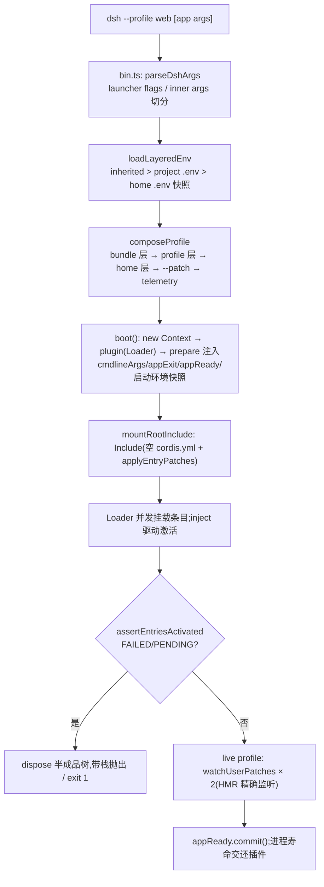
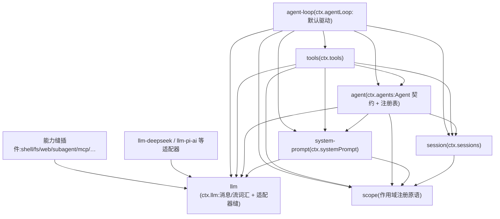

# 第一章:软件架构与程序入口(DeepSeek Harness 源码分析)

> 分析对象:[innokria/deepseek-harness](https://github.com/innokria/deepseek-harness) @ `dbbaa4a37`
> 核心源码:`apps/cli/src/`(启动器)+ `packages/boot/`(app-boot / cmdline 启动胶)+ `vendor/`(vendored Cordis:core / loader / include / hmr)+ `packages/core/`(产品 API 主干)
> **深入阅读(函数级)**:[`plugin-system/`](./plugin-system/README.md) —— Cordis 运行时对象关系、Context 代理与 fiber 六状态机、Loader 事务回滚与 HMR、能力缝三列解剖、全仓扩展点目录、插件编写指南
> 设计依据:`docs/architecture.md`、`docs/cordis-primer.md`、`packages/README.md`、`vendor/README.md`、各 bundle 的 `cordis.patch.yml`

---

## 第〇节 一句话结论与总览

DeepSeek Harness(dsh)是**一个"一切皆插件"的 Cordis 应用**:没有可打补丁的特权内核(`docs/architecture.md:13`),模型适配器、工具注册表、会话日志乃至 agent 主循环本身都是普通 Cordis 插件,从配置组装、可从配置替换。程序入口收敛为唯一一条命令——`dsh --profile <name>`:启动器把一份**空的 `cordis.yml` 根**与若干层 patch(bundle 层 → profile 用户层 → home 层 → `--patch` 叠加层)合成一棵 Loader 条目树,交由 vendored Cordis Loader 按**服务可用性**(而非行序)并发激活;激活完毕的树上,`ctx.llm` / `ctx.tools` / `ctx.sessions` / `ctx.systemPrompt` / `ctx.agents` 等核心服务就绪,能力缝(capability seam)插件与 agent-loop 挂在其上运行。

关键架构事实:

1. **单一启动口**。仓库规则明确:"Only `dsh` profiles launch supported Node apps"(`AGENTS.md:9`),`dsh web` 只是 `--profile web` 的硬编码别名(`apps/cli/src/args.ts:175`),SDK/ACP 也是 profile 而非独立可执行文件(`apps/cli/README.md` 开头)。
2. **配置即组合**。一个运行中的 dsh 是"启动时从有序层叠组装出的插件树"(`docs/architecture.md:17`):bundle 是"Cordis 配置行 + 其所挂载代码"的分发格式(`docs/architecture.md:21`),层叠结果是纯数据(patch 列表),启动器自身不含任何产品行为。
3. **加载顺序由依赖决定,不由行序决定**。Loader 条目并发挂载,插件声明的 `inject` 服务不齐则 fiber 停在 PENDING;`dsh-base` 的 patch 文件自述:"Row order carries no load semantics (activation is service-availability driven)"(`packages/bundle/base/cordis.patch.yml:13`)。
4. **框架层完全自有**。Cordis 及其基础库被源码级 vendor 进 `vendor/` 并重定名到 `@deepseek-ai/*` 作用域(`vendor/README.md:5`),累计 19 条记录在案的本地修改(fiber 生命周期加固、事务化 Loader/Include 协调、HMR 精确配置监听等),harness 完全拥有自己的框架层。
5. **应用形态只有三种入口**:`apps/cli`(dsh 启动器,web/headless/sdk/sdk-minimal/acp 五种出厂 profile)、`apps/web`(Vite 浏览器壳,由 `dsh web` 的 host 半服务)、`apps/desktop`(Electron 壳,不开任何监听端口,以 `dsh-app://` + 帧字节管道替代 Web 服务器)。

```text
                        ┌────────────────────────────────────────────────────┐
                        │  apps/cli  dsh 启动器(bin.ts → args.ts)           │
                        │  dsh web | --profile <name> [--patch f] [app args] │
                        └───────────────────────┬────────────────────────────┘
                                                v
                        ┌────────────────────────────────────────────────────┐
                        │  packages/boot                                     │
                        │  cmdline: 提供 ctx.cmdlineArgs / appExit / appReady│
                        │  app-boot: 分层 .env → profile/bundle patch 合成   │
                        │           → boot() 建 Context → 装 Loader          │
                        └───────────────────────┬────────────────────────────┘
                                                v
                        ┌────────────────────────────────────────────────────┐
                        │  vendor: Cordis Loader + Include                    │
                        │  空根 cordis.yml + applyEntryPatches(层叠 patch)   │
                        │  → 并发挂载条目 → inject 服务到位即激活 fiber        │
                        └───────────────────────┬────────────────────────────┘
                                                v
              ┌─────────────────────────────────────────────────────────────┐
              │  核心服务(dsh-base 层插装的 ctx 键,packages/core 等)         │
              │  ctx.llm ─ ctx.sessions ─ ctx.systemPrompt ─ ctx.tools ─     │
              │  ctx.agents ─ ctx.agentLoop ─ ctx.loader/hmr/typert ...      │
              └───────────────┬─────────────────────────────┬───────────────┘
                              v                             v
              ┌───────────────────────────┐ ┌───────────────────────────────┐
              │ 能力缝插件(shell/fs/web/   │ │ agent-loop(ReactLoopAgent)  │
              │ subagent/skill/mcp/…=      │ │ turn → step: assemble 提示   │
              │ Service Definition/Provider│ │ → llm.stream → tool/call →   │
              │ /Consumer 三角色)          │ │ 结果回流,全程落会话日志     │
              └───────────────────────────┘ └───────────────────────────────┘
                              ▲                             ▲
        三种暴露面:  apps/web 浏览器壳(dsh web 伺服 dist) │ apps/desktop Electron
                     SDK JSON-RPC stdio(profile sdk)     │ ACP stdio(profile acp)
```

---

## 第一节 Monorepo 布局与包分组

仓库是 pnpm monorepo,`AGENTS.md:13-58` 的 Repository layout 段是权威地图。顶层结构:

- `vendor/` — vendored Cordis 源码(manifest 与同步流程在 `vendor/README.md`);
- `packages/<group>/<pkg>/` — 全部产品包,统一 `@deepseek-ai/dsh-*` 命名;
- `apps/` — 三个应用工程:`cli`、`web`、`desktop`(外加私有的 `desktop-host`);
- `python/`(Python SDK/runtime)、`native/`(node-addon)、`benchmarks/`、`.agents/`(Agent 工作流与决策记录)、`docs/`、`scripts/`、`website/`。

`packages/` 下按"能力族"分组,`packages/README.md:29-79` 的分组表是权威索引。与本章主线直接相关的组:

| 组 | 职责 | 出处 |
|---|---|---|
| `core/` | 产品 API 主干:session、system-prompt、tools、agent、agent-loop、scope | `packages/README.md:31`、`packages/core/README.md:26-38` |
| `boot/` | 共享 app-bin 启动胶:`app-boot`(profile/patch/Loader 驱动)与 `cmdline`(应用自有命令行),是**库**,由 `apps/cli` 导入,不是被组合挂载的插件 | `packages/boot/README.md:12,23-26` |
| `bundle/` | 可安装的 `dsh --profile` patch 层(base/web-app/headless/sdk-app/sdk-minimal/acp-app) | `packages/bundle/README.md:23-30` |
| `llm/` | LLM 能力族:提供方中立服务 + DeepSeek/pi-ai 适配器 + 重试 + token 计量 | `packages/llm/README.md:25-33` |
| `typert/` | 类型图生成器/加载器/运行时注册表,支撑 Host↔Client 类型化 Remote 调用 | `packages/typert/README.md:25-30` |
| `host/`、`client/` | Web GUI 的 host 半(API 网关 + HTTP 路由)与浏览器半(shell、wire、ui-* 插件) | `packages/README.md:75-76` |
| `sdk/`、`acp/` | 进程外 SDK(换行分隔 JSON-RPC)与自动化专用 ACP 服务器 | `packages/README.md:71-72` |
| 其余能力族 | shell、subprocess、fs、web、subagent、workflow、skill、lsp、terminal、compaction、settings、credentials、session、interaction…… | `packages/README.md:29-79` |

两条跨组约束直接塑造了依赖主干(`packages/README.md:93-95`):

1. **扩展插件只依赖 Service Definition,绝不依赖具体 Provider**——`dsh-agent-loop` 可替换,UI/hook/tool 插件用 `dsh-agent`;只有组合 bundle 可以依赖主干插件。
2. **能力缝三角色**:Service Definition / Service Provider / Consumer 构成一个完整的缝,单角色不成缝(`AGENTS.md:113`、`docs/architecture.md:127`)。

此外:`@deepseek-ai/cordis` 是每个 harness 包的 peerDependency(`AGENTS.md:104`),保证全进程单例 Cordis;仓库全量 ESM(`"type": "module"`,`AGENTS.md:105`);`dsh` CLI 源码启动走 `node --import tsx/esm`,所达模块必须保持 ESM(`AGENTS.md:105`)。

---

## 第二节 Cordis 插件系统核心概念

Cordis 是 dsh 之下的 vendored 插件框架(`docs/cordis-primer.md:5`)。`docs/cordis-primer.md:9-13` 用五条概括其模型,以下逐条落到 vendored 源码。

### 2.1 Context:服务仓库 + 代理

`Context` 是插件的依赖容器:`docs/cordis-primer.md:10`——"A context is a repository of services",服务占据稳定键 `ctx.tools`、`ctx.llm`、`ctx.sessions`,其他插件按键找服务而非 import 具体实现。源码上,`Context` 类(`vendor/cordis/src/context.ts:42`)的构造函数(`context.ts:71-80`)做了三件事:建立 isolate/intercept 映射、**用 `ReflectService.handler` 把自己包成 Proxy**(`context.ts:74`)、创建根 fiber 并安装 reflect/registry/events/logger 四个内建服务。

代理的意义:普通属性读走服务解析器。读一个未声明 `inject` 的服务键会直接抛错(`vendor/cordis/src/reflect.ts:144`:`cannot get property "<prop>" without inject`);已声明但服务未就绪则抛 `cannot get required service ... in inactive context`(`reflect.ts:159-161`)。这迫使每个插件诚实声明依赖。

### 2.2 插件与 Service

插件是"实现了 Service 语义的对象"(`docs/cordis-primer.md:9`):可以是带 `inject` 与 `apply(ctx)` 的函数,也可以是 `Service` 子类。`Service` 基类的构造函数(`vendor/cordis/src/service.ts:42-58`)在构造时即调用 `ctx.reflect.provide(name, self, this[Service.check])` **立刻注册服务**,且随所属 fiber 卸载自动注销(`service.ts:33-36` 的契约注释)。harness 侧约定(`packages/AGENTS.md`):服务包默认导出服务类;函数插件具名导出 `name`/`inject`/`Config`/`apply`,两者不可混用。

### 2.3 inject:以依赖表达加载顺序

`ctx.inject(deps, callback)` 是 `ctx.plugin({ inject, apply: callback })` 的语法糖(`vendor/cordis/src/registry.ts:169-176`):回调在所需服务可用时运行,服务变化时卸载重跑。机制在 fiber 层:fiber 构造后按 `inject` 逐个 `_checkImpl`(`vendor/cordis/src/fiber.ts:314-319`),`_refresh()`(`fiber.ts:611-623`)把注入键集合解析成 epoch——**任何一个注入服务缺席,epoch 置为 INACTIVE,fiber 停在 PENDING**;全部到位才 `_reload()` 进入 LOADING→ACTIVE(`fiber.ts:631-633`),服务变动则 `_unload()` 后按新 epoch 重建。这就是"行序无加载语义"的实现基础。

### 2.4 effect:可逆注册

仓库惯例第一条:"Registrations are effects"(`AGENTS.md:106`)。`ctx.effect()`(`vendor/cordis/src/fiber.ts:415-418`)立即执行 `execute`,收集其产出的全部 disposer;调用返回的 disposer、或 fiber 卸载时,按**逆序**执行清理,重复调用是 no-op;fiber 已在 UNLOADING 状态则抛 `INACTIVE_EFFECT`(`fiber.ts:419-422`)。提示段、工具 schema、适配器、监听器全部经 `ctx.effect()`/`ctx.on()` 安装,所以热重载与拆卸可以预测地回卷(`docs/cordis-primer.md:13`)。vendored 版对 fiber 生命周期做了专项加固(重入处置、UNLOADING 期拒绝新 effect 等,`vendor/README.md:38` 本地修改第 6 条)。

### 2.5 事件与瀑布

服务通过 TypeScript 声明合并声明事件名,以 `emit` / `waterfall` / `parallel` / `serial` / `bail` 五种模式分发(`docs/cordis-primer.md:17-25` 的对照表)。`waterfall` 是 around-中间件:监听器收 `(...args, next)`,调 `next()` 委托给下一服务,不调则短路(`docs/cordis-primer.md:31`)——harness 的规则是"Waterfall listeners MUST call `next()`"(`AGENTS.md:110`)。主循环的 `agent/pre-step`、`agent/request`、`llm/stream`、`tools/pre-execute` 等拦截点都是 waterfall(`docs/architecture.md:105`)。

### 2.6 Loader、Include 与 cordis.yml

`Loader`(`vendor/loader/src/index.ts:65`)是"owns a loader entry tree and imports configured plugins"的服务,构造时 `ctx.reflect.provide('loader', this, ...)` 自我注册(`loader/src/index.ts:90`),并通过 `internal/config` 监听器在 fiber 注入激活后才对条目的 `config` 做 `!!js` 表达式插值(`loader/src/index.ts:92-101`;树载体 Group/Include 保持字面量)。`Include` 提供条目表的 YAML 方言:`!!js` 标量往返为表达式节点,`entryListSchema`(`vendor/include/src/index.ts:9-23`)被导出,使 `dsh --dump-config` 与挂载用**同一解析器**,杜绝漂移。

配置合成的唯一算法是 `applyEntryPatches(data, patches, warn)`(`vendor/include/src/index.ts:58-128`):先 `structuredClone` 脱离输入,再顺序应用 patch——`insert` 追加行(无 id 追加到顶层;带 id 则要求目标是 group),其余 patch 按 `id` 定位行并整体替换字段;插入的行立即入索引,**同一列表中靠后的 patch 可以配置或禁用靠前的 patch 刚插入的行**(`include/src/index.ts:96-101`)。patch 命不中任何行只告警跳过(`include/src/index.ts:110-114`)。

### 2.7 HMR 与 Scope

HMR(`@deepseek-ai/cordis-plugin-hmr`,vendored)做模块级热替换;DSH 更常用其 `registerConfig()` 精确配置监听——监视单个绝对路径、串行化合并刷新、返回异步 disposer(`vendor/README.md:41` 本地修改第 9 条)。fiber 即 Cordis 的作用域原语:每个插件实例一棵 fiber,拥有自己的子 context、effect 集合与状态机(PENDING/LOADING/ACTIVE/UNLOADING/FAILED);`ctx.root` 指向全应用共享的根(`context.ts:22`)。harness 在其上叠加了 `packages/core/scope` 的"按 agent 的作用域注册"原语(`docs/architecture.md:66`),使 MCP 之类插件可挂到单个 Agent 的 `agent.ctx` 下。

---

## 第三节 应用启动链

### 3.1 入口:`bin.ts` 与 argv 裁决

`apps/cli/src/bin.ts:28-62` 的 `runCli()` 极薄:解析 argv、按模式分发——

```typescript
// apps/cli/src/bin.ts
export async function runCli(): Promise<void> {
  const invocation = parseDshArgs(process.argv.slice(2), readVersion())
  switch (invocation.mode) {
    case 'profile': {
      const { runProfile } = await import('./profile-boot.ts')
      await runProfile({
        environment: loadLayeredEnv('dsh'),
        profile: invocation.profile, ... args: invocation.args,
      })
      break
    }
    case 'plugin': { /* 转发 pnpm 管理 profile 插件 */ }
    case 'dump-config': { /* 不启动,直接打印合成树 */ }
  }
}
```

`parseDshArgs`(`apps/cli/src/args.ts:126-211`)确立了两条入口规则:

- **启动器只解析自己的旗标**(`--profile`、`--from-default-profile`、`--patch`、两个 dump);第一个不认识的 token 起,全部原样交给被启动的树——`dsh --profile tui --resume abc` 中 `--resume abc` 属于 app(`args.ts:1-16` 模块注释)。`web` 是 `--profile web` 的硬编码别名(`args.ts:175-188`),`plugin` 子命令在 profile 目录里转发 pnpm(`args.ts:190-201`)。
- profile 名 `desktop` 被保留给 Electron,CLI 拒绝其启动/dump/插件管理(`args.ts:68-72`)。

### 3.2 环境分层:`loadLayeredEnv`

在任何插件挂载前,`loadLayeredEnv`(`packages/boot/app-boot/src/index.ts:195-216`)产出本次运行**冻结的环境快照**:继承环境 > 调用目录 `.env` > Harness home `.env`;两份文件**先各自解析校验再应用**,且已存在的继承变量不被覆盖(`index.ts:204-209`)。文件不得设置引导级变量(`PATH`、`NODE_OPTIONS`、代理、CA、git 钩子、`DSH_*` 前缀等,`index.ts:93-117`),唯一豁免是 home 层可设代理(`HOME_LAYER_PROXY_NAMES`,`index.ts:126`)。随后 `runProfile` 用这份快照装 HTTP 代理(`apps/cli/src/profile-boot.ts:287-290`)——必须在任何请求发出前完成。

### 3.3 profile 与 bundle:配置组合

**profile** 是 Harness home 下的具名组合:`$DSH_HOME/profiles/<name>/` 内含 `package.json`(外挂插件依赖 + `dsh.profile` 清单:`bundles` 有序列表与 `patchReload` 生命周期)和 `cordis.patch.yml`(用户自己的 patch 层)(`docs/architecture.md:19`;`packages/boot/app-boot/src/profile.ts:1-13`)。**bundle** 是"Cordis 配置行 + 代码"的分发格式,在自己的 `package.json` 里用 `dsh.bundle.patch` 字段声明 patch 文件(`docs/architecture.md:21-23`)。

出厂模板(`profile.ts:105-126`):

```typescript
// packages/boot/app-boot/src/profile.ts
export const PROFILE_TEMPLATES: Record<string, ProfileTemplate> = {
  acp:      { bundles: ['@deepseek-ai/dsh-base', '@deepseek-ai/dsh-acp-app'],  patchReload: 'startup' },
  web:      { bundles: ['@deepseek-ai/dsh-base', '@deepseek-ai/dsh-web-app'],  patchReload: 'live' },
  headless: { bundles: ['@deepseek-ai/dsh-base', '@deepseek-ai/dsh-headless'], patchReload: 'startup' },
  sdk:      { bundles: ['@deepseek-ai/dsh-base', '@deepseek-ai/dsh-sdk-app'],  patchReload: 'startup' },
  'sdk-minimal': { bundles: ['@deepseek-ai/dsh-sdk-minimal'],                  patchReload: 'startup' },
}
```

`dsh-base` 是 web/headless/sdk/acp 四个 profile 的共享首层:模型适配器、工具、持久化、沙箱与审批策略、设置、凭据、遥测(`docs/architecture.md:25`);`dsh-sdk-minimal` 是有意的例外——一个 bundle 自带完整显式树,不应用 base(`docs/architecture.md:25`)。profile 缺失时按模板自动初始化(`profile.ts:820-828`);bundle 名**双锚点解析**,先 dsh 安装本体、后 profile 目录(`resolveBundleDir`,`profile.ts:746-757`),保证 `@deepseek-ai/dsh-base` 永远来自运行中的这份安装。

**层叠次序**(`docs/architecture.md:27`;代码在 `apps/cli/src/profile-boot.ts:226-244` 的 `composeProfile`):空条目表 ← 各 bundle patch(按 `dsh.profile.bundles` 序)← profile 的 `cordis.patch.yml` ← home 级 `$DSH_HOME/cordis.patch.yml` ← `--patch` 叠加层 ← 遥测开关派生 patch(`DSH_TELEMETRY_DISABLED` 非空即把 `session-telemetry-otel` 行置 `disabled`,`profile-boot.ts:167-170`)。根 `cordis.yml` 是每次启动**重写的空表**(`profile-boot.ts:84-91,190`),它存在于磁盘只是因为 Loader 需要一个真实文件锚定 `baseUrl`——整个组合都是 patch 层,防止 Loader 的树写回把合成结果固化进根文件(`profile-boot.ts:179-180` 注释)。

### 3.4 boot():从 Context 到整树就绪

核心在 `packages/boot/app-boot/src/index.ts:787-834`:

```typescript
// packages/boot/app-boot/src/index.ts
export async function boot(
  binName, absoluteConfigPath, patches?, prepare?, bareModuleBaseUrl?,
): Promise<Context> {
  const ctx = new Context()
  let stage = 'host preparation failed'
  try {
    ctx.baseUrl = pathToFileURL(dirname(absoluteConfigPath)).href + '/'
    ctx.provide('dshHomePath', dshHomePath)
    await ctx.plugin(Loader)                    // 1. 装 Loader 服务
    await prepare?.(ctx)                        // 2. 宿主准备(见 3.5)
    stage = 'plugin tree failed to load'
    await mountRootInclude(ctx, absoluteConfigPath, patches, bareModuleBaseUrl)
    await ctx.get('loader')?.await()            // 3. 等整树 settle
    if (ctx.get('loader') === undefined) return ctx   // 树在启动中被整体处置 = 正常退出
    await assertEntriesActivated(ctx, binName)  // 4. 最终激活审计
    return ctx
  } catch (cause) {
    await ctx.fiber.dispose()                   // 5. 失败:处置半成品上下文再抛
    ...
  }
}
```

`mountRootInclude`(`index.ts:516-559`)把静态导入的 Include 注册为 `ctx.loader.builtins.include`(`cordis:group` 一并注册,`index.ts:540`),以固定 id `include` 创建根条目,初始 patches 一次带入。Include 读入空根 `cordis.yml`,用 `applyEntryPatches` 一次性应用层叠 patch,得到最终条目树后由 Loader **并发挂载**:每个条目 import 插件模块、建 fiber,`inject` 不齐者挂起,服务注册动作级联唤醒——激活顺序是依赖图的拓扑序,不是文件行序。

**失败策略是 fail-loud**,三层叠加:

1. 插件模块解析失败 → `assertEntriesLoaded`(`index.ts:688-694`)点名;
2. fiber FAILED/PENDING → `assertEntriesActivated`(`index.ts:722-755`)逐个回收原始拒绝原因、pending 条目列出缺失服务名,汇总抛出;
3. 启动后才来的迟发未处理拒绝 → `installFailLoud`(`index.ts:639-679`)写一条带栈的诊断后 `exit(1)`,并先给终端属主最多 2s 的 `release` 窗口交还终端(`FAIL_LOUD_RELEASE_TIMEOUT_MS`,`index.ts:608`)。

### 3.5 启动期宿主注入与 live 重载

`runProfile`(`apps/cli/src/profile-boot.ts:282-391`)给 `boot()` 的 `prepare` 回调在**任何条目挂载前**注入启动器事实:启动环境快照(`profile-boot.ts:340`)、`provideCmdline` 提供的 `ctx.cmdlineArgs` / `ctx.appExit` / `ctx.appReady`(`profile-boot.ts:343-347`;`packages/boot/cmdline/src/index.ts:84-89`)。应用插件随后 `inject: [cmdlineArgs]` 即可自己解析 argv 快照、拥有自己的 `--help`(`cmdline/src/index.ts:165-186` 的 `parseCmdline`)——"没有行拥有启动器级命令行地位"(`cmdline/src/index.ts:14`)。

boot 完成后,`patchReload: 'live'` 的 profile(`web` 与自定义 profile)安装两个 `watchUserPatches` 监听(profile 层与 home 层,`profile-boot.ts:372-381`):文件变化 → 重新分层合成 `composeLive()`(`profile-boot.ts:328-333`,bundle 层在下、overlay 在上,用户编辑永远无法顶掉它们)→ 经 HMR `registerConfig` 回调对根 Include 做事务化 `entry.update`。若组合没挂 HMR 服务,启动器补挂一个 `root: []` 的仅监听实例(`profile-boot.ts:366-371`)。`headless`/`sdk`/`acp` 用 `startup`:所有层只在启动时应用一次,因为"替换一个已经占有工作的一次性或 stdio 应用的依赖会使其生命周期失效"(`docs/architecture.md:29`)。进程寿命交还插件:SIGTERM 退出 0、SIGINT 退出 130(`profile-boot.ts:309-310`),`ctx.appExit(code)` 走有界关闭。



---

## 第四节 三种应用形态与 SDK/ACP 暴露面

### 4.1 apps/cli:唯一启动器

`dsh` 命令是**唯一受支持的 Node 应用启动器**(`apps/cli/README.md` 开头;"Only `dsh` profiles launch supported Node apps",`AGENTS.md:9`)。出厂应用全部是 profile:`dsh web`、`dsh --profile headless|sdk|sdk-minimal|acp`(`docs/architecture.md:43`);`verify-application-entrypoints` 脚本把每个 package bin 归入显式类别,拒绝任何绕过 `dsh` 的 Node 应用路径(`docs/architecture.md:45`)。Python SDK 同构:runtime wheel 打包同一个 `dsh`,客户端默认以 `dsh --profile sdk` 启动并显式指定 Harness home(`docs/architecture.md:47`)。

### 4.2 apps/web:Vite 浏览器壳,不是独立应用

`apps/web` 只是"Web 应用入口:`@deepseek-ai/dsh-client-web` shell 库之上的 vite 构建;dist/ 由 apps/cli 的 `dsh web` 伺服"(`apps/web/package.json:3`)。浏览器入口只有六行(`apps/web/src/main.ts:1-6`):`new AppWebEntry(document.getElementById('root')).run()`。真正的组合在 `dsh-web-app` bundle 层(`packages/bundle/web-app/cordis.patch.yml`):`web-startup` 插件解析 Web 应用自有旗标并提供 `webStartup` 服务;`webserver` 行 `inject: [webStartup]`,以 `!!js ctx.webStartup.port ?? 3080` 决定绑定(`web-app/cordis.patch.yml:135-141`)——因此 `dsh --profile web --help` 不绑定任何端口(`web-app/cordis.patch.yml:8-13` 注释)。`dsh.client` 行构成浏览器插件花名册:其 node 半扫描该树、组装 `window.__DSH_BOOT__` 并以 `/plugins/<id>/client.js` 伺服各客户端模块(`web-app/cordis.patch.yml:172-173`)。默认绑定 `127.0.0.1:3080`,本地启动后打开浏览器(`README.md:231`)。

### 4.3 apps/desktop:无端口的 Electron 壳

Desktop 是"Electron shell around the dsh Web UI",**不开任何监听端口**:被打包的上游 Node.js 子进程启动已安装的 dsh 工程,带版本帧的字节管道承载 Fetch 请求与流式响应,Node IPC 只传生命周期控制,`dsh-app://` 协议伺服匹配版本的客户端资产(`apps/desktop/README.md` 开头;`docs/architecture.md:51-53`)。关键形态事实:

- Electron 独占 `$DSH_HOME/profiles/desktop`(单实例锁先于任何 profile 访问),CLI 不能启动或改动它——与 CLI 参数层的 `rejectElectronProfile` 互为表里;
- Electron 与其携带的 `@deepseek-ai/dsh` **永远同版本**,一次 dsh 升级即一次 Desktop 发布;
- shell、dsh 运行时、Node.js、pnpm 构成一个签名更新单元;核心包全部随 `resources/dsh` 携带,profile 只装外部插件。

### 4.4 SDK 与 ACP:进程外暴露面

- **SDK**(`packages/sdk/`):让另一个进程经**换行分隔 JSON-RPC** 驱动完整 harness 运行时。三件套:`protocol/`(线协议)、`client/`(TypeScript 客户端,孵化运行时子进程)、`server/`(`jsonrpc` 插件,经 stdio 服务进程外客户端)(`packages/sdk/README.md`)。`dsh-sdk-app` bundle 在 base 之上挂 SDK 服务器;`sdk-minimal` 是仓库自持的独立小组合。TypeScript 与 Python 客户端讲同一协议。
- **ACP**(`packages/acp/`):自动化专用 Agent Client Protocol 服务器——程序可创建/列出/恢复/关闭会话、挂标准 MCP 服务器、选模型、发文本与图片提示、收语义更新、答权限提示、取消工作(`packages/acp/README.md`)。`dsh-acp-app` bundle 把它挂在 base 之上。

两种暴露面共享同一启动链与同一 base 组合,区别只在最上层的应用 bundle——这正是"形态 = profile"架构的兑现。

---

## 第五节 模块依赖主干

依赖图由 `scripts/gen-module-graph.ts` 生成并保鲜门禁于 CI(`packages/README.md:93`);`docs/module-graph.md:6` 说明其语义:只画 `@deepseek-ai/dsh-*` 包之间的 **peer 依赖**(消费者要求共享实例),`a --> b` 表示 a 把 b 声明为 peer。主干事实(边均出自 `docs/module-graph.md`):



- `agent-loop` 的 peer 集是主干的最大扇入:`agent、llm、scope、session、session-persistence、session-projection、settings、system-prompt、tools`(`docs/module-graph.md:705-714`)——默认驱动装配整个主干。
- `agent --> session/system-prompt/scope/llm`(`:466-468`)、`tools --> agent/llm/scope/session/system-prompt`(`:635-641`)、`system-prompt --> llm/scope`(`:410-411`)、`session --> scope`(`:408`)。注意方向:**`dsh-agent` 拥有公开 `Agent` 契约,`agent-loop` 只是默认实现**,扩展插件依赖前者,驱动保持可替换(`packages/core/README.md:38`)。
- `llm` 是全图最大的汇聚点:几十个包 peer 到它——适配器(`llm-deepseek --> llm` `:512`、`llm-pi-ai --> llm` `:520`)、工具(`tool-bash/tool-fs/tool-web/tool-subagent/…`)、ACP(`:909`)、SDK(`:1112,1149,1154`)、MCP 客户端(`:829`)。原因:`llm` 包定义了"每个插件与会话日志都使用的消息、内容块、流块词汇"(`packages/llm/README.md:12`)。
- Typert 组(generator/loader/protocol/registry,`packages/typert/README.md:25-30`)支撑 Web/Desktop 的 Host↔Client 类型化 Remote 调用:`registry` 提供 `ctx.typert`,`loader` 在 Loader 组合中自动注册生成的类型构件——`dsh-base` 中的 `typert`、`typert-loader`、`typert-gateway` 三行(`packages/bundle/base/cordis.patch.yml:39-46`)即此链在组合中的落点。

主循环行为层(`docs/architecture.md:82-113`):**turn**(零或多 step)与 **step**(一次模型请求 + 其触发的工具)是执行单位;每 step 重新组装提示段与工具 schema、投影运行时上下文,经 `agent/pre-step`(可改写/拒绝)→ `agent/request`/`prepareCall` 定路由 → 冻结模型历史 → `llm/stream` 流式请求 → `tool/call` 经 `tools/pre-execute` → `tools/execute` → `tools/post-execute` 管道。贯穿不变式是"**模型可见 ⟺ 已落日志**":任何到达模型请求的内容必须可从会话日志重建,新模型可见输入要求新会话事件(`docs/architecture.md:121`;`AGENTS.md:111`)。

---

## 第六节 关键文件索引表

| 文件 | 职责 |
|---|---|
| `AGENTS.md` | 仓库布局、启动规则、全部约定(一切皆插件、注册即 effect、模型可见⟺已落日志) |
| `docs/architecture.md` | 架构地图:profile/bundle、应用启动、核心包、turn flow、能力缝、扩展点表 |
| `docs/cordis-primer.md` | Cordis 五概念、分发模式、waterfall 语义、Loader 配置(`!!js`) |
| `packages/README.md` | 包分组权威索引;依赖规则(依赖 Definition 不依赖 Provider) |
| `vendor/README.md` | vendored Cordis manifest、19 条本地修改记录、同步流程 |
| `vendor/cordis/src/context.ts` | `Context` 类:代理化、根 fiber、内建服务安装 |
| `vendor/cordis/src/fiber.ts` | fiber 状态机、`effect()` 可逆注册、inject 驱动的激活(`_refresh`) |
| `vendor/cordis/src/service.ts` | `Service` 基类:构造即注册、随 fiber 卸载 |
| `vendor/cordis/src/reflect.ts` | 服务解析代理;无 inject 读服务即抛错 |
| `vendor/cordis/src/registry.ts` | `ctx.plugin()` / `ctx.inject()`、插件运行时注册表 |
| `vendor/loader/src/index.ts` | `Loader` 服务:条目树、`!!js` 惰性插值、自处置写回 |
| `vendor/include/src/index.ts` | cordis.yml 方言(`entryListSchema`)与 `applyEntryPatches` 合成算法 |
| `packages/boot/app-boot/src/index.ts` | `boot()`、根 Include 挂载、分层 `.env`、fail-loud 三层、patch 解析、`--dump-config` 渲染 |
| `packages/boot/app-boot/src/profile.ts` | profile 发现/初始化、bundle 双锚点解析、层叠合成(`composeEntries`)、模块 fallback 修复 |
| `packages/boot/cmdline/src/index.ts` | `cmdlineArgs`/`appExit`/`appReady` 提供、`parseCmdline`、stdio EOF 关闭 |
| `apps/cli/src/bin.ts` | `runCli()`:argv 裁决与模式分发 |
| `apps/cli/src/args.ts` | `parseDshArgs`:启动器旗标语法、`web` 别名、`plugin` 子命令、desktop 保留 |
| `apps/cli/src/profile-boot.ts` | `runProfile()`:层叠合成、boot、live patch 监听、信号与有界关闭 |
| `packages/bundle/base/cordis.patch.yml` | `dsh-base` 全量行:核心服务、能力缝默认 Provider、平台门控(bash/pwsh) |
| `packages/bundle/web-app/cordis.patch.yml` | Web 层:`webStartup` 服务、`webserver` 绑定、浏览器插件花名册(`__DSH_BOOT__`) |
| `apps/web/src/main.ts` | 浏览器入口(6 行,委托 `dsh-client-web` 的 `AppWebEntry`) |
| `apps/desktop/README.md` | Desktop 形态决策表:无端口、版本一体、profile 独占 |
| `packages/core/README.md` | 主干包表与 `ctx` 键;`agent` 契约 vs `agent-loop` 实现的分工 |
| `packages/llm/README.md`、`packages/typert/README.md` | LLM 能力族与 Typert 组地图(架构图数据源) |
| `docs/module-graph.md` | 生成的 peer 依赖主干(CI 保鲜) |
| `packages/sdk/README.md`、`packages/acp/README.md` | 进程外暴露面:JSON-RPC SDK 与 ACP 自动化服务器 |

---

## 附:入口与组合速查

| 问题 | 一句话答案 | 出处 |
|---|---|---|
| 进程从哪开始? | `apps/cli/src/bin.ts` 的 `runCli()`,唯一启动器 | `bin.ts:28`、`AGENTS.md:9` |
| 树由什么组成? | 空根 + bundle 层 + profile 层 + home 层 + `--patch`,一次 `applyEntryPatches` | `profile-boot.ts:226-244`、`include/src/index.ts:58` |
| 行序决定加载顺序吗? | 不;`inject` 服务可用性驱动,fiber 缺依赖即 PENDING | `base/cordis.patch.yml:13`、`fiber.ts:611-623` |
| 如何看到本机的树? | `dsh --profile web --dump-config`(与 boot 同一合成路径) | `docs/architecture.md:31-37` |
| 如何替换任一行为? | 写一层 patch 指向行 id,或 `insert` 新行挂自己的插件 | `docs/architecture.md:27` |
| 新行为加在哪? | 文档化扩展点(`ctx.tools`/`ctx.llm`/`agent/*`/`tools/*` 等),不改主循环 | `docs/architecture.md:137-158` |
