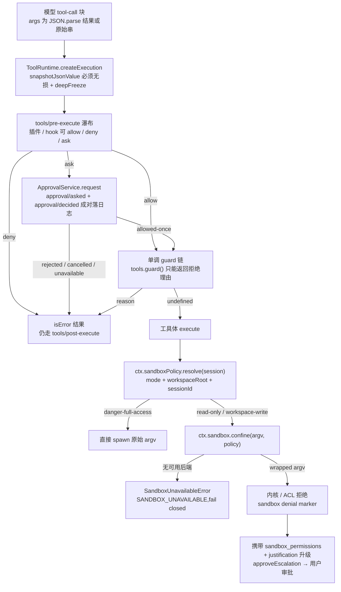

# 第二章:安全分析(DeepSeek Harness 源码分析)

> 分析对象:DeepSeek Harness @ `dbbaa4a37`,pnpm monorepo,仓库根 `../deepseek-harness/`
> 项目自身的安全声明见 [`SAFETY.md:7`](https://github.com/deepseek-ai/deepseek-harness/blob/dbbaa4a37fb9098aba814c97d2956f7b2f105f46/SAFETY.md#L7)(未做安全审计、不得当作生产可用)与 [`SAFETY.md:11`](https://github.com/deepseek-ai/deepseek-harness/blob/dbbaa4a37fb9098aba814c97d2956f7b2f105f46/SAFETY.md#L11)(沙箱与审批降低风险,但不保证隔离)。

---

## 第零节 一句话结论

DSH 的安全模型是**分层降级 + 处处 fail-closed**:文件效应由内核级沙箱(或 Windows ACL 受限令牌)按"每次调用携带的策略"约束,任何后端不可用都拒绝执行而不是放行([`packages/sandbox/sandbox/src/index.ts:152`](https://github.com/deepseek-ai/deepseek-harness/blob/dbbaa4a37fb9098aba814c97d2956f7b2f105f46/packages/sandbox/sandbox/src/index.ts#L152));越权只能经用户审批的一次性升级([`packages/sandbox/sandbox/src/escalation.ts:157`](https://github.com/deepseek-ai/deepseek-harness/blob/dbbaa4a37fb9098aba814c97d2956f7b2f105f46/packages/sandbox/sandbox/src/escalation.ts#L157));工具调用在沙箱之前还有两道门——可扩展的 `tools/pre-execute` 瀑布与只能否决、不能放行的单调 guard 链([`packages/core/tools/src/index.ts:704`](https://github.com/deepseek-ai/deepseek-harness/blob/dbbaa4a37fb9098aba814c97d2956f7b2f105f46/packages/core/tools/src/index.ts#L704))。真正超出这些边界的,是**沙箱之外以完整权限运行的代码**:MCP 服务器命令、hook 命令、以及作为代码装载的插件与 preset 组合。

---

## 第一节 系统接触哪些信息、如何被使用

### 1.1 凭据:配置只持有"引用",值由 provider 独占

凭据接缝被刻意拆成两个键空间([`packages/credentials/credentials/src/index.ts:154`](https://github.com/deepseek-ai/deepseek-harness/blob/dbbaa4a37fb9098aba814c97d2956f7b2f105f46/packages/credentials/credentials/src/index.ts#L154)):`CredentialRef` 回答"这个环境变量名背后是什么",`CredentialKey` 回答"这个插件为这个 id 持有什么"。配置面永远看不到值——`describe()` 返回的是存在性、来源层、可写性:

```ts
// packages/credentials/credentials/src/index.ts:191
abstract describe(ref: CredentialRef): Promise<CredentialInfo>
```

`resolve()` 是**每次操作重新解析**的([`packages/credentials/credentials/src/index.ts:176`](https://github.com/deepseek-ai/deepseek-harness/blob/dbbaa4a37fb9098aba814c97d2956f7b2f105f46/packages/credentials/credentials/src/index.ts#L176)),这既是热更新语义,也意味着密钥不会在插件里被长期缓存。引用名本身也受语法约束,凡是要走 shell 或子进程的名字都要先过这道闸:

```ts
// packages/credentials/credentials/src/index.ts:19
const REF_PATTERN = /^[A-Za-z_][A-Za-z0-9_]*$/

// packages/credentials/credentials/src/index.ts:29
export function credentialRef(value: string): CredentialRef {
  if (!isCredentialRefName(value)) {
    throw new TypeError(`credential ref "${value}" must match ${String(REF_PATTERN)}`)
  }
  return brandString<CredentialRef>(value)
}
```

键空间用 `/` 分隔 `<scope>/<id>`([`packages/credentials/credentials/src/index.ts:21`](https://github.com/deepseek-ai/deepseek-harness/blob/dbbaa4a37fb9098aba814c97d2956f7b2f105f46/packages/credentials/credentials/src/index.ts#L21)),两个域名各自要求小写连字符标识符,因此记录键不可能与引用名混淆。一条跨实现的不变量:空值等同于不存在——`resolve` 跳过、`describe` 报未配置([`packages/credentials/credentials/src/index.ts:159`](https://github.com/deepseek-ai/deepseek-harness/blob/dbbaa4a37fb9098aba814c97d2956f7b2f105f46/packages/credentials/credentials/src/index.ts#L159))。

本地 provider 的信任分层写在文件头([`packages/credentials/credentials-local/src/index.ts:1`](https://github.com/deepseek-ai/deepseek-harness/blob/dbbaa4a37fb9098aba814c97d2956f7b2f105f46/packages/credentials/credentials-local/src/index.ts#L1)):

```text
inherited process environment      (read-only, wins)
> $DSH_HOME/.credentials.yaml      (provider-managed, writable)
> <invocation cwd>/.env            (read-only fallback)
> $DSH_HOME/.env                   (read-only fallback)
```

落盘位置固定为 harness home 下的 `.credentials.yaml`([`packages/credentials/credentials-local/src/index.ts:61`](https://github.com/deepseek-ai/deepseek-harness/blob/dbbaa4a37fb9098aba814c97d2956f7b2f105f46/packages/credentials/credentials-local/src/index.ts#L61)),写路径在跨进程文件锁内做"只改自己那条 key"的补丁式写入,并先 `mkdir(..., { mode: 0o700 })`([`packages/credentials/credentials-local/src/index.ts:674`](https://github.com/deepseek-ai/deepseek-harness/blob/dbbaa4a37fb9098aba814c97d2956f7b2f105f46/packages/credentials/credentials-local/src/index.ts#L674)、[`packages/credentials/credentials-local/src/index.ts:683`](https://github.com/deepseek-ai/deepseek-harness/blob/dbbaa4a37fb9098aba814c97d2956f7b2f105f46/packages/credentials/credentials-local/src/index.ts#L683))。被上层环境遮蔽时写入直接拒绝,而不是"看起来写成功、解析仍是旧值"([`packages/credentials/credentials/src/index.ts:195`](https://github.com/deepseek-ai/deepseek-harness/blob/dbbaa4a37fb9098aba814c97d2956f7b2f105f46/packages/credentials/credentials/src/index.ts#L195))。

### 1.2 环境变量:不可变启动快照 + 每个子进程清洗

环境不通过扁平化的 `process.env` 读取,而是一个**记录来源层的不可变快照**([`packages/util/launch-environment/src/index.ts:37`](https://github.com/deepseek-ai/deepseek-harness/blob/dbbaa4a37fb9098aba814c97d2956f7b2f105f46/packages/util/launch-environment/src/index.ts#L37)),层顺序在 [`packages/util/launch-environment/src/index.ts:19`](https://github.com/deepseek-ai/deepseek-harness/blob/dbbaa4a37fb9098aba814c97d2956f7b2f105f46/packages/util/launch-environment/src/index.ts#L19) 固定为 `process > project-env > user-env`。这个快照同时用于凭据解析与 SSH 判定,且明确限定 SSH 只能由继承层建立([`packages/util/launch-environment/src/index.ts:125`](https://github.com/deepseek-ai/deepseek-harness/blob/dbbaa4a37fb9098aba814c97d2956f7b2f105f46/packages/util/launch-environment/src/index.ts#L125))。

所有子进程的基准环境由同一个函数产出:

```ts
// packages/subprocess/subprocess/src/index.ts:45
export const SENSITIVE_ENV_PATTERN = /KEY|PASSWORD|SECRET|TOKEN/i

// packages/subprocess/subprocess/src/index.ts:64
export function scrubbedParentEnv(): Record<string, string> {
  const env: Record<string, string> = {}
  for (const [key, value] of Object.entries(process.env)) {
    if (value !== undefined && !SENSITIVE_ENV_PATTERN.test(key) && !key.toUpperCase().startsWith(DSH_ENV_PREFIX)) env[key] = value
  }
  ...
}
```

即:**凭据形状的名字与全部 `DSH_*` 默认不外泄,显式 `env` 在清洗之后合并才放行**([`packages/subprocess/subprocess-local/src/spawn.ts:46`](https://github.com/deepseek-ai/deepseek-harness/blob/dbbaa4a37fb9098aba814c97d2956f7b2f105f46/packages/subprocess/subprocess-local/src/spawn.ts#L46),Windows 上按环境名大小写不敏感做去重覆盖)。上面代码块中省略的尾段(代理重放与返回):

```ts
// packages/subprocess/subprocess/src/index.ts:69-77
  // A child Node ignores the inherited proxy variables unless the flag this adds is set, so an MCP
  // stdio server or subagent CLI would connect directly while its parent proxies. The same overlay
  // restores each proxy name to what the user exported, undoing this process's own normalization —
  // `undefined` removes a name the user never set.
  for (const [name, value] of Object.entries(proxyEnvironmentForChild())) {
    if (value === undefined) Reflect.deleteProperty(env, name)
    else env[name] = value
  }
  return env
}
```

### 1.3 会话数据:模型可见 ⟺ 已落日志

会话事件日志是唯一权威来源,"模型可见 ⟺ 已落日志"是仓库级约定(`deepseek-harness/AGENTS.md`)。安全相关的是两条投影:**沙箱模式**与**审批策略**都是 log-only 事件 + 投影折叠:

- `sandbox/mode` 事件耐久可重放,但**不进模型转录**([`packages/sandbox/sandbox-policy/src/session-mode.ts:33`](https://github.com/deepseek-ai/deepseek-harness/blob/dbbaa4a37fb9098aba814c97d2956f7b2f105f46/packages/sandbox/sandbox-policy/src/session-mode.ts#L33));
- `approval/policy` 同理([`packages/interaction/user-approval/src/index.ts:33`](https://github.com/deepseek-ai/deepseek-harness/blob/dbbaa4a37fb9098aba814c97d2956f7b2f105f46/packages/interaction/user-approval/src/index.ts#L33)),模型通过运行时上下文快照获知当前策略,而不是改写稳定的 system prompt 缓存前缀([`packages/interaction/user-approval/src/index.ts:155`](https://github.com/deepseek-ai/deepseek-harness/blob/dbbaa4a37fb9098aba814c97d2956f7b2f105f46/packages/interaction/user-approval/src/index.ts#L155))。

模型实际看到的安全叙事只有三句渲染文本:当前文件策略([`packages/sandbox/sandbox-policy/src/index.ts:41`](https://github.com/deepseek-ai/deepseek-harness/blob/dbbaa4a37fb9098aba814c97d2956f7b2f105f46/packages/sandbox/sandbox-policy/src/index.ts#L41))、审批策略([`packages/interaction/user-approval/src/index.ts:66`](https://github.com/deepseek-ai/deepseek-harness/blob/dbbaa4a37fb9098aba814c97d2956f7b2f105f46/packages/interaction/user-approval/src/index.ts#L66) 与 [`packages/interaction/user-approval/src/index.ts:68`](https://github.com/deepseek-ai/deepseek-harness/blob/dbbaa4a37fb9098aba814c97d2956f7b2f105f46/packages/interaction/user-approval/src/index.ts#L68))。`never` 策略下这句话是明确的:需要审批的动作会被自动拒绝,不要再请求升级。

### 1.4 identity 与遥测:匿名、可删除、默认不上传

匿名 id 是 harness home 内的随机 UUID,文件为 `.anonymous-user-id`([`packages/identity/anonymous-user-id/src/index.ts:29`](https://github.com/deepseek-ai/deepseek-harness/blob/dbbaa4a37fb9098aba814c97d2956f7b2f105f46/packages/identity/anonymous-user-id/src/index.ts#L29)),文件头明确声明**不由主机名、网络地址、git remote 或任何识别源派生**([`packages/identity/anonymous-user-id/src/index.ts:1`](https://github.com/deepseek-ai/deepseek-harness/blob/dbbaa4a37fb9098aba814c97d2956f7b2f105f46/packages/identity/anonymous-user-id/src/index.ts#L1));删除文件即下次启动换新身份,写失败也只在内存里保一个一致 id([`packages/identity/anonymous-user-id/src/index.ts:68`](https://github.com/deepseek-ai/deepseek-harness/blob/dbbaa4a37fb9098aba814c97d2956f7b2f105f46/packages/identity/anonymous-user-id/src/index.ts#L68))。

遥测采集侧把脱敏做成**扩展点而不是内置规则**:

```ts
// packages/session/session-telemetry/src/index.ts:43
'session-telemetry/record'(record: SessionTelemetryRecord, next: () => SessionTelemetryRecord): SessionTelemetryRecord
```

注释里的口径很直接:它**不自带任何规则**,没有监听器时记录原样送出,所以"导出数据有多干净,取决于部署挂了什么规则";抛异常的监听器会扣下那一条记录(fail-closed),但绝不改写 canonical log([`packages/session/session-telemetry/src/index.ts:24`](https://github.com/deepseek-ai/deepseek-harness/blob/dbbaa4a37fb9098aba814c97d2956f7b2f105f46/packages/session/session-telemetry/src/index.ts#L24))。OTel provider 默认模式是 `FEEDBACK_ONLY`([`packages/session/session-telemetry-otel/src/index.ts:52`](https://github.com/deepseek-ai/deepseek-harness/blob/dbbaa4a37fb9098aba814c97d2956f7b2f105f46/packages/session/session-telemetry-otel/src/index.ts#L52)),端点必须在加载期给出且只接受 http(s)([`packages/session/session-telemetry-otel/src/index.ts:177`](https://github.com/deepseek-ai/deepseek-harness/blob/dbbaa4a37fb9098aba814c97d2956f7b2f105f46/packages/session/session-telemetry-otel/src/index.ts#L177)、[`packages/session/session-telemetry-otel/src/index.ts:188`](https://github.com/deepseek-ai/deepseek-harness/blob/dbbaa4a37fb9098aba814c97d2956f7b2f105f46/packages/session/session-telemetry-otel/src/index.ts#L188))。

### 1.5 模型上下文里的安全叙事由策略渲染器独占

进入模型请求的安全事实不是随处拼接的字符串,而是一个按模式分支的渲染函数,刻意**只描述策略、不盘点挂了哪些能力**:

```ts
// packages/sandbox/sandbox-policy/src/index.ts:41
function renderPolicyContext(policy: SandboxExecutionPolicy): string {
  switch (policy.mode) {
    case 'read-only':
      return 'Current DSH file policy: read-only. Any available operation enforced by the DSH file sandbox cannot modify files in the standing mode. Do not refuse a required modification from this policy alone: try an available tool normally and follow any denial and escalation guidance it returns.'
    case 'workspace-write':
      return `Current DSH file policy: workspace-write. Any available operation enforced by the DSH file sandbox may modify files under the session workspace: ${JSON.stringify(policy.workspaceRoot)}. Some platform temporary areas may also be writable.`
    case 'danger-full-access':
      return 'Current DSH file policy: danger-full-access. The DSH file sandbox does not restrict file modifications by available operations.'
  }
}
```

它作为 `systemPrompt.context` 段落注册,并按会话即时求值([`packages/sandbox/sandbox-policy/src/index.ts:140`](https://github.com/deepseek-ai/deepseek-harness/blob/dbbaa4a37fb9098aba814c97d2956f7b2f105f46/packages/sandbox/sandbox-policy/src/index.ts#L140)),因此模式切换不需要重写稳定前缀。这条设计的意图是让模型**先照常尝试**,再由真实的拒绝与升级提示纠偏——而不是让模型凭策略文本自行推断该不该干活。模板中嵌入的 `workspaceRoot` 经过 `JSON.stringify`([`packages/sandbox/sandbox-policy/src/index.ts:46`](https://github.com/deepseek-ai/deepseek-harness/blob/dbbaa4a37fb9098aba814c97d2956f7b2f105f46/packages/sandbox/sandbox-policy/src/index.ts#L46)),路径里的引号与控制字符不会破坏提示词结构。

### 1.6 数据流出面

| 流出面 | 承载内容 | 位置 |
|---|---|---|
| 模型上下文 | system prompt 段落 + 运行时上下文(沙箱策略、审批策略)、会话消息、工具结果 | [`packages/sandbox/sandbox-policy/src/index.ts:140`](https://github.com/deepseek-ai/deepseek-harness/blob/dbbaa4a37fb9098aba814c97d2956f7b2f105f46/packages/sandbox/sandbox-policy/src/index.ts#L140), [`packages/interaction/user-approval/src/index.ts:155`](https://github.com/deepseek-ai/deepseek-harness/blob/dbbaa4a37fb9098aba814c97d2956f7b2f105f46/packages/interaction/user-approval/src/index.ts#L155) |
| 本地持久化 | 会话 JSONL、`.credentials.yaml`、`.anonymous-user-id`、settings/preset 文件 | [`packages/credentials/credentials-local/src/index.ts:61`](https://github.com/deepseek-ai/deepseek-harness/blob/dbbaa4a37fb9098aba814c97d2956f7b2f105f46/packages/credentials/credentials-local/src/index.ts#L61), [`packages/identity/anonymous-user-id/src/index.ts:29`](https://github.com/deepseek-ai/deepseek-harness/blob/dbbaa4a37fb9098aba814c97d2956f7b2f105f46/packages/identity/anonymous-user-id/src/index.ts#L29) |
| 子进程 | 清洗后的环境 + 显式 `env` 覆盖 | [`packages/subprocess/subprocess/src/index.ts:64`](https://github.com/deepseek-ai/deepseek-harness/blob/dbbaa4a37fb9098aba814c97d2956f7b2f105f46/packages/subprocess/subprocess/src/index.ts#L64) |
| 外部组件 | LLM provider、MCP 服务器(stdio/HTTP)、hook 命令、OTLP 端点、Web/搜索 provider | 见 [`06-mcp.md`](./06-mcp.md) 与 [`packages/hooks/hook-protocol/src/runner.ts:67`](https://github.com/deepseek-ai/deepseek-harness/blob/dbbaa4a37fb9098aba814c97d2956f7b2f105f46/packages/hooks/hook-protocol/src/runner.ts#L67) |

---

## 第二节 代码安全分析:风险点与攻击路径

### 2.1 沙箱之外仍是受信代码:三条"配置即执行"的路径

**MCP 服务器命令。** stdio 传输直接 spawn 配置里的 `command`/`args`([`packages/mcp/mcp-client/src/transport.ts:31`](https://github.com/deepseek-ai/deepseek-harness/blob/dbbaa4a37fb9098aba814c97d2956f7b2f105f46/packages/mcp/mcp-client/src/transport.ts#L31)),环境经过同一套清洗后再合并配置显式 `env`(README 的 "Environment scrubbing (stdio)" 一节:[`packages/mcp/mcp-client/README.md:132`](https://github.com/deepseek-ai/deepseek-harness/blob/dbbaa4a37fb9098aba814c97d2956f7b2f105f46/packages/mcp/mcp-client/README.md#L132))。清洗是**唯一**的边界:进程本身以完整用户权限运行,不受 `ctx.sandbox` 约束。协议、命名空间预订与工具同步的完整分析见 [`06-mcp.md`](./06-mcp.md) 第一、二节。清洗后合并显式 `env` 的动作就是一次对象展开:

```ts
// packages/mcp/mcp-client/src/transport.ts:21-39
function buildChildEnv(extra: Record<string, string>): Record<string, string> {
  return { ...scrubbedParentEnv(), ...extra }
}
// ...(略:createTransport 的 JSDoc)
export function createTransport(config: Config): Transport {
  switch (config.transport) {
    case 'stdio':
      return new StdioClientTransport({
        command: config.command,
        args: config.args,
        env: buildChildEnv(config.env),
        cwd: config.cwd,
      })
    // ...(略:streamable-http 分支)
  }
}
```

**hook 命令。** 两个 bridge 都从外部文件读命令串并执行:Claude Code 侧读取 `configPath` 指向的 `hooks.json` 或 settings 文件([`packages/hooks/hooks-claude-code/src/index.ts:103`](https://github.com/deepseek-ai/deepseek-harness/blob/dbbaa4a37fb9098aba814c97d2956f7b2f105f46/packages/hooks/hooks-claude-code/src/index.ts#L103)),解析时替换 `${CLAUDE_PLUGIN_ROOT}` / `${CLAUDE_PROJECT_DIR}`([`packages/hooks/hooks-claude-code/src/config.ts:57`](https://github.com/deepseek-ai/deepseek-harness/blob/dbbaa4a37fb9098aba814c97d2956f7b2f105f46/packages/hooks/hooks-claude-code/src/config.ts#L57));Codex 侧只保留同步 command hook([`packages/hooks/hooks-codex/src/index.ts:91`](https://github.com/deepseek-ai/deepseek-harness/blob/dbbaa4a37fb9098aba814c97d2956f7b2f105f46/packages/hooks/hooks-codex/src/index.ts#L91))。执行统一走 shell 能力:

```ts
// packages/hooks/hook-protocol/src/runner.ts:87
const result = await bash.run(bash.resolve(request))
```

这里有一个值得注意的默认值差异:`runHook` 构造的 request **不带** `sandboxPolicy`,而受限 shell 执行器的 `resolve` 在缺省时回退到无会话的部署策略:

```ts
// packages/shell/bash-sandbox/src/index.ts:85
override resolve(request: ShellExecRequest): ShellExecSpec {
  return { ...super.resolve(request), sandboxPolicy: request.sandboxPolicy ?? this.ctx.sandboxPolicy.resolve() }
}
```

即 hook 命令跑在**部署默认模式**(`read-only` 起步,[`packages/sandbox/sandbox-policy/src/index.ts:112`](https://github.com/deepseek-ai/deepseek-harness/blob/dbbaa4a37fb9098aba814c97d2956f7b2f105f46/packages/sandbox/sandbox-policy/src/index.ts#L112))下,而不是发起该 hook 的那个会话的当前模式。这是收敛的(fail-closed 方向),但也意味着:在把默认模式配成 `workspace-write` 或 `danger-full-access` 的部署里,hook 同样获得该权限。runner 侧构造的 request 字段里确实没有 `sandboxPolicy`:

```ts
// packages/hooks/hook-protocol/src/runner.ts:77-84
const request = {
  command: hook.command,
  timeoutMs,
  stdin,
  signal: options.signal,
  ...options.cwd !== undefined ? { workdir: options.cwd } : {},
  ...options.env !== undefined ? { env: options.env } : {},
}
```

**插件与 preset 即代码。** preset 是一个目录 + `agent.cordis.yml`([`packages/preset/agent-presets/src/discovery.ts:37`](https://github.com/deepseek-ai/deepseek-harness/blob/dbbaa4a37fb9098aba814c97d2956f7b2f105f46/packages/preset/agent-presets/src/discovery.ts#L37)),用户自著 preset 落在 harness home 的 `.agent-presets`([`packages/preset/agent-presets/src/discovery.ts:51`](https://github.com/deepseek-ai/deepseek-harness/blob/dbbaa4a37fb9098aba814c97d2956f7b2f105f46/packages/preset/agent-presets/src/discovery.ts#L51)),由 loader 装载——**发现期的健康检查刻意不导入任何插件代码**([`packages/preset/agent-presets/src/discovery.ts:16`](https://github.com/deepseek-ai/deepseek-harness/blob/dbbaa4a37fb9098aba814c97d2956f7b2f105f46/packages/preset/agent-presets/src/discovery.ts#L16)),因为真正装载时它就是可执行代码。运行时动态包走 `node:vm`,其模块头把边界写得很清楚:

> "This keeps cooperative packages inspectable and disposable but **is not containment**: host-realm helper functions remain an escape route."
> —— [`packages/extensions/cordis-host-runner/src/sandbox.ts:1`](https://github.com/deepseek-ai/deepseek-harness/blob/dbbaa4a37fb9098aba814c97d2956f7b2f105f46/packages/extensions/cordis-host-runner/src/sandbox.ts#L1)

### 2.2 工具参数注入与"模型可控路径"

模型参数在进入注册表时被物化并冻结,非法 JSON 不会静默变成 `{}`:

```ts
// packages/core/agent-loop/src/tool-calls.ts:105
function parseArguments(raw: string): unknown {
  try {
    return raw ? JSON.parse(raw) : {}
  } catch {
    return raw
  }
}
```

解析失败时**保留原始字符串**交给工具自行校验,这是刻意的信任边界设计。真正进入 `ToolRuntime` 前还有一道无损性检查:

```ts
// packages/core/tools/src/index.ts:1402
const detached = snapshotJsonValue(exec.arguments)
if (detached === undefined) {
  throw new TypeError('tool execution arguments must be losslessly JSON-serializable')
}
const execution: MutableToolRunContext = { ...base, arguments: deepFreeze(detached) }
```

对文件系统一族,风险点是**模型完全控制路径**。设计者对此的处理是显式承认威胁模型:

> "The fence is a policy check in **TRUSTED code over a MODEL-CONTROLLED path**, NOT a kernel boundary … The residual TOCTOU (an ancestor symlink swapped between the containment re-check and the syscall) is narrowed by re-canonicalizing immediately before delegating and is **accepted for this threat model**."
> —— [`packages/fs/fs-sandbox/src/index.ts:10`](https://github.com/deepseek-ai/deepseek-harness/blob/dbbaa4a37fb9098aba814c97d2956f7b2f105f46/packages/fs/fs-sandbox/src/index.ts#L10)

对应的实现是"先重新 canonicalize,再把**新鲜路径**交给写操作",避免 check-here-write-there([`packages/fs/fs-sandbox/src/index.ts:122`](https://github.com/deepseek-ai/deepseek-harness/blob/dbbaa4a37fb9098aba814c97d2956f7b2f105f46/packages/fs/fs-sandbox/src/index.ts#L122)):

```ts
// packages/fs/fs-sandbox/src/index.ts:132
const fresh = await this.resolve(target.displayPath)
let contained = false
for (const root of writableRoots(policy)) {
  if (await isPathUnder(fresh.targetKey, root)) {
    contained = true
    break
  }
}
if (!contained) {
  throw new FsError(`cannot write "${target.displayPath}": file access denied under workspace-write mode`, 'FS_SANDBOX_DENIED')
}
return fresh
```

真正的内核级隔离被交给 shell 侧([`packages/fs/fs-sandbox/src/index.ts:14`](https://github.com/deepseek-ai/deepseek-harness/blob/dbbaa4a37fb9098aba814c97d2956f7b2f105f46/packages/fs/fs-sandbox/src/index.ts#L14))。**读操作不受任何约束**——三种模式都允许读([`packages/fs/fs-sandbox/src/index.ts:7`](https://github.com/deepseek-ai/deepseek-harness/blob/dbbaa4a37fb9098aba814c97d2956f7b2f105f46/packages/fs/fs-sandbox/src/index.ts#L7)),因此"只读模式"并不阻止模型把工作区外的文件内容送进模型上下文;这属于设计边界而非缺陷,但它决定了凭据类文件绝不能放在模型可达的路径上。

### 2.3 JSON / base64 信任边界

凡是跨进程、跨进程外或跨持久化的 base64,DSH 一律要求**规范形式**(decode 后 re-encode 必须相等),把它当作结构化输入的合法性证明:

| 边界 | 校验 | 位置 |
|---|---|---|
| 附件上传 | `Buffer.from(data,'base64')` 后回编码比对,不等即 `INVALID_*_BASE64` | [`packages/attachment/attachment/src/admission.ts:14`](https://github.com/deepseek-ai/deepseek-harness/blob/dbbaa4a37fb9098aba814c97d2956f7b2f105f46/packages/attachment/attachment/src/admission.ts#L14) |
| MCP 图片块(服务器可控) | 非规范即抛 "the image data is not canonical base64" | [`packages/mcp/mcp-client/src/tools.ts:388`](https://github.com/deepseek-ai/deepseek-harness/blob/dbbaa4a37fb9098aba814c97d2956f7b2f105f46/packages/mcp/mcp-client/src/tools.ts#L388) |
| ACP 内联图片 | 非规范即 `AcpContentError(..., 'invalid')` | [`packages/acp/acp/src/content.ts:46`](https://github.com/deepseek-ai/deepseek-harness/blob/dbbaa4a37fb9098aba814c97d2956f7b2f105f46/packages/acp/acp/src/content.ts#L46) |
| 会话引用 URI | base64url 正则 + `JSON.parse` + **回编码一致性**三重检查 | [`packages/context/session-reference/src/uri.ts:31`](https://github.com/deepseek-ai/deepseek-harness/blob/dbbaa4a37fb9098aba814c97d2956f7b2f105f46/packages/context/session-reference/src/uri.ts#L31)、[`packages/context/session-reference/src/uri.ts:36`](https://github.com/deepseek-ai/deepseek-harness/blob/dbbaa4a37fb9098aba814c97d2956f7b2f105f46/packages/context/session-reference/src/uri.ts#L36) |
| E2B 远程 stdout 分帧 | 帧级规范校验 + 显式截断报错 | [`packages/e2b/subprocess-e2b/src/output.ts:37`](https://github.com/deepseek-ai/deepseek-harness/blob/dbbaa4a37fb9098aba814c97d2956f7b2f105f46/packages/e2b/subprocess-e2b/src/output.ts#L37)、[`packages/e2b/subprocess-e2b/src/output.ts:58`](https://github.com/deepseek-ai/deepseek-harness/blob/dbbaa4a37fb9098aba814c97d2956f7b2f105f46/packages/e2b/subprocess-e2b/src/output.ts#L58) |

会话语义上的另一个边界:`session-reference` 只把"base64url 形状"的裸文本当作候选引用,再要求它规范(否则报错),避免把任意文本误认成会话 id([`packages/context/session-reference/src/uri.ts:61`](https://github.com/deepseek-ai/deepseek-harness/blob/dbbaa4a37fb9098aba814c97d2956f7b2f105f46/packages/context/session-reference/src/uri.ts#L61))。

### 2.4 攻击路径归纳

1. **配置投毒 → 任意代码执行**:污染 `cordis.yml` / `hooks.json` / preset 目录 / MCP `command`,即获得沙箱外完整用户权限。防御不来自沙箱,而来自"加载期 fail loud"与人工审阅(见第三节 3.5)。
2. **模型输出 → 路径穿越**:模型控制的路径与符号链接竞争,理论上可越过内存态 fence;缓解是每次变更前重新 canonicalize,残留 TOCTOU 被显式接受([`packages/fs/fs-sandbox/src/index.ts:10`](https://github.com/deepseek-ai/deepseek-harness/blob/dbbaa4a37fb9098aba814c97d2956f7b2f105f46/packages/fs/fs-sandbox/src/index.ts#L10))。内核级兜底只在 shell 侧存在。
3. **远程输入 → 解析器**:MCP 服务器返回的图片块、E2B 远程 stdout、附件上传载荷。全部落在 2.3 的规范 base64 边界上。
4. **循环消耗 → 资源耗尽**:同一工具同一参数的重复调用,由一个**只提醒不否决**的守卫观测([`packages/guard/repeat-tool-reminder/src/index.ts:213`](https://github.com/deepseek-ai/deepseek-harness/blob/dbbaa4a37fb9098aba814c97d2956f7b2f105f46/packages/guard/repeat-tool-reminder/src/index.ts#L213)),以及协作式超时(见 3.3),二者都不构成硬边界。
5. **审批语义绕过**:曾存在的结构性风险是"注册顺序决定策略"——`prepend: true` 的监听器可以插到策略门之前,所以 `never` 策略被实现在**服务自身的请求路径里**,而不是监听器里([`packages/interaction/user-approval/src/index.ts:268`](https://github.com/deepseek-ai/deepseek-harness/blob/dbbaa4a37fb9098aba814c97d2956f7b2f105f46/packages/interaction/user-approval/src/index.ts#L268))。

### 2.5 风险优先级与残余面

| 风险 | 现有缓解 | 残余面 |
|---|---|---|
| 配置文件被投毒(hook / preset / MCP 命令) | 加载期 fail loud,命令串原样展示给配置者 | 无技术兜底:沙箱不覆盖这些进程 |
| 模型驱动路径穿越 | 变更前重新 canonicalize + 共享可写根 | 祖先符号链接 TOCTOU 显式接受([`packages/fs/fs-sandbox/src/index.ts:16`](https://github.com/deepseek-ai/deepseek-harness/blob/dbbaa4a37fb9098aba814c97d2956f7b2f105f46/packages/fs/fs-sandbox/src/index.ts#L16)) |
| 只读模式下的信息外泄 | 无——读不受限 | 模型可读的路径即"可外泄路径"([`packages/fs/fs-sandbox/src/index.ts:7`](https://github.com/deepseek-ai/deepseek-harness/blob/dbbaa4a37fb9098aba814c97d2956f7b2f105f46/packages/fs/fs-sandbox/src/index.ts#L7)) |
| 远程载荷解析 | 规范 base64 + 帧级校验 + 显式截断报错 | 解析器实现缺陷仍是传统漏洞面 |
| 沙箱后端自身故障 | runner failure 与 denial 分离判定,前者抛 `SANDBOX_UNAVAILABLE` | 依赖后端 stderr 签名,签名漂移需要随平台更新([`packages/sandbox/sandbox-local/src/index.ts:231`](https://github.com/deepseek-ai/deepseek-harness/blob/dbbaa4a37fb9098aba814c97d2956f7b2f105f46/packages/sandbox/sandbox-local/src/index.ts#L231)) |
| 循环/资源耗尽 | 提醒型守卫 + 协作式超时 | 二者都不强制终止不尊重 `exec.signal` 的工具 |
| 平台边界差异 | 每后端上报 `full` / `partial` 强制级别 | `partial` 下"绝对边界"不成立,消费者需自行拒绝([`packages/sandbox/sandbox/src/index.ts:54`](https://github.com/deepseek-ai/deepseek-harness/blob/dbbaa4a37fb9098aba814c97d2956f7b2f105f46/packages/sandbox/sandbox/src/index.ts#L54)) |

---

## 第三节 防范性安全措施

### 3.1 一次工具调用的安全决策流


<details><summary>Mermaid 源码</summary>



</details>

### 3.2 沙箱策略:区间封闭、逐调用携带、fail-closed

模式词汇表只有三档,且**只管文件效应**,网络与进程可见性明确不在其中([`packages/sandbox/sandbox/src/index.ts:23`](https://github.com/deepseek-ai/deepseek-harness/blob/dbbaa4a37fb9098aba814c97d2956f7b2f105f46/packages/sandbox/sandbox/src/index.ts#L23))。默认值是 `read-only`——要可写必须显式打开([`packages/sandbox/sandbox-policy/src/index.ts:112`](https://github.com/deepseek-ai/deepseek-harness/blob/dbbaa4a37fb9098aba814c97d2956f7b2f105f46/packages/sandbox/sandbox-policy/src/index.ts#L112))。策略解析优先级是"已批准的显式模式 > 会话最后一次 `sandbox/mode` > 部署默认",工作区根取会话不可变 cwd([`packages/sandbox/sandbox-policy/src/index.ts:163`](https://github.com/deepseek-ai/deepseek-harness/blob/dbbaa4a37fb9098aba814c97d2956f7b2f105f46/packages/sandbox/sandbox-policy/src/index.ts#L163))。

服务契约把 fail-closed 写成了硬要求:

```ts
// packages/sandbox/sandbox/src/index.ts:152
/**
 * Abstract process-sandbox service. {@link confine} must return enforcing argv
 * or fail closed at wrap or runner-execution time; silent unconfined passthrough
 * is forbidden. Functional probes arbitrate multi-runner chains and may be
 * skipped for a sole candidate, whose own refusal remains the fail-closed end.
 */
```

不可用时抛 `SandboxUnavailableError`,错误码 `SANDBOX_UNAVAILABLE` 经 `tool/result` 结构化传递,调用方能区分"沙箱缺失"与"命令失败"([`packages/sandbox/sandbox/src/index.ts:124`](https://github.com/deepseek-ai/deepseek-harness/blob/dbbaa4a37fb9098aba814c97d2956f7b2f105f46/packages/sandbox/sandbox/src/index.ts#L124)、[`packages/sandbox/sandbox/src/index.ts:131`](https://github.com/deepseek-ai/deepseek-harness/blob/dbbaa4a37fb9098aba814c97d2956f7b2f105f46/packages/sandbox/sandbox/src/index.ts#L131))。这个抛点本身只有一行,错误消息把"拒绝以非受限方式运行"写进了异常文本:

```ts
// packages/sandbox/sandbox/src/index.ts:131-143
export class SandboxUnavailableError extends HarnessError {
  constructor(mode: ConfinedSandboxMode, detail?: string) {
    super(
      `sandbox mode "${mode}" is requested but no sandbox backend is usable on this host; `
      + 'refusing to run the command unconfined. Install bubblewrap or run a Landlock-enforcing '
      // ...(略:其余平台建议与 ` Runner failure: ${detail}` 后缀)
      SANDBOX_UNAVAILABLE,
    )
    this.name = 'SandboxUnavailableError'
  }
}
```

后端选择按平台成链、按需探测:Linux 依次 bwrap → Landlock,macOS Seatbelt,Windows ACL 受限令牌;唯一候选不做探测,多候选按序功能探测,全部不可用即"不可用"([`packages/sandbox/sandbox-local/src/index.ts:486`](https://github.com/deepseek-ai/deepseek-harness/blob/dbbaa4a37fb9098aba814c97d2956f7b2f105f46/packages/sandbox/sandbox-local/src/index.ts#L486)、[`packages/sandbox/sandbox-local/src/index.ts:513`](https://github.com/deepseek-ai/deepseek-harness/blob/dbbaa4a37fb9098aba814c97d2956f7b2f105f46/packages/sandbox/sandbox-local/src/index.ts#L513))。每个后端还上报自己的**拒绝方言**与**runner 失败签名**,避免把"命令根本没跑起来"误判成"沙箱成功拦截了它"([`packages/sandbox/sandbox-local/src/index.ts:205`](https://github.com/deepseek-ai/deepseek-harness/blob/dbbaa4a37fb9098aba814c97d2956f7b2f105f46/packages/sandbox/sandbox-local/src/index.ts#L205)、[`packages/sandbox/sandbox-local/src/index.ts:231`](https://github.com/deepseek-ai/deepseek-harness/blob/dbbaa4a37fb9098aba814c97d2956f7b2f105f46/packages/sandbox/sandbox-local/src/index.ts#L231))。链判定只缓存一次,判成"不可用"后每次请求都直接抛,不存在"退而求其次"的分支:

```ts
// packages/sandbox/sandbox-local/src/index.ts:492-496
private selectRunner(mode: ConfinedSandboxMode): SelectedRunner {
  this.selectedRunner ??= this.chainVerdict()
  if (this.selectedRunner === 'unavailable') throw new SandboxUnavailableError(mode)
  return this.selectedRunner
}
```

各后端的策略表达:

- bwrap:全盘只读绑定 + `--unshare-pid` + `--die-with-parent`,`workspace-write` 再叠加 `--tmpfs /tmp` 与 workspace 绑定([`packages/sandbox/sandbox-local/src/profiles.ts:16`](https://github.com/deepseek-ai/deepseek-harness/blob/dbbaa4a37fb9098aba814c97d2956f7b2f105f46/packages/sandbox/sandbox-local/src/profiles.ts#L16));
- Landlock:只读 `/`,读写仅 `/dev/null`(+ workspace 与 `/tmp`)([`packages/sandbox/sandbox-local/src/profiles.ts:30`](https://github.com/deepseek-ai/deepseek-harness/blob/dbbaa4a37fb9098aba814c97d2956f7b2f105f46/packages/sandbox/sandbox-local/src/profiles.ts#L30));
- Seatbelt:`(deny file-write*)` 后按共享的 `writableRoots` 白名单放行([`packages/sandbox/sandbox-local/src/profiles.ts:51`](https://github.com/deepseek-ai/deepseek-harness/blob/dbbaa4a37fb9098aba814c97d2956f7b2f105f46/packages/sandbox/sandbox-local/src/profiles.ts#L51));
- 可写根由**同一个** `writableRoots` 推导,使 Seatbelt 授权与进程内 fs fence 不可能漂移([`packages/sandbox/sandbox/src/roots.ts:52`](https://github.com/deepseek-ai/deepseek-harness/blob/dbbaa4a37fb9098aba814c97d2956f7b2f105f46/packages/sandbox/sandbox/src/roots.ts#L52))。

Windows 侧是受限令牌路线,模块头记录了一个真实的历史教训:POC 忽略错误检查会**静默以完整未受限令牌运行子进程**,现在的实现每次 API 调用都检查并以 Win32 错误码抛出([`packages/sandbox/sandbox-windows-acl/src/token.ts:1`](https://github.com/deepseek-ai/deepseek-harness/blob/dbbaa4a37fb9098aba814c97d2956f7b2f105f46/packages/sandbox/sandbox-windows-acl/src/token.ts#L1))。这条教训就写在模块头里:

```ts
// packages/sandbox/sandbox-windows-acl/src/token.ts:1-8
/**
 * Restricted-token construction: open the current process token, extract its
 * logon SID, build the well-known SIDs, and call CreateRestrictedToken with
 * the POC's restricting-SID allowlist. Every API call is checked; any failure
 * throws with the API name and the exact Win32 code — the original POC ignored
 * all of these and silently ran children with the FULL, unrestricted token.
 * @module @deepseek-ai/dsh-sandbox-windows-acl/token
 */
```

进程内文件 fence 只约束两种变更操作,读一律放行([`packages/fs/fs-sandbox/src/index.ts:6`](https://github.com/deepseek-ai/deepseek-harness/blob/dbbaa4a37fb9098aba814c97d2956f7b2f105f46/packages/fs/fs-sandbox/src/index.ts#L6)),拒绝时抛结构化 `FS_SANDBOX_DENIED`([`packages/fs/fs-sandbox/src/index.ts:127`](https://github.com/deepseek-ai/deepseek-harness/blob/dbbaa4a37fb9098aba814c97d2956f7b2f105f46/packages/fs/fs-sandbox/src/index.ts#L127)),由工具层翻译成与 bash 相同的模型可见标记([`packages/fs/tool-fs/src/sandbox.ts:124`](https://github.com/deepseek-ai/deepseek-harness/blob/dbbaa4a37fb9098aba814c97d2956f7b2f105f46/packages/fs/tool-fs/src/sandbox.ts#L124))。

### 3.3 审批瀑布:ask 是唯一的放行出口

**第一道:`tools/pre-execute` 瀑布。** 插件与 hook 在此裁决,`ask` 会被路由到审批服务,`deny` 直接变成错误结果:

```ts
// packages/core/tools/src/index.ts:1465
const gate = await this.ctx.waterfall(
  carrier, 'tools/pre-execute', exec,
  () => Promise.resolve<PreToolDecision>({ kind: 'allow' }),
)
const askResolution: ToolAskResolution = gate.kind === 'ask'
  ? await this.serviceAsk(exec, gate)
  : { decision: gate, approvalCancelled: false }
```

审批接缝缺席时,`ask` **降级为 deny** 而不是放行,且区分"用户拒绝""通道不可用""无 agent 可路由"三种理由([`packages/core/tools/src/index.ts:1679`](https://github.com/deepseek-ai/deepseek-harness/blob/dbbaa4a37fb9098aba814c97d2956f7b2f105f46/packages/core/tools/src/index.ts#L1679))。降级分支就写在 `serviceAsk` 的开头,`ctx.get('approval')` 拿不到服务时立刻返回 deny:

```ts
// packages/core/tools/src/index.ts:1679-1695
private async serviceAsk(
  exec: ToolExecution,
  ask: Extract<PreToolDecision, { kind: 'ask' }>,
): Promise<ToolAskResolution> {
  const approval = this.ctx.get('approval')
  if (approval === undefined) {
    return {
      decision: { kind: 'deny', reason: ask.reason ?? `tool "${exec.name}" requires approval (not yet supported)` },
      approvalCancelled: false,
    }
  }
  if (exec.agent === undefined) {
    return {
      decision: { kind: 'deny', reason: `tool "${exec.name}" requires approval, but the call has no agent to route it through` },
      approvalCancelled: false,
    }
  }
```

**第二道:单调 guard 链。** guard 没有 allow 结果,因此监听器顺序不可能把拒绝翻回允许:

```ts
// packages/core/tools/src/index.ts:696
/**
 * A monotonic execution guard evaluated after every `tools/pre-execute`
 * listener and before the tool body. Returning a reason denies the call;
 * returning `undefined` leaves it unchanged. Because guards have no allow
 * result, listener ordering cannot turn a denial back into permission.
 */
export type ToolGuard = (execution: Readonly<ToolExecution>) => string | undefined
```

guard 在 `allow` 之后才求值,取第一处拒绝理由([`packages/core/tools/src/index.ts:1476`](https://github.com/deepseek-ai/deepseek-harness/blob/dbbaa4a37fb9098aba814c97d2956f7b2f105f46/packages/core/tools/src/index.ts#L1476)、[`packages/core/tools/src/index.ts:1109`](https://github.com/deepseek-ai/deepseek-harness/blob/dbbaa4a37fb9098aba814c97d2956f7b2f105f46/packages/core/tools/src/index.ts#L1109))。注册只向层内追加,求值只找第一个非 `undefined` 的理由——整条链没有任何"返回 allow"的出口:

```ts
// packages/core/tools/src/index.ts:1100-1118
guard(guard: ToolGuard): () => void {
  return this.layers.effect(
    this.ctx,
    layer => layer.guards.append(guard),
    { label: 'tools.guard()', notify: false },
  )
}

/** First monotonic denial from the global then the scope chain's guard layers, farthest first. */
private guardReason(exec: ToolExecution): string | undefined {
  const globalReason = this.layers.global.guardReason(exec)
  if (globalReason !== undefined) return globalReason
  if (exec.agent === undefined) return undefined
  // ...(略:按 chainLayers 逐层取第一个非 undefined 的理由)
  return undefined
}
```

**第三道:审批服务自身的 fail-closed。** 每次询问都以 `approval/asked` + `approval/decided` 成对写入会话日志,并要求落在一个已开启的 turn 内——否则裸事件在重放时等同崩溃尾巴会静默丢弃([`packages/interaction/user-approval/src/index.ts:77`](https://github.com/deepseek-ai/deepseek-harness/blob/dbbaa4a37fb9098aba814c97d2956f7b2f105f46/packages/interaction/user-approval/src/index.ts#L77)、[`packages/interaction/user-approval/src/index.ts:208`](https://github.com/deepseek-ai/deepseek-harness/blob/dbbaa4a37fb9098aba814c97d2956f7b2f105f46/packages/interaction/user-approval/src/index.ts#L208))。answerer 抛异常、返回非词汇表值、信号被取消,一律归一到 `'unavailable'` / `'cancelled'`:

```ts
// packages/interaction/user-approval/src/index.ts:279
// Normalize a rogue (non-vocabulary) answerer return to the fail-closed
// outcome instead of leaking it into callers' closed-union switches.
outcome => OUTCOMES.includes(outcome) ? outcome : 'unavailable',
// A throwing answerer must fail the QUESTION closed, not the caller's
// tool call open — the seam contains its callbacks.
() => 'unavailable',
```

调度前先入 promise 链,使同步抛出的监听器落进同一条拒绝路径([`packages/interaction/user-approval/src/index.ts:273`](https://github.com/deepseek-ai/deepseek-harness/blob/dbbaa4a37fb9098aba814c97d2956f7b2f105f46/packages/interaction/user-approval/src/index.ts#L273));`'never'` 策略在任何分发之前短路([`packages/interaction/user-approval/src/index.ts:268`](https://github.com/deepseek-ai/deepseek-harness/blob/dbbaa4a37fb9098aba814c97d2956f7b2f105f46/packages/interaction/user-approval/src/index.ts#L268))。无头/CI 场景的确定立场由 `'never'` 提供:每次询问确定性地判为 `'rejected'`([`packages/interaction/user-approval/src/index.ts:56`](https://github.com/deepseek-ai/deepseek-harness/blob/dbbaa4a37fb9098aba814c97d2956f7b2f105f46/packages/interaction/user-approval/src/index.ts#L56))。

**升级(escalation)是唯一放宽途径,且必须严格更宽。** `sandbox_permissions` 与 `justification` 必须成对出现且理由非空([`packages/sandbox/sandbox/src/escalation.ts:51`](https://github.com/deepseek-ai/deepseek-harness/blob/dbbaa4a37fb9098aba814c97d2956f7b2f105f46/packages/sandbox/sandbox/src/escalation.ts#L51));目标模式必须是当前有效模式的**严格**超集,该判断是执行期检查而非 schema 约束,因为 schema 是全局的、有效模式是每次调用的事实([`packages/sandbox/sandbox/src/escalation.ts:158`](https://github.com/deepseek-ai/deepseek-harness/blob/dbbaa4a37fb9098aba814c97d2956f7b2f105f46/packages/sandbox/sandbox/src/escalation.ts#L158))。不严格更宽的请求不会弹窗、直接报错([`packages/sandbox/sandbox/src/escalation.ts:162`](https://github.com/deepseek-ai/deepseek-harness/blob/dbbaa4a37fb9098aba814c97d2956f7b2f105f46/packages/sandbox/sandbox/src/escalation.ts#L162));无审批服务、无 agent、被拒、被取消、通道不可用,各自抛出不同文案,`allowed-once` 是唯一的授权([`packages/sandbox/sandbox/src/escalation.ts:180`](https://github.com/deepseek-ai/deepseek-harness/blob/dbbaa4a37fb9098aba814c97d2956f7b2f105f46/packages/sandbox/sandbox/src/escalation.ts#L180))。bash 与 fs 两个族共享这一整套编排,避免两族顺序漂移([`packages/sandbox/sandbox/src/escalation.ts:2`](https://github.com/deepseek-ai/deepseek-harness/blob/dbbaa4a37fb9098aba814c97d2956f7b2f105f46/packages/sandbox/sandbox/src/escalation.ts#L2)、[`packages/shell/tool-bash/src/index.ts:212`](https://github.com/deepseek-ai/deepseek-harness/blob/dbbaa4a37fb9098aba814c97d2956f7b2f105f46/packages/shell/tool-bash/src/index.ts#L212)、[`packages/fs/tool-fs/src/sandbox.ts:87`](https://github.com/deepseek-ai/deepseek-harness/blob/dbbaa4a37fb9098aba814c97d2956f7b2f105f46/packages/fs/tool-fs/src/sandbox.ts#L87))。成对校验是个纯函数,三条分支各自抛出自己的文案:

```ts
// packages/sandbox/sandbox/src/escalation.ts:51-61
export function validateEscalationArgs(sandboxPermissions: string | undefined, justification: string | undefined): void {
  if (sandboxPermissions !== undefined && justification === undefined) {
    throw new Error('invalid escalation: sandbox_permissions requires a justification')
  }
  if (justification !== undefined && sandboxPermissions === undefined) {
    throw new Error('invalid escalation: justification is only valid together with sandbox_permissions')
  }
  if (justification !== undefined && justification.trim().length === 0) {
    throw new Error('invalid justification: expected a non-empty sentence')
  }
}
```

对用户而言,这些旋钮由 preset 收拢成可读选项:沙箱模式与审批策略是两个独立旋钮,`permission/preset` 只记录用户意图([`packages/interaction/permission-presets/src/index.ts:59`](https://github.com/deepseek-ai/deepseek-harness/blob/dbbaa4a37fb9098aba814c97d2956f7b2f105f46/packages/interaction/permission-presets/src/index.ts#L59)、[`packages/interaction/permission-presets/src/index.ts:54`](https://github.com/deepseek-ai/deepseek-harness/blob/dbbaa4a37fb9098aba814c97d2956f7b2f105f46/packages/interaction/permission-presets/src/index.ts#L54))。

```ts
// packages/sandbox/sandbox/src/escalation.ts:157-170
export async function approveEscalation<A, C>(request: EscalationRequest, approval: EscalationApproval<A, C>): Promise<SandboxMode> {
  const { requestedMode: mode, effectiveMode, justification, subject } = request
  // Strict widening is an EXECUTION check against the call's effective mode —
  // deliberately not a schema constraint (the enum is the closed target
  // vocabulary; the effective mode is per-call truth).
  if (!(WIDER_MODES[effectiveMode] ?? []).includes(mode as SandboxMode)) {
    throw new Error(`sandbox escalation to "${mode}" is not strictly wider than this call's current "${effectiveMode}" mode`)
  }
  if (approval.approver === undefined) {
    throw new Error(`sandbox escalation to "${mode}" requires approval, but no approval service is composed`)
  }
  if (approval.agent === undefined) {
    throw new Error(`sandbox escalation to "${mode}" requires approval, but the call has no agent to route it through`)
  }
```

升级路径的结果映射是封闭且穷尽的——每个非授权结果都有专属文案,新增词汇会让 `assertNever` 在编译期与运行期同时报错:

```ts
// packages/sandbox/sandbox/src/escalation.ts:180
switch (outcome) {
  case 'allowed-once': return mode as SandboxMode
  case 'rejected': throw new Error(`the user rejected escalating this ${subject} to "${mode}"`)
  case 'cancelled': throw new Error(`approval for escalating to "${mode}" was cancelled`)
  case 'unavailable': throw new Error(`sandbox escalation to "${mode}" requires approval, but no approval channel is available`)
  default: return assertNever(outcome, 'EscalationOutcome')
}
```

拒绝后模型看到的是**同一套标记词汇**:bash 与 fs 都输出 `[sandbox: file access denied under <mode> mode]` 加一条同轮次的升级提示([`packages/sandbox/sandbox/src/escalation.ts:71`](https://github.com/deepseek-ai/deepseek-harness/blob/dbbaa4a37fb9098aba814c97d2956f7b2f105f46/packages/sandbox/sandbox/src/escalation.ts#L71)、[`packages/sandbox/sandbox/src/escalation.ts:84`](https://github.com/deepseek-ai/deepseek-harness/blob/dbbaa4a37fb9098aba814c97d2956f7b2f105f46/packages/sandbox/sandbox/src/escalation.ts#L84))。这既是可观测性设计,也是安全设计——模型不需要"记住"工具描述里的规则,决策点自己给出下一步。两条标记都是纯函数,文案逐字固定:

```ts
// packages/sandbox/sandbox/src/escalation.ts:71-86
export function sandboxDenialMarker(mode: SandboxMode): string {
  return `[sandbox: file access denied under ${mode} mode]`
}

// ...(略:escalationHintMarker 的 JSDoc——提示必须留在决策点,不依赖模型回忆工具描述)
export function escalationHintMarker(subject: string): string {
  return `[sandbox: escalation available — retry this exact ${subject} once with sandbox_permissions (the narrowest wider mode that suffices) + justification; the approval prompt asks the user]`
}
```

### 3.4 守卫:循环卫生与协作式超时

两个守卫都刻意**不是**强制边界,而是可观测的纠偏:

- `repeat-tool-reminder` 在 `tools/post-execute` 观测,先计数(被拒绝的调用同样计数,因为"反复撞同一堵墙"正是要打断的循环),再 `await next()` 委托下游,最后把提醒折叠到下游决定上——**从不否决**([`packages/guard/repeat-tool-reminder/src/index.ts:181`](https://github.com/deepseek-ai/deepseek-harness/blob/dbbaa4a37fb9098aba814c97d2956f7b2f105f46/packages/guard/repeat-tool-reminder/src/index.ts#L181)、[`packages/guard/repeat-tool-reminder/src/index.ts:213`](https://github.com/deepseek-ai/deepseek-harness/blob/dbbaa4a37fb9098aba814c97d2956f7b2f105f46/packages/guard/repeat-tool-reminder/src/index.ts#L213))。注入的上下文带 `plugin` 来源标签,否则在派生历史里会被渲染成用户提示([`packages/guard/repeat-tool-reminder/src/index.ts:57`](https://github.com/deepseek-ai/deepseek-harness/blob/dbbaa4a37fb9098aba814c97d2956f7b2f105f46/packages/guard/repeat-tool-reminder/src/index.ts#L57))。引用的参数预览有长度上限,链键仍用完整规范化串([`packages/guard/repeat-tool-reminder/src/index.ts:118`](https://github.com/deepseek-ai/deepseek-harness/blob/dbbaa4a37fb9098aba814c97d2956f7b2f105f46/packages/guard/repeat-tool-reminder/src/index.ts#L118))。计数与成文的动作(先计数、后委托、从不否决):

```ts
// packages/guard/repeat-tool-reminder/src/index.ts:189-207
function observe(exec: ToolExecution): UserMessage | undefined {
  // A direct `ctx.tools.execute()` caller has no model to remind and no id
  // to key on; only agent-loop calls participate.
  if (!exec.agent) return undefined
  if (!tracked(exec.name)) return undefined
  const canonical = canonicalize(exec.arguments)
  const key = JSON.stringify([exec.name, canonical])
  const chain = chains.get(exec.agent)
  const count = chain !== undefined && chain.key === key ? chain.count + 1 : 1
  chains.set(exec.agent, { key, count })
  if (!thresholdSet.has(count)) return undefined
  // ...(略:按 count 选择 GENTLE_REMINDER / detailedReminder,并构造带 plugin 来源标签的 UserMessage)
}
```
- `timeout-policy` 把工具声明的预算转成 `exec.signal` 上的截止时间,只在**自己**的计时器触发时替换结果;用错误码作用域区分嵌套的外层截止,避免把上游取消误读成自己的超时([`packages/guard/timeout-policy/src/index.ts:18`](https://github.com/deepseek-ai/deepseek-harness/blob/dbbaa4a37fb9098aba814c97d2956f7b2f105f46/packages/guard/timeout-policy/src/index.ts#L18)、[`packages/guard/timeout-policy/src/index.ts:55`](https://github.com/deepseek-ai/deepseek-harness/blob/dbbaa4a37fb9098aba814c97d2956f7b2f105f46/packages/guard/timeout-policy/src/index.ts#L55))。它是协作式的:工具必须尊重 `exec.signal` 才能被真正停下。

两者都遵循"fail loud"的配置校验:阈值列表为空、非整数、小于 2 或重复,一律在插件加载期抛错([`packages/guard/repeat-tool-reminder/src/index.ts:128`](https://github.com/deepseek-ai/deepseek-harness/blob/dbbaa4a37fb9098aba814c97d2956f7b2f105f46/packages/guard/repeat-tool-reminder/src/index.ts#L128))。

### 3.5 凭据清洗与最小暴露

- 子进程环境默认剔除 `/KEY|PASSWORD|SECRET|TOKEN/i` 与全部 `DSH_*`,大小写不敏感([`packages/subprocess/subprocess/src/index.ts:67`](https://github.com/deepseek-ai/deepseek-harness/blob/dbbaa4a37fb9098aba814c97d2956f7b2f105f46/packages/subprocess/subprocess/src/index.ts#L67));显式声明的凭据是唯一例外,MCP stdio 与 hook 都按此合并。
- 凭据的配置面只能描述不能取值([`packages/credentials/credentials/src/index.ts:191`](https://github.com/deepseek-ai/deepseek-harness/blob/dbbaa4a37fb9098aba814c97d2956f7b2f105f46/packages/credentials/credentials/src/index.ts#L191));写入在跨进程锁内做读-改-写,`modifyRecord` 是唯一写路径,refresh token 轮换因此不会丢写([`packages/credentials/credentials/src/index.ts:236`](https://github.com/deepseek-ai/deepseek-harness/blob/dbbaa4a37fb9098aba814c97d2956f7b2f105f46/packages/credentials/credentials/src/index.ts#L236))。
- 遥测默认 `FEEDBACK_ONLY`,脱敏规则由部署挂载,采集侧不伪造"已脱敏"的保证([`packages/session/session-telemetry/src/index.ts:24`](https://github.com/deepseek-ai/deepseek-harness/blob/dbbaa4a37fb9098aba814c97d2956f7b2f105f46/packages/session/session-telemetry/src/index.ts#L24))。

### 3.6 fail-closed / fail-loud 清单

| 场景 | 行为 | 位置 |
|---|---|---|
| 请求受限模式但无可用后端 | 抛 `SANDBOX_UNAVAILABLE`,拒绝以非受限方式运行 | [`packages/sandbox/sandbox/src/index.ts:131`](https://github.com/deepseek-ai/deepseek-harness/blob/dbbaa4a37fb9098aba814c97d2956f7b2f105f46/packages/sandbox/sandbox/src/index.ts#L131) |
| 多后端全部探测失败 | 链判定 `unavailable`,同样抛错 | [`packages/sandbox/sandbox-local/src/index.ts:498`](https://github.com/deepseek-ai/deepseek-harness/blob/dbbaa4a37fb9098aba814c97d2956f7b2f105f46/packages/sandbox/sandbox-local/src/index.ts#L498) |
| runner 启动失败 / 自身故障 | 判为 runner failure,**优先于** denial,避免误读 | [`packages/shell/bash-sandbox/src/index.ts:110`](https://github.com/deepseek-ai/deepseek-harness/blob/dbbaa4a37fb9098aba814c97d2956f7b2f105f46/packages/shell/bash-sandbox/src/index.ts#L110) |
| 审批服务未组合 / 无 agent | `ask` 降级为 deny | [`packages/core/tools/src/index.ts:1686`](https://github.com/deepseek-ai/deepseek-harness/blob/dbbaa4a37fb9098aba814c97d2956f7b2f105f46/packages/core/tools/src/index.ts#L1686) |
| answerer 抛异常或返回未知值 | 归一为 `'unavailable'` | [`packages/interaction/user-approval/src/index.ts:281`](https://github.com/deepseek-ai/deepseek-harness/blob/dbbaa4a37fb9098aba814c97d2956f7b2f105f46/packages/interaction/user-approval/src/index.ts#L281) |
| 升级请求不严格更宽 | 直接抛错,不打扰用户 | [`packages/sandbox/sandbox/src/escalation.ts:162`](https://github.com/deepseek-ai/deepseek-harness/blob/dbbaa4a37fb9098aba814c97d2956f7b2f105f46/packages/sandbox/sandbox/src/escalation.ts#L162) |
| 非法 base64 / 非规范编码 | 抛带错误码的解析错误,不猜测 | [`packages/attachment/attachment/src/admission.ts:17`](https://github.com/deepseek-ai/deepseek-harness/blob/dbbaa4a37fb9098aba814c97d2956f7b2f105f46/packages/attachment/attachment/src/admission.ts#L17) |
| 参数不可无损 JSON 序列化 | `TypeError`,`arguments` 不入执行 | [`packages/core/tools/src/index.ts:1404`](https://github.com/deepseek-ai/deepseek-harness/blob/dbbaa4a37fb9098aba814c97d2956f7b2f105f46/packages/core/tools/src/index.ts#L1404) |
| 插件配置非法(阈值等) | 加载期抛错,绝不静默回退 | [`packages/guard/repeat-tool-reminder/src/index.ts:128`](https://github.com/deepseek-ai/deepseek-harness/blob/dbbaa4a37fb9098aba814c97d2956f7b2f105f46/packages/guard/repeat-tool-reminder/src/index.ts#L128) |
| 沙箱策略与执行器组合不完整 | 工具插件加载期抛错 | [`packages/shell/tool-bash/src/index.ts:195`](https://github.com/deepseek-ai/deepseek-harness/blob/dbbaa4a37fb9098aba814c97d2956f7b2f105f46/packages/shell/tool-bash/src/index.ts#L195) |

### 3.7 与 [`SAFETY.md`](https://github.com/deepseek-ai/deepseek-harness/blob/dbbaa4a37fb9098aba814c97d2956f7b2f105f46/SAFETY.md) 对齐的部署建议

[`SAFETY.md`](https://github.com/deepseek-ai/deepseek-harness/blob/dbbaa4a37fb9098aba814c97d2956f7b2f105f46/SAFETY.md) 的立场与代码结构是一致的,下面每条都能落到具体机制上。原文的边界声明:

```text
// SAFETY.md:13-15
Sandboxing, approval prompts, and permission controls can reduce risk, but they do not guarantee isolation or prevent damage. Even correctly enforced restrictions cannot protect resources that the project is allowed to access.

Do not rely on DeepSeek Harness as the sole security control for untrusted workloads.
```

- **最小权限运行**([`SAFETY.md:19`](https://github.com/deepseek-ai/deepseek-harness/blob/dbbaa4a37fb9098aba814c97d2956f7b2f105f46/SAFETY.md#L19)):默认模式已是 `read-only`([`packages/sandbox/sandbox-policy/src/index.ts:112`](https://github.com/deepseek-ai/deepseek-harness/blob/dbbaa4a37fb9098aba814c97d2956f7b2f105f46/packages/sandbox/sandbox-policy/src/index.ts#L112)),不要为了让 agent"顺手"而全局改成 `danger-full-access`;该模式在 shell 侧直接短路,连 `ctx.sandbox` 都不调用([`packages/shell/bash-sandbox/src/index.ts:92`](https://github.com/deepseek-ai/deepseek-harness/blob/dbbaa4a37fb9098aba814c97d2956f7b2f105f46/packages/shell/bash-sandbox/src/index.ts#L92))。
- **优先一次性环境**([`SAFETY.md:20`](https://github.com/deepseek-ai/deepseek-harness/blob/dbbaa4a37fb9098aba814c97d2956f7b2f105f46/SAFETY.md#L20)):沙箱只治理文件效应,网络与进程可见性明确不在词汇表内([`packages/sandbox/sandbox/src/index.ts:23`](https://github.com/deepseek-ai/deepseek-harness/blob/dbbaa4a37fb9098aba814c97d2956f7b2f105f46/packages/sandbox/sandbox/src/index.ts#L23));需要网络与进程隔离只能靠容器/微虚拟机替换整个能力接缝。
- **备份可访问的文件**([`SAFETY.md:21`](https://github.com/deepseek-ai/deepseek-harness/blob/dbbaa4a37fb9098aba814c97d2956f7b2f105f46/SAFETY.md#L21)):`workspace-write` 的可写根包含 workspace、`/tmp` 与平台临时目录([`packages/sandbox/sandbox/src/roots.ts:52`](https://github.com/deepseek-ai/deepseek-harness/blob/dbbaa4a37fb9098aba814c97d2956f7b2f105f46/packages/sandbox/sandbox/src/roots.ts#L52)),`/tmp` 内数据的持久性不应被依赖。
- **不要暴露敏感凭据**([`SAFETY.md:22`](https://github.com/deepseek-ai/deepseek-harness/blob/dbbaa4a37fb9098aba814c97d2956f7b2f105f46/SAFETY.md#L22)):凭据默认不下发给子进程([`packages/subprocess/subprocess/src/index.ts:45`](https://github.com/deepseek-ai/deepseek-harness/blob/dbbaa4a37fb9098aba814c97d2956f7b2f105f46/packages/subprocess/subprocess/src/index.ts#L45));确需下发时,只在 MCP `env` 或 hook `env` 中逐条显式声明,而不是依赖环境继承。
- **审阅插件、配置与待执行命令**([`SAFETY.md:23`](https://github.com/deepseek-ai/deepseek-harness/blob/dbbaa4a37fb9098aba814c97d2956f7b2f105f46/SAFETY.md#L23)):MCP 服务器命令、hook 命令、preset 组合都在沙箱之外以完整权限运行(见 2.1);审批提示里展示的 `justification` 是模型自述,不能当作可信授权依据——真正需要判断的是"这次放宽会不会让某个外部进程拿到它不该有的权限"。
- **不要把 DSH 当作唯一安全控制**([`SAFETY.md:15`](https://github.com/deepseek-ai/deepseek-harness/blob/dbbaa4a37fb9098aba814c97d2956f7b2f105f46/SAFETY.md#L15)):遥测脱敏默认无规则([`packages/session/session-telemetry/src/index.ts:24`](https://github.com/deepseek-ai/deepseek-harness/blob/dbbaa4a37fb9098aba814c97d2956f7b2f105f46/packages/session/session-telemetry/src/index.ts#L24)),是否引入脱敏规则由部署决定;同理,审批策略在无头部署下应显式设为 `never` 以取得确定性([`packages/interaction/user-approval/src/index.ts:133`](https://github.com/deepseek-ai/deepseek-harness/blob/dbbaa4a37fb9098aba814c97d2956f7b2f105f46/packages/interaction/user-approval/src/index.ts#L133))。

---

## 关键文件索引表

| 文件 | 安全职责 | 关键符号 |
|---|---|---|
| [`packages/sandbox/sandbox/src/index.ts`](https://github.com/deepseek-ai/deepseek-harness/blob/dbbaa4a37fb9098aba814c97d2956f7b2f105f46/packages/sandbox/sandbox/src/index.ts) | 沙箱服务契约:模式、逐调用策略、fail-closed 错误 | `SandboxMode`(:29), `SandboxPolicy`(:69), `SANDBOX_UNAVAILABLE`(:124), `SandboxUnavailableError`(:131), `confine`(:175) |
| [`packages/sandbox/sandbox/src/escalation.ts`](https://github.com/deepseek-ai/deepseek-harness/blob/dbbaa4a37fb9098aba814c97d2956f7b2f105f46/packages/sandbox/sandbox/src/escalation.ts) | 升级阶梯、参数配对校验、审批前置编排 | `WIDER_MODES`(:28), `validateEscalationArgs`(:51), `sandboxDenialMarker`(:71), `approveEscalation`(:157) |
| [`packages/sandbox/sandbox/src/roots.ts`](https://github.com/deepseek-ai/deepseek-harness/blob/dbbaa4a37fb9098aba814c97d2956f7b2f105f46/packages/sandbox/sandbox/src/roots.ts) | 可写根的唯一推导(Seatbelt 与 fs fence 共享) | `canonicalPath`(:30), `writableRoots`(:52) |
| [`packages/sandbox/sandbox-policy/src/index.ts`](https://github.com/deepseek-ai/deepseek-harness/blob/dbbaa4a37fb9098aba814c97d2956f7b2f105f46/packages/sandbox/sandbox-policy/src/index.ts) | 策略默认值与会话解析;策略渲染进模型上下文 | `renderPolicyContext`(:41), `Config.mode` 默认 `read-only`(:112), `resolve`(:163) |
| [`packages/sandbox/sandbox-policy/src/session-mode.ts`](https://github.com/deepseek-ai/deepseek-harness/blob/dbbaa4a37fb9098aba814c97d2956f7b2f105f46/packages/sandbox/sandbox-policy/src/session-mode.ts) | `sandbox/mode` 事件与写入路径 | 事件声明(:33), `setSandboxMode`(:53) |
| [`packages/sandbox/sandbox-local/src/index.ts`](https://github.com/deepseek-ai/deepseek-harness/blob/dbbaa4a37fb9098aba814c97d2956f7b2f105f46/packages/sandbox/sandbox-local/src/index.ts) | 平台后端链、探测、拒绝方言与 runner 失败规则 | `DENIAL_SIGNATURES`(:205), `RUNNER_FAILURE_RULES`(:231), `confine`(:316), 链选择(:486) |
| [`packages/sandbox/sandbox-local/src/profiles.ts`](https://github.com/deepseek-ai/deepseek-harness/blob/dbbaa4a37fb9098aba814c97d2956f7b2f105f46/packages/sandbox/sandbox-local/src/profiles.ts) | bwrap / Landlock / Seatbelt 策略表达 | :16, :30, :51 |
| [`packages/sandbox/sandbox-windows-acl/src/token.ts`](https://github.com/deepseek-ai/deepseek-harness/blob/dbbaa4a37fb9098aba814c97d2956f7b2f105f46/packages/sandbox/sandbox-windows-acl/src/token.ts) | 受限令牌构造,每次 API 调用都检查错误 | 模块说明(:1) |
| [`packages/fs/fs-sandbox/src/index.ts`](https://github.com/deepseek-ai/deepseek-harness/blob/dbbaa4a37fb9098aba814c97d2956f7b2f105f46/packages/fs/fs-sandbox/src/index.ts) | 进程内写 fence:canonicalize 后再做包含判定 | 威胁模型声明(:10), `checkedTarget`(:122) |
| [`packages/fs/tool-fs/src/sandbox.ts`](https://github.com/deepseek-ai/deepseek-harness/blob/dbbaa4a37fb9098aba814c97d2956f7b2f105f46/packages/fs/tool-fs/src/sandbox.ts) | fs 侧升级 API 与拒绝标记映射 | `FsSandboxController`(:37), `resolvePolicy`(:87), `mapError`(:124) |
| [`packages/fs/fs-observation-policy/src/index.ts`](https://github.com/deepseek-ai/deepseek-harness/blob/dbbaa4a37fb9098aba814c97d2956f7b2f105f46/packages/fs/fs-observation-policy/src/index.ts) | 写/编辑意图守卫(先读后写、版本 CAS) | `writeIntent`(:65), `editIntent`(:78), `observe`(:91) |
| [`packages/core/tools/src/index.ts`](https://github.com/deepseek-ai/deepseek-harness/blob/dbbaa4a37fb9098aba814c97d2956f7b2f105f46/packages/core/tools/src/index.ts) | 工具执行流水线:pre-execute → ask → guard → dispatch | `ToolGuard`(:704), `guard()`(:1100), `prepareExecution`(:1453), `serviceAsk`(:1679) |
| [`packages/core/agent-loop/src/tool-calls.ts`](https://github.com/deepseek-ai/deepseek-harness/blob/dbbaa4a37fb9098aba814c97d2956f7b2f105f46/packages/core/agent-loop/src/tool-calls.ts) | 模型参数的信任边界(非法 JSON 保留为原文) | `parseArguments`(:105) |
| [`packages/interaction/user-approval/src/index.ts`](https://github.com/deepseek-ai/deepseek-harness/blob/dbbaa4a37fb9098aba814c97d2956f7b2f105f46/packages/interaction/user-approval/src/index.ts) | 审批接缝:策略前置、审计成对、fail-closed 归一 | `ApprovalPolicy`(:60), `request`(:208), `decide`(:260), 归一化(:279) |
| [`packages/interaction/permission-presets/src/index.ts`](https://github.com/deepseek-ai/deepseek-harness/blob/dbbaa4a37fb9098aba814c97d2956f7b2f105f46/packages/interaction/permission-presets/src/index.ts) | 沙箱/审批两个旋钮的用户侧 preset | `permission/preset`(:54), `PresetSpec`(:59) |
| [`packages/interaction/tool-ask-user/src/index.ts`](https://github.com/deepseek-ai/deepseek-harness/blob/dbbaa4a37fb9098aba814c97d2956f7b2f105f46/packages/interaction/tool-ask-user/src/index.ts) | 模型向用户提问的消费者 | `ask_user_question` 注册(:20) |
| [`packages/guard/repeat-tool-reminder/src/index.ts`](https://github.com/deepseek-ai/deepseek-harness/blob/dbbaa4a37fb9098aba814c97d2956f7b2f105f46/packages/guard/repeat-tool-reminder/src/index.ts) | 循环卫生提醒(只提醒不否决) | 参数上限(:118), 阈值 fail-loud(:128), post-execute(:213) |
| [`packages/guard/timeout-policy/src/index.ts`](https://github.com/deepseek-ai/deepseek-harness/blob/dbbaa4a37fb9098aba814c97d2956f7b2f105f46/packages/guard/timeout-policy/src/index.ts) | 协作式工具超时 | `TOOL_TIMEOUT`(:25), `apply`(:55) |
| [`packages/credentials/credentials/src/index.ts`](https://github.com/deepseek-ai/deepseek-harness/blob/dbbaa4a37fb9098aba814c97d2956f7b2f105f46/packages/credentials/credentials/src/index.ts) | 凭据接缝:引用与记录两个键空间 | `credentialRef`(:29), `resolve`(:183), `describe`(:191), `modifyRecord`(:247) |
| [`packages/credentials/credentials-local/src/index.ts`](https://github.com/deepseek-ai/deepseek-harness/blob/dbbaa4a37fb9098aba814c97d2956f7b2f105f46/packages/credentials/credentials-local/src/index.ts) | 四层凭据解析与锁内补丁写 | 分层说明(:1), `CREDENTIALS_FILENAME`(:61), `resolve`(:617), 目录 0700(:683) |
| [`packages/util/launch-environment/src/index.ts`](https://github.com/deepseek-ai/deepseek-harness/blob/dbbaa4a37fb9098aba814c97d2956f7b2f105f46/packages/util/launch-environment/src/index.ts) | 不可变启动环境快照与层序 | 层定义(:16), 快照构造(:78), `launchedThroughSsh`(:125) |
| [`packages/subprocess/subprocess/src/index.ts`](https://github.com/deepseek-ai/deepseek-harness/blob/dbbaa4a37fb9098aba814c97d2956f7b2f105f46/packages/subprocess/subprocess/src/index.ts) | 环境清洗定义(跨 spawner 共享) | `SENSITIVE_ENV_PATTERN`(:45), `scrubbedParentEnv`(:64) |
| [`packages/subprocess/subprocess-local/src/spawn.ts`](https://github.com/deepseek-ai/deepseek-harness/blob/dbbaa4a37fb9098aba814c97d2956f7b2f105f46/packages/subprocess/subprocess-local/src/spawn.ts) | 清洗 + 显式 env 合并(Windows 大小写折叠) | `childEnv`(:46) |
| [`packages/hooks/hook-protocol/src/runner.ts`](https://github.com/deepseek-ai/deepseek-harness/blob/dbbaa4a37fb9098aba814c97d2956f7b2f105f46/packages/hooks/hook-protocol/src/runner.ts) | hook 命令执行:超时、stdin 载荷、非阻塞失败 | `runHook`(:67), 执行点(:87) |
| [`packages/hooks/hooks-claude-code/src/index.ts`](https://github.com/deepseek-ai/deepseek-harness/blob/dbbaa4a37fb9098aba814c97d2956f7b2f105f46/packages/hooks/hooks-claude-code/src/index.ts) | 读取外部 hook 配置并挂 `tools/pre-execute` | 配置读取(:103), pre-execute(:237) |
| [`packages/hooks/hooks-codex/src/index.ts`](https://github.com/deepseek-ai/deepseek-harness/blob/dbbaa4a37fb9098aba814c97d2956f7b2f105f46/packages/hooks/hooks-codex/src/index.ts) | Codex 方言 hook 桥 | pre-execute(:224), Stop 强制续跑(:262) |
| [`packages/preset/agent-presets/src/discovery.ts`](https://github.com/deepseek-ai/deepseek-harness/blob/dbbaa4a37fb9098aba814c97d2956f7b2f105f46/packages/preset/agent-presets/src/discovery.ts) | preset 即代码的发现与健康检查 | `COMPOSITION_FILE`(:37), `USER_PRESET_DIR`(:51), 健康判定(:16) |
| [`packages/extensions/cordis-host-runner/src/sandbox.ts`](https://github.com/deepseek-ai/deepseek-harness/blob/dbbaa4a37fb9098aba814c97d2956f7b2f105f46/packages/extensions/cordis-host-runner/src/sandbox.ts) | 运行时包的 `node:vm` 沙箱及其边界声明 | 模块说明(:1) |
| [`packages/session/session-telemetry/src/index.ts`](https://github.com/deepseek-ai/deepseek-harness/blob/dbbaa4a37fb9098aba814c97d2956f7b2f105f46/packages/session/session-telemetry/src/index.ts) | 遥测记录契约与脱敏扩展点 | `session-telemetry/record`(:43) |
| [`packages/session/session-telemetry-otel/src/index.ts`](https://github.com/deepseek-ai/deepseek-harness/blob/dbbaa4a37fb9098aba814c97d2956f7b2f105f46/packages/session/session-telemetry-otel/src/index.ts) | OTLP 后端:默认不上传、端点校验 | 默认模式(:52), 端点必需(:177), 仅 http(s)(:188) |
| [`packages/identity/anonymous-user-id/src/index.ts`](https://github.com/deepseek-ai/deepseek-harness/blob/dbbaa4a37fb9098aba814c97d2956f7b2f105f46/packages/identity/anonymous-user-id/src/index.ts) | 匿名身份:随机 UUID、不派生、可删除 | 文件常量(:29), `getOrCreateAnonymousUserId`(:68) |
| [`packages/attachment/attachment/src/admission.ts`](https://github.com/deepseek-ai/deepseek-harness/blob/dbbaa4a37fb9098aba814c97d2956f7b2f105f46/packages/attachment/attachment/src/admission.ts) | 附件载荷的规范 base64 准入 | `decodeCanonicalBase64`(:14) |
| [`packages/context/session-reference/src/uri.ts`](https://github.com/deepseek-ai/deepseek-harness/blob/dbbaa4a37fb9098aba814c97d2956f7b2f105f46/packages/context/session-reference/src/uri.ts) | 会话引用的编码与严格解码 | 解码与规范回检(:26), 正则(:31), 回编码一致性(:36) |
| [`SAFETY.md`](https://github.com/deepseek-ai/deepseek-harness/blob/dbbaa4a37fb9098aba814c97d2956f7b2f105f46/SAFETY.md) | 项目安全声明与使用建议 | 实验状态(:7), 沙箱局限(:11) |