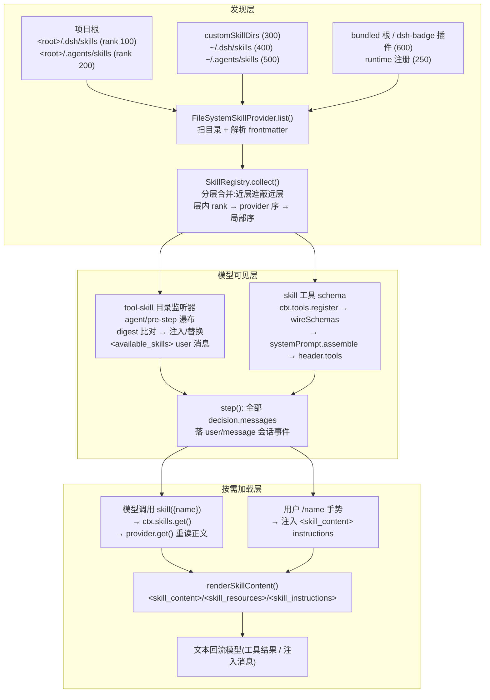

# 第四章 · Skills 的技术实现与运行方式(DeepSeek Harness 源码分析)

> 分析对象:[innokria/deepseek-harness](https://github.com/innokria/deepseek-harness) @ `dbbaa4a37`
> 核心源码:`packages/skill/`(四个包:`skill` / `skill-filesystem` / `skill-badge` / `tool-skill`,合计约 2000 行 src)+ `packages/core/agent-loop/`(pre-step 瀑布)+ `packages/core/scope/`(ScopedLayers)
> **深入阅读(函数级)**:[`skills/`](./skills/README.md) —— SKILL.md 契约与六档根、provider 注册表裁决与 rev 缓存、目录五分支与按需加载四道闸门、watcher 失效全景、作用域与出货方式
> 设计依据:子系统参考 [`docs/subsystems/skills.md`](https://github.com/innokria/deepseek-harness/blob/dbbaa4a37fb9098aba814c97d2956f7b2f105f46/docs/subsystems/skills.md)、Agent Note [`.agents/notes/implemented/feature/2026-07-28-skill-invocation-policy.md`](https://github.com/innokria/deepseek-harness/blob/dbbaa4a37fb9098aba814c97d2956f7b2f105f46/.agents/notes/implemented/feature/2026-07-28-skill-invocation-policy.md)

---

## 第〇节 一句话结论与总览

DSH 的 Skill 系统是**一条"提示级"能力缝(capability seam),而不是工具**:skill 本体是磁盘(或别的 provider)上的一段 Markdown 指令,模型默认只看见一份**目录(catalog)**——每个 skill 一行 `name + 截断 description`;完整指令体只在两种时刻进入模型上下文:模型主动调用 `skill` 加载工具(结果是一段 `<skill_content>` 文本),或用户用 `/name` 手势显式调用(注入为 user 角色 instructions 上下文)。skill 从不把自己的正文塞进系统提示;**唯一随请求 schema 发出的只有 `skill` 这一个工具**。

关键架构事实:

1. **三角色分离**。`@deepseek-ai/dsh-skill` 是 Service Definition(`ctx.skills` 注册表,只做合并、裁决、校验);`dsh-skill-filesystem` / `dsh-skill-badge` 是 Service Provider(决定 skill 从哪来);`dsh-tool-skill` 是 Consumer(渲染会话目录 + 注册 `skill` 加载工具 + 识别 `/name` 手势)。注册表本身不含任何 skill 内容(`packages/skill/skill/README.md:12`)。
2. **发现是 pull 式、无协议的**。与 MCP 的"连接 + `tools/list` 协议发现"完全不同:skill 发现就是 provider 的 `list(options)` 方法返回候选数组,本地 provider 扫目录、解析 YAML frontmatter;没有握手、没有通知协议,变更靠 provider 自调 `invalidate()` 和文件 watcher。
3. **模型可见性走会话消息,不走 system prompt**。目录是 `agent/pre-step` 瀑布注入的 durable user 消息(source kind `skill-catalog`),随 step 落 `user/message` 会话事件——满足仓库"模型可见 ⟺ 已落日志"的不变式,但完全不经过 `systemPrompt.assemble()` 的 section 体系。
4. **注册表是 host+per-scope 分层**(与 tools 注册表同构):preset 里挂载的 provider 落在该 preset 的层,agent 读的是全局层 + 自己作用域链的合并视图。


<details><summary>Mermaid 源码</summary>



</details>

---

## 第一节 SKILL.md 格式与目录约定

### 1.1 两种物理形态与命名语法

本地 provider 接受且仅接受两种形态(`packages/skill/skill-filesystem/src/index.ts:728-733` 的 `discoverRoot`):

```typescript
const locator = entry.type === 'directory'
  ? { path: join(entry.path, 'SKILL.md'), directory: entry.path }   // 目录 bundle:<name>/SKILL.md
  : entry.type === 'file' && entry.name.endsWith('.md')
    ? { path: entry.path, directory: root.path }                     // 扁平文件:<name>.md
    : undefined
```

- **目录 bundle**:`<name>/SKILL.md` 是入口,同目录可放 `references/`、`templates/`、`scripts/` 等附属资源(如 `.agents/skills/dsh-doc/` 有 5 个 references + 4 个 templates;`.agents/skills/record-browser-gif/scripts/` 带 Python 脚本)。bundle 目录路径会成为该 skill 的 `resourceBase: { kind: 'directory', path }`(`skill-filesystem/src/index.ts:745`),模型加载后被告知"相对路径相对此目录解析、按需读取"。
- **扁平 Markdown**:`<name>.md` 直接挂在根下,`resourceBase` 退化为根目录。**不支持 `**/SKILL.md` 递归嵌套**(`docs/subsystems/skills.md:85`)。
- **名称语法**:kebab-case,`SKILL_NAME = /^[a-z0-9]+(?:-[a-z0-9]+)*$/`(`packages/skill/skill/src/index.ts:21`)。frontmatter 里的 `name` 不合语法则整个文件被忽略并告警(`skill-filesystem/src/index.ts:820-823`);**文件/目录名本身不做名称来源**,名称只认 frontmatter。

### 1.2 frontmatter 契约

以仓库真实 skill `.agents/skills/dsh-pre-push-checks/SKILL.md:1-4` 为例:

```markdown
---
name: dsh-pre-push-checks
description: Use before pushing, force-pushing, marking ready for review, ...
---

# DSH Pre-Push Checks
...(Markdown 正文,即模型最终看到的指令体)...
```

frontmatter 解析(`parseFrontmatter`,`skill-filesystem/src/index.ts:917`)是**首行必须恰为 `---`、逐行找闭合 `---`** 的窄实现,中间段交给 `yaml` 包解析;非对象(数组/标量)直接判无 frontmatter。字段契约(`parseSkillFile`,`skill-filesystem/src/index.ts:797-840`):

| 字段 | 必填 | 处理 |
|---|---|---|
| `name` | 是 | 缺/空/非 kebab-case → 整个 skill 被忽略 + warn |
| `description` | 是 | 同上;它是模型目录里唯一的路由依据 |
| `whenToUse` | 否 | 仅作 provider 元数据保留,**不进模型目录、不进 `<skill_content>` 包装** |
| `disable-model-invocation` | 否 | 反向映射到 `modelInvocable`(默认 true) |
| `user-invocable` | 否 | 映射到 `userInvocable`(默认 true) |
| `metadata` | 否 | 必须是对象,原样透传 |

三个值得记录的边界决策:

1. **布尔宽容但失败关闭**:`frontmatterBoolean`(`skill-filesystem/src/index.ts:1018-1037`)接受 YAML 布尔、`1`/`0`、大小写不敏感的 `true/false/yes/no/on/off`(对齐 Claude skills 的实践形式);但非法值会让**整个 skill 从发现中消失**而非默认放行——调用策略出错时默认即授权,会暴露被禁入口(Agent Note `2026-07-28-skill-invocation-policy.md:19`)。
2. **无 camelCase 别名**:`rejectLegacyInvocationKey`(`skill-filesystem/src/index.ts:1012-1016`)对 `disableModelInvocation`/`modelInvocable`/`userInvocable` 直接抛错,导向 kebab-case 正名。pre-release 仓库不留磁盘兼容别名。
3. **正文是 frontmatter 之后的全部内容**,`content: parsed.body.trim()`(`skill-filesystem/src/index.ts:838`)。模型看到的是纯 Markdown 指令体,frontmatter 被剥掉。

### 1.3 发现根与优先级表

`FileSystemSkillProvider.roots()`(`skill-filesystem/src/index.ts:245-265`)按固定 rank 构造根列表:

| Rank | Source | 根 | 备注 |
|---|---|---|---|
| 100 | `project-dsh` | `<projectRoot>/.dsh/skills` | 仅当调用方给了 `cwd` |
| 200 | `project-agents` | `<projectRoot>/.agents/skills` | 同上;本章分析的仓库即用此根 |
| 250 | `runtime` | (内存) | `ctx.skills.register()` 的运行时注册,见 2.4 |
| 300 | `custom` | `Config.customSkillDirs` | 部署自定义 |
| 400 | `user-dsh` | `<dshHome>/skills` | `skipSystem: true`,跳过 `.system` 子目录 |
| 500 | `user-agents` | `<agentsHome>/skills` | `$DSH_AGENTS_HOME` 或 `~/.agents` |
| 600 | `bundled` | `Config.bundledSkillDir` / `$DSH_BUNDLED_SKILL_DIR` | `trustedHost: true`,绕过 `ctx.fs` 直读宿主机 |

**项目根 = 含 `.git` 的最近祖先**,找不到就退回 cwd 本身(`findProjectRoot`,`skill-filesystem/src/index.ts:945-955`);有 `ctx.fs` 时 `.git` 探测走文件系统服务,沙箱/远程工作区不会落回宿主机边界。rank 数字即"层内同名裁决"的权重:**小的赢**(project > custom > user > bundled),与 Claude Code 的 project > user 优先级同向。`source` 字段是提示可见的元数据,本身不参与裁决(`skill/src/index.ts:39` 注释:"prompt-visible metadata, not precedence by itself")。

读取路径分双轨(`readSkillText`,`skill-filesystem/src/index.ts:846-860`):非 `trustedHost` 根且存在 `ctx.fs` 服务时走 `fs.resolve/stat/readText`(受沙箱策略约束);`bundled` 根或没有 fs 服务时走 Node `realpath + readFile`。`FS_NOT_TEXT`(二进制)等错误只让该文件被忽略,不炸整个发现(`skill-filesystem/src/index.ts:884-892`)。

---

## 第二节 Provider Registry:注册、合并与裁决

`SkillRegistry`(`packages/skill/skill/src/index.ts:356`)是 Cordis Service,通过声明合并挂到 `ctx.skills`(`index.ts:283-286`),只做四件事:**收 provider、收运行时 skill、合并出目录、按名加载正文**。

### 2.1 Provider 契约与注册

```typescript
// packages/skill/skill/src/index.ts:247
export interface SkillProvider {
  readonly name: string
  readonly list: (options: SkillLookupOptions)
    => Promise<readonly SkillCandidate[] | SkillProviderObservation>
  readonly get: (candidate: SkillCandidate, options: SkillLookupOptions)
    => Promise<SkillDefinition | undefined>
}
```

- **注册同步、发现异步**:`registerProvider(create)`(`index.ts:390`)要求工厂同步返回 provider 对象;远程初始化、鉴权、扫描全部推到被 await 的 `list()` 里。`runtime` 是保留名,占用即抛(`index.ts:406-408`)。
- **工厂拿到注册作用域的 `SkillProviderControl`**(`index.ts:394-402`):`signal` 在注册失败或该注册被 dispose 时 abort;`invalidate()` 只在**产出它的那次确切注册仍存活**时清缓存并广播(对比对象 identity,防止同名替换 provider 被旧回调误清)。
- **注册是 Cordis effect**:经 `this.layers.effect(...)`(`index.ts:411-423`)落入调用上下文的层;fiber 处置(HMR 热替换、preset 卸载)自动注销并失效缓存——符合仓库"registrations are effects"的元规则。
- **`SkillCandidate.locator` 是不透明句柄**(`index.ts:80-81`):注册表只存它、加载时原样还给胜出 provider 的 `get()`。本地 provider 的 locator 是 `{ path, directory }`(`skill-filesystem/src/index.ts:119-122`);badge provider 的 locator 是打包资源的 `URL`(`skill-badge/src/index.ts:33`)。
- **`list()` 返回纯数组 = 完整发现的速记**;返回 `{ candidates, complete: false }` 观测则表示"这些候选可用,但本次发现不权威"——可用但不许缓存(`normalizeProviderObservation`,`index.ts:662-674`)。

### 2.2 合并裁决:层间遮蔽 + 层内三级排序

读取的合并规则(`collectFresh`,`index.ts:551-565`):

```typescript
// Global first, then existing chain overlays farthest ancestor first and
// the exact scope last, so the nearest layer's same-name entry replaces
// the farther ones — the tools registry's shadowing rule.
const layers = [this.layers.global, ...this.layers.chainLayers(options.scope)]
for (const layer of layers) {
  const collected = await this.collectLayer(layer, options)
  for (const entry of collected.entries) merged.set(entry.candidate.name, entry)  // 后写覆盖 = 近层赢
}
```

层内裁决(`compareIndexedCandidates`,`index.ts:807-811`):

```typescript
return left.candidate.rank - right.candidate.rank        // 1. rank 小者赢(project 100 > bundled 600)
  || left.providerOrder - right.providerOrder            // 2. provider 注册序(全局单调)
  || left.localOrder - right.localOrder                  // 3. provider 内部顺序
```

排序后同名首个胜出,其余记 warn 丢弃(`collectLayer`,`index.ts:572-580`)。即:**跨层是无条件遮蔽,层内才讲 rank**——preset 层的同名 skill 永远赢全局层,不管 rank。

### 2.3 缓存、修订号与失效

`collect()`(`index.ts:519-549`)是注册表唯一的缓存点,伪代码改写:

```text
collect(options):
  loop (最多 MAX_COLLECT_ATTEMPTS = 2 次):
    revision = this.revision
    key = JSON.stringify({ cwd, scopes: scopeChainOf(scope).map(scopeId), revision })
    命中 → 返回(cacheable: true)
    result = await collectFresh(options)        # 串行 await 每个 provider.list()
    if revision != this.revision:               # 读的过程中被 invalidate 了
        重试一次;再变 → 返回 { entries, cacheable: false }
    if result.cacheable: 写入缓存(FIFO 淘汰,上限 collectCacheMaxEntries = 128)
    return result
```

- **缓存键显式携带作用域链**(`collectCacheKey`,`index.ts:643-645`),scope key 是身份比较的不透明对象,用 WeakMap 发稳定 id(`index.ts:633-641`)。注释说明原因:blank-session 重组合会给既有 scope 换父(换 preset),只有链在键里,下一次读才能看到新 preset(`index.ts:524-526`)。
- **失效只有三条路**:provider 自调 `invalidate()`、运行时注册/注销、注册表条目变质(见 2.5)。**没有 TTL**——远程源变了只能靠 provider 自己的观测机制(`skill/README.md:138` 已知限制)。每次失效 `revision++`、清空缓存、广播 `skills/change`(`invalidateCache`,`index.ts:621-625`)。
- **`skills/change` 是无差异通知**(`index.ts:289-296`):不带 diff,监听者自己带 lookup options 重新 `snapshot()`;监听器异常被逐条 containment,不能否决注册表变更(`notifyChange`,`index.ts:648-659`)。值得记录的事实:全仓库**生产代码里没有人监听这个事件**(grep 仅命中测试与 API 目录生成器)——目录消费者 tool-skill 选择在每个 pre-step 重新快照 + digest 比对(见 4.2),事件只留给外部消费者。

### 2.4 运行时注册:`ctx.skills.register()`

`register(skill)`(`index.ts:439-460`)接收内存中的完整定义(`SkillRegistration`),补默认 invocation `{ modelInvocable: true, userInvocable: true }` 和 provider 标签 `runtime`,以 **rank 250** 参与层内裁决(`runtimeCandidate`,`index.ts:691-705`)——即运行时条目输给 project(100/200)、赢过 custom/user/bundled(300+)。同层同名 first-wins,后到者收 warn + 空 disposer(`index.ts:443-446`),保证后注册者无法误删胜者。当前仓库中该入口主要由测试与各包编排代码使用;生产 skill 主要来自文件系统 provider。

### 2.5 加载路径:选择 → 取消重查 → 校验 → 名字复核

`get(name, options)`(`index.ts:500-517`):

```typescript
if (!isSkillName(name)) return undefined                    // 非法名静默 undefined,不抛
const collected = await this.collect(options)
throwIfAborted(options.signal)                              // 选中后(含缓存命中)重查取消
const match = collected.entries.get(name)
if (match === undefined) return undefined
const definition = await waitWithAbort(match.provider.get(match.candidate, options), options.signal)
if (definition === undefined) return undefined
validateDefinition(definition)                              // 语义字段全量校验
if (definition.name !== match.candidate.name) {             // 发现与加载之间正文换了名字
  this.invalidateEntry(match)                               // 只在该确切注册仍存活时失效缓存
  return undefined
}
```

两个要点:**定义永不缓存**——每次 `get()` 都让胜出 provider 重读当前正文(`skill/README.md:99`),所以只改正文不动 frontmatter 的编辑对下一次加载立即可见;**加载与取消赛跑**(`waitWithAbort`,`index.ts:819-842`),不配合的 provider 无法挂死调用方。`ctx.skills.get()` 本身是**策略中立的受信加载器**, invocation 策略由消费者在自己的边界执行——这是 Agent Note 明确拒绝"在 get() 里做过滤"的结果(note 第 40 行:get() 无法知道调用方是模型工具、人类命令还是受信编排)。

---

## 第三节 本地 Provider:监视与失效闭环

`skill-filesystem` 的另一半价值是让"改磁盘"变成"目录失效"。其 `apply()`(`skill-filesystem/src/index.ts:134-147`)做三件事:

```typescript
export function apply(ctx: Context, config: Config = {}): void {
  let provider!: FileSystemSkillProvider
  ctx.skills.registerProvider((control) => {
    provider = new FileSystemSkillProvider(ctx, control, config)
    return provider
  })
  ctx.effect(function* () { yield async () => { await provider.dispose() } }, 'skill-filesystem watcher')
  ctx.on('fs/observed', (target, _observation, actor) => {
    if (mutationToolName(actor) === undefined) return          // 只关心 edit/write 两个模型工具
    provider.observeHostMutation(target.displayPath)           // 模型自己写的 skill 文件 → 同步失效
  })
}
```

失效输入有两路:

1. **宿主 watcher**(`SkillWatchManager`,`skill-filesystem/src/index.ts:288-601`):对每个根解析监视锚点——根存在用 chokidar 直挂(`depth: 1`、`awaitWriteFinish` 默认稳定阈值 200ms);根不存在则从最近现存祖先逐段 `watchFile` 跟住下一级路径,直到根出现可以挂载(`resolveRootWatchMode`,`index.ts:629-654`)。事件过滤极窄(`isRelevantWatchEvent`,`index.ts:662-679`):只认根的一级子项增删、一级 `.md` 文件、二级 `SKILL.md` 的 add/change/unlink——**bundle 内部的 resources 变化不构成目录变更**。项目级 watcher 有界 LRU(默认 128 个项目根,`watchMaxProjects`),驱逐即失效。watcher 失败不藏候选:本次观测标记 `complete: false`,可读候选照常返回(`list()`,`index.ts:186-202`)。
2. **第一方变更直通**:`fs/observed` 事件里 actor 是 `write`/`edit` 工具且目标落在某个根的潜在 skill 路径上(`isPotentialSkillPath`,`index.ts:681-688`),同步调 `invalidate()`——模型自己写的 skill 下一步就能用,不等 chokidar 的稳定窗口。

所有失效都经 `control.invalidate()` 回到注册表的统一失效语义(2.3);provider dispose 是平息式的:清 roots/projects、等 opening 中的 watcher、逐个 close(`index.ts:343-355`)。

**两条降级路径必须区分**(函数级细节见 [`skills/01-skill-format-and-discovery.md`](./skills/01-skill-format-and-discovery.md)):watcher 启动失败时 `list()` 的 try 只包住 watcher 启动,可读候选照常返回、本次观测标记 `complete: false`;而**目录扫描抛非"路径不存在"错误时会穿出 `list()`**,由注册表 `listLayerCandidates`(`packages/skill/skill/src/index.ts:604-608`)兜成"该 provider 本轮零候选 + incomplete"。前者是部分视界,后者是整层缺席——依赖 skill 目录的下游判断应据此区分"扫不全"与"没有"。

另一个打包 provider 的最小样本是 `dsh-skill-badge`(`skill-badge/src/index.ts:36-50`):整个 provider 是一个常量候选 + `get()` 里 `readFile` 打包资产,说明**provider 契约小到一个对象两个字面量方法就能实现**——远程 registry 型 provider 也面对同一契约。

---

## 第四节 Catalog 与 Loader:模型如何按需拿到完整指令

Consumer 包 `dsh-tool-skill`(`packages/skill/tool-skill/src/index.ts`,`inject = ['agents', 'tools', 'skills']`)把注册表翻译成三样东西:一个工具、两条 `agent/pre-step` 瀑布监听器。

### 4.1 `skill` 加载工具

`defineTool({ name: 'skill', ... })`(`tool-skill/src/index.ts:81-161`)注册进普通工具注册表。描述明确写出用法契约:"Load the full instructions for an available skill. Call this with the exact skill name from the session skill catalog before acting on a task that names or clearly matches that skill."(`index.ts:83`)。执行体(`index.ts:127-156`)四道闸门:

```text
execute({ name }, exec):
  1. isSkillName(name) 否则抛 "invalid skill name"
  2. lookup = { cwd: exec.agent?.session.header.cwd, signal, scope: exec.agent }
     —— agent 即自己的 scope key,查找结果恰为该 agent 组合所见的分层注册表
  3. ctx.skills.list(lookup) 里找到同名 summary,且 isModelInvocable  → 否则抛
  4. ctx.skills.get(name, lookup) 重新加载完整定义,再查一次 isModelInvocable → 否则抛
     (发现与加载之间策略可能已变;被拒的名字永远到不了正文加载——note 第 17 行)
  5. 返回 { name, provider, resourceBase?, content }
```

输出经 `output.render` 渲染为单个文本块(`index.ts:125`):`renderSkillContent(value)`。这是 seam 内共享的唯一渲染器(`skill/src/index.ts:170-183`):

```typescript
export function renderSkillContent(skill: ...): string {
  const resourceHint = renderResourceHint(skill)
  return [
    `<skill_content name="${escapeAttr(skill.name)}">`,
    '<skill_resources>',
    ...resourceHint,          // directory / url / opaque 三种资源基准提示
    '</skill_resources>',
    '',
    '<skill_instructions>',
    skill.content,            // 正文逐字嵌入:skills 是受信本地内容
    '</skill_instructions>',
    '</skill_content>',
  ].join('\n')
}
```

工具结果与 `/name` 注入共用这一段输出,模型在两条路径上看到**同一个 `<skill_content>` 形状**。`resourceBase` 只给"基准目录/URL + 按需解析"的指引,**不枚举、不代取** skill 目录里的文件——resources 是指引而非附件(`tool-skill/README.md:245` 已知限制)。正文无大小上限(同上,`:244`)。

### 4.2 会话目录:durable、digest 比对、随可见性同生共死

第二个监听器(`tool-skill/src/index.ts:213-251`)负责把目录投到模型视野。每个 `agent/pre-step` 上:

```text
catalog listener(agent, signal):
  decision = await next()                                  # 先让内层(默认)产出 claimed + context
  toolVisible = ctx.tools.get('skill', agent) === skillTool   # 精确身份比对,不是按名查找
  if !toolVisible → 按空目录处理
  snapshot = await ctx.skills.snapshot({ cwd, signal, scope: agent })
  if !snapshot.complete → 原样放行(保留 last-good 视图,不缓存的中间态不上屏)
  entries = snapshot.skills.filter(isModelInvocable) → 描述归一化+截断(默认 500)
  digest = sha256(逐条 JSON.stringify([name, description]) 以 \n 连接)
  history = 从新到旧扫会话,找最新一条可见的 source.kind='skill-catalog' 消息
  ├─ history.visibleDigest === digest → 无变化;
  │   若本步消息列表里有旧目录则剔除(避免重复)
  ├─ digest 变了 → 渲染【首版目录】或【整表替换目录】,
  │   追加/替换进 decision.messages
  └─ 从未发布且当前为空 → 什么都不发
```

关键设计:

- **目录是 durable 的会话消息,不是每步重渲染的瞬态文本**。注入的消息是 user 角色、`<system-reminder>` 包裹 `<available_skills>` 列表(`renderCatalogMessage`,`index.ts:254-277`),同时 source 里以结构化 `entries` 记录本次发布的确切内容(`SkillCatalogSource`,`index.ts:34-41`)——**呈现层不许回 parse `<available_skills>` 文本**,展示与非模型消费者都读 source。
- **digest 算在条目上而不是渲染文本上**(`digestCatalogEntries`,`index.ts:328-335`):`<system-reminder>` 框架文案的改动永远不会触发重发;条目级的变化(增删、描述变、可见性变)才追加一条**整表替换**消息(`renderCatalogUpdate`,`index.ts:279-311`),清空所有 skill 也会追加一条显式空目录,退休旧名字。
- **目录与 `skill` 工具的可见性严格绑定**(`index.ts:220`):比对的是本插件注册的那个定义对象本身——任何 restriction 或同层同名遮蔽把 `skill` 工具换掉,目录连同调用指引一起消失,不会出现"目录还在但工具没了"的半可用态。已发布过目录的会话则会收到一条空替换目录显式退休。
- **压缩(compaction)藏掉全部历史目录后**,下一个 complete 快照会重新建立当前目录;空视图且从未发布则保持沉默(`index.ts:236-241` 分支)。

目录文案里有两条行为规范值得引用,因为它们定义了模型的使用方式(`index.ts:266-267`):

> "This catalog contains summaries only; do not infer or follow a skill's instructions until it has been loaded."
> "A user may also invoke a skill directly; its `<skill_content>` block then appears in this conversation. Follow it, and do not call the `skill` tool again for that skill."

即:目录只是路由摘要,指令以加载结果为准;用户显式调用过的 skill 禁止二次加载(防双重计入上下文)。

### 4.3 `/name` 用户显式调用

第一个监听器(`tool-skill/src/index.ts:177-204`)扫描**本步认领的 user 消息**里空白边界的 `/name` token(`SKILL_GESTURE`,`index.ts:409`;`/usr/bin`、`5/8` 这类因边界规则不匹配),对每个名字 `ctx.skills.get()` 加载、查 `isUserInvocable`,通过则把 `renderSkillContent` 输出包成 `source.kind = 'skill-invocation'`、`form: 'instructions'` 的 user 消息**追加到本步所有注入的最后**——背景(工作区规则、运行时策略、目录)在前,模型要执行的材料离它的回答最近。注册顺序保证这个位置确定:手势监听器先注册,瀑布把"已含目录的消息列表"递给它扩展(`index.ts:163-176` 注释)。

三个边界事实:

- **只扫 `source.kind === 'user'` 的消息**——外部文本(工具结果、注入内容)无法伪造手势(`index.ts:421`)。
- 查无此名或用户禁用的名字**保持普通散文**,不报错、不注入。
- 这是 `disable-model-invocation` skill 的**唯一入口**:目录和 `skill` 工具对它们不可见,但用户 `/name` 仍可注入(`index.ts:175-176`;浏览器端 `ui-skill` 的 `/` 补全落的是字面 `/name ` 文本,确定性全部留在宿主这一边界,`packages/client/ui-skill/src/client/index.ts:7-12`)。

---

## 第五节 与系统提示组装的衔接:skill 不走 systemPrompt

主循环每个 step 的入口 `preStep`(`packages/core/agent-loop/src/agent.ts:240-259`)按固定顺序做四件事:

```typescript
const claimed = this.inbox.claim(target, position.turn)                        // 1. 认领收件箱
const assembly = await this.loopCtx.systemPrompt.assemble(assembleContextFor(this, signal))  // 2. 组装系统提示(含 tools schema)
const sections = renderContextSections(assembly)
const context = this.runtimeContext.project(joinContextSections(sections), sections)         // 3. 动态上下文快照消息
const decision = await this.dispatch.waterfall('agent/pre-step', { messages: claimed, ... }, // 4. 瀑布
  () => Promise.resolve({ kind: 'enter', messages: context === undefined ? claimed : [...claimed, context] }))
```

随后在 `step()` 首次尝试里,`decision.messages` 全部落 `user/message` 会话事件(`agent.ts:373-377`):

```typescript
if (firstAttempt) {
  for (const message of decision.messages) {
    this.session.append('user/message', message, { surfaceOp: 'append' })
  }
}
```

对照 MCP 章的工具链路,可以精确指出 skill 与 tools 的**视野分叉点**:

| 维度 | tools(含 MCP 工具) | skills |
|---|---|---|
| 模型常时可见 | `wireSchemas` 投影 `{name, description, parameters}` → `systemPrompt.assemble()` → `assembly.tools` → `header.tools` 随每个请求发出 | 只有 `skill` **一个**工具走这条链;skill 本身不进 `header.tools` |
| 模型可见的清单 | 系统提示/请求头的 schema 列表 | durable user 消息 `<available_skills>`(source `skill-catalog`) |
| 完整内容 | schema 即全部契约 | 目录只有 name+截断描述;正文要经 `skill` 工具或 `/name` 显式加载 |
| 变更传播 | `toolsChanged()` 比对 header 基线,触发系统提示重投 | 每个 pre-step 重快照 + sha256 digest,变了追加整表替换 user 消息 |
| 发现机制 | MCP:连接 + `tools/list` 协议(含分页、通知);内置:代码内 `defineTool` | provider `list()` 方法:本地扫目录 + frontmatter,无协议;变更靠 `invalidate()`/watcher |
| 会话落日志 | `request/header` 记录工具集 | `user/message`(kind `skill-catalog` / `skill-invocation`)+ 普通 `tool/call`/`tool/result` |
| 策略管道 | pre-execute 瀑布、审批、守卫 | 无执行期管道;策略只有 invocation 两布尔(发现期)+ 工具走同一管道 |

一句话:**skill 是"借道"工具系统的提示级设施**——它注册了一个工具,但目的是给模型递 Markdown;发现、目录、加载全部发生在 prompt/消息平面,主循环对 skill 的全部感知只有 `agent/pre-step` 这一个公开扩展点,与 MCP"主循环零感知"是同一种插件化哲学在提示平面的镜像。

---

## 第六节 作用域行为:agent / preset 分层

`SkillRegistry` 的分层直接复用 `dsh-scope` 的 `ScopedLayers`(`packages/core/scope/src/store.ts:159`):注册时 `scopeOf(ctx)` 决定落哪一层;读时 `[global, ...chainLayers(scope)]` 合并(`chainLayers`,`store.ts:192-199`,最远祖先在前、精确 scope 最后,近层后写赢同名)。skill 系统里这表现为:

1. **注册表服务本体在宿主平面**,preset 不重挂。web-app bundle 明确关闭宿主行的 `skill-filesystem` 与 `tool-skill`,把发现与模型入口交给 preset(`packages/bundle/web-app/cordis.patch.yml:393-406` 注释:"The `skill` REGISTRY stays in the host plane ... each agent reads the merged catalog its scope chain selects")。
2. **preset 的 standing composition 里挂的 provider 落在该 preset 的层**。`standard` preset 的 `agent.cordis.yml:84-88` 挂载 `skill-filesystem` + `tool-skill` 两行,注释说明:"these rows register into THIS preset's layer ... the merged catalog also carries whatever the deployment registered globally"。同一 provider 名在不同 preset 层可以各注册一次(重名唯一性是**每层**而非进程级,`skill/src/index.ts:333-337`)。
3. **tool-skill 挂在哪个作用域,目录和工具就只属于哪个作用域的 agent**:监听器注册在 preset 上下文里,只对该 preset 的 agent 触发;`ctx.tools.get('skill', agent)` 的可见性判定也以 agent 为 scope key。同理 `skill` 工具 execute 里 `scope: exec.agent`(`tool-skill/src/index.ts:133`)。
4. **冷会话(未激活 agent)也能列目录**:`SessionSkillCatalog`(`packages/api/session-controller/src/skill-catalog.ts:36-90`)从 session header 读 cwd 与记录的 preset,活 agent 用其 scoped registry,冷会话用 preset 的 standing scope key(`standingKeyFor`),全部失败退回全局注册表;只回 `isUserInvocable` 的条目,且不加载正文。浏览器 `ui-skill` 经 `skills/list` RPC 拉这份目录做 `/` 补全,按会话缓存、单飞(`client/ui-skill/src/client/index.ts:98-122`)。
5. **空作用域(无 preset 编排)= 只读全局层**(`SkillViewOptions.scope` 省略即如此,`skill/src/index.ts:116-119`)。

---

## 第七节 关键文件索引表

| 文件 | 职责 |
|---|---|
| `packages/skill/skill/src/index.ts` | Service Definition:`SkillRegistry`(registerProvider/register/list/snapshot/get)、分层合并与 rank 裁决、修订号缓存、`renderSkillContent`、invocation 策略类型 |
| `packages/skill/skill-filesystem/src/index.ts` | 本地 provider:六档根与 rank、frontmatter 解析、双轨读取(ctx.fs / Node)、chokidar watcher 与 `fs/observed` 直通失效 |
| `packages/skill/skill-badge/src/index.ts` | 最小打包 provider 样本:常量候选 + 打包资产正文(默认禁用) |
| `packages/skill/tool-skill/src/index.ts` | Consumer:`skill` 加载工具、目录 pre-step 监听器(digest 整表替换)、`/name` 手势监听器 |
| `packages/core/agent-loop/src/agent.ts` | `preStep` 瀑布与 `step()` 的 `user/message` 落日志:skill 目录/注入进入模型视野的唯一通道 |
| `packages/core/scope/src/store.ts` | `ScopedLayers`:global + per-scope 层、`chainLayers` 合并序 |
| `packages/api/session-controller/src/skill-catalog.ts` | 冷会话可读的 `skills/list` Remote(user 视角目录) |
| `packages/client/ui-skill/src/client/index.ts` | 浏览器 `/` 补全源与 `skill` 工具行视图 |
| `packages/bundle/base/cordis.patch.yml` | 宿主平面四行 skill 组合(registry / filesystem / badge(禁用)/ tool-skill) |
| `packages/bundle/web-app/cordis.patch.yml` | web profile 关闭宿主 `skill-filesystem`/`tool-skill`,改由 preset 拥有 |
| `packages/preset/agent-presets/presets/standard/agent.cordis.yml` | preset 层挂载 `skill-filesystem` + `tool-skill` 的实例 |
| `.agents/skills/dsh-pre-push-checks/SKILL.md` | 真实目录-bundle skill 样本(frontmatter + 正文) |
| `.agents/skills/dsh-doc/` | 带 `references/` 与 `templates/` 附属资源的多文件 bundle 样本 |
| `docs/subsystems/skills.md` | 官方子系统参考(类型契约与语义) |
| `.agents/notes/implemented/feature/2026-07-28-skill-invocation-policy.md` | invocation 双布尔策略的设计裁决与被拒方案 |

---

## 附:与第三章 MCP 发现的定位差异速查

| 维度 | MCP 工具发现 | Skill 发现 |
|---|---|---|
| 驱动 | 连接协议(`tools/list` 分页 + `tools/list_changed` 通知) | 进程内方法调用(provider `list()`)+ 文件 watcher |
| 产物落点 | 全局工具注册表 `ToolRuntime`(`mcp__*` 命名空间) | `ctx.skills` 分层注册表(无命名前缀,层间遮蔽) |
| 模型常时视野 | 每个工具一份 schema,随请求头 | 一行 name+描述,随会话消息 |
| 变更原子性 | 两阶段代际替换(fetch 完成才 swap) | 修订号 + 读中变更重试一次;目录侧 digest 整表替换 |
| 失败姿态 | 预算耗尽注销工具停摆 | provider 失败记 warn、观测不完整不缓存,消费者保留 last-good |
| 信任边界 | 服务器是沙箱外受信代码,结果按不可信输入逐字段兜底 | skill 是受信本地内容,正文逐字嵌入 `<skill_content>`;frontmatter 解析失败关闭 |
