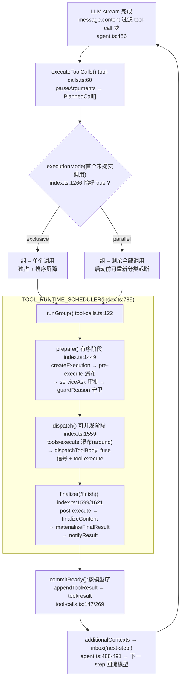

# 第五章 · Tool Call 机制实现细节(DeepSeek Harness 源码分析)

> 分析对象:[innokria/deepseek-harness](https://github.com/innokria/deepseek-harness) @ `dbbaa4a37`
> **深入阅读(函数级)**:[`tool-call/`](./tool-call/README.md) —— 注册表与可见性解析、执行管道逐段走查、调度器并发语义、取消与超时、PTC(`run_code`)模式、结果展示层
> 核心源码:`packages/core/tools/src/`(`index.ts` 1936 行 + `schema.ts` / `json-schema.ts` / `ptc.ts` / `types.ts`)+ `packages/core/agent-loop/src/`(`tool-calls.ts` / `agent.ts`)+ `packages/core/scope/src/store.ts`
> 扩展点样例:`packages/guard/timeout-policy/src/index.ts`、`packages/guard/repeat-tool-reminder/src/index.ts`
> 说明:MCP 工具的桥接细节由第六章覆盖,本章只讨论工具机制本身。

---

## 第〇节 一句话结论与总览

DSH 的 tool call 是**"一张分层注册表 + 一条四段式执行管道 + 一个模型序提交的滚动调度器"**:`ToolRuntime`(`packages/core/tools/src/index.ts:780`)把注册、可见性解析、策略管道收在一个 Cordis Service 里;`agent-loop` 不直接调 `execute()`,而是通过内部符号接口 `TOOL_RUNTIME_SCHEDULER`(`index.ts:459`)把一次调用拆成 `prepare → dispatch → finalize/finish`,让"有序的策略阶段"与"可并发的执行阶段"分离——这正是 `exclusive` 屏障与 `parallel` 滚动池能共存的原因。

关键架构事实:

1. **模型只看见三个字段**。`schemaOf()`(`index.ts:1246`)是白名单投影:`name` / `description` / `parameters`;执行回调、展示回调、`timeoutMs`、`isConcurrencySafe` 全不进模型视野。
2. **一个可见性解析器喂三处**。`view()`(`index.ts:1142`)一次遍历产出 `visible` / `knownNames` / `restrictableNames`,被 `get()` / `schemas()` / `executionMode()` / `resolveExecution()` 共用,展示、查找、调度分类不可能互相漂移。
3. **注册表按作用域分层**。`ScopedLayers`(`packages/core/scope/src/store.ts:159`)维护一个全局层 + 每作用域一个 overlay;注册项按 Cordis effect 拥有、随插件卸载回收,读操作永不创建层。
4. **管道固定五段**:`tools/pre-execute` 瀑布 → `ask` 审批 → 单调 `guard` → `tools/execute`(around)→ body → `tools/post-execute` → `finalizeContent` → 物化 → `tools/result` 通知(`index.ts:1453/1559/1599/1621`)。
5. **并发失败关闭**。`executionMode()`(`index.ts:1266`)只有分类器**恰好返回 `true`** 才判 `parallel`;未声明、抛错、非 `true`、工具不可见一律 `exclusive`。
6. **取消不放弃 promise**。注册表把调用者信号与 wrapper 信号 fuse(`fuseToolSignals`,`index.ts:1879`),已启动的 body 必须静默到 quiescence,只有结果被替换成 `ABORTED` / `ABORTED_BEFORE_DISPATCH` 两种规范码之一(`index.ts:462,465`)。


<details><summary>Mermaid 源码</summary>



</details>

---

## 第一节 ToolDefinition 契约:注册之前的一切

`ToolDefinition`(`index.ts:214`)在 LLM 的 `ToolSchema` 之上追加四个语义块:

- **`output: { schema, render, presentationMeta? }`**(`index.ts:204`)。`execute` 只返回"规范值"(`index.ts:227`),必须满足 `output.schema`,再由 `render()` 投影成模型内容。这条"值 / 投影分离"是 PTC 成立的前提——程序拿结构化值,模型拿渲染文本。
- **`finalizeContent?(exec, result)`**(`index.ts:239`)是最后一道内容改写:合同要求它只改 `content`、全函数、不得抛错,并对**每个**归一化结果恰好调用一次(包括绕过 `post-execute` 的管道失败)。注册表在**执行开始时**快照该回调(`index.ts:1398`)——`arguments` 的 getter 可能在快照期间替换掉注册表上的回调。
- **`timeoutMs` / `isConcurrencySafe` 都不进模型视野**(`index.ts:247,261`)。前者由 `tools/execute` wrapper 消费(`packages/guard/timeout-policy/src/index.ts:57`),后者只喂 `executionMode()`。

`register()` 把四类错误全部拦在加载期(fail loud):

```typescript
// packages/core/tools/src/index.ts:1027
register(definition: ToolDefinition): () => void {
  const name = definition.name
  const output = (definition as Partial<ToolDefinition>).output
  if (output === undefined || typeof output !== 'object'
    || typeof output.render !== 'function'
    || (output.presentationMeta !== undefined && typeof output.presentationMeta !== 'function')) {
    throw new TypeError(`tool "${name}" must declare output { schema, render, presentationMeta? }`)
  }
  assertSupportedJsonSchema(output.schema)
  const timeoutMs = definition.timeoutMs
  if (timeoutMs !== undefined && (!Number.isFinite(timeoutMs) || timeoutMs <= 0)) throw new TypeError(...)
  if (name === RUN_CODE_NAME) throw new Error(`tool name "${RUN_CODE_NAME}" is reserved ...`)
  return this.layers.effect(this.ctx, layer => layer.tools.insert(name, definition), { label: 'tools.register()' })
}
```

最后一行是仓库的核心约定——**注册即 effect**:返回的 disposer 就是注册的撤销,层空了就地回收并触发 `tools/change`。`run_code` 的无条件保留(`index.ts:1041-1046` 注释)值得单列:任何 agent 都可能为自己选用 code 模式,一个"当前默认下空闲"的名字会在某个 preset 挂载的瞬间变成冲突,无条件保留把冲突挪到注册期。

`defineTool`(`packages/core/tools/src/schema.ts:545`)把声明式 spec 编译成真实 JSON Schema,并把参数校验**前置**到 body 之外:`validate(args)` 不通过就抛 `ToolArgsError`(`schema.ts:461`),所以工具作者写的是 `execute(args: InferArgs<S>, ...)`,非法参数根本进不去。

body 返回值经 `createSuccessResult()`(`index.ts:1783`)变成结果,四步全部强制:无损 JSON 快照(`snapshotToolValue`,非无损即 `INVALID_TOOL_OUTPUT`)、`validateJsonSchemaValue(tool.output.schema, ...)` 强制输出声明(`index.ts:1785`)、`deepFreeze(value)`、`render` + `snapshotProjection` 得 `content`。`presentationMeta` **只在顶层调用**计算(`index.ts:1796` 的 `exec.parent === undefined`)——`run_code` 的子派发没有 `meta`。

---

## 第二节 注册表:ScopedLayers 分层、shadowing 与 restrict

`ToolRuntime` 构造 `new ScopedLayers(scope => new ToolLayer(scope), () => { this.ctx.emit('tools/change') })`(`index.ts:804`)。每个 `ToolLayer`(`index.ts:707`)聚合四张表:`tools: NamedEntries<ToolDefinition>`(层内重名即抛,`index.ts:719`)、`restrictions`、`guards`(均 `AnonymousEntries`,同值多次注册是独立注册)、以及**单格 `mode`**——注释写明"对『模型看到哪种形态』有两个答案是矛盾,不是合并"(`index.ts:711-716`)。

`ScopedLayers.effect()`(`store.ts:226`)的语义:作用域由传入的 `ctx` 决定(`scopeOf(ctx)`),撤销时若层已空就删层并按 `notify` 发通知;`guard()` 特意传 `notify: false`(`index.ts:1104`),因为守卫不改变可见工具集。

全部可见性规则集中在 `view()`(`index.ts:1142`),四条结论:

1. **近层遮蔽远层**。继承面按"全局层 → 由远及近的祖先层"顺序 `set`(`index.ts:1151-1155`),后写覆盖先写。
2. **restriction 沿链取交**。`layers.every(layer => layer.admits(name))`(`index.ts:1164`)——链上任何一层都能为它内嵌的所有 scope 屏蔽一个继承名;编译后的 `allow` / `deny` 是 `Set`,由 `ToolLayer.admits()`(`index.ts:731`)求值。
3. **restriction 不过滤本层自己的注册**(`index.ts:1168-1173`)。这是被记录过的设计:`index.ts:1127-1138` 注释指出委派 runtime 会把子 agent 的结构化输出工具注册进**子 agent 自己的层**,一个"允许该子 agent 使用哪些能力"的过滤器不能把它赖以作答的机件一起剥掉;注释还记录了踩坑史——"把豁免集合读成『全局层』而不是『不是我的层』,只在所有模型可见工具都待在宿主组合里时成立"。
4. **`run_code` 传输最后插入且在过滤之外**(`index.ts:1179-1181`),因为它不在任何注册层里(`index.ts:906-925` 说明理由:per-agent restriction 不能移除它,scoped 注册也不能遮蔽它),且**按 scope 判定**——native 的 agent 不该在派发表里发现别的 agent 呈现的 `run_code`。

`restrict()`(`index.ts:1061`)在注册期拒绝三类误用并要求 scoped ctx:上下文全局的限制(会遮住所有 agent)、空过滤器(注释直指"几乎总是配置物化成空的 bug",`index.ts:1069`)、名字不存在的过滤器(报错附上全部已知全局工具名,`index.ts:1078-1081`);`run_code` 也不能被 restrict 命名(`index.ts:1075`)。`presentAs()`(`index.ts:938`)是 mode 的作用域版本:要求 scoped ctx、每个 scope 只能声明一次、非 native 时同时注册 collapse 与 SDK 两个 prompt section。

---

## 第三节 模型可见 schema 投影与 systemPrompt 衔接

```typescript
// packages/core/tools/src/index.ts:1246
private schemaOf(definition: ToolDefinition, detachParameters: boolean): ToolSchema {
  const { name, description, parameters } = definition
  const detached = detachParameters ? snapshotJsonValue(parameters) : parameters
  if (detached === undefined) throw new Error(`tool "${name}" parameters must be lossless JSON before schema projection`)
  return { name, description, parameters: detached }
}
```

执行回调、`finalizeContent`、`presentCall` / `presentResult`、`timeoutMs`、`isConcurrencySafe` **结构性缺席**——不是"过滤掉",而是根本没出现在返回对象里。`detachParameters = true`(`schemas()` / `sdkSchemas()`)时参数被深拷贝,投影与注册项脱钩;`wireSchemas()` 传 `false`(`index.ts:976`),因为 system-prompt 随后会自己 `structuredClone`(`packages/core/system-prompt/src/index.ts:583`)。

`wireSchemas()`(`index.ts:972`)按 `modeFor(scope)` 分三态:

| mode | `schemas` | `knownNames` |
|---|---|---|
| `native` | 全部可见工具 | 全部可见名 |
| `ptc` | 只留 `run_code`(`index.ts:988`) | 只有 `RUN_CODE_NAME`(`index.ts:989`) |
| `both` | 全部可见工具 | 全部可见名 + `RUN_CODE_NAME`(`index.ts:992`) |

`knownNames` 的用途在 system-prompt 侧:它决定 `toolOrder` 校验的合法名字集合,未注册名会被报成加载错误(`packages/core/system-prompt/src/index.ts:216-218`)——所以 `ptc` 模式下把 native 名写进 `toolOrder` 是**组装期错误**,而不是静默失效。

接缝只有两行:

```typescript
// packages/core/tools/src/index.ts:825
ctx.systemPrompt.tools(context => this.wireSchemas(context.scope))
if (this.defaultMode !== 'native') {
  ctx.systemPrompt.section(this.collapseSection())
  ctx.systemPrompt.section(this.sdkSection())
}
```

system-prompt 的 `assemble()`(`system-prompt/src/index.ts:552`)收集所有 provider 输出,经 `orderTools()`(`:210`)按 `toolOrder` 或字典序排序,产出 `assembly.tools`(`:614`)。agent-loop 每个 step 重新组装(`packages/core/agent-loop/src/agent.ts:245`);`buildRequest()`(`agent.ts:553`)把 tools 记入 `canonicalHeader`(`:562-566`)并落 `request/header` 会话事件(`:571-581`);`toolsChanged()`(`agent.ts:262`)比对基线,工具集变化会触发新 header 与系统提示重投——这是"模型可见 ⟺ 已落日志"不变式在工具面上的落点。`sdkSection()`(`index.ts:867`)的文本是**调用作用域的函数**:每次渲染按 `context.scope` 重新生成,`native` 作用域渲染空串(空 section 被丢弃),所以 PTC 部署下仍可有完全 native 的 agent。

---

## 第四节 执行管道全链

`execute()` 是把分段调度接口串成完整管道的组合器(`index.ts:1332` → `completeScheduledExecution`,`index.ts:1336`)。`ScheduledToolPreparation` 的三分支(`index.ts:424-427`)编码了**阶段可见性**:deny 与取消是 `post-result`(观测者仍看得到),折叠拒绝与参数快照失败是 `final-result`(管道未开始,不该被观测)。

```text
createExecution(index.ts:1354)  token / args deepFreeze / 三个 WeakMap 登记
   ├─ collapsed(presentAs ptc 且非 run_code 且 model-direct)?
   │     ├─ 已 aborted → final-result: ABORTED_BEFORE_DISPATCH
   │     └─ 否则       → final-result: UNKNOWN_TOOL + 路由提示
   └─ args 快照失败    → final-result: 参数错误
prepareExecution(index.ts:1453)
   ├─ callerCancelled? → final-result: ABORTED_BEFORE_DISPATCH
   ├─ waterfall tools/pre-execute(allow / deny / ask)
   ├─ ask → serviceAsk → allowed-once / rejected / cancelled / unavailable
   ├─ allow → guardReason(exec);否则用 decision.reason
   ├─ denialReason? → post-result: isError("Error: <reason>")
   └─ callerCancelled? → post-result: ABORTED_BEFORE_DISPATCH;否则 dispatch
dispatchScheduledExecution(index.ts:1559)
   ├─ waterfall tools/execute → dispatchToolBody(index.ts:1522)
   │     fuse(callerSignal, wrapperSignal) → aborted? ABORTED_BEFORE_DISPATCH
   │     → resolveExecution(UNKNOWN_TOOL) → bodyInvoked = true → tool.execute
   │     → 成功但信号已 abort ? ABORTED : result;finally 还原 exec.signal
   ├─ normalizeDispatchResult:非本次执行铸造的结果重过 output 合同
   └─ 合并 deferredContexts → post-result / final-result
finalizeScheduledExecution(index.ts:1599) → post-execute → 取消复核
finishScheduledExecution(index.ts:1621)  → materialize → finalizeContent → materialize
                                          → notifyResult:freeze(exec) + emit tools/result
```

**执行身份。** `createExecution()` 一次性定型三件事:`token`(`createExecutionToken`,`index.ts:1856`)是不透明执行身份,也是 PTC 子派发唯一的父调用凭据;参数快照后 `deepFreeze`,策略层与 body 拿到同一份不可变值;三个以执行对象为键的 `WeakMap`(`index.ts:796-803`)承载延迟上下文、取消状态、内容终结器——它们刻意不放公开 `exec` 对象,因为 wrapper 会改写 `exec.signal`,注册表必须在 wrapper 视野之外保存原始调用者信号。

折叠判定的顺序注释(`index.ts:1363-1369`)解释了一个易错点:被 `ptc` 折叠的调用是**确定性失败**,必须在可扩展策略管道**之前**终止——pre-execute 监听器、`ask` 审批、guard 都不该看见,更不该批准一个只能失败的调用;真正未知的工具仍走 dispatch 阶段的 `UNKNOWN_TOOL` 路径,让策略监听器看到每个到达注册表的名字。唯一例外是预派发取消,折叠分支特意保留了 `ABORTED_BEFORE_DISPATCH`(`index.ts:1419-1421`)。

**有序前置门。** `prepareExecution()` 依次做四件事(`index.ts:1463-1493`):`scopeTarget(this, exec.agent)` 载具上跑 `tools/pre-execute` 瀑布(作用域路由见 `packages/core/scope/src/index.ts:170`——agent 监听器只收自己的调用,祖先监听器收全部后代调用);`ask` 交给 `serviceAsk()`;`guardReason()`(`index.ts:1109`,先全局层后作用域链);最后再查一次取消。三点设计:

- **审批是旁路而非决策源**:`serviceAsk()`(`index.ts:1679`)用 `ctx.get('approval')` 机会式消费 seam,没有 ApprovalService、或调用没有 agent,都**降级为 deny**;`allowed-once` 放行,`rejected`/`cancelled`/`unavailable` 是三条不同文本——注释写明理由是"让模型能区分人类说『不』和审批通道不存在"(`index.ts:1668-1677`)。
- **guard 在审批之后且没有 allow 结果**:`ToolGuard`(`index.ts:704`)只能返回拒绝理由或 `undefined`,所以监听器顺序**无法**把另一个 guard 的拒绝翻回允许。
- **拒绝也走 post-execute**(结果是 `post-result`,`index.ts:1479-1489`)。`repeat-tool-reminder` 正是靠这条统计被拒调用的重复链(`packages/guard/repeat-tool-reminder/src/index.ts:184-187` 注释)。

**分发与后置。** `tools/execute` 是**唯一能改写信号的阶段**:契约(`index.ts:145-154`)要求 wrapper 只改 `exec.signal`、调用身份不可变,且注册表会在 body 前把调用者信号重新 fuse 回去。`normalizeDispatchResult()`(`index.ts:1816`)用 `canonicalResults`(`WeakMap<result, token>`,`index.ts:1774`)判断结果是否出自**本次**执行;不是的话,成功结果必须重新过 `output.schema` 与 `render`(`:1829`)——"wrapper 可以造结果"被限制在**值层面**,投影权仍在工具手里。`dispatchToolBody()`(`index.ts:1522`)是 body 唯一调用点,并维护 `bodyInvoked` 标志;它在这里**重新** `resolveExecution()`,意味着 prepare 与 dispatch 之间发生的注册表变化会生效。

`postExecute()`(`index.ts:1732`)落三态决策:`block` 转 `isError`(message 由反馈文本派生,`failureMessageFromContent`,`index.ts:618`);`accept` 带 `value` 则重走输出合同(不允许替换失败结果的值,`index.ts:1754-1757`);两种决策都能挂 `additionalContexts`;同时带 `content` 与 `value` 被显式拒绝(`index.ts:1747`)。`finishScheduledExecution()` 用三层 try 保证任何一层失败都降级成结构化错误结果(`index.ts:1621-1636`),`notifyResult()`(`index.ts:1647`)先 `Object.freeze(exec)` 再派发 `tools/result`,监听器同步抛错或返回 rejected promise 都只记一条 warn——通知没有通往结果的变更或错误通道。

**六个扩展点**(声明于 `index.ts:129-200`):

| 事件 | 模式 | 能做什么 |
|---|---|---|
| `tools/pre-execute` | waterfall | allow / deny / ask;异步门必须观察 `exec.signal`(`:144`) |
| `tools/execute` | waterfall | 只改 `exec.signal`:超时、重试、度量(`:155`) |
| `tools/post-execute` | waterfall | 接受 / 替换 content 或 value / 阻断为纠错反馈(`:167`) |
| `tools/ptc-dispatch-log` | waterfall | 改写子派发的**日志副本**(如超长结果外溢预览,`:181`) |
| `tools/result` | emit | 只读观察最终冻结结果,失败被包容(`:189`) |
| `tools/change` | emit | 工具集或作用域限制变化,**不做作用域过滤**(`:199`) |

`guard/` 两个包展示两种形态。`timeout-policy` 是 `tools/execute` wrapper:读 `ctx.tools.get(exec.name, exec.agent)?.timeoutMs` 决定是否上闸,`deadline()` 派生信号后换入 `exec.signal`,`finally` 还原上游信号;只有**自己那个 code** 的超时才替换结果(`timeoutOf(d.signal, TOOL_TIMEOUT)`,`packages/guard/timeout-policy/src/index.ts:56-80`)。`repeat-tool-reminder` 是 `tools/post-execute` 观察者:先计数**再** `await next()`,然后把提醒折叠到下游决策上,`block` 与 `accept` 两分支都带 `additionalContexts`(`packages/guard/repeat-tool-reminder/src/index.ts:189-224`);它另有一个 `agent/pre-step` 监听器在用户插话时重置重复链(`:229-232`)。

---

## 第五节 并发调度:exclusive 屏障与 parallel 滚动池

```typescript
// packages/core/tools/src/index.ts:1266
executionMode(exec: ToolExecutionInput): ToolExecutionMode {
  const tool = this.resolveExecution(exec.name, exec.agent, exec.parent !== undefined)
  if (!tool?.isConcurrencySafe) return { kind: 'exclusive' }
  try {
    const concurrencySafe: unknown = tool.isConcurrencySafe(exec.arguments)
    return concurrencySafe === true ? { kind: 'parallel' } : { kind: 'exclusive' }
  } catch { return { kind: 'exclusive' } }
}
```

只有**恰好 `=== true`** 才是 `parallel`(`index.ts:1259-1262` 列出全部失败关闭路径:未知、被隐藏、未声明、返回非法、抛异常)。`isConcurrencySafe` 的文档同时给出 opt-in 义务:不得改动父级持有的状态,共享状态必须容忍并发派发(`index.ts:248-261`)。

**分组由首个未提交调用决定**(`tool-calls.ts:85-100`):`parallel` 组的候选是**剩余全部调用**,`exclusive` 组只有一个元素。`parseArguments()`(`tool-calls.ts:105`)容错:空输入映射 `{}`,JSON 解析失败**保留原文**——错误由工具自己的 schema 校验产出,不由调度器伪造。

```typescript
// packages/core/agent-loop/src/tool-calls.ts:199
const fillPool = async (): Promise<void> => {
  while (!aborted && nextToStart < group.length && inFlight.size < maxParallelToolCalls) {
    const nextCall = group[nextToStart]!
    if (nextToStart > 0 && mode === 'parallel'
      && ctx.tools.executionMode(nextCall.exec).kind !== 'parallel') break
    await startCall(nextToStart); nextToStart++
    throwSchedulerFailure(); await commitReady(); throwSchedulerFailure()
    if (signal.aborted) aborted = true
  }
}
```

滚动池主循环(`tool-calls.ts:219-236`)是 `fill → race → commit → fill`:`fillPool()` 补满到 `maxParallelToolCalls`(默认 10,`packages/core/agent-loop/src/constants.ts:5`)→ `await Promise.race(inFlight.values())` → 删除已落定槽 → `await commitReady()` → 复查 `signal.aborted` → 再 `fillPool()`。三条不显眼但关键的性质:

1. **只有 dispatch/body 并发**。`startCall()`(`:165`)先 `appendToolCall` 拿 seq,再 `await prepare(...)`;`prepare` 内部是 pre-execute 瀑布与 guard——**有序阶段从不互相重叠**(`:216-218` 注释),策略监听器看到的是确定性的调用顺序。
2. **提交严格按模型序**。`commitReady()`(`:147`)只推进 `committed` 游标所指的**连续**槽位:第 2 个调用先完成也不会先落日志;每个结果用 `sourceEventSeqs: [callSeq]` 引用其 `tool/call` 事件(`:263-289`)。
3. **重分类可随时立起屏障**。`fillPool` 对后续调用重读 `executionMode`(`:204-205`),注释点明必要性——"after ordered commits so registry changes can create a barrier";一旦某个调用变成 `exclusive`,池停下,它留给外层循环的下一个屏障。

`exclusive` 的屏障语义来自分组本身:组只有一个元素,`runGroup` 返回后外层才继续下一组,所以它**独占执行 + 作为排序栅栏**。`runGroup` 还维护 `slots` / `callSeqs`,并在 `committed !== started` 时抛不变量错误(`:245`)。`concludesTurn` 随已提交结果冒泡(`:158`),`step()` 据此结束本轮(`agent.ts:492`)。

**结果回流**有两条独立通道(`agent.ts:486-492`):

```typescript
const toolCalls = message.content.filter(block => block.type === 'tool-call')
if (toolCalls.length === 0) return { kind: 'completed' }
const { concluded } = await executeToolCalls(
  this.loopCtx, turn, step, toolCalls, signal,
  context => this.inbox.splice('next-step', this.inbox.nextStep.length, 0, [context]),
)
```

工具结果落 `tool/result` 事件进入 `deriveMessages()` 的消息序列(权威副本);`additionalContexts`(body 的 `deferContext` + post-execute 附加)被塞进 `next-step` inbox,在下一个 step 边界随上下文投给模型。

---

## 第六节 PTC 模式:`run_code` 传输与 collapse 规则

**传输不在注册层里。** `run_code` 由 `createRunCodeTool()`(`packages/core/tools/src/ptc.ts:293`)铸造,注册表**惰性**创建并缓存(`index.ts:914`)——它从不进全局层,理由写在 `index.ts:906-912`:per-agent restriction 不能移除它,scoped 注册不能遮蔽它。它是"保留的呈现传输",在 `view()` 里最后插入且只在 mode 非 native 时插入。

**collapse 规则是一条谓词两处使用:**

```typescript
// packages/core/tools/src/index.ts:1314
private collapses(name: string, scope: ScopeKey | undefined, nested: boolean): boolean {
  return !nested && this.modeFor(scope) === 'ptc' && name !== RUN_CODE_NAME
}
```

`nested` 由 `parent !== undefined` 决定(`index.ts:1211,1267`)——即 `run_code` 桥派发子调用时传入的 `exec.token`(`ptc.ts:476`)。**同一个工具名,模型直接调用被拒,从程序里调用放行**,判据只是这一个布尔。使用方两处(`resolveExecution()` `:1214` 拒绝执行,`createExecution()` `:1371` 决定提前终止),注释强调"一个家、两个使用点、永不漂移"(`index.ts:1298-1303`)。判定读 `modeFor(scope)` 而非 `defaultMode`(`index.ts:1305-1309` 注释):一个在 native 部署下被 preset 赋予 `ptc` 的 agent 正是 `dsh-agent-tool-presentation` 存在的理由,读部署默认会恰好漏掉它——**宣告一种形态却执行另一种**,那正是 collapse 要关掉的旁路。被折叠的调用返回 `UNKNOWN_TOOL` 但带路由提示(`index.ts:1429-1432`),因为"模型刚在提示里看到的工具报 unknown"会让它以为部署坏了,而不是自我纠正。

提示词侧必须是同一条谓词:

```typescript
// packages/core/tools/src/index.ts:851-853
// The SAME predicate the executor denies by, so the prompt cannot state
// a rule the registry does not enforce (see `collapses`).
text: context => this.modeFor(context.scope) === 'ptc' ? PTC_ONLY_INSTRUCTION : '',
```

`PTC_ONLY_INSTRUCTION`(`index.ts:51`)点名后果(调用会失败)与路线(在程序里调用);`both` 渲染空串——那里 native 调用确实会执行,规则为假。

**子派发调度是单条有序 lane**(`ptc.ts:392-446`),刻意复刻原生时序:`start()`(append 开始事件 + `prepare`)、`flight`(dispatch/body)、`commit()`(finalize/finish + settle)三段,前两段与最后一段都在同一条 lane 里,只有 body 并发。

```text
drive() 有序 lane:
  loop {
    commitQueue[0] 已 settled → shift → await commit()
        若其 mode 为 exclusive → exclusiveActive = false   // 屏障覆盖到 commit
    否则 pendingQueue[0] 存在?
        ├─ runController.aborted → shift → abandon()        // 未开始的派发不落日志
        ├─ mode = head.classify()                            // executionMode 重读
        ├─ capacity = !exclusiveActive &&
        │    (mode === 'exclusive' ? inFlight.size === 0 : inFlight.size < maxParallel)
        └─ capacity → 入 commitQueue(占住提交位)→ await head.start() → flight 入池
    两者皆空且池空 → quiescence 返回
    await signal                                             // 新提交或 body 落定唤醒
  }
```

`pendingQueue` 先入 `commitQueue` 再 `start()`(`ptc.ts:424-428`):提交游标天然按提交顺序排列,`settled` 未翻之前不会提交它。`settle()`(`ptc.ts:486-523`)先 `resolve` 再把 `tool/ptc-dispatch` 事件追加作为**受跟踪旁路任务**放进 `logWork`——注释写明"日志内容监听器(例如外溢后端)绝不能拖延 binding 或占用派发槽位";背压由 `while (logWork.size > maxParallel) await Promise.race(logWork)` 提供(`ptc.ts:582`),每个任务仍持有一份完整结果,池上限即内存上限。

**事件词汇。** 子派发落两个**仅日志**事件(`packages/core/tools/src/types.ts:40,56`):`tool/ptc-dispatch-start` 在**真正开始**时追加(排队中被放弃的调用不落日志),`tool/ptc-dispatch` 在落定时追加并携带完整 `content` + `isError`,与原生 `tool/result` 同一套词汇。两者都被 `deriveMessages()` 忽略——**子调用永不回到模型上下文**,但持久化与 UI 拿到每一次调用,时间差就是两事件的 `time` 字段。派发参数在 append 前做了**兄弟解析**(`normalized.dispatched` / `normalized.logged`,`ptc.ts:467`):字节相同但是两个对象,工具若改自己的参数不会让日志与实际收到的值脱节。

**收尾顺序**在 `finally` 里(`ptc.ts:628-634`):先 `runController.abort('run_code settled')`,再 `await drainDispatches()` 排空有序 lane 与 `logWork`,**然后**才关闭这一轮——保证每个 settle 事件都落在打开的 turn 内。子结果携带图像时经 `exec.deferContext()` 摆渡给外层(`ptc.ts:561-566`),`concludesTurn` 只在嵌套成功时转发(`ptc.ts:575`)。`run_code` 的 schema 用 **getter 延迟解析语言 flavor**(`ptc.ts:664-676`):定义在注册期铸造(那时还没有 code runtime),schema 在**投影时刻**才解析加载中的运行时语言,所以模型看到的描述与 SDK section 的语言始终一致。

---

## 第七节 取消语义

**两个规范码。** `ABORTED_BEFORE_DISPATCH`(`index.ts:465`)表示 body 从未被调用,`ABORTED`(`index.ts:462`)表示 body 已调用而结果被取消取代;选择依据是 `cancellationStates` 里的 `bodyInvoked`(`index.ts:1508-1515`)。两者都渲染成 `isError` 文本并带 `{ name: 'AbortError', code }` 结构信息(`index.ts:1909,1923`),且都保留 `prior.additionalContexts`——**取消不吞掉已经产生的上下文**。

**信号 fuse。** `fuseToolSignals(caller, wrapper)`(`index.ts:1879`)在两者同一对象时直接复用;否则建一个 dispatch 作用域的 `AbortController`,谁先 abort 谁赢,`dispose()` 移除两个监听器。注释给出不用 `AbortSignal.any` 的理由:**relay 的作用域限定在单次派发,工作落定时监听器即被移除**(`index.ts:1875-1878`)。它在 `dispatchToolBody()` 的 `finally` 里 `dispose()` 并把 `exec.signal` 还原成 wrapper 信号(`index.ts:1546-1549`),这样 `tools/post-execute` 监听器看到的仍是上游信号,而不是某个 wrapper 可能已中止的派生信号(`timeout-policy:62-65` 是同一条约定在插件侧的表达)。**把调用者信号 fuse 回去**正是"wrapper 替换信号不能切断调用者取消"的实现:即使 wrapper 换了全新 signal,`state.callerSignal` 仍在外面,body 前的 fuse 会把它接上。

**检查点与"不放弃 promise"。** 取消检查分布在 `prepare` 入口(`:1460`)、审批返回后(仅当审批报告了取消,`:1473`)、deny 判定前(`:1490`)、body 前(`:1530`)、body 成功后(`:1541`);`dispatchScheduledExecution` 与 `finalizeScheduledExecution` 还会在返回前把成功结果换成取消结果(`:1582`、`:1604`)。但取消**从不放弃**已开始的工作:`execute` 的合同(`index.ts:217-222`)写明"注册表保留调用者取消、不放弃这个 promise,但它无法硬杀同进程代码",所以已启动的 body 必须自己观察 `exec.signal` 并到达 quiescence——与 PTC 侧 `drainDispatches()` 的语义一致:取消是"不再启动新的 + 等老的落定"。

**调度器级取消合成结果。** `fillPool` 的循环条件含 `!aborted`(`tool-calls.ts:200`),而 `aborted` 在每个 `await` 之后重读(`:212`、`:229`,注释特意写明"Abort may arrive while pre-execute awaits")。一旦中止(`tool-calls.ts:238-243`),已启动的调用与其上下文先落定,然后 `appendSkippedToolCall()`(`:250-260`)为每个未启动的模型调用补一对 `tool/call` + `tool/result`,`error.code` 就是从 `@deepseek-ai/dsh-tools` 导入的 `TOOL_ABORTED_BEFORE_DISPATCH`(`:17`)。**为什么必须合成**:会话日志是唯一权威,一个已落的 `assistant/message`(含多个 tool-call 块)如果只有部分结果,replay 就不合法;合成结果让"每个 tool-call 恰有一个结果"这条不变式在取消路径上依然成立。

与之对照的是**调度器内部失败**(`tool-calls.ts:41-49`、`:232-236`):记录 `schedulerFailure`,停止启动新派发,`await Promise.allSettled(inFlight.values())` 排空已启动的,再抛第一个失败——**不伪造任何结果**,已落的 `tool/call` 原样保留,交给 turn 边界的错误处理。

---

## 第八节 关键文件索引

| 文件 | 职责 |
|---|---|
| `packages/core/tools/src/index.ts` | `ToolRuntime`:注册表、分层视图、`TOOL_RUNTIME_SCHEDULER` 四段式管道、guard/审批、取消与结果物化 |
| `packages/core/tools/src/schema.ts` | `defineTool` DSL:`ParameterSchemaSpec` / `ValueSchemaSpec` 编译与参数校验前置 |
| `packages/core/tools/src/json-schema.ts` | 受支持的 JSON Schema 子集:`assertSupportedJsonSchema` / `validateJsonSchemaValue` |
| `packages/core/tools/src/ptc.ts` | PTC 模式:`run_code` 定义、子派发调度 lane、SDK 绑定、settle 事件与背压 |
| `packages/core/tools/src/types.ts` | 仅日志的 `tool/ptc-dispatch-start` / `tool/ptc-dispatch` 事件词汇 |
| `packages/core/tools/src/presentation.ts` | `card` 标记的 UI render intent(`ToolCallView` / `ToolResultView`) |
| `packages/core/agent-loop/src/tool-calls.ts` | `executeToolCalls`:分组、屏障、滚动池、模型序提交、abort 合成结果 |
| `packages/core/agent-loop/src/agent.ts` | `step()` 中 tool-call 检出与回流;`buildRequest` 记录 `request/header` |
| `packages/core/agent-loop/src/constants.ts` | `DEFAULT_MAX_PARALLEL_TOOL_CALLS`(10) |
| `packages/core/scope/src/store.ts` | `ScopedLayers` / `NamedEntries` / `AnonymousEntries` 与 effect 所有权 |
| `packages/core/scope/src/index.ts` | `scopeOf` / `scopeChainOf` / `scopeTarget` 作用域路由 |
| `packages/core/system-prompt/src/index.ts` | tools provider 聚合、`orderTools`、`assembly.tools` |
| `packages/guard/timeout-policy/src/index.ts` | `tools/execute` wrapper 样例:声明式超时与结果替换 |
| `packages/guard/repeat-tool-reminder/src/index.ts` | `tools/post-execute` 观察者样例:折叠式上下文增强 |
| `packages/core/tools/README.md` | 包的模型 / Token / KV-Cache 影响说明与扩展点清单 |
