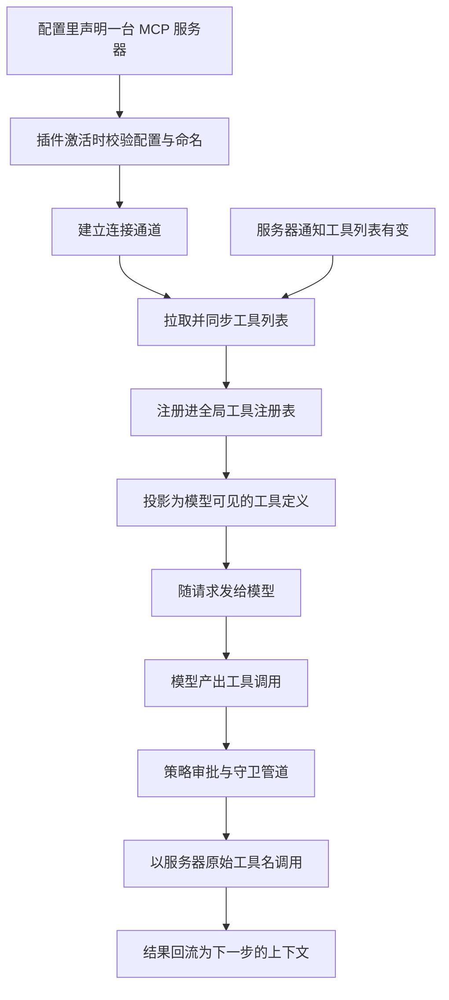
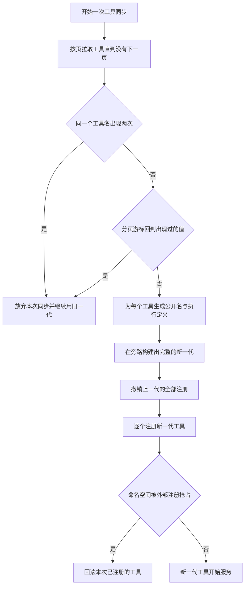
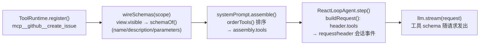
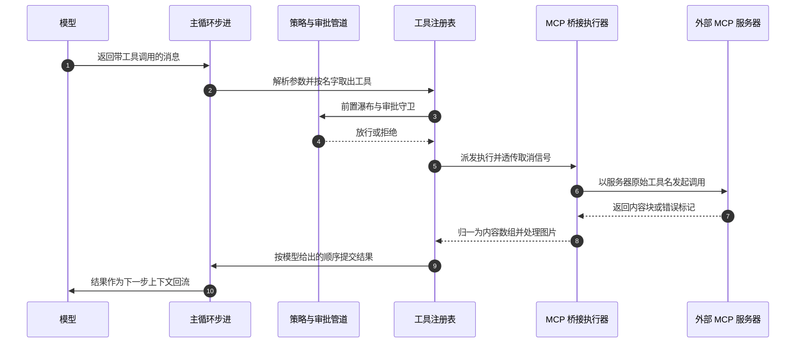
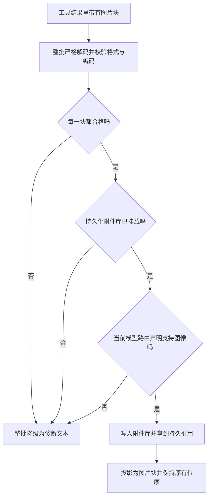
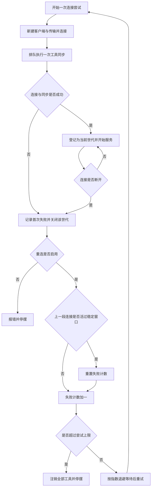

# 第三部分 · 新增章：MCP 技术架构与原理(DeepSeek Harness 源码分析)

> 分析对象:[innokria/deepseek-harness](https://github.com/innokria/deepseek-harness) @ `dbbaa4a37`
> **深入阅读(函数级)**:[`mcp/`](./mcp/README.md) —— 发现与同步、命名算法实测表、执行与结果映射、连接监管器九变量状态、传输与安全、测试与 23 条失败模式清单
> 核心源码:`packages/mcp/mcp-client/src/`(全包仅 4 个源文件,约 50 KB)+ `packages/core/`(tools / agent-loop / system-prompt)
> 设计依据:官方 Agent Note [`.agents/notes/implemented/feature/2026-07-07-mcp-client-plugin.md`](https://github.com/innokria/deepseek-harness/blob/dbbaa4a37fb9098aba814c97d2956f7b2f105f46/.agents/notes/implemented/feature/2026-07-07-mcp-client-plugin.md)

---

## 第〇节 一句话结论与总览

DSH 的 MCP 集成是**一个 Cordis 桥接插件**(`@deepseek-ai/dsh-mcp-client`),而非内建于主循环的子系统:每台外部 MCP 服务器对应一个插件实例,插件在激活时连接服务器、执行 `tools/list` 发现,把每个 MCP 工具**原样注册**进全局工具注册表 `ToolRuntime`,公开名统一为 `mcp__<serverName>__<rawName>`。从此刻起,MCP 工具与 harness 原生工具**走完全相同的链路**进入模型请求、被模型调用、经策略管道执行——主循环(agent-loop)不知道 MCP 的存在。

关键架构事实:

1. **只桥接 Tools**。MCP 的 Resources 和 Prompts 被明确放弃(官方 Agent Note:它们需要 harness 侧尚不存在的消费机制)。
2. **不自实现协议**。直接依赖官方 `@modelcontextprotocol/sdk`(`Client` / `StdioClientTransport` / `StreamableHTTPClientTransport`),DSH 不维护自己的 JSON-RPC。
3. **发现是配置驱动 + 协议驱动两层**:静态层由 `cordis.yml` 声明服务器;动态层由 MCP 协议的 `tools/list`(含分页)和 `notifications/tools/list_changed` 驱动。
4. **主循环零感知**:MCP 工具经 `ctx.tools.register()` 进入 `ToolRuntime` 后,对 agent-loop 而言与内置工具无异——同一套 schema 投影、同一套并行调度、同一套审批/守卫管道。

这一段讲的是**一个外部 MCP 工具从配置声明到被模型调用的完整生命周期**,也是全文的路线图。上半段是"发现与注册":把外部服务器上的工具变成注册表里一件普通工具;下半段是"使用":模型发出的调用怎么绕回外部服务器,结果又怎么回流成下一步的上下文。之所以要拉出这么长一条链,是因为 DSH 刻意不把 MCP 写进主循环——工具注册完之后与内置工具完全同构,主循环根本不知道 MCP 的存在。异常因此只影响链条的局部:服务器掉线由插件自己重连,工具列表变了由插件自己重新同步,主循环始终只看到一份稳定的工具表。


<details><summary>Mermaid 源码</summary>



</details>

| 阶段 | 做了什么 | 关键调用(文件:行) |
|---|---|---|
| 声明 | 每台外部服务器在 `cordis.yml` 里就是一条插件记录;ACP 客户端还能在会话创建时动态挂载 | `acp/acp/src/mcp.ts:26` |
| 校验与命名预订 | 校验 Config,并在注册作用域内预订 `serverName`,重名的后到者直接加载失败 | `mcp-client/src/index.ts:146` |
| 建立连接 | 按 `transport` 字段分派:要么拉起 stdio 子进程,要么连 Streamable HTTP | `mcp-client/src/transport.ts:31` |
| 发现工具 | 分页排空 `tools/list`;同名工具重复或游标重复都判为服务器故障,保留旧工具表 | `mcp-client/src/tools.ts:144` |
| 注册 | 每个工具以统一公开名 `mcp__<server>__<tool>` 进全局工具注册表 | `mcp-client/src/tools.ts:112` |
| 进系统提示 | 作用域内可见的工具被投影成名字、描述、参数三字段;执行与展示回调不进模型视野 | `core/tools/src/index.ts:972` |
| 进模型请求 | 每个 step 重新组装一次工具表;工具集有变化会额外落一条 `request/header` 会话事件 | `core/agent-loop/src/agent.ts:245`、`:553` |
| 模型发起调用 | 从 assistant 消息里检出工具调用块,按并发模式分组后逐个派发 | `core/agent-loop/src/tool-calls.ts:60` |
| 回到服务器 | 执行器用服务器原始工具名发 `tools/call`,取消信号与默认 60 秒超时一路透传 | `mcp-client/src/tools.ts:81`、`:91`、`:93` |
| 结果回流 | 结果按模型给出的顺序提交,落 `tool/result` 事件,再作为下一步上下文回流 | `core/agent-loop/src/tool-calls.ts:60`、`:312` |

<details><summary>原图(供逐行核对)</summary>

```text
+-------------------------+        spawn / HTTP        +----------------------+
| cordis.yml / ACP 声明   |                            | 外部 MCP 服务器        |
| (每台服务器一条记录)      |                            | (stdio 子进程 / HTTP) |
+-----------+-------------+                            +----------+-----------+
            v                                                     ^
+-----------+-------------+        tools/list (分页)              |
| mcp-client 插件 apply() |  ------------------------------------+
|  - Config schema 校验   |
|  - serverName 命名预订  |        notifications/tools/list_changed
|  - startConnection()    |  <-----------------------------------+
+-----------+-------------+
            v
+-----------+-------------+        ctx.tools.register(def)
| syncTools 两阶段同步     |  --------------------------+
|  fetch → swap           |                            v
+-------------------------+              +-------------+-----------+
                                         | ToolRuntime (core/tools) |
                                         |  ScopedLayers 注册表      |
                                         +-------------+-----------+
                                                       | wireSchemas()
                                                       v
                                         +-------------+-----------+
                                         | systemPrompt.assemble() |
                                         |  → assembly.tools       |
                                         +-------------+-----------+
                                                       v
                                         +-------------+-----------+
                                         | ReactLoopAgent.step()   |
                                         |  → LLM 请求携带 tools   |
                                         |  → tool-call 块          |
                                         |  → executeToolCalls()   |
                                         +-------------+-----------+
                                                       | tools/call(rawName)
                                                       v
                                              回流模型(下一步)
```

</details>

---

## 第一节 MCP 发现机制:从配置到工具注册表

发现链路分四步:**声明 → 校验与命名空间预订 → 连接(传输建立)→ 工具同步**。

### 1.1 声明:cordis.yml 与 ACP 两个入口

DSH 没有 `.mcp.json` 这类独立配置文件,也没有运行时动态 API。发现的第一层是 **Cordis 插件加载**——每台 MCP 服务器就是 `cordis.yml` 里的一条插件记录(`packages/mcp/mcp-client/README.md`):

```yaml
- id: mcp-github
  name: '@deepseek-ai/dsh-mcp-client'
  config:
    serverName: github          # 本地命名空间,决定模型可见工具名前缀
    transport: stdio
    command: npx
    args: ['-y', '@modelcontextprotocol/server-github']
    env:
      GITHUB_TOKEN: !!js process.env.GITHUB_TOKEN

- id: mcp-web
  name: '@deepseek-ai/dsh-mcp-client'
  config:
    serverName: web
    transport: streamable-http
    url: http://localhost:3000/mcp
```

第二个入口是 ACP(Agent Client Protocol):外部客户端在 `session/new` 里声明的标准 `mcpServers` 列表,由 `packages/acp/acp/src/mcp.ts:26` 的 `mountAcpMcpServers` 翻译成 `McpClient.Config` 后,以 **Agent 作用域**逐个 `agentCtx.plugin(McpClient, config)` 动态挂载——这是唯一的非 cordis.yml 装载路径,且强制 `failOnStartupError: true`:

```typescript
// packages/acp/acp/src/mcp.ts
export async function mountAcpMcpServers(agentCtx, servers, sessionCwd) {
  const configs = resolveMcpConfigs(servers, sessionCwd)
  for (const config of configs) await agentCtx.plugin(McpClient, config)
}
```

ACP 侧还复刻了一套命名规范化:`normalizeServerName`(`acp/src/mcp.ts:111`)把 ACP 的人可读服务器名 NFKD 归一 + 非法字符替换 + 截断 + 8 位 SHA-256 摘要,产出满足 `^[A-Za-z0-9_-]{1,32}$` 的稳定 `serverName`——与客户端的公开名算法是同一套"有损即加哈希"思想。

### 1.2 校验与命名空间预订:`apply()`

插件入口 `apply()`(`packages/mcp/mcp-client/src/index.ts:146`)按严格顺序做三件事,任何一步失败都**在加载期即抛错**(fail loud,仓库的显式约定):

```typescript
export async function apply(ctx: Context, config: Config): Promise<void> {
  // 1. 重连策略:即使绕过 Schemastery 编程构造,这里也重新裁决全部默认值与边界
  const reconnect = resolveReconnectPolicy(config.reconnect, `mcp-client(${config.serverName}): reconnect`)

  // 2. serverName 命名空间预订:同一注册作用域内重复即拒绝后到的实例
  ctx.effect(() => {
    const owner = scopeOf(ctx) ?? ctx.root
    let names = activeServerNames.get(owner)       // WeakMap<scope, Set<string>>
    ...
    if (names.has(config.serverName)) throw new Error(
      `mcp-client: serverName "${config.serverName}" is already in use ...`)
    names.add(config.serverName)
    return () => void names.delete(config.serverName)   // effect disposer 释放预订
  }, 'mcp-client.serverName')

  // 3. 启动连接监管器,并把"激活完成"阻塞在首次连接+首次工具同步上
  const connection = startConnection(ctx, config, reconnect)
  ctx.effect(() => () => connection.dispose(), 'mcp-client.connection')
  const outcome = await connection.ready
  if (outcome.error !== undefined && config.failOnStartupError) {
    throw new Error(`mcp-client(${config.serverName}): initial connection or tool synchronization failed`, ...)
  }
}
```

设计要点:

- **Config 是以 `transport` 为判别式的封闭联合**(`index.ts:113`),Schemastery schema 校验 `serverName` 必须匹配 `^[A-Za-z0-9_-]{1,32}$`。`serverName` 刻意取**本地配置**而非服务器自报的 `serverInfo.name`——后者是不可信输入、跨部署不唯一、升级可变,任何一条都不允许静默改名模型可见工具。
- **命名空间预订按作用域隔离**(`activeServerNames: WeakMap<object, Set<string>>`):Agent 级 MCP 服务器可在另一个 Agent 中复用同名命名空间,而全局实例与同一 Agent 内的重复互斥。预订本身就是一个 Cordis effect,插件处置(HMR 热替换)时自动释放。
- **激活语义**:`await connection.ready` 保证 Cordis 消费者在 fiber 激活后**立刻**看到工具;`failOnStartupError` 决定首次失败是让 fiber 回滚(ACP 路径)还是记录错误后进入重连循环(cordis.yml 默认)。

### 1.3 传输建立:`createTransport`

传输层是一个按 `transport` 字段分派的工厂:同一个入口,要么产出拉起子进程的 stdio 传输,要么产出 Streamable HTTP 传输(`transport.ts:31`)。

```typescript
export function createTransport(config: Config): Transport {
  switch (config.transport) {
    case 'stdio':
      return new StdioClientTransport({
        command: config.command, args: config.args,
        env: buildChildEnv(config.env),      // scrubbedParentEnv() + 显式 env
        cwd: config.cwd,
      })
    case 'streamable-http':
      return new StreamableHTTPClientTransport(
        new URL(config.url), { requestInit: { headers: config.headers } }) as Transport
  }
}
```

stdio 路径的关键是 `buildChildEnv`(`transport.ts:21`):子进程环境 = 子进程能力缝共享的 `scrubbedParentEnv()`(剔除匹配 `/KEY|PASSWORD|SECRET|TOKEN/i` 的环境变量和全部 ambient `DSH_*`,见 `packages/subprocess/subprocess/src/index.ts:64`)**再叠加**配置里的显式 `env`。即:**凭据默认不外泄给 MCP 服务器进程,显式声明的凭据才放行**。这是 stdio 传输唯一的安全边界——README 直言"每条服务器命令都是 agent 沙箱之外的受信任可执行代码"。

### 1.4 工具同步:`syncTools` 的两阶段原子替换

发现的核心在 `packages/mcp/mcp-client/src/tools.ts:144` 的 `syncTools`。它用**两阶段代际替换**保证模型要么看到完整的上一代工具表,要么看到完整的新一代,永远看不到半个列表:

工具同步用的是"先在旁边把新一代建好、再一次性换上去"的两阶段做法。第一阶段只做拉取和构建,完全不碰注册表;第二阶段才撤掉旧一代、注册新一代。这样模型看到的工具表永远是完整的一代:要么旧的一整份,要么新的一整份,不会撞见换到一半的中间状态。失败也被这两阶段分得很干净——第一阶段出错就整批放弃,旧代照常服务;第二阶段出错则回滚本次已注册的部分,并留下一声响亮的报错。


<details><summary>Mermaid 源码</summary>



</details>

| 阶段 | 做了什么 | 关键调用(文件:行) |
|---|---|---|
| 第一阶段 · 拉取分页 | 循环请求工具列表直到服务器不再给出下一页游标;不使用 SDK 的便捷方法,以便自己掌控传输后的 JSON 校验 | `mcp-client/src/tools.ts:155`、`:73` |
| 第一阶段 · 判重名 | 服务器把同名工具列出两次即判为无效列表,整批放弃,旧代继续服务 | `mcp-client/src/tools.ts:158` |
| 第一阶段 · 防游标死循环 | 记住本次同步用过的所有游标,游标回到出现过的值就拒绝整个列表 | `mcp-client/src/tools.ts:177` |
| 第一阶段 · 构建新代 | 为每个工具算出公开名并构建执行定义,写进一个尚未生效的映射表 | `mcp-client/src/tools.ts:163`、`:112` |
| 第二阶段 · 撤旧代 | 依次执行上一代每个注册项的 dispose 回调 | `mcp-client/src/tools.ts:187` |
| 第二阶段 · 注册新代 | 逐个把新定义注册进全局工具注册表 | `mcp-client/src/tools.ts:191` |
| 第二阶段 · 冲突回滚 | 命名空间被外部注册抢占时,撤销本次已注册的全部工具,回到零工具并响亮报错 | `mcp-client/src/tools.ts:197` |
| 同步串行化 | 初始同步与通知触发的重同步全部挂在同一条 promise 链上,避免两次换代的撤旧与注册交错 | `mcp-client/src/connection.ts:161` |

<details><summary>原图(供逐行核对)</summary>

```text
阶段一 fetch(不触碰注册表)
  ├─ do { tools/list(cursor) } while (nextCursor)     ← 排空分页
  ├─ 同一服务器列出同名工具两次        → throw,保留旧代
  ├─ 服务器重复同一个 continuation cursor → throw,保留旧代(防死循环)
  └─ 每个工具 → publicToolName() + createDefinition() 构建新代 Map
        |
        v
阶段二 swap
  ├─ dispose 上一代全部注册
  ├─ 逐个 ctx.tools.register(definition)
  └─ 冲突(外部注册抢占 mcp__<serverName>__ 命名空间)
       → 回滚已注册的半代(零工具) + 响亮报错;startup 严格模式继续上抛
```

</details>

对应代码(`tools.ts:150-203`):

```typescript
// Phase 1: fetch and build the next generation without touching the registry.
const definitions = new Map<string, ToolDefinition>()
const seenCursors = new Set<string>()
let cursor: string | undefined
do {
  const response = await listToolsUncached(client, cursor)   // 绕过 SDK 的按页 schema 缓存
  for (const tool of response.tools) {
    const publicName = publicToolName(opts.serverName, tool.name)
    if (definitions.has(publicName)) throw new Error(
      `mcp-client(${opts.serverName}): server listed tool "${tool.name}" more than once — invalid tool list`)
    definitions.set(publicName, createDefinition(client, ctx, publicName, tool.name, ...))
  }
  cursor = response.nextCursor
  if (cursor) {
    if (seenCursors.has(cursor)) throw new Error('... repeated a tools/list continuation cursor ...')
    seenCursors.add(cursor)
  }
} while (cursor)

// Phase 2: swap generations.
for (const dispose of previous.values()) dispose()
try {
  for (const [publicName, definition] of definitions)
    disposers.set(publicName, ctx.tools.register(definition))
} catch (error) {
  for (const dispose of disposers.values()) dispose()   // 回滚:全有或全无
  ...
}
```

三个非显而易见的设计决策:

1. **桥要自己掌握传输之后的 JSON 校验权,所以不用 SDK 的便捷方法。** `listToolsUncached` / `callToolUncached` 直接发协议请求,而 SDK 的 `listTools`/`callTool` 内置了按页 output-schema 校验缓存,可能用桥不支持的模式做预校验;桥要的正是自行校验收到的 JSON(`RawCallToolResultSchema = z.record(z.string(), z.unknown())`,`tools.ts:73`、`:81`)。
2. **重复 cursor 检测**:空页无法靠工具名唯一性证明推进,所以维护本次同步内的 cursor 历史,发现环即拒绝整个列表(真实事故驱动,见官方 note 引用的 discussion #3660)。
3. **工具schema 原样透传**:MCP 的 JSON Schema 和 description 不经任何 DSL 转换直接进注册表("garbage-in-garbage-out 是服务器作者的责任");只有 `outputSchema` 会经 `assertSupportedJsonSchema` 过滤,不支持的词汇降级为宽松 schema(`tools.ts:231`)。

### 1.5 命名契约:`publicToolName`

每个 MCP 工具有两个名字,职责严格分离(`tools.ts:6-10` 的模块契约):

- `rawName` — MCP `Tool.name` 原文,**只上线**(`tools/call`);
- `publicName` — 模型可见、注册表全局唯一的名字,**永不解析回 rawName**(executor 闭包直接持有 rawName)。

```typescript
// packages/mcp/mcp-client/src/tools.ts:112
export function publicToolName(serverName: string, rawName: string): string {
  const joined = `mcp__${serverName}__${rawName}`
  const normalized = joined.replace(/[^A-Za-z0-9_-]/g, '_')
  if (normalized === joined && normalized.length <= 64) return normalized
  const hash = createHash('sha256').update(`${serverName}\0${rawName}`).digest('hex').slice(0, 12)
  return `${normalized.slice(0, 64 - 12 - 1)}_${hash}`
}
```

- `mcp__<server>__<tool>` 拼写对齐 Claude Code / Codex 的事实标准;`mcp__` 前缀把 MCP 注册隔离出原生工具命名空间,并给权限/遥测规则提供稳定形态(`mcp__*`、`mcp__github__*`)。
- DeepSeek function-name 契约(64 字符、`[A-Za-z0-9_-]`)比 MCP 宽松契约(128 字符、允许 `.`)严格;**有损归一化必追加 12 位 SHA-256 身份哈希**,保证不同的 `(serverName, rawName)` 永不坍缩成同一公开名。
- 公开名是 `(serverName, rawName)` 的纯函数 → HMR 热替换只要 `serverName` 不变就重建出**完全相同**的模型可见名,会话历史与权限规则保持有效。

### 1.6 动态重发现:`tools/list_changed`

连接建立**之前**就注册通知处理器(`connection.ts:257`),保证初始同步期间的列表变更排队而非丢失:

```typescript
generation.setNotificationHandler(ToolListChangedNotificationSchema, async () => {
  if (!isCurrent(generation)) return          // 过期代不许行动
  ctx.logger.info(`${label}: tool list changed, re-syncing`)
  try { await enqueueSync(generation) }       // 重跑同一套两阶段 sync
  catch (error) { /* fetch 阶段失败:旧代仍在注册表,继续服务最后一份好列表 */ }
})
```

由于命名是确定性的,未变化的工具在重同步后名字不变;`enqueueSync` 用一条单调 promise 链(`syncChain`,`connection.ts:161`)把所有代际的所有同步串行化,杜绝两次 sync 的 dispose/register 交错导致双重释放或泄漏。

---

## 第二节 MCP 工具在主循环中的使用

### 2.1 从注册表到模型请求:schema 投影链

MCP 工具注册后进入 `ToolRuntime`(`packages/core/tools/src/index.ts:780`)。注册动作本身极薄——校验 `output { schema, render }` 契约后插入 ScopedLayers(`index.ts:1027`):

```typescript
register(definition: ToolDefinition): () => void {
  ...
  return this.layers.effect(this.ctx, layer => layer.tools.insert(name, definition),
    { label: 'tools.register()' })
}
```

进入模型请求的链路有四环,全部由 `ToolRuntime` 构造函数里的一行驱动(`index.ts:825`):

```typescript
ctx.systemPrompt.tools(context => this.wireSchemas(context.scope))
```



- `wireSchemas`(`tools/index.ts:972`)把调用作用域可见的定义投影成 `{name, description, parameters}` 三字段——执行回调、展示回调**不进**模型视野。MCP 工具的 `parameters` 就是服务器声明的 JSON Schema 原文。
- `system-prompt` 的 `assemble()`(`packages/core/system-prompt/src/index.ts:552`)聚合全部 tools provider 的结果,按 `toolOrder` 配置或字典序排序(`orderTools`),产出 `assembly.tools`。
- agent-loop 每个 step 重新 assemble(`agent-loop/src/agent.ts:245`),`buildRequest` 把 tools 记入 `canonicalHeader` 并**落会话日志** `request/header`(`agent.ts:553-581`);`toolsChanged()`(`agent.ts:262`)比对基线,工具集变化(例如 MCP 重同步)会触发新的 header 事件与系统提示重投——满足仓库"模型可见 ⟺ 已落日志"的不变式。

### 2.2 调用调度:模型 tool-call → MCP `tools/call`

主循环 `ReactLoopAgent.step()`(`agent-loop/src/agent.ts:352`)在 assistant 消息中检出 tool-call 块后,交给 `executeToolCalls`(`agent-loop/src/tool-calls.ts:60`)。全链路伪代码改写如下:

这一段是**模型发出一次工具调用之后真正发生的事**:调用先被解析并落日志,再过策略管道(插件可以在这里改写或拦截)、审批和守卫,然后才派发到 MCP 桥的执行器。执行器用服务器的原始工具名发 `tools/call`,把结果归一成内容数组后,按模型给出的顺序提交回会话。对 MCP 而言最要紧的一点是管道全程没有特例:审批规则看到的只是 `mcp__github__create_issue` 这样的普通名字,取消信号和超时也照常一路透传下去。


<details><summary>Mermaid 源码</summary>



</details>

| 阶段 | 做了什么 | 关键调用(文件:行) |
|---|---|---|
| 取出调用 | 从本步 assistant 消息里过滤出工具调用块,逐个准备派发 | `core/agent-loop/src/tool-calls.ts:60` |
| 参数解析 | 参数文本解析失败就保留原文,空输入按空对象处理,让工具自己报缺参 | `core/agent-loop/src/tool-calls.ts:60` |
| 并发分组 | 按工具声明的并发模式分组:可并行的进有界滚动池,独占的等前面的调用全部结束 | `core/agent-loop/src/tool-calls.ts:89` |
| 落调用事件 | 每个调用先写一条 `tool/call` 会话事件,再谈执行 | `core/agent-loop/src/tool-calls.ts:168` |
| 前置瀑布与审批 | 插件可在 `tools/pre-execute` 瀑布里改写或拦截;需要审批的走 ask,守卫只可否决、不能强放 | `core/tools/src/index.ts:446` |
| 派发执行 | 过了策略的调用交给调度器,由它调用工具体 | `core/tools/src/index.ts:1522` |
| 桥接执行器 | 执行器把参数转给 MCP 的调用接口,取消信号与默认 60 秒请求超时一起下去 | `mcp-client/src/tools.ts:330`、`:91`、`:93` |
| 发起协议调用 | 发给服务器的是 `rawName` 原文,永远不是模型看到的公开名 | `mcp-client/src/tools.ts:81` |
| 错误归一 | 服务器标记 `isError` 时抛错,由注册表统一产出模型可见的错误结果 | `mcp-client/src/tools.ts:330` |
| 结果归一 | 旧式 `toolResult` 形状统一成内容数组;含图片时转入图片准入与投影 | `mcp-client/src/tools.ts:366` |
| 按序提交 | 结果按模型给出的顺序提交,逐个落 `tool/result` 会话事件 | `core/agent-loop/src/tool-calls.ts:147` |
| 上下文回流 | 结果消息进下一步的收件箱,下一个 step 随上下文回到模型 | `core/agent-loop/src/agent.ts:490` |

<details><summary>原图(供逐行核对)</summary>

```text
ReactLoopAgent.step()
  └─ stream 完成 → message.content 中过滤出 tool-call 块
  └─ executeToolCalls(ctx, turn, step, toolCalls, signal)
       ├─ parseArguments: JSON.parse 失败保留原文;空输入 → {}
       ├─ 按 executionMode 分组:parallel → 有界滚动池;exclusive → 屏障
       │    (MCP 桥未声明 isConcurrencySafe → 一律 exclusive,逐个执行)
       ├─ 每个调用:
       │    ├─ appendToolCall    → 会话落 'tool/call' 事件
       │    ├─ scheduler.prepare → tools/pre-execute 瀑布(插件可改写/拦截)
       │    │                    → 审批 ask(user-approval)
       │    │                    → 单调守卫 guard(可否决,不可强放)
       │    ├─ scheduler.dispatch → dispatchToolBody()
       │    │    └─ tool.execute(args, exec)        ← MCP 桥的 executor
       │    │         ├─ callToolUncached(client, rawName, args, {signal, timeout: 60s})
       │    │         │      └─ MCP SDK → tools/call(rawName 原文,永不是公开名)
       │    │         ├─ isError:true → throw(注册表捕获路径产出模型可见错误结果)
       │    │         ├─ legacy toolResult 形状 → 归一为 content 数组
       │    │         └─ 含图片 → 图片准入与投影(见 2.3)
       │    └─ commitReady(): 按模型序提交
       │         └─ appendToolResult → 会话落 'tool/result' 事件
       └─ 结果消息进 inbox('next-step') → 下一 step 随上下文回流模型
```

</details>

对 MCP 而言,关键的事实是**管道对 MCP 无特例**:

- 审批与守卫:`tools/pre-execute` 瀑布和 guard 看到的是 `mcp__github__create_issue` 这样的普通名字,权限规则因此可以用 `mcp__github__*` 这类前缀形态稳定匹配——这正是命名契约里 `mcp__` 标记买来的能力。
- 取消:agent-loop 的 `exec.signal` 被一路透传进 MCP SDK 的 `tools/call`(`tools.ts:91`),还进入图片路由查询与入库前闸门(`tools.ts:428`)。
- 超时:`toolCallTimeoutMs`(默认 60s)作为 MCP SDK 请求级超时(`tools.ts:93`)。
- 参数容错:模型可能输出裸字符串/数字/null,executor 兜底为 `{}`(`tools.ts:329`),让 MCP 服务器自己产出"缺少必填参数"的可学习错误,而不是桥内崩掉。

### 2.3 结果处理:规范值与投影分离

MCP 结果的处理是桥内最精细的部分,核心矛盾是:**程序化调用者(PTC 模式)需要协议完整的原始块,而模型上下文需要持久化的核心内容词汇**。解法是"一个规范值 + 一个投影"(`tools.ts:40-44`):

```typescript
/** Canonical MCP result exposed to PTC mode without discarding protocol blocks. */
export type McpResult<Structured extends JsonValue = JsonValue> = {
  content: JsonValue[]            // 协议完整块,含 base64 原图
  structuredContent?: Structured
}
```

文本投影(`projectContent`,`tools.ts:519`)把有序 MCP 块映射到核心词汇:text 合并(以 `\n` 连接,刻意规避 DeepSeek 序列化器 `join('')` 丢块边界的问题)、`resource_link` 保留 name/URI 为文本、audio/embedded resource/未知类型一律变成**显式诊断占位文本**而非静默丢弃。

图片走准入制,伪代码:

工具结果里带图片时,桥不会把图片直接塞进模型上下文,而是先过两道闸门。第一道是整批严格解码:格式必须落在 png/jpeg/webp/gif 之内,base64 必须是规范写法,只要有一块不合格,整批图片就一起降级成一行诊断文本——绝不出现"部分图片被引用"的半成品。第二道是能力准入:既要挂着持久化附件库,又要调用方当前那个精确模型路由明确声明支持图像输入,缺任一条同样整批降级。两道都过了才落盘,并投影成图片引用块,保持原来的位置顺序。


<details><summary>Mermaid 源码</summary>



</details>

| 阶段 | 做了什么 | 关键调用(文件:行) |
|---|---|---|
| 整批解码 | 逐块解码图片,格式限 png/jpeg/webp/gif,base64 必须是规范写法 | `mcp-client/src/tools.ts:443`、`:456` |
| 整批否决 | 只要有一块不合格,就整批投影成诊断文本,不保留任何部分引用 | `mcp-client/src/tools.ts:462` |
| 准入 · 附件库 | 必须挂载附件库服务,否则拒绝 | `mcp-client/src/tools.ts:410` |
| 准入 · 精确路由 | 取调用方 Agent 当前请求头里的 provider 与 model,解析不出来即拒绝 | `mcp-client/src/tools.ts:412` |
| 准入 · 能力声明 | 模型信息里必须显式声明支持图像输入,缺声明即拒绝 | `mcp-client/src/tools.ts:425` |
| 准入失败 | 准入过程中的任何原因都整批降级为诊断文本,并把原因写进占位文本 | `mcp-client/src/tools.ts:474`、`:478` |
| 持久化 | 把解码结果写进附件库,拿到持久引用 | `mcp-client/src/tools.ts:482` |
| 投影 | 投影成图片引用块并按原始下标放回原位,文本段落保持换行合并 | `mcp-client/src/tools.ts:484`、`:519` |
| 存储失败 | 落盘失败同样整批降级为诊断文本 | `mcp-client/src/tools.ts:492` |
| 富投影交接 | 执行器把富投影暂存起来,注册表事后比对"值仍是原规范值且回退内容未变"才安装 | `mcp-client/src/tools.ts:272`、`:277` |

<details><summary>原图(供逐行核对)</summary>

```text
execute 返回含 image 块
  └─ prepareImageProjection()
       ├─ 整批严格解码:mediaType ∈ {png,jpeg,webp,gif};base64 必须 canonical
       │    (Buffer→base64 往返比对,拒绝 URL-safe 别名与空白)
       │    任一块失败 → 全部图片降级为诊断文本,不出部分引用
       ├─ resolveImageAdmission()
       │    ├─ 必须挂载 attachment store(ctx.get('attachments'))
       │    ├─ 解析调用 Agent 的当前精确路由(provider/model)
       │    └─ llm.resolveModelInfo 必须声明 inputModalities 含 'image'
       │       ——"确切的正面能力证明",缺任一条件即拒
       ├─ attachments.saveImages(decoded) → 持久化,得 ImageAttachmentRef
       └─ 投影为 { type:'image', attachment: ref } 块,保持原位序
```

</details>

投影的交接用了防竞态设计:executor 把富投影暂存在**以本次执行为键的 WeakMap**(`tools.ts:265`),`output.render` 保持同步纯函数;`finalizeContent`(`tools.ts:272`)只在注册表的事后结果**仍是原规范值且原回退内容**(`isDeepStrictEqual` 双比对)时才安装富投影——策略拦截、值替换或一次重同步都不会让旧代消费新执行的状态。

---

## 第三节 连接监管:代际模型与有界重连

`connection.ts` 的 supervisor 是可靠性核心,抽象为**代际(generation)**模型:一次连接尝试 = 新 `Client` + 新 transport(MCP SDK 把一个 Protocol 终身绑定到一个 transport,故重连必须整体换新),全局只有一个"当前代",`isCurrent()` 闸门(`connection.ts:153`)使过期代的 close/error/通知回调幂等失效。

连接监管把每一次连接尝试做成一个**世代**:新建客户端和新传输,全局只认最后一个成功建立的世代,过期世代靠一道闸门把自己的关闭、报错、通知回调统统变成空操作。这样重连时不必小心翼翼地区分"这条通知来自哪次连接",也不会出现两代互相踩踏。它必须整体换新的原因是 MCP 的协议对象一旦绑定传输就终身不变,断线只能重建。掉线按指数退避重连,但同一次故障里共享一份有限的尝试预算;预算耗尽后插件会注销全部工具彻底停摆,只留下 dispose 或热替换一条复活路径——这比留一堆必然失败的工具要诚实。


<details><summary>Mermaid 源码</summary>



</details>

| 阶段 | 做了什么 | 关键调用(文件:行) |
|---|---|---|
| 建世代 | 每次尝试都新建客户端与传输;MCP 的协议对象终身绑定一个传输,重连只能整体换新 | `mcp-client/src/connection.ts:237` |
| 连接与首次同步 | 连接成功后排队一次工具同步;工具变更的通知处理器在连接之前就注册好,免得初始同步期间的变更丢失 | `mcp-client/src/connection.ts:257`、`:272` |
| 当前代闸门 | 只有当前世代能行动,过期世代的关闭、报错、通知回调一律变成空操作 | `mcp-client/src/connection.ts:153` |
| 连接成功 | 记下连接建立时间,之后由关闭信号触发下线判断 | `mcp-client/src/connection.ts:303`、`:248` |
| 连接失败 | 记下首次失败原因,关闭当前世代,再等一个 5 秒上限的关闭屏障 | `mcp-client/src/connection.ts:284`、`:285` |
| 关闭超时 | 世代没在时限内关闭就停止重连,避免两个服务器子进程重叠 | `mcp-client/src/connection.ts:288` |
| 重连被禁用 | 只报错并停摆;已注册的工具会一直调用失败,直到热替换或重启宿主 | `mcp-client/src/connection.ts:194` |
| 稳定窗口 | 上一段连接活过最长退避间隔就视为上一次故障结束,失败计数清零,新故障重新计预算 | `mcp-client/src/connection.ts:203` |
| 预算耗尽 | 失败次数超过上限后注销全部工具、彻底停摆,只有 dispose 或热替换能复活 | `mcp-client/src/connection.ts:206`、`:210` |
| 退避重试 | 等待时间从初始值翻倍增长并封顶到最长间隔,定时器不阻止进程退出 | `mcp-client/src/connection.ts:216`、`:224` |
| 同步串行化 | 所有世代的同步共用一条 promise 链,避免两次换代的撤旧与注册交错 | `mcp-client/src/connection.ts:161` |
| 平息式终止 | 先清重连定时器,关当前世代并等它关闭,再等在途连接与排队同步收敛,最后才注销工具 | `mcp-client/src/connection.ts:327`、`:345`、`:347` |

<details><summary>原图(供逐行核对)</summary>

```text
connectGeneration(startup)
  ├─ new Client + createTransport → connect → enqueueSync
  ├─ 成功:connectedAt = now;onclose 之后到来 → generationDown()
  └─ 失败:记录 firstAttemptError → close() → 等 close 屏障(5s 上限,
          超时则停重连以防子进程重叠)→ generationDown()

generationDown() → scheduleReconnect()
  ├─ reconnect.enabled === false → 报错后停摆(工具留在注册表但调用会失败)
  ├─ 上次连接存活 ≥ maxDelayMs(稳定窗口)→ 重置 failedAttempts(新 outage 新预算)
  ├─ failedAttempts++ > maxAttempts(默认 10)
  │    → 注销全部工具,彻底停摆;只有 dispose/HMR 能复活
  └─ delay = min(maxDelayMs, 500ms × 2^(n-1)) → setTimeout(unref) → connectGeneration(false)
```

</details>

默认值(`RECONNECT_DEFAULTS`,`connection.ts:40`):`enabled: true`、`initialDelayMs: 500`、`maxDelayMs: 30_000`、`maxAttempts: 10`。

三个值得记录的工程决策:

1. **一次 outage 共享一份尝试预算**:连接稳定超过最长退避间隔(30s)才算 outage 结束、下次断连开新预算;崩溃循环的服务器即使偶尔短暂连上也会耗尽预算,而不是无限重启。
2. **预算耗尽 = 注销工具并停摆**,恢复只有 dispose/HMR 一条路——避免"工具注册了但调用必失败"的部分可用态长期存在。
3. **dispose 是平息(quiesce)而非请求**(`connection.ts:327`):清重连定时器 → close 当前代并等 close 屏障 → `await settling`(在进行中的连接尝试)→ `await syncChain`(排队的同步)→ 最后才注销剩余工具。顺序保证 `disposers` 在注销时是终态,无子进程重叠、无注册泄漏。

---

## 第四节 安全与信任边界汇总

| 边界 | 机制 | 代码位置 |
|---|---|---|
| 凭据外泄(stdio) | `scrubbedParentEnv()` 剔除 `KEY/PASSWORD/SECRET/TOKEN` 与 ambient `DSH_*`;显式 `env` 叠加于其后 | `transport.ts:21`、`subprocess/src/index.ts:64` |
| 命名冲突 | 强制 `mcp__<serverName>__` 命名空间;同服务器重名/跨实例重复 serverName/注册表被抢占分别 throw、加载期拒绝、回滚+报错 | `tools.ts:144-203`、`index.ts:154-168` |
| 恶意/故障服务器(发现期) | 分页 cursor 环检测;两阶段同步保留旧代;任务型工具(`taskSupport:'required'`)执行期显式拒绝 | `tools.ts:177`、`tools.ts:322` |
| 恶意/故障服务器(执行期) | 传输后 JSON 校验桥自有;content 块按不可信输入逐字段兜底;base64 canonical 双向校验;`isError` 统一走注册表错误路径 | `tools.ts:59,211,389` |
| 图片注入模型上下文 | 持久化附件库 + 当前模型路由的确切图像能力声明,双重准入;任何拒绝整批降级为文本 | `tools.ts:409-497` |
| 沙箱定位 | MCP 服务器进程是**沙箱外受信代码**,默认不启用任何服务器 | `apps/cli/reference/README.md:105` |

---

## 第五节 关键文件索引

| 文件 | 职责 |
|---|---|
| `packages/mcp/mcp-client/src/index.ts` | 插件入口:Config schema、serverName 预订、激活语义 |
| `packages/mcp/mcp-client/src/connection.ts` | 连接监管:代际模型、重连预算、dispose 平息 |
| `packages/mcp/mcp-client/src/tools.ts` | 工具桥:发现同步、命名、执行器、结果投影与图片准入 |
| `packages/mcp/mcp-client/src/transport.ts` | 传输工厂:stdio(环境清洗)/ Streamable HTTP |
| `packages/acp/acp/src/mcp.ts` | ACP `mcpServers` 声明 → Agent 作用域 MCP 客户端 |
| `packages/core/tools/src/index.ts` | `ToolRuntime`:register/wireSchemas/调度与策略管道 |
| `packages/core/agent-loop/src/agent.ts` | `ReactLoopAgent`:assemble → buildRequest → step |
| `packages/core/agent-loop/src/tool-calls.ts` | `executeToolCalls`:并发调度、会话落事件、结果回流 |
| `packages/core/system-prompt/src/index.ts` | tools provider 聚合与 `orderTools` |
| `apps/cli/config/examples/mcp-memory/*.cordis.yml` | 三份默认关闭的 MCP 记忆系统参考配置 |
| `.agents/notes/implemented/feature/2026-07-07-mcp-client-plugin.md` | 官方设计决策记录(命名不变式、备选方案、后果) |

---

## 附:与其他实现的定位差异

| 维度 | Claude Code | DeepSeek Harness |
|---|---|---|
| 集成形态 | 内置子系统 + `.mcp.json` | 普通 Cordis 插件,`cordis.yml` 每服务器一条 |
| 命名 | `mcp__<server>__<tool>` | 同(明确对齐其拼写) |
| 动态装载 | 配置文件 | cordis.yml HMR 热替换 + ACP 会话级挂载 |
| 工具变更 | 轮询/重启 | 协议原生 `tools/list_changed` 通知 + 两阶段原子替换 |
| 崩溃恢复 | 客户端各异 | 代际监管 + 有界指数退避,耗尽即注销停摆 |
| 图片结果 | 依客户端 | 模型能力准入 + 持久化附件库,拒绝即整批文本降级 |
