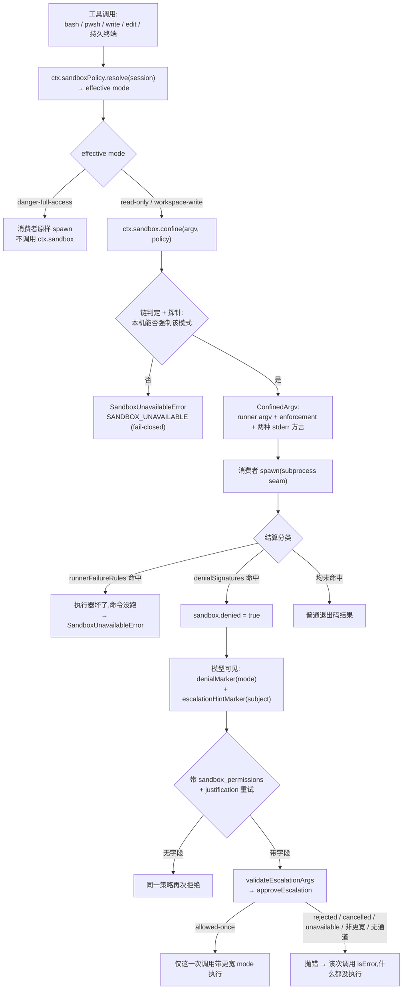

# 第七章：Sandbox 技术实现与运行机制(DeepSeek Harness 源码分析)

> 分析对象:[innokria/deepseek-harness](https://github.com/innokria/deepseek-harness) @ `dbbaa4a37`
> **深入阅读(函数级)**:[`sandbox/`](./sandbox/README.md) —— 缝隙与策略逐字段、平台后端真实 argv、升级的八条失败点、五个消费方走查、E2B 证据链、20 条 fail-closed 抛点与边界清单
> 核心源码：`packages/sandbox/`(seam / policy / local / windows-acl 四包)+ `packages/fs/fs-sandbox`、`packages/shell/bash-sandbox`、`packages/shell/pwsh-sandbox`、`packages/terminal/terminal-bash`、`packages/e2b/`(三包)
> 设计依据：官方 Agent Note [`.agents/notes/implemented/feature/2026-07-06-sandbox.md`](https://github.com/innokria/deepseek-harness/blob/dbbaa4a37fb9098aba814c97d2956f7b2f105f46/.agents/notes/implemented/feature/2026-07-06-sandbox.md)、[`2026-07-14-cross-family-fs-sandbox.md`](https://github.com/innokria/deepseek-harness/blob/dbbaa4a37fb9098aba814c97d2956f7b2f105f46/.agents/notes/implemented/feature/2026-07-14-cross-family-fs-sandbox.md)、[`2026-08-08-windows-acl-restricted-token-sandbox.md`](https://github.com/innokria/deepseek-harness/blob/dbbaa4a37fb9098aba814c97d2956f7b2f105f46/.agents/notes/implemented/feature/2026-08-08-windows-acl-restricted-token-sandbox.md)
> 与第二章的关系：第二章覆盖安全总论与审批防线(含 MCP)；本章只讲沙箱机制本身,审批部分只讲它与升级的衔接。

---

## 第〇节 一句话结论与总览

DSH 的沙箱**不是一个沙箱程序,而是一条能力缝 + 一个共享策略归属地 + 一组逐调用携带的策略事实**：`ctx.sandbox.confine(argv, policy)` 把消费者即将 spawn 的精确 argv 换成"执行器 argv 前缀 + 原 argv",`policy` 由 `ctx.sandboxPolicy` 按调用会话解析；任何无法被强制执行的策略都 **fail-closed**(抛 `SandboxUnavailableError`,绝不静默无约束放行)。被拒绝的调用可由模型发起**一次严格更宽的升级重试**,经用户审批后只作用于那一次调用。

五条关键架构事实：

1. **同世界(same-world)契约**：`ctx.sandbox` 包装宿主内核/宿主文件系统上的子进程；容器、微 VM、远程执行**替换整个能力缝**,而不是注册成这里的 provider(`packages/sandbox/sandbox/src/index.ts:1-6`)。
2. **策略逐调用携带**：`SandboxPolicy` 不固定在 provider 上,同一瞬间两个消费者可用不同策略,升过级的重试是一次"带更宽策略的新调用"(`index.ts:61-72`)。
3. **Provider 只有两种出口**：返回强制 argv 或抛 `SandboxUnavailableError`,注释明令禁止静默原样放行(`index.ts:152-157,166-176`)。
4. **词表只覆盖文件效果**：网络、进程可见性、设备、凭据都不在其内(`index.ts:23-29`)。
5. **平台差异如实上报**：每次包装都带 `enforcement: full|partial`、`denialSignatures`(该后端真实产生的拒绝方言)与 `runnerFailureRules`(执行器自身失败的证据规则)(`index.ts:95-116`)。



---

## 第一节 沙箱能力缝的构成：Service Definition / Provider / Consumer

仓库约定"一条能力缝由 Service Definition / Provider / Consumer 三角色组成"(根 `AGENTS.md`)。沙箱这条缝还有第四方：**策略归属地**——它既不是缝契约,也不是某个 provider 的私有配置。

### 1.1 Service Definition：`@deepseek-ai/dsh-sandbox`

缝契约极小：一个服务名、一个抽象方法、一组类型、一个失败封闭的错误。

```typescript
// packages/sandbox/sandbox/src/index.ts:146-176
declare module '@deepseek-ai/cordis' {
  interface Context { sandbox: SandboxProvider }
}

export abstract class SandboxProvider extends Service {
  constructor(ctx: Context) { super(ctx, 'sandbox') }

  abstract confine(argv: readonly string[], policy: SandboxPolicy): ConfinedArgv
}
```

`confine` 的入参语义被刻意钉死(`index.ts:164-174`)：`argv` 是**精确 argv,不是 shell 字符串**——shell 形态的消费者自己传 `['bash','-c',command]`；`policy` 是**已完整解析**的策略,provider 不再补默认值("默认值是消费者边界上的显式步骤")。

| 类型 | 位置 | 作用 |
|---|---|---|
| `SandboxMode` / `ConfinedSandboxMode` | `index.ts:23-32` | 三档文件效果词表；provider 只接受后两档 |
| `SandboxExecutionPolicy` / `SandboxPolicy` | `index.ts:39-52,69-72` | 逐调用策略(mode + workspaceRoot + 可选 sessionId) |
| `ConfinedArgv` | `index.ts:95-116` | 替代 argv + `enforcement` + `denialSignatures` + `runnerFailureRules` |
| `SandboxUnavailableError` | `index.ts:124-144` | fail-closed 载体,错误码 `SANDBOX_UNAVAILABLE` |

错误文案本身就是排障指引,直接列出每个平台该装什么(`index.ts:132-143` 节选)：

```text
sandbox mode "<mode>" is requested but no sandbox backend is usable on this host; refusing to
run the command unconfined. Install bubblewrap or run a Landlock-enforcing kernel (Linux),
ensure sandbox-exec is usable (macOS), or ensure the ACL restricted-token runner can start
(Windows) — otherwise switch the consumer to danger-full-access. [Runner failure: <detail>]
```

seam 还**再导出升级词表**(`index.ts:12-21`)：`ESCALATION_TARGETS`、`WIDER_MODES`、`approveEscalation`、`sandboxDenialMarker`、`escalationHintMarker`、`validateEscalationArgs`。理由是"一个家"——bash 家族与 fs 家族的拒绝标记、提示文本、审批顺序不许漂移(`escalation.ts:1-17`)。

### 1.2 Provider：`sandbox-local`(平台后端)与 `sandbox-windows-acl`(win32 档位)

`LocalSandboxProvider` 注册 `ctx.sandbox`,职责是**选执行器 + 生成包装 argv + 上报分类事实**(`packages/sandbox/sandbox-local/src/index.ts:242-250,316-333`)：

```typescript
// packages/sandbox/sandbox-local/src/index.ts:316-333(节选:平台链分支)
const selected = this.selectRunner(policy.mode)
const runnerArgv = this.runnerArgv(selected.runner, policy)
return {
  argv: [...runnerArgv, '--', ...argv],
  enforcement: selected.enforcement,
  denialSignatures: DENIAL_SIGNATURES[selected.runner],
  runnerFailureRules: RUNNER_FAILURE_RULES[selected.runner],
}
```

另有 `runnerCommand` 分支：配置了运维自备执行器就跳过探针、断言 `full`、按 bwrap 兼容 profile 追加参数,并强制要求同时给出 `runnerFailureSignatures`——构造函数对二者做双向校验,只给一个即抛错(`index.ts:283-291,317-324`)。

`sandbox-windows-acl` 不作为独立 provider 注册服务名,而是被 `sandbox-local` 当作 win32 链的唯一档位挂载(`sandbox-local/src/index.ts:165,557-564`)；它对外导出**写授权原语**：`AclWriteGrant`、`workspaceWriteSid`、`tempWriteSid`、`assertTempRootOutsideWorkspace`(`sandbox-windows-acl/src/index.ts:55-57`)。

### 1.3 Consumer：四个执行面 + 工具层的升级桥

消费者一律"继承本地实现 + 只加一层策略围栏",模型侧工具因此完全不变：

| Consumer | 注册 | 围栏点 | 关键行 |
|---|---|---|---|
| `@deepseek-ai/dsh-bash-sandbox` | `ctx.shell` | `confine(['bash','-c',command], policy)` 后交给本地执行器 spawn | `packages/shell/bash-sandbox/src/index.ts:46,179-181` |
| `@deepseek-ai/dsh-pwsh-sandbox` | `ctx.shell` | 包装 pwsh argv(win32 由 ACL runner 承载) | `packages/shell/pwsh-sandbox/src/index.ts:53,93,185` |
| `@deepseek-ai/dsh-fs-sandbox` | `ctx.fs` | 继承 `LocalFileSystem`,只在 `writeText`/`editText` 前做策略检查 | `packages/fs/fs-sandbox/src/index.ts:55-56,80-109` |
| `@deepseek-ai/dsh-terminal-bash` | 终端后端 | PTY argv 走 `ctx.sandbox.confine`,并对模式改动加围栏 | `packages/terminal/terminal-bash/src/index.ts:27,100-109` |

第二层消费者是**工具插件**：它们不直接 confine,而负责"能力事实 → 是否广告升级字段 → 解析策略 → 映射拒绝"(`packages/shell/tool-bash/src/index.ts:191-199`、`packages/fs/tool-fs/src/sandbox.ts:44-49`)。能力事实经 seam 上的 getter 传递：`ShellExecutor.sandboxMode`(`packages/shell/shell/src/index.ts:74-76`)与 `FileSystem.sandboxMode`(`packages/fs/fs/src/index.ts:103-105`)默认返回 `undefined`,只有真会 confine 的实现才覆写。**挂了会 confine 的实现却没有 `ctx.sandboxPolicy` 时加载期直接抛错**(`packages/shell/tool-bash/src/index.ts:194-196`、`packages/fs/tool-fs/src/sandbox.ts:47-49`)。

### 1.4 第四方：`@deepseek-ai/dsh-sandbox-policy`(策略归属地)

策略不属于 provider(它只收完整策略),也不属于某个消费者(否则 bash 与 fs 各写一套)。它单独放在 `ctx.sandboxPolicy`(`packages/sandbox/sandbox-policy/src/index.ts:1-21,109-125`)：拥有**部署默认模式**(默认 `read-only`,fail-safe)与**回退 workspace 根**(`index.ts:111-116,129-130`)；拥有**每会话覆盖**(以会话日志为存储,见 2.4)；并在每次 agent 请求把解析后的策略贡献进运行时上下文快照,使模型看到的策略与执行时解析的策略同源(`index.ts:140-151`,文本见 `index.ts:41-55`)。

### 1.5 明确不属于这条缝的两个包

- `@deepseek-ai/dsh-fs-observation-policy`：**先观察后写入**策略(未观察即改报 `FS_NOT_OBSERVED`,`editIntent` 以观察到的版本做 CAS),自己不注册服务、不做文件效果围栏(`packages/fs/fs-observation-policy/src/index.ts:1-8,78-88,106-122`)。语义是"新鲜度/防覆盖",与沙箱的"文件效果边界"正交。
- `@deepseek-ai/dsh-subprocess-local`：进程基质(受管进程范围、stdio 处置、`childEnv` → `scrubbedParentEnv` 环境清洗),**不认识策略**——策略在上游已编译进 argv(`packages/subprocess/subprocess-local/src/index.ts:1-9,51-63`、`packages/subprocess/subprocess-local/src/spawn.ts:39-47`)。

---

## 第二节 策略模型：模式、路径根、逐调用携带、fail-closed

### 2.1 三档模式与封闭词表

```typescript
// packages/sandbox/sandbox/src/index.ts:29
export type SandboxMode = 'read-only' | 'workspace-write' | 'danger-full-access'
```

`read-only` 只允许必需写汇(如 `/dev/null`)；`workspace-write` 额外允许工作区根 + 后端定义的临时区；`danger-full-access` 不构成"策略"——`SandboxPolicy.mode` 的类型是 `ConfinedSandboxMode`,编译器层面就不允许它进 provider(`index.ts:32,71`)。词表封闭性有两处机器校验：运行时全集常量 `SANDBOX_MODES`(`sandbox-policy/src/session-mode.ts:42`),以及日志不变式插件——持久化日志里读到词表外的 `sandbox/mode` 值即判失败(`sandbox-policy/src/invariant.ts:17-21`)。

### 2.2 路径根：canonical 化 + 共享可写根推导

`workspace-write` 的全部含义收敛在一个函数,Seatbelt profile 与进程内 fs 围栏**共用它**,从根上消除"write 工具不能写 /tmp 而 bash 能"这类不对称(`packages/sandbox/sandbox/src/roots.ts:1-14,45-55`)：

```typescript
// packages/sandbox/sandbox/src/roots.ts:52-55
export function writableRoots(policy: SandboxExecutionPolicy): string[] {
  if (policy.mode !== 'workspace-write') return []
  return [...new Set([policy.workspaceRoot, '/tmp', tmpdir()].map(canonicalPath))]
}
```

`canonicalPath` 用 `realpathSync.native`,解析失败时**原样返回**而不发明回退——"缺失的根在它存在前不匹配任何路径,这是保守结果"(`roots.ts:30-41`)。策略侧工作区根先 canonical 再 `resolve`,保证 `symlink/..` 与进程实际 cwd 一致(`sandbox-policy/src/index.ts:35-38,167`)。bwrap 与 Landlock 不共用这份列表(各自表达 grant 拼写),差异由测试钉住(`roots.ts:8-11`)。

### 2.3 逐调用携带：策略是一等调用参数

```typescript
// packages/sandbox/sandbox/src/index.ts:39-52
export interface SandboxExecutionPolicy {
  mode: SandboxMode
  workspaceRoot: string
  sessionId?: SessionId
}
```

它作为**调用参数**流动而非服务状态：shell 面经 `ShellExecRequest.sandboxPolicy` → `ShellExecSpec.sandboxPolicy`(`packages/shell/shell/src/types.ts:78,109`),`bash-sandbox` 在 `resolve()` 里把"调用方策略 ?? 部署策略"落到 spec(`bash-sandbox/src/index.ts:85-87`)；fs 面是 `writeText`/`editText` 的第五个可选参数(`fs-sandbox/src/index.ts:80-88,101-109`)。必须逐调用的理由写在注释里："同一瞬间 bash 在 `read-only`,而被约束的子 agent 需要自己的状态目录可写"(`index.ts:61-68`)。

### 2.4 优先级与会话存储：日志即状态

```typescript
// packages/sandbox/sandbox-policy/src/index.ts:163-170
resolve(request: SandboxPolicyRequest = {}): SandboxExecutionPolicy {
  const { session } = request
  return {
    mode: request.mode ?? (session === undefined ? undefined : this.overrideOf(session)) ?? this.defaultMode,
    workspaceRoot: resolveWorkspaceRoot(session?.header.cwd ?? this.workspaceRoot),
    ...session === undefined ? {} : { sessionId: session.id },
  }
}
```

优先级是**已批准的显式模式 > 会话最后一次 `sandbox/mode` > 部署默认**。会话覆盖没有外部配置存储——"切换即其事件"：`setSandboxMode` 只做一件事,`session.append('sandbox/mode', { mode })`(`sandbox-policy/src/session-mode.ts:53-55`)。该事件是 **log-only**(类似 `approval/*`,不进模型转写),但可重放：`effective = projection 折叠值 ?? 部署默认`,覆盖因而跨重启存活,且两个会话永不互相可见(`session-mode.ts:1-19,25-39`)。工作区身份**不需要事件**——会话创建时不可变的 `SessionHeader.cwd` 就是每次调用的根。

### 2.5 fail-closed 的三层实现

| 层 | 行为 | 位置 |
|---|---|---|
| provider | 平台无链、或链上所有探针失败 → 抛 `SandboxUnavailableError` | `sandbox-local/src/index.ts:492-496,499-510` |
| 消费者(前台) | spawn 拒绝若证据指向 runner 本体(`ENOENT`/`EACCES` 且 `error.path`/`syscall` 精确匹配 argv[0]),转译为 `SandboxUnavailableError` | `bash-sandbox/src/index.ts:96-107`、`helpers.ts:39-53` |
| 消费者(结算) | 先判 runner 失败(命令没跑),再判拒绝(约束生效并拦住它)——顺序不可交换 | `bash-sandbox/src/index.ts:108-114,151-169` |

fs 面的 fail-closed 形态不同：它是**可信代码里的策略围栏**,拒绝时抛结构化 `FS_SANDBOX_DENIED`(`fs-sandbox/src/index.ts:122-144`)；`workspace-write` 下重新 canonical 化一次,把**新鲜目标**交给后续 open/rename,以收窄 resolve→syscall 的 TOCTOU(`:129-143`；包含判定含符号链接、Windows 8.3 别名与大小写的文件系统身份回退,`containment.ts:42-76`)。

---

## 第三节 平台实现差异：POSIX runner 与 Windows ACL

### 3.1 先按平台选链,再用功能探针仲裁

```typescript
// packages/sandbox/sandbox-local/src/index.ts:159-166
const PLATFORM_CHAINS: Record<string, readonly SelectedRunner['runner'][]> = {
  linux: ['bwrap', 'landlock'],
  darwin: ['seatbelt'],
  win32: ['windows-acl'],
}
```

规则是"**平台优先,探针其次**"：链上只有一个候选就**不探针**(其执行期拒绝仍然 fail-closed)；多个候选才按顺序功能性探针,第一个可用者胜出并缓存整个 provider 生命周期(`index.ts:150-158,498-510`)。探针是真的执行：bwrap 用 `read-only` profile 跑 `true`(`:67-74`),Seatbelt 用 `sandbox-exec -p` 应用真 profile(`:85-91`),windows-acl 用 `read-only` 包 `cmd /c exit 0`(`:100-112`)。`enforcement` 的静态声明同在此处,**windows-acl 被显式标为 `partial`**：`WRITE_RESTRICTED` 必须保留 Everyone,NTFS 硬链接可把已授权文件别名到工作区之外(`:177-187`)。

### 3.2 三种 POSIX profile：同一模式,三种拼写

```typescript
// packages/sandbox/sandbox-local/src/profiles.ts:16-23
export function bwrapProfileArgs(policy: SandboxPolicy): string[] {
  const args = ['--ro-bind', '/', '/', '--dev', '/dev', '--unshare-pid', '--proc', '/proc', '--die-with-parent']
  if (policy.mode === 'workspace-write') {
    args.push('--tmpfs', '/tmp')
    args.push('--bind', policy.workspaceRoot, policy.workspaceRoot)
  }
  return args
}
```

- **bwrap**：先只读绑定整个宿主根,再按需叠加"临时 `/tmp`"与"工作区可写绑定"；`--unshare-pid` + 私有 `/proc` 让命令能管自己的后代却看不到宿主进程,procfs magic link 也因此无法绕过挂载。
- **Landlock**：不是挂载而是内核 allow-list——`readOnly: ['/']`,`readWrite` 从 `['/dev/null']` 起、`workspace-write` 追加 `/tmp` 与工作区(`profiles.ts:30-36`)；grant 拼写与探针解析由版本化的 `@deepseek-ai/node-addon-system/landlock-run` 负责,本包只做模式→授权映射。
- **Seatbelt**：SBPL 文本,`(deny file-write*)` 后对 `writableRoots()` 逐个 `(subpath ...)` 放行,外加 `/dev/null` 的 `literal` 例外(`profiles.ts:38-58`)：

```typescript
const forms = ['(version 1)', '(allow default)', '(deny file-write*)', `(allow file-write* (literal ${sbplString('/dev/null')}))`]
const roots = writableRoots(policy)
if (roots.length > 0) forms.push(`(allow file-write* ${roots.map(root => `(subpath ${sbplString(root)})`).join(' ')})`)
```

### 3.3 拒绝方言与"执行器坏了"方言必须分开

`ConfinedArgv` 携带的两组分类事实按**各后端真实产生的字符串**下发,而不是取并集——"并集会声称某后端永远不会产生的拒绝"(`sandbox/src/index.ts:100-108`)：

```typescript
// packages/sandbox/sandbox-local/src/index.ts:205-213
const DENIAL_SIGNATURES = {
  bwrap: ['read-only file system'],
  landlock: ['permission denied'],
  seatbelt: ['operation not permitted'],
  // pwsh/.NET: "Access to the path '...' is denied."; cmd: "Access is denied."; node EACCES: "permission denied".
  'windows-acl': ['access is denied', 'access to the path', 'permission denied'],
  runnerCommand: ['read-only file system', 'permission denied'],
} as const
```

`runnerFailureRules` 更严格：Landlock 是"退出码 125 门控 + `landlock-run: ` 致命行 + 一行信息性排除",windows-acl 是"退出码 127 门控 + `windows-acl-run: `",bwrap/Seatbelt 只声明签名(`index.ts:218-240`)。分类器实现这条顺序：非零退出 → 退出码门控 → 先按**整行等值**剔除信息性行 → 再对剩余 stderr 行做大小写不敏感子串匹配,并把命中的那一行作为错误细节返回(`bash-sandbox/src/helpers.ts:81-103`)。

### 3.4 Windows：用受限令牌做写限制

win32 档位换了完全不同的机制——不是路径挂载或内核 allow-list,而是 `CreateRestrictedToken` + DACL 授权(`packages/sandbox/sandbox-windows-acl/src/index.ts:1-21`)：

- **权限模型**：`WRITE_RESTRICTED` 令牌的 restricting SID 列表放进工作区/私有临时目录的写 SID,两次访问检查的交集决定"只能写在有对应 Write ACE 的地方"；读、网络、进程可见性都**不在**约束内。
- **标识派生**：工作区写 SID 是规范化工作区路径的 SHA-256 派生值 `S-1-4-x-y`,故"每工作区每机器只物化一次 ACE",后续供给走 exact-ACE 跳过(`packages/sandbox/sandbox-windows-acl/src/workspace-sid.ts:35-40`)；私有临时目录另有带第三子授权的 `tempWriteSid`,防止同工作区兄弟会话互相进入临时树(`workspace-sid.ts:42-53`)。
- **授权生命周期**：工作区 ACE **刻意不撤销**(它就是跨会话复用缓存)；临时 ACE 随 provider dispose 撤销并删除随机目录；半物化失败路径先撤销、再删目录、再抛错,清理也失败则抛 `AggregateError`(`sandbox-local/src/index.ts:392-443,445-477`)。
- **runner 契约**：`[node, runner.js, --workspace, --temp, --mode, (--write-sid, --temp-write-sid), --, argv...]`；带 SID 对表示"seam 已物化授权",runner 自己不碰 DACL(`manageDacls: false`)；不带则 runner 自建随机私有子目录并自管(`packages/sandbox/sandbox-windows-acl/src/runner.ts:9-39,122-168`)。它先重写自身环境的 `TMP`/`TEMP` 指向私有目录再 spawn(`runner.ts:172-179`),并完整镜像子进程退出码(`runner.ts:207-226`)。
- **失败契约**：runner 侧任何失败都打印 `windows-acl-run: <detail>` 并退出 127,子进程**永不**以无约束身份启动(`runner.ts:54-63,220-225`)。
- **已知边界**：受限进程内 `spawn(..., { stdio: 'pipe' })` 因命名管道客户端请求写权限而 EPERM(inherit/ignore 与匿名管道可用),故本仓库受限侧统一走 inherit；控制台隔离不可用(`packages/sandbox/sandbox-windows-acl/README.md`；`packages/sandbox/sandbox-windows-acl/src/token.ts:96-120` 记录了默认 DACL 的修补原因)。

---

## 第四节 E2B 远程沙箱适配：替换能力,而不是接缝

### 4.1 定位：兄弟实现,不是 provider

seam 注释把话说死：容器/微 VM/远程执行"替换周围的能力缝",`ctx.sandbox` 只在共享宿主内核/文件系统时成立(`sandbox/src/index.ts:1-6`)。E2B 正是这个模式(`packages/e2b/README.md:12,27-29`)：`dsh-e2b` 持有一个共享远端 Linux 沙箱(`ctx.e2b`),`dsh-fs-e2b` 提供 `ctx.fs`,`dsh-subprocess-e2b` 提供 `ctx.subprocess`。因此 `packages/sandbox/` 四包在这个组合里**一个都不需要**——没有 `ctx.sandbox`,也没有 `ctx.sandboxPolicy`,隔离边界由远端沙箱自身提供。三包必须按序装配(provider 在本 owner 之后加载、之前销毁),因为所有 adapter 都在 await 同一个句柄(`packages/e2b/e2b/README.md:94`；句柄共享点 `e2b/src/index.ts:105,133-140`)。

### 4.2 共享句柄的生命周期

```typescript
// packages/e2b/e2b/src/index.ts:160-166
const sandbox = await Sandbox.create({
  apiKey: this.config.apiKey,
  timeoutMs: this.config.timeoutMs,
  secure: true,
  lifecycle: { onTimeout: 'kill' },
  ...route.proxied ? { proxy: route.proxy } : {},
})
```

构造期即开始连接(`this.ready = this.open()`),失败被"保持观察但不在加载期拒绝",`getSandbox()` 会把它抛给调用方(`e2b/src/index.ts:93-109,133-140`)；`open()` 建 `cwd` 与私有 `runtimeRoot`(`<cwd>/.dsh-e2b`),拒绝 symlink 或非目录,并 `chmod 700`,目录设置失败只做**一次**删除回滚并保留原始错误(`:154-188`)；dispose 时 `sandbox.kill()`,把 `SandboxNotFoundError` 视为已静止,`getSandbox()` 在 await 之后**再次**检查 disposed(`:111-125,133-140`)。配置校验前置：空 API key、非绝对 POSIX `cwd`、非正 `timeoutMs` 都在启动期抛错(`:142-152`)；默认 `cwd: /home/user/workspace`、`timeoutMs: 300_000`(`:78-82`)。API key 绝不进入沙箱。

### 4.3 与本地沙箱的机制差异清单

| 维度 | 本地(`ctx.sandbox` 家族) | E2B 家族 |
|---|---|---|
| 隔离边界 | 宿主内套 runner(bwrap/Landlock/Seatbelt/ACL 令牌) | 远端 Linux 沙箱整机 |
| 策略来源 | `ctx.sandboxPolicy` 逐调用解析 mode + 根 | 无 `SandboxMode`；`cwd` 只是解析约定,不是包含边界(`e2b/e2b/README.md:131`) |
| 升级字段 | 由 `ctx.fs.sandboxMode` / `ctx.shell.sandboxMode` 决定是否广告 | E2B provider `extends FileSystem` 且未覆写 `sandboxMode`,故不广告升级(`fs-e2b/src/index.ts:171`；`fs/src/index.ts:103-105`) |
| 状态持久性 | 宿主文件系统,持久 | 沙箱到期或关闭即删除,无重连/暂停/快照(`e2b/e2b/README.md:129`) |
| 环境 | `subprocess-local` 的 `childEnv` 清洗 + 显式覆盖 | 远端探针读环境后清除 `DSH_*` 与 `*KEY*/*SECRET*/*TOKEN*`,`spec.env` 逐项显式 opt-in(`subprocess-e2b/README.md:100`) |
| 宿主同步 | 天然同世界 | 无同步：空 `cwd` 就是空的,本地文件不上传也不回写(`fs-e2b/README.md:124`) |
| 进程身份 | 宿主 PID/进程组 | 私有包装文件异步发布进程组 id(**不是**请求的目标 PID),数值身份无复用围栏(`subprocess-e2b/README.md:94-97,147`) |

E2B 侧的"原子发布"与本地 fs 围栏一样是实现级细节而非策略：写操作先建随机同级 staging 目录并 `0700`,再走 E2B 的同文件系统 rename,`createIfAbsent` 用 `ln -T` 守卫；取消信号**不**进入提交动作,以免把已提交的写报告成失败(`fs-e2b/README.md:86-90`)。

---

## 第五节 升级(escalation)与审批衔接

升级是沙箱机制里唯一"从拒绝中恢复"的通道,全部词表与编排都在 `packages/sandbox/sandbox/src/escalation.ts`,由 bash 与 fs 两个家族共用。

### 5.1 严格更宽阶梯：执行期检查,不是 schema 约束

```typescript
// packages/sandbox/sandbox/src/escalation.ts:28-31,41
export const WIDER_MODES: Record<string, readonly SandboxMode[]> = {
  'read-only': ['workspace-write', 'danger-full-access'],
  'workspace-write': ['danger-full-access'],
}
export const ESCALATION_TARGETS: readonly SandboxMode[] = ['workspace-write', 'danger-full-access']
```

分工是刻意的：**schema 的 enum 是封闭目标词表**(注册表全局、可广告),**"是否严格更宽"是执行期对本次调用有效模式的判断**(逐调用真相)(`escalation.ts:22-27,159-164`)。不能把 enum 收窄成"比组合默认更宽的那些"——那样会让有效模式低于默认的会话"被关着却没有撬杆"(`:33-40`)。

### 5.2 `approveEscalation`：先校验、后审批、再执行的有序失败封闭序列

```typescript
// packages/sandbox/sandbox/src/escalation.ts:162-179(节选)
if (!(WIDER_MODES[effectiveMode] ?? []).includes(mode as SandboxMode)) {
  throw new Error(`sandbox escalation to "${mode}" is not strictly wider than this call's current "${effectiveMode}" mode`)
}
if (approval.approver === undefined) { /* 无审批服务 → 抛错 */ }
if (approval.agent === undefined) { /* 无 agent 可路由 → 抛错 */ }
const outcome = await approval.approver.request({
  agent: approval.agent, toolName: approval.toolName, callId: approval.callId,
  reason: `escalate sandbox to ${mode}: ${justification}`,
  ...approval.signal ? { signal: approval.signal } : {},
})
```

四个要点：**非更宽的请求永不弹窗**,直接抛错(`:151-152,162-164`)；结果词表封闭为 `'allowed-once' | 'rejected' | 'cancelled' | 'unavailable'`(`:93`),每个分支有自己的错误文本,`default` 走 `assertNever`(`:180-188`)；**没有任何降级路径**——无审批服务、无 agent、被拒、被取消、通道不可用全都抛错,即"什么都没执行"(`:143-156`)；通道只是最小结构类型 `{ request(req): Promise<EscalationOutcome> }`(`:102-109`),因此本包不依赖 approval/agent 包,由工具层用闭包把 `ctx.approval.request` 递下来(`:10-15`)。审批服务本身的设计见第二章。

参数配对校验同样在这个共享家("没有理由的弹窗"与"驱动不了任何东西的理由"都算畸形请求,`escalation.ts:43-50,52-60`)：`sandbox_permissions` 必须与 `justification` 同时出现,且理由必须是非空句子。

### 5.3 工具层桥接：广告闸门 + 错误映射

`tool-fs` 把两个可变工具共用的升级 API 收进一个纯 `ctx` 产品,广告与否由能力事实决定(`packages/fs/tool-fs/src/sandbox.ts:1-11,44-49`)：`ctx.fs.sandboxMode === undefined` → `escalationModes = []`；否则广告 `ESCALATION_TARGETS` 并要求 `ctx.sandboxPolicy` 存在,缺失即加载期抛错。策略解析是"先算标准策略,再(若带升级字段)用审批结果替换 mode"(`packages/fs/tool-fs/src/sandbox.ts:87-108`)；组合没有围栏时仍拒绝未广告字段——"schema 只校验被广告的键,未广告的 `sandbox_permissions` 依然能到达 execute"(`packages/shell/tool-bash/src/index.ts:201-220`)。

拒绝如何变成模型可见文本也在工具层完成(`packages/fs/tool-fs/src/sandbox.ts:124-130`)：

```typescript
if (!(error instanceof FsError) || error.code !== 'FS_SANDBOX_DENIED') return error
const mode = (policy as SandboxExecutionPolicy).mode
return new FsError(`${sandboxDenialMarker(mode)}\n${escalationHintMarker('operation')}`, 'FS_SANDBOX_DENIED', { cause: error })
```

保留结构化 `FS_SANDBOX_DENIED` 而非裸 `Error` 有原因：`ToolRuntime` 只对 `HarnessError` 填充 `result.error`,裸 `Error` 会丢掉重试与观察者依赖的错误码(`packages/fs/tool-fs/src/sandbox.ts:110-123`)。两条模型可见文本由共享函数生成(`escalation.ts:71-73,84-86`)：`[sandbox: file access denied under <mode> mode]` 与 `[sandbox: escalation available — retry this exact <subject> once with sandbox_permissions (the narrowest wider mode that suffices) + justification; the approval prompt asks the user]`。bash/pwsh 在渲染层挂同样标记(`tool-bash/src/render.ts:46-49,88-90`、`tool-pwsh/src/render.ts:64-67,105-107`),`str_replace_editor` 只挂拒绝标记(`tool-str-replace-editor/src/index.ts:85`)——注意它三个写命令(`create` / `str_replace` / `insert`)**全部经 `ctx.fs.writeText`**(`tool-str-replace-editor/src/index.ts:261,313,363`),无一走 `editText`,因此该工具与 `fs-sandbox` 的围栏只有一条路径。详见 [sandbox/04-consumers.md](./sandbox/04-consumers.md)。

### 5.4 与委派、终端、权限预设的衔接

- **委派继承**：创建子 agent 时捕获父会话的**覆盖值**(而非有效值)与审批策略,作为 `source: 'delegation'` 事件写进子会话日志,使子会话的有效策略可只从它自己的日志重建；追加发生在未发布创建窗口内,fresh 策略胜过 fork 种子,而子会话后续自己的切换仍胜过这些事件(`packages/subagent/subagent/src/child-agent.ts:242-247,249-268`)。
- **终端围栏**：持久终端打开或正在创建时**禁止切换沙盒模式**,违者抛错并提示先关闭会话(`packages/terminal/terminal-bash/src/index.ts:37-62`)；PTY 在 `danger-full-access` 时直接起原始 argv,否则要求 `ctx.sandbox` 存在(`:100-109`),策略按 owner 会话解析(`:194`)。
- **权限预设**：预设把 `sandbox` 模式与 `approval` 策略**捆绑**成可选项(`read-only+ask` / `workspace-write+ask` / `danger-full-access+never`),组合见 `packages/bundle/base/cordis.patch.yml:229-241`;挂到不 confine 的 executor 上时插件直接报配置错误(`packages/interaction/permission-presets/src/index.ts:196-197`),切换 preset 时把 `sandbox/mode` 写进会话(`:426`)。

---

## 第六节 已知限制

**策略词表面**(`packages/sandbox/sandbox/README.md:167-171`、`sandbox-policy/README.md:147-149`)

- 文件效果是**全部**策略词汇：无网络、进程、syscall、设备、凭据限制；同世界约束意味着容器/微 VM/远程执行必须替换能力实现。
- **拒绝上报是 stderr 方言**,不是类型化运行时拒绝通道；runner 诊断是**带内的**——退出码 + stderr 无法证明是哪一进程写了这一行,刻意模仿 runner 的子进程会造成错误归因(不能借此绕过约束)。
- 一个 Cordis 上下文只能有一个 provider；并用多种机制需要 provider 级阶梯或分离上下文。
- 每会话只有一个主工作区根,额外可写根不在 `SandboxExecutionPolicy` 里；平台临时区**故意被概括描述**而不逐条列举。

**平台面**(`sandbox-local/README.md:128-132`、`sandbox-local/src/index.ts:177-187`、`sandbox-windows-acl/README.md`、`sandbox-windows-acl/src/index.ts:23-30`)

- Windows ACL 是 `partial`：Everyone 必须留在 restricting 列表,硬链接跨路径别名同一文件对象；受限进程内 piped stdio 不可用,控制台隔离不可用,PowerShell 在 `read-only` 下保守进入 ConstrainedLanguage。
- ACL 授权语义：一个工作区一个写 allowlist(SID 即工作区身份,跨工作区复用实例会同时放宽两边)；清理尽力而为；**standing 工作区 ACE 是不可见残留**；grant+revoke 不能保留 NULL-DACL 目录的原语义；授予是**急性的整树传播**(大工作区可达数十秒)。
- 较老的 Landlock ABI 只约束它暴露的访问类别,同样上报 `partial`；Seatbelt 依赖已弃用但仍随 macOS 发布的 `sandbox-exec`,Apple 若移除只能靠探针 fail-closed。
- runner 选择结果在整个 provider 生命期内**被缓存**,安装/卸载/修复 runner 需重载插件；`runnerCommand` 是运维断言并跳过探针,若它本身是 shell 脚本,解释器启动发生在脚本施加约束之前。

**fs 围栏面**(`packages/fs/fs-sandbox/README.md`)

- 它是**可信代码里的策略检查,不是内核边界**：残余 TOCTOU 被"就地重新 canonical 化"收窄但未消除,对抗性宿主进程不在威胁模型内。
- 围栏与 runner 的一致性来自唯一的 `writableRoots` 归属,若某个 runner profile 在别处定义可写集就会漂移；且必须组合 `ctx.sandboxPolicy`,否则不构成约束。

**bash 面**(`packages/shell/bash-sandbox/README.md`)

- 仅覆盖文件效果；拒绝由失败命令的 stderr 推断——应用自身打印的匹配文本会被误判为拒绝,落在保留尾部之外的拒绝会被漏判。
- 后台进程的 runner 失败没有立即错误通道,只能在该进程结算后经 `job_output` 读到。
- `danger-full-access` **刻意绕过** `ctx.sandbox`：它是显式无约束模式,不是更宽的 profile。

**E2B 面**(`packages/e2b/e2b/README.md:128-131`、`packages/e2b/subprocess-e2b/README.md:144-151`)

- 不是"整机 harness 运行时"：Cordis 服务、会话日志、LLM 请求、技能、SDK 缓冲都留在宿主。
- 状态临时,无重连/暂停保留/模板/卷/快照,未配置部署平台(网络策略、宿主同步、沙箱发现都在 POC 之外)；E2B SDK 仍在宿主内存保留完整命令输出。
- 控制状态与沙箱用户同 UID,`0700/0600` 无法隔离 `.dsh-e2b`；数值进程身份无复用围栏；初始环境探针继承沙箱默认值,故不支持把密钥放在沙箱默认环境变量里。

---

## 第七节 关键文件索引表

| 文件 | 职责 |
|---|---|
| `packages/sandbox/sandbox/src/index.ts` | Service Definition：`SandboxProvider.confine`、模式/策略/`ConfinedArgv` 类型、`SandboxUnavailableError` |
| `packages/sandbox/sandbox/src/escalation.ts` | 升级词表与编排：严格更宽阶梯、参数配对校验、拒绝/提示标记、`approveEscalation` |
| `packages/sandbox/sandbox/src/roots.ts` | `canonicalPath` 与共享 `writableRoots`(Seatbelt 与 fs 围栏的唯一来源) |
| `packages/sandbox/sandbox-policy/src/index.ts` | 策略归属地：部署默认、解析优先级、`sandbox:policy` 上下文贡献 |
| `packages/sandbox/sandbox-policy/src/session-mode.ts` | `sandbox/mode` 事件、折叠语义、`setSandboxMode` 写路径 |
| `packages/sandbox/sandbox-policy/src/invariant.ts` | 拒绝日志里词表外的 `sandbox/mode` |
| `packages/sandbox/sandbox-local/src/index.ts` | 平台链选择、功能探针、执行器 argv、ACL 授权生命周期与分类方言 |
| `packages/sandbox/sandbox-local/src/profiles.ts` | bwrap / Landlock / Seatbelt 三种 profile 构造 |
| `packages/sandbox/sandbox-windows-acl/src/index.ts` | `AclSandbox`：受限令牌 + 写 SID 授权 + spawn |
| `packages/sandbox/sandbox-windows-acl/src/token.ts` | `CreateRestrictedToken` 构造、日志 SID、默认 DACL 修补 |
| `packages/sandbox/sandbox-windows-acl/src/runner.ts` | win32 执行器：argv 契约、TMP/TEMP 重写、退出码镜像、失败签名 |
| `packages/sandbox/sandbox-windows-acl/src/workspace-sid.ts` | 工作区/临时写 SID 的确定性派生 |
| `packages/shell/bash-sandbox/src/index.ts` | bash 消费者：包装 argv、runner 失败转译、逐进程分类事实 |
| `packages/shell/bash-sandbox/src/helpers.ts` | spawn 失败归因、拒绝方言匹配、runner 失败规则求值 |
| `packages/shell/pwsh-sandbox/src/index.ts` | pwsh 消费者(win32 由 ACL runner 承载) |
| `packages/fs/fs-sandbox/src/index.ts` | `SandboxedFileSystem`：两个变更操作上的逐调用策略围栏 |
| `packages/fs/fs-sandbox/src/containment.ts` | 包含判定(词法快路径 + 文件系统身份回退) |
| `packages/fs/fs-observation-policy/src/index.ts` | 正交的"先观察后写入"策略(非沙箱) |
| `packages/fs/tool-fs/src/sandbox.ts` | fs 升级 API：广告闸门、策略解析、拒绝映射 |
| `packages/shell/tool-bash/src/index.ts` | bash 工具的升级桥与组合守卫 |
| `packages/terminal/terminal-bash/src/index.ts` | 持久终端：PTY argv 包装与模式切换围栏 |
| `packages/interaction/permission-presets/src/index.ts` | 把沙箱模式与审批策略捆绑成预设并写入会话 |
| `packages/subagent/subagent/src/child-agent.ts` | 委派时的策略继承(`source: 'delegation'`) |
| `packages/subprocess/subprocess-local/src/index.ts` | 进程基质：受管进程范围、stdio 处置、环境清洗 |
| `packages/e2b/e2b/src/index.ts` | `E2BRuntime`：共享远端沙箱句柄的生命周期与校验 |
| `packages/e2b/fs-e2b/src/index.ts` | 远端文件系统 provider(原子发布、NUL 帧传输) |
| `packages/e2b/subprocess-e2b/src/index.ts` | 远端子进程 provider(包装器、私有进程身份、终止阶梯) |
| `packages/bundle/base/cordis.patch.yml` | 出厂组合：`sandbox-local` + `sandbox-policy` + 平台各自的 bash/pwsh 沙箱执行器 + `fs-sandbox` + 权限预设 |
| `docs/subsystems/sandbox.md` | 子系统参考：模式、逐调用策略、包装 argv 与分类方言的权威表述 |
