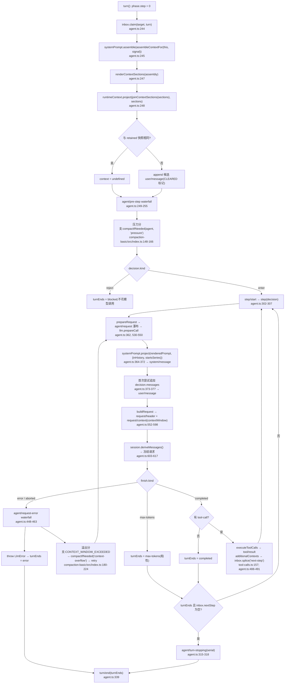

# 第八章:Context 上下文管理实现细节

> 分析对象:[innokria/deepseek-harness](https://github.com/innokria/deepseek-harness) @ `dbbaa4a37`
> 核心源码:`packages/core/agent-loop`(每步组装)+ `packages/core/system-prompt`(sections/contexts 注册表)+ `packages/llm/token-meter`(计量)+ `packages/compaction/*`(压缩)+ `packages/context/*`(请求上下文插件)+ `packages/spill/spill-policy`(结果溢写)
> 设计依据:官方 Agent Note [`.agents/notes/implemented/architecture/2026-07-20-routed-model-context-and-compaction-policy.md`](https://github.com/innokria/deepseek-harness/blob/dbbaa4a37fb9098aba814c97d2956f7b2f105f46/.agents/notes/implemented/architecture/2026-07-20-routed-model-context-and-compaction-policy.md)
> 分工:会话事件日志与 surface 语义归第三章(Session/Memory);系统提示的渲染、section 归属与 persona 归第九章(Prompt)。本章只讲上下文窗口、token 预算与每步组装。

---

## 第〇节 一句话结论与总览

**DSH 没有"上下文管理器"这个对象。** 上下文由三个彼此独立的机制合成:

1. **组装**(每步一次):`systemPrompt.assemble()` 把注册表里的 sections/contexts/tools/variables 冻结成一个 `PromptAssembly`;循环只从中派生两条模型可见消息——系统提示(`system/message`)与运行时快照(`user/message`)。
2. **计量**(纯函数 + 重放折叠):`ctx.tokenMeter.measure(session)` 用固定启发式(4 字符 ≈ 1 token)对当前 surface 逐节点定价,不依赖模型、不保存每会话配置。
3. **压缩**(可选插件):`compaction-basic` 按**精确 provider/model 路由**解析 adapter 自报的 `contextWindow`,折算成压力阈值,在 `agent/pre-step` 与 `agent/request-error` 两点上决定是否把一段 surface 区间换成一条摘要 checkpoint。

因此上下文窗口不是全局常量,而是"路由级事实 + 消费者策略"两段式:`contextWindow` 由 LLM adapter 拥有并校验,阈值/保留量/摘要模型/重试次数由 `compaction-basic` 的配置拥有。模型可见 ⟺ 已落日志——`packages/core/agent-loop/src/invariant.ts:40-51` 用可执行断言钉死了这一点。


<details><summary>Mermaid 源码</summary>



</details>

---

## 第一节 上下文来源分层

模型每步看到的文本有四个来源层,它们的生命周期与落盘方式完全不同;混为一谈是理解 DSH 上下文模型的主要障碍。

### 1.1 层 A:系统提示 sections(注册表 → 每步重渲染 → `system/message`)

`SystemPrompt` 是一个 Cordis Service(`packages/core/system-prompt/src/index.ts:399`),`section()` / `context()` / `tools()` / `variable()` 四种注册全部走 `ctx.effect()` 语义,注册即返回 disposer。

section 的排序位置**不是插件自选的数字**,而是一张集中持有的表 `SECTION_ORDERS`(`index.ts:121-154`):`HARNESS_IDENTITY: -1000`、工具指引 `TOOL_BASH: 1000` … `TOOL_REPORT: 2900`、`HARNESS_SOURCE: 10000`、`DEPLOYMENT_PERSONA_SUFFIX: 10200`。插件通过 `getSectionOrder('FILE_REFERENCE')` 取值(`context/file-reference-local/src/index.ts:69-73`),仓库因此能插入新序号而不让第一方顺序互相踩踏。渲染按 `order` 升序、同序按名字的**码元序**确定(`index.ts:232-234`),结果与 locale 无关。

```typescript
// packages/core/system-prompt/src/index.ts:226-234
/** Code-unit name comparison — locale-independent, so the order is identical on every machine. */
function compareNames(a: string, b: string): number {
  return a < b ? -1 : a > b ? 1 : 0
}

/** Order prompt sections by their explicit placement, then deterministically by name. */
function comparePromptSections(a: PromptSection, b: PromptSection): number {
  return a.order - b.order || compareNames(a.name, b.name)
}
```

`renderPrompt()` 逐 section 插值 `{{variable}}`、丢掉空文本、用空行连接(`index.ts:273-278`)。插值是**严格**的:未知变量名、未定义值、`{{}}` 全部抛错(`index.ts:319-356`)——部署写错 persona 模板会当场失败,而不是静默输出残缺提示。

### 1.2 层 B:runtime context 投影(每步重算 → 去重后的 `user/message`)

动态上下文的注册入口是 `systemPrompt.context()`(`index.ts:483-492`),同样有集中序表 `CONTEXT_ORDERS`(`index.ts:159-163`):`SANDBOX_POLICY: 110`、`APPROVAL_POLICY: 115`、`SUBAGENT_DELEGATION: 120`。

```typescript
// packages/core/system-prompt/src/index.ts:312-316
export function renderContextSections(assembly: PromptAssembly): ContextSnapshotSection[] {
  return assembly.contexts
    .map(context => ({ name: context.name, text: interpolate(context, assembly.variables, 'context') }))
    .filter(section => section.text.length > 0)
}
```

`ContextSnapshotSection` 是 `{ name, text }` 二元组(`packages/llm/llm/src/message.ts:65-70`),保留了"这段文字由哪个子系统贡献"的归属信息,供 UI 把一段散文拆回来源而**不需要重新分词**。`joinContextSections()` 在其上追加固定抬头(`index.ts:297-301`):

> `Current runtime context. This snapshot supersedes earlier runtime-context snapshots.`

`renderContextSnapshot()`(`index.ts:285-287`)就是 `joinContextSections(renderContextSections(assembly))`;循环不用它,而是分两步调用(`agent.ts:247-248`),因为 JSDoc 写明 `joinContextSections` 接受已渲染的列表,这样"一个请求不会把每个 context 插值两次"。

注册侧的代表实现——审批策略把**当前值**放进 contexts 而不是 sections,理由写在注释里(`packages/interaction/user-approval/src/index.ts:153-155`):`approval:policy` 这个 context 的 `text` 回调从 `context.agent` 取当前会话的有效策略,无 agent 时返回空串(裸 `assemble()` 的测试/诊断场景),否则按策略返回 `NEVER_SENTENCE` 或 `ASK_SENTENCE`(`index.ts:155-167`)。沙箱侧同构:`packages/sandbox/sandbox-policy/src/index.ts:140-151`,context 名 `sandbox:policy`。把会变的策略放 contexts、把稳定前缀留给 sections,是为了不反复改写 KV-cache 前缀。

### 1.3 层 C:会话消息(唯一真源)

wire 请求的 `messages` **不来自 assembly**,而来自 `session.deriveMessages()`(`agent.ts:603`)。assembly 只是"决定要往日志写什么"的中间产物;真正让文本模型可见的动作是 `session.append('system/message', …)` 与 `session.append('user/message', …)`。`invariant.ts` 用可执行断言把它钉死:每次 `llm/stream` 都要求循环构造的请求 `JSON.stringify(options.messages)` 等于 `session.deriveMessages()`,不等即报 `log-reconstruction desync`(`invariant.ts:40-43`);同时要求 `options.system === undefined`——系统提示只能作为 surface 节点 0 随 `messages` 走(`invariant.ts:45-51`)。

```typescript
// packages/core/agent-loop/src/invariant.ts:40-54
const expected = session.deriveMessages()
if (JSON.stringify(options.messages) !== JSON.stringify(expected)) {
  fail(`llm request for session "${String(session.id)}" diverges from the dispatch-time durable derivation (log-reconstruction desync)`)
}

// The system prompt travels inside `messages` as surface node 0, never as `system`.
const headerMatches = options.model === header.config.model
  && options.system === undefined
  // ...(略): 48-51 行继续比对 temperature / maxTokens / stop / tools
if (!headerMatches) {
  fail(`llm request for session "${String(session.id)}" diverges from the folded request header`)
}
```

### 1.4 层 D:工具结果追加的 `additionalContexts`

工具结果可以携带额外用户消息,由循环缓冲到**下一步**的下一个 inbox 槽:

```typescript
// packages/core/agent-loop/src/tool-calls.ts:155-159
appendToolResult(session, turn, step, call!.block, result, callSeqs[committed]!)
for (const context of result.additionalContexts ?? []) acceptContext(context)
concluded ||= result.concludesTurn === true
```

`acceptContext` 由 `step()` 注入,函数体是 `context => this.inbox.splice('next-step', this.inbox.nextStep.length, 0, [context])`(`agent.ts:490`)。所以工具附加上下文**不会**混进当前 step 的请求,而是在下一次 `preStep` 的 `claim()` 里被一并取走,顺序稳定。`ToolExecutionResult` 与 `PostToolDecision` 两处都能带该字段(`packages/core/tools/src/index.ts:556,568`),因此"拒绝执行 + 附带说明"也能注入上下文。`spill-policy` 是典型消费者:它把超限的纯文本结果换成预览 + 通知,同时**原样透传**下游的 `additionalContexts`(`packages/spill/spill-policy/src/index.ts:203`)。

### 1.5 两条注入路径的分工

| 路径 | 落点 | 生命周期 | 典型使用 |
|---|---|---|---|
| `systemPrompt.context()` / `section()` | 每步重新渲染的**当前值** | 值变了才追加/替换节点(见 2.3) | sandbox 策略、审批策略、tmux 位置、时间读数 |
| `agent/pre-step` 返回 `messages` | 本步一次性进入请求的用户消息 | 一次性;不重放 | 工具结果附加上下文、会话引用快照、文件引用 |

`session-reference` 是二者的混合体:它在 `system-prompt/assemble` 上**预置**监听以记录本步解析出的路由,再在 `agent/pre-step` 上把用户消息里的引用改写成"直接消息 + 紧随其后的快照"(`packages/context/session-reference/src/index.ts:127-142, 153-177`)。快照 source 是 `{ kind: 'session-reference', form: 'recall', version: 1, … }`,带完整保留统计,便于 UI 说明"这段是从别的会话搬来的、还删了多少"(`index.ts:339-351`)。

---

## 第二节 preStep 组装链

`preStep` 只有 20 行,却是全章核心。链路是:**claim → assemble → render → project → waterfall**。

```typescript
// packages/core/agent-loop/src/agent.ts:240-259
private async preStep(target: InboxTarget, position: { turn: number; step: number }): Promise<PreparedStep> {
  /* v8 ignore next -- private callers establish the running phase before proposing a step */
  if (this.phase.kind !== 'running') throw new Error(`agent "${this.id}": pre-step outside running phase`)
  const signal = this.phase.abort.signal
  const claimed = this.inbox.claim(target, position.turn)
  const assembly = await this.loopCtx.systemPrompt.assemble(assembleContextFor(this, signal))
  signal.throwIfAborted()
  const sections = renderContextSections(assembly)
  const context = this.runtimeContext.project(joinContextSections(sections), sections)
  const decision = await this.dispatch.waterfall(
    'agent/pre-step', { messages: claimed, ...position, signal },
    (): Promise<PreStepDecision> => Promise.resolve<PreStepDecision>({
      kind: 'enter',
      messages: context === undefined ? claimed : [...claimed, context],
    }),
  )
  signal.throwIfAborted()
  if (decision.kind === 'reject') return decision
  return { ...decision, assembly }
}
```

### 2.1 claim inbox

`claim()` 是**破坏性**的:清空 `next-step`,并按需再取一条 `next-turn`(`packages/core/agent-loop/src/inbox.ts:111-116`)。inbox 本身也可重放:`agent/inbox/spliced` 事件经 `inboxProjectionDefinition`(`inbox.ts:27-65`)折叠出两个数组,并拒绝重复 message id。每轮第一步的 `target` 是 `'next-turn'`(消费一条排队消息),后续步是 `'next-step'`(`agent.ts:284, 320`)。

### 2.2 assemble:作用域合并 + 瀑布

`assemble()`(`system-prompt/src/index.ts:552-627`)做五件事:

1. **变量解析**——全局 provider 先跑,再按 scope 链由远及近覆盖同名变量,最近的 scope 赢(`index.ts:558-567`)。
2. **section/context 合并**——`this.layers.merge(scope, …)` 让同名 scoped 条目**遮蔽**全局条目(`index.ts:569-570`),这是 agent preset 能替换部署 persona 的机制。
3. **工具 schema 收集**——每个 provider 的 schema 做 `structuredClone(parameters)` 深拷贝,并收集 `knownNames` 供顺序校验(`index.ts:576-588`)。
4. **complete section 裁决**——标记 `complete: true` 的 section 多于一个即抛错;若存在,assembly 先跑完瀑布,再把该 section 恢复为**唯一条目**(`index.ts:590-603, 621-626`),瀑布无法增删一个 scope 的完整提示。
5. **`system-prompt/assemble` 瀑布**——返回的 assembly 是权威值(`index.ts:617-620`)。

第 4 条的"complete section 裁决"就是下面这段:多于一个即抛,物化时记住那唯一一个:

```typescript
// packages/core/system-prompt/src/index.ts:589-594
const sectionDefinitions = [...sectionByName.values()].sort(comparePromptSections)
const completeSections = sectionDefinitions.filter(section => section.complete === true)
if (completeSections.length > 1) {
  throw new Error(`multiple complete prompt sections are active: ${completeSections.map(section => JSON.stringify(section.name)).join(', ')}`)
}
let completeSection: AssembledSection | undefined
// ...(略): 595-603 行物化每个 section 的 text,并记住唯一的 complete section
```

`assembleContextFor()` 是 agent 与 scope 一起设置的唯一入口,避免 agent 级贡献被静默漏掉——它就是 `{ agent, scope: agent, ...signal === undefined ? {} : { signal } }`(`packages/core/agent/src/dispatch.ts:174-176`)。

### 2.3 runtimeContext.project:去重与失效

`RuntimeContextProjection`(`packages/core/agent-loop/src/runtime-context.ts:109-159`)只做一件事:**记住上一次真正落盘的快照文本**,值相同就不产生任何事件。

```typescript
// packages/core/agent-loop/src/runtime-context.ts:147-158
project(current: string, sections: readonly ContextSnapshotSection[]): UserMessage | undefined {
  if (this.retained === undefined && current.length === 0) return
  const snapshot = current.length === 0 ? CLEARED : current
  if (this.retained?.text === snapshot) return
  return createUserMessage({
    content: [{ type: 'text', text: snapshot }],
    // The cleared marker has no contributions left to attribute.
    source: sections.length === 0
      ? { kind: 'plugin', plugin: SOURCE }
      : { kind: 'plugin', plugin: SOURCE, form: 'snapshot', sections },
  })
}
```

三个细节:`retained === undefined` 表示"从未有过快照",`null` 表示"有过但当前不保留";构造期从最新事件向前扫描一次恢复该状态,且只认仍在 surface 上的节点(`runtime-context.ts:118-127`)。快照被压缩/裁剪掉时,`isReplacementSurfaceEvent` 且 `sourceEventSeqs` 命中该 seq 就把 `retained` 置回 `null`(`runtime-context.ts:133-137`),下次渲染重新追加。清空的哨兵文本是常量 `CLEARED`:`'Current runtime context: none. Earlier runtime-context snapshots no longer apply.'`(`runtime-context.ts:15`),保证模型不把失效旧快照当成仍有效。

```typescript
// packages/core/agent-loop/src/runtime-context.ts:129-138
ctx.on('session/event', (subject, event) => {
  if (subject !== session) return
  if (event.type === 'user/message' && isOwned(event.data)) {
    this.retained = { seq: event.seq, text: textOf(event.data) }
  } else if (this.retained
    && isReplacementSurfaceEvent(event)
    && event.sourceEventSeqs?.includes(this.retained.seq) === true) {
    this.retained = null
  }
})
```

### 2.4 agent/pre-step 瀑布

默认实现(链尾)把 claimed 与 context 拼接:`{ kind: 'enter', messages: context === undefined ? claimed : [...claimed, context] }`(`agent.ts:251-254`)。**context 排在 claimed 之后**——用户直接输入在前、系统动态快照在后。

监听器用 `{ prepend: true }` 抢占先后,已有三种典型语义:

- `time-context` 先 `await next()` 再改结果,把时间读数**追加到尾部**(`packages/context/time-context/src/index.ts:181-221`);
- `tmux-context` 只在乎 `step === 1`,把读数**插到头部**(`packages/context/tmux-context/src/index.ts:236-263`);
- `agent-instructions` 把上下文**正好插在 claimed 批次之后**(`packages/context/agent-instructions/src/index.ts:338-339`),并用 `step === 1 && decision.messages.length === 0` 判断避免把纯上下文变成一次独立请求(`index.ts:326-329`)。

瀑布返回值由**最后一个**决定者给出;包装型监听器统一用 `{ ...decision, messages }` 保留 `startsRequestSeries` 之类的声明(`agent.ts:363`)。

`assembly` 随 `PreparedStep` 一起进入 `step()`(`agent.ts:53-60, 358`),这是**一次组装、多次尝试**的实现方式:重试循环里 `renderPrompt(assembly)` 只算一次(`agent.ts:359`),`assemble()` 与 `agent/pre-step` 都不会因一次重试而重跑。

```typescript
// packages/core/agent-loop/src/agent.ts:358-378
const { assembly } = decision
const renderedPrompt = renderPrompt(assembly)
let firstAttempt = true
while (true) {
  const { config, preparedCall } = await this.prepareRequest(turn, step, signal)
  const startsRequestSeries = firstAttempt && decision.startsRequestSeries === true
  // ...(略): 366-372 行由 project() 的提交决定 system/message 的新增或替换
  if (firstAttempt) {
    for (const message of decision.messages) {
      this.session.append('user/message', message, { surfaceOp: 'append' })
    }
  }
  firstAttempt = false
```

---

## 第三节 token 预算与 contextWindow 感知

### 3.1 固定启发式计量

`token-meter` 是**无配置**服务——构造时校验配置对象必须为空,任何键都抛错(`packages/llm/token-meter/src/index.ts:86-91`)。计量启发式集中在一个纯函数模块里:`CHARS_PER_TOKEN = 4`(文本密度)、`BLOCK_OVERHEAD = 4`(每块的 JSON 结构开销)、`ROLE_OVERHEAD = 4`(每条消息的 role 框架开销,导出供其他消费者复用)(`packages/llm/token-meter/src/estimate.ts:12-19`)。

```typescript
// packages/llm/token-meter/src/estimate.ts:12-19
/** Fixed text-density estimate used until exact tokenization is needed. */
const CHARS_PER_TOKEN = 4

/** Per-block structural overhead for JSON framing and type tags. */
const BLOCK_OVERHEAD = 4

/** Role-field framing overhead added to every priced message. */
export const ROLE_OVERHEAD = 4
```

`estimateContent()` 按 block 类型分支:文本与推理块收 `ceil(len/4) + 4`;工具调用收名字与参数字符数;工具结果递归;merge 扩展出的未知块(含图片引用)退化为 `BLOCK_OVERHEAD + ceil(JSON.stringify(block).length / 4)` 的结构价(`estimate.ts:37-61`)。工具 schema 有独立入口 `estimateToolsTokens()`(`estimate.ts:97-100`)。计量器**不知道** `contextWindow`,也不维护模型档案——Agent Note 的理由是:"Removing global capacity keeps measurement reusable when compaction-basic is absent"。

### 3.2 measure():anchor + 有符号增量

`measure(session, requestHeader?)`(`token-meter/src/index.ts:145-190`)返回冻结的 `TokenMeasurement`,核心是三元组:`baseline` 是最近一次成功请求的锚点——若该请求报了 provider usage **且**其总量不低于同一路由下的完整启发式价,就用真实 usage(`{ kind: 'usage' }`),否则用启发式;`surfaceDeltaTokens` 是当前 surface 相对锚点 surface 的有符号差值;`totalTokens = max(0, baseline.tokens + surfaceDeltaTokens)`。锚点在折叠 `assistant/message` 时建立,记录**该消息落盘之前**的 surface 快照与本次输出价(`index.ts:279-308`),于是"provider 报的 prompt 用量"与"此后新增/替换的节点"能相加减——包括压缩造成的负增量。

```typescript
// packages/llm/token-meter/src/index.ts:182-189
return deepFreeze(structuredClone({
  logRevision: state.consumedEvents,
  baseline,
  surfaceDeltaTokens,
  totalTokens: Math.max(0, baseline.tokens + surfaceDeltaTokens),
  surfaceTokens: surface.surfaceTokens,
  nodes: surface.nodes,
}))
```

### 3.3 contextWindow 的归属与消费

`contextWindow` 的唯一权威来源是 LLM adapter:契约是 `LlmModelContext`(`packages/llm/llm/src/types.ts:314-318`),`resolveModelInfo()` 校验它必须是正整数,否则抛 `INVALID_MODEL_CONTEXT`(`packages/llm/llm/src/index.ts:767-773`)。查询独立于 `listModels()`,未列出的动态模型也可以有容量元数据。

```typescript
// packages/llm/llm/src/index.ts:767-773
const context = resolved.context
if (context !== undefined && (!Number.isInteger(context.contextWindow) || context.contextWindow <= 0)) {
  throw new LlmError(
    `adapter returned invalid context metadata for provider "${provider}" model "${model}"`,
    'INVALID_MODEL_CONTEXT',
  )
}
```

| 消费者 | 位置 | 用途 |
|---|---|---|
| 压力阈值折算 | `compaction/compaction-basic/src/config.ts:144-147` | `thresholdTokens = floor(contextWindow × thresholdRatio)`,`retainTokens = floor(contextWindow × retainRatio)` |
| 上下文占用投影 | `llm/token-meter/src/usage-projection.ts:181-191` | 从 `request/context` 记录 `contextWindow`,与 `projectedTokens` 一起供 UI 显示占用率 |
| 跨会话引用预算 | `context/session-reference/src/index.ts:373-375` | `max(默认值, floor(contextWindow × 4 × referenceContextFraction))` |

会话引用这一处最能说明"预算是派生量"而非拍脑袋常数:

```typescript
// packages/context/session-reference/src/index.ts:373-375
if (info.context === undefined) return DEFAULT_MAX_REFERENCE_BYTES
// Context capacity is in tokens; four bytes/token is a sizing heuristic, not token counting.
return Math.max(DEFAULT_MAX_REFERENCE_BYTES, Math.floor(info.context.contextWindow * 4 * this.config.referenceContextFraction))
```

默认 `referenceContextFraction = 0.2`(`index.ts:55`),即"最多吃掉 20% 的窗口"。解析失败(例如流式中间件服务的路由没有 adapter,返回 `NO_ADAPTER`)时回退到 `DEFAULT_MAX_REFERENCE_BYTES`,而不是让引用功能整体不可用(`index.ts:366-372`)。渲染时若固定字段都塞不进字节预算,抛 `SESSION_REFERENCE_BUDGET_EXCEEDED`(`index.ts:382-387`),不静默截断到无法解析的 JSON。

### 3.4 向日志与 UI 公布

每步在 `buildRequest()` 里把解析结果写成 `request/context` 事件,且仅在与上一条不同时写(`agent.ts:584-598`):

```typescript
// packages/core/agent-loop/src/agent.ts:584-592
const contextWindow = preparedCall?.context?.contextWindow
const requestContext: RequestContext = {
  provider: config.provider,
  model: config.model,
  ...contextWindow === undefined ? {} : { contextWindow },
  ...systemPromptUpdate === undefined ? {} : { systemPromptUpdate },
}
const previousContext = session.requestContext()
```

逐字段比较 `provider`、`model`、`contextWindow`、`systemPromptUpdate` 后,任一不同才 `session.append('request/context', requestContext)`(`agent.ts:592-598`)。

`contextPressure` 投影(`usage-projection.ts:173-218`)的 JSDoc 解释了这个设计:`pressureTokens` 只含 prompt 侧,流式输出期间不动;因为只有请求才报 usage,它**看不见压缩**;所以折叠额外维护一个 surface 总量,发布 `projectedTokens = max(0, pressureTokens + surfaceTokens - sampledSurfaceTokens)`,回答的是"下一次请求的占用"而非"上一次的占用"。该总量走 `foldSurfaceProjection`,状态保持 O(1),替换会用已记录的 shadow price 直接冲减。

```typescript
// packages/llm/token-meter/src/usage-projection.ts:192-201
const usage = usageOf(event)
if (usage !== undefined) {
  const pressureTokens = pressureFrom(usage)
  if (pressureTokens !== next.pressureTokens || next.sampledSurfaceTokens !== next.surfaceTokens) {
    next = { ...next, pressureTokens, sampledSurfaceTokens: next.surfaceTokens }
  }
}
if (fold.deltaTokens !== 0) {
  next = { ...next, surfaceTokens: next.surfaceTokens + fold.deltaTokens }
}
```

---

## 第四节 compaction:触发、执行与落日志

### 4.1 能力缝与两个触发点

`CompactionEngine` 是抽象 Service,只声明三个方法(`packages/compaction/compaction/src/index.ts:96-170`),触发器是封闭联合 `'pressure' | 'context-overflow'`(`index.ts:25`)。`compaction-basic` 是唯一实现,`auto` 默认为真时注册两个监听器(`compaction-basic/src/index.ts:130, 138`)。

**压力触发器**挂在 `agent/pre-step` 上做前置检查,完成后无条件 `return next()`。关键性质:**压缩失败不阻断回合**——缺容量元数据这类目标级配置错误按路由只警告一次(`warnedPressureConfigTargets`),其余错误降级为 warning,上下文的收益不值得赔上一个可用回合。

```typescript
// packages/compaction/compaction-basic/src/index.ts:152-165
if (!signal.aborted) {
  try {
    const result = await this.compactIfNeeded(agent, 'pressure', signal)
    if (result !== null) logResult(result, 'step pressure')
  } catch (error: unknown) {
    if (error instanceof TargetPressureConfigError) {
      if (this.warnedPressureConfigTargets.has(error.targetKey)) return next()
      this.warnedPressureConfigTargets.add(error.targetKey)
    }
    ctx.logger.warn(`step compaction failed: ${error instanceof Error ? error.message : String(error)}; continuing the turn`)
  }
}
return next()
```

**溢出触发器**挂在 `agent/request-error` 上,只在 provider 确认 `CONTEXT_WINDOW_EXCEEDED` 时介入(`index.ts:184`)。重试上限按目标策略解析(`policy.maxOverflowRetries`),并用 `surface.replaceGeneration` 做**进度证明**(`index.ts:218-223`):信号已中止、或 `agent.session.surface.replaceGeneration` 相对进入前的快照没有增长,就直接 `return next()`;否则记录溢出重试次数并返回 `{ kind: 'retry' }`。`replaceGeneration` 没涨说明本次压缩**没有产生任何持久缩减**,于是保留原始 provider 错误,而不是无限重试。异常路径同理:摘要阶段失败但此前已有落地的无模型裁剪,也算作进度并重试一次(`index.ts:196-209`)。

```typescript
// packages/compaction/compaction-basic/src/index.ts:184-223
if (failure.code !== CONTEXT_WINDOW_EXCEEDED_CODE || signal.aborted) return next()
// ...(略): 185-190 行记录 overflowAgents、解析路由目标与 maxOverflowRetries 上限
const generation = agent.session.surface.replaceGeneration
let result: CompactionResult | null
// ...(略): 194-217 行调用 compactIfNeeded,异常路径用 replaceGeneration 增长证明进度
// oxlint-disable-next-line typescript/no-unnecessary-condition -- the signal can abort while compaction is awaited.
if (signal.aborted
  || agent.session.surface.replaceGeneration <= generation) return next()
this.overflowRetries.set(agent, retries + 1)
return { kind: 'retry' }
```

### 4.2 阈值解析:每次检查都重算

`resolveCompactSpec()` 把比例折算成绝对 token 预算(`compaction-basic/src/config.ts:133-167`):

```typescript
// packages/compaction/compaction-basic/src/config.ts:144-154
const thresholdTokens = Math.floor(contextWindow * policy.thresholdRatio)
const retainTokens = policy.retainTokens === undefined
  ? Math.floor(contextWindow * policy.retainRatio)
  : policy.retainTokens
if (retainTokens >= thresholdTokens) {
  throw new TargetPressureConfigError(
    targetKey,
    `BasicCompactionConfig: ${policy.target.provider}/${policy.target.model} retainTokens `
    + `(${retainTokens}) must be less than threshold tokens ${thresholdTokens}`,
  )
}
```

默认 `thresholdRatio = 0.8`、`retainRatio = 0.16`(`config.ts:20, 23`);两者在**加载期**就要满足 `retainRatio < thresholdRatio`,否则插件装载失败(`config.ts:185-190`),因为没有哪个容量能让这种策略成立。绝对 `retainTokens` 无法在加载期判定,于是推迟到容量首次让比较成为可能的时刻。

策略解析**每步重做**:`compactIfNeeded` 先读 `session.requestHeader()?.config` 得到精确路由,再查 `modelPolicies` 里的精确 `{ provider, model }` 覆盖项(`compaction-basic/src/index.ts:264-266`)。所以同一会话中途切 provider/model,容量与策略立即跟着变。顶层字段是默认值,`modelPolicies` 是可选精确覆盖,重复目标在加载期报错(`config.ts:199-211`)。

### 4.3 区间选择:保留尾部 + 不切断工具对

`selectCompactableRange()`(`compaction-basic/src/region.ts:117-155`)做三件事:先对齐 surface(计量节点序列必须与 `session.surface.nodes` 逐位相同,否则抛错,防止用过期计量裁当前历史);再从尾部倒推累加节点价,直到累计 ≥ `retainTokens` 得到 `keepFromIdx`;最后在左移边界时要求工具对平衡。

```typescript
// packages/compaction/compaction-basic/src/region.ts:122-131
const pricedNodes = measurement.nodes
if (pricedNodes.length === 0) return null

const surfaceNodes = session.surface.nodes
if (surfaceNodes.length !== pricedNodes.length
  || surfaceNodes.some((seq, index) => seq !== pricedNodes[index]?.seq)) {
  throw new Error('compaction: token-meter surface does not match the current session surface')
}
// oxlint-disable-next-line typescript/no-non-null-assertion
const firstIdx = systemHead(session, surfaceNodes[0]!) === undefined ? 0 : 1
```

```typescript
// packages/compaction/compaction-basic/src/region.ts:143-148
while (keepFromIdx > firstIdx) {
  if (toolPairingBalancedBefore(session, surfaceNodes[keepFromIdx]!)) break
  keepFromIdx -= 1
}
if (keepFromIdx <= firstIdx) return null
```

随后返回 `{ start: surfaceNodes[firstIdx]!, end: surfaceNodes[keepFromIdx - 1]! }`(`region.ts:150-154`)。`system/message` 位于 surface 节点 0 时永不入选(`region.ts:130-131`)——系统提示不会被压掉。

### 4.4 执行:一个事务、两段区间语义

`compactSurfaceRegion()`(`region.ts:173-275`)是压缩的唯一执行体:校验区间(两端都必须平衡,`region.ts:336-357`)→ 检查会话没有已开启的 turn(自动)或已处于 open turn(手动,`region.ts:191-202`)→ **同步** append `compaction/start`(`region.ts:210`)→ 定价、构造摘要输入、调用摘要器 → 稳定性断言 → 恰好一次 `compaction/end`。

那条 `compaction/start` 本身就是压缩锁:此后任何并发进入都被 `assertCompactionInactive` 拒绝(`region.ts:307-333`)。两段区间语义由 `stability` 决定——自动压缩用 `whole-surface`,要求整个 surface 节点序列一字不差(`region.ts:416-425`);手动压缩用 `selected-span`,只要求选中的那段仍是同一个"当前、连续、等价定价、边界平衡"的替换目标,期间新增的节点仍可见(`region.ts:432-453`)。

摘要输入复用会话自己的前缀以命中 KV cache(`region.ts:529-548`):surface 头部的 `system/message`、header 里的 tool schemas、被遮蔽区间按 surface 顺序派生出的消息。摘要指令作为**最后一条用户消息**追加,调用带 `purpose: 'compaction'` 与 `sessionId`(`compaction-basic/src/summarizer.ts:151-160`)。摘要**必须真的更小**才允许提交(`region.ts:399-407`):

```typescript
// The checkpoint is text-only, so its fixed-heuristic price IS its route price;
// comparing it against the span's route price asks the real question.
const framedSummaryTokenCount = dependencies.meter.estimateMessage(checkpointMessage)
if (framedSummaryTokenCount >= prepared.shadowedRouteTokenCount) {
  throw new Error(`summary is not smaller than the shadowed content (${framedSummaryTokenCount} >= ${prepared.shadowedRouteTokenCount})`)
}
```

### 4.5 落日志:区间替换 + shadow price

提交只有两步且**不让出控制权**(`region.ts:456-507`):先 append `compaction/summary` 记录工件,再用一次 `replace` 把整段区间换成一条用户消息:

```typescript
// packages/compaction/compaction-basic/src/region.ts:491-494
session.append('user/message', checkpointMessage, {
  surfaceOp: { op: 'replace', startSeq: start, endSeq: end },
  sourceEventSeqs: [startEvent.seq, summaryEvent.seq, ...shadowedSeqs],
})
```

`shadowedSeqs` 把被遮蔽的每个 seq 写进 `sourceEventSeqs`,于是重放、UI、引用投影都能追溯"这条摘要吞掉了什么";checkpoint 的 source 由 `compactCheckpointSource(compactionId, sourceCommandId)` 构造(`region.ts:395-398`),跨 backend 可识别。计量侧靠同一套协议:每条事件在 `planSurfaceTokens` 算出 `deltaTokens`(append 为 `+价`,replace 为 `新价 − 被替换区间价`),再由 `commitSurfaceTokens` 原地应用(`token-meter/src/surface-fold.ts:112-147`)——**计划先于提交,提交不可失败**,所以不存在"半应用"的 surface。

```typescript
// packages/llm/token-meter/src/surface-fold.ts:122-132
const startIdx = nodes.findIndex(candidate => candidate.seq === op.startSeq)
const endIdx = nodes.findIndex(candidate => candidate.seq === op.endSeq)
if (startIdx === -1 || endIdx === -1 || startIdx > endIdx) {
  throw new Error(
    `token surface: replace at seq ${event.seq} has invalid current range ${op.startSeq}-${op.endSeq}`,
  )
}
const removed = nodes
  .slice(startIdx, endIdx + 1)
  .reduce((total, candidate) => total + candidate.heuristicTokens, 0)
return { tokens, deltaTokens: tokens - removed, node, target: { startIdx, endIdx } }
```

`tool-result-pruner` 是这套协议的最佳示范:它不依赖 `compaction-basic`,自己在 `tool/result` 上做无模型裁剪,并严格遵守"定价事件与被替换节点同步相邻"的约定(`compaction/compaction-tool-result-pruner/src/index.ts:160-174`):

```typescript
session.append('compaction/prune', {
  shadowedRange: { start: seq, end: seq }, shadowedSeqs: [seq],
  shadowedTokenCount: this.ctx.tokenMeter.estimateMessage(event.data.message),
})
const replacement = session.append('tool/result', { ...event.data, message }, {
  surfaceOp: { op: 'replace', startSeq: seq, endSeq: seq }, sourceEventSeqs: [seq],
})
```

### 4.6 与溢出相关但独立:结果溢写

`spill-policy` 处理的是**单条工具结果过大**,不是窗口整体压力。它在 `tools/post-execute` 上以 `{ prepend: true }` 注册,先 `await next()` 让下游(例如 hook)定型,再对最终内容限幅(`packages/spill/spill-policy/src/index.ts:185-204`)。默认 `maxInlineBytes` 省略时**什么都不注册**,是真正的 no-op(`index.ts:106-108`)。限幅本身有一个容易写错的约束:通知文本的字节开销必须**从预算内扣除**,否则"预览用满预算 + 追加通知"会超过承诺上限,对刚刚超限的结果甚至可能比原文更大(`index.ts:158-182`)。`read` 被显式跳过以避免 `read → spill → read again` 循环(`index.ts:190-192`);溢出存储失败只记 warning 并保留原文——溢写永远不能把成功的工具调用变成失败(`index.ts:149-156`)。

---

## 第五节 max-tokens 粘性与 turn 结束语义

### 5.1 粘性规则

`turnEnds` 在 `turn()` 里是累积变量,规则只有一条:**一旦某步撞上 token 上限,后续正常完成的步不得把结论降级**(`agent.ts:305-310`):

```typescript
// max-tokens is sticky: once any step hits the ceiling, later steps
// that complete normally must not downgrade the turn outcome.
const stepEnd = await this.step(decision)
if (turnEnds === null || turnEnds.kind !== 'max-tokens') turnEnds = stepEnd
```

`step()` 的返回类型是 `StepEndReason | null`(`agent.ts:51`),只可能是 `completed`、`max-tokens` 或"还要继续"。判定点很直接:流结束时 `finish.kind === 'max-tokens'` 就返回 `{ kind: 'max-tokens' }`(`agent.ts:484`),而且**在**追加工具结果之前——被截断的输出不执行工具。

```typescript
// packages/core/agent-loop/src/agent.ts:481-487
stream: live.stream,
}, { surfaceOp: 'append' }).seq,
)
if (finish.kind === 'max-tokens') return { kind: 'max-tokens' }

const toolCalls = message.content.filter(block => block.type === 'tool-call')
if (toolCalls.length === 0) return { kind: 'completed' }
```

回合级结论另有三类:`blocked`(`preStep` 返回 reject,`agent.ts:290-292`)、`error`(`LlmError` 保留结构化 failure,其他错误压成 `errorChain` 文本 + `UNKNOWN`,`agent.ts:328-334`)、`aborted`(`agent.ts:323-325`)。

### 5.2 回合关闭的两个条件

回合不是"模型不再说话"就结束,而是"没有任何工作欠着"才结束:

```typescript
// packages/core/agent-loop/src/agent.ts:315-321
if (turnEnds && this.inbox.nextStep.length === 0) {
  await this.dispatch.serial('agent/turn-stopping', { turn, signal })
  signal.throwIfAborted()
}
if (turnEnds && this.inbox.nextStep.length === 0) break
target = 'next-step'
```

`agent/turn-stopping` 是 serial(没有 `next()`)的**异议点**:监听器可以 `agent.steer(...)` 塞入新 steering,循环回到 `while` 顶部重新 `preStep`,队列又非空就继续跑。检查在关闭前后各做一次,因为监听器本身可能写入 inbox。工具结果带 `concludesTurn: true` 时也走同一条路(`tool-calls.ts:158` 汇总为 `concluded`,`agent.ts:492` 转成 `completed`),但**不会**短路已经提交的 next-step 工作。

回合边界本身也是事件:`turn/start`(`agent.ts:278`)与 `turn/end`(`agent.ts:339`,`finally` 保证恰好一次);每步另有 `step/start` / `step/end`(`agent.ts:302, 312`)。token-meter 的折叠对这两个事件做严格配对校验(`token-meter/src/index.ts:255-269, 279-285`),错配直接抛错——计量状态不允许在可疑日志上继续。

### 5.3 回退路径不重复组装

`step()` 的重试循环(`agent.ts:361`)只把 `prepareRequest` 与后续步骤放在循环内;`renderPrompt(assembly)` 在循环外(`agent.ts:359`)。`systemPrompt.project()` 每次尝试都重新对账(`agent.ts:364-372`),但用户消息只在 `firstAttempt` 追加一次(`agent.ts:373-378`)。这个不对称是有意的:系统提示节点可以新增/替换(取决于 `systemPromptUpdate` 能力与 series 是否断裂),而 admitted 的用户消息一旦进入就是本步输入,重试不该重复它们。

`startsSeries` 由三个来源合成(`agent.ts:366-368`):pre-step 显式声明、surface 自上次请求后被替换(压缩就是这种情况)、或工具 schema 与已记录 header 不同。任一条成立就开启新请求序列,`request/header` 相应记为 `series` 或带 `startsSeries: true` 的 `change`(`agent.ts:570-581`)。

---

## 第六节 关键文件索引表

| 文件 | 职责 | 节 |
|---|---|---|
| `packages/core/agent-loop/src/agent.ts` | turn/step 驱动、preStep 组装链、请求构造、contextWindow 落日志 | 〇/二/三/五 |
| `packages/core/agent-loop/src/runtime-context.ts` | `SystemPromptProjection` / `RuntimeContextProjection`(去重与失效) | 2.3 |
| `packages/core/agent-loop/src/inbox.ts` | 可重放的 next-turn / next-step inbox 与 `claim()` | 2.1 |
| `packages/core/agent-loop/src/tool-calls.ts` | 工具调度、`additionalContexts` 提交入 inbox | 1.4 |
| `packages/core/agent-loop/src/invariant.ts` | 请求必须由日志重建的运行时断言 | 1.3 |
| `packages/core/agent/src/dispatch.ts` | `assembleContextFor()`(agent + scope 同步设置) | 2.2 |
| `packages/core/system-prompt/src/index.ts` | sections/contexts/tools/variables 注册表、序表、`assemble()`、渲染函数 | 1.1/1.2/2.2 |
| `packages/llm/token-meter/src/index.ts` | `measure()`、锚点、surface 重放折叠 | 3.2 |
| `packages/llm/token-meter/src/estimate.ts` | 固定启发式定价常量与纯函数 | 3.1 |
| `packages/llm/token-meter/src/surface-fold.ts` | `planSurfaceTokens` / `commitSurfaceTokens`(价格增量) | 4.5 |
| `packages/llm/token-meter/src/usage-projection.ts` | `contextPressure` 投影:contextWindow + projectedTokens | 3.3/3.4 |
| `packages/llm/llm/src/types.ts` | `LlmModelContext.contextWindow` 契约 | 3.3 |
| `packages/llm/llm/src/index.ts` | `resolveModelInfo()` 对 contextWindow 的校验 | 3.3 |
| `packages/llm/llm/src/message.ts` | `ContextSnapshotSection`、`ContextFormed` 词表 | 1.2 |
| `packages/compaction/compaction/src/index.ts` | `CompactionEngine` 抽象、`CompactionTrigger` | 4.1 |
| `packages/compaction/compaction-basic/src/index.ts` | 两个触发器、`compactIfNeeded`、`compactRegion` | 4.1/4.2 |
| `packages/compaction/compaction-basic/src/config.ts` | 策略解析与 `resolveCompactSpec`(比例 → 绝对预算) | 4.2 |
| `packages/compaction/compaction-basic/src/region.ts` | 区间选择、压缩事务、里程碑日志、摘要输入重建 | 4.3/4.4/4.5 |
| `packages/compaction/compaction-basic/src/summarizer.ts` | 前缀复用的摘要调用与 checkpoint 框架 | 4.4 |
| `packages/compaction/compaction-tool-result-pruner/src/index.ts` | 无模型裁剪 + shadow-price 协议 | 4.5 |
| `packages/context/session-reference/src/index.ts` | 跨会话引用注入与 contextWindow 派生字节预算 | 1.5/3.3 |
| `packages/context/session-reference/src/projection.ts` | 引用快照的字节级保留与截断 | 3.3 |
| `packages/context/time-context/src/index.ts` | pre-step 追加时间读数(尾部) | 2.4 |
| `packages/context/tmux-context/src/index.ts` | pre-step 前置 tmux 位置(仅 step 1) | 2.4 |
| `packages/context/agent-instructions/src/index.ts` | 工作区指令上下文,插在 claimed 批次之后 | 2.4 |
| `packages/context/file-reference-local/src/index.ts` | section 注册示例(`getSectionOrder('FILE_REFERENCE')`) | 1.1 |
| `packages/sandbox/sandbox-policy/src/index.ts` | `sandbox:policy` 动态 context | 1.2 |
| `packages/interaction/user-approval/src/index.ts` | `approval:policy` 动态 context | 1.2 |
| `packages/spill/spill-policy/src/index.ts` | 工具结果溢写与预算内通知 | 1.4/4.6 |

**未在本章展开的相邻主题**:会话事件日志、surface 替换语义与 `deriveMessages()` 的投影规则见第三章;系统提示的 section 内容、persona 与工具指引文本见第九章。
