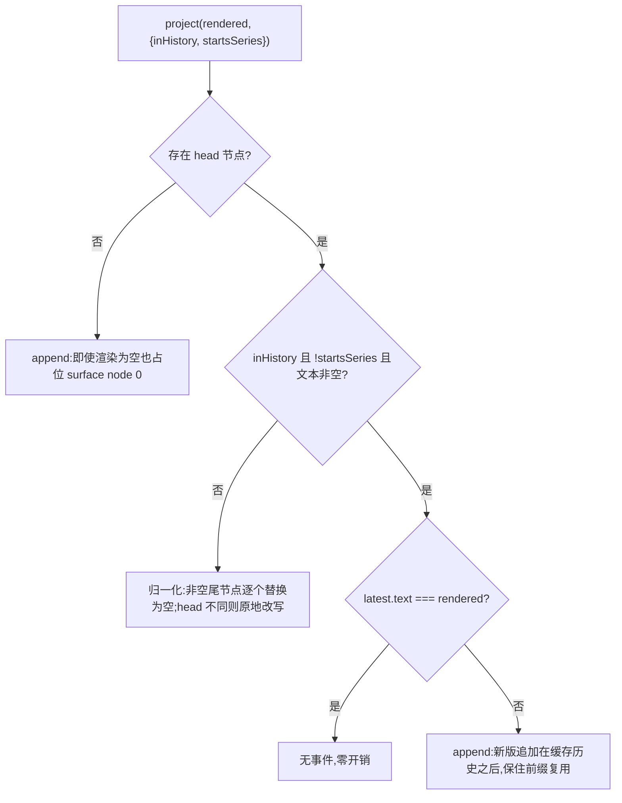

# 第九章:Prompt 管理机制与实现细节(DeepSeek Harness 源码分析)

> 分析对象:[innokria/deepseek-harness](https://github.com/innokria/deepseek-harness) @ `dbbaa4a37`
> 核心源码:`packages/core/system-prompt/src/index.ts`(630 行:注册表服务与组装流水线)、`packages/core/agent-loop/src/runtime-context.ts`(159 行:提示的持久化投影)、`packages/core/agent-loop/src/agent.ts`(619 行:投递时机)
> 交叉引用:工具 schema 的可见性与调度见第五章,上下文注入细节见第八章;本章只讲"提示如何组装、何时重投"
> 相关文档:[`docs/subsystems/system-prompt.md`](https://github.com/innokria/deepseek-harness/blob/dbbaa4a37fb9098aba814c97d2956f7b2f105f46/docs/subsystems/system-prompt.md)、[`packages/core/system-prompt/README.md`](https://github.com/innokria/deepseek-harness/blob/dbbaa4a37fb9098aba814c97d2956f7b2f105f46/packages/core/system-prompt/README.md)

---

## 第〇节 一句话结论与总览

DSH 的"系统提示"不是一段模板字符串,而是**一个按作用域分层的注册表服务 `ctx.systemPrompt`**:插件把各自拥有的提示事实(`section` / `context` / `tools` / `variable`)注册进去,**注册动作本身就是 Cordis effect**;每个 step 由 agent-loop 调用一次 `assemble()` 组装,渲染成纯文本后**作为一条 `system/message` 事件落进会话日志**,模型请求再从日志派生消息历史。提示从不作为请求的 `system` 字段发出。

四条关键事实:

1. **注册即 effect**:四类贡献经 `ScopedLayers.effect()` 落地(`packages/core/system-prompt/src/index.ts:448-540`),fiber 处置即撤销并广播 `system-prompt/change`。
2. **组装与渲染分两阶段**:`assemble()` 返回"文本已解析但未插值"的结果,`renderPrompt()` 才插值 `{{variable}}`、丢弃空段落并拼接(`index.ts:273-278`)。
3. **提示是日志事实**:每步先 `project()` 提交 `system/message`,再由 `deriveMessages()` 派生请求(`agent-loop/src/agent.ts:364-379`、`552-617`);开发期不变式重算该派生结果并拒绝带 `system` 字段的循环请求(`agent-loop/src/invariant.ts:40-51`)。
4. **重投时机 = 请求序列 + 路由能力 + 工具集变化**,而非"每步重发"(`agent.ts:363-369`)。

```text
插件 fiber ──ctx.systemPrompt.section/context/tools/variable──> ScopedLayers<PromptLayer>
 (注册即 effect,处置即撤销 + emit change)                        global 层 + 每 scope 层
                                                                 近者胜合并 / 空层回收
                                                                        │ assemble(scope, signal)
                                                                        v
   assemble() 编排:变量求值 → merge 段落 → tools 聚合 → orderTools() 排序
                    → system-prompt/assemble 瀑布 → 恢复 complete 段落
                                                                        │ PromptAssembly
                                                                        v
   renderPrompt():插值 → 丢空段 → "\n\n" 拼接;renderContextSections():具名快照
                                                                        │ 渲染文本
                                                                        v
   SystemPromptProjection.project(rendered, {inHistory, startsSeries})
        → 无事件 / append 新节点 / 归一化改写 head 并空替换非空尾节点
                                                                        │ 提交项
                                                                        v
   session.append('system/message', …)  ← 落日志(surface 节点)
                                                                        │ deriveMessages()
                                                                        v
   buildRequest() → llm.stream(request)   消息历史里含刚落的节点
```

---

## 第一节 系统提示即注册表服务:四类贡献,注册即 effect

### 1.1 一个服务,四类贡献

`SystemPrompt`(`index.ts:399`)是与 `systemPrompt` 名字绑定的 Cordis `Service`;四类贡献加一个抑制器落在同一个 `PromptLayer` 的五张表上(`index.ts:365-371`):

```typescript
/** All prompt registrations owned by one global or scoped layer. */
class PromptLayer implements ScopeLayer {
  readonly sections: NamedEntries<PromptSection>
  readonly contexts: NamedEntries<PromptContext>
  readonly runtimeContextSuppressors = new AnonymousEntries<true>()
  readonly toolProviders = new AnonymousEntries<ToolProvider>()
  readonly variables: NamedEntries<VariableProvider>
```

| 方法 | 输入 | 去向 | 语义 |
|---|---|---|---|
| `section()`(`index.ts:448`) | `PromptSection{name, order, text, complete?}` | 系统提示正文 | 有序拼接;同名 scoped 段落遮蔽全局 |
| `context()`(`index.ts:483`) | `PromptContext{name, order, text}` | 持久化 user-role 快照 | **不进**提示正文,走运行时上下文 |
| `tools()`(`index.ts:515`) | `(ctx) => ToolProviderResult` | 模型可见工具 schema | 每次组装求值一次 |
| `variable()`(`index.ts:531`) | `name, (ctx) => string \| undefined` | `{{name}}` 插值源 | 名字须匹配 `/^[a-z][a-z0-9_]*$/` |
| `suppressRuntimeContext()`(`index.ts:500`) | — | 抑制开关 | 抑制本 scope 全部 context 贡献 |

**section 与 context 是两类不同模型输入**:section 构成提示正文,context 是"带来源的 user-role 快照"(`docs/subsystems/system-prompt.md:44`、`:74` 记录两条投递路径)。这条分界就是本章与第八章的接口。

### 1.2 注册即 effect:撤销、通知、空层回收

四个注册方法都是同一句(`index.ts:452-456`):

```typescript
    return this.layers.effect(
      this.ctx,
      layer => layer.sections.insert(section.name, section),
      { label: 'systemPrompt.section()' },
    )
```

`ScopedLayers.effect()` 负责三件事(`packages/core/scope/src/store.ts:226-266`):按注册上下文的 scope 选择或惰性创建层 → 执行原子变更拿到同步 undo → 以 `ctx.effect()` 注册;处置时先 undo,再在**层彻底为空**时删除该 scope 层(`store.ts:257-261`):

```typescript
      yield () => {
        undo()
        if (scope !== undefined && layer.isEmpty()) this.scoped.delete(scope)
        if (notify) this.onChange()
      }
      if (notify) this.onChange()
```

`onChange` 是构造参数里的一行——发射**不经 scope 过滤**的 `system-prompt/change`,因为全局变化影响所有 scope(`index.ts:409-412`)。两个后果:HMR / fiber 卸载天然安全(插件走了段落就没了,连空层一起回收);重复注册是显式错误,且诊断区分全局与 scoped——全局重复会提示"用 `agent.ctx` 做 per-agent override",scoped 重复只说"already registered in this scope"(`index.ts:376-386`)。

### 1.3 位置由服务集中分配,不由注册顺序决定

段落按 `order` 升序、同序号按名字 code-unit 序(`index.ts:232-234`);但一等贡献者不写魔数,而是向服务要具名位置(`index.ts:121-154`,节选):

```typescript
const SECTION_ORDERS = {
  HARNESS_IDENTITY: -1000,
  DEPLOYMENT_PERSONA_PREFIX: 0,
  PLAN_POLICY: 500,
  TEAM_POLICY: 600,
  PTC_ONLY: 800,
  TOOL_BASH: 1000,
  TOOL_READ: 1100,
  // … TOOL_WRITE/EDIT/GLOB/GREP/JOBS/PTY/WEB_*/LSP/SESSION_QUERY/GOAL/CORDIS/WORKFLOW/RALPH/SUBAGENT/REPORT …
  TOOLS_SDK: 5000,
  DELIVERABLE_FILE_REFERENCES: 9000,
  STRUCTURED_OUTPUT: 9900,
  HARNESS_SOURCE: 10000,
  WEB_SURFACE: 10100,
  DEPLOYMENT_PERSONA_SUFFIX: 10200,
} as const
```

context 有独立表(`index.ts:159-163`):`SANDBOX_POLICY: 110`、`APPROVAL_POLICY: 115`、`SUBAGENT_DELEGATION: 120`。取值入口是 `getSectionOrder()`(`index.ts:464-466`)与 `getContextOrder()`(`index.ts:473-475`)——**顺序是跨包契约**,不是各插件局部约定;外部贡献可用任意有限值,非有限值直接 `TypeError`(`index.ts:449-451`)。

### 1.4 `complete`:一个段落吃掉整段提示(受限)

`complete` 的语义是"把这次贡献当作完整提示,但仍跑协作式瀑布以解析 tools/contexts/variables,随后把该段落恢复为唯一正文"(`index.ts:67-73`)。多于一个生效的 complete 段落即失败:`if (completeSections.length > 1) throw new Error(\`multiple complete prompt sections are active: …\`)`(`index.ts:590-593`)。

恢复发生在瀑布之后(`index.ts:621-626`),因此**瀑布对 tools / contexts / variables 仍然权威**,监听器无法借瀑布往 `complete` 部署里塞提示词。真实使用者是 persona 预设(`preset/persona/src/index.ts:42-45`、`62-68`)。

### 1.5 主要贡献者一览

| 贡献 | 类型 | 名字 / 位置 | 代码 |
|---|---|---|---|
| Harness 身份 | section | `harness:identity` @ −1000 | `core/system-prompt/src/index.ts:420-424` |
| 部署 persona 前后缀 | section | `deployment:persona-prefix` @ 0 / `…-suffix` @ 10200 | `index.ts:426-436` |
| persona 预设(scope 遮蔽 + 可选 complete) | section | 同名遮蔽 | `preset/persona/src/index.ts:62-74` |
| 逐工具指引 | section | `tool:read`/`tool:bash`/`tool:grep`/`tool:pty`/`tool:web_search`/`tool:jobs`/… | `fs/tool-fs/src/read.ts:69`、`shell/tool-bash/src/index.ts:235`、`fs/tool-fs-search/src/grep.ts:275`、`terminal/tool-terminal/src/index.ts:156`、`web/tool-web/src/search.ts:315`、`jobs/tool-jobs/src/index.ts:262` |
| PTC 独占规则 / 生成的 SDK | section | `tools:ptc-only` @ 800、`tools:sdk` @ 5000 | `core/tools/src/index.ts:847-855`、`867-884` |
| 计划模式策略 | section | `plan:policy` @ 500 | `plan/plan-mode/src/index.ts:212-220` |
| 后台委派 / 结构化输出指引 | section | `tool:subagent` @ 2800、`tool:<structured>` @ 9900 | `subagent/tool-subagent/src/index.ts:598-604`、`subagent/subagent-in-process-driver/src/structured.ts:99-103` |
| 交付规范 / 源码路径 / Web 地址 | section | `ui:deliverable-file-references` @ 9000、`harness:source` @ 10000、`app:web-surface` @ 10100 | `client/ui-deliverables/src/index.ts:24-31`、`boot/app-boot/src/index.ts:837,854-861`、`bundle/web-app/src/index.ts:234-241` |
| 沙箱 / 审批 / 委派说明 | context | `sandbox:policy` @ 110、`approval:policy` @ 115、`subagent:delegation` @ 120 | `sandbox/sandbox-policy/src/index.ts:140-151`、`interaction/user-approval/src/index.ts:153-166`、`subagent/subagent/src/child-agent.ts:205-209` |
| 工具 schema | tools | 唯一提供者即 `ToolRuntime` | `core/tools/src/index.ts:825` |
| `{{provider}}`/`{{model}}`/`{{cwd}}` | variable | 由循环注册 | `core/agent-loop/src/index.ts:421-423` |

一个反直觉的边界:**技能目录不是 section**。`tool-skill` 把 `<available_skills>` 当作 `agent/pre-step` 的 user-role 消息发布(`skill/tool-skill/src/index.ts:220-251`、`254-277`)——它是"整体替换"的清单,语义不同于"每步重渲染"的 section。

---

## 第二节 `assemble()`:合并 → 排序 → 瀑布 → 恢复

### 2.1 流水线(伪代码改写)

`assemble()`(`index.ts:552-627`)按固定顺序执行:

```text
assemble(context = {})
  ├─ scopeLayers = layers.chainLayers(context.scope)      # 祖先在前,近者最后
  ├─ runtimeContextSuppressed = 全局抑制器非空 || 链上任一层有抑制器
  ├─ variables:先求全局,再按"最远祖先→最近 scope"覆盖同名    # 近者胜
  ├─ sectionByName / contextByName = layers.merge(scope, …)  # 最近 scope 赢同名
  ├─ tools:全局 + 链上 provider 逐个求值,只留 {name, description, parameters}
  │    └─ parameters 走 structuredClone;knownNames = provider.knownNames ?? 名字集
  ├─ 段落排序(comparePromptSections);complete 段落 > 1 → throw
  │    └─ 解析 text(context):函数式段落此刻求值,但**不插值**
  ├─ tools = orderTools(collected, toolOrder, knownNames)
  ├─ await ctx.waterfall(scopeTarget(this, scope), 'system-prompt/assemble', …)
  └─ 若有 complete 段落或 context 被抑制 → 瀑布结果 + 恢复后的 sections/contexts
```

tools 聚合与去引用(`index.ts:576-588`,紧凑改写):

```typescript
    for (const provider of providers) {
      const result = provider(context)
      collected.push(...result.schemas.map(({ name, description, parameters }): ToolSchema =>
        ({ name, description, parameters: structuredClone(parameters) })))
      for (const name of result.knownNames ?? result.schemas.map(tool => tool.name)) knownNames.add(name)
    }
```

`structuredClone` 不是洁癖:`ToolRuntime.wireSchemas()` 返回的 `parameters` 可能就是注册表缓存里的同一对象(`core/tools/src/index.ts:972-993`),深拷贝后瀑布监听器改 schema 不会污染下一次组装。

### 2.2 瀑布扩展点:`system-prompt/assemble`

事件声明把契约写全了(`index.ts:18-31`,节选):

```typescript
    /**
     * Expert waterfall over the assembled sections, contexts, tools, and variables.
     * Scope-filtered dispatch (`@deepseek-ai/dsh-scope`): scoped listeners
     * receive only that scope's assemblies. The returned value is authoritative.
     * …
     * A registered complete section is restored after this waterfall, so
     * listeners cannot add to or replace that scope's system prompt.
     * @mode waterfall
     */
```

派发带 `scopeTarget(this, scope)`(`index.ts:617-620`),scope 由 `dsh-scope` 取第二个参数的 `scope` 过滤(`core/scope/src/scoped-events.generated.ts:32`)。三个真实监听者示范三种合法用法:

1. **只读快照**:`session-reference` 以 `prepend` 注册,在下游组装完成后记录本次路由(`context/session-reference/src/index.ts:126-134`)。
2. **改写组装输入**:`model-selection` 在 `next()` 之后覆盖 `variables.provider` / `variables.model`(`core/agent/src/model-selection.ts:77-90`),使 `{{model}}` 与随后 `agent/request` 生效的路由一致——避免并发切换把"提示里的模型"和"实际调用的模型"劈开。
3. **校验**:`system-prompt` 自带不变式重算"段落名非空且唯一、context 同理、变量名合法且值为 string/undefined"(`system-prompt/src/invariant.ts:16-52`)。

瀑布监听器必须调用 `next()`,不调用即短路整条链(根 `AGENTS.md` 的 Cordis 瀑布语义)。

### 2.3 渲染:插值、丢空段、拼接

```typescript
export function renderPrompt(assembly: PromptAssembly): string {
  return assembly.sections
    .map(section => interpolate(section, assembly.variables, 'section'))
    .filter(text => text.length > 0)
    .join('\n\n')
}
```
(`index.ts:273-278`)

- **空段落被丢弃**,于是"注册了但当前不适用"只需返回 `''`(`plan:policy` 在非计划模式、`tools:sdk` 在 native 模式都如此),不必自管生命周期。
- **context 走"整份快照"语义**:`renderContextSections()`(`index.ts:312-316`)保留具名贡献,`joinContextSections()`(`index.ts:297-301`)拼成正文并在开头加一句 "Current runtime context. This snapshot supersedes earlier runtime-context snapshots."——模型侧的去歧义声明。
- **插值严格**(`index.ts:319-356`):未注册变量、注册但值为 `undefined`、畸形 `{{}}` 一律抛错并指明出错段落;孤立的 `{{` 视为普通文本;替换进去的值不再被扫描;读变量用 `Object.hasOwn` 而非原型链(`index.ts:344-346`)。理由写在 `system-prompt/README.md:105`:"畸形提示比响亮失败更糟"。

---

## 第三节 工具 schema 的排序:`toolOrder` 与 `<unlisted-tools>`

schema 是组装结果的一部分(设计理由见 `system-prompt/README.md:94`),但**可见性由 `ToolRuntime` 决定,顺序由本服务决定**;schema 投影细节见第五章。配置校验在加载期只做形状检查(`index.ts:192-203`):

```typescript
function validateToolOrder(toolOrder: string[] | undefined): string[] | undefined {
  if (toolOrder === undefined) return undefined
  const seen = new Set<string>()
  for (const name of toolOrder) {
    if (seen.has(name)) throw new Error(`toolOrder lists "${name}" more than once`)
    seen.add(name)
  }
  if (!seen.has(TOOL_ORDER_REST)) {
    throw new Error(`toolOrder must contain the "${TOOL_ORDER_REST}" rest entry (where unlisted tools are inserted)`)
  }
  return toolOrder
}
```

组装期才是裁决点(`index.ts:210-224`,节选):

```typescript
function orderTools(tools: ToolSchema[], toolOrder: string[] | undefined, knownNames: ReadonlySet<string>): ToolSchema[] {
  const reserved = tools.find(tool => tool.name === TOOL_ORDER_REST)
  if (reserved !== undefined) {
    throw new Error(`tool provider returned reserved tool name "${TOOL_ORDER_REST}" (reserved for toolOrder's rest entry)`)
  }
  if (toolOrder === undefined) return tools.sort(compareToolNames)
  const unknown = toolOrder.filter(name => name !== TOOL_ORDER_REST && !knownNames.has(name))
  if (unknown.length > 0) {
    throw new Error(`toolOrder lists unregistered tool…; known tools: ${[...knownNames].sort().join(', ') || '(none)'}`)
  }
  const listed = new Set(toolOrder)
  const rest = tools.filter(tool => !listed.has(tool.name)).sort(compareToolNames)
  return toolOrder.flatMap(name =>
    name === TOOL_ORDER_REST ? rest : tools.filter(tool => tool.name === name))
}
```

四条必须记住的规则:

1. **省略 `toolOrder` = 纯字典序**;`compareNames` 用 code-unit 比较(`index.ts:226-229`),因此每台机器结果一致,不受 locale 影响。
2. **`'<unlisted-tools>'` 是保留标记且必填一次**(`index.ts:186`)——"其余工具按字典序插在这里"的锚点;工具提供者返回该名字直接抛错(`index.ts:211-214`)。
3. **写了未知名字 → 每次组装都失败**,错误里带当前已知工具全集。
4. **"已知但被限制"不算错误**:`ToolProviderResult.knownNames` 是限制前的名字全集(`index.ts:103-108`),所以某 scope 隐藏了 `bash` 时 `toolOrder: ['bash', '<unlisted-tools>']` 仍合法,只是该 scope 不出现这个 schema——`wireSchemas()` 正是这样返回的(`core/tools/src/index.ts:972-993`)。

代价已知:`toolOrder` 的拼写错误只在首轮组装暴露,不在启动时(`system-prompt/README.md:174`)。

---

## 第四节 `SystemPromptProjection`:提示何时重投

### 4.1 表面模型:提示是 `system/message` 节点序列

`SystemPromptProjection`(`agent-loop/src/runtime-context.ts:60-106`)不缓存任何进程内状态,每次都从 `session.surface.nodes` 重新扫出 `system/message` 节点(`runtime-context.ts:64-75`),因此没有可以与会话日志漂移的副本:

- `head` = surface 顺序上第一个 `system/message` 节点,即"预留位";
- `latest` = 最后一个非空文本节点(`runtime-context.ts:89`),即当前生效提示;
- 文本为 `''` 或空 content 的节点是**休眠节点**:不供给生效文本,也不要求反复替换。

### 4.2 决策函数

```typescript
  project(rendered: string, input: SystemPromptDecisionInput): SystemPromptCommit[] {
    const nodes = this.systemNodes()
    const head = nodes[0]
    if (head === undefined) {
      return [{ message: createSystemMessage(rendered, SOURCE), intent: { surfaceOp: 'append' } }]
    }
    const latest = nodes.findLast(node => node.text !== '') ?? head
    if (!input.inHistory || input.startsSeries || rendered.length === 0) {
      const updates = nodes.slice(1).filter(node => node.text !== '')
        .map(node => this.replace(node.seq, ''))
      if (head.text !== rendered) updates.push(this.replace(head.seq, rendered))
      return updates
    }
    if (latest.text === rendered) return []
    return [{ message: createSystemMessage(rendered, SOURCE), intent: { surfaceOp: 'append' } }]
  }
```
(`runtime-context.ts:83-98`)

判决输入只有两个字段(`runtime-context.ts:34-44`):`inHistory`(本次已准备调用的路由是否"读 messages 靠后的 system 消息为生效提示")与 `startsSeries`(本步是否开启新的模型消息序列)。



| 情形 | 提交动作 | 模型侧结果 |
|---|---|---|
| 首个请求(无 head) | `append`(空渲染也追加,`content: []`) | 预留 node 0;空 content 不产生协议消息 |
| 不可 in-history / 新序列 / 渲染为空 | 每个非空尾节点记一条空内容 replace,再按需改写 head | 只保留一份提示;空渲染 = 看不到任何旧提示 |
| 可继续的 in-history 序列 + 文本变化 | `append` 新节点 | 追加在缓存历史之后,前缀缓存不被击穿 |

`replace` 用逐节点替换而非删除(`runtime-context.ts:100-105`),注释给出的理由:逐节点空替换在不引入 surface delete 操作的前提下保留中间历史。

### 4.3 `startsSeries` 的三条触发线

```typescript
      const startsRequestSeries = firstAttempt && decision.startsRequestSeries === true
      const commits = this.systemPrompt.project(renderedPrompt, {
        inHistory: preparedCall?.systemPromptUpdate === 'in-history',
        startsSeries: startsRequestSeries
          || this.requestSurfaceGeneration !== this.session.surface.replaceGeneration
          || this.toolsChanged(assembly.tools),
      })
      for (const { message, intent } of commits) {
        this.session.append('system/message', { turn, step, message }, intent)
      }
```
(`agent.ts:363-372`)

1. **`agent/pre-step` 声明了 `startsRequestSeries`**(`PreparedStep` 字段,`agent.ts:53-60`);只认首次尝试。
2. **surface 替换代数变化**:`surface.replaceGeneration` 与循环记录的上次值不同——压缩、原地替换、恢复附接都会推进它(`agent.ts:85-87`、`561`、`582`)。
3. **工具集变化**:`toolsChanged()` 拿本次组装的 tools 与**已落日志的 `request/header`** 比对(`agent.ts:261-266`):

```typescript
  private toolsChanged(tools: PromptAssembly['tools']): boolean {
    const baseline = this.session.requestHeader()
    if (baseline === undefined) return false
    return !headerEquals(baseline, canonicalHeader({ ...baseline, tools: [...tools] }))
  }
```

`buildRequest()` 用**同一套判断**记录 header 的 `reason`(`agent.ts:567-581`):未记录过 → `initial`/`resume`;envelope(config 或 tools)变化 → `change`(序列同时变化时附 `startsSeries: true`);仅序列变化 → `series`。两处刻意分工:**提示文本不是 header 的组成部分**(`agent.ts:562-566` 只放 `config`/`adapterDefaults`/`tools`),所以"提示变了"只产生 `system/message`,不产生 header;而"工具变了"两侧都动——这正是 MCP 重同步那类场景的表现(见第三章)。

### 4.4 一次 step 内的时序与重试

```text
preStep(target, {turn, step})                                   agent.ts:240-259
  ├─ assembly = ctx.systemPrompt.assemble(assembleContextFor(this, signal))
  ├─ sections = renderContextSections(assembly)
  ├─ context  = runtimeContext.project(joinContextSections(sections), sections)
  └─ waterfall('agent/pre-step', …) → enter: messages = [claimed, context?]

step(decision)                                                   agent.ts:352-399
  ├─ renderedPrompt = renderPrompt(assembly)      ← 每步一次;重试复用,不重复组装/渲染
  └─ 每次尝试:prepareRequest() → project() → 有变化才 append
              → 首次尝试才提交 user/message 批次 → buildRequest() → llm.stream()
```

重试会重新跑提示协调(所以重试前发生的压缩/替换能生效),但不会重复组装或重新接纳用户消息。

### 4.5 运行时上下文快照的独立投影

`PromptContext` 的路由不同:它作为 user-role 消息插在已接纳消息之后,由 `RuntimeContextProjection` 判定是否需要重发(`runtime-context.ts:109-158`):

- 构造时**从日志倒序恢复一次**:找最近一条本模块拥有、且仍在 surface 上的 `user/message`(`runtime-context.ts:118-127`);
- 订阅 `session/event`:本模块发布新快照则刷新 `retained`;**该节点被 replace 覆盖时置 `null`**(`runtime-context.ts:129-138`)——压缩吃掉快照后会自动重发;
- `project()` 只在文本与保留值不同时产出新消息(`runtime-context.ts:147-158`),空快照使用固定清除语 `CLEARED`(`runtime-context.ts:15`)。

---

## 第五节 "模型可见 ⟺ 已落日志"在 prompt 侧的落地

仓库约定要求:任何进入模型请求的东西都能从会话日志重建。提示词是这条约定最硬的实现,共四道:

1. **提示只走 `system/message` 事件,且在构建请求之前提交**——`agent.ts:370-372` 先 append,`agent.ts:379` 再 `buildRequest`,而请求消息来自 `session.deriveMessages()`(`agent.ts:603`),所以刚落的节点必然出现在这次的 messages 里。
2. **请求不带 `system` 字段**;`GenerateOptions.system` 留给标题生成等一次性调用方。
3. **开发期不变式在每次 `llm/stream` 上重算等式**(`agent-loop/src/invariant.ts:40-51`):

```typescript
    const expected = session.deriveMessages()
    if (JSON.stringify(options.messages) !== JSON.stringify(expected)) {
      fail(`llm request for session "${String(session.id)}" diverges from the dispatch-time durable derivation (log-reconstruction desync)`)
    }
    // The system prompt travels inside `messages` as surface node 0, never as `system`.
    const headerMatches = options.model === header.config.model
      && options.system === undefined
      // … temperature / maxTokens / stop 同样逐项比对
      && JSON.stringify(options.tools ?? []) === JSON.stringify(header.tools ?? [])
```

4. **日志可审计**:归一化用逐节点空替换而非删除(`runtime-context.ts:100-105`),"这一步为什么看不到旧提示"有明确事件可查;派生消息在请求前被 `deepFreeze` 并记入 `frozenMessages`(`agent.ts:601-609`),`complete` 段落的恢复也只作用于组装结果,仍经 `project()` 落成 `system/message`。

---

## 第六节 作用域化提示:agent / preset 级段落与空段落丢弃

### 6.1 作用域链:近者胜

`AssembleContext.scope` 决定本次组装看到哪些层(`index.ts:42-50`);agent-loop 用 `assembleContextFor(agent, signal)` 把 `agent` 与 `scope` **一起**设好(`core/agent/src/dispatch.ts:167-176`),注释写明理由:"这样 agent 作用域的提示与工具贡献不可能被悄悄漏掉"。

合并规则只有一句,却在两处生效(`core/scope/src/store.ts:192-199`、`208-217`):`chainLayers()` 返回"最远祖先 → 最近 scope",`merge()` 依此写入 Map,于是**最近的作用域赢同名条目**;同层重复名仍然抛错——跨层同名是遮蔽,同层同名才是错误。variables 同规则,但在 `assemble()` 里手工展开(`index.ts:558-567`)。

真实用法:

- **preset / persona 替换部署人格**:注册同名 `deployment:persona-prefix`,全局那段被遮蔽而不是并列(`preset/persona/src/index.ts:62-68`)。
- **子 agent 人格与委派说明**:子上下文注册 persona 段落与 `subagent:delegation` context(`subagent/subagent/src/child-agent.ts:204-217`),父 agent 不受影响。
- **PTC 展示模式的 scope 级段落**:`presentAs()` 在声明 scope 里注册 `tools:ptc-only`/`tools:sdk`,正文由**调用 scope** 现算(`core/tools/src/index.ts:938-963`),`modeFor(scope)` 沿链取最近声明(`core/tools/src/index.ts:892-903`)。
- **工具限制不改段落**:限制只改 schema 可见性;指引段落用 `text({ scope })` + `ctx.tools.get(name, scope)` 自行返回空串(`subagent/tool-subagent/src/index.ts:601-603`)。

### 6.2 两级"空"的处理与缓存含义

1. **渲染期丢空段**:`renderPrompt` 过滤 `text.length === 0`(`index.ts:274-277`),context 同理(`index.ts:315`)——这是"不适用就返回空串"惯用法成立的前提。
2. **注册期回收空层**:最后一个贡献处置后,该 scope 层从 Map 删除(`core/scope/src/store.ts:257-261`);`PromptLayer.isEmpty()` 检查五张表全空(`index.ts:389-395`)。

`runtimeContextSuppressed` 单独处理,因为它是"抑制"而非"贡献"(`index.ts:555-556`):全局或链上任一层有抑制器,结果 contexts 即为空数组,且瀑布之后再次强制清空(`index.ts:604-613`、`621-626`)——抑制器无法被瀑布绕过。启用者如 `includeRuntimeContext: false`(`index.ts:437`)与 persona 的同名配置(`preset/persona/src/index.ts:74`)。

缓存含义:未变渲染 = 零事件(`runtime-context.ts:96`),前缀稳定;`in-history` 路由下变化追加在缓存历史之后,前缀缓存不被击穿;不可 in-history 或开新序列时只能改写 head,从该节点第一个变化 token 起失效。完整记账见 `packages/core/system-prompt/README.md:149` 与 `packages/core/agent-loop/README.md:160`。

---

## 第七节 关键文件索引表

| 文件 | 职责 |
|---|---|
| `packages/core/system-prompt/src/index.ts`、`src/invariant.ts` | `SystemPrompt` 服务:四类注册、`SECTION_ORDERS`/`CONTEXT_ORDERS`、`assemble()`、`orderTools()`、`renderPrompt()`/`interpolate()`;组装结果不变式 |
| `packages/core/scope/src/store.ts`、`scoped-events.generated.ts` | `ScopedLayers`/`NamedEntries`:作用域链、近者胜合并、effect 生命周期、空层回收;`system-prompt/assemble` 的 scope 过滤 |
| `packages/core/agent-loop/src/runtime-context.ts` | `SystemPromptProjection`(重投决策)与 `RuntimeContextProjection`(快照增量提交) |
| `packages/core/agent-loop/src/agent.ts` | assemble → project → append `system/message` → `buildRequest` → stream 的时序与触发条件 |
| `packages/core/agent-loop/src/invariant.ts` | "模型可见 ⟺ 已落日志"的开发期等式检查 |
| `packages/core/agent/src/dispatch.ts`、`model-selection.ts` | `assembleContextFor()`(agent 与 scope 一并设置);scope 级瀑布监听器改写 `variables` 的范例 |
| `packages/core/tools/src/index.ts` | 唯一 tools provider `wireSchemas()`;`tools:ptc-only`/`tools:sdk` 与 `presentAs()` |
| `packages/plan/plan-mode/src/index.ts` | `plan:policy`:按状态返回空串的范例 |
| `packages/preset/persona/src/index.ts` | scope 级 persona 遮蔽与 `complete` 段落范例 |
| `packages/subagent/subagent/src/child-agent.ts` | 子 agent 的 persona 段落 + `subagent:delegation` context |
| `packages/skill/tool-skill/src/index.ts` | 反例边界:技能目录是 `agent/pre-step` 消息,不是 section |
| `packages/core/system-prompt/README.md` | 配置项、贡献方式、Model Experience 与已知限制 |
| `docs/subsystems/system-prompt.md` | 跨包类型(生成)与事件签名 |
