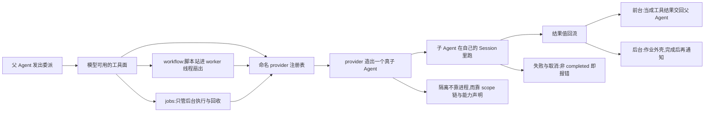
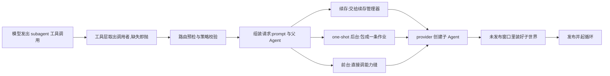
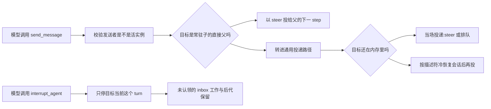
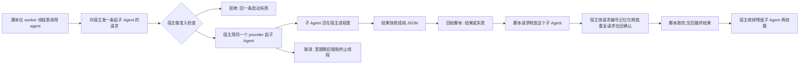

# 第十章 · Multi-Agent 机制与实现细节(DeepSeek Harness 源码分析)

> 分析对象:[innokria/deepseek-harness](https://github.com/innokria/deepseek-harness) @ `dbbaa4a37`
> **深入阅读(函数级)**:[`multi-agent/`](./multi-agent/README.md) —— Agent 注册表与生命周期、能力缝与 provider、子 Agent 组装、续存与管控、workflow 引擎、jobs、preset 组合
> 核心源码:`packages/subagent/*`(capability seam:Service Definition + providers + delegation Consumers)、`packages/workflow/*`(worker-thread 编排引擎 + tool Consumer)、`packages/jobs/*`、`packages/core/agent/src/*`、`packages/preset/agent-presets/*`

---

## 第〇节 一句话结论与总览

DSH 的多 agent **不是**一个多智能体框架,而是**一条 capability seam + 三种派生方式**:`ctx.subagents` 是命名 provider 注册表,`subagent` 工具是它的模型侧 Consumer;每次委派都由 provider 经 `ctx.agents.create()` 造出一个**真 Agent**——自己的 `Session`、自己的 scope、自己的工具面与系统提示。`workflow` 把脚本化扇出放进 worker 线程,再用 `agent()` 反向 RPC 复用**同一个** subagent seam;`jobs` 只提供后台执行外壳与回收。三者共享同一套词汇:`AgentHandle`(所有权)、`SubagentRun`(一次委派)、`SubagentResult`(回流值)。

### 人话版:一次委派从头到尾

这段讲的是 DSH 的"多 agent"到底多在哪。父 Agent(正在跑模型循环的那个 agent,自带一份会话日志和一个作用域)通过一次工具调用发起委派:注册表按名字挑出一个 provider,也就是"提供创建能力的后端",由它造出一个真子 Agent。子 Agent 有自己的 Session(会话日志,可持久化、可恢复)、自己的 scope(作用域链,决定它能看见哪些工具与服务)和一套独立的系统提示,它还会加入父 Agent 所在的 preset(一份可挂载的组合配置,写明这个会话里装配哪些能力行),所以它不是父 Agent 进程里的一个函数调用,而是另一个完整的 Agent。子 Agent 跑完后,结果作为**一次性值**回流:前台路线把它直接变成工具结果交回父 Agent;后台路线先把它变成一条作业,完成后用一条通知决定是注入上下文还是新开一个 turn。失败与取消都是分级的——子 Agent 没正常收尾,前台就转成错误结果但保留部分输出;`interrupt_agent` 只停它的当前 turn,`job_kill` 停掉整条后台作业,已经发布的子 Agent 不会被顺手删掉。`workflow` 是另一条派生方式:模型写的脚本先进入一条 worker 线程(独立的执行线程,脚本写死循环也阻塞不了宿主),脚本里的每个 `agent()` 再经线程间 RPC 反向回到宿主的同一个 subagent seam 上。


<details><summary>Mermaid 源码</summary>



</details>

### 一次委派的阶段明细

| 阶段 | 做了什么 | 关键调用(文件:行) |
|---|---|---|
| 1 模型发出工具调用 | 父 Agent 的工具面里有 `subagent`、`subagent_fork`、`send_message`、`interrupt_agent`、`workflow`、`job_output`、`job_kill`,模型选中其中一个 | `tool-subagent/src/index.ts:471` |
| 2 能力缝校验 | 按 provider 名字取出后端,逐项核对它声明过的能力位:agentOptions、outputSchema、深度上限、工具过滤、persona;任一项不满足立即抛错,不"接受后忽略" | `subagent/subagent/src/index.ts:556-586` |
| 3 委派策略快照 | 在第一个 await 之前抓住父会话的显式 sandbox 覆盖,并把审批策略钉死为 never | `subagent/subagent/src/child-agent.ts:242-247` |
| 4 创建真 Agent | provider 调 `parent.ctx.agents.create()`,在"未发布窗口"里把子世界装好 | `subagent/subagent-in-process-driver/src/index.ts:104-152` |
| 5 发布与启动 | setup → enter → announce 三步发布,然后给子 Agent 送第一条 prompt,等它闲下来 | `core/agent-loop/src/index.ts:659-677` |
| 6 结果读取 | 取最后一条非空 assistant 消息作为输出,再取本轮 turn 的停因,合成一次委派的结果值 | `subagent/subagent/src/assistant-output.ts:67`、`subagent-in-process-driver/src/index.ts:50-67` |
| 7 前台回流 | 停因不是 completed 就转成 throw,变成 isError 工具结果,同时保留已经产出的部分输出 | `tool-subagent/src/index.ts:207-237` |
| 8 后台回流 | one-shot 后台委派被包成一条作业,作业完成后按 owner 状态选择注入或新开 turn | `tool-subagent/src/index.ts:544-560`、`tool-jobs/src/index.ts:278-299` |
| 9 workflow 扇出 | 脚本在 worker 线程里跑,每个 `agent()` 经 ChildStart RPC 复用宿主上同一个 subagent seam | `workflow/workflow-worker-thread/src/host.ts:352-368` |
| 10 jobs 外壳 | 只负责后台执行、游标读取、取消与回收,不参与造 Agent | `jobs/jobs/src/index.ts:82-143` |
| 11 取消与失败 | interrupt 只停当前 turn;job_kill 停整条作业;workflow 里普通失败降级成 null,致命失败上抛杀死脚本 | `subagent/subagent/src/index.ts:280-297`、`workflow/workflow-worker-thread/src/runtime.ts:414-425` |

<details><summary>原图</summary>

```text
父 Agent(session + scope + 自己的工具面)
 │ tool-call: subagent/subagent_fork/send_message/interrupt_agent · workflow · job_output/job_kill
 ▼ Consumer(模型可见工具:tool-subagent │ tool-subagent-control │ tool-workflow │ tool-ralph │ tool-jobs)
 ├─ ctx.subagents.start(provider, request) ─▶ provider.start() ────────────┐
 ├─ ctx.workflowEngine.start(script) ─▶ Worker 线程 + vm realm ───────────┤ ChildStart RPC
 └─ ctx.jobs.start({owner, run}) ─▶ producer hooks(one-shot 后台仍走 subagents)┘
                                                                         ▼
    AgentRegistry.create() → agent-loop factory:setup(childCtx) → enter → announce
      setup:委派策略落日志 · join 父 preset · persona/restrict · descriptor
                                                                         ▼
    子 Agent(独立 Session/scope/工具面)→ followup(prompt) → whenIdle()
                                                                         ▼
    SubagentResult{output, structured?, diagnostic?, stopReason}
      ├ 前台:非 completed 转 throw → isError 工具结果;后台:JobOutcome → onJobDone → inject/followup
      └ workflow:ChildSettled RPC → 脚本 item 值,或 null
```

</details>

**派生是"造 Agent + 独立 Session + 独立 scope",回流是"一次性结果值 + 生命周期事件",隔离靠 scope 链与 provider 能力声明,不靠进程边界。**

---

## 第一节 Agent 抽象与作用域:Scope、withInitiator、显式传递

### 1.1 Agent 是运行面,AgentHandle 是所有权

`Agent` 的公开类型只有身份(`packages/core/agent/src/types.ts:13`);运行面在 runtime face:`status`/`ctx`/`cancel`/`whenIdle`(`packages/core/agent/src/runtime-types.ts:171-191`)与投递三件套 `followup`(下一 turn)/`steer`(下一 step)/`inject`(`runtime-types.ts:222,241`)。**创建**返回 `AgentHandle`,而 disposer 是一种能力:只有持有者能拆掉它(`packages/core/agent/src/index.ts:160-163`)。

```typescript
// packages/core/agent/src/index.ts
export interface AgentHandle { agent: Agent; dispose(): Promise<void> }   // :160 disposer 是能力,只有持有者能拆
register(agent)  // :434;enter(agent, owner) // :458 先插入不广播;announce(agent) // :533 广播,同步监听器抛错即回滚
isOwnedBy(id, owner)  // :579 运行期所有权,独立于 Session 持久谱系
```

`enter`/`announce` 的分离是"未发布窗口"的基础:factory 先 `setup`、再 `enter`、再 `announce`(`packages/core/agent-loop/src/index.ts:659-677`),所以监听者永远看不到半配置的 agent(`packages/core/agent/src/index.ts:100-118` 的 `setup` 契约)。

### 1.2 每个 Agent 有自己的 scope,但 scope 父链来自 preset,不是父 Agent

```typescript
// packages/core/agent-loop/src/agent.ts:104
this.scope = createScope(loopCtx, this)     // 第一个参数是 loopCtx,不是父 Agent 的 ctx
this.ctx = this.scope.ctx
```

scope 父链只在 `bindScopeParent` 时建立(`packages/core/scope/src/index.ts:72-82`),而唯一的生产性绑定方是 agent-presets:

```typescript
// packages/preset/agent-presets/src/mount.ts:243
export function standingMountFor(agentCtx: Context): JoinedPresetMount | undefined {
  const agentKey = scopeOf(agentCtx)
  const standingKey = scopeParentOf(agentKey)     // agent 的 scope 父 = preset 的 standing key
  return livePresetMounts().find(candidate => candidate.key === standingKey)
}
```

结论(第八节要用):**子 agent 继承的是"父 preset 的 standing 组合",不是"父 agent 自己 scope 层里的注册"**;父子间的运行期归属由 `enter(agent, owner)` 单独记录,与 scope 谱系是两件事。

### 1.3 withInitiator:进程内因果归属,不是授权

```typescript
// packages/core/agent/src/index.ts:324,339,292
withInitiator<T>(agent: Agent, operation: () => T): T   // 建立归属边界
withoutInitiator<T>(operation: () => T): T              // 清掉继承的 initiator(定时器/队列泵/导出器)
currentInitiator(): Agent | undefined                   // 可选读取;requireInitiator() 缺失即抛
```

实现是 `AsyncLocalStorage<Agent|undefined>` + 可 drain 的嵌套计数(`index.ts:248-252,624-654`):返回的 Promise 边界在 teardown 统一等待,而"发起本次卸载的那条链"从自己的 drain 里排除(`index.ts:672-678`)。loop 在每个 turn 的驱动器上建立边界(`packages/core/agent-loop/src/agent.ts:207`)。契约原文写明 **"presence is neither liveness proof nor authorization"**(`index.ts:319`),因此跨边界一律显式传主体:`SubagentStartRequest.parent`(`packages/subagent/subagent/src/types.ts:155`)、`WorkflowStartRequest.parent`、`JobStart.owner`(`packages/jobs/jobs/src/types.ts:62`)、`SubagentInterruptAuthority`(`types.ts:65-67`)。工具层据此硬校验:`exec.agent` 缺失即抛,不猜(`tool-subagent/src/index.ts:472-476`;`tool-workflow/src/index.ts:272-278`)。

---

## 第二节 subagent 派生完整链路

### 2.1 seam 契约:provider 声明能力,service 校验能力

```typescript
// packages/subagent/subagent/src/types.ts:344
export interface SubagentProvider {
  readonly name: string
  readonly capabilities: SubagentCapabilities        // agentOptions/outputSchema/depthLimit/toolFilter/persona
  readonly inheritsParentContext: boolean             // 子是否看到父的已完成 turn 前缀(只描述会话历史)
  readonly agentRouteDefaults?: Readonly<{ provider: string; model: string }>
  start(request: ResolvedSubagentStartRequest): Promise<SubagentRun>
  prepareContinuable?(request: ContinuableCreateRequest): Promise<ContinuableCreateSpec>  // 方法存在即能力
}
```

`start()` 的顺序是**先校验、再快照描述符、后委派**(`packages/subagent/subagent/src/index.ts:556-586`):`expectProvider` → `assertCapabilities`(逐项 fail-loud,`:641-657`)→ `assertSubagentMaxDepth` → `assertObjectJsonSchema` → `snapshotSubagentDescriptor` → `await provider.start(resolved)`(唯一的发布/所有权转移边界)→ `establishCatalogChild`(目录写入失败则 dispose run 并把目录错误抛给调用者)→ `observeRun` 发布生命周期对。

### 2.2 从工具调用到子 Agent

这一节跟一次 `subagent` 工具调用走到底:模型给出 prompt 与可选参数,工具层先把调用者认出来,再组装一个请求对象,然后按配置决定走前台、后台还是续存。三条路线最后都落到同一处——provider 调 `parent.ctx.agents.create()` 造出子 Agent,区别只在结果怎么回来。任何环节缺要件(拿不到调用者、provider 没注册)都是当场抛错,不会带着半个请求继续往下走。


<details><summary>Mermaid 源码</summary>



</details>

| 阶段 | 做了什么 | 关键调用(文件:行) |
|---|---|---|
| 1 认调用者 | 工具层要求 `exec.agent` 存在;拿不到就抛错,不去猜调用者是谁 | `tool-subagent/src/index.ts:472-476` |
| 2 路由与策略 | 做路由预检与策略校验,并复查 provider 是否被改动过 | `tool-subagent/src/index.ts:478-512` |
| 3 组装请求 | 把 label、prompt、父 Agent 与 persona、toolFilter、maxDepth 等可选参数拼成请求 | `tool-subagent/src/index.ts:515-523` |
| 4 续存路线 | 交给续存管理器,子 inbox(它收消息的队列)收下初始 prompt 就返回,不等它跑完 | `tool-subagent/src/index.ts:530`、`subagent/src/continuation.ts:102-190` |
| 5 后台路线 | 包成一条 kind 为 subagent 的作业,owner 记成父 Agent | `tool-subagent/src/index.ts:544` |
| 6 前台路线 | 直接调能力缝,并把 signal 一起传下去 | `tool-subagent/src/index.ts:563` |
| 7 provider 启动 | spawn provider 进入 in-process driver,这是唯一的发布与所有权转移边界 | `subagent-spawn-in-process/src/index.ts:54` |
| 8 创建事务 | driver 调 `parent.ctx.agents.create()` 造出真子 Agent | `subagent-in-process-driver/src/index.ts:130-134` |
| 9 未发布窗口 | setup 装配子世界,enter 入表,announce 广播,然后起循环 | `core/agent-loop/src/index.ts:659-677` |

<details><summary>原图</summary>

```text
模型 tool-call: subagent{description, prompt, run_in_background?, provider?, model?}
 └─ tool-subagent execute(args, exec)                              (tool-subagent/src/index.ts:471)
      ├─ parent = exec.agent(缺失即抛) → 路由 preflight/策略校验/provider 变更复查 (:478-512)
      ├─ 组装 request{label,prompt,parent,agentOptions?,persona?,toolFilter?,maxDepth?}   (:515-523)
      ├─ 三条路线:continuable 后台 → startContinuable (:530)
      │            one-shot 后台    → jobs.start({kind:'subagent', owner:parent, run})     (:544)
      │            前台             → subagents.start(provider, {...request, signal})      (:563)
      └─ SpawnInProcessProvider.start → startInProcessRun(request, {})  (spawn/src/index.ts:54)
           └─ parent.ctx.agents.create(...) → factory:未发布 setup → enter → announce → 起 loop
```

</details>

in-process driver 是全部 in-process 后端共用的创建事务(`packages/subagent/subagent-in-process-driver/src/index.ts:104-152`):

```typescript
const childDepth = resolveChildDepth(parent, request.maxDepth)
const childId = brandString<SessionId>(randomUUID())
const activationBoundary = SessionLogOffset(seed?.length ?? 0)
const inherited = captureDelegatedPolicyOverrides(parent)   // 必须在第一个 await 之前捕获
const setup = (childCtx: Context, child: Agent): void => {
  appendDelegatedPolicyOverrides(child.session, inherited)  // 委派策略写进子日志(source:'delegation')
  applyChildComposition(childCtx, parent, { persona: request.persona, toolFilter: request.toolFilter })
  if (request.outputSchema !== undefined) structured = attachStructuredRuntime(childCtx, request.outputSchema)
  attachDescriptorAppend(childCtx, request.descriptor)      // 描述符在子初始 turn 内追加
}
const handle = await parent.ctx.agents.create({ sessionId: childId, parentAgent: parent,
  meta: childSessionMeta(parent, childDepth, seed !== undefined),
  ...seed !== undefined ? { seed, inheritedEventCount: activationBoundary } : {},
  agentOptions: resolveChildAgentOptions(parent, request.agentOptions, childDepth), signal: request.signal, setup })
return drivePublishedRun(handle, request.signal, request.prompt, childId, activationBoundary, structured)
```

### 2.3 子 Agent 的世界由三样东西决定

**(a) 持久元数据**(`packages/subagent/subagent/src/child-agent.ts:138-156`):`cwd`、`agentPreset`、`parentSession`、`isSeeded`、`origin:'subagent'`、`delegationDepth`。`agentPreset` 刻意读**父的 live scope 链**而非 header,因为父可能在空会话上换过 preset(`child-agent.ts:127-133`)。深度是单调的:`delegationDepthOf = max(header.delegationDepth, options.subagentDepth)`(`packages/subagent/subagent/src/depth.ts:28-36`),所以被恢复的父不会装作顶层;`maxDepth` 由工具 Config 给出,默认 3(`tool-subagent/src/index.ts:129`),超限抛 `SubagentDepthError`。

**(b) 组合**——`applyChildComposition` 一次调用完成三件事,顺序有语义(`child-agent.ts:199-218`):

```typescript
childCtx.get('agentPresets')?.composeFrom(childCtx, parent.ctx)   // 1. join 父的 standing composition
childCtx.systemPrompt.context({ name: 'subagent:delegation',      // 2. 固定委派作用域声明
  text: SUBAGENT_DELEGATION_CONTEXT })                            //    "your permission scope was fixed when you were started…"
if (composition.persona !== undefined) childCtx.systemPrompt.section({ name: 'deployment:persona-prefix', text: composition.persona })
if (composition.toolFilter !== undefined) childCtx.tools.restrict(composition.toolFilter)   // 3. 子级工具掩码
```

**(c) 委派策略**——只捕获父会话的**显式** sandbox 覆盖,审批一律钉死(`child-agent.ts:242-247`):

```typescript
return { sandboxMode: parent.ctx.get('sandboxPolicy')?.overrideOf(parent.session),
         approvalPolicy: parent.ctx.get('approval') === undefined ? undefined : 'never' }
```

策略以 `source:'delegation'` 事件写进子会话日志(`child-agent.ts:258-268`),于是**子会话单凭自己的日志即可重建有效策略**——这正是模型可见文案"your permission scope was fixed when you were started"的实现依据。

### 2.4 结果回流:一次值 + 一个停因

驱动层只跑一轮(`driver/src/index.ts:178-237`):`followup(createUserMessage(prompt))` → `await child.whenIdle()` → `readResult`。输出取 `finalAssistantOutput`("最后一条非空 assistant 消息,缺失则累积文本流",`packages/subagent/subagent/src/assistant-output.ts:67`),停因由 `foldConsumedWork(own).end` 的 `TurnEndReason` 映射(`driver/src/index.ts:50-67`,其中 `blocked → refusal`)。工具层的回流规则是"非 completed 即 `isError`,但保留部分输出"(`packages/subagent/tool-subagent/src/index.ts:207-237`):

```typescript
const [execution] = await Promise.allSettled([run.result.then((result) => {
  const error = stopReasonError(result)     // aborted/error/max-tokens/refusal/未知变体
  if (error !== undefined) throw new Error(withDiagnosticAndPartialText(error, result))
  return { kind: 'foreground', runId: run.id, output: result.output as unknown as JsonValue[] }
})])
const [disposal] = await Promise.allSettled([Promise.resolve().then(() => run.dispose())])
// 结果失败优先于 dispose 失败;两者皆失败才 AggregateError
```

停因联合是可合并扩展的,未知变体按失败处理(`tool-subagent/src/index.ts:168-172`),故工具输出 schema 是三选一 `oneOf`:`background`(jobId)/`continuable`(subagentId)/`foreground`(runId+output)(`:429-467`)。

---

## 第三节 `subagent` 与 `subagent_fork` 的差异

两者同包、同 driver、同一个工具实现,只差一个 provider 与一段由 provider 描述符派生的文案。

| 维度 | `subagent`(spawn) | `subagent_fork`(fork) |
|---|---|---|
| provider 包 | `subagent-spawn-in-process` | `subagent-fork-in-process` |
| `inheritsParentContext` | `false`(`spawn/src/index.ts:50`) | `true`(`fork/src/index.ts:72`) |
| seed | 不传(`spawn/src/index.ts:58`) | 父日志到最后一个 `turn/end` 的平衡前缀(`fork/src/index.ts:48-55`) |
| 工具文案 | "Give it a complete, standalone prompt: it does not see this conversation." | "inherits this conversation … it does not see the current in-flight turn"(`tool-subagent/src/index.ts:251-276`) |
| 续存冷启 | `prepareContinuable` 返回 `{}` | 创建时**一次性**切片,写入子会话(`fork/src/index.ts:85-91`) |

```typescript
// packages/subagent/subagent-fork-in-process/src/index.ts:48
function completedTurnPrefix(parent: Agent): SessionEvent[] {
  const events = parent.session.snapshotEvents()
  const lastEnd = events.findLast(e => e.type === 'turn/end')
  if (lastEnd === undefined) return []          // 尚无完成 turn → 全新开始
  return events.slice(0, lastEnd.seq + 1)       // seq === 数组下标,故从 0 连续
}
```

即**只截到最后一个 `turn/end`**:当前这条 tool-call turn 不平衡,不能作为合法子会话重放。seed 交给 session 边界校验"连续自 seq 0、无损 JSON、无开放 turn/step、无悬空 tool call"(`packages/core/agent/src/index.ts:86-95`)。文案由 `providerWording(provider.inheritsParentContext)` 生成(`tool-subagent/src/index.ts:251-276`),而 `inheritsParentContext` 只描述会话历史、不承诺工具/服务/权限继承(`types.ts:349-354`)。预设的取舍也写明了:fork 实例**不开** `modelSelectionSettings`,让 provider/model 与父一致以便继承前缀命中 KV cache(`presets/standard/agent.cordis.yml:189-198`)。

---

## 第四节 续存子 agent:continuable、send_message、interrupt_agent

前台一次性委派之外还有第二条生命周期:**可续存子 agent**。开关在工具 Config(`tool-subagent/src/index.ts:66-72`),调度解析为 `run_in_background ?? continuable`(`:287-305`)——one-shot 默认前台,continuable 默认后台。`startContinuable` 在**子 inbox 接受初始 prompt 时**即返回,不等待子跑完(`packages/subagent/subagent/src/continuation.ts:102-190`),工具只回一个 `subagentId`(`tool-subagent/src/index.ts:530-536`)。冷启所需的组合落在描述符 v3 的 continuable 分支(`packages/subagent/subagent/src/descriptor.ts:48,72-86`):`label` + `agentProvider`/`agentModel`/`agentReasoningEffort` + `persona` + `toolFilter`;刻意不存 `subagentDepth`(以持久 header 为单调下界)与 `outputSchema`(只属于某次 activation,`descriptor.ts:8-19`)。

这一段把两个管控工具的内部走向摊开:`send_message` 给子 Agent 追加消息,`interrupt_agent` 停掉它的当前 turn。`send_message` 先确认发送者确实是注册表里的活实例;如果目标恰好是常驻续存子 Agent 的直接父,就直接以 steer 投递给父的"下一 step",否则转进通用投递路径——目标还在内存里就当场投递,已经被回收就按描述符把会话冷恢复出来再投。`interrupt_agent` 只停目标当前这个 turn:没被认领的 inbox 工作、正在进行的 activation、以及它已经发布的后代全部保留。


<details><summary>Mermaid 源码</summary>



</details>

| 阶段 | 做了什么 | 关键调用(文件:行) |
|---|---|---|
| 1 入口 | send_message 工具取出 agent_id 与 message | `tool-subagent-control/src/index.ts:28` |
| 2 校验发送者 | 发送者必须是注册表里的精确实例,不能是随便一个同 id 的 Agent | `subagent/subagent/src/index.ts:246` |
| 3 发给父 | 目标是常驻续存子的直接父时走 sendToParent,以 steer 投给父的 next-step | `subagent/subagent/src/continuation.ts:337-360` |
| 4 通用投递 | 其余情况走 deliverToChild,统一用 steer 语义 | `subagent/subagent/src/index.ts:273-323` |
| 5 目标常驻 | 断言图像能力后提交准入,按 steer 或排队处理 | `subagent/subagent/src/continuation.ts:243-270` |
| 6 目标已卸载 | 先读会话日志折出描述符,再冷恢复出子 Agent | `subagent/subagent/src/continuation.ts:404-454` |
| 7 interrupt 入口 | interrupt_agent 以 ancestor 身份声明调用者 | `tool-subagent-control/src/index.ts:76` |
| 8 停什么 | 只停当前 turn;未认领的 inbox 工作、activation、已发布后代全部保留 | `subagent/subagent/src/index.ts:280-297` |
| 9 粒度对照 | queuePrompt 对应下一个 turn,steerPrompt 对应下一个 step | `subagent/subagent/src/continuation.ts:243-270` |
| 10 发现侧 | list_agents 走会话投影,不加载也不唤醒 Agent | `subagent/subagent/src/index.ts:349-370` |

<details><summary>原图</summary>

```text
send_message(agent_id, message)                       tool-subagent-control/src/index.ts:28
 └─ ctx.subagents.sendMessage(sender, targetId, content, {signal})    (subagent/src/index.ts:246)
      ├─ sender 必须是注册表里的精确实例;目标是常驻续存子的直接父时走 sendToParent
      │    (continuation.ts:208-213,216-221,337-360;以 'steer' 投递给父的 next-step)
      └─ 否则 deliverToChild(..., 'steer')                            (:228-231,273-323)
           ├─ 常驻:断言图像能力 → submitAdmitted(steer/queue)
           └─ 不常驻:coldResume(observeSession → foldSubagentDescriptor → materialize)(:404-454)

interrupt_agent(agent_id)                             tool-subagent-control/src/index.ts:76
 └─ ctx.subagents.interrupt(target, { kind:'ancestor', agent: caller })  (subagent/src/index.ts:295)
      └─ 只停当前 turn:未认领的 inbox 工作、Activation、已发布后代全部保留 (:280-297 契约)
```

</details>

`queuePrompt`/`steerPrompt` 的差别就是 `Agent.followup`(下一 turn)与 `Agent.steer`(下一 step)的差别(`continuation.ts:243-270` 对照 `packages/core/agent-loop/src/agent.ts:137-147`)。发现侧由 `list_agents` 提供:`listChildren`/`listDescendants` 走 Session query 投影,不加载也不唤醒 Agent(`subagent/src/index.ts:349-370`),状态由 live 注册表补成 `running | idle | ready`(`tool-subagent-control/src/list-agents.ts:59-63`)。生命周期事件以**委派父**为 scope carrier 分发,故父级监听器只看到自己的委派(`packages/subagent/subagent/src/lifecycle.ts:86-90,134-163`)。

---

## 第五节 workflow 编排:worker 隔离、并发上限、失败 → null

### 5.1 seam 与引擎

`WorkflowEngine.start(request)` 返回 `WorkflowRun`,契约是 **`result` 永不 reject**(`packages/workflow/workflow/src/index.ts:157-168`);致命失败用可机器路由的 `WorkflowErrorCode` + `WorkflowError.fatal` 决定组合子是否必须上抛(`:108-148`)。出货引擎是 worker-thread:`start()` 在宿主线程先校验 meta 与 body 语法,再解析限额、起 Worker(`packages/workflow/workflow-worker-thread/src/index.ts:143-202`)。

```typescript
// workflow-worker-thread/src/index.ts:115-122
static Config: z<Config> = z.object({
  provider: z.string().default('spawn'),
  maxConcurrentAgents: z.natural().default(0),      // 0 → min(16, max(1, cores - 2))
  maxTotalAgents: z.natural().min(1).default(1000), // runaway 循环兜底
  maxItemsPerCall: z.natural().min(1).default(4096),
  syncTimeoutMs: z.natural().min(1).default(5000),  // 脚本首个同步切片的 vm 超时
  disposeGraceMs: z.natural().default(5000),        // 取消后强制结算并 terminate 的宽限
})
```

### 5.2 隔离边界:线程 + vm,但**不是**安全边界

Worker 环境被清洗:只保留平台临时目录(Windows 必需)与未构建形态的 `TSX_TSCONFIG_PATH`,`execArgv` 清空(`workflow-worker-thread/src/host.ts:48-60,70-94`)。脚本跑在 `vm.createContext` 中,宿主注入 hook 全局(`runtime.ts:91-114`)。定性原文:"the vm is not a security boundary"(realm 只保证 `host-loop isolation and forced termination`,`packages/workflow/workflow-worker-thread/src/realm.ts:1-8`)。跨线程的值一律先物化成纯 JSON(`realm.ts:66-151`):非有限数、bigint、函数、symbol、`undefined`、循环引用、稀疏数组、非索引属性、symbol 键、异形原型都拒绝并报出路径;`__proto__` 用 `defineProperty` 写成自有属性而非原型赋值(`realm.ts:141-148`)。

### 5.3 并发与失败语义:总量闸门、FIFO 槽位、致命上抛 + 普通失败 → `null`

```typescript
// workflow-worker-thread/src/runtime.ts:228
private acquireSlot(): Promise<void> {
  if (this.activeSlots < this.limits.maxConcurrentAgents) { this.activeSlots += 1; return Promise.resolve() }
  return new Promise<void>((resolve, reject) => { this.slotWaiters.push({ resolve: () => { this.activeSlots += 1; resolve() }, reject }) })
}
```

`agent()` 顺序为:`throwIfCancelled` → 参数校验 → `started >= maxTotalAgents` 抛 `AGENT_CAP` → `acquireSlot` → **再次** `throwIfCancelled`(`runtime.ts:251-275`);`parallel()`/`pipeline()` 的 item 数由 `assertItemCap` 拦截(`:461-468`)。取消会逐个 reject 排队中的 waiter(`:147-152`),脚本不会在取消后悄悄起子 agent。失败语义由 fatality 分级:

```typescript
// workflow-worker-thread/src/runtime.ts:414
return Promise.all(thunks.map(async (thunk) => {
  try { return await thunk() } catch (error: unknown) {
    if (isFatalWorkflowError(error)) throw error   // fatality 由本 realm 的 class instanceof 判定,脚本无法伪造
    return null                                    // 普通失败:该项为 null
  }
}))
```

`pipeline` 同规则但**无跨阶段屏障**:每个 item 独立走完全部 stage,普通 stage 抛错则该项变 `null` 并跳过剩余 stage(`runtime.ts:444-458`)。`agent()` 返回规则(`:318-339`):带 `schema` 且 `completed` → `result.structured`(缺失即该项失败 → `null`);无 `schema` 且 `completed` → 文本拼接;非 `completed` → `null`;`run.result` reject(宿主中继的基础设施故障)→ 致命 `AGENT_RESULT`。这套语义与工具描述一致:`"Misused hooks … throw errors that ALWAYS kill the script — they never dissolve into a per-item null"`(`packages/workflow/tool-workflow/src/index.ts:137-149`)。

### 5.4 宿主侧与工具侧

这一节讲"脚本要起子 Agent 时,消息怎么走一个来回"。脚本跑在 worker 线程里,自己没能力造 Agent,所以每次 `agent()` 都通过线程间 RPC 向宿主发一条请求;宿主用自己的 subagent seam 造出子 Agent,把结果快照成纯 JSON 再回给脚本。失败不会让脚本卡住:起不来就回一条启动失败,结果不可序列化也回失败;脚本被取消时,宿主在宽限期后直接终止线程。


<details><summary>Mermaid 源码</summary>



</details>

| 阶段 | 做了什么 | 关键调用(文件:行) |
|---|---|---|
| 起子 Agent | 脚本发 ChildStart,宿主先做准入检查,过了才走同一个 `subagents.start` | `workflow-worker-thread/src/host.ts:319-330`、`:352-368` |
| 公布句柄 | 先把 `run.result` 的转发挂上,再向脚本公布子 Agent 句柄 | `workflow-worker-thread/src/host.ts:388-414` |
| 交回结果 | 结果先快照成纯 JSON,不可序列化就改回一条失败消息 | `workflow-worker-thread/src/host.ts:393-411` |
| 释放子 Agent | 按请求编号记忆化释放,重复的释放请求照样回确认 | `workflow-worker-thread/src/host.ts:417-450` |
| 结算整个 run | 认领终局 → 收掉残留子 Agent → 结算结果 | `workflow-worker-thread/src/host.ts:489-519` |
| 判断真静默 | 没有未结算的启动、也没有活着的子 Agent,两个条件都满足才算静默 | `workflow-worker-thread/src/host.ts:464-474` |
| 死亡屏障 | 第一条死亡信号之后到达的消息不得再建子 Agent、也不得在 workflow/end 之后叙事 | `workflow-worker-thread/src/host.ts:271-276`、`:521-554` |
| 事件恰好一对 | 配对账本保证 `agent-start` 与 `agent-end` 一对一,worker 说不了话时宿主合成 cancelled | `workflow-worker-thread/src/host.ts:563-585` |
| 取消后抑制叙事 | 宿主侧直接压掉 `phase`/`log`,seam 只剩 `workflow/*` 六个事件 | `workflow/workflow/src/index.ts:36-100` |
| 工具侧记录与桥接 | 记录四个 `tool-workflow/*` 事件、把 `exec.signal` 桥到 `run.cancel`、`finally` 里释放 run | `tool-workflow/src/index.ts:72-130`、`:296-299`、`:315-329` |

<details><summary>原图</summary>

```text
Worker(脚本)                       Host(WorkerRun)                          Subagent seam
 ChildStart{callId, request} ────▶ childAdmissionFailure()? 拒绝;否则          ctx.subagents.start(provider,{
                                      startChild():subagents.start(...) ────▶    prompt, parent, signal: controller.signal,
 ◀ ChildStarted{childId} ─────────  publish;先挂 result 转发再公布句柄             outputSchema?, agentOptions? })
 ◀ ChildSettled{callId, result} ── run.result → snapshotJsonValue(JSON 快照);不可 JSON 化或 reject → ChildFailed
 ChildDispose{callId} ────────────▶ 按 callId 记忆化 dispose(幂等)─────────▶ run.dispose()
 Result{result} ──────────────────▶ onResult():claim → reapChildren → settle
```

</details>

宿主怎么判断一次 run 真的结束了?标准叫"静默"(quiescence):既没有还没结算的启动,也没有活着的子 Agent,两个条件都满足才算结束(`workflow-worker-thread/src/host.ts:464-474`)。worker 死亡时,`error`、已排队但尚未投递的消息、`exit` 三类信号可能乱序到达,所以第一条死亡信号被当成一条逻辑屏障:它之后到达的消息一律不准再建子 Agent,也不准在 `workflow/end` 之后继续叙事(`host.ts:271-276`、`:521-554`)。`agent-start` 与 `agent-end` 则靠一本按序号记的配对账本保证恰好一对一——worker 还能说话就转发它自己的结束事件,说不了话时由宿主合成一条 `cancelled`(`host.ts:563-585`)。取消之后,`phase` 与 `log` 在宿主侧被直接抑制,seam 对外公开的信号只剩 `workflow/*` 这六个事件(`workflow/workflow/src/index.ts:36-100`)。

工具侧只做三件事:把四个 `tool-workflow/*` 事件记进父会话,而且记录失败只停下记录、不影响本次工具执行;把 `exec.signal` 桥接到 `run.cancel`;在 `finally` 里释放 run(`tool-workflow/src/index.ts:72-130`、`:296-299`、`:315-329`)。模型看到的渲染结果还会按 `maxResultChars` 截断,默认 50000 字符(`:195-202`)。`tool-ralph` 是固定脚本形态:模型只给一个 `objective`,脚本每轮用 `agent(prompt,{schema})` 起一个全新的 spawn 子 Agent,轮与轮之间只传一份有界的结构化 handoff(`packages/workflow/tool-ralph/src/index.ts:88-175`)。

---

## 第六节 jobs:后台执行、通知回流与回收

### 6.1 seam 语义、本地实现与后台 subagent

```typescript
// packages/jobs/jobs/src/index.ts
abstract start(spec: JobStart): JobId                                    // :82
abstract read(id, caller?): JobRead                                      // :109 消费一次游标;终态读取标 reported
abstract kill(id, caller?, reason?): 'requested' | 'already-finished'    // :120
abstract wait(id, timeoutMs, caller?, signal?): Promise<JobSnapshot>     // :133 只等待,不取消
abstract onJobDone(listener): () => void                                 // :143
abstract attachController(name: string): () => void                       // :176 无 controller 服务该 owner 时 start 拒绝
```

实现约定(`:41-60`):注册记录的生命周期长于 producer fiber;归属访问按 owner 会话 id 围栏(id 可预测,因此边界是授权而非保密);结算 first-wins。生产者只提供两个钩子(`packages/jobs/jobs/src/types.ts:72-91`):`cancel(reason?)`(同步幂等)与 `done: Promise<JobOutcome>`(资源释放后 resolve),可选 `readOutput()` 决定流式还是"仅最终输出"。本地实现同 owner 并发上限默认 10(`packages/jobs/jobs-local/src/index.ts:28,143-148`),`kill` **先 cancel 再改状态**(cancel 抛错时不改变生命周期与通知状态,`:215-228`)。one-shot 后台委派就是一条 job(`packages/subagent/tool-subagent/src/index.ts:544-560`):

```typescript
const id = jobs.start({ kind: 'subagent', label: args.description, owner: parent, run: () => {
  const controller = new AbortController()
  const start = runtimeCtx.subagents.start(config.provider, { ...request, signal: controller.signal })
  return { cancel: (reason) => { controller.abort(reason ?? 'background subagent task killed') },
           done: settleStart(start, controller.signal) }   // 启动/回滚聚合失败 → JobOutcome
} })
```

`settleStart` 把启动异常折成 `killed`(已取消且非 `AggregateError`)或 `failed`(`:143-153`)——**清理失败不得伪装成干净被杀**。

### 6.2 通知回流:busy → inject,idle → followup(带预算)

```typescript
// packages/jobs/tool-jobs/src/index.ts:278-299
ctx.jobs.onJobDone((snapshot, owner) => {
  if (snapshot.reported || owner === undefined) return
  const message = createUserMessage({ content: [...], source: { kind:'plugin', plugin:'tool-jobs', form:'notice', summary } })
  const spent = spentWakes.get(owner) ?? 0
  if (delivery === 'wakeup' && owner.status === 'idle' && spent < wakeBudget) { spentWakes.set(owner, spent + 1); owner.followup(message); return }
  owner.inject(message)
})
```

唤醒有界:每个 owner 最多连续 `maxConsecutiveWakes`(默认 3)次由完成通知开启的 turn,任何**用户输入被 inbox 认领**时重置预算(`tool-jobs/src/index.ts:213-229`),用以切断"被唤醒的 turn 又起了唤醒自己的作业"这条自激链。`job_output` 的 `wait` 默认 30s、上限 10min,超时返回 `[status: running]` 且不杀作业(`:204-208,329-337`);`job_kill` 请求取消后立即返回(`:361-400`)。`tool-jobs` 是唯一 `attachController('tool-jobs')` 的地方(`:259`,拒绝文案见 `jobs-local/src/index.ts:132-134`)。

### 6.3 steer / interrupt 的粒度对照

| 目的 | 机制 | 粒度 |
|---|---|---|
| 给运行中的子 agent 加话 | `send_message` → `deliverToChild('steer')` → 目标 next-step | turn 内的 step 边界 |
| 停子 agent 当前 turn | `interrupt_agent` → `interrupt(target, {kind:'ancestor', agent})` | 仅当前 turn;inbox 挂起消息与后代保留 |
| 停掉一整条后台工作 | `job_kill` → producer `cancel()` → `done` 结算 `killed` | 整个作业 |
| 释放常驻续存子 | `ctx.subagents.drainContinuableChildren(parent, ids)`(`subagent/src/index.ts:326-330`) | 选中的直接子 |

---

## 第七节 preset:每会话的 agent 组合与 agent 定义

### 7.1 roster → standing composition → agent 的 join

`agent-presets` 扫描若干 root(随包出货的 `system` root、配置 root、harness home 的 `user` root,前者优先,`packages/preset/agent-presets/src/preset.ts:51-70`);每个 preset 目录一个 `agent.cordis.yml`,id 是路径段,故 `PRESET_ID = /^[a-z0-9][a-z0-9-]*$/` 是包含性约束而非风格(`preset.ts:10-18`)。

```typescript
// packages/preset/agent-presets/src/index.ts
async mount(agentCtx, id?) {                        // :436 把某个 preset 组合挂进新会话
  const standing = await this.ensureStanding(preset)
  this.bindings.set(agentKey, bindScopeParent(agentKey, standing.key))
  return preset
}
composeFrom(agentCtx: Context, parentCtx: Context): string | undefined {   // :477 子 agent 加入父**正在跑的那一代**
  const standing = standingMountFor(parentCtx)
  if (standing === undefined) return undefined      // 无 roster 部署:行在 host 层,子自然可见
  this.bindings.set(agentKey, bindScopeParent(agentKey, standing.key))
  return standing.presetId
}
```

`composeFrom` 刻意**按实例而非按 id** 继承:父的 preset 文件若在父启动后被编辑,按 id 重解析会把孩子交给另一代组合;preset 被删时按 id 更会直接失败(`index.ts:451-461`)。

### 7.2 挂载期两道硬门与 delegation 段

`mountPreset` 在 agent **发布之前**完成,并拒绝两种坏组合(`packages/preset/agent-presets/src/mount.ts:378-433`):`inactiveRows(tree)`——有行永远未激活(仍在等组合不提供的服务)则整树拒绝(`:304-322`);`leakedServices(agentCtx, fiber)`——有行把服务发布到 root realm 则拒绝,因为那是进程全局而非每会话(`:210-224`)。失败时整树 dispose 并抛带 preset 路径与逐行原因的 `RemoteError('agent-preset/invalid')`(`:415-432`)。未加入 preset 就被发布的 agent 只**警告**,因为同步 `agent/created` 监听器抛错会否决发布(`index.ts:206-226`)。

```yaml
# packages/preset/agent-presets/presets/standard/agent.cordis.yml:169-234
- id: delegation
  name: cordis:group
  group: true
  isolate:
    workflowEngine: true                     # workflow 引擎只在 agent 平面内
  config:
    - id: tool-subagent-control              # send_message / interrupt_agent
    - id: tool-subagent-list-agents          # list_agents
    - id: tool-subagent                      # toolName: subagent,provider: spawn,backgroundMode: continuable
    - id: tool-subagent-fork                 # toolName: subagent_fork,provider: fork
    - id: workflow-worker-thread             # provider: spawn
    - id: tool-workflow
    - id: tool-ralph                         # subagentProvider: spawn,maxRounds: 64
```

注释写明平面判据:`subagents` 注册表是进程单例、provider 名只能注册一次,故留在 **HOST composition**;preset 只贡献委派工具这一层 Consumer,而 `workflowEngine` 无人跨会话读取,故放在 entry-local realm(`yml:160-168`)。这给出工具可见性的第一原则:**能力在 host,授权在 preset**——装了 provider 不给工具,preset 里少一行才不给。

---

## 第八节 多 agent 间的工具可见性、技能与 MCP 的作用域继承

### 8.1 ScopedLayers 与 tools.restrict():可见面如何求交

```typescript
// packages/core/scope/src/store.ts:208
merge<V>(scope, pick): Map<string, V> {
  const merged = new Map(pick(this.global).entries())
  for (const layer of this.chainLayers(scope)) {     // 远端祖先→近端,近者最后写入
    for (const [name, value] of pick(layer).entries()) merged.set(name, value)
  }
  return merged
}
```

写入一律经 `effect(ctx, action)`(`store.ts:226-266`):作用域由 ctx 推导、undo 归 Cordis effect 所有、层空即回收。`peek()` 是**反链意识**的(只看本 scope 自己的贡献),`chainLayers()` 才带继承(`:172-199`)——两者混用正是"限制/守卫被祖先层悄悄放大"的经典 bug 源。工具注册表在此之上再加一层限制语义:

```typescript
// packages/core/tools/src/index.ts:1148-1173(view() 节选)
const own = this.layers.peek(scope)                  // 本 scope 自己的层:不过滤
const inherited = new Map(global.tools.entries())
for (const layer of layers) { if (layer === own) continue; for (const [n, d] of layer.tools.entries()) inherited.set(n, d) }
for (const [name, definition] of inherited) {
  if (layers.every(layer => layer.admits(name))) visible.set(name, definition)   // 链上限制求交
}
if (own !== undefined) for (const [name, definition] of own.tools.entries()) visible.set(name, definition)
```

`restrict()` 的拒绝面同样严格:无 scope 的 ctx 拒绝(全局限制会掩掉所有 agent)、空过滤器拒绝、未知全局名 fail loud 并把已知名单打进错误、保留名 `run_code` 拒绝(`tools/index.ts:1061-1088`)。**"own layer 例外"是子 agent 的结构化输出工具能活下来的原因**:委派运行时把 structured-output 工具注册进孩子自己的层,而孩子的 `toolFilter` 只裁剪继承来的能力(`tools/index.ts:1127-1137`)。由此三条可预测规则:

1. **父子差异 = 子自己的 `toolFilter` + 两侧 preset 的差异**;子 agent 的工具面来自"preset standing 层 + 自己的层",不是"父 agent 层";
2. **链上限制求交**:preset 层若 `restrict` 掉某工具,该 preset 下所有 agent(含其子)都看不到;
3. **不可见与拒绝执行是同一条**:被裁掉的工具既不在提示里也不在派发表中(`packages/subagent/subagent/src/types.ts:185-192` 的 `toolFilter` 契约,`tools/index.ts:1194-1196`)。

### 8.2 技能与 MCP:同一套作用域规则

- **技能**:`SkillRegistry` 同样用 `ScopedLayers` 并按 scope 链合并(`packages/skill/skill/src/index.ts:362,441-470`);preset 里的 `skill-filesystem` 行把 skill 注册进该 preset 的层,于是同 preset 下父子共享同一份目录。
- **MCP**:ACP 路径对每台服务器 `agentCtx.plugin(McpClient, config)`(`packages/acp/acp/src/mcp.ts:26-33`),工具落在**该 agent 自己的 scope 层**;命名空间预订也按作用域隔离(`packages/mcp/mcp-client/src/index.ts:45,155-159`)。结合 1.2:**agent 私有的 MCP 工具不会被它的子 agent 继承**——子继承的是 preset standing 层;要让一批 agent 共享 MCP,正确位置是 host/preset 组合。
- **事件方向**:`scopeTarget` 只允许事件沿链向上,tag 在 dispatch key 之下的监听器被排除(`packages/core/scope/src/index.ts:158-180`),所以一份 standing composition 能观察它下面每个 agent,反之不行。工具面变化触发 `tools/change`,作用域内消费者据此重新对账(`tool-subagent/src/index.ts:690-707`)。

---

## 第九节 关键文件索引

| 文件 | 职责 |
|---|---|
| `packages/core/agent/src/index.ts` + `runtime-types.ts` | `AgentRegistry`(`create`/`register`/`enter`/`announce`、`AgentHandle`、`withInitiator` 与 drain)与 Agent 运行面 |
| `packages/core/agent-loop/src/agent.ts` + `index.ts` | `ReactLoopAgent`(scope 建立、initiator 边界、inbox);agent 工厂的未发布 setup 事务与发布序列 |
| `packages/core/scope/src/index.ts` + `store.ts` + `packages/core/tools/src/index.ts` | `createScope`/`bindScopeParent`/`scopeChainOf`/`scopeTarget`;`ScopedLayers` 与 merge/effect 归属;`restrict()`/`view()` 的继承面过滤与链上求交 |
| `packages/subagent/subagent/src/index.ts` + `types.ts` + `descriptor.ts` + `lifecycle.ts` | Service Definition(`start` 能力校验与描述符、provider 注册表、`sendMessage`/`interrupt`)、seam 词汇与能力位、`subagent/descriptor`(v3)与生命周期事件对 |
| `packages/subagent/subagent/src/child-agent.ts` + `continuation.ts` | 深度解析、子会话元数据、`applyChildComposition`、委派策略;续存管理器的 `startContinuable`/steer/`coldResume`/drain |
| `packages/subagent/subagent-in-process-driver/src/index.ts` + `subagent-spawn-in-process/src/index.ts` + `subagent-fork-in-process/src/index.ts` | 一次性驱动(setup/创建/单轮驱动/停因映射)与 spawn(全新上下文)、fork(平衡 turn 前缀 seed)两个 provider |
| `packages/subagent/tool-subagent/src/index.ts` | 委派工具:provider 绑定、路由 preflight、前台/后台/续存三路线 |
| `packages/subagent/tool-subagent-control/src/index.ts` + `list-agents.ts` | `send_message`/`interrupt_agent`/`list_agents` |
| `packages/workflow/workflow/src/index.ts` | workflow seam:`WorkflowEngine`、`WorkflowError` 与致命码、`workflow/*` 事件 |
| `packages/workflow/workflow-worker-thread/src/index.ts` + `runtime.ts` | 引擎 `start` 同步校验与限额解析;脚本 hook(`agent`/`parallel`/`pipeline`/`phase`/`log`)、槽位、上限、null 语义 |
| `packages/workflow/workflow-worker-thread/src/host.ts` + `realm.ts` + `protocol.ts` | `WorkerRun`(RPC、ledger、取消宽限、quiescence、terminate);realm→JSON 物化与 `renderThrown`;双向消息标签与 payload 单一事实源 |
| `packages/workflow/tool-workflow/src/index.ts` + `tool-ralph/src/index.ts` | `workflow` 工具契约与 `tool-workflow/*` 记录;固定脚本的 Ralph 循环 |
| `packages/jobs/jobs/src/index.ts` + `types.ts` | `JobRegistry` seam 与 `JobStart`/`JobHooks`/`JobSnapshot` 词汇 |
| `packages/jobs/jobs-local/src/index.ts` + `tool-jobs/src/index.ts` | 本地注册表(owner 围栏、并发上限、read 游标、first-wins)与 `job_output`/`job_list`/`job_kill`、controller 附着、完成通知与唤醒预算 |
| `packages/preset/agent-presets/src/index.ts` + `mount.ts` + `preset.ts` | roster、`mount`/`composeFrom`、standing mount 两道门、preset 词汇与 trust |
| `packages/preset/agent-presets/presets/standard/agent.cordis.yml` | 出货组合:delegation 组、`isolate` 边界、host/agent 平面分工 |
| `packages/skill/skill/src/index.ts` + `packages/acp/acp/src/mcp.ts` + `packages/mcp/mcp-client/src/index.ts` | 技能注册表按 scope 合并;ACP `mcpServers` → agent 作用域 MCP 客户端;桥按作用域预订 `serverName` |
