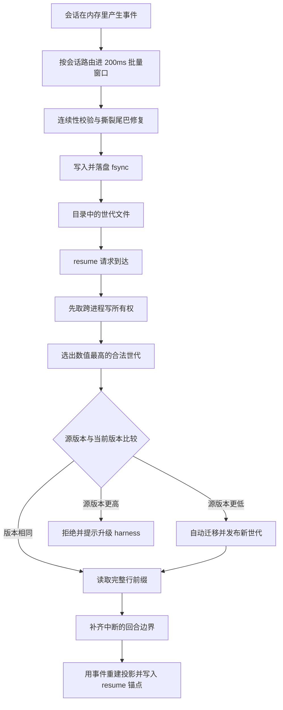
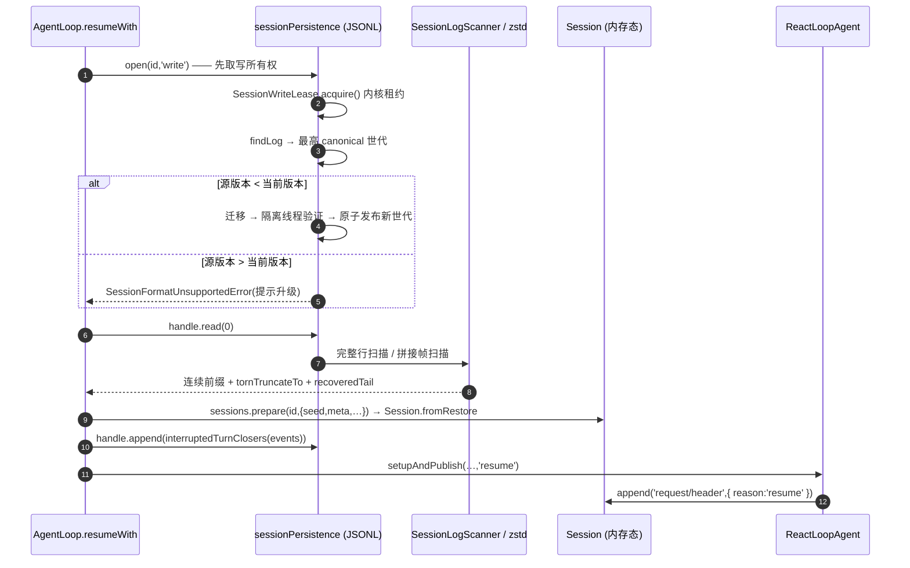

# 第十一章:Session Storage / Transcript / Resume 持久化机制(DeepSeek Harness 源码分析)

> 分析对象:[deepseek-ai/deepseek-harness](https://github.com/deepseek-ai/deepseek-harness) @ `dbbaa4a37`(pnpm monorepo)
> **深入阅读(函数级)**:[`memory/05-persistence-and-recovery.md`](./memory/05-persistence-and-recovery.md) —— JSONL 分帧与世代选取、修复顺序、检查点、租约与撕裂尾巴、迁移链、resume 五步
> 版本权威:[`docs/session-format-status.md`](https://github.com/deepseek-ai/deepseek-harness/blob/dbbaa4a37fb9098aba814c97d2956f7b2f105f46/docs/session-format-status.md#L28)(`latestReleasedVersion: 3`,`evidenceTag: dsh-v0.1.5-alpha.1`)

---

## 第〇节 一句话结论与总览

DSH 的持久化是**一个 seam + 一条"世代只增不改"的物理规则**:`ctx.sessionPersistence`([`packages/session/session-persistence/src/index.ts:135`](https://github.com/deepseek-ai/deepseek-harness/blob/dbbaa4a37fb9098aba814c97d2956f7b2f105f46/packages/session/session-persistence/src/index.ts#L135))只承诺四件事——事件从 seq 0 连续、永不重写、撕裂的物理尾巴永不返回给读者、未知词汇 fail-closed 拒绝重建([`index.ts:115-134`](https://github.com/deepseek-ai/deepseek-harness/blob/dbbaa4a37fb9098aba814c97d2956f7b2f105f46/packages/session/session-persistence/src/index.ts#L115-L134));唯一物理实现 `session-persistence-jsonl` 把每个会话落成**一个目录 + 每个格式世代一个文件**,`append` 是 best-effort、`flush` 才是崩溃存活屏障;跨格式升级**只新增 `session.v(N+1).jsonl`,从不移动、覆盖或删除 `session.vN.jsonl`**。

1. **物理格式**是首行 header + 每事件一行 JSONL;`compression: 'zstd'`(默认,[`session-persistence-jsonl/src/index.ts:66`](https://github.com/deepseek-ai/deepseek-harness/blob/dbbaa4a37fb9098aba814c97d2956f7b2f105f46/packages/session/session-persistence-jsonl/src/index.ts#L66))时是**首行独占一帧、每批事件一帧**的拼接 Zstandard 容器(`index.ts:1207-1221`)。
2. **世代名 canonical**:v0 保留 `session.jsonl`,之后为 `session.vN.jsonl`([`session-format/src/filename.ts:14-17`](https://github.com/deepseek-ai/deepseek-harness/blob/dbbaa4a37fb9098aba814c97d2956f7b2f105f46/packages/session/session-format/src/filename.ts#L14-L17));目录里选**数值最大的 canonical 代**(`index.ts:1395`),相反压缩后缀、旧扁平布局、非 canonical 名一律拒绝。
3. **惰性物化**:`create` 之后会话只在本进程可见,首个 `append`/`flush` 才产生文件;物化前崩溃 = 该会话从未存在([`session-persistence/src/index.ts:125-131`](https://github.com/deepseek-ai/deepseek-harness/blob/dbbaa4a37fb9098aba814c97d2956f7b2f105f46/packages/session/session-persistence/src/index.ts#L125-L131))。
4. **崩溃一致性三层**:内核租约(flock / Win32 信号量)、只承认完整行的扫描器、首次新追加前的物理截断修复。
5. **版本是两套独立数字**:`SESSION_FORMAT_VERSION`([`core/session/src/types.ts:88`](https://github.com/deepseek-ai/deepseek-harness/blob/dbbaa4a37fb9098aba814c97d2956f7b2f105f46/packages/core/session/src/types.ts#L88),当前 `3`)管事件日志;SQLite 的 `SCHEMA_VERSION` 管派生索引与 KV 介质([`storage-sqlite/src/schema.ts:20`](https://github.com/deepseek-ai/deepseek-harness/blob/dbbaa4a37fb9098aba814c97d2956f7b2f105f46/packages/storage/storage-sqlite/src/schema.ts#L20)、[`session-query-sqlite/src/schema.ts:8`](https://github.com/deepseek-ai/deepseek-harness/blob/dbbaa4a37fb9098aba814c97d2956f7b2f105f46/packages/session-query/session-query-sqlite/src/schema.ts#L8))。两者都单调,都不就地降级。
6. **UI / transcript 只有一个数据源**:事件日志。热会话走 `session/event` firehose,冷会话走 `sessionQuery.observeSession()`。
7. **resume = 拿写锁 open → 冷读 → 补边界 → 造 seed → 写 `request/header{reason:'resume'}`**([`core/agent-loop/src/index.ts:879-916`](https://github.com/deepseek-ai/deepseek-harness/blob/dbbaa4a37fb9098aba814c97d2956f7b2f105f46/packages/core/agent-loop/src/index.ts#L879-L916)、[`agent.ts:571`](https://github.com/deepseek-ai/deepseek-harness/blob/dbbaa4a37fb9098aba814c97d2956f7b2f105f46/packages/core/agent-loop/src/agent.ts#L571))。

这一段把**同一次会话的两条路径**放在一起看:一侧是正常写入怎么落到磁盘,另一侧是 resume 时怎么把磁盘上的东西读回来。两条路径的严谨程度并不对称——写入侧可以攒够 200 毫秒再落盘,读回侧却必须假设文件尾巴可能是半截的,于是它先抢下写所有权、只认完整行,碰到撕裂处就截断重写。先记住两个要点:200 毫秒是批量写入的延迟上限;修复顺序(先截断撕裂字节、再把捞回的完整记录写回)不可交换,颠倒就会写出重复序号。


<details><summary>Mermaid 源码</summary>



</details>

| 阶段 | 做了什么 | 关键调用(文件:行) |
|---|---|---|
| 写入侧 · 事件入队 | 活会话事件由后端订阅事件流按会话 id 路由;入队时先深拷贝一份持久化自有的副本 | `jsonl/src/storage.ts:534`、`:274` |
| 写入侧 · 批量窗口 | 事件在有界 200 毫秒窗口里攒批,窗口空闲时才起定时器;drain 失败就把整批按序塞回缓冲,置为暂停等下次重试 | `jsonl/src/storage.ts:36`、`:288`、`:311` |
| 写入侧 · 连续性校验 | 要求本批事件的首个 seq 正好接上已存的游标,不连续就拒绝整批 | `jsonl/src/storage.ts:319` |
| 写入侧 · 撕裂修复 | 首次新追加前先截断撕裂字节,再把上一轮捞回的完整记录重新落盘,最后才写本批 | `jsonl/src/storage.ts:319`、`:329` |
| 写入侧 · 落盘 | 写入并 fsync;默认开启压缩时每批事件一个独立可解的 zstd 帧,写或同步失败会截断回原长度再抛错 | `jsonl/src/index.ts:1246` |
| 写入侧 · 目录布局 | 一个会话一个目录,每个格式世代一个文件,外加一个 POSIX 锁文件 | `jsonl/src/format.ts:57` |
| 读回侧 · 取写所有权 | resume 打开会话时先拿写所有权,把同一会话的并发 resume 挡在门外 | [`core/agent-loop/src/index.ts:853`](https://github.com/deepseek-ai/deepseek-harness/blob/dbbaa4a37fb9098aba814c97d2956f7b2f105f46/packages/core/agent-loop/src/index.ts#L853)、`jsonl/src/lease.ts:70` |
| 读回侧 · 选世代 | 目录里选数值最大的合法世代;压缩后缀与当前配置不符就直接报错 | `jsonl/src/index.ts:1369` |
| 读回侧 · 版本判别 | 源版本低于当前版本就迁移并发布新世代;高于当前版本则拒绝读取,提示升级 harness | [`session-format/src/chain.ts:79`](https://github.com/deepseek-ai/deepseek-harness/blob/dbbaa4a37fb9098aba814c97d2956f7b2f105f46/packages/session/session-format/src/chain.ts#L79) |
| 读回侧 · 扫描完整行 | 只交出由完整行构成的连续前缀,撕裂的尾巴丢弃;zstd 模式下还能把最后一个不完整帧里已 flush 的完整记录捞回来 | `jsonl/src/format.ts:385`、`jsonl/src/zstd.ts:154` |
| 读回侧 · 补回合边界 | 停写但没关 turn 的日志在这里被补成平衡 transcript | [`core/session/src/repair.ts:29`](https://github.com/deepseek-ai/deepseek-harness/blob/dbbaa4a37fb9098aba814c97d2956f7b2f105f46/packages/core/session/src/repair.ts#L29) |
| 读回侧 · 重建投影 | 用事件重建会话投影,没有任何一份状态是单独从磁盘读出来的 | [`core/session/src/preparation.ts:20`](https://github.com/deepseek-ai/deepseek-harness/blob/dbbaa4a37fb9098aba814c97d2956f7b2f105f46/packages/core/session/src/preparation.ts#L20) |
| 读回侧 · 写 resume 锚点 | 本 loop 实例的第一次请求写入 `request/header`;日志里已有锚点即标为 resume | [`core/agent-loop/src/agent.ts:571`](https://github.com/deepseek-ai/deepseek-harness/blob/dbbaa4a37fb9098aba814c97d2956f7b2f105f46/packages/core/agent-loop/src/agent.ts#L571) |

<details><summary>原图</summary>

```text
      写入路径                                   resume 读回路径
 ┌───────────────────────────┐          ┌────────────────────────────────────────┐
 │ Session.append()          │          │ AgentLoop.resumeWith() index.ts:853    │
 │  (内存日志, 见第三章)       │          │  open(id,'write') 先取写所有权           │
 └─────────────┬─────────────┘          └───────────────────┬────────────────────┘
               │ session/event (firehose)                    v
               │ → install() storage.ts:534     ┌───────────────────────────────────┐
               v                                │ SessionWriteLease.acquire() :70    │
 ┌───────────────────────────┐                  │  内核 flock / Win32 信号量, 死即释放│
 │ 200ms 批量窗口             │                  └───────────────────┬───────────────┘
 │  storage.ts:36 / 274      │                                      v
 └─────────────┬─────────────┘                  ┌───────────────────────────────────┐
               │ drainLive()                      │ requireStoredLog → findLog :1408   │
               v                                │  取最高 canonical 世代;              │
 ┌───────────────────────────┐                  │  <当前版 → 迁移+发布; >当前版 → 拒绝 │
 │ persistContiguous() :319  │                  └───────────────────┬───────────────┘
 │  1 ensureLease()          │                                      │ handle.read(0)
 │  2 assertContiguous()     │                                      v
 │  3 truncateTornTail()     │                  ┌───────────────────────────────────┐
 │  4 重写 recoveredTail      │                  │ SessionLogScanner / zstd 帧扫描     │
 │  5 persistBatch()         │                  │  只交出完整行前缀, 撕裂尾巴丢弃       │
 └─────────────┬─────────────┘                  └───────────────────┬───────────────┘
               v                                                    v
 ┌───────────────────────────┐                  ┌───────────────────────────────────┐
 │ materialize / appendLines │                  │ interruptedTurnClosers() :29      │
 │  write + fsync, 分帧       │                  │  补 tool/result + step/end +       │
 └─────────────┬─────────────┘                  │  turn/end{interrupted}            │
               v                                └───────────────────┬───────────────┘
 ┌───────────────────────────┐                                      v
 │ <root>/--<proj>--/<id>/   │                  ┌───────────────────────────────────┐
 │   session.v3.jsonl[.zstd] │                  │ SessionPreparation.create(        │
 │   session.v2.jsonl (遗留)  │                  │  sessions.prepare(id,{seed,meta}))│
 │   session.lock  (POSIX)   │                  │  → fromRestore 投影重建            │
 └───────────────────────────┘                  │  → agent.ts:571 reason:'resume'   │
                                                └───────────────────────────────────┘
```

</details>

---

## 第一节 落盘格式与世代文件

### 1.1 目录布局与路径编码

存储根取配置 `root`,构造时 `resolve()` 一次,之后 `process.cwd()` 变化不会把同一后端劈成两个根([`session-persistence-jsonl/src/index.ts:269-270`](https://github.com/deepseek-ai/deepseek-harness/blob/dbbaa4a37fb9098aba814c97d2956f7b2f105f46/packages/session/session-persistence-jsonl/src/index.ts#L269-L270))。布局三层:`<root>/--<projectKey>--/<encodedSessionId>/session.v3.jsonl[.zstd]`。

`SessionId` 是**未校验的 branded string**,进文件系统前必须编码。`encodeSegment()`([`format.ts:198`](https://github.com/deepseek-ai/deepseek-harness/blob/dbbaa4a37fb9098aba814c97d2956f7b2f105f46/packages/session/session-persistence-jsonl/src/format.ts#L198))把 `~` 与所有非 `[A-Za-z0-9._-]` 码元转成 `~XXXX`,特判 `.`/`..`,消灭 `../`、绝对路径、NUL 与分隔符,而且是**单射**的——含孤立代理项也能解回原文。项目键 `projectKey()`([`format.ts:224`](https://github.com/deepseek-ai/deepseek-harness/blob/dbbaa4a37fb9098aba814c97d2956f7b2f105f46/packages/session/session-persistence-jsonl/src/format.ts#L224))走同族转义但**有意有损**:分隔符折叠成 `-`、截断到 251 字符,产出人能读的 `--slug--`(`cwd` 缺失时用 `_no-cwd`,[`format.ts:253-256`](https://github.com/deepseek-ai/deepseek-harness/blob/dbbaa4a37fb9098aba814c97d2956f7b2f105f46/packages/session/session-persistence-jsonl/src/format.ts#L253-L256))。

### 1.2 物理记录:header 行 + 每事件一行

首行是 `type: 'session'` 的 header 记录,**不属于可重放事件日志**:`version/id/createdAt/isSeeded/delegationDepth` 必填,`cwd/parentSession/origin/agentPreset` 可选,且**不允许任何其他键**([`format.ts:95-97`](https://github.com/deepseek-ai/deepseek-harness/blob/dbbaa4a37fb9098aba814c97d2956f7b2f105f46/packages/session/session-persistence-jsonl/src/format.ts#L95-L97)、白名单 [`format.ts:158-185`](https://github.com/deepseek-ai/deepseek-harness/blob/dbbaa4a37fb9098aba814c97d2956f7b2f105f46/packages/session/session-persistence-jsonl/src/format.ts#L158-L185))。继承切点 `inheritedEventCount` 不进 header 字段,由 catalog 编码进去([`format.ts:118-133`](https://github.com/deepseek-ai/deepseek-harness/blob/dbbaa4a37fb9098aba814c97d2956f7b2f105f46/packages/session/session-persistence-jsonl/src/format.ts#L118-L133)),持久投影是日志里最后一条带 `{ inherited: true }` 的 `session/end-seed`(见第三章 1.4)。正文严格"一事件一行、行尾 `\n`"([`format.ts:312-323`](https://github.com/deepseek-ai/deepseek-harness/blob/dbbaa4a37fb9098aba814c97d2956f7b2f105f46/packages/session/session-persistence-jsonl/src/format.ts#L312-L323))。zstd 模式下**帧边界刻意对齐记录边界**:

```typescript
// packages/session/session-persistence-jsonl/src/index.ts:1207
/** Encode the header and first batch without combining their frame boundaries. */
const header = JSON.stringify(toHeaderLine(meta, meta.isSeeded ? inheritedEventCount : undefined)) + '\n'
if (events.length === 0) return this.compression === 'none' ? header : compressZstdFrame(header)
const body = eventLines(events) + '\n'
if (this.compression === 'none') return header + body
return Buffer.concat([await compressZstdFrame(header), await compressZstdFrame(body)])  // 首行独占一帧
```

每帧带校验和([`zstd.ts:18-20`](https://github.com/deepseek-ai/deepseek-harness/blob/dbbaa4a37fb9098aba814c97d2956f7b2f105f46/packages/session/session-persistence-jsonl/src/zstd.ts#L18-L20) 的 `ZSTD_c_checksumFlag`)且独立可解——这是"追加一段 = 追加一个帧、撕裂只可能落在最后一帧"的物理前提。因此元数据读取只需解第一帧:`readFirstZstdLine()`(`index.ts:1332`)断言首帧明文**恰好是一行 header**(`assertZstdHeaderFrame`,[`index.ts:75`](https://github.com/deepseek-ai/deepseek-harness/blob/dbbaa4a37fb9098aba814c97d2956f7b2f105f46/packages/session/session-persistence/src/index.ts#L75)),`stat`/`list` 不必解压整个文件。

header 行的白名单校验与"一事件一行"的编码分别落在两个纯函数上。先是必须键/可选键的集合与首行的类型守卫([`format.ts:95-185`](https://github.com/deepseek-ai/deepseek-harness/blob/dbbaa4a37fb9098aba814c97d2956f7b2f105f46/packages/session/session-persistence-jsonl/src/format.ts#L95-L185)):

```typescript
// packages/session/session-persistence-jsonl/src/format.ts:95-162
const HEADER_REQUIRED_KEYS = ['type', 'version', 'id', 'createdAt', 'isSeeded', 'delegationDepth'] as const
const HEADER_OPTIONAL_KEYS = ['cwd', 'parentSession', 'origin', 'agentPreset'] as const
const HEADER_KEYS = new Set<string>([...HEADER_REQUIRED_KEYS, ...HEADER_OPTIONAL_KEYS])
// ...(略): 99-156 行是退役字段拒绝与 toHeaderLine/parseHeaderRecord
/** Type guard: a parsed first line is a well-formed session header. */
function isHeaderLine(value: unknown): value is HeaderLine {
  return (
    typeof value === 'object' && value !== null && !Array.isArray(value)
    && HEADER_REQUIRED_KEYS.every(key => Object.hasOwn(value, key))
    && Object.keys(value).every(key => HEADER_KEYS.has(key))
    // ...(略): 163-183 行逐字段校验 type/version/id/createdAt/delegationDepth/cwd/...
```

再是事件行的序列化——每个事件恰好一行 JSON,行尾换行由写入方补([`format.ts:312-323`](https://github.com/deepseek-ai/deepseek-harness/blob/dbbaa4a37fb9098aba814c97d2956f7b2f105f46/packages/session/session-persistence-jsonl/src/format.ts#L312-L323)):

```typescript
// packages/session/session-persistence-jsonl/src/format.ts:312-323
export function eventLines(events: readonly SessionEvent[]): string {
  return events.map(eventLine).join('\n')
}
// ...(略): 316-320 行是 eventLine 的 JSDoc
export function eventLine(event: SessionEvent): string {
  return JSON.stringify(sessionFormatCatalog.encodeCurrentEvent(event as unknown as SessionFormatEvent))
}
```

### 1.3 canonical 世代名与代际选择

规则集中在 [`session-format/src/filename.ts:5`](https://github.com/deepseek-ai/deepseek-harness/blob/dbbaa4a37fb9098aba814c97d2956f7b2f105f46/packages/session/session-format/src/filename.ts#L5):`CANONICAL_LOG_FILENAME = /^session(?:\.v([1-9][0-9]*))?\.jsonl$/u`,即 v0 = `session.jsonl`、vN = `session.vN.jsonl`;大写、前导零、`.v0`、带压缩后缀的名字都**不是** canonical([`filename.ts:26-32`](https://github.com/deepseek-ai/deepseek-harness/blob/dbbaa4a37fb9098aba814c97d2956f7b2f105f46/packages/session/session-format/src/filename.ts#L26-L32))。JSONL 后端在此之上叠压缩后缀(`generationLogFilename`,[`format.ts:57-59`](https://github.com/deepseek-ai/deepseek-harness/blob/dbbaa4a37fb9098aba814c97d2956f7b2f105f46/packages/session/session-persistence-jsonl/src/format.ts#L57-L59))。

```typescript
// packages/session/session-format/src/filename.ts:5-32
const CANONICAL_LOG_FILENAME = /^session(?:\.v([1-9][0-9]*))?\.jsonl$/u
// ...(略): 7-13 行是 sessionFormatLogFilename 的 JSDoc
export function sessionFormatLogFilename(version: number): string {
  const generation = sessionFormatVersion(version, 'Session log generation version')
  return generation === 0 ? 'session.jsonl' : `session.v${generation}.jsonl`
}
// ...(略): 19-25 行是 parseSessionFormatLogFilename 的 JSDoc
export function parseSessionFormatLogFilename(filename: string): number | undefined {
  const match = CANONICAL_LOG_FILENAME.exec(filename)
  if (match === null) return undefined
  if (match[1] === undefined) return 0
  const version = Number(match[1])
  return Number.isSafeInteger(version) ? version : undefined
}
```

`resolveGenerationInDirectory()`(`index.ts:1369-1404`)做三件事:(a) 收集当前压缩后缀的 canonical 名,同时收集**相反后缀**的 canonical 名,后者非空即 `encodingMismatch` 抛错(`index.ts:1394`)——同一会话不允许 `.jsonl` 与 `.jsonl.zstd` 并存,改配置不会静默挑一个读;(b) 排序取数值最高的一代:`const latest = generations.sort((left, right) => right.version - left.version)[0]`(`index.ts:1395`);(c) 目标路径恒为**当前版本**的 canonical 名(`index.ts:1400-1403`),与源文件同目录。

```typescript
// packages/session/session-persistence-jsonl/src/index.ts:1382-1404
// ...(略): 1382-1393 行声明 generations/opposite 并按当前与相反压缩后缀分别收集 canonical 名
if (opposite.length > 0) throw this.encodingMismatch(opposite[0] as string)
const latest = generations.sort((left, right) => right.version - left.version)[0]
if (latest === undefined) return undefined
return {
  sourcePath: latest.path,
  sourceVersion: latest.version,
  currentPath: join(
    dir,
    generationLogFilename(sessionFormatCatalog.currentVersion, this.compression),
  ),
}
```

`findLog()`(`index.ts:1408`)再跨项目目录按 id 查找,找到**多于一份**即报 `duplicate JSONL session id … appears in multiple project directories`(`index.ts:1418-1420`);旧扁平布局另由 `rejectLegacyFlatArtifact` 明确拒绝。

### 1.4 惰性物化与可见性

`create()` 只做四件事:校验并深拷贝 header、预演 header 行编码(fail fast)、查重、在本进程登记 pending(`index.ts:308-327`)。查重同时看内存 pending 与磁盘世代,冲突即 `SessionAlreadyExistsError`(`index.ts:317-319`);此时**不取锁**——物化前没有可供别的进程竞争的持久产物,句柄在第一次产生日志字节前才取(`index.ts:321-326`)。登记后 `stat`/`list`/`open('read')` 立刻能看到它,但**只有本进程**(`index.ts:432-435`、`485-487`)。这是 seam 层面的承诺而非实现细节([`session-persistence/src/index.ts:125-131`](https://github.com/deepseek-ai/deepseek-harness/blob/dbbaa4a37fb9098aba814c97d2956f7b2f105f46/packages/session/session-persistence/src/index.ts#L125-L131)):"物化前崩溃的会话从未存在过"。物化点两个——首次 `persistBatch(isMaterialized=false)`(`index.ts:818`)与显式 flush 空会话的 `persistHeader()`(`index.ts:828`)。

```typescript
// packages/session/session-persistence-jsonl/src/index.ts:308-326
async create(header: SessionHeader, options?: SessionPersistenceCreateOptions): Promise<SessionHandle> {
  // ...(略): 309-314 行是 signal 检查、materializeCreateHeader 与 toHeaderLine 预演
  await this.ensureRootEncoding()
  options?.signal?.throwIfAborted()
  if (this.tracker.hasPending(snapshot.id) || await this.findLog(snapshot.id, options?.signal) !== undefined) {
    throw new SessionAlreadyExistsError(snapshot.id)
  }
  options?.signal?.throwIfAborted()
  // ...(略): 321-324 行注释说明物化前不取锁
  this.tracker.registerCreated(snapshot, inheritedEventCount)
  return this.tracker.adopt(new JsonlSessionHandle(this, snapshot.id, snapshot, 'write', { cursor: 0, materialized: false, inheritedEventCount }))
}
```

---

## 第二节 checkpoint 策略:何时真正落盘

### 2.1 append 是 best-effort,flush 是屏障

seam 明确分开二者([`handle.ts:97-109`](https://github.com/deepseek-ai/deepseek-harness/blob/dbbaa4a37fb9098aba814c97d2956f7b2f105f46/packages/session/session-persistence/src/handle.ts#L97-L109)):`append` 解析时只保证"已接受、已排序、本实例后续读可见",**只有 flush 解析才承诺崩溃存活**。JSONL 实现比这个下限强——`appendLines()` 内部直接 `write + fsync`(`index.ts:1260-1261`),所以它的 `flush` 退化成 materialize-if-needed([`storage.ts:203-212`](https://github.com/deepseek-ai/deepseek-harness/blob/dbbaa4a37fb9098aba814c97d2956f7b2f105f46/packages/session/session-persistence-jsonl/src/storage.ts#L203-L212)):已物化就立即返回(appends are durable on resolution),否则取租约并写一个只含 header 的产物(`persistHeader`),再把 `materialized` 置真。

seam 那边把这条差异写成 append/flush 的对照契约([`handle.ts:86-97`](https://github.com/deepseek-ai/deepseek-harness/blob/dbbaa4a37fb9098aba814c97d2956f7b2f105f46/packages/session/session-persistence/src/handle.ts#L86-L97),节选):

```typescript
// packages/session/session-persistence/src/handle.ts:85-97
/**
 * Append a contiguous batch continuing the current logical end. The first
 * event's `seq` MUST equal the stored next-seq; committed events are never
 * rewritten. Persistence is best-effort: on resolution the batch is
 * accepted, ordered, and visible to reads on this backend instance, but
 * only a resolved {@link flush} promises it survives a crash — a backend
 * may buffer or batch physical writes behind append. Rejects with
 * `SessionReadOnlyError` on a read handle and `SessionOwnershipLostError`
 * when write ownership is gone.
 * @param events - the contiguous batch, in seq order.
 * @param options - optional cancellation observed before the write starts.
 */
append(events: readonly SessionEvent[], options?: SessionHandleAppendOptions): Promise<void>
```

JSONL 句柄的 `flush` 因此退化成"必要时物化"([`storage.ts:203-211`](https://github.com/deepseek-ai/deepseek-harness/blob/dbbaa4a37fb9098aba814c97d2956f7b2f105f46/packages/session/session-persistence-jsonl/src/storage.ts#L203-L211)):

```typescript
// packages/session/session-persistence-jsonl/src/storage.ts:203-212
flush(options?: SessionHandleFlushOptions): Promise<void> {
  return this.run('flush', async () => {
    options?.signal?.throwIfAborted()
    if (this.access !== 'write') throw new SessionReadOnlyError(this.id, 'flush')
    if (this.state.materialized) return // appends are durable on resolution
    await this.ensureLease()
    await this.storage.persistHeader(this.header, this.state.inheritedEventCount)
    this.state.materialized = true
  })
}
```

### 2.2 路由与批量窗口

活会话事件不经调用方逐个 append,而由后端订阅 `session/event` 按 id 路由([`storage.ts:534-554`](https://github.com/deepseek-ai/deepseek-harness/blob/dbbaa4a37fb9098aba814c97d2956f7b2f105f46/packages/session/session-persistence-jsonl/src/storage.ts#L534-L554)),投进**有界 200ms 批量窗口**(`LIVE_WRITE_BATCH_MAX_DELAY_MS`,[`storage.ts:36`](https://github.com/deepseek-ai/deepseek-harness/blob/dbbaa4a37fb9098aba814c97d2956f7b2f105f46/packages/session/session-persistence-jsonl/src/storage.ts#L36)):`enqueueLive()` 先 `structuredClone` 一份持久化自有的副本,再在窗口空闲时起定时器([`storage.ts:274-281`](https://github.com/deepseek-ai/deepseek-harness/blob/dbbaa4a37fb9098aba814c97d2956f7b2f105f46/packages/session/session-persistence-jsonl/src/storage.ts#L274-L281))。`drainLive()` 是单飞的([`storage.ts:288-292`](https://github.com/deepseek-ai/deepseek-harness/blob/dbbaa4a37fb9098aba814c97d2956f7b2f105f46/packages/session/session-persistence-jsonl/src/storage.ts#L288-L292));失败时把整批**按序塞回**缓冲并置 `drainPaused`,等下次 drain 重试([`storage.ts:308-313`](https://github.com/deepseek-ai/deepseek-harness/blob/dbbaa4a37fb9098aba814c97d2956f7b2f105f46/packages/session/session-persistence-jsonl/src/storage.ts#L308-L313))——宁可不写也不丢序。`close()` 循环 drain 直到"一趟下来缓冲区为空"才释放句柄与锁([`storage.ts:231-240`](https://github.com/deepseek-ai/deepseek-harness/blob/dbbaa4a37fb9098aba814c97d2956f7b2f105f46/packages/session/session-persistence-jsonl/src/storage.ts#L231-L240));服务级 `flush()` 遍历所有活跃写句柄,失败聚合成 `AggregateError` 但**其余句柄照样 flush**([`storage.ts:508-523`](https://github.com/deepseek-ai/deepseek-harness/blob/dbbaa4a37fb9098aba814c97d2956f7b2f105f46/packages/session/session-persistence-jsonl/src/storage.ts#L508-L523))。

### 2.3 三个语义 checkpoint

"何时必须落盘"由独立插件 `session-checkpoint-policy` 决定,与后端解耦(README:backend 存日志,policy 决定何时必须落)。三个屏障全部 fail-closed([`session-checkpoint-policy/src/index.ts:63-83`](https://github.com/deepseek-ai/deepseek-harness/blob/dbbaa4a37fb9098aba814c97d2956f7b2f105f46/packages/session/session-checkpoint-policy/src/index.ts#L63-L83)):

```typescript
ctx.on('llm/stream', (options, next) => {            // ① 请求:适配器派发前
  if (options.sessionId === undefined) return next()
  const session = ctx.sessions.get(options.sessionId)
  return session === undefined ? next() : afterCheckpoint(ctx, session, next)
})
ctx.on('tools/execute', async (exec, next) => {       // ② 顶层工具:工具体之前
  if (exec.agent === undefined || exec.parent !== undefined) return next()  // 嵌套派发复用外层
  await ctx.sessions.flush(exec.agent.session)
  if (exec.signal.aborted) return abortedBeforeDispatchResult()
  return next()
})
ctx.on('agent/pre-step', async ({ agent }, next) => { // ③ 步边界:下一步请求推导前
  await ctx.sessions.flush(agent.session)
  return next()
})
```

`afterCheckpoint()`([`index.ts:29-38`](https://github.com/deepseek-ai/deepseek-harness/blob/dbbaa4a37fb9098aba814c97d2956f7b2f105f46/packages/session/session-persistence/src/index.ts#L29-L38))把 flush 放在生成器第一步,于是消费者拿到第一个 chunk 之前请求前缀已完整落盘;flush 失败则适配器**根本不会被调用**。`ctx.sessions.flush()` 是唯一入口([`core/session/src/index.ts:1144`](https://github.com/deepseek-ai/deepseek-harness/blob/dbbaa4a37fb9098aba814c97d2956f7b2f105f46/packages/core/session/src/index.ts#L1144),JSDoc 明说不得绕过它直接派发 `session/flush`),它等全部监听器 settle 后抛出首个失败。

---

## 第三节 版本机制:SESSION_FORMAT_VERSION 与迁移链

### 3.1 唯一的写者版本号

`SESSION_FORMAT_VERSION = 3`([`packages/core/session/src/types.ts:88`](https://github.com/deepseek-ai/deepseek-harness/blob/dbbaa4a37fb9098aba814c97d2956f7b2f105f46/packages/core/session/src/types.ts#L88))是**唯一手工维护的当前写者版本**;包版本、codec 导出名、fixture 文件名、投影缓存版本都不是权威([`docs/session-format-status.md:19`](https://github.com/deepseek-ai/deepseek-harness/blob/dbbaa4a37fb9098aba814c97d2956f7b2f105f46/docs/session-format-status.md#L19))。发布记录 `latestReleasedVersion: 3` 配 `evidenceTag: dsh-v0.1.5-alpha.1`([`session-format-status.md:28-31`](https://github.com/deepseek-ai/deepseek-harness/blob/dbbaa4a37fb9098aba814c97d2956f7b2f105f46/docs/session-format-status.md#L28-L31)):相等即该格式已发版,大于则是开发目标。**发过版的格式即产生持久化义务**——alpha/beta 也算,prerelease 标记不使已持久化的用户数据可丢弃([`session-format-status.md:23`](https://github.com/deepseek-ai/deepseek-harness/blob/dbbaa4a37fb9098aba814c97d2956f7b2f105f46/docs/session-format-status.md#L23))。

事件类型词汇扩展**不 bump 版本**(declaration merging + `ignorable: true`,见第三章 1.1)。未知且未标 `ignorable` 的事件必须**拒绝重建**,因为静默跳过会让重建出的会话是错的([`storage-contract.ts:74-80`](https://github.com/deepseek-ai/deepseek-harness/blob/dbbaa4a37fb9098aba814c97d2956f7b2f105f46/packages/session/session-persistence/src/storage-contract.ts#L74-L80));同一函数还拦住一个"藏在已知类型下的退役形状"——`request/header` 带已删除 delta codec 的 `reason: 'fallback'`([`storage-contract.ts:83-92`](https://github.com/deepseek-ai/deepseek-harness/blob/dbbaa4a37fb9098aba814c97d2956f7b2f105f46/packages/session/session-persistence/src/storage-contract.ts#L83-L92))。

### 3.2 相邻迁移链:编译期就要求完整

编解码由 catalog 统一调度([`session-format/src/catalog.ts:29`](https://github.com/deepseek-ai/deepseek-harness/blob/dbbaa4a37fb9098aba814c97d2956f7b2f105f46/packages/session/session-format/src/catalog.ts#L29) 的 `createSessionFormatCatalog`),链的合法性在**编译期**定死([`session-format/src/chain.ts:24-77`](https://github.com/deepseek-ai/deepseek-harness/blob/dbbaa4a37fb9098aba814c97d2956f7b2f105f46/packages/session/session-format/src/chain.ts#L24-L77)):每条迁移必须相邻(`to !== from + 1` 即抛 `must declare adjacent v${from}->v${from+1}`,[`chain.ts:30-32`](https://github.com/deepseek-ai/deepseek-harness/blob/dbbaa4a37fb9098aba814c97d2956f7b2f105f46/packages/session/session-format/src/chain.ts#L30-L32))、起始版本与名字不得重复([`chain.ts:57-63`](https://github.com/deepseek-ai/deepseek-harness/blob/dbbaa4a37fb9098aba814c97d2956f7b2f105f46/packages/session/session-format/src/chain.ts#L57-L63))、v0 到 current 必须逐版本齐备(缺一条即 `Session migration v${v}->v${v+1} is missing`,[`chain.ts:65-71`](https://github.com/deepseek-ai/deepseek-harness/blob/dbbaa4a37fb9098aba814c97d2956f7b2f105f46/packages/session/session-format/src/chain.ts#L65-L71))、指向 current 之外的迁移直接报错([`chain.ts:72-75`](https://github.com/deepseek-ai/deepseek-harness/blob/dbbaa4a37fb9098aba814c97d2956f7b2f105f46/packages/session/session-format/src/chain.ts#L72-L75))。`plan(from)` 对**未来版本**拒绝:`stored Session uses newer format v${from}; this build writes v${this.currentVersion}`([`chain.ts:79-87`](https://github.com/deepseek-ai/deepseek-harness/blob/dbbaa4a37fb9098aba814c97d2956f7b2f105f46/packages/session/session-format/src/chain.ts#L79-L87))——用户该看到"升级 harness",不是"会话损坏",所以 `refuseForeignFormatVersion()` 在任何结构校验之前先做版本判别([`format.ts:339-345`](https://github.com/deepseek-ai/deepseek-harness/blob/dbbaa4a37fb9098aba814c97d2956f7b2f105f46/packages/session/session-persistence-jsonl/src/format.ts#L339-L345))。

相邻性与"未来版本拒绝"两处判定是纯函数,没有 IO 也没有插件依赖([`chain.ts:30-87`](https://github.com/deepseek-ai/deepseek-harness/blob/dbbaa4a37fb9098aba814c97d2956f7b2f105f46/packages/session/session-format/src/chain.ts#L30-L87)):

```typescript
// packages/session/session-format/src/chain.ts:30-87
if (to !== from + 1) {
  throw new SessionFormatError(`${migration.name} must declare adjacent v${from}->v${from + 1}`)
}
// ...(略): 33-78 行是 defineSessionFormatMigration 的收尾、createSessionFormatChain 与构造期的重复/缺失校验
private plan(fromVersion: number): readonly SessionFormatMigration[] {
  const from = sessionFormatVersion(fromVersion, 'stored Session format version')
  if (from > this.currentVersion) {
    throw new SessionFormatUnsupportedMigrationError(
      `stored Session uses newer format v${from}; this build writes v${this.currentVersion}`,
    )
  }
  return Object.freeze(this.migrations.slice(from))
}
```

当前 catalog 是**生成文件**([`session-format-catalog/src/generated.ts:14-32`](https://github.com/deepseek-ai/deepseek-harness/blob/dbbaa4a37fb9098aba814c97d2956f7b2f105f46/packages/session/session-format-catalog/src/generated.ts#L14-L32),由 [`scripts/gen-session-format-catalog.ts`](https://github.com/deepseek-ai/deepseek-harness/blob/dbbaa4a37fb9098aba814c97d2956f7b2f105f46/scripts/gen-session-format-catalog.ts) 生成),直接 import 四个 codec 与三条迁移,使历史可读性不依赖任何已挂载插件:

```typescript
export const sessionFormatCatalog = createSessionFormatCatalog({
  currentVersion: 3,
  codecs: [releasedV0SessionFormatCodec, releasedV1SessionFormatCodec,
           releasedV2SessionFormatCodec, releasedV3SessionFormatCodec],
  currentEncoder: releasedV3SessionFormatCodec,
  migrations: [sessionFormatV0ToV1, sessionFormatV1ToV2, sessionFormatV2ToV3],
  restoreCurrent(artifact) {                       // 解码后再用已安装 Session 包复验
    const restored = restoreReleasedV3Artifact(artifact, KNOWN_SESSION_EVENT_TYPES)
    validateInstalledCurrentSessionArtifact(restored)
    return restored
  },
})
```

后端构造时校验 catalog 与 Session 源共享同一版本所有者,不一致即抛错([`session-persistence-jsonl/src/index.ts:263-268`](https://github.com/deepseek-ai/deepseek-harness/blob/dbbaa4a37fb9098aba814c97d2956f7b2f105f46/packages/session/session-persistence-jsonl/src/index.ts#L263-L268))。

### 3.3 "永不移动、覆盖、删除已提交代际"

三处硬落点:

**(a) 发布是"不存在则创建"而非替换**([`generation.ts:812-838`](https://github.com/deepseek-ai/deepseek-harness/blob/dbbaa4a37fb9098aba814c97d2956f7b2f105f46/packages/session/session-persistence-jsonl/src/generation.ts#L812-L838)):迁移把新世代写进随机名临时文件,再 `link`(POSIX)/`publishNewFileWin32`(Win32)占位,冲突返回 `false` 而不是覆盖,随后 fsync 目录:

```typescript
async function publishCurrentExclusive(staged, currentPath, internals): Promise<boolean> {
  try {
    if (internals.platform === 'win32') await internals.publishNewWin32(staged, currentPath)
    else { await internals.fs.link(staged, currentPath); await syncDirectory(dirname(currentPath), internals) }
    return true
  } catch (error) { if (isEEXIST(error)) return false; throw error }
}
```

发布前断言源文件身份未变([`generation.ts:900-904`](https://github.com/deepseek-ai/deepseek-harness/blob/dbbaa4a37fb9098aba814c97d2956f7b2f105f46/packages/session/session-persistence-jsonl/src/generation.ts#L900-L904));发布后若发现已有人抢先,则**验证获胜者与自己写出的字节前缀完全一致**(bytes + digest 比对,[`generation.ts:916-928`](https://github.com/deepseek-ai/deepseek-harness/blob/dbbaa4a37fb9098aba814c97d2956f7b2f105f46/packages/session/session-persistence-jsonl/src/generation.ts#L916-L928))才算成功——竞争写者只能产出同一份代际,产不出第二份。

**(b) 源代际从不被改写。** 迁移的源与目标必须同目录、各自文件名等于对应版本的 canonical 名(`assertGenerationPaths`,[`generation.ts:629-648`](https://github.com/deepseek-ai/deepseek-harness/blob/dbbaa4a37fb9098aba814c97d2956f7b2f105f46/packages/session/session-persistence-jsonl/src/generation.ts#L629-L648));失败信息明说 "source v${fromVersion} artifact remains unchanged"(`index.ts:673-678`)。读路径永远按"最高 canonical 代"选源,高代存在就不碰低代。

**(c) 发布前在隔离线程验证。** 临时文件写完 `fsync`+`close`([`generation.ts:762-768`](https://github.com/deepseek-ai/deepseek-harness/blob/dbbaa4a37fb9098aba814c97d2956f7b2f105f46/packages/session/session-persistence-jsonl/src/generation.ts#L762-L768))后交给 `verifyCurrentGenerationInWorker`([`migration-verifier.ts:108`](https://github.com/deepseek-ai/deepseek-harness/blob/dbbaa4a37fb9098aba814c97d2956f7b2f105f46/packages/session/session-persistence-jsonl/src/migration-verifier.ts#L108))在**全新 Worker Thread** 里重解:事件数、id、`validateStoredEvents`、`Session.fromRestore`,以及 `assistant/message` 内嵌 stream 与 content/usage/replayState 的逐字段一致性([`generation.ts:506-572`](https://github.com/deepseek-ai/deepseek-harness/blob/dbbaa4a37fb9098aba814c97d2956f7b2f105f46/packages/session/session-persistence-jsonl/src/generation.ts#L506-L572));并发上限 2([`migration-verifier.ts:21`](https://github.com/deepseek-ai/deepseek-harness/blob/dbbaa4a37fb9098aba814c97d2956f7b2f105f46/packages/session/session-persistence-jsonl/src/migration-verifier.ts#L21))。

### 3.4 SQLite:SCHEMA_VERSION 单调、不兼容即拒绝或重置

| 介质 | 常量 | 不匹配时行为 |
|---|---|---|
| KV 后端 `storage-sqlite` | `STORAGE_SQLITE_SCHEMA_VERSION = 1`(`schema.ts:20`) | `user_version` 非 0 且非当前 → `version-mismatch` **拒绝打开**(`schema.ts:82-87`) |
| 派生全文索引 `session-query-sqlite` | `SESSION_QUERY_SQLITE_SCHEMA_VERSION = 8`(`schema.ts:8`) | 版本不等 → `resetDerivedSchema()` **就地 DROP 全部派生表重建**(`schema.ts:66`、`96-101`) |

差异是刻意的:KV 存权威数据,不能静默丢;全文索引是可丢弃的派生读模型,重建比迁移便宜。两者都用 `PRAGMA application_id` 防误伤外来库(索引 `0x44534851`,`schema.ts:11`;`storage-sqlite` 校验 `units`/`unit_globals` 表族并**最后**才盖版本戳,使中途失败留下未盖章的介质可重试,[`storage-sqlite/src/schema.ts:101-106`](https://github.com/deepseek-ai/deepseek-harness/blob/dbbaa4a37fb9098aba814c97d2956f7b2f105f46/packages/storage/storage-sqlite/src/schema.ts#L101-L106))。

---

## 第四节 torn tail 与崩溃一致性

### 4.1 跨进程写租约:内核做仲裁者

写独占由内核对象承载,不用文件内容模拟([`lease.ts:1-29`](https://github.com/deepseek-ai/deepseek-harness/blob/dbbaa4a37fb9098aba814c97d2956f7b2f105f46/packages/session/session-persistence-jsonl/src/lease.ts#L1-L29) 的模块注释写明设计意图):POSIX 用 `flock(2)` 锁 `session.lock`,Windows 用**由该路径派生的具名内核信号量**——都不是文件锁或句柄锁,所以读者、搜索、目录删除在锁被持有时照常进行。

```typescript
// packages/session/session-persistence-jsonl/src/lease.ts:70
static async acquire(dir: string, id: SessionId): Promise<SessionWriteLease> {
  const path = join(dir, LEASE_FILENAME)                    // 'session.lock'
  await mkdir(dir, { recursive: true, mode: 0o700 })
  if (process.platform === 'win32') {
    try { return new SessionWriteLease({ kind: 'win32', handle: await acquireLockHandleWin32(path) }) }
    catch (error) { if (error?.code === 'EBUSY') throw new SessionAlreadyOwnedError(id); throw error }
  }
  for (let attempt = 0; attempt < 3; attempt += 1) {         // 有界重试
    const handle = await open(path, 'w')
    try {
      await tryLockExclusive(handle.fd)                      // EAGAIN/EWOULDBLOCK → AlreadyOwned
      const held = await handle.stat({ bigint: true })
      const current = await stat(path, { bigint: true }).catch(/* ENOENT */ () => undefined)
      if (current?.ino === held.ino && current?.dev === held.dev) {
        return new SessionWriteLease({ kind: 'posix', handle })
      }
    } catch (error) { await handle.close(); throw error }
    await handle.close()                                     // 锁住的 inode 已不是路径上的文件, 重来
  }
  throw new SessionAlreadyOwnedError(id)
}
```

四个要点:**(i) 进程死亡即释放**——内核在持有者描述符或最后一个对象句柄关闭时释放,崩溃的持有者绝不卡住后继者;**(ii) 故意没有过期时间**——活着但卡死的写者持锁到进程退出,设 TTL 等于允许抢占一个停滞写者,而它恢复后的追加会撕裂日志([`lease.ts:10-13`](https://github.com/deepseek-ai/deepseek-harness/blob/dbbaa4a37fb9098aba814c97d2956f7b2f105f46/packages/session/session-persistence-jsonl/src/lease.ts#L10-L13));**(iii) POSIX 锁的是 inode 不是路径**——锁完必须回验 `ino`/`dev` 仍是路径上的文件,因此 `release()` **从不删除** `session.lock`,保留稳定 inode 供后来者校验([`lease.ts:118-134`](https://github.com/deepseek-ai/deepseek-harness/blob/dbbaa4a37fb9098aba814c97d2956f7b2f105f46/packages/session/session-persistence-jsonl/src/lease.ts#L118-L134)),Windows 根本没有锁文件;**(iv) 获取时机**——读句柄永不碰锁,写打开已存在产物时立即取(`index.ts:370`),新建会话则在第一次产生日志字节前才取(`ensureLease()`,[`storage.ts:352-354`](https://github.com/deepseek-ai/deepseek-harness/blob/dbbaa4a37fb9098aba814c97d2956f7b2f105f46/packages/session/session-persistence-jsonl/src/storage.ts#L352-L354));句柄物化失败也**继续持锁**,使"正在物化"的会话在重试间保持独占([`storage.ts:345-351`](https://github.com/deepseek-ai/deepseek-harness/blob/dbbaa4a37fb9098aba814c97d2956f7b2f105f46/packages/session/session-persistence-jsonl/src/storage.ts#L345-L351))。进程内另有 `JsonlBackendTracker.writers: Map<SessionId, JsonlSessionHandle | null>` 保证每 id 一个活跃写句柄,`null` 表示句柄仍在构造中([`storage.ts:391-397`](https://github.com/deepseek-ai/deepseek-harness/blob/dbbaa4a37fb9098aba814c97d2956f7b2f105f46/packages/session/session-persistence-jsonl/src/storage.ts#L391-L397))——进程内登记 + 内核租约合起来才是完整的单写者保证。

"新建会话在第一次产生日志字节前才取锁"就落在这一个方法上([`storage.ts:345-354`](https://github.com/deepseek-ai/deepseek-harness/blob/dbbaa4a37fb9098aba814c97d2956f7b2f105f46/packages/session/session-persistence-jsonl/src/storage.ts#L345-L354)):

```typescript
// packages/session/session-persistence-jsonl/src/storage.ts:345-354
// ...(略): 345-351 行 JSDoc 说明取锁时机,以及物化失败仍持锁以免重试期间被抢
private async ensureLease(): Promise<void> {
  this.lease ??= await this.storage.acquireWriteLease(this.header)
}
```

### 4.2 读侧:撕裂尾巴永不返回

核心不变式:**只有落在换行符之后的字节才算已提交**。扫描器 `SessionLogScanner` 直接在原始 Buffer 字节里找换行符 `0x0A`,只对完整记录做解码;跨 `write` 调用残留的半个记录必须先拷贝出来,因为解码器可能在 `write()` 返回后复用输出缓冲([`format.ts:385`](https://github.com/deepseek-ai/deepseek-harness/blob/dbbaa4a37fb9098aba814c97d2956f7b2f105f46/packages/session/session-persistence-jsonl/src/format.ts#L385)、[`:416-442`](https://github.com/deepseek-ai/deepseek-harness/blob/dbbaa4a37fb9098aba814c97d2956f7b2f105f46/packages/session/session-persistence-jsonl/src/format.ts#L416-L442))。每解出一行就推进 `committedBytes = endByte`([`format.ts:518`](https://github.com/deepseek-ai/deepseek-harness/blob/dbbaa4a37fb9098aba814c97d2956f7b2f105f46/packages/session/session-persistence-jsonl/src/format.ts#L518)),`finish()` 只交出连续前缀与可安全追加的偏移。纯文本模式下撕裂尾巴就是一条不完整 JSONL 行,里面**没有**完整记录可回收,故 `recoveredTail: []`(`index.ts:736-740`)。

"无法解码的已提交行抑制后续行"的抑制点也在读侧,它在解出坏行后**直接 return**,于是 `committedBytes` 不再前进([`format.ts:476-486`](https://github.com/deepseek-ai/deepseek-harness/blob/dbbaa4a37fb9098aba814c97d2956f7b2f105f46/packages/session/session-persistence-jsonl/src/format.ts#L476-L486)):

```typescript
// packages/session/session-persistence-jsonl/src/format.ts:476-486
private consumeEventLine(line: Buffer, endByte: number): void {
  this.eventLine += 1
  let decoded: unknown
  try {
    decoded = JSON.parse(line.toString('utf8')) as unknown
  } catch {
    const issue = new Error(`corrupt session log: unparsable committed event at line ${this.eventLine}`)
    if (this.recovery === 'strict') throw issue
    this.issue ??= issue
    return
  }
```

zstd 模式不同:拼接帧容器能结构扫描出**最后一个不完整帧的起点**(`scanZstdFrames()` 返回 `tornStart`,[`zstd.ts:48-104`](https://github.com/deepseek-ai/deepseek-harness/blob/dbbaa4a37fb9098aba814c97d2956f7b2f105f46/packages/session/session-persistence-jsonl/src/zstd.ts#L48-L104)),再用 `ZSTD_e_flush` 语义把该帧里**已 flush 出去的完整记录**捞回来(`decompressZstdPrefix()`,[`zstd.ts:154-155`](https://github.com/deepseek-ai/deepseek-harness/blob/dbbaa4a37fb9098aba814c97d2956f7b2f105f46/packages/session/session-persistence-jsonl/src/zstd.ts#L154-L155)):

```typescript
// packages/session/session-persistence-jsonl/src/index.ts:943
// A torn final frame's append never resolved, but complete JSONL records
// already flushed into it are real emitted events: recover them, and let
// the write path truncate the torn bytes and rewrite them durably.
const complete = scanner.checkpoint()
if (complete.committedBytes !== complete.inputBytes) {           // 完整帧内不得含撕裂记录
  throw new Error('corrupt Zstandard session log: complete frame contains a torn JSONL record')
}
const recoveredPlaintext = await decompressZstdPrefix(buffer.subarray(tornStart))  // 失败则只保留前面完整帧
scanner.write(recoveredPlaintext)
const prefix = scanner.finish()
return { …prefix, tornTruncateTo: tornStart, recoveredTail: prefix.events.slice(complete.eventCount) }
```

### 4.3 写侧:首次新追加前先做物理修复

`persistContiguous()`([`storage.ts:319-343`](https://github.com/deepseek-ai/deepseek-harness/blob/dbbaa4a37fb9098aba814c97d2956f7b2f105f46/packages/session/session-persistence-jsonl/src/storage.ts#L319-L343))把修复当成一次**有状态的补偿事务**,每步只有落地后才清状态,失败则下次变更重试:

```typescript
private async persistContiguous(batch: readonly SessionEvent[]): Promise<void> {
  if (this.access !== 'write') throw new SessionReadOnlyError(this.id, 'append')
  if (batch.length === 0) return
  await this.ensureLease()
  assertContiguous(this.id, batch, this.state.cursor)
  if (this.state.tornTruncateTo !== undefined) {                 // 先截断撕裂字节 …
    await this.storage.truncateTornTail(this.header, this.state.tornTruncateTo)
    this.state.tornTruncateTo = undefined
  }
  if (this.state.recoveredTail !== undefined) {                  // … 再把捞回的完整记录重新落盘
    if (this.state.recoveredTail.length > 0) {
      await this.storage.persistBatch(this.header, this.state.recoveredTail, this.state.materialized, …)
    }
    this.state.recoveredTail = undefined
  }
  await this.storage.persistBatch(this.header, batch, this.state.materialized, …)
  this.state.materialized = true
  this.state.cursor += batch.length
  this.state.primed = undefined
}
```

顺序不可交换:**先截断、再重写捞回的记录**,否则会写出重复 seq。`truncateTornTail` → `repair()`(`index.ts:1287-1296`)是 `truncate` + `fsync` 并打 warn 日志。追加本身也有回滚:`appendLines()` 先记下 `size`,写入或 `sync` 失败就 `truncate(before)` 并 `sync` 回去再抛(`index.ts:1246-1284`)——注释给了理由:未变的光标会重试同一批,留下半截字节就会产生重复序号。单写者、单调 cursor、`assertContiguous()`([`storage-contract.ts:145-150`](https://github.com/deepseek-ai/deepseek-harness/blob/dbbaa4a37fb9098aba814c97d2956f7b2f105f46/packages/session/session-persistence/src/storage-contract.ts#L145-L150))三者合起来保证磁盘上任何时刻都是 seq 连续的合法前缀。

### 4.4 稳定读取快照与原子创建

读者不持锁,必须容忍"读到一半有人在追加"。稳定快照读取(`readStableSnapshot()`)的做法是用前后两次 `stat` 夹住一次 `read`,比对文件身份(`dev:ino:size:mtimeNs:ctimeNs`)是否一致([`generation.ts:258-278`](https://github.com/deepseek-ai/deepseek-harness/blob/dbbaa4a37fb9098aba814c97d2956f7b2f105f46/packages/session/session-persistence-jsonl/src/generation.ts#L258-L278)、[`:239-241`](https://github.com/deepseek-ai/deepseek-harness/blob/dbbaa4a37fb9098aba814c97d2956f7b2f105f46/packages/session/session-persistence-jsonl/src/generation.ts#L239-L241)):一致即返回;不一致就把 `before` 换成新的 `after` 再试一轮;第二轮仍不一致,则把已读字节**按当前 `before.size` 截断**返回——宁可少给一个已提交前缀,也不给撕裂内容,更不无限期饿死在持续写入者后面([`generation.ts:243-250`](https://github.com/deepseek-ai/deepseek-harness/blob/dbbaa4a37fb9098aba814c97d2956f7b2f105f46/packages/session/session-persistence-jsonl/src/generation.ts#L243-L250))。

临时文件一律"随机名 + `O_EXCL` + owner-only"(`writeSyncedTempFile()`,`index.ts:1194-1204`;`writeSyncedTemp()`,[`generation.ts:722-731`](https://github.com/deepseek-ai/deepseek-harness/blob/dbbaa4a37fb9098aba814c97d2956f7b2f105f46/packages/session/session-persistence-jsonl/src/generation.ts#L722-L731)),写完 `fsync` 再发布,POSIX 发布后额外 fsync 目录,Windows 直接用 write-through 命名空间操作([`generation.ts:650-659`](https://github.com/deepseek-ai/deepseek-harness/blob/dbbaa4a37fb9098aba814c97d2956f7b2f105f46/packages/session/session-persistence-jsonl/src/generation.ts#L650-L659))。`rejectExistingLog()`(`index.ts:1182-1192`)作为 TOCTOU 兜底:物化路径上发现任何已存在代际就拒绝——注释原话 "Never publish over an existing committed log"。

---

## 第五节 派生读模型:session-query 与 SQLite 索引

### 5.1 冷读:一次 read handle,补边界后交给内存态

跨会话读的第一原语是 `readColdSessionLog()`([`session-query/src/cold-read.ts:31-57`](https://github.com/deepseek-ai/deepseek-harness/blob/dbbaa4a37fb9098aba814c97d2956f7b2f105f46/packages/session-query/session-query/src/cold-read.ts#L31-L57)),它**不取所有权、不写任何东西**:open read handle → `read(0)` → close → 返回 `events: [...events, ...interruptedTurnClosers(events)]`([`cold-read.ts:55`](https://github.com/deepseek-ai/deepseek-harness/blob/dbbaa4a37fb9098aba814c97d2956f7b2f105f46/packages/session-query/session-query/src/cold-read.ts#L55))。"停写但没关 turn"的日志在这里就被折成平衡 transcript,而合成事件**不写回存储**(对比 resume 会 append,见第七节)——这正是 UI 能展示一个被 kill 的会话而不改磁盘的原因。

### 5.2 live-preferred 观察与按 revision 缓存

`SessionObservationReader.read()`([`session-query/src/observation.ts:97-120`](https://github.com/deepseek-ai/deepseek-harness/blob/dbbaa4a37fb9098aba814c97d2956f7b2f105f46/packages/session-query/session-query/src/observation.ts#L97-L120))的顺序是:活会话优先(`ctx.sessions.get`)、否则 `stat` 拿 revision、再看 `stat` 期间是否有人挂载成活会话、最后查缓存:

```typescript
const live = this.ctx.sessions.get(sessionId)
if (live !== undefined) return this.live(live, projectionMode)      // ① 内存态优先
const snapshot = await this.statSource(persistence, sessionId, signal)
const attachedDuringStat = this.ctx.sessions.get(sessionId)
if (attachedDuringStat !== undefined) return this.live(attachedDuringStat, projectionMode)
let entry = this.cachedEntry(persistence, sessionId, snapshot.revision)  // ③ 命中则免读盘
```

缓存键是 **(persistence 实例, `stat` 的 revision)**([`observation.ts:56-67`](https://github.com/deepseek-ai/deepseek-harness/blob/dbbaa4a37fb9098aba814c97d2956f7b2f105f46/packages/session-query/session-query/src/observation.ts#L56-L67));revision 是"仅可在同一服务实例 + 同一 id 间比较"的不透明变更令牌,写所有权变动**不**改变它,且它不参与 open/read/resume([`session-persistence/src/index.ts:179-186`](https://github.com/deepseek-ai/deepseek-harness/blob/dbbaa4a37fb9098aba814c97d2956f7b2f105f46/packages/session/session-persistence/src/index.ts#L179-L186))。被活跃 lease 钉住的条目在淘汰与替换中都存活,保证租约期内切面不漂移([`observation.ts:69-78`](https://github.com/deepseek-ai/deepseek-harness/blob/dbbaa4a37fb9098aba814c97d2956f7b2f105f46/packages/session-query/session-query/src/observation.ts#L69-L78))。JSONL 后端自己还有一层至多 2 条的解析结果 LRU(`COLD_LOG_MEMO_MAX_ENTRIES`,[`index.ts:64`](https://github.com/deepseek-ai/deepseek-harness/blob/dbbaa4a37fb9098aba814c97d2956f7b2f105f46/packages/session/session-persistence/src/index.ts#L64)),用同样的 revision 守卫,任何本地写入都失效该条目(`index.ts:813`)——这让"观察 → resume"的连续两次冷读只解析一次文件。

### 5.3 SQLite:两族表 + generation 游标

`session-query-sqlite` 把索引拆成**持久**与**临时**两族(`schema.ts:103-169`):`persisted_sessions` + FTS5 虚表 `persisted_docs` 落盘;`temp.live_sessions` + `temp.live_docs` 随连接消失。搜索按"活会话遮蔽持久快照"合并,故既是活会话又有磁盘记录的 id 只出现一次。整库可丢弃:版本不等就 DROP 重建,`application_id` 防误伤外来库。

对账 `_reconcile()`(`index.ts:407-493`)是全部一致性所在:先读出已索引行的 `(id, revision, generation)`;`_observeStable()`(`index.ts:495`)取第一遍 `persistence.list()` 快照,对 revision 变化的条目做冷读并**跳过已被活会话遮蔽的 id**(`index.ts:520`),再取第二遍快照逐项比对,**不一致就整轮重试**(`index.ts:528-531`)——用双快照把并发写排除在外;最后在 `BEGIN IMMEDIATE` 事务里做删除+替换,持久侧推进 `global_generation`,活侧每条换新 generation(`index.ts:439-469`)。翻页游标绑定 generation(`index.ts:977-1013`),不符即 `SessionQueryError`,分页不会被中途的对账悄悄错位。

### 5.4 投影缓存

`session-projection-cache` 把会话投影以 `(sessionId, key, ver, seq, val)` 写进 `session_projcache` 域([`session-projection-cache/src/spec.ts:98`](https://github.com/deepseek-ai/deepseek-harness/blob/dbbaa4a37fb9098aba814c97d2956f7b2f105f46/packages/session/session-projection-cache/src/spec.ts#L98)),介质由 storage-domain 路由(默认 json 后端 `per-record` 布局:一会话一文档)。域打开时逐条按 zod 校验,失败记录**挪到 `<key>.json.bak.<stamp>` 再跳过**([`storage-domain/src/index.ts:125-139`](https://github.com/deepseek-ai/deepseek-harness/blob/dbbaa4a37fb9098aba814c97d2956f7b2f105f46/packages/storage/storage-domain/src/index.ts#L125-L139))——派生数据可丢弃,所以选"备份并跳过"而非"拒绝打开";storage-domain 只要求后端提供 `kv` facet([`storage-domain/src/index.ts:111-116`](https://github.com/deepseek-ai/deepseek-harness/blob/dbbaa4a37fb9098aba814c97d2956f7b2f105f46/packages/storage/storage-domain/src/index.ts#L111-L116)),换介质不改上层。

---

## 第六节 transcript 与 UI 回放的数据来源

只有一条权威:**Session 事件日志本身**。三个消费者读同一个源,区别只在冷热:

| 消费者 | 读法 | 依据 |
|---|---|---|
| 活会话的实时 UI 流 | `session/event` firehose + seq 连续性断言,跳号即 `session event stream skipped seq` | [`session-controller/src/history.ts:225-231`](https://github.com/deepseek-ai/deepseek-harness/blob/dbbaa4a37fb9098aba814c97d2956f7b2f105f46/packages/api/session-controller/src/history.ts#L225-L231) |
| 页面 / 历史 / 工具列表 | `ctx.sessionQuery.observeSession(id, { signal, projectionMode })` | [`session-controller/src/history.ts:249-252`](https://github.com/deepseek-ai/deepseek-harness/blob/dbbaa4a37fb9098aba814c97d2956f7b2f105f46/packages/api/session-controller/src/history.ts#L249-L252)、[`agent.ts:118`](https://github.com/deepseek-ai/deepseek-harness/blob/dbbaa4a37fb9098aba814c97d2956f7b2f105f46/packages/core/agent-loop/src/agent.ts#L118) |
| 日志导出 | 先 flush 活会话,再 `readSessionLogText()` | [`session-log-export/src/archive.ts:80-92`](https://github.com/deepseek-ai/deepseek-harness/blob/dbbaa4a37fb9098aba814c97d2956f7b2f105f46/packages/session-query/session-log-export/src/archive.ts#L80-L92)、[`:148`](https://github.com/deepseek-ai/deepseek-harness/blob/dbbaa4a37fb9098aba814c97d2956f7b2f105f46/packages/session-query/session-log-export/src/archive.ts#L148) |

- **导出前必须 flush**,否则导出的是批量窗口里的旧前缀;`flushLiveSessionLog()` 只在 id 是活会话时 flush([`archive.ts:86-90`](https://github.com/deepseek-ai/deepseek-harness/blob/dbbaa4a37fb9098aba814c97d2956f7b2f105f46/packages/session-query/session-log-export/src/archive.ts#L86-L90))。
- **导出文本就是 canonical JSONL**:`serializeSessionLog()`([`archive.ts:110-136`](https://github.com/deepseek-ai/deepseek-harness/blob/dbbaa4a37fb9098aba814c97d2956f7b2f105f46/packages/session-query/session-log-export/src/archive.ts#L110-L136))按当前物理 header 形状写首行再逐事件一行,文件名取当前代 canonical 名 `SESSION_LOG_FILENAME`([`archive.ts:101`](https://github.com/deepseek-ai/deepseek-harness/blob/dbbaa4a37fb9098aba814c97d2956f7b2f105f46/packages/session-query/session-log-export/src/archive.ts#L101));注释说明它**刻意复刻** JSONL 后端的 `toHeaderLine`,因为这是后端无关的包、不能依赖某个后端实现。
- **回放的忠实性有硬证据**:完整迁移/验证会重放每个 `assistant/message` 的内嵌 `stream`,断言重建出的 `content`、`usage`、`replayState` 与事件里存的三者**深度相等**([`generation.ts:549-572`](https://github.com/deepseek-ai/deepseek-harness/blob/dbbaa4a37fb9098aba814c97d2956f7b2f105f46/packages/session/session-persistence-jsonl/src/generation.ts#L549-L572))——"UI 能原样回放"是被 gate 住的性质,不是约定。
- **`session/end-seed` 是 fork 血统的持久投影**,回放时区分"本次运行产生的事件"与"继承前缀"(见第三章 1.4);`inheritedEventCount` 由 handle 一并带出([`handle.ts:64-69`](https://github.com/deepseek-ai/deepseek-harness/blob/dbbaa4a37fb9098aba814c97d2956f7b2f105f46/packages/session/session-persistence/src/handle.ts#L64-L69))。

---

## 第七节 resume 完整链:读事件 → repair → 投影重建 → 'resume'

实现在 `AgentLoop.resumeWith()`([`core/agent-loop/src/index.ts:853-927`](https://github.com/deepseek-ai/deepseek-harness/blob/dbbaa4a37fb9098aba814c97d2956f7b2f105f46/packages/core/agent-loop/src/index.ts#L853-L927)),顺序不可调换:

```typescript
// Taking write ownership FIRST excludes a concurrent resume of the same id
handle = await raceAbortCall(() => persistence.open(id, 'write', { signal: fused }), …)
// Semantic crash repair is the agent layer's job: persistence hands back the physically valid log …
const coldRead = await handle.read(0, undefined, { signal: fused })
const persisted = coldRead.events
const closers = interruptedTurnClosers(persisted)
if (closers.length > 0) await handle.append(closers)              // ① 物理层只给合法日志, 语义修复在这里
preparation = SessionPreparation.create(this.runtime.ctx.sessions.prepare(id, {   // ② 投影重建
  seed: [...persisted, ...closers], meta: structuredClone(handle.header),
  inheritedEventCount: handle.inheritedEventCount, eventState: coldRead.eventState,
}))
stored = { handle, storedCount: persisted.length + closers.length }
await this.appendUnstoredSuffix(stored, preparation.session)
return await this.setupAndPublish(ownerCtx, id, preparation, …, 'resume', owned, options.parentAgent)
```


<details><summary>Mermaid 源码</summary>



</details>

上面伪代码对应的真实源码段([`core/agent-loop/src/index.ts:879-899`](https://github.com/deepseek-ai/deepseek-harness/blob/dbbaa4a37fb9098aba814c97d2956f7b2f105f46/packages/core/agent-loop/src/index.ts#L879-L899)),五步的顺序与注释都在这里:

```typescript
// packages/core/agent-loop/src/index.ts:879-899
handle = await raceAbortCall(
  () => persistence.open(id, 'write', { signal: fused }),
  // ...(略): 882-884 行是 fused 与 abandoned 句柄清理参数
)
// ...(略): 885-888 行注释说明语义修复属于 agent 层,持久层只给物理有效日志
const coldRead = await handle.read(0, undefined, { signal: fused })
fused.throwIfAborted()
const persisted = coldRead.events
const closers = interruptedTurnClosers(persisted)
if (closers.length > 0) await handle.append(closers)
preparation = SessionPreparation.create(this.runtime.ctx.sessions.prepare(id, {
  seed: [...persisted, ...closers],
  meta: structuredClone(handle.header),
  inheritedEventCount: handle.inheritedEventCount,
  eventState: coldRead.eventState,
}))
```

### 7.1 repair:为什么语义修复不在持久层

持久层只保证**物理**有效(seq 连续、行完整、格式可达当前版本);"最后一条 `assistant/message` 里的 `tool-call` 没有配对 `tool/result`"是**语义**问题,由 `interruptedTurnClosers()`([`core/session/src/repair.ts:29-134`](https://github.com/deepseek-ai/deepseek-harness/blob/dbbaa4a37fb9098aba814c97d2956f7b2f105f46/packages/core/session/src/repair.ts#L29-L134))处理:日志平衡(有 `turn/end` 或为空)返回 `[]`,零开销([`repair.ts:82`](https://github.com/deepseek-ai/deepseek-harness/blob/dbbaa4a37fb9098aba814c97d2956f7b2f105f46/packages/core/session/src/repair.ts#L82));未配对调用**先于** `step/end` 补出错误结果,用 `Map` 插入序保持 transcript 顺序([`repair.ts:91-93`](https://github.com/deepseek-ai/deepseek-harness/blob/dbbaa4a37fb9098aba814c97d2956f7b2f105f46/packages/core/session/src/repair.ts#L91-L93))。两种错误码区分事实:`TOOL_OUTCOME_UNKNOWN`([`repair.ts:18`](https://github.com/deepseek-ai/deepseek-harness/blob/dbbaa4a37fb9098aba814c97d2956f7b2f105f46/packages/core/session/src/repair.ts#L18))表示 `tool/call` 已落盘、结果未知,文本明确要求模型"只读或幂等才可重试,可能有副作用就先核对外部状态或问用户,不要盲重试";`TOOL_NOT_STARTED`([`repair.ts:15`](https://github.com/deepseek-ai/deepseek-harness/blob/dbbaa4a37fb9098aba814c97d2956f7b2f105f46/packages/core/session/src/repair.ts#L15))表示连调用起点都没记下,可以重试。最后补 `step/end` 再补 `turn/end{reason:{kind:'interrupted'}}`([`repair.ts:130-133`](https://github.com/deepseek-ai/deepseek-harness/blob/dbbaa4a37fb9098aba814c97d2956f7b2f105f46/packages/core/session/src/repair.ts#L130-L133)),因为"turn 结束时仍开着 step"是违例;合成事件的 `seq` 从最后一个真实事件 +1 起算、`time` 复用最后的真实时间戳,保证**确定性**且不发明未来时间([`repair.ts:84-88`](https://github.com/deepseek-ai/deepseek-harness/blob/dbbaa4a37fb9098aba814c97d2956f7b2f105f46/packages/core/session/src/repair.ts#L84-L88))。一个刻意差异:**resume 会把 closers 追加进存储**(`index.ts:893`)使后续读到的是平衡日志,冷读只把它们放进内存返回值([`cold-read.ts:55`](https://github.com/deepseek-ai/deepseek-harness/blob/dbbaa4a37fb9098aba814c97d2956f7b2f105f46/packages/session-query/session-query/src/cold-read.ts#L55))。

### 7.2 投影重建与 request/header 'resume'

`SessionPreparation`([`core/session/src/preparation.ts:20-48`](https://github.com/deepseek-ai/deepseek-harness/blob/dbbaa4a37fb9098aba814c97d2956f7b2f105f46/packages/core/session/src/preparation.ts#L20-L48))是"已构造但尚未发布"会话的一生命期封装:provider 可在 `release` 里决定把它放回缓存还是丢弃,发布若已消费该状态则回调成为 no-op。它能做到"构造 seed 走与 append 完全相同的验证",是因为 `sessions.prepare()` 内部仍走 `Session.fromRestore`(见第三章 1.2 的 seed 校验),于是 surface、`request/header` 折叠、各 projection 单元都在此刻从事件重建——**没有任何一份状态是从磁盘单独读出来的**,这正是 `Model-visible ⟺ logged` 不变式的兑现方式。

最后一步写请求锚([`core/agent-loop/src/agent.ts:567-581`](https://github.com/deepseek-ai/deepseek-harness/blob/dbbaa4a37fb9098aba814c97d2956f7b2f105f46/packages/core/agent-loop/src/agent.ts#L567-L581)):

```typescript
const baseline = this.session.requestHeader()
const startsSeries = startsRequestSeries || this.requestSurfaceGeneration !== surfaceGeneration
if (!this.requestHeaderLogged) {
  // 本 loop 实例的第一次请求:日志里已有锚点就是 resume,否则是 initial
  this.session.append('request/header', { header, reason: baseline === undefined ? 'initial' : 'resume' })
  this.requestHeaderLogged = true
} else if (baseline === undefined || !headerEquals(baseline, header)) {
  this.session.append('request/header', { header, reason: 'change', ...startsSeries ? { startsSeries: true } : {} })
} else if (startsSeries) {
  this.session.append('request/header', { header, reason: 'series' })
}
```

`RequestHeaderReason = 'initial' | 'resume' | 'change' | 'series'`([`core/session/src/types.ts:261`](https://github.com/deepseek-ai/deepseek-harness/blob/dbbaa4a37fb9098aba814c97d2956f7b2f105f46/packages/core/session/src/types.ts#L261))。判定依据不是"进程重启过",而是**本 loop 实例是否已写过锚点 + 日志里是否已有锚点**:resume 出来的会话其基线来自 seed,故第一次请求落 `'resume'`;全新会话基线为 `undefined`,落 `'initial'`;同一实例内配置变了是 `'change'`,只是新起消息序列是 `'series'`。

### 7.3 失败分类

| 情况 | 结果 |
|---|---|
| id 不存在 | `SessionPersistenceNotFoundError`(`errors.ts:13`) |
| 已有活跃写者(本进程或别的进程) | `SessionAlreadyOwnedError`([`lease.ts:82`](https://github.com/deepseek-ai/deepseek-harness/blob/dbbaa4a37fb9098aba814c97d2956f7b2f105f46/packages/session/session-persistence-jsonl/src/lease.ts#L82)、[`:96`](https://github.com/deepseek-ai/deepseek-harness/blob/dbbaa4a37fb9098aba814c97d2956f7b2f105f46/packages/session/session-persistence-jsonl/src/lease.ts#L96)) |
| 存储版本 > 本 build | `SessionFormatUnsupportedError`,提示升级 harness([`format.ts:339-345`](https://github.com/deepseek-ai/deepseek-harness/blob/dbbaa4a37fb9098aba814c97d2956f7b2f105f46/packages/session/session-persistence-jsonl/src/format.ts#L339-L345)) |
| 未知且未标 `ignorable` 的事件类型 | `SessionFormatUnsupportedError`([`storage-contract.ts:75-80`](https://github.com/deepseek-ai/deepseek-harness/blob/dbbaa4a37fb9098aba814c97d2956f7b2f105f46/packages/session/session-persistence/src/storage-contract.ts#L75-L80)) |
| 迁移链缺环 | `SessionFormatUnsupportedMigrationError`,源文件保持不变([`chain.ts:68`](https://github.com/deepseek-ai/deepseek-harness/blob/dbbaa4a37fb9098aba814c97d2956f7b2f105f46/packages/session/session-format/src/chain.ts#L68)、`index.ts:673-678`) |
| 记录通不过 adopt/冻结 | `SessionPersistenceCorruptionError`([`storage-contract.ts:96-102`](https://github.com/deepseek-ai/deepseek-harness/blob/dbbaa4a37fb9098aba814c97d2956f7b2f105f46/packages/session/session-persistence/src/storage-contract.ts#L96-L102)) |
| 撕裂尾巴 | 不算失败:截断 + 重写已回收记录 + warn 日志(`index.ts:840-844`) |
| open/read/迁移被取消 | `AbortSignal` 贯通,`DOMException('AbortError')` 原样透出(`index.ts:680-683`) |

---

## 第八节 关键文件索引表

| 文件 | 角色 | 关键锚点 |
|---|---|---|
| [`packages/session/session-persistence/src/index.ts`](https://github.com/deepseek-ai/deepseek-harness/blob/dbbaa4a37fb9098aba814c97d2956f7b2f105f46/packages/session/session-persistence/src/index.ts) | seam 服务定义:`create/open/flush/stat/list` 与可见性、freshness 承诺 | [`:135`](https://github.com/deepseek-ai/deepseek-harness/blob/dbbaa4a37fb9098aba814c97d2956f7b2f105f46/packages/session/session-persistence/src/index.ts#L135) [`:147`](https://github.com/deepseek-ai/deepseek-harness/blob/dbbaa4a37fb9098aba814c97d2956f7b2f105f46/packages/session/session-persistence/src/index.ts#L147) [`:162`](https://github.com/deepseek-ai/deepseek-harness/blob/dbbaa4a37fb9098aba814c97d2956f7b2f105f46/packages/session/session-persistence/src/index.ts#L162) [`:175`](https://github.com/deepseek-ai/deepseek-harness/blob/dbbaa4a37fb9098aba814c97d2956f7b2f105f46/packages/session/session-persistence/src/index.ts#L175) [`:191`](https://github.com/deepseek-ai/deepseek-harness/blob/dbbaa4a37fb9098aba814c97d2956f7b2f105f46/packages/session/session-persistence/src/index.ts#L191) [`:198`](https://github.com/deepseek-ai/deepseek-harness/blob/dbbaa4a37fb9098aba814c97d2956f7b2f105f46/packages/session/session-persistence/src/index.ts#L198) |
| [`packages/session/session-persistence/src/handle.ts`](https://github.com/deepseek-ai/deepseek-harness/blob/dbbaa4a37fb9098aba814c97d2956f7b2f105f46/packages/session/session-persistence/src/handle.ts) | 每会话句柄契约与所有权语义 | [`:59`](https://github.com/deepseek-ai/deepseek-harness/blob/dbbaa4a37fb9098aba814c97d2956f7b2f105f46/packages/session/session-persistence/src/handle.ts#L59) [`:83`](https://github.com/deepseek-ai/deepseek-harness/blob/dbbaa4a37fb9098aba814c97d2956f7b2f105f46/packages/session/session-persistence/src/handle.ts#L83) [`:97`](https://github.com/deepseek-ai/deepseek-harness/blob/dbbaa4a37fb9098aba814c97d2956f7b2f105f46/packages/session/session-persistence/src/handle.ts#L97) [`:109`](https://github.com/deepseek-ai/deepseek-harness/blob/dbbaa4a37fb9098aba814c97d2956f7b2f105f46/packages/session/session-persistence/src/handle.ts#L109) [`:116`](https://github.com/deepseek-ai/deepseek-harness/blob/dbbaa4a37fb9098aba814c97d2956f7b2f105f46/packages/session/session-persistence/src/handle.ts#L116) |
| [`packages/session/session-persistence/src/storage-contract.ts`](https://github.com/deepseek-ai/deepseek-harness/blob/dbbaa4a37fb9098aba814c97d2956f7b2f105f46/packages/session/session-persistence/src/storage-contract.ts) + [`errors.ts`](https://github.com/deepseek-ai/deepseek-harness/blob/dbbaa4a37fb9098aba814c97d2956f7b2f105f46/packages/session/session-persistence/src/errors.ts) | 后端共用校验(版本门、未知词汇 fail-closed、连续性)与稳定错误词汇 | [`:46`](https://github.com/deepseek-ai/deepseek-harness/blob/dbbaa4a37fb9098aba814c97d2956f7b2f105f46/packages/session/session-persistence/src/errors.ts#L46) [`:69`](https://github.com/deepseek-ai/deepseek-harness/blob/dbbaa4a37fb9098aba814c97d2956f7b2f105f46/packages/session/session-persistence/src/errors.ts#L69) [`:112`](https://github.com/deepseek-ai/deepseek-harness/blob/dbbaa4a37fb9098aba814c97d2956f7b2f105f46/packages/session/session-persistence/src/errors.ts#L112) [`:131`](https://github.com/deepseek-ai/deepseek-harness/blob/dbbaa4a37fb9098aba814c97d2956f7b2f105f46/packages/session/session-persistence/src/errors.ts#L131) `:145`;[`errors.ts:13`](https://github.com/deepseek-ai/deepseek-harness/blob/dbbaa4a37fb9098aba814c97d2956f7b2f105f46/packages/session/session-persistence/src/errors.ts#L13) [`:31`](https://github.com/deepseek-ai/deepseek-harness/blob/dbbaa4a37fb9098aba814c97d2956f7b2f105f46/packages/session/session-persistence/src/errors.ts#L31) [`:40`](https://github.com/deepseek-ai/deepseek-harness/blob/dbbaa4a37fb9098aba814c97d2956f7b2f105f46/packages/session/session-persistence/src/errors.ts#L40) |
| [`packages/session/session-persistence-jsonl/src/format.ts`](https://github.com/deepseek-ai/deepseek-harness/blob/dbbaa4a37fb9098aba814c97d2956f7b2f105f46/packages/session/session-persistence-jsonl/src/format.ts) | 路径编码、世代名、header 行、`SessionLogScanner` | [`:57`](https://github.com/deepseek-ai/deepseek-harness/blob/dbbaa4a37fb9098aba814c97d2956f7b2f105f46/packages/session/session-persistence-jsonl/src/format.ts#L57) [`:198`](https://github.com/deepseek-ai/deepseek-harness/blob/dbbaa4a37fb9098aba814c97d2956f7b2f105f46/packages/session/session-persistence-jsonl/src/format.ts#L198) [`:224`](https://github.com/deepseek-ai/deepseek-harness/blob/dbbaa4a37fb9098aba814c97d2956f7b2f105f46/packages/session/session-persistence-jsonl/src/format.ts#L224) [`:339`](https://github.com/deepseek-ai/deepseek-harness/blob/dbbaa4a37fb9098aba814c97d2956f7b2f105f46/packages/session/session-persistence-jsonl/src/format.ts#L339) [`:385`](https://github.com/deepseek-ai/deepseek-harness/blob/dbbaa4a37fb9098aba814c97d2956f7b2f105f46/packages/session/session-persistence-jsonl/src/format.ts#L385) [`:530`](https://github.com/deepseek-ai/deepseek-harness/blob/dbbaa4a37fb9098aba814c97d2956f7b2f105f46/packages/session/session-persistence-jsonl/src/format.ts#L530) |
| [`packages/session/session-persistence-jsonl/src/storage.ts`](https://github.com/deepseek-ai/deepseek-harness/blob/dbbaa4a37fb9098aba814c97d2956f7b2f105f46/packages/session/session-persistence-jsonl/src/storage.ts) | 变更链、200ms 批量、torn-tail 修复事务、路由与追踪 | [`:36`](https://github.com/deepseek-ai/deepseek-harness/blob/dbbaa4a37fb9098aba814c97d2956f7b2f105f46/packages/session/session-persistence-jsonl/src/storage.ts#L36) [`:274`](https://github.com/deepseek-ai/deepseek-harness/blob/dbbaa4a37fb9098aba814c97d2956f7b2f105f46/packages/session/session-persistence-jsonl/src/storage.ts#L274) [`:319`](https://github.com/deepseek-ai/deepseek-harness/blob/dbbaa4a37fb9098aba814c97d2956f7b2f105f46/packages/session/session-persistence-jsonl/src/storage.ts#L319) [`:391`](https://github.com/deepseek-ai/deepseek-harness/blob/dbbaa4a37fb9098aba814c97d2956f7b2f105f46/packages/session/session-persistence-jsonl/src/storage.ts#L391) [`:508`](https://github.com/deepseek-ai/deepseek-harness/blob/dbbaa4a37fb9098aba814c97d2956f7b2f105f46/packages/session/session-persistence-jsonl/src/storage.ts#L508) [`:534`](https://github.com/deepseek-ai/deepseek-harness/blob/dbbaa4a37fb9098aba814c97d2956f7b2f105f46/packages/session/session-persistence-jsonl/src/storage.ts#L534) |
| [`packages/session/session-persistence-jsonl/src/lease.ts`](https://github.com/deepseek-ai/deepseek-harness/blob/dbbaa4a37fb9098aba814c97d2956f7b2f105f46/packages/session/session-persistence-jsonl/src/lease.ts) | 跨进程写租约(flock / Win32 信号量、inode 回验、无过期) | [`:40`](https://github.com/deepseek-ai/deepseek-harness/blob/dbbaa4a37fb9098aba814c97d2956f7b2f105f46/packages/session/session-persistence-jsonl/src/lease.ts#L40) [`:70`](https://github.com/deepseek-ai/deepseek-harness/blob/dbbaa4a37fb9098aba814c97d2956f7b2f105f46/packages/session/session-persistence-jsonl/src/lease.ts#L70) [`:104`](https://github.com/deepseek-ai/deepseek-harness/blob/dbbaa4a37fb9098aba814c97d2956f7b2f105f46/packages/session/session-persistence-jsonl/src/lease.ts#L104) [`:124`](https://github.com/deepseek-ai/deepseek-harness/blob/dbbaa4a37fb9098aba814c97d2956f7b2f105f46/packages/session/session-persistence-jsonl/src/lease.ts#L124) |
| [`packages/session/session-persistence-jsonl/src/zstd.ts`](https://github.com/deepseek-ai/deepseek-harness/blob/dbbaa4a37fb9098aba814c97d2956f7b2f105f46/packages/session/session-persistence-jsonl/src/zstd.ts) | 拼接帧容器:结构扫描、带校验和压缩、不完整帧前缀恢复 | [`:18`](https://github.com/deepseek-ai/deepseek-harness/blob/dbbaa4a37fb9098aba814c97d2956f7b2f105f46/packages/session/session-persistence-jsonl/src/zstd.ts#L18) [`:48`](https://github.com/deepseek-ai/deepseek-harness/blob/dbbaa4a37fb9098aba814c97d2956f7b2f105f46/packages/session/session-persistence-jsonl/src/zstd.ts#L48) [`:111`](https://github.com/deepseek-ai/deepseek-harness/blob/dbbaa4a37fb9098aba814c97d2956f7b2f105f46/packages/session/session-persistence-jsonl/src/zstd.ts#L111) [`:154`](https://github.com/deepseek-ai/deepseek-harness/blob/dbbaa4a37fb9098aba814c97d2956f7b2f105f46/packages/session/session-persistence-jsonl/src/zstd.ts#L154) |
| [`packages/session/session-persistence-jsonl/src/index.ts`](https://github.com/deepseek-ai/deepseek-harness/blob/dbbaa4a37fb9098aba814c97d2956f7b2f105f46/packages/session/session-persistence-jsonl/src/index.ts) | 后端主体:惰性物化、世代选择、迁移准备/发布、修复、fsync 追加 | [`:308`](https://github.com/deepseek-ai/deepseek-harness/blob/dbbaa4a37fb9098aba814c97d2956f7b2f105f46/packages/session/session-persistence-jsonl/src/index.ts#L308) [`:495`](https://github.com/deepseek-ai/deepseek-harness/blob/dbbaa4a37fb9098aba814c97d2956f7b2f105f46/packages/session/session-persistence-jsonl/src/index.ts#L495) [`:711`](https://github.com/deepseek-ai/deepseek-harness/blob/dbbaa4a37fb9098aba814c97d2956f7b2f105f46/packages/session/session-persistence-jsonl/src/index.ts#L711) [`:1207`](https://github.com/deepseek-ai/deepseek-harness/blob/dbbaa4a37fb9098aba814c97d2956f7b2f105f46/packages/session/session-persistence-jsonl/src/index.ts#L1207) [`:1276`](https://github.com/deepseek-ai/deepseek-harness/blob/dbbaa4a37fb9098aba814c97d2956f7b2f105f46/packages/session/session-persistence-jsonl/src/index.ts#L1276) [`:1369`](https://github.com/deepseek-ai/deepseek-harness/blob/dbbaa4a37fb9098aba814c97d2956f7b2f105f46/packages/session/session-persistence-jsonl/src/index.ts#L1369) [`:1408`](https://github.com/deepseek-ai/deepseek-harness/blob/dbbaa4a37fb9098aba814c97d2956f7b2f105f46/packages/session/session-persistence-jsonl/src/index.ts#L1408) |
| [`packages/session/session-persistence-jsonl/src/generation.ts`](https://github.com/deepseek-ai/deepseek-harness/blob/dbbaa4a37fb9098aba814c97d2956f7b2f105f46/packages/session/session-persistence-jsonl/src/generation.ts) + [`migration-verifier.ts`](https://github.com/deepseek-ai/deepseek-harness/blob/dbbaa4a37fb9098aba814c97d2956f7b2f105f46/packages/session/session-persistence-jsonl/src/migration-verifier.ts) + [`worker.ts`](https://github.com/deepseek-ai/deepseek-harness/blob/dbbaa4a37fb9098aba814c97d2956f7b2f105f46/packages/session/session-persistence-jsonl/src/worker.ts) | 世代运行时(稳定快照、隔离验证、原子独占发布、源身份校验)与 Worker 隔离验证(并发上限 2) | [`generation.ts:251`](https://github.com/deepseek-ai/deepseek-harness/blob/dbbaa4a37fb9098aba814c97d2956f7b2f105f46/packages/session/session-persistence-jsonl/src/generation.ts#L251) [`:488`](https://github.com/deepseek-ai/deepseek-harness/blob/dbbaa4a37fb9098aba814c97d2956f7b2f105f46/packages/session/session-persistence-jsonl/src/generation.ts#L488) [`:629`](https://github.com/deepseek-ai/deepseek-harness/blob/dbbaa4a37fb9098aba814c97d2956f7b2f105f46/packages/session/session-persistence-jsonl/src/generation.ts#L629) [`:812`](https://github.com/deepseek-ai/deepseek-harness/blob/dbbaa4a37fb9098aba814c97d2956f7b2f105f46/packages/session/session-persistence-jsonl/src/generation.ts#L812) [`:879`](https://github.com/deepseek-ai/deepseek-harness/blob/dbbaa4a37fb9098aba814c97d2956f7b2f105f46/packages/session/session-persistence-jsonl/src/generation.ts#L879) [`:940`](https://github.com/deepseek-ai/deepseek-harness/blob/dbbaa4a37fb9098aba814c97d2956f7b2f105f46/packages/session/session-persistence-jsonl/src/generation.ts#L940);[`migration-verifier.ts:21`](https://github.com/deepseek-ai/deepseek-harness/blob/dbbaa4a37fb9098aba814c97d2956f7b2f105f46/packages/session/session-persistence-jsonl/src/migration-verifier.ts#L21) [`:108`](https://github.com/deepseek-ai/deepseek-harness/blob/dbbaa4a37fb9098aba814c97d2956f7b2f105f46/packages/session/session-persistence-jsonl/src/migration-verifier.ts#L108);[`worker.ts:40`](https://github.com/deepseek-ai/deepseek-harness/blob/dbbaa4a37fb9098aba814c97d2956f7b2f105f46/packages/session/session-persistence-jsonl/src/worker.ts#L40) |
| `packages/session/session-format/src/{filename,chain,catalog}.ts` + `session-format-catalog/src/{generated,current}.ts` + `session-format-v2-to-v3/src/{codec,validation}.ts` | canonical 世代名、相邻迁移链、codec 分发与 restore、生成的当前 catalog、V3 准入 | [`filename.ts:5`](https://github.com/deepseek-ai/deepseek-harness/blob/dbbaa4a37fb9098aba814c97d2956f7b2f105f46/packages/session/session-format/src/filename.ts#L5);[`chain.ts:30`](https://github.com/deepseek-ai/deepseek-harness/blob/dbbaa4a37fb9098aba814c97d2956f7b2f105f46/packages/session/session-format/src/chain.ts#L30) [`:65`](https://github.com/deepseek-ai/deepseek-harness/blob/dbbaa4a37fb9098aba814c97d2956f7b2f105f46/packages/session/session-format/src/chain.ts#L65) [`:79`](https://github.com/deepseek-ai/deepseek-harness/blob/dbbaa4a37fb9098aba814c97d2956f7b2f105f46/packages/session/session-format/src/chain.ts#L79);[`catalog.ts:29`](https://github.com/deepseek-ai/deepseek-harness/blob/dbbaa4a37fb9098aba814c97d2956f7b2f105f46/packages/session/session-format/src/catalog.ts#L29) [`:124`](https://github.com/deepseek-ai/deepseek-harness/blob/dbbaa4a37fb9098aba814c97d2956f7b2f105f46/packages/session/session-format/src/catalog.ts#L124);[`generated.ts:14`](https://github.com/deepseek-ai/deepseek-harness/blob/dbbaa4a37fb9098aba814c97d2956f7b2f105f46/packages/session/session-format-catalog/src/generated.ts#L14);[`current.ts:17`](https://github.com/deepseek-ai/deepseek-harness/blob/dbbaa4a37fb9098aba814c97d2956f7b2f105f46/packages/session/session-format-catalog/src/current.ts#L17);`codec.ts:83`;`validation.ts:24` |
| [`packages/session/session-checkpoint-policy/src/index.ts`](https://github.com/deepseek-ai/deepseek-harness/blob/dbbaa4a37fb9098aba814c97d2956f7b2f105f46/packages/session/session-checkpoint-policy/src/index.ts) | 三个语义 checkpoint 与 fail-closed 边界 | [`:18`](https://github.com/deepseek-ai/deepseek-harness/blob/dbbaa4a37fb9098aba814c97d2956f7b2f105f46/packages/session/session-checkpoint-policy/src/index.ts#L18) [`:29`](https://github.com/deepseek-ai/deepseek-harness/blob/dbbaa4a37fb9098aba814c97d2956f7b2f105f46/packages/session/session-checkpoint-policy/src/index.ts#L29) [`:64`](https://github.com/deepseek-ai/deepseek-harness/blob/dbbaa4a37fb9098aba814c97d2956f7b2f105f46/packages/session/session-checkpoint-policy/src/index.ts#L64) [`:70`](https://github.com/deepseek-ai/deepseek-harness/blob/dbbaa4a37fb9098aba814c97d2956f7b2f105f46/packages/session/session-checkpoint-policy/src/index.ts#L70) [`:79`](https://github.com/deepseek-ai/deepseek-harness/blob/dbbaa4a37fb9098aba814c97d2956f7b2f105f46/packages/session/session-checkpoint-policy/src/index.ts#L79) |
| [`packages/core/session/src/types.ts`](https://github.com/deepseek-ai/deepseek-harness/blob/dbbaa4a37fb9098aba814c97d2956f7b2f105f46/packages/core/session/src/types.ts) [`index.ts`](https://github.com/deepseek-ai/deepseek-harness/blob/dbbaa4a37fb9098aba814c97d2956f7b2f105f46/packages/session/session-persistence/src/index.ts) [`repair.ts`](https://github.com/deepseek-ai/deepseek-harness/blob/dbbaa4a37fb9098aba814c97d2956f7b2f105f46/packages/core/session/src/repair.ts) [`preparation.ts`](https://github.com/deepseek-ai/deepseek-harness/blob/dbbaa4a37fb9098aba814c97d2956f7b2f105f46/packages/core/session/src/preparation.ts) | `SESSION_FORMAT_VERSION`、`sessions.flush()` 唯一入口、`interruptedTurnClosers`、未发布会话封装 | [`types.ts:88`](https://github.com/deepseek-ai/deepseek-harness/blob/dbbaa4a37fb9098aba814c97d2956f7b2f105f46/packages/core/session/src/types.ts#L88) [`:261`](https://github.com/deepseek-ai/deepseek-harness/blob/dbbaa4a37fb9098aba814c97d2956f7b2f105f46/packages/core/session/src/types.ts#L261);`index.ts:1144`;[`repair.ts:29`](https://github.com/deepseek-ai/deepseek-harness/blob/dbbaa4a37fb9098aba814c97d2956f7b2f105f46/packages/core/session/src/repair.ts#L29);[`preparation.ts:20`](https://github.com/deepseek-ai/deepseek-harness/blob/dbbaa4a37fb9098aba814c97d2956f7b2f105f46/packages/core/session/src/preparation.ts#L20) |
| [`packages/core/agent-loop/src/index.ts`](https://github.com/deepseek-ai/deepseek-harness/blob/dbbaa4a37fb9098aba814c97d2956f7b2f105f46/packages/core/agent-loop/src/index.ts) + [`agent.ts`](https://github.com/deepseek-ai/deepseek-harness/blob/dbbaa4a37fb9098aba814c97d2956f7b2f105f46/packages/core/agent-loop/src/agent.ts) | resume 链与 `request/header` reason 判定 | `index.ts:853` `:879` `:889` `:893`;[`agent.ts:571`](https://github.com/deepseek-ai/deepseek-harness/blob/dbbaa4a37fb9098aba814c97d2956f7b2f105f46/packages/core/agent-loop/src/agent.ts#L571) |
| [`packages/session-query/session-query/src/cold-read.ts`](https://github.com/deepseek-ai/deepseek-harness/blob/dbbaa4a37fb9098aba814c97d2956f7b2f105f46/packages/session-query/session-query/src/cold-read.ts) [`observation.ts`](https://github.com/deepseek-ai/deepseek-harness/blob/dbbaa4a37fb9098aba814c97d2956f7b2f105f46/packages/session-query/session-query/src/observation.ts) [`index.ts`](https://github.com/deepseek-ai/deepseek-harness/blob/dbbaa4a37fb9098aba814c97d2956f7b2f105f46/packages/session/session-persistence/src/index.ts) | 只读冷读、live-preferred 观察与 revision 缓存、查询 seam | [`cold-read.ts:31`](https://github.com/deepseek-ai/deepseek-harness/blob/dbbaa4a37fb9098aba814c97d2956f7b2f105f46/packages/session-query/session-query/src/cold-read.ts#L31);[`observation.ts:97`](https://github.com/deepseek-ai/deepseek-harness/blob/dbbaa4a37fb9098aba814c97d2956f7b2f105f46/packages/session-query/session-query/src/observation.ts#L97);[`index.ts:139`](https://github.com/deepseek-ai/deepseek-harness/blob/dbbaa4a37fb9098aba814c97d2956f7b2f105f46/packages/session/session-persistence/src/index.ts#L139) |
| [`packages/session-query/session-query-sqlite/src/schema.ts`](https://github.com/deepseek-ai/deepseek-harness/blob/dbbaa4a37fb9098aba814c97d2956f7b2f105f46/packages/session-query/session-query-sqlite/src/schema.ts) + [`index.ts`](https://github.com/deepseek-ai/deepseek-harness/blob/dbbaa4a37fb9098aba814c97d2956f7b2f105f46/packages/session/session-persistence/src/index.ts) | 派生索引 schema/重置、对账、双快照稳定观察、generation 游标 | `schema.ts:8` [`:46`](https://github.com/deepseek-ai/deepseek-harness/blob/dbbaa4a37fb9098aba814c97d2956f7b2f105f46/packages/session/session-persistence/src/index.ts#L46) [`:127`](https://github.com/deepseek-ai/deepseek-harness/blob/dbbaa4a37fb9098aba814c97d2956f7b2f105f46/packages/session/session-persistence/src/index.ts#L127);`index.ts:407` `:495` `:528` |
| [`packages/storage/storage-sqlite/src/schema.ts`](https://github.com/deepseek-ai/deepseek-harness/blob/dbbaa4a37fb9098aba814c97d2956f7b2f105f46/packages/storage/storage-sqlite/src/schema.ts), [`storage-domain/src/index.ts`](https://github.com/deepseek-ai/deepseek-harness/blob/dbbaa4a37fb9098aba814c97d2956f7b2f105f46/packages/storage/storage-domain/src/index.ts) | KV 介质版本拒绝式校验、域路由与备份并跳过 | `schema.ts:20` [`:82`](https://github.com/deepseek-ai/deepseek-harness/blob/dbbaa4a37fb9098aba814c97d2956f7b2f105f46/packages/storage/storage-domain/src/index.ts#L82);[`index.ts:103`](https://github.com/deepseek-ai/deepseek-harness/blob/dbbaa4a37fb9098aba814c97d2956f7b2f105f46/packages/session/session-persistence/src/index.ts#L103) [`:125`](https://github.com/deepseek-ai/deepseek-harness/blob/dbbaa4a37fb9098aba814c97d2956f7b2f105f46/packages/session/session-persistence/src/index.ts#L125) |
| [`packages/api/session-controller/src/history.ts`](https://github.com/deepseek-ai/deepseek-harness/blob/dbbaa4a37fb9098aba814c97d2956f7b2f105f46/packages/api/session-controller/src/history.ts), [`session-query/session-log-export/src/archive.ts`](https://github.com/deepseek-ai/deepseek-harness/blob/dbbaa4a37fb9098aba814c97d2956f7b2f105f46/packages/session-query/session-log-export/src/archive.ts) | UI 历史流数据源、导出前 flush 与 canonical JSONL 序列化 | `history.ts:249`;[`archive.ts:80`](https://github.com/deepseek-ai/deepseek-harness/blob/dbbaa4a37fb9098aba814c97d2956f7b2f105f46/packages/session-query/session-log-export/src/archive.ts#L80) [`:110`](https://github.com/deepseek-ai/deepseek-harness/blob/dbbaa4a37fb9098aba814c97d2956f7b2f105f46/packages/session-query/session-log-export/src/archive.ts#L110) [`:148`](https://github.com/deepseek-ai/deepseek-harness/blob/dbbaa4a37fb9098aba814c97d2956f7b2f105f46/packages/session-query/session-log-export/src/archive.ts#L148) |
| [`docs/session-format-status.md`](https://github.com/deepseek-ai/deepseek-harness/blob/dbbaa4a37fb9098aba814c97d2956f7b2f105f46/docs/session-format-status.md) | 版本权威:写者常量 vs 已发布格式 | [`:19`](https://github.com/deepseek-ai/deepseek-harness/blob/dbbaa4a37fb9098aba814c97d2956f7b2f105f46/docs/session-format-status.md#L19) [`:28-31`](https://github.com/deepseek-ai/deepseek-harness/blob/dbbaa4a37fb9098aba814c97d2956f7b2f105f46/docs/session-format-status.md#L28-L31) |