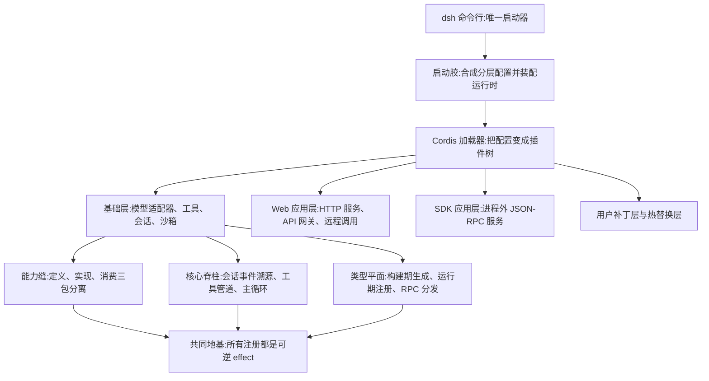
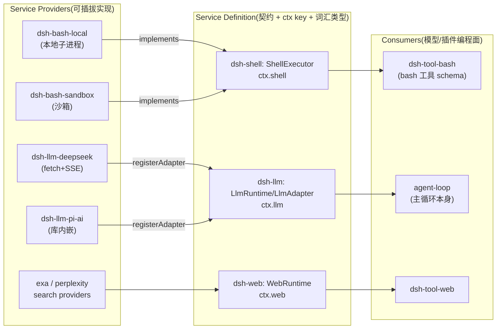
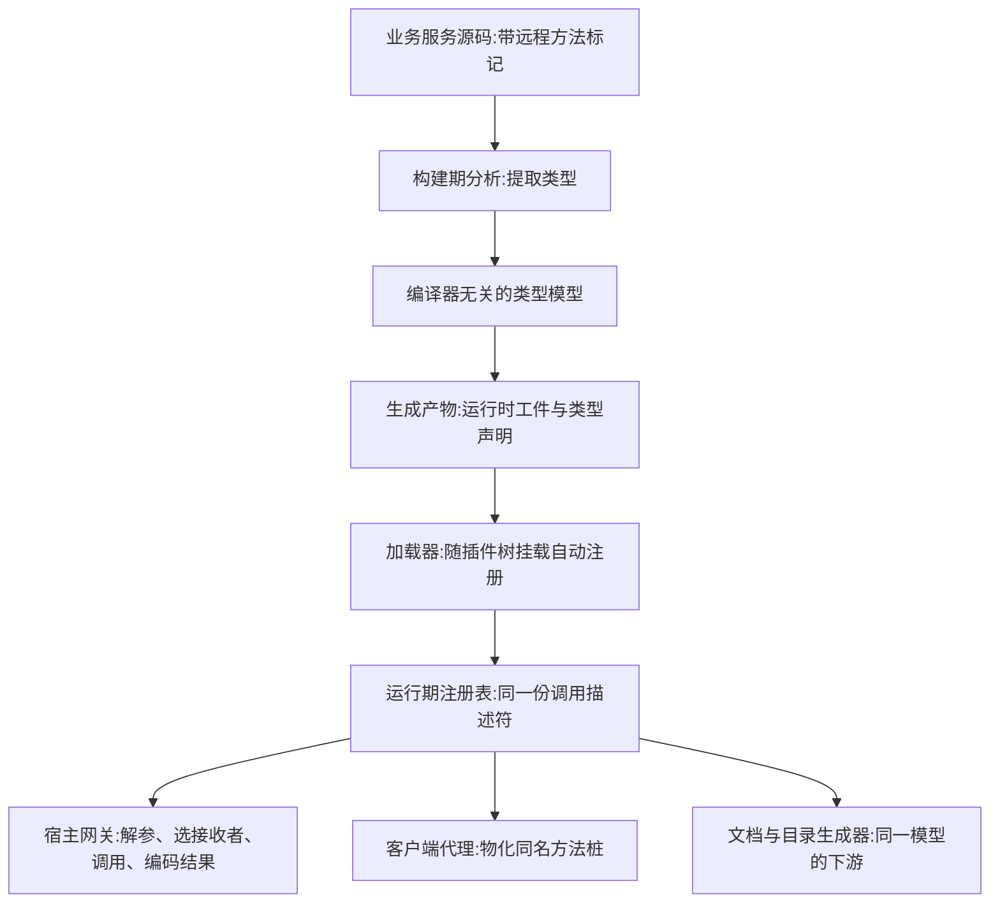

# 第十二章:程序架构及亮点(DeepSeek Harness 源码分析)

> 分析对象:[deepseek-ai/deepseek-harness](https://github.com/deepseek-ai/deepseek-harness) @ `dbbaa4a37`
> **深入阅读(函数级)**:[`plugin-system/`](./plugin-system/README.md) —— effect 逆序回收、invariant 伴随插件、四条真实能力缝对照、扩展点目录、postmortem 0001 复盘
> 分析依据:`docs/architecture.md`、`docs/cordis-primer.md`、`docs/glossary.md`、`packages/AGENTS.md`、`vendor/`(Cordis 源码内嵌副本)、`packages/{typert,llm,sdk,api}` 顶层源码,以及 `.agents/notes/implemented/architecture/` 下的官方决策记录(Agent Notes)

---

## 第〇节 一句话结论与总览

DeepSeek Harness(DSH)的程序架构是**"一切皆插件"的 Cordis 微内核**:模型适配器、工具注册表、会话日志乃至 agent 主循环本身,都是挂载在同一棵插件树上的普通插件(`docs/architecture.md:11`),没有任何"特权核心"可打补丁;所有注册都是**可逆 effect**,插件卸载(HMR 热替换)时按逆序自动回收(`docs/architecture.md:13`)。在此地基之上,DSH 沉淀出四个贯穿全仓的结构性亮点:

1. **能力缝(capability seam)三角色模式**:每个可替换能力被强制拆为 Service Definition / Service Provider / Consumer 三个角色(`docs/glossary.md:9`),使"换一个 provider 就换掉整个产品行为"成为配置层操作;
2. **LLM 抽象层**:provider 中立的 message/stream 词汇表 + `LlmAdapter` 抽象类 + waterfall 拦截事件 `llm/stream`,主循环不感知任何具体模型商;
3. **Typert 类型图**:把 TypeScript 编译期类型在构建时转成编译器无关的运行时模型,同时驱动 RPC 网关、Zod 校验、JSON Schema 投影与文档生成——类型是 API 的唯一真源;
4. **质量工程即架构**:per-file 100% 覆盖率门、无密钥 snapshot 回放、30+ 项 doc-sync 静态门、Agent Notes 即 RFC,把"文档与代码同步"从纪律变成编译错误。

先对齐四个词,这一节和后面各节都反复用到。**Cordis** 是 dsh 内嵌的插件框架(不是 npm 依赖,而是源码级 vendor 进仓库);**effect** 是一次可逆注册,插件卸载时按逆序自动回收;**HMR** 是模块热替换,改文件不重启就能换掉插件实现;**patch 层叠** 指 bundle、用户 profile、家目录、命令行各写一层配置,按顺序叠成一棵插件树的组合方式。

这张总览要分两半读。上半部分是"谁启动了谁":只有一条启动链——唯一启动器 → 启动胶 → Cordis 加载器 → 运行时插件树,树上的每一行(基础层、Web 应用层、SDK 应用层、用户补丁层)都是普通插件,包括模型适配器、工具、会话日志乃至主循环本身,没有任何一行是"特权内核"。下半部分是从同一条服务定位机制(`ctx.<key>` 加类型化事件)长出来的三根柱子:横向铺开的能力缝、纵向贯通的会话与主循环脊柱、以及支撑 RPC 与文档的类型平面。这几根柱子最后都汇到同一格,那一格是全章的地基:**所有注册都是可逆 effect**。


<details><summary>Mermaid 源码</summary>



</details>

| 阶段 | 做了什么 | 关键调用(文件:行) |
|---|---|---|
| 启动 | 唯一启动器解析命令行,按模式分发到 profile 启动路径 | `apps/cli/src/bin.ts:28-62` |
| 装配 | 启动胶合成分层配置,建上下文、装入 Cordis 加载器与宿主服务 | `packages/boot/app-boot/src/index.ts:787-834` |
| 建树 | 加载器读空根配置与各层 patch,合成出运行时插件树 | `vendor/include/src/index.ts:58-128` |
| 基础层 | `dsh-base` 挂载模型适配器、工具、会话日志、沙箱与设置等核心行 | `packages/bundle/base/cordis.patch.yml` |
| Web 应用层 | `dsh-web-app` 挂载 Web 启动服务、HTTP 服务与 API 网关 | `packages/bundle/web-app/cordis.patch.yml` |
| SDK 应用层 | `dsh-sdk-app` 在基础层之上挂 JSON-RPC 服务器 | `packages/sdk/README.md` |
| 用户补丁层 | 用户 patch 与 HMR 热替换层可覆盖或插入任意一行 | `docs/architecture.md:27-29` |
| 能力缝 | shell、fs、web、subagent 等能力按定义、实现、消费三个角色拆包 | `docs/glossary.md:9` |
| 核心脊柱 | 会话事件的追加日志、工具管道、主循环与适配器注册表 | `packages/core/README.md:26-38` |
| 类型平面 | 构建期把类型转成编译器无关模型,运行期注册并驱动 RPC 与文档 | `packages/typert/README.md:25-30` |
| 共同地基 | 一切注册走 `ctx.effect()`;事件用声明合并扩展,有五种派发语义 | `docs/architecture.md:13`、`vendor/cordis/src/events.ts:32` |

<details><summary>原图</summary>

```text
                cordis.yml / profile / bundle 分层组合(运行时插件树)
   +-----------------------------------------------------------------------+
   |  dsh CLI (唯一启动器, apps/cli)                                        |
   |    └─ boot/app-boot ──► Cordis Loader ──► 插件树(根 ctx)               |
   |        ├─ dsh-base      : llm-deepseek / tools / session / sandbox …   |
   |        ├─ dsh-web-app   : webserver + api-gateway + Typert remotes     |
   |        ├─ dsh-sdk-app   : JSON-RPC server(packages/sdk)               |
   |        └─ 用户 patch / HMR 热替换层                                     |
   +------------------------------+----------------------------------------+
                                  | ctx.<key> 服务定位 + 类型化事件
        +-------------------------+--------------------------+
        v                         v                          v
 +--------------+       +---------------------+      +------------------+
 | 能力缝(横向) |       | 核心脊柱(纵向)      |      | Typert(类型平面) |
 | shell/fs/web |       | ctx.sessions 事件溯源 |      | generator(构建)  |
 | subagent/…   |       | ctx.tools 管道       |      | registry(运行)   |
 | 定义/实现/   |       | ctx.agentLoop 主循环 |      | gateway(RPC 分发)|
 | 消费三包分离 |       | ctx.llm 适配器注册表 |      | SDK/文档唯一真源  |
 +--------------+       +---------------------+      +------------------+
        所有注册 = ctx.effect() 可逆 effect;事件经声明合并扩展,五种派发语义
```

</details>

---

## 第一节 "一切皆插件"的 Cordis 架构

### 1.1 内嵌框架:vendor/ 而非 npm 依赖

DSH 没有从 npm 依赖 Cordis,而是把 Cordis 及其基础库**源码内嵌**在 `vendor/` 下,统一重定名为 `@deepseek-ai/*` 作用域:`vendor/README.md:3` 明言动机是"the harness fully owns its framework layer (auditable, patchable, pinned)",清单(`vendor/README.md:13-23`)钉住每个包的上游 commit SHA。这不是简单的"锁版本":官方在 `vendor/README.md` 里记了 19 条**本地修改日志**(第 29–51 行),包括 `cordis/src/fiber.ts` 生命周期加固(重入处置、UNLOADING 期拒绝新建 effect)、Loader/Include 事务化配置对账、HMR 精确配置监视等——每一条都有覆盖测试。框架层的缺陷在 DSH 手里是"修源头"而不是"绕过去"。

### 1.2 注册即 effect:可逆性是加载语义,不是纪律

Cordis 的核心约定写在根 `AGENTS.md:106` 的公约里:"**Registrations are effects**: every contribution goes through `ctx.effect()` / `ctx.on()`; a registry's `register()` returns the disposer"。其实现位于 `vendor/cordis/src/fiber.ts:415`:

```typescript
// vendor/cordis/src/fiber.ts:415-422
effect(execute: () => SyncEffect, label?: string): Disposable<Promise<void>>
/** Same as above for async effects; the disposer is also awaitable. */
effect(execute: () => Effect, label?: string): AsyncDisposable<Promise<void>>
effect(execute: () => Effect, label = 'anonymous'): any {
  this.assertActive()
  if (this.state === FiberState.UNLOADING) {
    throw new CordisError('INACTIVE_EFFECT')
  }
```

- effect 体立即执行,产出的一组 disposer 被收集;fiber 卸载时**逆序**执行(`fiber.ts:431` `disposables.splice(0).reverse()`);
- 卸载(UNLOADING)进行中的 fiber 拒绝再注册新 effect(`fiber.ts:420-421`)——这是 vendor 本地加固之一,防止清理期注册逃逸出卸载快照(`vendor/README.md:38` 第 6 条);
- 两次调用 disposer 是幂等 no-op(`fiber.ts:427-428`)。

```typescript
// vendor/cordis/src/fiber.ts:427-431(disposer 幂等:disposing 置位后返回同一任务;splice(0).reverse() 逆序回收)
    const dispose = () => {
      if (disposing) return disposalTask
      disposing = true
      let task!: void | Promise<void>
      for (const disposable of disposables.splice(0).reverse()) {
```

由此,"插件的完整生命周期 = 其全部注册的反向回放",这在架构上消灭了"注册表残留"这一整类 bug。`packages/AGENTS.md:17` 把它落成测试要求:"Registry contributions prove disposal through the HMR-safety test: dispose the fiber and observe removal."

### 1.3 HMR 热替换:运行时重组插件树

`vendor/hmr/src/index.ts` 提供生产级插件热替换:变更文件被分类为 accepted/declined(`index.ts:339-343` 的规则:依赖者全 declined 或属 external 则 declined),插件入口文件是原子重载单元(`index.ts:407`);重载过程先 dispose 旧 fiber 再挂载新 fiber(`index.ts:502-525`),完成后广播 `hmr/reload` 事件(`index.ts:22, 547`)。配置侧同样热:`cordis.yml` 的补丁层经 Include 插件事务化对账——候选应用失败时回滚并恢复原插件/配置(`vendor/README.md:40` 第 8 条)。由于一切注册都是 effect,热替换天然安全:旧代的所有贡献在 dispose 时退干净,新代从空注册表重建。ship 的 `web` profile 默认开启 live patch reload(`docs/architecture.md:29`)。

```typescript
// vendor/hmr/src/index.ts:516-525(重载单元:先 dispose 旧 fiber,再挂载新 fiber)
        try {
          this.ctx.registry.delete(plugin)
        } catch (err) {
          this.ctx.logger.warn('failed to dispose plugin at %C', path)
          this.ctx.logger.warn(err)
        }

        try {
          reload(attempts[filename], runtime)
          this.ctx.logger.info('reload plugin at %C', path)
        // ...(略 526-543:挂载失败的 warn 与上抛,以及整批回滚 —— 重新注册被删除的旧插件)
```

### 1.4 声明合并扩展事件:类型安全的开放事件空间

事件名不靠中央枚举,而是靠 TypeScript **declaration merging** 分布式扩展。例:`packages/llm/llm/src/index.ts:54-75` 向 Cordis 的 `Context` 与 `Events` 接口合并 `llm` 服务键与 `llm/stream` 事件:

```typescript
// packages/llm/llm/src/index.ts:54-72(节选)
declare module '@deepseek-ai/cordis' {
  interface Context {
    llm: LlmRuntime
  }
  interface Events {
    /**
     * Waterfall around every streaming model call (retry, replay, routing).
     * ...
     * @mode waterfall
     */
    'llm/stream'(this: LlmRuntime, options: GenerateOptions, next: () => AsyncIterable<StreamChunk>): AsyncIterable<StreamChunk>
  }
}
```

任何包装本包的插件都获得强类型的 `ctx.llm` 与 `ctx.waterfall('llm/stream', …)` 补全;未挂载该服务时类型层面的注入声明(`inject: ['llm']`)又让 fiber 等待而非竞态启动(`docs/cordis-primer.md:11`)。持久化侧同理:`SessionEventMap`(`packages/core/session/src/types.ts:269`)是"merge-extensible, append-only source of truth",新增模型可见输入 = 向该映射合并新事件类型(根 AGENTS.md 公约:"a new model-visible input requires a session event")。

```typescript
// packages/core/session/src/types.ts:269-289(merge-extensible、append-only 的事件映射;节选)
export interface SessionEventMap {
  // ...(略 270-275:turn/start 的 JSDoc 契约)
  'turn/start': { turn: number }
  // ...(略 277-289:turn/end、step/start、step/end 等事件成员)
```

派发语义有五种且是事件公开契约的一部分(`vendor/cordis/src/events.ts:32`):

| 模式 | 语义 | 典型用途(源码证据) |
|---|---|---|
| `emit` | 异步广播,不等待 | `llm/adapters-updated` 注册表变更通知(`llm/src/types.ts:23`) |
| `waterfall` | around-中间件,必须 `next()` 委托 | `llm/stream`(`llm/src/index.ts:72`)、`tools/pre-execute` |
| `parallel` | 并发等待全部 | `hmr/config-update-failed`(`vendor/README.md:41`) |
| `serial` | 顺序等待,可 bail | `agent/turn-stopping`(`docs/architecture.md:105`) |
| `bail` | 同步短路 | `internal/listener`(`events.ts:296`) |

waterfall 的关键陷阱被写成仓库级红线:"Waterfall listeners MUST call `next()` to delegate; returning without it short-circuits the chain"(根 AGENTS.md;语义见 `docs/cordis-primer.md:31`)。

```typescript
// vendor/cordis/src/events.ts:24-32(五种派发语义是事件公开契约的一部分)
/**
 * Event dispatch strategy used by the event service.
 *
 * `emit` runs synchronous listeners without awaiting them, `parallel` awaits
 * all listeners together, `serial` awaits them in order until one bails,
 * `bail` stops on the first synchronous bail value, and `waterfall` composes
 * listeners around a final `next` callback.
 */
export type DispatchMode = 'emit' | 'parallel' | 'serial' | 'bail' | 'waterfall'
```

### 1.5 组合而非继承:profile / bundle / patch

一个运行中的 `dsh` 是从有序层组合出的插件树:bundle(dsh-base 等)是"config 行 + 代码"的分发格式,profile 叠加若干 bundle,再被 profile 级/家目录级/`--patch` 级 `cordis.patch.yml` 按行 id 整行替换或插入(`docs/architecture.md:17-27`)。`dsh --profile web --dump-config` 打印的每一行都可被用户补丁替换(`docs/architecture.md:34-37`)——**可替换性下沉到了发布物层面**,而非仅限源码贡献者。

```typescript
// vendor/include/src/index.ts:96-103(insert 的行立即入索引:同表靠后的 patch 可配置/禁用前一条 patch 插入的行)
      // Index what this patch added so a LATER patch in the same list can
      // target it. Patch lists compose one layer per source (each bundle
      // layer, then the user's, then `--patch` overlays), and a layer must be
      // able to configure or disable a row an earlier layer inserted; without
      // this, inserted rows were silently unpatchable.
      buildMap(insert)
      continue
    }
```

---

## 第二节 能力缝(capability seam)三角色模式

### 2.1 定义:seam 指三角色全体,不是接口

术语的权威定义在 `docs/glossary.md:9`:

> **seam** — a *swappable capability* with three roles: a **Service Definition**(the Cordis `Service` that owns its `ctx.<key>` and vocabulary types — an abstract class … or a concrete registry …, never a TypeScript `interface`), one or more **Service Providers**, and one or more **Consumers**.

决策记录在 Agent Note `.agents/notes/implemented/architecture/2026-06-13-capability-seams.md`(以下简称 capability-seams 笔记):问题是一个能力的**契约、实现、消费面三者变化速率不同**,合在一个包里会导致"换一个沙箱执行器"也扰动模型可见的 tool schema(笔记:9)。拆分的收益直接写在结论里:"a sandboxed executor replaces `dsh-bash-local` without touching a tool schema"(笔记:23)。

### 2.2 三角色关系图与实例


<details><summary>Mermaid 源码</summary>



</details>

- **Shell 缝(canonical 例子,glossary.md:9)**:`dsh-shell` 定义抽象执行器与词汇类型;`dsh-bash-local` / `dsh-bash-sandbox` 是实现;`dsh-tool-bash` 是面向模型的 Consumer。Filesystem 与 subprocess provider 共享"一个执行世界",指向远程沙箱时 Bash、PTY、LSP 整体迁移而无需 provider 分叉(`docs/architecture.md:129`)。

```typescript
// packages/shell/shell/src/index.ts:64-100(三角色之一:Service Definition —— 抽象执行器,占有 ctx.shell)
export abstract class ShellExecutor extends Service {
  constructor(ctx: Context) {
    super(ctx, 'shell')
  }
  // ...(略 69-83:sandboxMode getter,默认 undefined 表示不沙箱)
  abstract resolve(request: ShellExecRequest): ShellExecSpec
  // ...(略 86-91:run 的 JSDoc —— 非零退出、超时、中止都 resolve 为描述性结果)
  abstract run(spec: ShellExecSpec): Promise<ShellRunResult>
  // ...(略 94-98:start 的 JSDoc —— 立即返回进程句柄)
  abstract start(spec: ShellExecSpec): ShellProcess
}
```

```typescript
// packages/shell/bash-local/src/index.ts:102-112(三角色之二:Service Provider —— 本地子进程实现,自带 Config)
export class LocalBashExecutor extends ShellExecutor {
  static inject = ['subprocess']

  static Config: z<Config> = z.object({
    cwd: z.string(),
    // ...(略 108-111:maxTimeoutMs / maxOutputBytes / maxSpillBytes / graceMs —— 类其余成员见 114 行起)
  })
```

```typescript
// packages/shell/tool-bash/src/index.ts:29-30,379-383(三角色之三:Consumer —— 模型可见的 bash 工具,只经 ctx.shell 执行)
export const name = 'tool-bash'
export const inject = ['tools', 'shell', 'systemPrompt', 'shellEnv']
// ...(略 32-378:工具 schema、presenter 与 run_in_background 分支)
      const result = await ctx.shell.run(ctx.shell.resolve({
        ...request,
        signal: exec.signal,
      }))
      if (result.aborted) {
```

- **LLM 缝是刻意折叠的变体**:Service Definition 与 Consumer 合在 `dsh-llm` 内,因为这里的 Consumer 是主循环本身而非可替换的 schema 面(capability-seams 笔记:25);provider 仍是独立包。
- **合并是例外而非默认**:笔记明确"Don't split preemptively — a capability with one conceivable provider and one Consumer stays one package until a second appears"(笔记:25)。

### 2.3 三角色为何是"模式"而非建议

仓库把它落成可执行约束:

- **Consumer 不得 import provider 专有类型**(capability-seams 笔记:19);`packages/AGENTS.md:10` 反向约束 Service Definition:"Design Service Definitions for all current Consumers … do not let one Consumer dictate the service contract",并给出反向气味:"a public service method with one internal caller — pass a private capability closure instead"。
- **Cordis 的 `inject` 机制只回答运行时供需,不回答包边界**;seam 模式补齐后者(笔记:11)。这就是"能力缝"与普通"服务注入"的分界线,也是 `docs/architecture.md:127` 强调的:"adding a capability means designing all three"。

---

## 第三节 LLM 抽象层与 provider 插拔

### 3.1 词汇表归 DSH,翻译归 adapter

`packages/llm/llm/src/types.ts` 定义 provider 中立的 message/stream 词汇:`TextBlock`/`ReasoningBlock`/`ImageBlock`/`FileBlock`/`ToolCallBlock` 等封闭联合(types.ts:54-98),文件头注释(types.ts:1-5)写明分工:"Adapters alone translate provider wire messages"。`FileBlock` 刻意永不直达 provider——请求装配时投影为确定性句柄文本,durable log 保留结构化引用(types.ts:77-88)。

### 3.2 LlmAdapter:一个抽象方法,一代际绑定

全仓的 provider 插拔点是 `LlmAdapter`(packages/llm/llm/src/index.ts:200),它只要求子类实现一个方法 `stream`(:281):

```typescript
// packages/llm/llm/src/index.ts:269-281(节选)
async prepareCall(provider: string, model: string, signal?: AbortSignal): Promise<PreparedAdapterCall> {
  return {
    model: await this.resolveModel(provider, model, signal),
    stream: options => this.stream(options),
  }
}

/** Stream one model call as raw chunks. The only required method. */
abstract stream(options: GenerateOptions): AsyncIterable<StreamChunk>
```

`prepareCall`(index.ts:269)把"模型元数据解析"与"请求派发"绑到**同一代际**:"settings changes between preparation and dispatch cannot combine one generation's capabilities with another's endpoint"(index.ts:261-263)——动态 provider 的配置变更永远不会造成"旧能力 + 新端点"的混合请求。这是防御性并发思想在 LLM 层的落地(见第六节)。

### 3.3 注册表:原子替换 + effect 处置

`LlmRuntime.registerAdapter`(`index.ts:387`)是全仓注册模式的样板:

```typescript
// packages/llm/llm/src/index.ts:394-403
const dispose = this.ctx.effect(function* (this: LlmRuntime) {
  if (providers.length === 0) throw new LlmError('an adapter must register at least one provider', 'INVALID_ADAPTER')
  this.commitRoutes(owned, this.prepareRoutes(providers, adapter, owned))
  yield () => {
    released = true
    for (const provider of owned) this.adapters.delete(provider)
    owned.clear()
    this.emitAdaptersUpdated()
  }
}.bind(this), 'llm.registerAdapter()')
```

- 注册体在 effect 内执行,fiber 卸载(HMR)时路由全量释放并广播 `llm/adapters-updated`;
- 候选路由集**先整体验证**(`prepareRoutes`,index.ts:423:"Nothing is mutated: a rejected candidate leaves the registry exactly as it was"),再在一个同步区段内完成交换(`commitRoutes`,index.ts:454-462)——任何请求都不可能观察到"注册到一半"的空窗;
- 重复 provider 整批拒绝(`DUPLICATE_ADAPTER`,index.ts:428-429),all-or-nothing。

```typescript
// packages/llm/llm/src/index.ts:454-462(一条同步区段内完成清除+重设,任何请求都看不到"注册到一半"的空窗)
  private commitRoutes(owned: Set<string>, registrations: readonly AdapterRegistration[]): void {
    for (const provider of owned) this.adapters.delete(provider)
    owned.clear()
    for (const registration of registrations) {
      this.adapters.set(registration.provider.id, registration)
      owned.add(registration.provider.id)
    }
    this.emitAdaptersUpdated()
  }
```

### 3.4 拦截面:llm/stream waterfall

每次流式调用都经 `llm/stream` waterfall(`index.ts:60-72`),重试、回放(replay)、路由插件以中间件形态挂载,不碰主循环。Loop 构造的请求深冻结到达("mutation throws"),因为请求内容是会话日志的纯函数(可重构性不变式,见第五节);监听器只读不改写(index.ts:64-67 的 JSDoc)。

### 3.5 provider 实例:DeepSeek 直连适配器

`packages/llm/llm-deepseek/src/adapter.ts:1-6`:`DeepSeekAdapter` 是"fetch + SSE against a DeepSeek (OpenAI-compatible) chat-completions endpoint",且刻意做成 **transport-only**——连接事实经 thunk 每次操作解析一次、bearer token 经每请求 resolver 提供,"so the registering plugin owns validation, layering, and credential policy"。`resolveAdapterOptions` 是唯一的显式 resolve 步骤,"re-reads it per operation, which is what makes a configuration change reach the next request without re-registration"(adapter.ts:76-80)。这正对应根 AGENTS.md 的公约:"Explicit > implicit at package boundaries: defaulting is an explicit `resolve(request): Spec` step"。

---

## 第四节 Typert 类型图:编译期类型 → 运行期唯一真源

### 4.1 要解决的问题

Web Client / SDK / 文档生成需要 Host 侧服务的类型、Zod schema 与 RPC 描述符;手写则需要在每个业务服务旁维护"中央 API 接口、路由表、参数转换表、client stub、Zod schema"五份副本——Agent Note `.agents/notes/implemented/architecture/2026-08-02-typert-remote-method-calls.md:13` 明确拒绝这条路:"The contract for a direct method call belongs to the business Service that implements it."

### 4.2 四包数据流

四个包的分工写得很干脆(`packages/typert/README.md:25-30`):

| 包 | 角色 |
|---|---|
| `generator/` | 构建期分析源码类型,产出反射、Zod schema、Remote 描述符 |
| `loader/` | 在 Loader 组合中把生成的 artifact 自动注册进运行时注册表 |
| `protocol/` | Host/Client 共享的 `@Remote` 装饰器、wire 描述符、codec |
| `registry/` | 运行时存储(`ctx.typert`),供查询与解析 |

这条链路要按"时间轴 + 消费面"两段看。时间轴那段:类型信息只在构建期算一次——业务源码里的 `@Remote` 方法先被分析成编译器无关的模型,再由发射器写成运行时工件与类型声明;消费面那段:工件在插件树挂载时被注册进运行期注册表,之后宿主网关、客户端代理、文档生成器各自取用同一份调用描述符。收益是"RPC 描述符或文档另写一份"在结构上不可能发生,代价是生成失败即构建失败,不会把类型悄悄弱化。


<details><summary>Mermaid 源码</summary>



</details>

| 阶段 | 做了什么 | 关键调用(文件:行) |
|---|---|---|
| 标记 | 业务服务继承远程服务基类,需要暴露的方法加 `@Remote` | `packages/llm/llm/src/index.ts:333`、`:468-469` |
| 分析 | 构建期分析源码类型,产出反射、Zod schema 与远程描述符 | `packages/typert/README.md:25-30` |
| 隔离带 | 提取与发射通过编译器无关模型解耦,发射器只消费模型、不接触编译器节点 | `packages/typert/generator/README.md:66` |
| 失败面 | 声明缺失即构建失败;无法无损投影时点名具体构造,而不是把类型扁平化 | `packages/typert/generator/README.md:44` |
| 产物落地 | 生成 `lib/typert.host.js` 与 `.d.ts`,以及 `/remote` 投影 | `packages/typert/README.md:25-30` |
| 自动注册 | 加载器跟随条目生命周期,标脏条目并用微任务合并同一轮变动 | `packages/typert/loader/src/index.ts:411-422` |
| 原子提交 | 先整批校验,再在 effect 内提交;撤销时比对 owner 身份而不是按 key 删 | `packages/typert/registry/src/service.ts:499-520` |
| 宿主分发 | 网关解参、解析接收者、调用、编码结果,不依赖任何业务实现 | `packages/api/gateway/src/index.ts:1-6` |
| 客户端 | 客户端消费同一份本地生成的调用描述符,物化命名空间方法桩 | `2026-08-02-typert-remote-method-calls.md:23` |
| 文档 | 同一模型驱动目录文档与静态 API 目录,工具侧不给运行期加 `ctx.typert` 依赖 | `2026-07-27-compiler-independent-typert-model.md:27` |

<details><summary>原图</summary>

```text
 业务 Service 源码(TypertRemoteService + @Remote 方法)
        │  构建期(never in a live agent session,generator/README.md:12)
        ▼
 dsh-typert-generator: WorkspaceAnalyzer ──► FaceModel/TypeGraph
        │  编译器无关模型(extraction 与 emission 解耦,
        │  emitter 只消费 model、永不接触 compiler nodes,README.md:66)
        ▼
 lib/typert.host.js + .d.ts + /remote 投影(.d.ts/.d.ts.map/.js)
        │  Loader 组合挂载时
        ▼
 dsh-typert-loader ──► ctx.typert(dsh-typert-registry,原子注册、fiber 作用域)
        │
        ├─► dsh-api-gateway Host 面 ctx.typertGateway:解参→解析接收者→调用→编码结果
        ├─► Client 面 ctx.remote:同一份 InvocationDescriptor 物化命名空间 stub
        └─► 文档/目录生成器(cordis-catalog.ts、toJSONSchema → JSON Schema)
```

</details>

两个关键设计:

- **编译器无关模型是隔离带**:`generator/README.md:66`:"extraction and emission are decoupled through the compiler-independent model … `FaceModelEmitter` consumes only that model and never receives compiler nodes"。模型保留声明同一性、泛型、显式继承、条件/映射类型、JSDoc,排除构造器与非公开成员。生成失败即构建失败:"The generator fails the build when a declaration is missing … unsupported Zod projections fail with a `TypertEmitError` naming the construct instead of flattening or weakening the source type"(`generator/README.md:44`)。
- **描述符不上网络**:Host gateway 与 Client remote 各自消费同一份本地生成的 `InvocationDescriptor`,"descriptors are not sent over the wire"(typert-remote 笔记:23);`.d.ts.map` 还把 consumer API 方法导航回 Host 业务实现(笔记:21)。

```yaml
# packages/bundle/base/cordis.patch.yml:39-46(dsh-base 里 Typert 链的三行:注册表 / 加载器 / 网关)
    - id: typert
      name: '@deepseek-ai/dsh-typert-registry'

    - id: typert-loader
      name: '@deepseek-ai/dsh-typert-loader'

    - id: typert-gateway
      name: '@deepseek-ai/dsh-api-gateway'
```

```typescript
// packages/typert/loader/src/index.ts:411-422(跟随 Loader entry 生命周期:标脏 entry,queueMicrotask 合并同一轮变动)
  ctx.on('internal/plugin', (fiber) => {
    const entryName = fiber.entry?.options.name
    if (entryName === undefined) return
    dirty.add(entryName)
    if (flushQueued) return
    flushQueued = true
    queueMicrotask(() => {
      flushQueued = false
      if (!active) return
      for (const task of flush((err) => { ctx.logger.error(err) })) void task
    })
  })
```

### 4.3 落地形态:业务侧零样板

业务服务继承 `TypertRemoteService` 并用 `@Remote` 标记方法即可(笔记:19);`llm` 包自身即是范例——`LlmRuntime extends TypertRemoteService`(`llm/src/index.ts:333`),`listProviders()` 上直接挂着 `@Remote` 装饰器(`llm/src/index.ts:468-469`)。Gateway(`packages/api/gateway/src/index.ts:1-6`)则是纯分发器:"Live Typert Remote dispatch over Cordis Services and registered providers",Host gateway 不依赖 `ctx.agents`/`ctx.sessions` 的任何具体实现(typert-remote 笔记:41)。

```typescript
// packages/typert/registry/src/service.ts:499-520(原子注册:先整批校验,再在 ctx.effect 内提交,撤销时比对 owner)
  register(contribution: TypertContribution): TypertDisposer {
    const packageRecord = this.validatePackage(contribution)
    const schemaRecords = this.validateSchemas(contribution)
    const invocations = contribution.invocations
    this.localStore.validate(invocations)
    const owner = {}
    const { schemas, packages, localStore } = this
    return this.ctx.effect(function* () {
      packages.set(packageRecord.key, packageRecord)
      for (const record of schemaRecords) schemas.set(record.key, record)
      localStore.commit(owner, invocations)
      // ...(略 510-518:yield 的 disposer —— 仅当条目仍是本 effect 的那一份时才删除,并 localStore.withdraw(owner, invocations))
    }, 'typert.register()')
  }
```

### 4.4 与 SDK 的衔接

进程内用 Typert,跨进程用 JSON-RPC:`packages/sdk/protocol/src/index.ts:1-9` 定义"newline-delimited JSON-RPC stdio transport plus the named request, result, and notification types both wire ends speak";`packages/sdk/server/src/server.ts:1-3` 的服务端插件直接消费 Cordis 上下文("The surrounding context owns plugins, persistence, and configured adapters")。TypeScript 与 Python 两个 SDK 都投影同一主循环,且被测试纪律强制同步(根 AGENTS.md:"Both SDKs project the loop")。

### 4.5 文档与自省:同一模型的下游,而非另写一遍

`packages/typert/generator/README.md:12` 声明生成"runs only at build time and never in a live agent session";而同一份模型还驱动文档与自省。编译器无关模型的决策记录 `.agents/notes/implemented/architecture/2026-07-27-compiler-independent-typert-model.md:27`:

> At build time, `CordisCatalogProjector` consumes the analyzed `FaceModel` and `TypeGraph` once to generate `docs/cordis-catalog/events.md`, `docs/cordis-catalog/services.md`, and the static `SERVICE_API`, `EVENT_API`, and `TYPE_API` catalog committed for `tool-cordis`. `tool-cordis` reads that static catalog and has no runtime dependency on `ctx.typert`.

三点由此确立:(1) 文档目录与 RPC 描述符、Zod codec 同源,**"文档是另一份手写副本"在结构上不可能发生**;(2) 自省工具读静态目录,不给运行期引入 `ctx.typert` 依赖;(3) 运行期注册是独立路径——`dsh-typert-loader` 跟随 Loader entry 生命周期导入 `./typert` 工件并注册(同 note `:27`),两条路径互不供给。

> **路径订正**:上面引文中的 `docs/cordis-catalog/*.md` 是该 note 写作时的命名;当前生成器 `scripts/gen-cordis-catalog.ts:44-46` 的实际产出物为 `docs/subsystems/`、`docs/cordis-api/inherited.md` 与 `packages/extensions/tool-cordis/src/api-catalog.ts`(目录页另有 `docs/cordis-api/{context,events,fiber,registry,service}.md`)。结论不变:文档目录与运行期目录同源、由 `pnpm run gen-cordis-catalog` 生成并被 `verify-cordis-catalog` 新鲜度门控(`scripts/run-gates.ts:734`)。

同一 note 的 `:15` 划出模型的所有权边界:Host/Client 各自构建 `ts.Program`,但 compiler node/symbol/checker **只作提取工具**,分析结束后所有消费者只读 `WorkspaceModel`/`FaceModel`/`TypeGraph`,模型里不保留任何 AST 或 checker 对象;`:17` 定下硬度标准:可达类型无法无损表示即分析失败,发射器遇到已建模但无法处理的节点必须失败,**不得把类型扁平化或退化成 `unknown`**。这与 `generator/README.md:44` 的发布侧失败面(`TYPERT` 声明缺失、指向错误文件、无 Remote 方法却发布 Remote 工件)合成一条完整的"要么全对、要么构建红"链。

---

## 第五节 测试与质量工程体系

DSH 的质量体系不是 CI 附属品,而是架构决策的一部分。`docs/testing.md` 定义七个层级,其中四个构成"非人审"硬门:

### 5.1 per-file 100% 覆盖率门

`pnpm run test:coverage` 是 CI 门:**per-file 100% on `packages/*/*/src`**(`docs/testing.md:10`)。其哲学同样写在原文:"An uncovered line is often dead code the gate flags for deletion, not a missing test to bolt on"——覆盖率被用作**删代码的雷达**,而非补测试的鞭子;同时声明"Line coverage is necessary, never sufficient"。每个注册表必须配 HMR-safety 测试(dispose fiber 后断言回收,testing.md:9;packages/AGENTS.md:17)。

### 5.2 无密钥 snapshot 回放:模型行为的版本控制

`pnpm run test:snapshot`(`docs/testing.md:14`):录制的真实会话(父代 `session[.vN].jsonl` + 子代 `session.<ordinal>.jsonl`)经 ship 的 profile(headless / SDK / ACP / Web)**无密钥回放**,模型输出被录制流替换,整条管线——会话日志、持久化、投影、SDK 输出——与录制时的期望逐字节比较。纪律:"Every non-trivial model-, protocol-, or human-visible change adds or updates a keyless recorded-session scenario in the same PR"(`testing.md:53-55`);Web 侧由 Chromium 浏览器 snapshot 门兜底(`testing.md:15`,CI 强制只读 `DSH_SNAPSHOT=replay`)。这把"模型可见输出"从不可复现的黑盒变成可 code review 的 diff。

### 5.3 真入口路径与"验证世界,不自报"

- 产品可见插件必须有经 Loader + app/进程启动的 REAL-composition 测试,"Hand-built `ctx.plugin(...)` suites are insufficient"(`testing.md:39`;packages/AGENTS.md:7)。
- e2e 断言重跑命令、外部重读文件;"a keyword probe on the agent's own output lets a cheating agent pass"(`testing.md:33-35`)。
- 只 mock 昂贵/非确定性边界(LLM adapter、网络、时钟),下游全真(`testing.md:27-29`)。
- 真实 API 测试不限量:"We are DeepSeek — do not ration real-API tests"(`testing.md:23-25`),无密钥时自我跳过保持 CI 绿。

### 5.4 doc-sync:30+ 项文档静态门

`pnpm run doc-sync` 的叶子门清单在 `scripts/run-gates.ts:715-770` 的 `docSyncLeafGates()`:`doc-typecheck`(文档中 `ts` 代码块必须编译)、`verify-type-equiv`(文档粘贴的类型与源码逐字等价)、`verify-md-links`、`verify-mermaid`、`verify-cordis-catalog`/`verify-tool-catalog`/`verify-config-catalog`/`verify-persistence-catalog`(目录类文档由生成器产出、新鲜度门控)、`verify-export-jsdoc`、`verify-agent-note-format`、`verify-doc-budgets`(每篇文档有字数预算上限)等 30 余项。**文档漂移在 DSH 是编译错误**,这是"文档即真源"得以成立的机械保障。

```typescript
// scripts/run-gates.ts:730-741(docSyncLeafGates() 的叶子门清单节选:每项都是一个 pnpmScript 叶子门)
    pnpmScript('docs-site-build', options.docsBuildScript ?? 'docs:build', { label: 'documentation build' }),
    pnpmScript('doc-graphs', 'verify-doc-graphs', { label: 'doc graphs' }),
    pnpmScript('markdown-links', 'verify-md-links', { label: 'markdown links', quick: true }),
    pnpmScript('type-equivalence', 'verify-type-equiv', { label: 'type equivalence', quick: true }),
    pnpmScript('cordis-catalog', 'verify-cordis-catalog', { label: 'cordis catalog' }),
    pnpmScript('cordis-inspect-catalog', 'verify-cordis-inspect-catalog', { label: 'Cordis inspect catalog' }),
    pnpmScript('mermaid', 'verify-mermaid'),
    pnpmScript('scoped-events', 'verify-scoped-events', { label: 'scoped events' }),
    pnpmScript('translation-pairing', 'verify-translation-pairing', { label: 'translation pairing', quick: true }),
    pnpmScript('markdown-wrap', 'verify-md-wrap', { label: 'markdown wrap', quick: true }),
    pnpmScript('client-catalog', 'verify-client-catalog', { label: 'client catalog' }),
    // ...(略 741-767:export-jsdoc / tool-catalog / config-catalog / persistence-catalog / agent-note-format / doc-budgets 等其余叶子门)
```

### 5.5 Agent Notes 即 RFC

每个非平凡变更必须在同 PR 携带 Agent Note(根 AGENTS.md:"Non-trivial changes MUST include an Agent Note in the same PR"),`verify-agent-note-format` 门控其结构。`.agents/notes/implemented/architecture/` 现存 80+ 篇已实施决策,本章引用过的三篇即代表三种粒度:

| 笔记 | 决策类型 |
|---|---|
| `2026-06-13-capability-seams.md` | 包边界模式(三角色) |
| `2026-08-10-session-log-version-mechanism.md` | 持久化兼容策略(单整数版本 + 相邻升级链 + per-event `ignorable`) |
| `2026-08-02-typert-remote-method-calls.md` | 子系统设计(Typert Remote 调用) |

以 session-log 笔记为例,其决策密度可见一斑:单一单调整数、不设 major/minor(笔记:13);"The writer decides bumps, not the reader",且"parses without error is not the bar: silently skipping content that shapes reconstruction is a wrong read"(笔记:15);未知事件默认**拒绝**解释日志,除非事件信封携带 `ignorable: true`——默认值的选择按失败模式论证:"forgetting the marker over-refuses a resumable session (an inconvenience), while a default of ignorable would make the same mistake silently resume a gutted one (a safety failure)"(笔记:19)。相邻迁移链永不重命名/替换/删除已提交代(`docs/architecture.md:119`;`2026-08-31-released-session-format-migrations.md`)。

---

## 第六节 防御性并发与生命周期模式

`docs/defensive-patterns.md` 开头说明:每条规则都来自"actually shipped or nearly shipped here"的缺陷类别。架构层面的三条主线:

### 6.1 一个异步操作 = 一个生命周期控制器

`packages/AGENTS.md:9`:"Represent one asynchronous operation with one lifecycle controller or transaction. Separate readiness, cancellation, disposal, reservation, or sentinel state requires an independent owner or settlement point; otherwise fold it while preserving rollback, callback containment, and **quiescence**."Cordis fiber 的 effect 机制(第一节)是该原则的地基;LLM 层的 `prepareCall` 代际绑定(第三节)是其应用。

### 6.2 dispose 必须到达 quiescence,而非发出请求

`docs/defensive-patterns.md:19-21`:"A teardown that issues kills/aborts but returns before the work stops leaves orphans."范例是 MCP 连接监管器 `packages/mcp/mcp-client/src/connection.ts`(详见第六章):

```typescript
// connection.ts:327-349(节选)
async dispose(): Promise<void> {
  disposed = true
  if (reconnectTimer !== undefined) { clearTimeout(reconnectTimer); reconnectTimer = undefined }
  const current = client
  const currentClosed = clientClosed
  client = undefined
  clientClosed = undefined
  if (current !== undefined) {
    try { await current.close() } catch { /* transport already gone */ }
    if (currentClosed !== undefined && !await waitForClose(currentClosed)) { … }
  }
  // Quiesce, don't just request it: …
  await settling
  await syncChain
  for (const dispose of disposers.values()) dispose()
  disposers = new Map()
}
```

清定时器 → close 当前代并等 close 屏障 → `await settling`(在途连接尝试)→ `await syncChain`(排队同步)→ 最后注销工具。顺序保证注销时 `disposers` 已是终态。

### 6.3 代际模型 + 串行化交换 + 关闭屏障超时

同一文件展示了三件套的通用写法:

- **代际守卫**:`isCurrent = (generation) => !disposed && client === generation`(connection.ts:152-153)——旧代的回调(竞态 close/error、迟到通知)一律幂等空转,"One disconnect decision per generation"(connection.ts:172);
- **串行化同步**:`syncChain` 把初始同步与通知重同步压成一条 promise 链,"so two syncs can never interleave their dispose-previous/register-next swap (which would double-dispose one generation and leak another)"(connection.ts:156-161);
- **失败关闭**:`GENERATION_CLOSE_TIMEOUT_MS = 5_000`(connection.ts:50),旧代未在窗口内证明退出则**停止重连**而非让子进程重叠(connection.ts:288-293)——"timing out fails closed instead of overlapping children"(connection.ts:47-49)。

其余模式在 `defensive-patterns.md` 逐条可查:独立事实独立上报(不把一个 flag 嵌进另一个分支,防止把被截断的运行读成干净成功,§1);回调异常在派发器内收容(一个坏 listener 不得饿死其后 listener,§5);不向不可信输出递环境变量与可预测路径(§6);symlink 形路径用 unlink 语义删除(§7)。

### 6.4 同一套模式是仓库通用语言,不是 MCP 专属

- **owner 身份校验**:Typert 运行期注册表撤销贡献时比对 owner 身份,而不是按 key 删除——注册表在提交前就整批拒绝重复条目,因此撤销只能移除自己提交的那一份(`packages/typert/registry/src/service.ts:150-163`,提交见 `:499-519`)。
- **回调异常在派发器内收容**:`ChangeSource.emit` 逐个 listener `try/catch` 并上报,"a throwing listener is logged and does not stop later listeners"(`packages/typert/registry/src/service.ts:96-104`;`packages/typert/registry/README.md:71`)。
- **微任务合并 + 幂等脏集合**:`dsh-typert-loader` 订阅 `internal/plugin` 标记脏 entry,用 `queueMicrotask` 合并同一轮内的多次变动,并靠 Set 幂等吸收"先订阅后播种"的重叠(`packages/typert/loader/src/index.ts:411-422`)。
- **工件进运行期要逐字段校验**:`validateTypertManifest` 把构建产物当不可信输入逐字段检查——`TYPERT` 清单必须自述所属包、`face` 必须为 `host`、schema 必须是 zod v4 实例、invocation codec 必须 `mode: 'strict'`(`packages/typert/loader/src/index.ts:83-142`、`:264-276`)。这正是根 `AGENTS.md` "Trust TypeScript at typed same-process boundaries" 所列需要运行期校验的边界之一:模块/文件边界。

```typescript
// packages/typert/loader/src/index.ts:84-95(validateTypertManifest:把构建产物当不可信输入逐字段校验)
  if (typeof exported !== 'object' || exported === null) {
    throw new Error(`typert-loader: ${pkgName} exports "${TYPERT_HOST_EXPORT}" but its module has no TYPERT manifest object`)
  }
  const manifest = exported as Record<string, unknown>
  if (manifest.package !== pkgName) {
    throw new Error(
      `typert-loader: ${pkgName} TYPERT manifest names package ${JSON.stringify(manifest.package)} — the manifest must be owned by the package that exports it`,
    )
  }
  if (manifest.face !== 'host') {
    throw new Error(`typert-loader: ${pkgName} exports "${TYPERT_HOST_EXPORT}" but TYPERT.face is not "host"`)
  }
```

*(上为 `validateTypertManifest` 的主体,函数签名在源文件 83 行;zod v4 实例校验见 `:105-107`,严格 codec 校验见 `:264-276`。)*

---

## 第七节 与传统架构(单体 loop 内嵌能力)的对比

典型 Agent 框架(以及多数 LLM 应用脚手架)的形态是:一个主循环类内嵌模型调用、工具表、提示词拼装与持久化,扩展靠子类化或 monkey-patch。DSH 的差异是结构性的:

| 维度 | 单体 loop 内嵌能力 | DSH(Cordis 微内核 + 能力缝) |
|---|---|---|
| 扩展点 | 子类钩子 / 源码补丁 | 挂载并列插件;"There is no privileged core to patch"(`docs/architecture.md:13`) |
| 注册生命周期 | 手动成对 add/remove,泄漏常态 | 注册即 effect,卸载逆序自动回收(`fiber.ts:431`),HMR 测试强制证明(`packages/AGENTS.md:17`) |
| 能力替换 | fork provider 或改循环 | 替换 Service Provider 包,Consumer 与 schema 不动(capability-seams 笔记:23) |
| 事件/拦截 | 字符串事件或回调数组,语义模糊 | 声明合并强类型事件,五种派发语义是公开契约(`events.ts:32`);waterfall 必须 `next()` |
| 模型适配 | 每 provider 一条 if 分支进循环 | `LlmAdapter` 单抽象方法 + 原子路由注册(`llm/src/index.ts:281,387`) |
| API/SDK/文档 | 三份手写副本,漂移无声 | Typert 单真源生成,漂移即构建失败(`generator/README.md:44`) |
| 配置组合 | 启动 flag 与 if 树 | profile/bundle/patch 分层,发布物每一行可补丁替换(`docs/architecture.md:27-37`) |
| 兼容策略 | 读写器版本纠缠 | 写者决定 bump、读者按方向拒绝/迁移,未知事件默认拒读(session-log 笔记:15-19) |
| 质量保障 | 抽样单测 | per-file 100% 门 + 无密钥 snapshot 回放 + 30+ doc-sync 门(`testing.md`、`run-gates.ts:715`) |

代价也真实存在:包数量与样板(`package.json`/tsconfig/README/注入接线)显著增加(capability-seams 笔记:36 "Separating roles adds packages and boilerplate"),且 `vendor/` 内嵌框架意味着自行承担上游同步成本(`vendor/README.md:53-61` 的同步流程)。DSH 的判断是:这些成本是**一次性的结构税**,换来的是 provider 替换、会话格式演进、SDK/文档生成三个高频变化方向上的永久解耦。

---

## 第八节 关键文件索引表

| 文件 | 本章引用的职责 |
|---|---|
| `docs/architecture.md` | 架构总图:一切皆插件(:11)、profile/bundle 分层(:17-29)、能力缝(:127-129)、turn flow(:85-105)、会话日志不变式(:117-123) |
| `docs/cordis-primer.md` | Cordis 五概念(:9-13)、五种派发语义表(:19-25)、waterfall 语义(:31) |
| `docs/glossary.md` | capability-seam 权威定义(:9)、agent-scope 术语(:13-21) |
| `docs/testing.md` | 七层测试体系、覆盖率门(:10)、snapshot 回放(:14,:53)、REAL-composition(:39) |
| `docs/defensive-patterns.md` | 六条防御性模式,含 quiescence(:19-21) |
| `docs/capability-seams.md` | 生成的能力缝全图(mermaid,服务→实现→消费) |
| `packages/AGENTS.md` | 包级公约:单生命周期控制器(:9)、Service Definition 设计(:10)、HMR-safety(:17) |
| `vendor/README.md` | 内嵌清单(:13-23)与 19 条本地修改日志(:29-51) |
| `vendor/cordis/src/fiber.ts` | `ctx.effect` 实现(:415-484):UNLOADING 拒注册(:420)、逆序处置(:431) |
| `vendor/cordis/src/events.ts` | `DispatchMode` 五模式(:32)、serial/bail/waterfall 实现(:204-235) |
| `vendor/hmr/src/index.ts` | 插件热替换:accepted/declined 分类(:339)、dispose→reload(:502-547) |
| `packages/llm/llm/src/index.ts` | `ctx.llm` 声明合并(:54-75)、`LlmAdapter`(:200)、`prepareCall`(:269)、`registerAdapter` 原子注册(:387-462) |
| `packages/llm/llm/src/types.ts` | provider 中立内容块词汇(:54-98)、`llm/adapters-updated`(:12-25) |
| `packages/llm/llm-deepseek/src/adapter.ts` | transport-only DeepSeek 适配器(:1-6)、per-operation resolve(:76-80) |
| `packages/typert/README.md` | Typert 四包地图(:25-30) |
| `packages/typert/generator/README.md` | 构建期生成(:12)、编译器无关模型(:66)、失败即构建失败(:44) |
| `packages/typert/registry/README.md` | `ctx.typert` 运行时注册表,原子+fiber 作用域(:12,:44) |
| `packages/typert/registry/src/service.ts` | 原子提交 `register()`(:499)、owner 校验撤销(:150)、listener 异常收容(:96) |
| `packages/typert/loader/src/index.ts` | 跟随 Loader entry 自动注册(:411)、`TYPERT` 清单逐字段校验(:83,:264) |
| `packages/api/gateway/src/index.ts` | Typert Remote 实时分发网关(:1-6) |
| `packages/sdk/protocol/src/index.ts` | SDK 换行分隔 JSON-RPC 协议(:1-9) |
| `packages/sdk/server/src/server.ts` | JSON-RPC 服务端插件,直接消费 Cordis 上下文(:1-3) |
| `packages/core/session/src/types.ts` | `SessionEventMap`:merge-extensible 追加日志(:263-289) |
| `packages/mcp/mcp-client/src/connection.ts` | 防御性并发范例:代际守卫(:152)、syncChain(:161)、dispose 平息(:327) |
| `scripts/run-gates.ts` | doc-sync 30+ 叶子门清单(`docSyncLeafGates`,:715-770) |
| `.agents/notes/implemented/architecture/2026-06-13-capability-seams.md` | 能力缝三角色决策记录 |
| `.agents/notes/implemented/architecture/2026-08-10-session-log-version-mechanism.md` | 会话日志版本机制:单整数、写者决定 bump、`ignorable` 默认拒绝 |
| `.agents/notes/implemented/architecture/2026-08-02-typert-remote-method-calls.md` | Typert Remote 调用架构:契约归业务 Service、描述符不上网络 |
| `.agents/notes/implemented/architecture/2026-07-27-compiler-independent-typert-model.md` | 编译器无关模型:analyzer/emitter 解耦(:15)、无损或失败(:17)、工具与文档目录同源(:27) |
| `.agents/notes/implemented/architecture/2026-08-31-released-session-format-migrations.md` | 已发布会话格式的相邻迁移链(经 `architecture.md:119` 引用) |