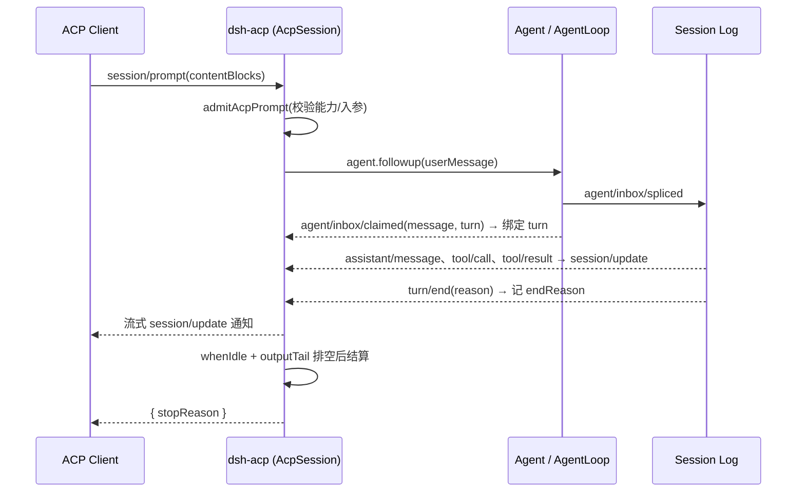

# 第十三章:扩展生态——Hooks、ACP、Web/Desktop 与 SDK(DeepSeek Harness 源码分析)

> 分析对象:[deepseek-ai/deepseek-harness](https://github.com/deepseek-ai/deepseek-harness) @ `dbbaa4a37`

---

## 第〇节 一句话结论与总览

DSH 的扩展生态不是若干内建子系统,而是**五条互相独立的进程边界**:①用 `hook-protocol` 把外部命令 hook 挂到内核既有扩展点;②用 ACP 把 harness 变成受信客户端可驱动的 agent 服务;③用 webhook 让外部事件反向创建 Session;④用 Remote/Typert Gateway 把 Host 内核投影进浏览器或 Electron 渲染进程;⑤用 TS/Python 双 SDK 把 agent loop 投影成进程外可编程对象。五条边界共享同一条纪律:**进入内核的那一步都收敛到既有能力缝**——hooks 落 `ctx.shell` 与扩展点决策、调用痕迹落 `session.append`;ACP 落 `ctx.agents.create/resume` 与 `approval/request` 瀑布;webhook 落 `ctx.agents.create` + Workspace;Remote 落 `TypertRemoteService` 的 `@Remote` 方法;SDK 落 JSON-RPC 的 `initialize`/`session/prompt`/`shutdown`。没有任何一条链路自带第二条 agent loop、第二份会话存储或第二套工具管道。

| 接入面 | 方向 | 物理载体 | 进入内核的落点 |
|---|---|---|---|
| Hooks 桥 | 入站(同步 + 3 个 detached 点) | 子进程 stdin/stdout + 退出码,经 `ctx.shell` | `agent/session-start`、`agent/pre-step`、`tools/pre-execute`、`tools/post-execute`、`agent/turn-stopping`、`subagent/start|end` |
| ACP | 双向 JSON-RPC over stdio | `@agentclientprotocol/sdk` 的 `ndJsonStream` | `ctx.agents.create/resume`、`approval/request` 瀑布、`session/event` |
| Webhook | 入站(HTTP → fire-and-forget) | `webServer` 上的 exact route + HMAC 验签 | `ctx.webhookRuntime.dispatch()` → `ctx.agents.create()` |
| Remote / Gateway | 出站(浏览器调用 Host) | HTTP `POST /api/<ns>/<method>` + WS `/api/remote.mux` | `TypertRemoteService` 的 `@Remote` 方法与转发事件流 |
| SDK(TS/Python) | 出站(launch 一个 `dsh --profile`) | newline-delimited JSON-RPC over 子进程 stdio | `@deepseek-ai/dsh-sdk-jsonrpc-server` 插件 |

```text
  外部命令 hook        ACP 客户端         GitHub 事件        浏览器 / Electron 渲染进程      TS / Python 进程
       |                  |                  |                       |                        |
 (stdin/退出码 2)   (JSON-RPC stdio)    (HTTP + HMAC)        (HTTP /api + WS mux)     (JSON-RPC stdio)
       v                  v                  v                       v                        v
 +-------------+  +---------------+  +----------------+  +---------------------+  +---------------------+
 | hooks-      |  | dsh-acp       |  | webhook-github |  | webServer +         |  | sdk-jsonrpc-server  |
 | claude-code |  | (AcpSession)  |  | (route handler)|  | typertGateway       |  | (HarnessSdkJsonRpc  |
 | hooks-codex |  |               |  |                |  | /api/remote.mux     |  |  Server)            |
 +------+------+  +-------+-------+  +-------+--------+  +----------+----------+  +----------+----------+
        |                 |                  |                      |                        |
        v                 v                  v                      v                        v
 pre-step/tool 瀑布   approval/request   WebhookRuntime      TypertRemoteService       ctx.agents.create
 turn-stopping       ctx.agents.create  → 建 Session 事务    (@Remote 方法 + 事件流)    + 4 个通知
        \                 |                  |                      |                        /
         +----------------+------------------+----------------------+-----------------------+
                                     同一个 Host 内核
                    (session log / agent loop / tools / approval / persistence)
```

---

## 第一节 Hooks 桥:把外部命令挂到内核的决策点

### 1.1 三层结构:方言中立协议 + 两个方言桥

`packages/hooks/` 下三个包:`hook-protocol`(共享 wire 协议与执行器)、`hooks-claude-code`、`hooks-codex`。切分理由写在协议包的模块注释里:协议拥有"方言中立的词汇与只写日志的事件",payload 构造、匹配差异、环境与决策映射留在各自的桥(`packages/hooks/hook-protocol/src/types.ts:1-6`)。两个桥的插件名与注入同形:

```typescript
// packages/hooks/hooks-codex/src/index.ts:39-40(CC 桥同形,见 packages/hooks/hooks-claude-code/src/index.ts:38-41)
export const name = 'hooks-codex'
export const inject = ['shell', 'sessionProjections']
```

桥**不注册新工具、不改主循环**:只在内核既有瀑布/串行监听点上挂 listener;装配由运营者在 `cordis.yml` 或 patch 中显式加行——仓库内仅快照夹具声明了这两行(`snapshots/session/text-turn/cordis.yml:72-78`)。

### 1.2 wire 协议:stdin JSON + 退出码 + stdout JSON

一次调用的全部 I/O 由 `runHook` 定义(`packages/hooks/hook-protocol/src/runner.ts:67-105`):

```typescript
// packages/hooks/hook-protocol/src/runner.ts:73-105(截取核心)
const timeoutMs = hook.timeoutSec !== undefined ? hook.timeoutSec * 1000 : options.defaultTimeoutMs
const stdin = JSON.stringify(options.payload) + (options.trailingNewline ? '\n' : '')
const request = {
  command: hook.command,
  timeoutMs,
  stdin,
  signal: options.signal,
}
try {
  const result = await bash.run(bash.resolve(request))
  const exitCode = result.exitCode ?? undefined
  return {
    output: parseHookOutput(exitCode, result.stdout.text, result.stderr.text, options.expectedEventName),
    durationMs: now() - started,
  }
} catch (error: unknown) {
  const message = error instanceof Error ? error.message : String(error)
  return {
    output: parseHookOutput(undefined, '', message),
    durationMs: now() - started,
  }
}
```

三条协议事实:①**退出码是主通道**,`2` 是唯一阻塞码(`const BLOCKING_EXIT_CODE = 2`,`packages/hooks/hook-protocol/src/codec.ts:11`),`stderr` 成为阻塞理由,其余退出码按"非阻塞错误"处理(`packages/hooks/hook-protocol/src/codec.ts:65-69`);②**结构化 stdout 只在退出码 0 且首字符为 `{` 时尝试**,JSON 畸形退回纯文本而不报错(`packages/hooks/hook-protocol/src/codec.ts:71-86`);③**决策词汇被归一**:顶层 `decision` 只接受 `approve|block`,而 `allow|deny|ask` 只能来自 `hookSpecificOutput.permissionDecision`,越界的 `{"decision":"deny"}` 被忽略(`packages/hooks/hook-protocol/src/codec.ts:32-45`),且 `hookEventName` 与触发事件不符时只丢事件域字段、保留判别值(`packages/hooks/hook-protocol/src/codec.ts:115-126`)。超时默认值只有一份:`DEFAULT_HOOK_TIMEOUT_MS = 600_000`(`packages/hooks/hook-protocol/src/runner.ts:20`),配置里的 `timeoutSec` 是秒,由 runner 换算成毫秒。解码侧是一个**全函数**(从不抛错),三条事实各占一个分支:

```typescript
// packages/hooks/hook-protocol/src/codec.ts:59-88
export function parseHookOutput(exitCode: number | undefined, stdout: string, stderr: string, expectedEventName?: string): HookOutput {
  const trimmedErr = stderr.trim()
  const trimmedOut = stdout.trim()
  // Plain stdout remains available even when it is not JSON.
  const output: HookOutput = { exitCode, stderr: trimmedErr, stdout: trimmedOut }

  // Both dialects treat exit 2 as a block with stderr as its reason.
  if (exitCode === BLOCKING_EXIT_CODE) {
    output.decision = 'block'
    if (trimmedErr.length > 0) output.reason = trimmedErr
  }

  // Structured stdout is valid only for a clean exit.
  if (exitCode === 0) {
    // ...(略:仅当 stdout 以 `{` 开头才尝试 JSON.parse,畸形 JSON 静默退回纯文本)
    if (parsed) applyStructured(output, parsed, expectedEventName)
  }

  return output
}
```

### 1.3 事件点与决策映射

Claude Code 方言支持 7 个事件(`packages/hooks/hooks-claude-code/src/config.ts:11-19`),Codex 方言 5 个(`packages/hooks/hooks-codex/src/config.ts:11`),但映射目标是同一批内核扩展点:

| 方言事件 | 内核扩展点 | 决策类型 | CC | Codex |
|---|---|---|---|---|
| `SessionStart` | `agent/session-start`(detached) | 注入上下文 | ✅ | ✅ |
| `UserPromptSubmit` | `agent/pre-step`(瀑布) | `{kind:'reject'}` | ✅ | ✅ |
| `PreToolUse` | `tools/pre-execute`(瀑布) | `deny` / `ask` | ✅ | 仅 `deny` |
| `PostToolUse` | `tools/post-execute`(瀑布) | `{kind:'block', feedback}` | ✅ | ✅ |
| `Stop` | `agent/turn-stopping`(串行) | `agent.steer()` 强制续跑 | ✅ | ✅ |
| `SubagentStart/Stop` | `subagent/start`、`subagent/end` | 仅注入/观察 | ✅ | ❌ |

分派集中在每个桥的 `runPoint`(`packages/hooks/hooks-claude-code/src/index.ts:136-186`):按 matcher 选组 → 串行跑命令 → 保证 `hook/invoked`/`hook/result` 成对落日志:

```typescript
// packages/hooks/hooks-claude-code/src/index.ts:151-182(截取核心)
for (const group of groups) {
  if (!matchesMatcher(group.matcher, matchQuery, 'claude-code')) continue
  for (const hook of group.hooks) {
    const handlerId = nextHandlerId(point)
    const session = opts.agent?.session
    if (session && opts.turn !== undefined) {
      appendHookInvoked(session, {
        turn: opts.turn, point, dialect: 'claude-code', handlerId,
        ...group.matcher !== undefined ? { matcher: group.matcher } : {},
      })
    }
    const { output, durationMs } = await runHook(ctx.shell, hook, {
      payload,
      defaultTimeoutMs,
      signal: opts.signal,
      trailingNewline: true,
      expectedEventName: point,
    }, () => performance.now())
    outputs.push(output)
    if (session && opts.turn !== undefined) {
      appendHookResult(session, { turn: opts.turn, point, handlerId, output, stderrSummaryMaxChars, durationMs })
    }
  }
}
return mergeHookOutputs(outputs)
```

两个桥的差异全部体现在这里:Codex 的 `trailingNewline` 为 `false`(`packages/hooks/hooks-codex/src/index.ts:145`),并把"干净的纯文本 stdout"当作 `additionalContext`(`packages/hooks/hooks-codex/src/index.ts:151-155`);Codex 的 `PreToolUse` 不返回 `ask`(`packages/hooks/hooks-codex/src/index.ts:224-230`),CC 会(`packages/hooks/hooks-claude-code/src/index.ts:240-241`);子代理事件上 CC 桥恒定报告 `agent_type: 'general-purpose'`,因为 subagent 缝不携带按种类的标签(`packages/hooks/hooks-claude-code/src/index.ts:297-303`)。CC 桥在 `tools/pre-execute` 上的决策映射只有四行,`deny`/`ask` 之外一律 `next()` 委托下游:

```typescript
// packages/hooks/hooks-claude-code/src/index.ts:237-243
ctx.on('tools/pre-execute', async (exec, next): Promise<PreToolDecision> => {
  const turn = lastTurn(ctx, exec.agent)
  const merged = await runPoint('PreToolUse', exec.name, preToolPayload(exec), { ...exec.agent ? { agent: exec.agent } : {}, turn, signal: exec.signal })
  if (merged.decision === 'deny') return { kind: 'deny', reason: merged.reason ?? 'blocked by PreToolUse hook' }
  if (merged.decision === 'ask') return { kind: 'ask', ...merged.reason !== undefined ? { reason: merged.reason } : {} }
  return next()
})
```

### 1.4 合并语义与审计

同一事件点匹配多个 hook 时,结果折叠成单一的"已是最严"视图(`packages/hooks/hook-protocol/src/merge.ts:62-99`):权限优先级 `deny > ask > allow`(`rank()` 把 `block/deny` 折成 3、`ask` 折成 2、`approve/allow` 折成 1,`packages/hooks/hook-protocol/src/merge.ts:35-42`);理由只保留**胜出等级**的理由并按 `\n\n` 连接,`additionalContext` 与 `systemMessage` 按 hook 顺序累积。`continue:false` 是粘性的,但当前只记录不执行——两个桥留着同一个 TODO:`merged.stop` 需要 run 级 halt 机制(`packages/hooks/hooks-claude-code/src/index.ts:188`、`packages/hooks/hooks-codex/src/index.ts:171`)。调用痕迹则是**只写日志的会话事件**,不是消息面事件:`hook/invoked` 与 `hook/result` 以 `turn + point + handlerId` 关联(`packages/hooks/hook-protocol/src/types.ts:19-39`),`decision` 由"解析出的决策 → `continue:false` 记 `stop` → 否则 `pass`"推导,`stderr` 摘要按配置上限截断(默认 500,`packages/hooks/hook-protocol/src/events.ts:53`)。配对关系由包自带 invariant 强制:`hook/result` 找不到对应 `hook/invoked`、事件落在任何 turn 之外、turn 号与当前打开 turn 不符,都报 invariant 失败(`packages/hooks/hook-protocol/src/invariant.ts:26-58`)。

### 1.5 信任边界

hook 配置是**受信任的本地文件**,hook 命令是**受信任的可执行代码**——桥只解析与匹配,不做权限裁决;隔离来自执行侧:`runHook` 走 `ctx.shell`,`bash.resolve(request)` 之后由 shell 能力负责凭据清洗、进程组取消与超时(`packages/hooks/hook-protocol/src/runner.ts:1-7`,清洗细节见第二章)。失效面被刻意收敛为几种可枚举结果:配置读不到或解析失败 → 记 warning 且**不注册任何 hook**,agent 照常启动(`packages/hooks/hooks-claude-code/src/index.ts:112-115`);带 matcher 的组若正则非法 → 解析期抛 `SyntaxError`,整份配置在注册 listener 前被拒(`packages/hooks/hooks-claude-code/src/config.ts:112-113`);非 command 类型(CC 的 `prompt`/`agent`/`http`、Codex 的 `async:true`)在解析期丢进 `skipped` 并记 warning(`packages/hooks/hooks-claude-code/src/config.ts:97-101`、`packages/hooks/hooks-codex/src/config.ts:65-67`);detached 点的链路被 `createDetachedRuns()` 跟踪,dispose 时先 abort 再 drain,保证没有 hook 进程或迟到回调活过 fiber(`packages/hooks/hook-protocol/src/detached.ts:43-61`)。

能力缺失同样是显式记录而非静默降级:`updatedInput`(工具入参改写)只解析不使用,`systemMessage` 只记不展示,`transcript_path` 恒为空串(`packages/hooks/hooks-claude-code/src/index.ts:321-328`),`stop_hook_active` 恒为 `false`;包 README 用一张 21 个不支持事件的清单把差异钉死(`packages/hooks/hooks-claude-code/README.md:174-182`)。

---

## 第二节 ACP:把 harness 暴露为 agent 服务

### 2.1 协议面与装载

ACP 包自称 automation-only(仅自动化),暴露面在 `initialize` 里一次说清(`packages/acp/acp/src/index.ts:176-190`):

```typescript
return {
  protocolVersion: PROTOCOL_VERSION,
  agentInfo: { name: 'deepseek-harness-acp', version: '0.0.1' },
  agentCapabilities: {
    mcpCapabilities: { http: true },
    promptCapabilities: { image: imagePromptEnabled, audio: false, embeddedContext: false },
    sessionCapabilities: { close: {}, list: {}, resume: {} },
  },
  authMethods: [],
}
```

`imagePromptEnabled` 不是常量,而是 initialize 时按当前 provider/model 探得的能力(`packages/acp/acp/src/index.ts:179`)。传输固定 stdio,用 SDK 的换行 JSON 流包住 `process.stdout`/`process.stdin`(`packages/acp/acp/src/index.ts:374-377`),9 个 handler 一一对应 SDK 的方法常量(`packages/acp/acp/src/index.ts:378-391`)。装配只有一行 bundle row(`packages/bundle/acp-app/cordis.patch.yml:16-18`),同一份 patch 还关掉 `session-title-llm` 并把 persona 固定为"你的工作目录是 {{cwd}}",因为呈现层属于 ACP 客户端。装载点把传输固定成 stdio,并把 9 个 handler 一一挂到 SDK 的方法常量上:

```typescript
// packages/acp/acp/src/index.ts:374-391
const stream: Stream = config.stream ?? ndJsonStream(
  Writable.toWeb(process.stdout) as WritableStream<Uint8Array>,
  Readable.toWeb(process.stdin) as ReadableStream<Uint8Array>,
)
const app = createAcpAgentApp({ name: 'deepseek-harness-acp' })
  .onRequest(methods.agent.initialize, ({ params }) => implementation.initialize(params))
  // ...(略:agent.authenticate 与 session.new / session.list / session.resume / session.close / session.setConfigOption / session.prompt)
  .onNotification(methods.agent.session.cancel, ({ params }) => implementation.cancel(params))
const connection = app.connect(stream)
```

### 2.2 会话生命周期:每个 ACP 会话 = 一个受管 Agent

`AcpSession` 是每会话模块,持有"未公开的 Agent 组合、选定路由、一个 prompt 准入槽、有序更新队列与幂等的静默拆除"(`packages/acp/acp/src/session.ts:93-105`);创建与恢复都走内核既有入口:

```typescript
// packages/acp/acp/src/session.ts:128-137(截取核心)
const handle = await ctx.agents.create({
  sessionId: options.sessionId,
  meta: { cwd: options.cwd },
  agentOptions: options.agentOptions,
  signal: options.signal,
  setup: async (agentCtx) => {
    modelControl.install(agentCtx)
    await mountAcpMcpServers(agentCtx, options.mcpServers, options.cwd)
  },
})
```

`session/new` 返回前做三件事:创建记录 → 取 `configOptions` → `ctx.sessions.flush()`,失败则删记录并 `close()` 回滚(`packages/acp/acp/src/index.ts:225-236`)。`session/resume` 更严:先 `persistence.stat()` 校验头部,拒绝 `origin === 'subagent'` 或有 `parentSession` 的会话,再用 `realpath` 比对 cwd,最后才 `ctx.agents.resume()`(`packages/acp/acp/src/index.ts:248-289`)。`session/list` 用不透明 keyset 游标(base64url 的 `[createdAt, sessionId]`,并校验规范形式)分页(`packages/acp/acp/src/index.ts:475-508`)。 `session/resume` 的两道门(头部校验 + cwd 比对)与失败回滚:

```typescript
// packages/acp/acp/src/index.ts:248-287
const persisted = (await persistence.stat(sessionId, { signal }))?.header
if (persisted === undefined || persisted.origin === 'subagent' || persisted.parentSession !== undefined) {
  throw invalidParams(`session is not resumable: ${sessionId}`)
}
if (!await sameDirectory(persisted.cwd, params.cwd)) {
  throw invalidParams(`session cwd does not match: ${params.cwd}`)
}
// ...(略:AcpSession.resume、恢复后再次 cwd 比对、closed 竞态检查,以及 configOptions 失败时的 sessions.delete + record.close 回滚)
```

### 2.3 一次 prompt 的全过程


<details><summary>Mermaid 源码</summary>



</details>

关键点:①**准入是显式阶段**,失败按 `AcpContentError.kind` 映射成 `invalidParams`/`internalError`,`agent.followup()` 抛错则回滚 `messageQueued` 与 selection(`packages/acp/acp/src/session.ts:280-304`);②**同一会话同时只允许一个在飞 prompt**(`packages/acp/acp/src/session.ts:249`);③**路由按消息钉住**:prompt 时快照 selection,`agent/inbox/claimed` 到来时 `pinTurn(turn, selection)`(`packages/acp/acp/src/session.ts:396-401`);④**结算条件是"整 Agent 静默 + 更新排空"**,依次等 `admissionDone` → `agent.whenIdle()` → `outputTail`,再按取消/输出错误/Agent 错误/`turn/end.reason` 决定 resolve 或 reject(`packages/acp/acp/src/session.ts:483-523`);⑤**流式更新是"提交后才发"**,三类日志事件分别投影成 assistant 块、`tool_call`、`tool_call_update` 并串在同一条 `outputTail` 上保证顺序(`packages/acp/acp/src/session.ts:345-389`、`packages/acp/acp/src/updates.ts:52-85`),`reasoning` 块发成 `agent_thought_chunk`,只有同时具备 token 计量与上下文窗口两个事实时才附 `usage_update`(`packages/acp/acp/src/updates.ts:22-45`、`packages/acp/acp/src/updates.ts:88-102`)。

①里的"准入"在源码中就是一次异步调用加两次**前后各一次**的存活校验:

```typescript
// packages/acp/acp/src/session.ts:277-290
if (this.ctx.agents.get(this.agent.id) !== this.agent) {
  throw internalError('prompt was not queued: the agent was disposed outside the bridge')
}
const content = await admitAcpPrompt(
  this.ctx,
  promptSelection,
  params.prompt,
  imageEnabled,
  admissionController.signal,
)
admissionController.signal.throwIfAborted()
if (this.ctx.agents.get(this.agent.id) !== this.agent) {
  throw internalError('prompt was not queued: the agent was disposed outside the bridge')
}
```

### 2.4 审批回传:单次、不可推断的机器策略通道

工具审批借用内核的 `approval/request` 瀑布,再用 ACP 的 `session/requestPermission` 回问客户端;桥只提供一次选项,且**绝不从客户端的未知回复里推断长期授权**(`packages/acp/acp/src/index.ts:152-173`):

```typescript
ctx.on('approval/request', (request, next) => {
  const record = ownedRecord(request.agent)
  if (record === undefined || request.callId === undefined) return next()
  const callId = request.callId
  return record.drainUpdates().then(() => {
    const params: RequestPermissionRequest = {
      sessionId: record.agent.session.id,
      toolCall: { toolCallId: callId },
      options: [
        { optionId: 'allow-once', name: 'Allow once', kind: 'allow_once' },
        { optionId: 'reject-once', name: 'Reject', kind: 'reject_once' },
      ],
    }
    return conn.request(methods.client.session.requestPermission, params)
  }).then(({ outcome }) => {
    if (outcome.outcome === 'cancelled') return 'cancelled'
    return outcome.optionId === 'allow-once' ? 'allowed-once' : 'rejected'
  })
})
```

发问前先 `drainUpdates()`,保证客户端先看到工具调用卡片再看到审批请求,否则 UI 只能为一个未知的 `toolCallId` 弹窗。

### 2.5 取消、终态与拆除

`session/cancel` 通知走串行监听:`cancel()` 先置 `cancelRequested`、abort 准入控制器、必要时 `agent.cancel({kind:'user'})`;若当前没有在飞 prompt,则取消 Agent 的自主工作(`packages/acp/acp/src/session.ts:334-338`、`packages/acp/acp/src/session.ts:474-481`)。终态映射集中在纯函数 `turnEndToStopReason`(`packages/acp/acp/src/codec.ts:14-33`):`completed→end_turn`、`max-tokens→max_tokens`、`interrupted→cancelled`,而 `blocked`/`error`/`aborted` 一律 `end_turn`——注释明确 `cancelled` 只留给显式客户端取消与拆除。拆除顺序固定为"取消 → 等准入与 idle → 排空输出 → 排空 continuable 子代理 → flush 持久化 → dispose Agent",多路失败聚合成 `AggregateError`(`packages/acp/acp/src/session.ts:428-468`);连接关闭时桥做全局 `quiesce()`,先无条件关闭所有会话记录(`packages/acp/acp/src/index.ts:395-423`)。结算体本身(取消/输出错误/Agent 错误/`turn/end.reason` 四路出口)逐字如下:

```typescript
// packages/acp/acp/src/session.ts:486-514
void (async () => {
  await inflight.admissionDone
  if (inflight.messageQueued) {
    await this.agent.whenIdle()
    await this.outputTail
  }
  if (this.inflight !== inflight) return
  this.inflight = undefined
  if (inflight.cancelRequested) {
    inflight.resolve('cancelled')
    return
  }
  // ...(略:outputError / agentError 两个 reject 分支)
  const end = inflight.endReason
  if (end === undefined) {
    inflight.resolve('cancelled')
  } else if (end.kind === 'error') {
    inflight.reject(internalError(`turn failed: ${end.error.message}`))
  } else {
    inflight.resolve(turnEndToStopReason(end))
  }
})()
```

---

## 第三节 Webhook 入站:从签名 HTTP 到一次 Session

### 3.1 供应商中立的运行时

`webhook` 包只定义三件事:投递(`VerifiedWebhookDelivery`)、规则(`WebhookRule`)、以及**唯一的运行时动作**"创建并提示一个根 Session"(`packages/webhook/webhook/src/types.ts:14-69`)。运行时是 Cordis Service,服务名 `webhookRuntime`:

```typescript
// packages/webhook/webhook/src/index.ts:126-133
dispatch<K extends string>(delivery: VerifiedWebhookDelivery<K>): void {
  if (this.closing) throw new Error('webhook runtime is closing')
  const snapshot = snapshotDelivery(delivery)
  for (const registration of [...this.rules.values()]) {
    if (registration.closing || registration.rule.kind !== snapshot.kind) continue
    this.startInvocation(registration, snapshot)
  }
}
```

`dispatch()` 是 **fire-and-forget**:同步返回,规则的异步失败只落日志(`packages/webhook/webhook/src/index.ts:136-162`);投递在跨规则共享前先整体快照并 `deepFreeze`,非无损 JSON 直接拒收(`packages/webhook/webhook/src/index.ts:39-55`);规则注册本身是 Cordis effect,disposer 先隐藏规则、abort 控制器、再排空在飞回调(`packages/webhook/webhook/src/index.ts:165-175`)。

### 3.2 GitHub 适配器:先验签,再解析,最后 202

`webhook-github` 在注入的 `webServer` 上注册一条 exact route(`packages/webhook/webhook-github/src/index.ts:47-61`),处理顺序严格(`packages/webhook/webhook-github/src/handler.ts:82-120`):必须 POST(否则 405 + `allow` 头)→ `content-type` 必须是 `application/json`(可带一个 `charset=utf-8`,否则 415)→ 读取**有上限的** UTF-8 请求体 → `x-hub-signature-256`/`x-github-delivery`/`x-github-event` 三个头必须各出现一次 → 解析凭据引用取共享密钥(缺失 503)→ Octokit `verify()` 验签,失败 401 → payload 必须是无损 JSON 对象 → `dispatch()`(运行时不可用则 503)→ **202**。即 **202 只承诺"已入内存队列",不承诺任何 Session 已建立**;`deliveryId` 只作为来源标记传给模型(`packages/webhook/webhook/src/types.ts:19-20`),适配器不做去重。验签到 202 的主干:

```typescript
// packages/webhook/webhook-github/src/handler.ts:91-120
const body = await readBoundedUtf8Body(request, config.maxBodyBytes)
const signature = requiredHeader(request, 'x-hub-signature-256')
const deliveryId = requiredHeader(request, 'x-github-delivery')
const eventName = requiredHeader(request, 'x-github-event')
const credential = await ctx.credentials.resolve(config.secretEnv)
if (credential === undefined || credential.value === '') {
  throw new WebhookHttpError(503, 'GitHub webhook secret is unavailable')
}
let verified = false
try {
  verified = await new Webhooks({ secret: credential.value }).verify(body, signature)
} catch {
  // Octokit verification errors carry no response detail safe or useful to the sender.
}
if (!verified) throw new WebhookHttpError(401, 'invalid webhook signature')
const payload = parsePayload(body)
// ...(略:构造 VerifiedWebhookDelivery;dispatch() 抛错时转 503 'webhook runtime is unavailable')
respond(response, 202)
```

### 3.3 会话创建:一次性事务 + 回滚

规则返回值被当作**不可信的同进程输入**重新校验:workspacePath 必须绝对,title/prompt/agentPreset/permissionPreset 必须非空,`model.maxTokens` 必须是正安全整数(`packages/webhook/webhook/src/session.ts:43-84`)。随后按固定顺序落库:`permissionPresets.resolve` → `agentPresets.resolve` + `standingKeyFor` → `workspaceRegistry.create` → `ctx.agents.create({sessionId: 'webhook-<uuid>'})` → 附加到 Workspace → 设权限预设 → 命名 → `followup()`,中途失败则 detach + dispose 回滚(`packages/webhook/webhook/src/session.ts:124-178`)。给模型的消息带全量来源追溯:

```typescript
// packages/webhook/webhook/src/session.ts:152-163(截取核心)
handle.agent.followup(createUserMessage({
  content: [{ type: 'text', text: resolved.prompt }],
  source: {
    kind: 'webhook',
    provider: delivery.kind,
    source: delivery.source,
    deliveryId: delivery.deliveryId,
    ruleId,
    form: 'notice',
    summary: boundContextSummary(`${delivery.kind} webhook handled by ${ruleId}`),
  },
}))
```

提示入队成功后,webhook 立即放弃对这次运行的所有权:Agent 由 `ctx` 拥有,后续行为与普通会话一致(`packages/webhook/webhook/src/session.ts:106-110`)。

---

## 第四节 Web / Desktop:同一个 Host 内核的多种外壳

### 4.1 三端与 profile

`apps/` 下四个目录:`cli`(唯一的 `dsh` 可执行文件,`@deepseek-ai/dsh`,bin 为 `lib/bin.js`)、`web`(`@deepseek-ai/dsh-web-frontend`,只导出 `./dist/*`)、`desktop`(`@deepseek-ai/dsh-desktop`,Electron 壳)、`desktop-host`(私有的上游 Node 宿主)。用户看到的 `web`/`acp`/`headless`/`sdk`/`sdk-minimal` 都是 profile 模板,`web` 是其中**唯一 `patchReload: 'live'`** 的模板,因此只有它挂 patch 热重载(`packages/boot/app-boot/src/profile.ts:105-126`)。

`apps/web` 不是应用:`apps/web/src/main.ts:1-6` 全文只有 6 行,把 `#root` 交给壳库 `AppWebEntry`,既不读 boot 图也不挂插件运行时。浏览器侧的插件图由 Host 注入:Host 组装 `WebBootGraph`(`rev` + `entries` + `batches`,`packages/client/modules/src/client/manifest.ts:81-93`),以 `globalThis["__DSH_BOOT__"]` 写进 `index.html`(`packages/client/modules/src/index.ts:474`);浏览器引导第一句 await 同一注入表给出的 `__DSH_BOOT_READY__`,再取 `__ModuleLoader__` facade 并以该图建模块表(`packages/client/web/src/boot.ts:54-69`),解析失败即抛 `client-modules: window.__DSH_BOOT__ is missing or not an object`(`packages/client/modules/src/client/manifest.ts:215`)。这正是"裸 Vite 跑不起来"的机制来源(`apps/web/vite.config.ts:9`)。`dsh web` 只是 `--profile web` 的硬编码别名(`apps/cli/src/args.ts:175-187`),默认端口 `3080`(`packages/bundle/web-app/cordis.patch.yml:140`);启动后由 web-app bundle 打印带启动令牌的 URL、可选打开浏览器,并把"用户正通过 Web GUI 与你交互"写进 system prompt(`packages/bundle/web-app/src/index.ts:135-146`、`packages/bundle/web-app/src/index.ts:261-277`)。客户端插件的热重载走独立 dev SSE 通道 `/plugins/events`(`packages/client/hmr/src/events.ts:44`),只有 `pnpm run dev:web` 重写 bundle 时才产生重建事件。`apps/web` 侧的全部代码就是把这个 `#root` 交给壳库:

```typescript
// apps/web/src/main.ts:1-6
/** Browser entry for the Web client. */
import { AppWebEntry } from '@deepseek-ai/dsh-client-web'

const el = document.getElementById('root')
if (el === null) throw new Error('web app: missing #root')
void new AppWebEntry(el).run()
```

### 4.2 Remote:Host 能力的双侧 BFF 与 Typert Gateway

分层是 `remotes → gateway → connection → webserver`(`docs/api-gateway.md:162`)。Host 侧业务类继承 `TypertRemoteService`,构造时声明命名空间,方法用 `@Remote` 导出(`packages/api/session-controller/src/index.ts:87`、`packages/api/session-controller/src/index.ts:121`):`@Remote('create')` 是一元方法,`@Remote({ mode: 'stream' })` 返回 `AsyncIterable`(`packages/api/session-controller/src/index.ts:244-247`、`packages/api/session-controller/src/index.ts:400-403`)。端点名是规范化的 `<namespace>/<method>`(`packages/api/gateway/src/index.ts:1012-1014` 的 `endpointOf`),浏览器侧映射成 `POST /api/<ns>/<method>`,body 为 `{type:'client-request', rpcId, method: endpoint, payload}`,`rpcId` 由发起方生成、响应方回显,不匹配即抛错(`packages/client/connection/src/client/rpc.ts:34-51`、`packages/client/connection/src/client/rpc.ts:56-57`)。两种 `@Remote` 形态的声明原文:

```typescript
// packages/api/session-controller/src/index.ts:244-247
@Remote('create')
create(request: SessionCreateRequest): Promise<SessionCreateValue> {
  return this.commands.create(request)
}
```

```typescript
// packages/api/session-controller/src/index.ts:400-403
@Remote({ mode: 'stream' })
follow(request: SessionFollowRequest, signal: AbortSignal): AsyncIterable<SessionFollowFrame> {
  return this.history.follow(request, signal)
}
```

Gateway 把这些方法搬上网:在 `connection` 的 `/api` 通道上做拦截式认领,并在 `webServer` 上注册唯一一条 WebSocket 升级路由承载所有流:

```typescript
// packages/api/gateway/src/index.ts:199-227(截取核心;两层 ctx.inject 的缩进已略)
connectionCtx.connection.rpc.intercept(
  '/api',
  endpoint => this.claimsEndpoint(endpoint),
  (endpoint, payload, signal) => this.dispatchRpc(endpoint, payload, signal),
)
...
webCtx.effect(() => {
  const route: WebUpgradeRoute = {
    path: REMOTE_STREAM_MUX_PATH,
    handler: (req, socket, head) => {
      const rejection = webCtx.connection.requestRejection(req)
      if (rejection !== undefined) {
        rejectRemoteStreamUpgrade(socket, rejection)
        return
      }
      mux.handleUpgrade(req, socket, head)
    },
  }
  const unregister = webCtx.webServer.registerUpgrade(route)
```

流协议有三条要点:①**帧只有六种**,C→H 是 `open`/`cancel`,H→C 是 `item`/`error`/`end`(`packages/api/gateway/src/stream-protocol.ts:242-263`),`streamId` 由客户端生成,重复即抛错(`packages/api/gateway/src/stream-server.ts:140-152`);②**网关层没有序列号也没有游标**,心跳是 WS 协议层 Ping(默认 2000 ms,`packages/api/gateway/src/index.ts:116`;漏 2 次即 terminate,`packages/api/gateway/src/stream-server.ts:22`),socket 一关就 abort 全部逻辑流(`packages/api/gateway/src/stream-server.ts:130`)——**恢复语义不在网关层**;③**事件流是独立逻辑流**,应用侧走内部端点 `$events`(下行帧 `ready|emit|waterfall|cancel`,首项必须 `ready`,`packages/api/gateway/src/stream-protocol.ts:6-18`、`packages/api/gateway/src/stream-protocol.ts:65-70`),客户端对瀑布事件的应答走一元端点 `$events/result`。Host 侧事件源由 `packages/api/remotes` 注册,该包只有一行 Host 行为(`packages/api/remotes/src/index.ts:39-44`);名单是编译期 allowlist,共 19 条(17 条 `emit` + 2 条 `waterfall`,后者是 `approval/request` 与 `user-questions/request`,`packages/api/remotes/src/remote-events.ts:16-36`)。Client 侧同一包固定挂载 15 个命名空间贡献,失败与销毁都逆序回滚(`packages/api/remotes/src/client/index.ts:153-168`)。

### 4.3 Desktop:不开监听端口,改用 framed byte pipes

Electron 壳的取舍很直白:**应用不开 Web 端口**,`dsh-app://`(`apps/desktop/src/main.ts:26`)承载 Web 资源与 Fetch 流量,带背压的字节管道承载请求/响应分片,Node IPC 只承载子进程生命周期(`apps/desktop/README.md:5`、`apps/desktop/README.md:16`)。宿主是私有的 `apps/desktop-host`,一个普通上游 Node 进程,由壳以 `stdio: ['ignore', 'pipe', 'pipe', 'pipe', 'pipe', 'ipc']` 启动(`apps/desktop/src/host-process.ts:120`):fd3 收请求、fd4 发响应。桌面组合复用浏览器组合,只把网络与浏览器启动行关掉——`web-startup`/`webserver`/`web-runtime`/`client-hmr`/`open-in-app`/`ui-open-in-app`/`directory-picker` 全部 `disabled: true`(`apps/desktop-host/config/desktop.cordis.patch.yml:3-22`)。三类请求在同一子进程内分发:

```typescript
// apps/desktop-host/src/index.ts:342-346
const response = url.pathname === DESKTOP_STREAM_PATH
  ? await streams.fetch(request)
  : url.pathname.startsWith('/api/')
    ? await api.fetch(request)
    : await assets.fetch(request)
```

也就是说 **Desktop 复用同一套 Host 内核与同一套 Gateway 语义**,只把"HTTP + WebSocket"换成"自定义协议 + 字节管道":API 仍走 `/api`(由 `connection.createSharedFetchHandler('/api')` 提供),`/plugins/` 仍走 client-modules 的 bundle 服务(`apps/desktop-host/src/index.ts:200`),而 Gateway 的**流式**能力退化成 NDJSON——宿主把 `gateway.wireStream.open()` 的产出逐行写成 `application/x-ndjson`(`apps/desktop-host/src/index.ts:243-263`),并给渲染进程注入 `globalThis.__DSH_TRANSPORT__` 脚本消费它(`apps/desktop-host/src/index.ts:99-120`)。帧是 13 字节定长头(magic + type + streamId + payloadLength)+ 载荷,数据帧上限 64 KB、控制帧上限 1 MB,超限、magic 不符、帧内 EOF 都直接致命(`apps/desktop-host/src/wire.ts:15-16`、`apps/desktop-host/src/wire.ts:63-76`);背压显式实现:请求体消费者 `desiredSize <= 0` 时暂停请求管道,直到 `pull()` 恢复(`apps/desktop-host/src/index.ts:517-520`)。帧编码即"13 字节头 + 载荷",超限直接抛:

```typescript
// apps/desktop-host/src/wire.ts:63-75
function encodeFrame(type: ResponseFrameType, streamId: number, payload: Buffer): Buffer {
  assertStreamId(streamId)
  const limit = type === RESPONSE_FRAME_DATA ? DESKTOP_PIPE_CHUNK_BYTES : MAX_CONTROL_PAYLOAD_BYTES
  if (payload.byteLength > limit) {
    throw new Error(`dsh desktop: response pipe frame exceeds the ${String(limit)}-byte limit`)
  }
  const frame = Buffer.allocUnsafe(FRAME_HEADER_BYTES + payload.byteLength)
  frame.writeUInt32BE(FRAME_MAGIC, 0)
  frame.writeUInt8(type, 4)
  frame.writeUInt32BE(streamId, 5)
  frame.writeUInt32BE(payload.byteLength, 9)
  payload.copy(frame, FRAME_HEADER_BYTES)
  return frame
}
```

### 4.4 三端差异一览

| 维度 | CLI(`dsh`) | Web(`dsh web`) | Desktop |
|---|---|---|---|
| 内核运行位置 | 本进程 | Host 进程(打印带令牌 URL) | 私有 desktop-host 子进程(上游 Node) |
| 前端与内核之间的通道 | 无(终端 UI) | HTTP `/api` + WS `/api/remote.mux` + `/plugins/*` | `dsh-app://` + fd3/fd4 字节管道 |
| 插件状态所有权 | `$DSH_HOME` 共享 | `$DSH_HOME` 共享 | 独占 `$DSH_HOME/profiles/desktop`(`apps/desktop/README.md:15`) |
| 端口 | 无 | 有(默认 3080) | **无**(Electron 不开 `webServer`,故 "Open In..." 被禁用,`apps/desktop/README.md:199`) |
| 客户端资源来源 | — | `webServer` 静态资源 + client-modules bundle | `@deepseek-ai/dsh-web-frontend/dist`(`apps/desktop-host/src/index.ts:187-193`) |

---

## 第五节 TS 与 Python 双 SDK:同一个 wire,两份会话事件投影

### 5.1 TS SDK:三包 = 协议 / 服务端插件 / 客户端

`packages/sdk/protocol` 定义 wire:**换行分隔的 NDJSON JSON-RPC 2.0**(不是 LSP 那套 Content-Length 分帧):`id + method` 是请求、只有 `id` 是应答、只有 `method` 是通知,畸形行静默忽略,未知方法回 `-32601`,handler 抛错回 `-32603`(`packages/sdk/protocol/src/transport.ts:1-7`、`packages/sdk/protocol/src/transport.ts:201-238`)。方法表只有三个请求 + 四个通知(`packages/sdk/protocol/src/types.ts:106-119`):

```typescript
export interface HarnessSdkRequestMap {
  'initialize': { params: InitializeParams; result: InitializeResult }
  'session/prompt': { params: SessionPromptParams; result: SessionPromptResult }
  'shutdown': { params: undefined; result: Record<string, never> }
}
// 通知:session.event(全量会话日志事件,含非 SDK 创建的会话)、session.status(整体 idle/running)、
//       subagent.started、subagent.finished(仅进程内子代理)
```

分派就在传输层:同一个 `id + method` 三元判定把一行分成请求、应答、通知三路,未知方法与 handler 抛错各自映射到固定错误码:

```typescript
// packages/sdk/protocol/src/transport.ts:211-223
const id = frame.id
const method = frame.method
if ((typeof id === 'string' || typeof id === 'number') && typeof method === 'string') {
  await this.handleIncomingRequest(id, method, objectParams(frame.params))
  return
}
// ...(略:只有 id → handleIncomingResponse;只有 method → notificationHandler;handleIncomingRequest 内未知方法回 -32601、handler 抛错回 -32603)
```

服务端是 profile 里的一个插件(`@deepseek-ai/dsh-sdk-jsonrpc-server`),把该传输装到 stdio 上,并把 `initialize` 当作就绪边界:`await ctx.get('loader')?.await()` 之后才宣告就绪;`shutdown` 的响应写出后由 `setImmediate` 触发 `flush → rootFiber.dispose() → exit(0)`(`packages/sdk/server/src/index.ts:76-93`)。就绪与退出两个边界写在插件的请求钩子里:

```typescript
// packages/sdk/server/src/index.ts:84-92
if (method === 'initialize') {
  await ctx.get('loader')?.await()
}
const result = await server.handleRequest(method, params)
if (method === 'shutdown') {
  // Run after the handler result is written; the task then flushes, disposes, and exits.
  setImmediate(() => { void disposeAndExit() })
}
return result
```

四个要点:①**没有 `session/create`**——会话由 `session/prompt` 惰性创建(`packages/sdk/server/src/server.ts:259-272`),`packages/sdk/protocol/README.md:114` 明确"无 cancel/close 方法,客户端靠关闭进程放弃一轮";②**审批不在 SDK 平面上**:server→client 请求是一条预留但未实现的能力(`packages/sdk/client/README.md:125`、`packages/sdk/protocol/README.md:115`),Web BFF 平面里的审批走的是转发瀑布事件 `approval/request`;③构造即订阅:`session/event` → `session.event`,`agent/status` → `session.status`,`session/created`(带 `parentSession`)→ `subagent.started`,`subagent/end` 只在 `info.local` 时发 `subagent.finished`(`packages/sdk/server/src/server.ts:95-127`);④`initialize` 会校验 provider/model/reasoningEffort/maxTokens,必要时动态挂载 DeepSeek 适配器,`prompt` 在附件准入的异步边界前后各校验一次"这个 Agent 还活着"(`packages/sdk/server/src/server.ts:150-161`、`packages/sdk/server/src/server.ts:195-199`)。

客户端默认以 `dsh --profile sdk` 拉起运行时,argv 是 `[nodeArgs..., '--profile', profile, '--patch', ...]`,并**强制版本一致**:SDK 客户端与 `dsh` 包的 `version` 不同即抛错(`packages/sdk/client/src/launch.ts:132`、`packages/sdk/client/src/launch.ts:141-143`、`packages/sdk/client/src/launch.ts:55-66`);源码态回退到 `--import tsx/esm src/bin.ts` 加一份专用 patch(`packages/sdk/client/src/launch.ts:104-108`)。高层 API 把"一次运行"定义为"从入队回执到整个 Agent 下一次 idle"(`packages/sdk/client/src/api.ts:1-6`),子进程惰性启动、由实例独占直至 `close()`(`packages/sdk/client/src/api.ts:22-46`)。关闭是阶梯式的:先尽力发协议 `shutdown`(默认 1 秒),再 `stdin.end()` 等 6 秒,非 Win32 补 `SIGTERM` 等 3 秒,最后 `SIGKILL` 并等退出边(`packages/sdk/client/src/dispose.ts:86-99`、`packages/sdk/client/src/client.ts:398-406`)。

### 5.2 Python SDK:不重写协议,只重写投影

Python 侧不引入新协议:用 wheel 自带的 `dsh` 启动同一个 `--profile sdk`(`python/README.md:5`、`python/sdk/README.md:13`),argv 由 `_default_launch_args` 拼装(`python/sdk/src/deepseek_harness/client.py:486`),只发三个方法名——`shutdown`、`initialize`、`session/prompt`(`python/sdk/src/deepseek_harness/client.py:101`、`:153`、`:183`),写出侧同样是 `json.dumps(...) + "\n"`(`python/sdk/src/deepseek_harness/client.py:337`)。它**强制显式 DSH_HOME**:既没给 `dsh_home` 也没有非空 `DSH_HOME` 就报错,"Python SDK 绝不隐式使用 `~/.dsh`"(`python/sdk/src/deepseek_harness/client.py:475-479`)。投影逻辑集中在 `Session.run()`——先订阅通知,再发 `session/prompt`,然后等到两件事才算一次运行结束:

```python
# python/sdk/src/deepseek_harness/api.py:168-181(截取核心)
received = False
while True:
    notification = subscription.next()
    if not received:
        if not _is_inbox_receipt(notification, self.id, message_id):
            continue
        received = True
    collect(notification)
    if (
        notification.method == "session.status"
        and notification.payload.get("sessionId") == self.id
        and notification.payload.get("status") == "idle"
    ):
        break
```

退出循环后返回 `RunResult(session_id, final_response, finish_reason, events, notifications)`(`python/sdk/src/deepseek_harness/api.py:183-189`)。

即"入队回执(`agent/inbox/spliced` 里出现自己那条 message id)+ `session.status == idle`"双条件(`python/sdk/src/deepseek_harness/api.py:192-202`)。投影规则都很薄:事件保持 `list[JsonObject]`,**不镜像 `SessionEventMap` 类型**,只识别三个判别串——`agent/inbox/spliced` 判入队、`assistant/message` 取文本块拼 `final_response`(`python/sdk/src/deepseek_harness/api.py:211-228`)、`turn/end` 取 `data.reason.kind`,缺失即抛 `SdkProtocolError`(`python/sdk/src/deepseek_harness/api.py:231-247`);`events` 只收根会话事件,而 `notifications` 收根会话与其已知后代,子代理血缘靠 `subagent.started` 自行维护并向上回溯过滤(`python/sdk/src/deepseek_harness/client.py:492-536`),保证子代理输出不会冒充根响应(`python/sdk/README.md:68`)。

### 5.3 两份投影的对照

| 关注点 | TS SDK | Python SDK |
|---|---|---|
| 启动方式 | `resolveDshLaunch` 拼 argv,默认 profile `sdk`,版本强校验 | `_default_launch_args` 拼 argv,默认 profile `sdk`,必须显式 DSH_HOME |
| 传输实现 | `JsonRpcLineTransport`(Node 流) | 自建线程化客户端(`subprocess.Popen` + reader/stderr 线程,无 asyncio) |
| 运行边界 | `HarnessSession.run` 等到"整个 Agent 下一次 idle" | 入队回执 + `session.status == idle` 双条件 |
| 高层形态 | `DeepSeekHarness` / `HarnessSession`(可 `await using`) | `DeepSeekHarness` / `Session`(context manager) |
| 违规处理 | `SdkProtocolError` / `TransportClosedError` / `RequestTimeoutError` | `SdkProtocolError` / `TransportClosedError` / `JsonRpcError` |
| 关闭语义 | 协议 shutdown → EOF → SIGTERM → SIGKILL 阶梯 | 先发 `shutdown` 再关 stdin,超时后 terminate/kill |

两者的共同点是:都**不接触内核内部对象**,只经由四个通知与三个请求方法观察一个真实运行的 agent loop。按仓库约定,agent-loop、会话生命周期或 `SessionEventMap` 的变更必须同步更新两份投影(`docs/testing.md:55`)。

---

## 第六节 关键文件索引表

| 文件 | 作用 |
|---|---|
| `packages/hooks/hook-protocol/src/types.ts` | 方言中立词汇:`HookDialect`、`CommandHook`、`HookOutput`、只写日志的 `hook/*` 事件声明 |
| `packages/hooks/hook-protocol/src/runner.ts` | `runHook`:`ctx.shell` 执行、stdin 帧、超时换算、基础设施故障降级 |
| `packages/hooks/hook-protocol/src/codec.ts` | 退出码/stdout JSON 解码:`exit 2` 阻塞、`decision` 与 `permissionDecision` 的合法域 |
| `packages/hooks/hook-protocol/src/matcher.ts` / `merge.ts` | 两种方言的匹配语义与配置期诊断;`deny > ask > allow` 折叠 |
| `packages/hooks/hook-protocol/src/events.ts` / `detached.ts` / `invariant.ts` | `hook/invoked`+`hook/result` 追加、detached 静默跟踪、配对与 turn 归属校验 |
| `packages/hooks/hooks-claude-code/src/index.ts` / `config.ts` | CC 桥:7 个事件点映射、`runPoint` 分派、payload 构造;配置解析与命令替换 |
| `packages/hooks/hooks-codex/src/index.ts` / `config.ts` | Codex 桥:无换行 stdin、纯文本 stdout 即上下文、仅 `deny`;五事件解析 |
| `packages/acp/acp/src/index.ts` | ACP server:能力声明、会话 new/resume/list/close、审批回传、stdio 装载与 quiesce |
| `packages/acp/acp/src/session.ts` | `AcpSession`:prompt 准入与在飞槽、路由钉定、更新排队、结算与拆除 |
| `packages/acp/acp/src/updates.ts` / `codec.ts` | 已提交事件 → 标准 `session/update` 投影;`turnEndToStopReason` 终态映射 |
| `packages/webhook/webhook/src/index.ts` | `WebhookRuntime`:规则注册(效果化)、快照投递、fire-and-forget 分派 |
| `packages/webhook/webhook/src/session.ts` / `types.ts` | `createWebhookSession` 事务与回滚;投递/规则/唯一动作与 `webhook` 消息来源 |
| `packages/webhook/webhook-github/src/handler.ts` / `index.ts` | 验签、限额读取、状态码矩阵、202 语义;exact route 注册 |
| `packages/api/gateway/src/index.ts` | `TypertGatewayService`:`/api` 认领、`/api/remote.mux` 升级路由、`<ns>/<method>` 端点解析 |
| `packages/api/gateway/src/stream-protocol.ts` / `stream-server.ts` / `remote-error-codes.ts` | 帧类型与流端点、mux 心跳与 abort、17 个基础设施失败码 |
| `packages/api/remotes/src/index.ts` / `remote-events.ts` / `client/index.ts` | 双侧 BFF:转发事件 allowlist(19 条)→ Gateway source;Client 侧挂载 15 个命名空间贡献 |
| `packages/api/session-controller/src/index.ts` | `SessionController`(继承 `TypertRemoteService`,18 个 `@Remote`) |
| `packages/client/modules/src/index.ts` / `client/manifest.ts` | `__DSH_BOOT__` 注入行与 `/plugins/*` bundle 路由;`WebBootGraph` 解析边界 |
| `packages/client/connection/src/client/rpc.ts` | 浏览器侧 `/api` RPC 与 `rpcId` 关联 |
| `apps/web/src/main.ts` / `packages/bundle/web-app/src/index.ts` | Vite 壳入口(仅挂载 `AppWebEntry`);`dsh web` 运行时 URL 与浏览器行为 |
| `apps/desktop/README.md` / `apps/desktop-host/config/desktop.cordis.patch.yml` | Electron 外壳的全部取舍;桌面组合对 webserver/client-hmr 等行的关闭 |
| `apps/desktop-host/src/index.ts` / `wire.ts` | 桌面宿主路由与背压;帧格式与协议版本 |
| `packages/sdk/protocol/src/transport.ts` / `types.ts` | 换行 JSON-RPC 传输与错误码;三个请求 + 四个通知的 wire 类型 |
| `packages/sdk/server/src/index.ts` / `server.ts` | SDK 插件就绪门槛与 shutdown 阶梯;事件订阅与方法实现 |
| `packages/sdk/client/src/launch.ts` / `api.ts` / `dispose.ts` | `dsh --profile` argv 与版本校验、高层运行边界、EOF→SIGTERM→SIGKILL 阶梯 |
| `python/sdk/src/deepseek_harness/client.py` / `api.py` | Python 低层 JSON-RPC 客户端;高层投影(`RunResult` 四个字段)与运行边界 |
| `packages/bundle/acp-app/cordis.patch.yml` / `sdk-app/cordis.patch.yml` | ACP 与 SDK 应用的装配行(`sdk-jsonrpc-server`) |
