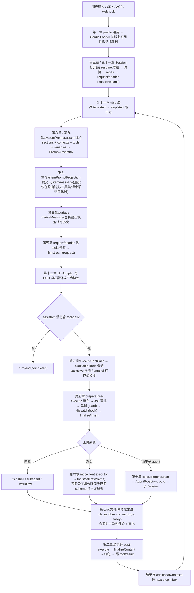

# 第十四章 · 总结结论(DeepSeek Harness 源码分析)

> 分析对象:DeepSeek Harness @ `dbbaa4a37`(仓库根 `D:\.vscode\deepseek-harness`)
> 本章是全套 13 章的收口:先给出可复用的判断,再把各章结论串成一条端到端生命周期,最后列出设计代价与阅读地图。

---

## 第一节 一句话总结

DSH 是**用"插件 + 能力缝 + 事件日志"三条机制替换掉传统 agent 框架里所有"核心模块"的实现**:它没有上下文管理器、没有工具总线、没有 MCP 子系统、没有多智能体框架——这些位置分别由 `systemPrompt` 注册表、`ToolRuntime` 注册表、一个 MCP 桥接插件、一条 subagent 能力缝顶替;所有状态收敛到一条 append-only 的会话事件日志,再由日志派生出模型请求、UI、统计、标题与压缩。

如果只记四条判据,读这套代码时就能预测任何一段实现的行为:

| 不变式 | 内容 | 违反时的表现 | 出处 |
|---|---|---|---|
| **模型可见 ⟺ 已落日志** | 任何进入模型请求的内容必须能从会话日志重建;新增模型可见输入 = 新增 Session 事件 | 开发期不变式断言直接失败 | `AGENTS.md`;`core/agent-loop/src/invariant.ts:40-51` |
| **注册即 effect** | 每个贡献经 `ctx.effect()`/`ctx.on()` 落地,注册返回精确 disposer;fiber 处置即回收 | HMR 后残留注册、测试无法验证移除 | `docs/architecture.md:13`;`core/scope/src/store.ts:226` |
| **能力缝三角色** | 可替换能力恒为 Service Definition / Provider / Consumer 三角色,缺一即不完整 | 出现"有接口没实现"或"实现直接进主循环" | `docs/glossary.md:9` |
| **fail-closed / fail-loud** | 自包含的错配在加载期抛错;安全与策略不可判定时拒绝执行而非放行 | 静默降级、部分可用态长期存在 | `packages/sandbox/sandbox/src/index.ts:152`;`packages/mcp/mcp-client/src/index.ts:150` |

---

## 第二节 一次完整请求的端到端生命周期

把十三章的结论叠在一起,一次用户输入到一次工具结果回流的主链路如下(每一环的深挖章节标注在节点上):

Mermaid 源码

**这条链路里没有"第二套"任何东西**,这是 DSH 最值得学习的工程特征:

- MCP 工具与原生工具共用同一注册表、同一调度器、同一审批管道(第六章 vs 第五章);
- 子 agent 拿到的是**真 Agent**(自己的 Session、scope、工具面与系统提示),不是一次函数调用(第十章);
- 沙箱是"每次调用携带的策略"而不是某个工具的私有逻辑(第七章);
- 三端(cli/web/desktop)、双 SDK、ACP、hooks 全部落在既有能力缝上,没有一条链路自建会话存储或工具管道(第十三章)。

---

## 第三节 与传统单体 agent 架构的横向差异

| 维度 | 传统单体 agent | DeepSeek Harness | 出处 |
|---|---|---|---|
| 扩展方式 | 在内核加 if/else 或改 loop | 挂插件、改 `cordis.yml` 层叠;主循环改动需更新架构文档 | 第一章、第十二章 |
| 能力替换 | 继承/配置开关 | 换 Service Provider(provider 决定行为,Consumer 不变) | 第十二章 |
| 状态真源 | 内存消息数组 + 手写持久化 | append-only 事件日志;其余全是派生折叠 | 第三章、第十一章 |
| 上下文管理 | 一个全局 context 对象 | 组装 / 计量 / 压缩三个独立机制,阈值按 provider+model 路由解析 | 第八章 |
| 提示词 | 模板字符串 + 变量替换 | 按作用域分层的注册表服务,渲染后落日志再派生请求 | 第九章 |
| 工具调用 | loop 内直接 `if (name===...)` 分发 | 分层注册表 + 四段式管道 + 模型序提交调度器 | 第五章 |
| 外部工具(MCP) | 内建子系统或另写适配层 | 一个桥接插件;命名空间、发现、重连全在插件内 | 第六章 |
| 隔离 | 工具自己判路径 | 内核级沙箱 + Windows ACL,策略逐调用携带,不可强制即拒绝 | 第二章、第七章 |
| 多 agent | 递归调用同一函数 | 真 Agent 派生 + worker 线程 workflow + 后台 jobs | 第十章 |
| 文档与类型 | 手写副本易漂移 | Typert 类型图一处定义,驱动 RPC / 校验 / JSON Schema / 文档 | 第十二章 |

---

## 第四节 设计取舍与代价

拆解源码时同样要记录它付出的代价,这些在包 README 与 Agent Note 里有明确自陈:

1. **插件化把复杂度从内核搬到组合层**。排障要读 `cordis.yml` 层叠 + patch 列表;一个插件行为异常,原因可能在别的插件没 `inject` 齐(第一章:激活由服务可用性驱动,行序无语义)。
2. **命名空间花 token**。`mcp__<serverName>__<tool>` 每个名字都占额度;DSH 的判断是描述与 JSON Schema 才是 token 大头,前缀换来稳定身份与 `mcp__*` 策略形态(第六章)。
3. **MCP 服务器是沙箱外的受信代码**。stdio 传输只做环境清洗,进程以完整用户权限运行;因此默认不启用任何 MCP 服务器(第二章、第六章)。
4. **沙箱词表只覆盖文件效果**。网络、进程可见性、设备、凭据不在其内;平台差异以 `enforcement: partial` + `denialSignatures` 如实上报,不假装等价(第七章)。
5. **容器/远程执行不是 provider 而是替换能力缝**。E2B 因此不注册 `ctx.sandbox`,与本地沙箱存在行为差异清单(第七章)。
6. **双 SDK 投影的维护成本被写进纪律**。agent-loop / `SessionEventMap` 改动必须同步更新 TS 与 Python 两份期望输出,`pnpm run test` 都覆盖不到(第十二章)。
7. **重连与崩溃恢复有明确停摆点**。MCP 预算耗尽后注销工具并停摆,恢复只能靠 HMR/重启——用"可预测的停止"换掉"部分可用态"(第六章)。

---

## 第五节 阅读地图

按关注点直达章节;需要函数级实现细节时,进对应的模块子目录(`模块 = 章节结论 + 调用栈/状态机/失败分支/测试证据`)。

| 你想了解 | 章节(结论) | 模块(函数级) |
|---|---|---|
| 程序怎么启动、`dsh` 命令背后发生了什么 | [第一章](./01-architecture-overview.md) | [`plugin-system/02-loader-and-composition.md`](./plugin-system/02-loader-and-composition.md) |
| 插件怎么写、effect 与 HMR 如何运作 | [第一章](./01-architecture-overview.md)、[第十二章](./12-architecture-highlights.md) | [`plugin-system/`](./plugin-system/README.md) |
| 安全边界在哪、哪些代码在沙箱之外 | [第二章](./02-security-analysis.md) | [`sandbox/03-escalation-and-approval.md`](./sandbox/03-escalation-and-approval.md) |
| 会话状态怎么存、为什么"日志即真源" | [第三章](./03-session-memory.md)、[第十一章](./11-persistence.md) | —— |
| 怎么加一个能力(工具/skill/MCP) | [第四](./04-skills.md)/[五](./05-tool-call.md)/[六章](./06-mcp.md) | [`skills/`](./skills/README.md)、[`tool-call/`](./tool-call/README.md)、[`mcp/`](./mcp/README.md) |
| 命令与文件操作的隔离怎么做的 | [第七章](./07-sandbox.md) | [`sandbox/`](./sandbox/README.md) |
| 上下文窗口爆了会怎样 | [第八章](./08-context.md) | —— |
| 系统提示为什么不是一段字符串 | [第九章](./09-prompt.md) | —— |
| 子 agent / workflow / 后台任务 | [第十章](./10-multi-agent.md) | [`multi-agent/`](./multi-agent/README.md) |
| 这个仓库的工程方法论 | [第十二章](./12-architecture-highlights.md) | [`plugin-system/03-capability-seam-anatomy.md`](./plugin-system/03-capability-seam-anatomy.md) |
| 接 SDK、接 IDE、接外部事件 | [第十三章](./13-extensions-ecosystem.md) | —— |

---

## 第六节 结论

1. **DSH 的核心不是"功能多",而是"位置少"**。全仓只有一处模型循环、一处会话日志、一处工具注册表、一处审批管道;所有扩展面都被指向这些既有位置。判断一个改动是否符合该仓库的架构,标准就是:它是否新增了第二个同类位置。
2. **事件日志是这套架构的地基,不是日志功能**。因为模型可见性必须可重建,提示、工具结果、压缩、resume、UI 回放才能共享同一个真源;`SESSION_FORMAT_VERSION` 的相邻迁移规则("永不移动、覆盖、删除已提交代际")正是为这条地基买的保险。
3. **能力缝是"可替换性"的最小完整单位**。三角色齐备才叫能力;只有一半(有接口无 provider,或 provider 直接进 loop)在 DSH 的语境里是未完成状态。
4. **可验证性被当成一等公民**。per-file 100% 覆盖率门、无密钥 snapshot 回放、doc-sync 静态门、Agent Notes 即 RFC——文档与代码不同步在 DSH 是构建错误,而非评审意见。
5. **MCP 这类"生态接入"被处理成普通插件**。它验证了这套架构的可扩展性:一个约 50 KB、4 个源文件的桥接插件,就完整承载了握手、发现、分页、命名、重连、结果投影与安全清洗,而主循环一行未改。这也正是本套文档从第六章切入、再回溯整个内核的原因。

---

## 附:全套章节索引

| 章 | 文件 | 主题 |
|---|---|---|
| 第一章 | [`01-architecture-overview.md`](./01-architecture-overview.md) | 软件架构与程序入口 |
| 第二章 | [`02-security-analysis.md`](./02-security-analysis.md) | 安全分析 |
| 第三章 | [`03-session-memory.md`](./03-session-memory.md) | Session 与 Memory 机制 |
| 第四章 | [`04-skills.md`](./04-skills.md) | Skills 的技术实现与运行方式 |
| 第五章 | [`05-tool-call.md`](./05-tool-call.md) | Tool Call 机制实现细节 |
| 第六章 | [`06-mcp.md`](./06-mcp.md) | MCP 技术架构与原理 |
| 第七章 | [`07-sandbox.md`](./07-sandbox.md) | Sandbox 技术实现与运行机制 |
| 第八章 | [`08-context.md`](./08-context.md) | Context 上下文管理实现细节 |
| 第九章 | [`09-prompt.md`](./09-prompt.md) | Prompt 管理机制与实现细节 |
| 第十章 | [`10-multi-agent.md`](./10-multi-agent.md) | Multi-Agent 机制与实现细节 |
| 第十一章 | [`11-persistence.md`](./11-persistence.md) | Session Storage / Transcript / Resume 持久化机制 |
| 第十二章 | [`12-architecture-highlights.md`](./12-architecture-highlights.md) | 程序架构及亮点 |
| 第十三章 | [`13-extensions-ecosystem.md`](./13-extensions-ecosystem.md) | 扩展生态:Hooks、ACP、Web/Desktop 与 SDK |
| 第十四章 | 本文 | 总结结论 |
