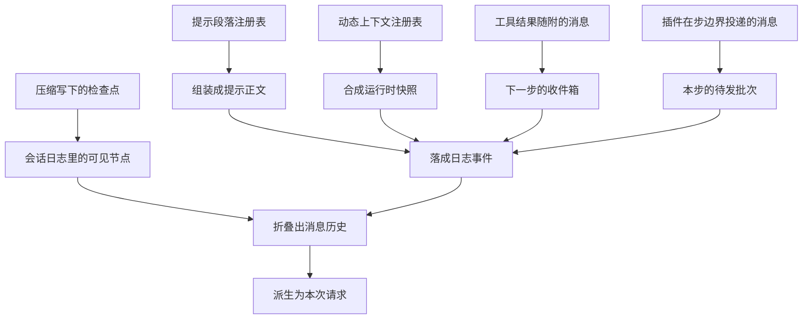

# 上下文来源分层

> 分析对象:[deepseek-ai/deepseek-harness](https://github.com/deepseek-ai/deepseek-harness) @ `dbbaa4a37`

---

模型每步看到的文本不是从一个地方装进来的。提示正文、动态快照、历史消息、工具结果附带的消息、插件在步边界投递的消息、压缩写下的检查点——这六类东西的产生者、生命周期和落盘方式各不相同,混在一起谈就会得出"上下文管理器"这种并不存在的对象。

所以这一篇先把六个来源各自的完整路径钉死:**谁产生、什么时候产生、如何进入请求**。理解了这张来源表,后面五篇讲的就都是它们在同一时刻的合流与取舍。

## 六条来源通道与它们的合流点

先看结论:所有来源最终都变成会话日志上的一条事件,请求再从这个日志派生。也就是说,不管内容从哪里来,它在模型眼里的存在形式都只有一个——日志节点。


<details><summary>Mermaid 源码</summary>



</details>

| 阶段 | 做了什么 | 关键调用(文件:行) |
|---|---|---|
| 段落注册 | 插件把提示正文段落登记进按作用域分层的注册表 | `section()`([`packages/core/system-prompt/src/index.ts:448`](https://github.com/deepseek-ai/deepseek-harness/blob/dbbaa4a37fb9098aba814c97d2956f7b2f105f46/packages/core/system-prompt/src/index.ts#L448)) |
| 上下文注册 | 插件把会变的运行时事实登记成带名字的贡献 | `context()`([`packages/core/system-prompt/src/index.ts:483`](https://github.com/deepseek-ai/deepseek-harness/blob/dbbaa4a37fb9098aba814c97d2956f7b2f105f46/packages/core/system-prompt/src/index.ts#L483)) |
| 每步组装 | 合并 scope 链上的层,求值变量与段落,聚合工具 schema | `assemble()`([`packages/core/system-prompt/src/index.ts:552-627`](https://github.com/deepseek-ai/deepseek-harness/blob/dbbaa4a37fb9098aba814c97d2956f7b2f105f46/packages/core/system-prompt/src/index.ts#L552-L627)) |
| 提示渲染 | 插值变量、丢弃空段落、用空行拼成正文 | `renderPrompt()`([`packages/core/system-prompt/src/index.ts:273-278`](https://github.com/deepseek-ai/deepseek-harness/blob/dbbaa4a37fb9098aba814c97d2956f7b2f105f46/packages/core/system-prompt/src/index.ts#L273-L278)) |
| 快照渲染 | 保留具名贡献,拼成带抬头的整份快照 | `renderContextSections()` / `joinContextSections()`([`packages/core/system-prompt/src/index.ts:312-316`](https://github.com/deepseek-ai/deepseek-harness/blob/dbbaa4a37fb9098aba814c97d2956f7b2f105f46/packages/core/system-prompt/src/index.ts#L312-L316)、`297-301`) |
| 快照去重 | 与上次真正落盘的文本比对,相同就不产生任何事件 | `RuntimeContextProjection.project()`([`packages/core/agent-loop/src/runtime-context.ts:147-158`](https://github.com/deepseek-ai/deepseek-harness/blob/dbbaa4a37fb9098aba814c97d2956f7b2f105f46/packages/core/agent-loop/src/runtime-context.ts#L147-L158)) |
| 落盘 | 提示走 `system/message`,快照与用户批次走 `user/message` | `session.append()`([`packages/core/agent-loop/src/agent.ts:370-377`](https://github.com/deepseek-ai/deepseek-harness/blob/dbbaa4a37fb9098aba814c97d2956f7b2f105f46/packages/core/agent-loop/src/agent.ts#L370-L377)) |
| 派生请求 | 请求的 `messages` 与日志逐字一致,提示只能是 surface 节点 0 | `session.deriveMessages()`([`packages/core/agent-loop/src/agent.ts:603`](https://github.com/deepseek-ai/deepseek-harness/blob/dbbaa4a37fb9098aba814c97d2956f7b2f105f46/packages/core/agent-loop/src/agent.ts#L603))、[`invariant.ts:40-51`](https://github.com/deepseek-ai/deepseek-harness/blob/dbbaa4a37fb9098aba814c97d2956f7b2f105f46/packages/core/agent-loop/src/invariant.ts#L40-L51) |

<details><summary>来源与落点的对应关系</summary>

```text
来源通道                              产生者                进入请求的方式
─────────────────────────────────────────────────────────────────────────────
A 提示段落   systemPrompt.section()   各工具/策略插件        system/message 节点
B 动态上下文 systemPrompt.context()   沙箱/审批/子 agent     user/message 快照节点
C 历史消息   session 日志的 surface   循环自身               deriveMessages() 折叠
D 工具随附   ToolExecutionResult      工具体与后置监听器     下一次 preStep 的 claim
E 插件消息   agent/pre-step 返回      时间/tmux/技能/引用/指令 user/message 本步批次
F 压缩检查点 compactSurfaceRegion()   压缩事务               user/message 区间替换
```

</details>

---

## 一、系统提示段落:注册表经 `system/message` 进入

**谁产生**:任何需要往提示正文写内容的插件。注册入口是 `section()`,而注册这个动作本身就是 Cordis 的 effect——插件卸载,它登记的段落随之消失。

**什么时候产生**:注册在插件装载期发生,但段落文本的求值发生在**每次组装**时。文本可以是字符串,也可以是 `text(context)` 函数;函数形式的段落每步重新求值一次,这就是"按当前状态渲染"的实现方式。

**如何进入请求**:组装结果先被渲染成纯文本,再由循环的 `SystemPromptProjection` 决定这次是追加还是改写,最后统一以 `session.append('system/message', …)` 落盘。请求从日志派生,所以刚落的节点必然出现在本次 `messages` 里。

```typescript
// packages/core/system-prompt/src/index.ts:273-278
export function renderPrompt(assembly: PromptAssembly): string {
  return assembly.sections
    .map(section => interpolate(section, assembly.variables, 'section'))
    .filter(text => text.length > 0)
    .join('\n\n')
}
```

段落位置不由注册顺序决定:一等贡献者向服务要具名位置,序表集中在 `SECTION_ORDERS`([`index.ts:121-154`](https://github.com/deepseek-ai/deepseek-harness/blob/dbbaa4a37fb9098aba814c97d2956f7b2f105f46/packages/core/agent-loop/src/index.ts#L121-L154)),取值入口是 `getSectionOrder()`([`index.ts:464-466`](https://github.com/deepseek-ai/deepseek-harness/blob/dbbaa4a37fb9098aba814c97d2956f7b2f105f46/packages/core/agent-loop/src/index.ts#L464-L466))。渲染按 `order` 升序、同序号按名字的码元序确定。

一个容易误判的边界:**技能目录不是段落**。`tool-skill` 把 `<available_skills>` 当作本步的一条用户消息发布,因为它是"整体替换的清单",语义与"每步重渲染的段落"不同。

---

## 二、动态上下文:注册表经 `user/message` 进入

**谁产生**:需要把"会变的策略/位置事实"告诉模型的插件,注册入口是 `context()`。

**什么时候产生**:同样在每次组装时求值,但排序用另一张序表 `CONTEXT_ORDERS`([`index.ts:159-163`](https://github.com/deepseek-ai/deepseek-harness/blob/dbbaa4a37fb9098aba814c97d2956f7b2f105f46/packages/core/agent-loop/src/index.ts#L159-L163)),只有 `SANDBOX_POLICY: 110`、`APPROVAL_POLICY: 115`、`SUBAGENT_DELEGATION: 120` 三个具名位置。

**如何进入请求**:组装结果不拼进提示正文,而是保留成"具名贡献"列表,再合成一条独立的用户角色消息。

```typescript
// packages/core/system-prompt/src/index.ts:312-316
export function renderContextSections(assembly: PromptAssembly): ContextSnapshotSection[] {
  return assembly.contexts
    .map(context => ({ name: context.name, text: interpolate(context, assembly.variables, 'context') }))
    .filter(section => section.text.length > 0)
}
```

```typescript
// packages/core/system-prompt/src/index.ts:297-301
export function joinContextSections(sections: readonly ContextSnapshotSection[]): string {
  const body = sections.map(section => section.text).join('\n\n')
  if (body.length === 0) return ''
  return `Current runtime context. This snapshot supersedes earlier runtime-context snapshots.\n\n${body}`
}
```

保留成具名二元组(`ContextSnapshotSection` 是 `{ name, text }`,[`packages/llm/llm/src/message.ts:65-70`](https://github.com/deepseek-ai/deepseek-harness/blob/dbbaa4a37fb9098aba814c97d2956f7b2f105f46/packages/llm/llm/src/message.ts#L65-L70))不是为了排序,而是为了让 UI 把一段散文拆回来源而**不需要重新分词**。抬头那句"本快照取代此前的运行时快照"则是模型侧的去歧义声明。

真实贡献者的写法值得抄一遍:审批策略把**当前值**放进 contexts 而不是 sections,理由是"切换策略不该改写稳定的提示缓存前缀"([`packages/interaction/user-approval/src/index.ts:153-155`](https://github.com/deepseek-ai/deepseek-harness/blob/dbbaa4a37fb9098aba814c97d2956f7b2f105f46/packages/interaction/user-approval/src/index.ts#L153-L155));无 agent 时返回空串,裸 `assemble()` 的测试与诊断场景因此拿到空贡献。

| 贡献者 | 名字 | 位置 | 代码 |
|---|---|---|---|
| 沙箱策略 | `sandbox:policy` | 110 | [`packages/sandbox/sandbox-policy/src/index.ts:140-151`](https://github.com/deepseek-ai/deepseek-harness/blob/dbbaa4a37fb9098aba814c97d2956f7b2f105f46/packages/sandbox/sandbox-policy/src/index.ts#L140-L151) |
| 审批策略 | `approval:policy` | 115 | [`packages/interaction/user-approval/src/index.ts:155-167`](https://github.com/deepseek-ai/deepseek-harness/blob/dbbaa4a37fb9098aba814c97d2956f7b2f105f46/packages/interaction/user-approval/src/index.ts#L155-L167) |
| 子 agent 委派说明 | `subagent:delegation` | 120 | [`packages/subagent/subagent/src/child-agent.ts:205-209`](https://github.com/deepseek-ai/deepseek-harness/blob/dbbaa4a37fb9098aba814c97d2956f7b2f105f46/packages/subagent/subagent/src/child-agent.ts#L205-L209) |

---

## 三、会话消息历史:从 surface 折叠

**谁产生**:循环自己,以及其他任何通过 `session.append()` 写入消息类事件的代码。

**什么时候产生**:每一步、每个工具调用、每次压缩提交。

**如何进入请求**:这是唯一"被动"的来源——它不需要被搬运,请求本来就是从它派生的。

`surface` 是"当前对模型可见的事件序列表"这个概念的名字。压缩、裁剪、恢复都会改写它,所以它不是日志的前缀,而是一张独立的顺序表。`deriveMessages()` 读取它并投影成消息序列:

```typescript
// packages/core/agent-loop/src/agent.ts:603
    const boundaryMessages = session.deriveMessages()
```

请求与日志必须逐字一致,这条约定由开发期断言钉死:

```typescript
// packages/core/agent-loop/src/invariant.ts:40-54
    const expected = session.deriveMessages()
    if (JSON.stringify(options.messages) !== JSON.stringify(expected)) {
      fail(`llm request for session "${String(session.id)}" diverges from the dispatch-time durable derivation (log-reconstruction desync)`)
    }

    // The system prompt travels inside `messages` as surface node 0, never as `system`.
    const headerMatches = options.model === header.config.model
      && options.system === undefined
      && options.temperature === header.config.temperature
      && options.maxTokens === header.config.maxTokens
      && JSON.stringify(options.stop) === JSON.stringify(header.config.stop)
      && JSON.stringify(options.tools ?? []) === JSON.stringify(header.tools ?? [])
    if (!headerMatches) {
      fail(`llm request for session "${String(session.id)}" diverges from the folded request header`)
    }
```

由这两条可以推出本模块最重要的一条性质:**想让模型看见什么,就必须先落一条日志事件**。所有"注入上下文"的插件到最后都在做这件事。

---

## 四、工具结果附带的上下文:经收件箱进入下一步

**谁产生**:工具体与后置监听器。`ToolExecutionResult` 与 `PostToolDecision` 两处都能带 `additionalContexts`([`packages/core/tools/src/index.ts:556`](https://github.com/deepseek-ai/deepseek-harness/blob/dbbaa4a37fb9098aba814c97d2956f7b2f105f46/packages/core/tools/src/index.ts#L556)、`568`),所以"拒绝执行 + 附带说明"也能注入上下文。

**什么时候产生**:工具结果提交的那一刻,但**消费在下一次 step**。

**如何进入请求**:结果提交时,循环把这些消息逐条塞进 `inbox` 的 `next-step` 槽尾,下一次 `preStep` 的 `claim()` 一并取走。

```typescript
// packages/core/agent-loop/src/tool-calls.ts:155-158
      // oxlint-disable-next-line typescript/no-non-null-assertion -- bounded index
      appendToolResult(session, turn, step, call!.block, result, callSeqs[committed]!)
      for (const context of result.additionalContexts ?? []) acceptContext(context)
      concluded ||= result.concludesTurn === true
```

```typescript
// packages/core/agent-loop/src/agent.ts:488-491
        const { concluded } = await executeToolCalls(
          this.loopCtx, turn, step, toolCalls, signal,
          context => this.inbox.splice('next-step', this.inbox.nextStep.length, 0, [context]),
        )
```

顺序是稳定的:同一次工具提交里的多条上下文按 `additionalContexts` 的数组序追加,先于下一步任何新到达的消息。`spill-policy` 是这条通道的典型消费者——它把超限的纯文本结果换成预览加通知,同时**原样透传**下游已经声明的附加上下文([`packages/spill/spill-policy/src/index.ts:203`](https://github.com/deepseek-ai/deepseek-harness/blob/dbbaa4a37fb9098aba814c97d2956f7b2f105f46/packages/spill/spill-policy/src/index.ts#L203))。

---

## 五、插件在步边界投递的消息:`agent/pre-step`

**谁产生**:注册在 `agent/pre-step` 上的监听器([`packages/core/agent/src/runtime-types.ts:330`](https://github.com/deepseek-ai/deepseek-harness/blob/dbbaa4a37fb9098aba814c97d2956f7b2f105f46/packages/core/agent/src/runtime-types.ts#L330))。

**什么时候产生**:每个 step 的第一步,即 `preStep` 里那段瀑布。

**如何进入请求**:监听器返回的 `messages` 数组就是本步要落盘的批次。默认实现(链尾)把认领到的批次与本步的运行时快照拼起来;监听器可以在这个结果上再插入或追加。

这条通道有五种真实用法,顺序语义各不相同:

| 插件 | 插入位置 | 触发条件 | 代码 |
|---|---|---|---|
| `time-context` | 追加到尾部 | 每个合格 step,受刷新间隔约束 | [`packages/context/time-context/src/index.ts:211-220`](https://github.com/deepseek-ai/deepseek-harness/blob/dbbaa4a37fb9098aba814c97d2956f7b2f105f46/packages/context/time-context/src/index.ts#L211-L220) |
| `tmux-context` | 插到头部 | 只在乎 `step === 1`,且渲染状态与上次不同 | [`packages/context/tmux-context/src/index.ts:254-263`](https://github.com/deepseek-ai/deepseek-harness/blob/dbbaa4a37fb9098aba814c97d2956f7b2f105f46/packages/context/tmux-context/src/index.ts#L254-L263) |
| `tool-skill` | 追加到尾部 | 目录摘要变化时追加,否则删掉旧目录消息 | [`packages/skill/tool-skill/src/index.ts:242-250`](https://github.com/deepseek-ai/deepseek-harness/blob/dbbaa4a37fb9098aba814c97d2956f7b2f105f46/packages/skill/tool-skill/src/index.ts#L242-L250) |
| `session-reference` | 紧跟被引用的那条消息之后 | 该消息是用户直接输入且含规范化引用 | [`packages/context/session-reference/src/index.ts:153-177`](https://github.com/deepseek-ai/deepseek-harness/blob/dbbaa4a37fb9098aba814c97d2956f7b2f105f46/packages/context/session-reference/src/index.ts#L153-L177) |
| `agent-instructions` | 正好插在认领批次之后 | 工作区指令有变化 | [`packages/context/agent-instructions/src/index.ts:336-340`](https://github.com/deepseek-ai/deepseek-harness/blob/dbbaa4a37fb9098aba814c97d2956f7b2f105f46/packages/context/agent-instructions/src/index.ts#L336-L340) |

顺序不是靠插件自觉:瀑布按注册顺序包裹,`{ prepend: true }` 决定谁在外层;包装型监听器统一用 `{ ...decision, messages }` 保留 `startsRequestSeries` 之类的声明(`agent.ts:363`)。

三条最容易踩的边界:

1. **`step === 1 && decision.messages.length === 0` 时不能投递**。`agent-instructions` 用这个判断避免把纯上下文变成一次独立请求,而是留在收件箱等真正的输入([`index.ts:326-329`](https://github.com/deepseek-ai/deepseek-harness/blob/dbbaa4a37fb9098aba814c97d2956f7b2f105f46/packages/core/agent-loop/src/index.ts#L326-L329))。
2. **投递的消息必须自己声明来源**。`session-reference` 用 `{ kind: 'session-reference', form: 'recall', version: 1, … }`,带完整保留统计,便于 UI 说明"这段是从别的会话搬来的、还删了多少"([`index.ts:339-351`](https://github.com/deepseek-ai/deepseek-harness/blob/dbbaa4a37fb9098aba814c97d2956f7b2f105f46/packages/core/agent-loop/src/index.ts#L339-L351))。
3. **一次投递不等于一次请求**。瀑布的返回值只决定本步要落盘什么;是否真的发起调用由主循环在认领批次为空时另行判断([`agent.ts:294-300`](https://github.com/deepseek-ai/deepseek-harness/blob/dbbaa4a37fb9098aba814c97d2956f7b2f105f46/packages/core/agent-loop/src/agent.ts#L294-L300))。

---

## 六、压缩检查点:区间替换进入历史

**谁产生**:压缩事务。摘要结果被包成一条文本消息,来源由 `compactCheckpointSource(compactionId, sourceCommandId)` 构造。

**什么时候产生**:压力超过阈值,或 provider 明确报告上下文溢出时。

**如何进入请求**:它不追加,而是**替换**——一条 `user/message` 事件带上区间替换意图,把整段区间从 surface 上换成自己。

```typescript
// packages/compaction/compaction-basic/src/region.ts:491-494
  session.append('user/message', checkpointMessage, {
    surfaceOp: { op: 'replace', startSeq: start, endSeq: end },
    sourceEventSeqs: [startEvent.seq, summaryEvent.seq, ...shadowedSeqs],
  })
```

`sourceEventSeqs` 把被遮蔽的每个 seq 都写进事件,于是重放、UI、引用投影都能追溯"这条摘要吞掉了什么"。被替换掉的节点上如果有运行时快照,快照投影会在这一刻失效并在下一步重新追加(见 [03-runtime-context.md](./03-runtime-context.md))。

---

## 七、六条通道的分工

| 通道 | 落点 | 生命周期 | 值变了会怎样 | 典型使用 |
|---|---|---|---|---|
| `section()` | `system/message` | 每步重渲染;值不变则零事件 | 追加新节点或改写头部 | 工具指引、人格、策略正文 |
| `context()` | `user/message` 快照 | 每步重渲染;与上次落盘文本比对 | 追加一条新快照 | 沙箱模式、审批策略、委派说明 |
| surface 历史 | 派生消息序列 | 与日志同寿 | 由压缩/裁剪改写 | 所有对话与工具往返 |
| `additionalContexts` | 下一次 step 的 `user/message` | 一次性,不重放 | — | 工具结果的补充说明 |
| `agent/pre-step` | 本步的 `user/message` | 一次性;不重放 | — | 时间读数、tmux 位置、技能目录、跨会话引用 |
| 压缩检查点 | `user/message` 区间替换 | 直到被再次压缩 | — | 长会话的窗口回收 |

前两条是"状态型",后四条是"事实型"。状态型每次组装都会重算,靠投影判断要不要落盘;事实型一旦落盘就是历史的一部分,只能靠替换或压缩改写。

---

## 关键文件/符号索引

| 文件 | 符号 | 行 | 本模块用途 |
|---|---|---|---|
| [`packages/core/system-prompt/src/index.ts`](https://github.com/deepseek-ai/deepseek-harness/blob/dbbaa4a37fb9098aba814c97d2956f7b2f105f46/packages/core/system-prompt/src/index.ts) | `SECTION_ORDERS` | 121-154 | 提示段落的具名位置表 |
| 同上 | `CONTEXT_ORDERS` | 159-163 | 动态上下文的具名位置表 |
| 同上 | `renderPrompt` | 273-278 | 段落插值、丢空、拼接 |
| 同上 | `renderContextSnapshot` | 285-287 | 动态上下文整份渲染的便捷入口 |
| 同上 | `joinContextSections` | 297-301 | 给已渲染的具名贡献加固定抬头 |
| 同上 | `renderContextSections` | 312-316 | 保留归属性地渲染上下文 |
| 同上 | `section` / `context` / `tools` / `variable` | 448 / 483 / 515 / 531 | 四类贡献的注册入口 |
| 同上 | `assemble` | 552-627 | 每步一次的编排 |
| [`packages/core/agent-loop/src/agent.ts`](https://github.com/deepseek-ai/deepseek-harness/blob/dbbaa4a37fb9098aba814c97d2956f7b2f105f46/packages/core/agent-loop/src/agent.ts) | `preStep` | 240-259 | 合流点 |
| 同上 | `step` | 352-497 | 落盘与派生请求 |
| 同上 | `buildRequest` | 553-618 | `request/header` 与 `request/context` |
| [`packages/core/agent-loop/src/runtime-context.ts`](https://github.com/deepseek-ai/deepseek-harness/blob/dbbaa4a37fb9098aba814c97d2956f7b2f105f46/packages/core/agent-loop/src/runtime-context.ts) | `SOURCE` / `CLEARED` | 14-15 | 快照来源标识与清空哨兵 |
| 同上 | `isOwned` / `textOf` | 17-24 | 判定快照归属、取单块文本 |
| 同上 | `RuntimeContextProjection.project` | 147-158 | 快照去重 |
| [`packages/core/agent-loop/src/tool-calls.ts`](https://github.com/deepseek-ai/deepseek-harness/blob/dbbaa4a37fb9098aba814c97d2956f7b2f105f46/packages/core/agent-loop/src/tool-calls.ts) | `commitReady` | 147-161 | 结果提交与附加上下文回流 |
| [`packages/core/agent-loop/src/invariant.ts`](https://github.com/deepseek-ai/deepseek-harness/blob/dbbaa4a37fb9098aba814c97d2956f7b2f105f46/packages/core/agent-loop/src/invariant.ts) | `install` | 19-57 | 请求必须由日志重建 |
| [`packages/llm/llm/src/message.ts`](https://github.com/deepseek-ai/deepseek-harness/blob/dbbaa4a37fb9098aba814c97d2956f7b2f105f46/packages/llm/llm/src/message.ts) | `ContextSnapshotSection` | 65-70 | 具名贡献的二元组 |
| 同上 | `ContextFormed` | 81-96 | `instructions` / `catalog` / `snapshot` / `notice` / `relay` / `recall` 词表 |
| [`packages/core/agent/src/runtime-types.ts`](https://github.com/deepseek-ai/deepseek-harness/blob/dbbaa4a37fb9098aba814c97d2956f7b2f105f46/packages/core/agent/src/runtime-types.ts) | `agent/pre-step` | 330 | 步边界扩展点声明 |
| [`packages/core/agent/src/dispatch.ts`](https://github.com/deepseek-ai/deepseek-harness/blob/dbbaa4a37fb9098aba814c97d2956f7b2f105f46/packages/core/agent/src/dispatch.ts) | `assembleContextFor` | 174-176 | agent 与 scope 一并设置 |
