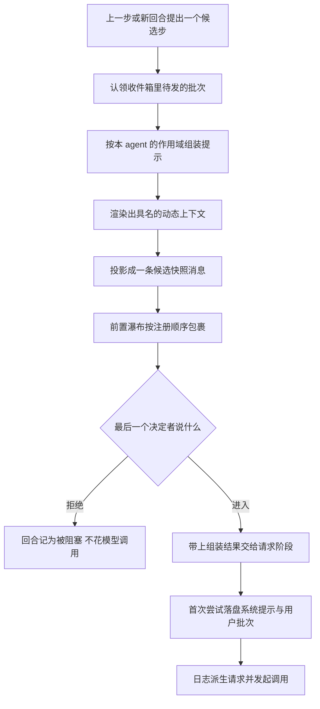

# 每步组装:`preStep()` 的完整序列

> 分析对象:[deepseek-ai/deepseek-harness](https://github.com/deepseek-ai/deepseek-harness) @ `dbbaa4a37`

---

一个 step 开始之前,循环必须把"这一步要发给模型什么"定下来。这件事被压缩在 `preStep()` 里,只有二十行,顺序固定:**认领收件箱 → 组装提示 → 渲染动态上下文 → 投影快照 → 过一遍可拒绝的瀑布**。

这一篇把这条链逐段拆开,重点不在"调用了谁",而在每段的**失败与拒绝语义**:哪一步抛错会让整个回合挂掉,哪一步只会让本步退回默认结果,以及为什么组装结果要跟着决策一起传下去、而不是在请求阶段重新算一遍。

## 一个 step 是怎么被定下来的

先说人话。循环每提出一个候选步,就先把它这一步该收的消息从收件箱里取走——这个动作是破坏性的,取走了就不会再放回去。然后它按当前 agent 的作用域组装一次提示,顺手把动态上下文渲染成一条候选快照。接着把"认领到的消息 + 候选快照"交给一组插件监听器,它们可以改写、可以拒绝。拿到最终决策后,如果没被拒绝,组装结果就跟着决策一起进入请求阶段。


<details><summary>Mermaid 源码</summary>



</details>

| 阶段 | 做了什么 | 关键调用(文件:行) |
|---|---|---|
| 阶段前置 | 确认这个 agent 正处于运行阶段,否则抛错 | `agent.ts:242` |
| 认领 | 清空 `next-step`,按需再取一条 `next-turn` | `inbox.claim()`([`packages/core/agent-loop/src/inbox.ts:111-116`](https://github.com/deepseek-ai/deepseek-harness/blob/dbbaa4a37fb9098aba814c97d2956f7b2f105f46/packages/core/agent-loop/src/inbox.ts#L111-L116)) |
| 组装 | 按 agent 作用域合并层、求值变量段落、聚合工具 schema | `assemble()`([`packages/core/system-prompt/src/index.ts:552-627`](https://github.com/deepseek-ai/deepseek-harness/blob/dbbaa4a37fb9098aba814c97d2956f7b2f105f46/packages/core/system-prompt/src/index.ts#L552-L627)) |
| 取消检查 | 组装完立刻检查中止信号,已取消则抛出 | `agent.ts:246` |
| 上下文渲染 | 把动态上下文渲染成具名贡献列表 | `renderContextSections()`([`packages/core/system-prompt/src/index.ts:312-316`](https://github.com/deepseek-ai/deepseek-harness/blob/dbbaa4a37fb9098aba814c97d2956f7b2f105f46/packages/core/system-prompt/src/index.ts#L312-L316)) |
| 快照投影 | 与上次落盘文本比对,相同则返回 `undefined` | `RuntimeContextProjection.project()`([`packages/core/agent-loop/src/runtime-context.ts:147-158`](https://github.com/deepseek-ai/deepseek-harness/blob/dbbaa4a37fb9098aba814c97d2956f7b2f105f46/packages/core/agent-loop/src/runtime-context.ts#L147-L158)) |
| 瀑布 | 把认领批次与本步位置交给插件改写,默认实现把快照排在批次之后 | `agent/pre-step`([`packages/core/agent-loop/src/agent.ts:249-255`](https://github.com/deepseek-ai/deepseek-harness/blob/dbbaa4a37fb9098aba814c97d2956f7b2f105f46/packages/core/agent-loop/src/agent.ts#L249-L255)) |
| 取消检查 | 瀑布之后再次检查中止信号 | [`agent.ts:256`](https://github.com/deepseek-ai/deepseek-harness/blob/dbbaa4a37fb9098aba814c97d2956f7b2f105f46/packages/core/agent-loop/src/agent.ts#L256) |
| 拒绝短路 | 返回 `reject` 时不做后续包装,直接交回合处理 | [`agent.ts:257`](https://github.com/deepseek-ai/deepseek-harness/blob/dbbaa4a37fb9098aba814c97d2956f7b2f105f46/packages/core/agent-loop/src/agent.ts#L257) |
| 携带组装 | 把 assembly 挂到决策对象上 | [`agent.ts:258`](https://github.com/deepseek-ai/deepseek-harness/blob/dbbaa4a37fb9098aba814c97d2956f7b2f105f46/packages/core/agent-loop/src/agent.ts#L258) |

<details><summary>原始实现</summary>

```typescript
// packages/core/agent-loop/src/agent.ts:240-259
  private async preStep(target: InboxTarget, position: { turn: number; step: number }): Promise<PreparedStep> {
    /* v8 ignore next -- private callers establish the running phase before proposing a step */
    if (this.phase.kind !== 'running') throw new Error(`agent "${this.id}": pre-step outside running phase`)
    const signal = this.phase.abort.signal
    const claimed = this.inbox.claim(target, position.turn)
    const assembly = await this.loopCtx.systemPrompt.assemble(assembleContextFor(this, signal))
    signal.throwIfAborted()
    const sections = renderContextSections(assembly)
    const context = this.runtimeContext.project(joinContextSections(sections), sections)
    const decision = await this.dispatch.waterfall(
      'agent/pre-step', { messages: claimed, ...position, signal },
      (): Promise<PreStepDecision> => Promise.resolve<PreStepDecision>({
        kind: 'enter',
        messages: context === undefined ? claimed : [...claimed, context],
      }),
    )
    signal.throwIfAborted()
    if (decision.kind === 'reject') return decision
    return { ...decision, assembly }
  }
```

</details>

---

## 一、认领:`claim()` 是破坏性操作

认领的语义是"这一步要用的消息,现在就从收件箱里拿走"。它先整段清空 `next-step`,再在需要开新回合时额外取走一条 `next-turn`。

```typescript
// packages/core/agent-loop/src/inbox.ts:105-116
  /**
   * Remove and return the complete batch proposed for one step.
   * @param target - whether this boundary also consumes one queued turn.
   * @param turn - turn that will own the claimed batch.
   * @returns next-step input followed by the queued turn, when requested.
   */
  claim(target: InboxTarget, turn: number): UserMessage[] {
    const claimed = this.mutate('next-step', 0, this.nextStep.length, [], false)
    if (target === 'next-turn') claimed.push(...this.mutate('next-turn', 0, 1, [], false))
    for (const message of claimed) this.dispatch.emit('agent/inbox/claimed', { message, turn })
    return claimed
  }
```

三个要点:

1. **顺序稳定**:返回的是"`next-step` 的全部内容,接上一条队列消息"。`next-step` 槽里装的正是上一步工具结果附带的上下文,所以它们排在队列消息之前。
2. **可重放**:收件箱本身不是内存变量,而是从 `agent/inbox/spliced` 事件折叠出来的两个数组([`inbox.ts:27-65`](https://github.com/deepseek-ai/deepseek-harness/blob/dbbaa4a37fb9098aba814c97d2956f7b2f105f46/packages/core/agent-loop/src/inbox.ts#L27-L65))。折叠时会拒绝重复的消息 id,拼写错误的历史在重建时就报错。
3. **认领失败会抛**:若折叠状态不可读,`current()` 直接抛 `cannot read inbox state: its projection registration is not active`([`inbox.ts:191-196`](https://github.com/deepseek-ai/deepseek-harness/blob/dbbaa4a37fb9098aba814c97d2956f7b2f105f46/packages/core/agent-loop/src/inbox.ts#L191-L196))。这是内部一致性错误,不该被吞掉。

回合的第一次认领用 `'next-turn'`,之后每一步都用 `'next-step'`([`agent.ts:284`](https://github.com/deepseek-ai/deepseek-harness/blob/dbbaa4a37fb9098aba814c97d2956f7b2f105f46/packages/core/agent-loop/src/agent.ts#L284)、`320`)。这个切换决定了"哪一步消费排队消息"。

---

## 二、组装:作用域必须与 agent 一起给出

组装本身在提示侧完成,这里只关心它的**入参**。

```typescript
// packages/core/agent/src/dispatch.ts:167-176
/**
 * Build the prompt assembly context with agent and scope set together, so
 * agent-scoped prompt and tool contributions cannot be silently omitted.
 * @param agent - the agent the assembly is for.
 * @param signal - the current turn's explicit control signal, when assembly belongs to a turn.
 * @returns the context to pass to `assemble()`.
 */
export function assembleContextFor(agent: Agent, signal?: AbortSignal): AssembleContext {
  return { agent, scope: agent, ...signal === undefined ? {} : { signal } }
}
```

`assembleContextFor()` 把 `agent` 与 `scope` **一起**设成同一个对象。这不是冗余:作用域链决定本次能看到哪些层,而 `agent` 是段落文本函数与瀑布监听器读取当前会话状态的入口。若只传其一,agent 级贡献会被静默漏掉,而错误表现是"提示少了一段",极难定位。函数注释把这条理由写在了原地。

`signal` 是可选的:直接调用 `assemble()` 的诊断与测试场景没有回合信号。

---

## 三、渲染与投影:先算文本,再决定要不要落盘

两行代码,顺序不能换:

```typescript
// packages/core/agent-loop/src/agent.ts:247-248
    const sections = renderContextSections(assembly)
    const context = this.runtimeContext.project(joinContextSections(sections), sections)
```

- `renderContextSections()` 产出**具名贡献列表**,每个元素保留"这段文字由哪个子系统贡献"。
- `joinContextSections()` 在其上加一句固定抬头,拼成整份快照文本。
- `project()` 拿这两个值做一次比对:与上次真正落盘的文本相同就返回 `undefined`,不同才构造一条候选消息。

分两步调而不是直接用 `renderContextSnapshot()`,是因为后者内部会把两者串起来——那样调用方就拿不到具名列表,UI 也就无法把散文拆回来源。前置渲染一次、两处复用,省掉一次逐 context 的插值。

`project()` 返回 `undefined` 的含义是"这一步不需要新快照",此时默认决策直接用 `claimed`;返回消息时才把它排到 `claimed` 之后。**顺序是有意的**:用户直接输入在前,系统动态快照在后。

投影的完整状态机、恢复逻辑与失效判定见 [03-runtime-context.md](./03-runtime-context.md)。

---

## 四、瀑布:返回值由最后一个决定者给出

`agent/pre-step` 的声明把契约写全了:

```typescript
// packages/core/agent/src/runtime-types.ts:319-330
    /**
     * Reject a proposed step or replace the messages that enter it. Calling
     * `next()` preserves the current messages.
     * @param payload.agent - the agent proposing the step.
     * @param payload.messages - messages removed from the inbox for this step.
     * @param payload.turn - the turn that will own the step.
     * @param payload.step - the step proposed by the loop.
     * @param payload.signal - the current turn's cancellation signal.
     * Scope-filtered dispatch (`@deepseek-ai/dsh-scope`): agent-scoped listeners receive only that agent.
     * @mode waterfall
     */
    'agent/pre-step'(this: Scoped<Agent>, payload: { agent: Agent; messages: UserMessage[]; turn: number; step: number; signal: AbortSignal }, next: () => Promise<PreStepDecision>): Promise<PreStepDecision>
```

决策类型只有两个分支:

```typescript
// packages/core/agent/src/runtime-types.ts:111-119
/** Whether and with which messages the loop enters a proposed step. */
export type PreStepDecision =
  | { kind: 'reject' }
  | {
    kind: 'enter'
    messages: UserMessage[]
    /** Start a distinct model-message series before this step's admitted messages. */
    startsRequestSeries?: true
  }
```

三条必须记住的规则:

1. **不调用 `next()` 就是短路整条链**。瀑布语义里,监听器返回什么就是最终结果,链尾的默认实现根本不会跑。
2. **包装型监听器必须展开原决策**。`{ ...decision, messages }` 这种写法保留了 `startsRequestSeries`;直接返回 `{ kind: 'enter', messages }` 会把它丢掉,进而影响系统提示是追加还是改写。
3. **`signal.aborted` 时应原样返回**。多数监听器在 `next()` 之后先检查 `decision.kind === 'reject' || signal.aborted`,再决定是否追加内容。

`compaction-basic` 在这个扩展点上做了一件特殊的事:它在调用 `next()` **之前**检查压力。原因是它要改写的不是本步消息,而是整段 surface 区间,所以必须在决策成型前完成。

```typescript
// packages/compaction/compaction-basic/src/index.ts:148-166
    ctx.on('agent/pre-step', async (
      { agent, signal },
      next,
    ): Promise<PreStepDecision> => {
      if (!signal.aborted) {
        try {
          const result = await this.compactIfNeeded(agent, 'pressure', signal)
          if (result !== null) logResult(result, 'step pressure')
        } catch (error: unknown) {
          if (error instanceof TargetPressureConfigError) {
            if (this.warnedPressureConfigTargets.has(error.targetKey)) return next()
            this.warnedPressureConfigTargets.add(error.targetKey)
          }
          const message = error instanceof Error ? error.message : String(error)
          ctx.logger.warn(`step compaction failed: ${message}; continuing the turn`)
        }
      }
      return next()
    })
```

注意这里**无条件 `return next()`**:压缩失败不阻断回合,只降级成 warning。这条取舍的理由是"上下文的收益不值得赔上一个可用回合"。

---

## 五、失败与拒绝语义

把这条链上可能出现的结果列全,才能判断一处异常该改在哪里。

| 情况 | 触发点 | 后果 | 依据 |
|---|---|---|---|
| 阶段不对 | `phase.kind !== 'running'` | 抛错,视为内部调用错误 | [`agent.ts:241-242`](https://github.com/deepseek-ai/deepseek-harness/blob/dbbaa4a37fb9098aba814c97d2956f7b2f105f46/packages/core/agent-loop/src/agent.ts#L241-L242) |
| 收件箱状态不可读 | 投影未注册 | 抛错 | [`inbox.ts:191-196`](https://github.com/deepseek-ai/deepseek-harness/blob/dbbaa4a37fb9098aba814c97d2956f7b2f105f46/packages/core/agent-loop/src/inbox.ts#L191-L196) |
| 组装失败 | `assemble()` 内(未知变量、多于一个 complete 段落等) | 抛出,回合记为 `error` | [`agent.ts:322-335`](https://github.com/deepseek-ai/deepseek-harness/blob/dbbaa4a37fb9098aba814c97d2956f7b2f105f46/packages/core/agent-loop/src/agent.ts#L322-L335) |
| 组装后已取消 | `signal.throwIfAborted()` | 抛出,回合记为 `aborted` | [`agent.ts:246`](https://github.com/deepseek-ai/deepseek-harness/blob/dbbaa4a37fb9098aba814c97d2956f7b2f105f46/packages/core/agent-loop/src/agent.ts#L246)、`323-325` |
| 瀑布后已取消 | 同上 | 同上 | [`agent.ts:256`](https://github.com/deepseek-ai/deepseek-harness/blob/dbbaa4a37fb9098aba814c97d2956f7b2f105f46/packages/core/agent-loop/src/agent.ts#L256) |
| 插件拒绝 | 监听器返回 `{ kind: 'reject' }` | 不做后续包装,回合记为 `blocked`,不花模型调用 | [`agent.ts:257`](https://github.com/deepseek-ai/deepseek-harness/blob/dbbaa4a37fb9098aba814c97d2956f7b2f105f46/packages/core/agent-loop/src/agent.ts#L257)、`290-293` |
| 压缩失败 | 压力分支内 | warning,回合照常继续 | `compaction-basic/index.ts:156-163` |
| 认领后决策为空 | `decision.messages.length === 0` | 首步直接记为 `completed`,不发起调用 | [`agent.ts:294-300`](https://github.com/deepseek-ai/deepseek-harness/blob/dbbaa4a37fb9098aba814c97d2956f7b2f105f46/packages/core/agent-loop/src/agent.ts#L294-L300) |

最后一条容易被忽略,但它解释了为什么"纯上下文不会变成一次独立请求":

```typescript
// packages/core/agent-loop/src/agent.ts:294-300
        if (turnEnds && decision.messages.length === 0) break
        // A removed waking message or an enter decision rewritten to empty
        // still owns the initial turn boundary, but it spends no model call.
        if (phase.step === 0 && decision.messages.length === 0) {
          turnEnds = { kind: 'completed' }
          return false
        }
```

`agent-instructions` 正是靠这个语义决定"上下文先欠着"(`agent-instructions/index.ts:326-329`):如果首步的认领批次为空,它不把工作区指令插进 `decision.messages`,而是留在收件箱里等真正的输入到达。

被拒绝的回合走另一条路:

```typescript
// packages/core/agent-loop/src/agent.ts:289-293
        const decision = await this.preStep(target, { turn, step })
        if (decision.kind === 'reject') {
          turnEnds = { kind: 'blocked' }
          return false
        }
```

---

## 六、一次组装、多次尝试

`preStep()` 返回的决策类型里带着 assembly:

```typescript
// packages/core/agent-loop/src/agent.ts:53-60
type PreparedStep =
  | { kind: 'reject' }
  | {
    kind: 'enter'
    messages: UserMessage[]
    startsRequestSeries?: true
    assembly: PromptAssembly
  }
```

这是"组装一次、重试多次"的实现方式。请求阶段的重试循环里,提示渲染在循环**外**:

```typescript
// packages/core/agent-loop/src/agent.ts:358-378
    const { assembly } = decision
    const renderedPrompt = renderPrompt(assembly)
    let firstAttempt = true
    while (true) {
      const { config, preparedCall } = await this.prepareRequest(turn, step, signal)
      const startsRequestSeries = firstAttempt && decision.startsRequestSeries === true
      const commits = this.systemPrompt.project(renderedPrompt, {
        inHistory: preparedCall?.systemPromptUpdate === 'in-history',
        startsSeries: startsRequestSeries
          || this.requestSurfaceGeneration !== this.session.surface.replaceGeneration
          || this.toolsChanged(assembly.tools),
      })
      for (const { message, intent } of commits) {
        this.session.append('system/message', { turn, step, message }, intent)
      }
      if (firstAttempt) {
        for (const message of decision.messages) {
          this.session.append('user/message', message, { surfaceOp: 'append' })
        }
      }
      firstAttempt = false
```

由此得到三条不对称,它们都是有意的:

1. **`assemble()` 与 `agent/pre-step` 不因一次重试而重跑**。重试的成因通常是 provider 侧错误(例如上下文溢出),而重试前发生的压缩会改写 surface——所以 `systemPrompt.project()` 每次尝试都重新对账,但组装结果保持稳定。
2. **用户消息只在首次尝试追加一次**。它们一旦进入就是本步输入,重试不该重复它们。
3. **系统提示节点可以新增或替换**。决定它走哪条路的是三个条件的并集:pre-step 显式声明了 `startsRequestSeries`、surface 自上次请求后被替换过、或本次组装出的工具 schema 与已落日志的 header 不同。

第三者的实现很短:

```typescript
// packages/core/agent-loop/src/agent.ts:261-266
  /** Whether the assembled tool schemas differ from the logged request header's. */
  private toolsChanged(tools: PromptAssembly['tools']): boolean {
    const baseline = this.session.requestHeader()
    if (baseline === undefined) return false
    return !headerEquals(baseline, canonicalHeader({ ...baseline, tools: [...tools] }))
  }
```

---

## 关键文件/符号索引

| 文件 | 符号 | 行 | 本模块用途 |
|---|---|---|---|
| [`packages/core/agent-loop/src/agent.ts`](https://github.com/deepseek-ai/deepseek-harness/blob/dbbaa4a37fb9098aba814c97d2956f7b2f105f46/packages/core/agent-loop/src/agent.ts) | `PreparedStep` | 53-60 | 决策类型;`enter` 分支携带 assembly |
| 同上 | `preStep` | 240-259 | 本模块主链路 |
| 同上 | `toolsChanged` | 261-266 | 工具 schema 变化判定 |
| 同上 | `turn` | 269-350 | 回合循环、`target` 切换、`blocked` 与 `error` 归因 |
| 同上 | `step` | 352-497 | 渲染一次、重试多次、落盘顺序 |
| 同上 | `prepareRequest` | 501-550 | 解析路由与适配器默认值 |
| 同上 | `buildRequest` | 553-618 | 写 `request/header` / `request/context` |
| [`packages/core/agent-loop/src/inbox.ts`](https://github.com/deepseek-ai/deepseek-harness/blob/dbbaa4a37fb9098aba814c97d2956f7b2f105f46/packages/core/agent-loop/src/inbox.ts) | `claim` | 111-116 | 破坏性认领 |
| 同上 | `inboxProjectionDefinition` | 27-65 | 收件箱的可重放折叠与重复 id 拒绝 |
| 同上 | `mutate` | 201-246 | 归一化 splice、发出插入与丢弃事件 |
| [`packages/core/agent/src/dispatch.ts`](https://github.com/deepseek-ai/deepseek-harness/blob/dbbaa4a37fb9098aba814c97d2956f7b2f105f46/packages/core/agent/src/dispatch.ts) | `assembleContextFor` | 174-176 | agent 与 scope 一并设置 |
| [`packages/core/agent/src/runtime-types.ts`](https://github.com/deepseek-ai/deepseek-harness/blob/dbbaa4a37fb9098aba814c97d2956f7b2f105f46/packages/core/agent/src/runtime-types.ts) | `PreStepDecision` | 111-119 | `reject` / `enter` 两分支 |
| 同上 | `agent/pre-step` | 319-330 | 瀑布扩展点声明与作用域过滤说明 |
| [`packages/core/system-prompt/src/index.ts`](https://github.com/deepseek-ai/deepseek-harness/blob/dbbaa4a37fb9098aba814c97d2956f7b2f105f46/packages/core/system-prompt/src/index.ts) | `assemble` | 552-627 | 每步一次的编排 |
| 同上 | `renderContextSections` | 312-316 | 具名贡献列表 |
| 同上 | `joinContextSections` | 297-301 | 加固定抬头拼成整份快照 |
| [`packages/core/agent-loop/src/runtime-context.ts`](https://github.com/deepseek-ai/deepseek-harness/blob/dbbaa4a37fb9098aba814c97d2956f7b2f105f46/packages/core/agent-loop/src/runtime-context.ts) | `RuntimeContextProjection.project` | 147-158 | 快照去重与候选消息构造 |
| [`packages/compaction/compaction-basic/src/index.ts`](https://github.com/deepseek-ai/deepseek-harness/blob/dbbaa4a37fb9098aba814c97d2956f7b2f105f46/packages/compaction/compaction-basic/src/index.ts) | 压力触发器 | 148-166 | 在 `next()` 之前压缩;失败降级为 warning |
