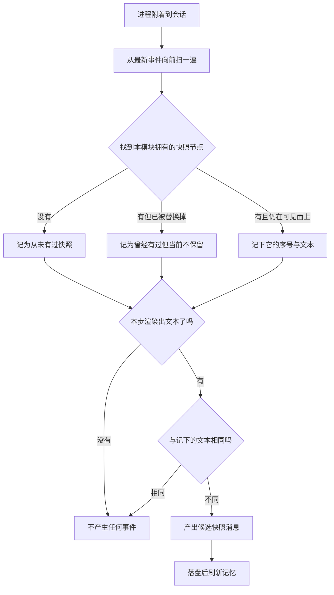

# 运行时上下文投影

> 分析对象:[deepseek-ai/deepseek-harness](https://github.com/deepseek-ai/deepseek-harness) @ `dbbaa4a37`

---

运行时上下文(runtime context)指的是"当前这一刻的环境事实"——沙箱模式是什么、审批策略开没开、这个 agent 是不是被委派出来的。它们不适合写进系统提示正文:值一变,提示前缀就得重写,缓存全废。所以它们走另一条路,作为一条独立的用户角色快照消息存在。

`RuntimeContextProjection` 负责的是**这条快照该不该发**。它不拥有提交动作,也不缓存渲染结果,只记住"上一次真正落盘的快照文本是什么"。这个记忆是三个状态,而不是两个——区分"从未有过快照"和"有过但当前不保留",正是压缩吃掉快照后能自动重发的关键。

## 三个状态与一次恢复


<details><summary>Mermaid 源码</summary>



</details>

| 阶段 | 做了什么 | 关键调用(文件:行) |
|---|---|---|
| 归属判定 | 只认来源插件为本模块、且内容恰好是单个文本块的用户消息 | `isOwned()` / `textOf()`([`packages/core/agent-loop/src/runtime-context.ts:17-24`](https://github.com/deepseek-ai/deepseek-harness/blob/dbbaa4a37fb9098aba814c97d2956f7b2f105f46/packages/core/agent-loop/src/runtime-context.ts#L17-L24)) |
| 恢复扫描 | 从最新事件倒序找第一条本模块拥有且仍在 surface 上的快照;先无条件把状态置为"当前不保留" | 构造函数([`runtime-context.ts:118-127`](https://github.com/deepseek-ai/deepseek-harness/blob/dbbaa4a37fb9098aba814c97d2956f7b2f105f46/packages/core/agent-loop/src/runtime-context.ts#L118-L127)) |
| 反向扫描 | 通过 `snapshotEvents()` 取全部事件再反转,命中首条即停 | `eventsNewestFirst()`([`runtime-context.ts:47-50`](https://github.com/deepseek-ai/deepseek-harness/blob/dbbaa4a37fb9098aba814c97d2956f7b2f105f46/packages/core/agent-loop/src/runtime-context.ts#L47-L50)) |
| 跟随事件 | 订阅 `session/event`:本模块新发的快照刷新记忆 | [`runtime-context.ts:129-138`](https://github.com/deepseek-ai/deepseek-harness/blob/dbbaa4a37fb9098aba814c97d2956f7b2f105f46/packages/core/agent-loop/src/runtime-context.ts#L129-L138) |
| 失效判定 | 替换类事件且 `sourceEventSeqs` 命中当前记忆的序号,则置回"不保留" | `isReplacementSurfaceEvent`([`packages/core/session/src/surface.ts:73-77`](https://github.com/deepseek-ai/deepseek-harness/blob/dbbaa4a37fb9098aba814c97d2956f7b2f105f46/packages/core/session/src/surface.ts#L73-L77)) |
| 去重投影 | 与记忆文本相同就返回 `undefined`,不同才构造候选消息 | `project()`([`runtime-context.ts:147-158`](https://github.com/deepseek-ai/deepseek-harness/blob/dbbaa4a37fb9098aba814c97d2956f7b2f105f46/packages/core/agent-loop/src/runtime-context.ts#L147-L158)) |
| 清空哨兵 | 渲染结果为空但曾经有过快照时,发固定清空语句 | `CLEARED`([`runtime-context.ts:15`](https://github.com/deepseek-ai/deepseek-harness/blob/dbbaa4a37fb9098aba814c97d2956f7b2f105f46/packages/core/agent-loop/src/runtime-context.ts#L15)) |

<details><summary>原始实现</summary>

```typescript
// packages/core/agent-loop/src/runtime-context.ts:108-159
/** Tracks the last retained runtime-context snapshot without owning its commit. */
export class RuntimeContextProjection {
  /** `undefined` means no snapshot ever existed; `null` means none is retained. */
  private retained: { seq: SessionSeq; text: string | undefined } | null | undefined

  /**
   * Restore projection state once, then follow authoritative session events.
   * @param ctx - agent-scoped event context.
   * @param session - session receiving projected messages.
   */
  constructor(ctx: Context, session: Session) {
    const surface = new Set(session.surface.nodes)
    for (const event of eventsNewestFirst(session)) {
      if (event.type !== 'user/message' || !isOwned(event.data)) continue
      this.retained ??= null
      if (surface.has(event.seq)) {
        this.retained = { seq: event.seq, text: textOf(event.data) }
        break
      }
    }

    ctx.on('session/event', (subject, event) => {
      if (subject !== session) return
      if (event.type === 'user/message' && isOwned(event.data)) {
        this.retained = { seq: event.seq, text: textOf(event.data) }
      } else if (this.retained
        && isReplacementSurfaceEvent(event)
        && event.sourceEventSeqs?.includes(this.retained.seq) === true) {
        this.retained = null
      }
    })
  }

  /**
   * Create an uncommitted snapshot only when the retained value differs.
   * @param current - fully rendered dynamic context.
   * @param sections - named contributions that formed the current snapshot.
   * @returns a candidate user message, or `undefined` when no update is needed.
   */
  project(current: string, sections: readonly ContextSnapshotSection[]): UserMessage | undefined {
    if (this.retained === undefined && current.length === 0) return
    const snapshot = current.length === 0 ? CLEARED : current
    if (this.retained?.text === snapshot) return
    return createUserMessage({
      content: [{ type: 'text', text: snapshot }],
      // The cleared marker has no contributions left to attribute.
      source: sections.length === 0
        ? { kind: 'plugin', plugin: SOURCE }
        : { kind: 'plugin', plugin: SOURCE, form: 'snapshot', sections },
    })
  }
}
```

</details>

---

## 一、快照里到底装了什么

这条通道的内容**只来自注册表**。`systemPrompt.context()` 登记的贡献在每次组装时求值,排序后合成整份快照。当前仓库里的贡献者只有三个:

| 贡献者 | 名字 | 位置 | 装的是什么 |
|---|---|---|---|
| 沙箱策略 | `sandbox:policy` | 110 | 当前文件策略与工作区根,例如 `Current DSH file policy: workspace-write. …`([`packages/sandbox/sandbox-policy/src/index.ts:41-55`](https://github.com/deepseek-ai/deepseek-harness/blob/dbbaa4a37fb9098aba814c97d2956f7b2f105f46/packages/sandbox/sandbox-policy/src/index.ts#L41-L55)) |
| 审批策略 | `approval:policy` | 115 | 当前会话是"必须问"还是"一律拒绝"([`packages/interaction/user-approval/src/index.ts:66-68`](https://github.com/deepseek-ai/deepseek-harness/blob/dbbaa4a37fb9098aba814c97d2956f7b2f105f46/packages/interaction/user-approval/src/index.ts#L66-L68)) |
| 子 agent 委派 | `subagent:delegation` | 120 | 该 agent 是委派出来的,权限范围已冻结([`packages/subagent/subagent/src/child-agent.ts:171-175`](https://github.com/deepseek-ai/deepseek-harness/blob/dbbaa4a37fb9098aba814c97d2956f7b2f105f46/packages/subagent/subagent/src/child-agent.ts#L171-L175)) |

这里有一个必须澄清的边界:**工作区事实、跨会话引用、时间读数都不是这条通道**。

- **工作区事实**里"文件策略与写边界"由 `sandbox:policy` 承载,走快照;"工作区指令文件内容"则由 `agent-instructions` 走 `agent/pre-step` 消息——前者是"每次都对的策略",后者是"读了文件才有的内容",值变化频率与体量完全不同。
- **跨会话引用**由 `session-reference` 在 `agent/pre-step` 上把消息改写成"直接消息 + 紧随其后的快照"([`packages/context/session-reference/src/index.ts:153-177`](https://github.com/deepseek-ai/deepseek-harness/blob/dbbaa4a37fb9098aba814c97d2956f7b2f105f46/packages/context/session-reference/src/index.ts#L153-L177))。它只在被引用时才存在,是一次性事实,不是环境状态。
- **时间与 tmux 位置**:走 `agent/pre-step` 消息。它们变化频率太高,放进快照会让"每次比对都不同"变成"每步都发一条",收益为负。

判断标准可以直接写成一句话:**值是"环境状态"就写快照,值是"这次事件的产物"就写 pre-step 消息**。快照会因为值变化而整体重发,消息不会。

---

## 二、三个状态:为什么需要区分"从未"与"不保留"

```typescript
// packages/core/agent-loop/src/runtime-context.ts:108-111
/** Tracks the last retained runtime-context snapshot without owning its commit. */
export class RuntimeContextProjection {
  /** `undefined` means no snapshot ever existed; `null` means none is retained. */
  private retained: { seq: SessionSeq; text: string | undefined } | null | undefined
```

三种取值对应三种行为:

| 状态 | 含义 | 空渲染时 | 非空渲染时 |
|---|---|---|---|
| `undefined` | 从未有过快照 | 什么都不产生(`return`) | 发一条快照 |
| `null` | 曾经有过,但当前不保留 | 发一条清空哨兵 | 发一条快照 |
| `{ seq, text }` | 有一条仍在 surface 上的快照 | 文本不同才发清空哨兵 | 文本不同才发新快照 |

如果只有"有/无"两态,那么一个"快照被压缩吃掉、下一步又渲染出同样的内容"的场景会错误地判定为"值没变,不用发"——模型从此看不到任何运行时上下文,而且没有任何事件能解释为什么。区分 `null` 就是为了让这种场景重新发一次。

判断写在一行里:

```typescript
// packages/core/agent-loop/src/runtime-context.ts:148-150
    if (this.retained === undefined && current.length === 0) return
    const snapshot = current.length === 0 ? CLEARED : current
    if (this.retained?.text === snapshot) return
```

前两行的组合值得单独看一遍:
- 从未有过快照 + 当前渲染为空 ⇒ 直接返回,不发任何东西。这是"这个部署根本没有上下文贡献者"的正常情况。
- 有过快照 + 当前渲染为空 ⇒ `snapshot` 变成 `CLEARED`,与记忆文本不同,于是发一条清空语句。

---

## 三、构造期的恢复:只做一次,只认还在面上的

附着到会话时,投影必须把记忆恢复到正确状态,否则进程重启后第一次比对的结果就是错的。恢复只有一段循环:

```typescript
// packages/core/agent-loop/src/runtime-context.ts:119-127
    const surface = new Set(session.surface.nodes)
    for (const event of eventsNewestFirst(session)) {
      if (event.type !== 'user/message' || !isOwned(event.data)) continue
      this.retained ??= null
      if (surface.has(event.seq)) {
        this.retained = { seq: event.seq, text: textOf(event.data) }
        break
      }
    }
```

三个细节:

1. **`this.retained ??= null` 先于命中判断**。这行的作用是:只要历史上出现过本模块拥有的快照(哪怕已经被替换掉),状态就不再是 `undefined`。于是"曾经有过、现在没有了"会被正确地记为 `null`,而不是"从未有过"。
2. **`surface.has(event.seq)` 是过滤条件,不是优化**。一条已经被压缩替换掉的快照事件仍在日志里,但它不在 `surface` 上,对模型不可见。若不检查,恢复出来的记忆会指向一个模型看不到的节点,下一次 `project()` 会以为"已经发过了"而静默跳过。
3. **命中即停**。倒序扫描的第一条可见快照就是当前生效的那条,继续扫没有意义。

`eventsNewestFirst()` 的实现是一次整体反转:

```typescript
// packages/core/agent-loop/src/runtime-context.ts:46-50
/** Committed events from the newest backward; the restore scans stop at the first match. */
function eventsNewestFirst(session: Session): readonly SessionEvent[] {
  // oxlint-disable-next-line typescript/no-deprecated -- Existing Session history read; migration deferred.
  return session.snapshotEvents().toReversed()
}
```

---

## 四、跟随事件:快照被压缩吃掉时自动重发

恢复只做一次,之后靠订阅保持同步:

```typescript
// packages/core/agent-loop/src/runtime-context.ts:129-138
    ctx.on('session/event', (subject, event) => {
      if (subject !== session) return
      if (event.type === 'user/message' && isOwned(event.data)) {
        this.retained = { seq: event.seq, text: textOf(event.data) }
      } else if (this.retained
        && isReplacementSurfaceEvent(event)
        && event.sourceEventSeqs?.includes(this.retained.seq) === true) {
        this.retained = null
      }
    })
```

两条分支对应两个方向:

- **本模块发出了新快照** ⇒ 刷新记忆。注意这里不检查 `surfaceOp`,因为投影产出的就是追加,落盘后即生效。
- **别人替换掉了本模块的快照** ⇒ 置回 `null`。判定靠 `isReplacementSurfaceEvent` 加 `sourceEventSeqs` 包含关系。

`isReplacementSurfaceEvent` 的语义是"这个事件通过替换进入 surface,而不是追加到尾部":

```typescript
// packages/core/session/src/surface.ts:66-77
/**
 * Narrow an event to a surface replacement: a node that shadowed an existing
 * surface range instead of appending to the tail. The counterpart of
 * {@link isAppendSurfaceEvent} over the two {@link SurfaceOp} variants.
 * @param event - event to test.
 * @returns true when the event replaced a surface range.
 */
export function isReplacementSurfaceEvent(
  event: SessionEvent,
): event is SurfaceEvent & { surfaceOp: Extract<SurfaceOp, { op: 'replace' }> } {
  return isSurfaceEvent(event) && event.surfaceOp !== 'append'
}
```

为什么要用 `sourceEventSeqs` 而不是"任何替换都让我失效":一次压缩只用一条摘要替换整段区间,被替换的节点里可能既有运行时快照、也有普通对话。如果替换一律触发失效,那么每次压缩后都会无条件重发一条内容没变的快照,白花一次请求前缀。用 `sourceEventSeqs` 精确指向被吞掉的 seq,才是"我的快照真的没了"。

反过来也有一个必然结果:**被压缩吃掉的那段区间里,快照一定在被吞名单里**。因为压缩提交时把 `shadowedSeqs` 全写进了 `sourceEventSeqs`([`packages/compaction/compaction-basic/src/region.ts:491-494`](https://github.com/deepseek-ai/deepseek-harness/blob/dbbaa4a37fb9098aba814c97d2956f7b2f105f46/packages/compaction/compaction-basic/src/region.ts#L491-L494)),而快照只要在该区间内就会被列入。

---

## 五、内容形态:具名贡献与清空哨兵

`project()` 构造的候选消息有两种来源标注:

```typescript
// packages/core/agent-loop/src/runtime-context.ts:151-157
    return createUserMessage({
      content: [{ type: 'text', text: snapshot }],
      // The cleared marker has no contributions left to attribute.
      source: sections.length === 0
        ? { kind: 'plugin', plugin: SOURCE }
        : { kind: 'plugin', plugin: SOURCE, form: 'snapshot', sections },
    })
```

- **正常快照**带 `form: 'snapshot'` 与具名贡献列表。`ContextSnapshotSection` 就是 `{ name, text }` 二元组([`packages/llm/llm/src/message.ts:65-70`](https://github.com/deepseek-ai/deepseek-harness/blob/dbbaa4a37fb9098aba814c97d2956f7b2f105f46/packages/llm/llm/src/message.ts#L65-L70)),UI 拿它把一段散文拆回来源,不需要重新分词。
- **清空哨兵**不带贡献,因为此刻确实没有贡献可归属。内容固定为:

```typescript
// packages/core/agent-loop/src/runtime-context.ts:14-15
const SOURCE = '@deepseek-ai/dsh-system-prompt'
const CLEARED = 'Current runtime context: none. Earlier runtime-context snapshots no longer apply.'
```

清空语句的存在理由是**模型侧的时序正确性**。模型看到的历史里有旧快照,若新快照只是"消失",它可能仍把那句"当前策略是 ask"当成有效约束。明确说一句"此前的运行时快照不再适用",比留白安全。

顺带一个归属细节:快照的来源插件名是 `@deepseek-ai/dsh-system-prompt`,而不是循环自己。`isOwned()` 只认这个值,因此任何人都不能伪造一条快照来干扰投影的记忆——包括将来新增的插件。

---

## 六、与提示段落的分工:谁该写 system,谁该写 user

这是最容易判断错的一处。两条通道都能"把文字送到模型面前",但代价模型完全不同。

| 维度 | 系统提示段落 | 运行时上下文快照 |
|---|---|---|
| 落盘事件 | `system/message` | `user/message` |
| 组装来源 | `systemPrompt.section()` | `systemPrompt.context()` |
| 排序依据 | `SECTION_ORDERS` 具名位置 | `CONTEXT_ORDERS` 具名位置 |
| 变化时的动作 | 追加新节点,或在不可续序列时改写头部 | 追加一条新快照消息 |
| 缓存影响 | 改写头部会击穿前缀缓存 | 追加在缓存历史之后,前缀不受影响 |
| 典型内容 | 人格、工具指引、行为规范 | 沙箱模式、审批策略、委派身份 |

判断规则可以落成两条:

1. **值是"稳定前缀"就写段落**。人格、工具使用规范这类内容在一次会话里基本不变,放在提示正文里能让 provider 的前缀缓存长期命中。
2. **值是"会切来切去的当前状态"就写上下文**。审批策略可以从 ask 切到 never,沙箱模式可以中途切换;这类值放进段落,每次切换都要改写提示,而快照只是多追加一条。

审批策略的注释把这条理由写在了原地——"完整的当前值跟在保留历史之后,所以切换策略不会改写稳定的系统提示缓存前缀"([`packages/interaction/user-approval/src/index.ts:153-154`](https://github.com/deepseek-ai/deepseek-harness/blob/dbbaa4a37fb9098aba814c97d2956f7b2f105f46/packages/interaction/user-approval/src/index.ts#L153-L154))。

还有一条隐含约束:**快照是全量的,不是增量的**。每次渲染都会把所有当前贡献拼成整份文本,而不是只发变化的那一段。所以贡献者数量增长会线性放大每条快照的体量,贡献者应当保持精简。

---

## 七、`unavailable`:事实取不到时怎么表达

快照本身不处理"取不到"的情况——贡献者返回空串,渲染时该段被丢弃,整份为空时才走清空哨兵。但这条链上的其他上下文来源必须显式表达"这个事实不可用",否则模型会把缺省值当成真实状态。

三处真实写法:

**1. 时间读数的时间差**。第一个 step 没有"上一条可见消息"可比,渲染成 `unavailable` 而不是 0:

```typescript
// packages/context/time-context/src/index.ts:102-107
  const elapsed = previous === undefined ? 'unavailable' : formatDuration(now - previous)
  const baseline = step === 1 ? 'model-visible message' : 'step context'
  const browserText = renderBrowserTimeZoneContext(browserContext)
  return `Time sampled while preparing turn ${turn}, step ${step}: ${formatTimestamp(now, formatter, timeZone)}\n`
    + `${browserText}\n`
    + `Elapsed since the preceding ${baseline}: ${elapsed}.`
```

**2. 浏览器时区缺失或冲突**。三种结果各自带一句可执行指令,而不是静默用进程时区冒充:

```typescript
// packages/context/time-context/src/request-zone.ts:66-76
export function renderBrowserTimeZoneContext(context: BrowserTimeZoneContext): string {
  switch (context.kind) {
    case 'resolved':
      return `Browser time zone for this request: ${context.timeZone}. `
        + 'Interpret otherwise-unqualified dates and times in this zone.'
    case 'mixed':
      return `Browser time zone for this request: mixed ${JSON.stringify(context.timeZones)}. `
        + 'Ask the user to clarify otherwise-unqualified dates and times.'
    case 'missing':
      return 'Browser time zone for this request: unavailable. '
        + 'Ask the user to clarify otherwise-unqualified dates and times.'
```

**3. 跨会话引用的完整快照存不下来**。预览被截断时本应附一个完整快照的位置;若溢写后端不存在或保存失败,附带的是 `unavailable` 而不是假装有:

```typescript
// packages/context/session-reference/src/spill.ts:12-13
type FullSnapshot = ({ status: 'saved' } & SpillRef)
  | { status: 'unavailable'; reason: 'storage-not-configured' | 'save-failed' }
```

```typescript
// packages/context/session-reference/src/spill.ts:41-47
    try {
      saved = await store.saveText(request)
    } catch {
      // Optional storage failures cannot turn an incomplete preview into a claimed full snapshot.
      return omission(source, { status: 'unavailable', reason: 'save-failed' })
    }
    fullSnapshot = { status: 'saved', ...saved }
```

三条写法的共同点是:**不可用是一个必须说出口的事实,不是可以省略的字段**。省略字段会让模型按缺省语义推断,而缺省语义在这里恰好是错的。

---

## 关键文件/符号索引

| 文件 | 符号 | 行 | 本模块用途 |
|---|---|---|---|
| [`packages/core/agent-loop/src/runtime-context.ts`](https://github.com/deepseek-ai/deepseek-harness/blob/dbbaa4a37fb9098aba814c97d2956f7b2f105f46/packages/core/agent-loop/src/runtime-context.ts) | `SOURCE` / `CLEARED` | 14-15 | 快照来源标识与清空哨兵文本 |
| 同上 | `isOwned` / `textOf` | 17-24 | 归属判定与单块文本提取 |
| 同上 | `eventsNewestFirst` | 46-50 | 倒序事件扫描 |
| 同上 | `RuntimeContextProjection` | 109-159 | 三态记忆与去重投影 |
| 同上 | `retained` 字段 | 110-111 | `undefined` / `null` / 记录三态 |
| 同上 | 构造函数 | 118-139 | 恢复扫描与事件订阅 |
| 同上 | `project` | 147-158 | 去重、清空哨兵、来源构造 |
| [`packages/core/session/src/surface.ts`](https://github.com/deepseek-ai/deepseek-harness/blob/dbbaa4a37fb9098aba814c97d2956f7b2f105f46/packages/core/session/src/surface.ts) | `isSurfaceEvent` | 43-47 | 类型与标记双判 |
| 同上 | `isReplacementSurfaceEvent` | 73-77 | 替换类事件判定 |
| 同上 | `isAppendSurfaceEvent` | 60-64 | 追加类事件判定 |
| [`packages/core/system-prompt/src/index.ts`](https://github.com/deepseek-ai/deepseek-harness/blob/dbbaa4a37fb9098aba814c97d2956f7b2f105f46/packages/core/system-prompt/src/index.ts) | `renderContextSections` | 312-316 | 贡献渲染与空段丢弃 |
| 同上 | `joinContextSections` | 297-301 | 固定抬头与整份拼接 |
| 同上 | `CONTEXT_ORDERS` | 159-163 | 三个具名位置 |
| [`packages/sandbox/sandbox-policy/src/index.ts`](https://github.com/deepseek-ai/deepseek-harness/blob/dbbaa4a37fb9098aba814c97d2956f7b2f105f46/packages/sandbox/sandbox-policy/src/index.ts) | `renderPolicyContext` | 41-55 | 沙箱模式对应的模型可见文本 |
| [`packages/interaction/user-approval/src/index.ts`](https://github.com/deepseek-ai/deepseek-harness/blob/dbbaa4a37fb9098aba814c97d2956f7b2f105f46/packages/interaction/user-approval/src/index.ts) | `NEVER_SENTENCE` / `ASK_SENTENCE` | 66-68 | 审批策略文本 |
| 同上 | 上下文注册 | 153-167 | 取当前值、无 agent 返回空串 |
| [`packages/subagent/subagent/src/child-agent.ts`](https://github.com/deepseek-ai/deepseek-harness/blob/dbbaa4a37fb9098aba814c97d2956f7b2f105f46/packages/subagent/subagent/src/child-agent.ts) | `SUBAGENT_DELEGATION_CONTEXT` | 171-175 | 委派身份说明 |
| 同上 | `applyChildComposition` | 199-218 | 子上下文登记委派上下文与人格段落 |
| [`packages/context/time-context/src/index.ts`](https://github.com/deepseek-ai/deepseek-harness/blob/dbbaa4a37fb9098aba814c97d2956f7b2f105f46/packages/context/time-context/src/index.ts) | `renderText` | 93-108 | `unavailable` 时间差写法 |
| [`packages/context/time-context/src/request-zone.ts`](https://github.com/deepseek-ai/deepseek-harness/blob/dbbaa4a37fb9098aba814c97d2956f7b2f105f46/packages/context/time-context/src/request-zone.ts) | `renderBrowserTimeZoneContext` | 66-81 | 时区三态文本 |
| [`packages/context/session-reference/src/spill.ts`](https://github.com/deepseek-ai/deepseek-harness/blob/dbbaa4a37fb9098aba814c97d2956f7b2f105f46/packages/context/session-reference/src/spill.ts) | `FullSnapshot` / `prepareReferenceOmission` | 12-50 | 完整快照的 `saved` / `unavailable` 语义 |
| [`packages/compaction/compaction-basic/src/region.ts`](https://github.com/deepseek-ai/deepseek-harness/blob/dbbaa4a37fb9098aba814c97d2956f7b2f105f46/packages/compaction/compaction-basic/src/region.ts) | `commitCompactionBody` | 456-507 | 替换提交与 `sourceEventSeqs` |
