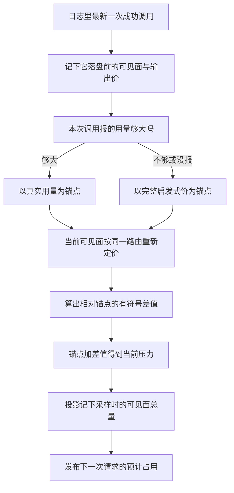

# 计量:启发式估算与占用率公布

> 分析对象:[deepseek-ai/deepseek-harness](https://github.com/deepseek-ai/deepseek-harness) @ `dbbaa4a37`

---

计量服务回答的问题不是"这条消息有多少 token",而是"下一次请求大概会用掉多少窗口"。它没有模型档案,不保存每会话配置,也不知道 `contextWindow` 是多少——容量是路由级事实,不属于计量器。

真正的做法是**锚点加有符号增量**:最近一次成功调用里 provider 报的真实用量当锚点,此后 surface 上的新增与替换按固定启发式逐节点定价,加减出当前值。provider 的精确数字负责"规模",启发式只负责"相对变化",误差不累积。

## 从锚点到公布值


<details><summary>Mermaid 源码</summary>



</details>

| 阶段 | 做了什么 | 关键调用(文件:行) |
|---|---|---|
| 逐块定价 | 文本与推理按字数、工具调用按名字与参数、工具结果递归 | `estimateContent()`(`packages/llm/token-meter/src/estimate.ts:37-61`) |
| 单条定价 | 系统角色走专用入口,其余按内容加 role 框架开销 | `estimateMessage()`(`estimate.ts:86-89`) |
| 工具 schema 定价 | 请求信封里只有 tools 需要单独计价 | `estimateToolsTokens()`(`estimate.ts:97-100`) |
| 增量折叠 | 每条可见面事件算出有符号差值,先计划后提交 | `planSurfaceTokens()` / `commitSurfaceTokens()`(`surface-fold.ts:112-133`、`141-147`) |
| 重放 | 每会话一份状态,从已消费偏移追上日志尾 | `_sync()` / `_foldEvent()`(`index.ts:218-239`、`246-316`) |
| 锚点建立 | 折叠 `assistant/message` 时记下落盘前的可见面与本次输出价 | `index.ts:279-308` |
| 路由定价 | 按当前路由的图片计价替换附件块的启发式价 | `priceSurface()`(`route-pricing.ts:32-76`) |
| 测量 | 算 baseline、有符号差值与总量,返回深冻结快照 | `measure()`(`index.ts:145-190`) |
| 占用投影 | 采样 prompt 侧用量,叠加其后的可见面净变化 | `contextPressureProjectionDefinition`(`usage-projection.ts:173-218`) |
| 公布 | wire 视图暴露容量、采样压力与下一次预计占用 | `usage-projection.ts:208-217` |
| 落日志 | 路由或容量变化时写一条 `request/context` | `buildRequest()`(`packages/core/agent-loop/src/agent.ts:584-598`) |

<details><summary>锚点选择与总量计算</summary>

```typescript
// packages/llm/token-meter/src/index.ts:157-170
    if (anchor !== undefined && optionalHeaderEquals(anchor.header, header)) {
      // Matching headers share one route, so the anchored snapshot reprices
      // under the same pricing as the current surface and the signed delta
      // compares like with like.
      const anchorSurfaceTokens = priceSurface(anchor.nodes, pricing, fileText).surfaceTokens
        + anchor.assistantTokens
      const estimatedAnchorTokens = estimateToolsTokens(header) + anchorSurfaceTokens
      const usage = anchor.usage
      // Signed heuristic deltas remain conservative only from an anchor
      // that is at least as large as the matching full heuristic price.
      baseline = usage !== undefined && usageTokens(usage) >= estimatedAnchorTokens
        ? { kind: 'usage', tokens: usageTokens(usage), usage }
        : { kind: 'estimated', tokens: estimatedAnchorTokens }
      surfaceDeltaTokens = surface.surfaceTokens - anchorSurfaceTokens
```

</details>

---

## 一、固定启发式:三个常量与它们的依据

计量器是**无配置**服务:构造时 `validateConfigKeys()` 逐个键检查配置对象,任何键都抛 `unknown key … (no settings are supported)`(`index.ts:86-91`)。理由是计量结果要被压缩策略、UI 与跨会话引用三方共用,若它可以被部署配置成不同的数,三方对"同一份日志花了多少"就会得出不同答案。

启发式集中在三个常量上:

```typescript
// packages/llm/token-meter/src/estimate.ts:12-19
/** Fixed text-density estimate used until exact tokenization is needed. */
const CHARS_PER_TOKEN = 4

/** Per-block structural overhead for JSON framing and type tags. */
const BLOCK_OVERHEAD = 4

/** Role-field framing overhead added to every priced message. */
export const ROLE_OVERHEAD = 4
```

| 常量 | 值 | 依据 |
|---|---|---|
| `CHARS_PER_TOKEN` | 4 | 英文与代码正文的经验密度;不去猜具体分词器 |
| `BLOCK_OVERHEAD` | 4 | 每个内容块的 JSON 结构开销与类型标签 |
| `ROLE_OVERHEAD` | 4 | 每条消息的 role 字段框架开销;导出供其他消费者复用 |

`ROLE_OVERHEAD` 被导出,是因为别处也要按同一口径给消息定价,重复定义会让两个数字对不上。

逐块定价按类型分支:

```typescript
// packages/llm/token-meter/src/estimate.ts:40-58(节选)
    switch (block.type) {
      case 'text':
      case 'reasoning':
        tokens += Math.ceil(block.text.length / CHARS_PER_TOKEN) + BLOCK_OVERHEAD
        break
      case 'tool-call':
        tokens += Math.ceil(block.name.length / CHARS_PER_TOKEN)
          + Math.ceil(block.arguments.length / CHARS_PER_TOKEN)
          + BLOCK_OVERHEAD
        break
      case 'tool-result':
        tokens += estimateContent(block.content) + BLOCK_OVERHEAD
        break
      default:
        // ContentBlockMap is merge-extensible; unknown blocks (and image
        // references, whose request price is route-owned) retain a
        // conservative structural JSON price under the fixed heuristic.
        tokens += estimateStructuralBlock(block)
    }
```

四条读法:文本与推理块同价;工具调用按名字加参数的字符数;工具结果递归并再加一层块开销;未知块退化为"`BLOCK_OVERHEAD` 加整个 JSON 串的字符价"(`estimate.ts:28-30`)。图片引用走最后这条默认分支,因为它的真实价格由路由决定。

系统提示有独立入口 `estimateSystemMessage()`(`estimate.ts:71-78`),差别在于**不加逐块开销**:它按块累计字符数(文本取 `text.length`,其他类型取 `JSON.stringify` 长度),除密度后只加一次 `ROLE_OVERHEAD`,空 content 返回 0 对应"这次没有系统提示"。依据是适配器把提示当**纯字符串**序列化——系统角色消息或请求的 system 字段,而不是带类型的 content 块数组,所以没有逐块 JSON 框架可算。

---

## 二、有符号增量:计划先于提交

可见面(surface)的每次变化都要折算成一个带符号的数。折算被拆成"只读计划"与"原地提交"两步:

```typescript
// packages/llm/token-meter/src/surface-fold.ts:122-132
  const startIdx = nodes.findIndex(candidate => candidate.seq === op.startSeq)
  const endIdx = nodes.findIndex(candidate => candidate.seq === op.endSeq)
  if (startIdx === -1 || endIdx === -1 || startIdx > endIdx) {
    throw new Error(
      `token surface: replace at seq ${event.seq} has invalid current range ${op.startSeq}-${op.endSeq}`,
    )
  }
  const removed = nodes
    .slice(startIdx, endIdx + 1)
    .reduce((total, candidate) => total + candidate.heuristicTokens, 0)
  return { tokens, deltaTokens: tokens - removed, node, target: { startIdx, endIdx } }
```

```typescript
// packages/llm/token-meter/src/surface-fold.ts:141-147
export function commitSurfaceTokens<Node>(nodes: Node[], plan: SurfaceTokenPlan<Node>): void {
  if (plan.target === 'append') {
    nodes.push(plan.node)
    return
  }
  nodes.splice(plan.target.startIdx, plan.target.endIdx - plan.target.startIdx + 1, plan.node)
}
```

提交是一句 `push` 或一句 `splice`,自身没有任何分支能失败。分工的理由写在模块头(`surface-fold.ts:7-11`):**所有可能失败的步骤都在只读阶段跑完,提交不可失败**。于是不存在"半个事件被应用"的可见面,同一条坏事件在每次重试时都以相同方式失败。

增量的符号语义:

| 事件 | `deltaTokens` |
|---|---|
| 追加一条消息 | `+新节点价` |
| 用一条摘要替换整段区间 | `新价 − 被替换区间价`(通常为负) |
| 定位不到区间 | 抛错——已提交日志在追加时就被 surface 校验过,定位不到说明日志损坏 |

两个价并存不是冗余。`measure()` 返回的每个节点同时带 `tokens`(按当前路由计价)与 `heuristicTokens`(与路由无关的固定价,`types.ts:38-53`):触发判定、尾部保留、区间选择读前者;影子价协议(下称 shadow price,指"被替换区间的价格由紧邻其前的一条计量事件声明")读后者,以保证 O(1) 投影与自己的追加口径一致。

路由定价里有一处硬校验(`route-pricing.ts:47-52`):`pricing.priceImages(images)` 返回的价格条数与图片出现次数不等就抛错,而不是尽量对齐——错位会把价格贴到别的节点上,静默地把每个节点都算错。

---

## 三、锚点:重放出来的,不是存下来的

计量状态是每会话一份的重放状态机:

```typescript
// packages/llm/token-meter/src/index.ts:51-67
interface MeasurementAnchor {
  readonly header: EpochHeader | undefined
  /** Priced surface immediately before the anchored assistant message commits. */
  readonly nodes: readonly MeterSurfaceNode[]
  /** Fixed-heuristic price of the call's provider output. */
  readonly assistantTokens: number
  /** Provider usage of the call, when it reported one under a known header. */
  readonly usage: TokenUsage | undefined
}

interface ReplayState {
  consumedEvents: SessionLogOffsetType
  header: EpochHeader | undefined
  surface: MeterSurfaceNode[]
  stepStart: { turn: number; step: number } | undefined
  anchor: MeasurementAnchor | undefined
}
```

`_sync()` 把状态从已消费偏移推到当前日志尾(`index.ts:218-239`),`_foldEvent()` 处理单条事件。锚点在折叠 `assistant/message` 时建立:

```typescript
// packages/llm/token-meter/src/index.ts:287-299
      // assistant/message is surface-mandatory at every append/seed boundary.
      // oxlint-disable-next-line typescript/no-non-null-assertion
      const eventTokens = plan!.tokens
      // The loop admits prompts and user messages after step/start; retries may
      // replace them before succeeding. Only the pre-assistant surface is priced
      // by this call. Provider output stays separate from durable output rewrites.
      if (event.data.usage !== undefined && nextHeader !== undefined) {
        nextAnchor = {
          header: nextHeader,
          nodes: [...state.surface],
          assistantTokens: this._estimateProviderAssistant(event),
          usage: event.data.usage,
        }
```

关键在 `nodes: [...state.surface]`:记的是**该消息落盘之前**的可见面快照。provider 报的 prompt 用量对应那一份内容,不是加上这次输出之后的内容。而 `anchorSurfaceTokens` 里又含了 `assistantTokens`(`index.ts:161-162`),因为 provider 的 `usage` 同时包含输入与输出。

用量求和的口径是四个不相交桶相加,且**不重复计推理输出**:`usageTokens()`(`index.ts:69-75`)就是 `inputTokens + cacheReadTokens + cacheWriteTokens + outputTokens`,推理 token 已经包含在 `outputTokens` 里,不再单独累加。

**什么时候信 provider**:报过用量,且报出来的总量**不低于**同一路由下的完整启发式价(`index.ts:164-169`)。第二条是防"有符号差值不再保守"——若 provider 报的数比启发式还小,说明启发式对这份内容高估了,在它之上做加减会系统性把真实压力算低。退回启发式锚点后,后续增量与锚点用的是同一把尺子。

同一条路由的判定用 `optionalHeaderEquals()`,因为它要能表达"两边都没有 header"这种情况(`index.ts:77-84`)。header 不匹配意味着换了路由,锚点与当前面不可比,此时要么退化为纯启发式总量,要么在完全空的状态下给出 `kind: 'none'`。

---

## 四、`contextPressure`:采样与两次折算

面向 UI 的占用率是另一套折叠,它不重放整份可见面,只维护标量。

```typescript
// packages/llm/token-meter/src/usage-projection.ts:77-79
/** Prompt-side pressure of one request: input plus cache traffic, no output. */
const pressureFrom = (usage: TokenUsage): number =>
  usage.inputTokens + (usage.cacheReadTokens ?? 0) + (usage.cacheWriteTokens ?? 0)
```

只取 prompt 侧,因此**流式输出期间它不会动**。但也正因为只有请求才报用量,它**看不见压缩**——压缩自己不产生任何用量。所以折叠额外维护一个可见面总量,发布"采样值 + 采样之后的净变化":

```typescript
// packages/llm/token-meter/src/usage-projection.ts:208-217
  wire: {
    viewSchema: pressureSchema,
    view: ({ contextWindow, pressureTokens, surfaceTokens, sampledSurfaceTokens }) => ({
      ...contextWindow === undefined ? {} : { contextWindow },
      ...pressureTokens === undefined ? {} : { pressureTokens },
      ...pressureTokens === undefined || sampledSurfaceTokens === undefined
        ? {}
        : { projectedTokens: Math.max(0, pressureTokens + surfaceTokens - sampledSurfaceTokens) },
    }),
  },
```

三个对外字段的语义(完整契约在 `projection.ts:30-48`):

| 字段 | 含义 | 何时缺失 |
|---|---|---|
| `pressureTokens` | 最近一次请求的 prompt 规模 | provider 从未报过用量 |
| `projectedTokens` | 下一次请求的预计规模 | 同上 |
| `contextWindow` | 最新记录的路由容量 | 没有适配器声明容量 |

`projectedTokens` 回答的是"下一次",不是"上一次"。这个区别在压缩之后立刻显现:压缩把一段区间换成摘要,`pressureTokens` 因为没人报用量而纹丝不动,而 `projectedTokens` 会立刻下降。

两个字段的**采样时机**是错开的,这也是 `projection.ts` 强调"不是一次原子请求观测"的原因:

```typescript
// packages/llm/token-meter/src/usage-projection.ts:192-201
    const usage = usageOf(event)
    if (usage !== undefined) {
      const pressureTokens = pressureFrom(usage)
      if (pressureTokens !== next.pressureTokens || next.sampledSurfaceTokens !== next.surfaceTokens) {
        next = { ...next, pressureTokens, sampledSurfaceTokens: next.surfaceTokens }
      }
    }
    if (fold.deltaTokens !== 0) {
      next = { ...next, surfaceTokens: next.surfaceTokens + fold.deltaTokens }
    }
```

注意 `sampledSurfaceTokens` 取的是**本事件加入可见面之前**的总量。`assistant/message` 既带用量又是可见面事件,先贴采样再叠加自己的价,于是它锚定的是"自己那次请求看到的可见面"。

`foldSurfaceProjection()` 是这条链上的 O(1) 折叠:

```typescript
// packages/llm/token-meter/src/surface-projection.ts:68-79
  if (event.type === 'compaction/summary' || event.type === 'compaction/prune') {
    const { shadowedRange, shadowedTokenCount } = event.data
    return {
      deltaTokens: 0,
      claim: {
        start: SessionSeq(shadowedRange.start),
        end: SessionSeq(shadowedRange.end),
        tokens: shadowedTokenCount,
      },
    }
  }
  if (!isSurfaceEvent(event)) return { deltaTokens: 0, claim: undefined }
```

它是影子价协议的消费者:替换事件本身不带被替换区间的价格,价格由**紧邻在它前面**的那条计量事件声明。所以状态里只需要保留"最多一条待用声明",不需要逐节点价格。

三种边界被显式处理:

1. **没有待用声明的替换 ⇒ 零增量**。折叠的是协议引入之前记录的历史会话,有界状态无法重建被替换区间的价,于是选择"退化为漂移"而不是让重放失败(`surface-projection.ts:84-88`)。
2. **声明存在但区间对不上 ⇒ 抛错**。相邻事件互相矛盾只可能是活着的生产者违约,不能静默漂移(`surface-projection.ts:89-94`)。
3. **待用声明会被任何非计量事件作废**。协议规定计量事件与替换必须同步相邻,所以只要下一个事件不是它,声明就过期。

还有一份给 UI 拆解构成的折叠 `contextBreakdown`(`breakdown-projection.ts:48-81`),按 system / tools / messages 三类给出启发式构成。它与 `contextPressure` 的口径**刻意不同**:前者全是启发式,后者锚在 provider 上,所以两者的数字不会相等,`projection.ts:50-58` 明确要求它们只能作为"构成近似"呈现,不能相加当成总量。

---

## 五、`contextWindow` 的归属与校验

容量的唯一权威来源是 LLM 适配器:

```typescript
// packages/llm/llm/src/types.ts:314-318
/** Provider-owned context capacity for one exact provider/model route. */
export interface LlmModelContext {
  /** Maximum combined request and response context in tokens. */
  contextWindow: number
}
```

校验发生在解析模型信息时:

```typescript
// packages/llm/llm/src/index.ts:767-773
    const context = resolved.context
    if (context !== undefined && (!Number.isInteger(context.contextWindow) || context.contextWindow <= 0)) {
      throw new LlmError(
        `adapter returned invalid context metadata for provider "${provider}" model "${model}"`,
        'INVALID_MODEL_CONTEXT',
      )
    }
```

必须是正整数,否则抛 `INVALID_MODEL_CONTEXT`。查询独立于 `listModels()`,所以未列出的动态模型也可以有容量元数据。

容量是**路由级**的,不是会话级、更不是全局。三个消费者的用法各不相同:

| 消费者 | 位置 | 用法 |
|---|---|---|
| 压力阈值折算 | `packages/compaction/compaction-basic/src/config.ts:144-147` | `thresholdTokens = floor(contextWindow × thresholdRatio)`,`retainTokens` 同理 |
| 上下文占用公布 | `packages/llm/token-meter/src/usage-projection.ts:181-191` | 从 `request/context` 记下容量,与 `projectedTokens` 一起供 UI 算占用率 |
| 跨会话引用预算 | `packages/context/session-reference/src/index.ts:373-375` | 单个引用的字节预算按容量派生,带 64 KiB 下限 |

跨会话引用这一处最能说明"预算是派生量"而不是拍脑袋常数:

```typescript
// packages/context/session-reference/src/index.ts:373-375
    if (info.context === undefined) return DEFAULT_MAX_REFERENCE_BYTES
    // Context capacity is in tokens; four bytes/token is a sizing heuristic, not token counting.
    return Math.max(DEFAULT_MAX_REFERENCE_BYTES, Math.floor(info.context.contextWindow * 4 * this.config.referenceContextFraction))
```

`4` 在这里是**容量换算的粗略比例**,不是分词——注释把它和真正的分词区分开了。解析失败(例如流式中间件服务的路由没有适配器,返回 `NO_ADAPTER`)时回退到 64 KiB 下限,而不是让引用功能整体不可用(`index.ts:366-372`)。

计量器自己**不认识** `contextWindow`。这条分工的理由是"移除全局容量后,即使没有安装压缩插件,计量依然可复用"——同一份 `measure()` 结果既服务压缩决策,也服务 UI 展示与引用预算,不该被任何一方的政策绑住。

---

## 六、向日志与 UI 公布

容量这条事实通过 `request/context` 事件落进日志,且**只在与上一条不同时写**:

```typescript
// packages/core/agent-loop/src/agent.ts:584-598
    const contextWindow = preparedCall?.context?.contextWindow
    const systemPromptUpdate = preparedCall?.systemPromptUpdate
    const requestContext: RequestContext = {
      provider: config.provider,
      model: config.model,
      ...contextWindow === undefined ? {} : { contextWindow },
      ...systemPromptUpdate === undefined ? {} : { systemPromptUpdate },
    }
    const previousContext = session.requestContext()
    if (previousContext?.provider !== requestContext.provider
      || previousContext.model !== requestContext.model
      || previousContext.contextWindow !== requestContext.contextWindow
      || previousContext.systemPromptUpdate !== requestContext.systemPromptUpdate) {
      session.append('request/context', requestContext)
    }
```

逐字段比较的意义在于:同一路由上每步都写一条重复记录,只会让日志变长,不增加任何信息;而切换 model 会立刻产生一条新记录,占用投影随之更新容量。

UI 侧同时消费两个投影,分工写在注释里——**整体长度用 provider 精确的百分比,彩色分段只用启发式构成来分比例**:

```typescript
// packages/client/ui-conversation/src/client/skeleton/ContextMeter.tsx:94-103
  // The bar's overall length stays the provider-exact percent; the heuristic
  // breakdown only proportions its colored parts. A zero-width part is dropped
  // instead of rendered: `.segment`'s min-width keeps a hairline part visible,
  // which at 0% occupancy would draw a filled bar over an empty context.
  const breakdownTotal = breakdown === undefined
    ? 0
    : breakdown.systemTokens + breakdown.toolsTokens + breakdown.messageTokens
  const parts = breakdown === undefined || breakdownTotal === 0
    ? [{ key: 'total', color: undefined, width: percent }]
    : ROWS.map(row => ({ key: row.key, color: row.color, width: percent * breakdown[row.key] / breakdownTotal }))
```

容量缺失时组件整体不渲染(`ContextMeter.tsx:87`),而不是显示一个没有分母的百分比。

---

## 关键文件/符号索引

| 文件 | 符号 | 行 | 本模块用途 |
|---|---|---|---|
| `packages/llm/token-meter/src/estimate.ts` | 三个常量 | 12-19 | 固定启发式的全部可调参数 |
| 同上 | `estimateStructuralBlock` | 28-30 | 未知块与图片引用的结构价 |
| 同上 | `estimateContent` | 37-61 | 逐块递归定价 |
| 同上 | `estimateSystemMessage` | 71-78 | 系统提示专用口径 |
| 同上 | `estimateMessage` | 86-89 | 单条消息定价 |
| 同上 | `estimateToolsTokens` | 97-100 | 工具 schema 定价 |
| `packages/llm/token-meter/src/index.ts` | `MeasurementAnchor` / `ReplayState` | 51-67 | 锚点与重放状态 |
| 同上 | `usageTokens` | 69-75 | 四个不相交桶求和 |
| 同上 | `optionalHeaderEquals` | 77-84 | 可缺省信封的比较 |
| 同上 | `validateConfigKeys` | 86-91 | 无配置校验 |
| 同上 | `TokenMeter` | 100-122 | 投影注册与懒惰追赶 |
| 同上 | `measure` | 145-190 | 锚点、增量、总量 |
| 同上 | `_sync` | 218-239 | 追平日志尾 |
| 同上 | `_foldEvent` | 246-316 | 单事件折叠、步边界配对校验、锚点建立 |
| `packages/llm/token-meter/src/surface-fold.ts` | `MeterSurfaceNode` | 26-39 | 带附件出现位置的定价节点 |
| 同上 | `SurfaceTokenPlan` | 42-51 | 只读计划对象 |
| 同上 | `planSurfaceTokens` | 112-133 | 计划与有符号增量 |
| 同上 | `commitSurfaceTokens` | 141-147 | 不可失败的原地提交 |
| `packages/llm/token-meter/src/surface-projection.ts` | `ShadowPriceClaim` | 29-36 | 待用影子价声明 |
| 同上 | `foldSurfaceProjection` | 64-96 | O(1) 可见面总量折叠 |
| `packages/llm/token-meter/src/usage-projection.ts` | `pressureFrom` / `usageOf` | 78-86 | prompt 侧采样 |
| 同上 | `tokenUsageProjectionDefinition` | 117-150 | 累计用量投影 |
| 同上 | `contextPressureProjectionDefinition` | 173-218 | 占用率状态与 wire 视图 |
| `packages/llm/token-meter/src/route-pricing.ts` | `priceSurface` | 32-76 | 按路由替换附件块价格 |
| `packages/llm/token-meter/src/breakdown-projection.ts` | `contextBreakdownProjectionDefinition` | 48-81 | system / tools / messages 构成 |
| `packages/llm/token-meter/src/projection.ts` | 三个对外契约 | 13-77 | 用量、占用、构成 |
| `packages/llm/token-meter/src/types.ts` | `TokenMeasurement` / `TokenSurfaceNode` | 22-54 | 测量结果与双价节点 |
| `packages/llm/llm/src/types.ts` | `LlmModelContext` | 314-318 | 容量契约 |
| `packages/llm/llm/src/index.ts` | `resolveModelInfo` 校验 | 767-773 | 正整数校验与 `INVALID_MODEL_CONTEXT` |
| `packages/core/agent-loop/src/agent.ts` | `buildRequest` | 553-618 | `request/header` 与 `request/context` 落盘 |
| `packages/client/ui-conversation/src/client/skeleton/ContextMeter.tsx` | `ContextMeter` | 55-104 | 占用率与构成分段的呈现分工 |
