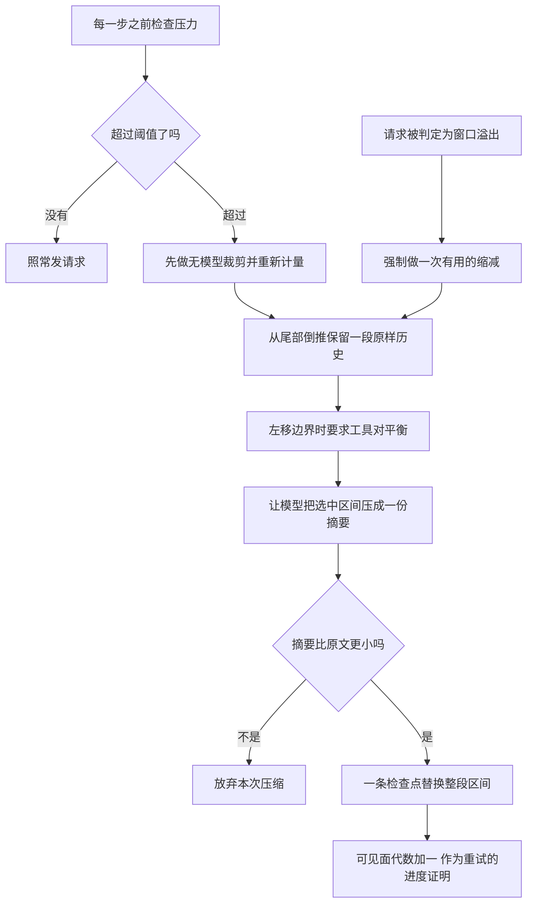

# 预算策略:压缩触发、选区与结果溢写

> 分析对象:[innokria/deepseek-harness](https://github.com/innokria/deepseek-harness) @ `dbbaa4a37`

---

窗口装不下时,必须牺牲一些东西。压缩(compaction)的做法是把一段历史换成分份摘要——它改的是可见面,不是日志;被替换的原文仍在日志里,只是不再对模型可见。

这一篇讲三件事:什么时候触发、牺牲哪一段、以及做完之后怎么证明"确实产生了持久缩减"。最后把结果溢写(spill,处理单条工具结果过大的机制)与压缩放在一起比较:两者都会让模型看到的文本变小,但一个是窗口级策略,一个是单条级策略,优先级与失败语义完全不同。

## 两个触发点到一次区间替换


<details><summary>Mermaid 源码</summary>



</details>

| 阶段 | 做了什么 | 关键调用(文件:行) |
|---|---|---|
| 能力缝 | 抽象服务只声明三个方法,触发器是封闭联合 | `CompactionEngine`(`packages/compaction/compaction/src/index.ts:96-170`) |
| 压力触发 | 挂在 `agent/pre-step` 上做前置检查,完成后无条件放行 | `compaction-basic/index.ts:148-166` |
| 溢出触发 | 挂在 `agent/request-error` 上,只认 provider 确认的窗口溢出 | `compaction-basic/index.ts:180-224` |
| 路由解析 | 从已落日志的请求信封读精确 provider/model | `routedTarget()`(`compaction-basic/index.ts:52-61`) |
| 策略合并 | 精确覆盖项盖在服务默认值之上 | `resolveTargetPolicy()`(`config.ts:105-125`) |
| 阈值折算 | 比例折算成绝对 token 预算 | `resolveCompactSpec()`(`config.ts:133-167`) |
| 无模型裁剪 | 先把超预算的工具结果裁一遍,再重新计量 | `pruneSession()`(`compaction-tool-result-pruner/src/index.ts:136-185`) |
| 选区 | 对齐可见面、从尾部倒推保留量、工具对平衡 | `selectCompactableRange()`(`region.ts:117-155`) |
| 摘要 | 复用会话前缀的一次性调用 | `summarizeWithLlm()`(`summarizer.ts:119-179`) |
| 增量校验 | 摘要必须真的比被遮蔽区间更小 | `summarizeCompaction()`(`region.ts:386-413`) |
| 稳定性断言 | 自动压缩要求整份可见面一字不差 | `assertWholeSurfaceUnchanged()`(`region.ts:416-425`) |
| 提交 | 先写摘要记录,再用一条用户消息替换整段区间 | `commitCompactionBody()`(`region.ts:456-507`) |
| 进度证明 | 可见面代数没有增长就不重试 | `compaction-basic/index.ts:218-223` |

---

## 一、阈值:比例在加载期验一次,绝对预算在每次检查时算一次

配置分两层:顶层是服务默认值,`modelPolicies` 是按精确 `provider/model` 的覆盖表。加载期能验的都验掉——键名、取值范围、`retainRatio` 与 `retainTokens` 互斥、`summarizationProvider` 与 `summarizationModel` 必须成对出现(`config.ts:227-275`)。

其中只有一类冲突能在加载期判定:

```typescript
// packages/compaction/compaction-basic/src/config.ts:185-190
  if (retention.retainRatio !== undefined && retention.retainRatio >= thresholdRatio) {
    throw new Error(
      `${name}: retainRatio (${retention.retainRatio}) must be less than `
      + `the resolved thresholdRatio (${thresholdRatio})`,
    )
  }
```

两个比例的比较与容量无关,所以加载期就能判定——"保留得比触发线还多"这种策略没有任何容量能让它成立。默认 `thresholdRatio = 0.8`、`retainRatio = 0.16`(`config.ts:19-23`):触发线在八成,保留尾部一成半,中间那段就是压缩区间。

绝对值形式做不到这一点。`retainTokens` 是绝对数,而触发线是比例的乘积,只有拿到容量才能比较:

```typescript
// packages/compaction/compaction-basic/src/config.ts:144-154
  const thresholdTokens = Math.floor(contextWindow * policy.thresholdRatio)
  const retainTokens = policy.retainTokens === undefined
    ? Math.floor(contextWindow * policy.retainRatio)
    : policy.retainTokens
  if (retainTokens >= thresholdTokens) {
    throw new TargetPressureConfigError(
      targetKey,
      `BasicCompactionConfig: ${policy.target.provider}/${policy.target.model} retainTokens `
      + `(${retainTokens}) must be less than threshold tokens ${thresholdTokens}`,
    )
  }
```

**策略解析每一步重做**。触发条件不是"这个会话用的哪个模型",而是"最近一次请求实际路由到哪个模型":

```typescript
// packages/compaction/compaction-basic/src/index.ts:52-61
/** Resolve the exact provider/model durably routed for the latest request. */
function routedTarget(
  session: Session,
): Pick<LlmCallConfig, 'provider' | 'model'> | undefined {
  const config = session.requestHeader()?.config
  if (config === undefined || config.provider.length === 0 || config.model.length === 0) {
    return undefined
  }
  return { provider: config.provider, model: config.model }
}
```

读的是**日志里已落盘的请求信封**,不是内存里的 agent 选项。好处是重放时能看到同一套决策依据——会话中途切 provider 或 model,容量与策略立即跟着变,而日志能解释为什么。溢出恢复场景下还没有可用的信封时,`conversationTarget()` 退而用 agent 选项(`index.ts:63-72`)。

---

## 二、压力触发点:失败不阻断回合

压力检查挂在 `agent/pre-step` 上,位于整条链的**前置**位置(见 [02-per-step-assembly.md](./02-per-step-assembly.md) 第四节)。它必须在 `next()` 之前动手,因为它要改写的不是本步消息,而是整段可见面。

```typescript
// packages/compaction/compaction-basic/src/index.ts:152-165
      if (!signal.aborted) {
        try {
          const result = await this.compactIfNeeded(agent, 'pressure', signal)
          if (result !== null) logResult(result, 'step pressure')
        } catch (error: unknown) {
          if (error instanceof TargetPressureConfigError) {
            if (this.warnedPressureConfigTargets.has(error.targetKey)) return next()
            this.warnedPressureConfigTargets.add(error.targetKey)
          }
          const message = error instanceof Error ? error.message : String(error)
          ctx.logger.warn(`step compaction failed: ${message}; continuing the turn`)
        }
      }
      return next()
```

三段语义:

1. **信号已中止就不做事**,但仍然 `next()`——中止由主循环负责,不由这里负责。
2. **目标级配置错误只警告一次**。`warnedPressureConfigTargets` 用 `provider/model` 当键;缺容量元数据这类错误会在每一步重复出现,警告一次足够。
3. **其余错误一律降级为 warning**。压缩的收益不值得赔上一个可用回合。

`TargetPressureConfigError` 专门标记"这个键可以抑制"的情况,它把 `targetKey` 作为只读字段一起抛出(`config.ts:51-60`)。

压力分支的判断顺序(`index.ts:264-327`):

| 步骤 | 说明 |
|---|---|
| 解析路由 | 拿不到路由直接 `return null` |
| 解析容量 | `resolveModelInfo()` 取不到 `context` 就抛 `TargetPressureConfigError` |
| 检查压缩锁 | `assertNoActiveCompaction()` 确认没有未闭合的压缩事务 |
| 折算阈值 | `resolveCompactSpec()` 得到 `thresholdTokens` 与 `retainTokens` |
| 首次判定 | `measurement.totalTokens < spec.thresholdTokens` 就返回 `null` |
| 无模型裁剪 | 可选服务存在时先裁一遍,再重新计量 |
| 二次判定 | 裁剪后就降到阈值以下也返回 `null`,不再花模型调用 |
| 循环压缩 | 最多 `compactionRetries + 1` 次;每次压完重新计量 |
| 仍超阈值 | 抛错,让上层降级为 warning |

裁剪放在摘要之前、且判定两次,是这一节最值得记住的取舍:**不花模型调用就能解决的问题,不花模型调用**。裁剪是纯字符串处理,零成本;摘要是真实的一次 provider 请求。

---

## 三、选区:保留尾部、不切断工具对、永不压掉系统提示

`selectCompactableRange()` 做三件事。第一件是对齐:计量结果里的**逐个节点有序序号**必须与当前 `session.surface.nodes` 逐位相同,不等就抛 `compaction: token-meter surface does not match the current session surface`(`region.ts:122-129`)。用过期计量裁当前历史会切错区间,所以这里选择失败而不是尽量对齐。

第二件是确定可压区间的左端。`systemHead()` 判断可见面节点 0 是不是 `system/message`(`region.ts:99-105`),是就从节点 1 开始压,于是**系统提示永远不会被压掉**。第三件是尾部保留量与工具对平衡:

```typescript
// packages/compaction/compaction-basic/src/region.ts:133-148
  let accumulated = 0
  let keepFromIdx = pricedNodes.length
  for (let index = pricedNodes.length - 1; index >= 0; index -= 1) {
    // oxlint-disable-next-line typescript/no-non-null-assertion
    accumulated += pricedNodes[index]!.tokens
    keepFromIdx = index
    if (accumulated >= retainTokens) break
  }
  if (keepFromIdx <= firstIdx) return null

  while (keepFromIdx > firstIdx) {
    // oxlint-disable-next-line typescript/no-non-null-assertion
    if (toolPairingBalancedBefore(session, surfaceNodes[keepFromIdx]!)) break
    keepFromIdx -= 1
  }
  if (keepFromIdx <= firstIdx) return null
```

三个返回 `null` 的分支含义不同:没有节点可压、保留量已经覆盖整段、或找不到平衡的切点。返回 `null` 是"这次不压",不是错误。

工具对平衡的必要性很直接:一次工具往返的可见面序列是 `assistant/message`(带 tool-call)加若干 `tool/result`。切点落在这一对中间,压缩后的历史就会出现"调用了工具但结果不见"或"结果没有对应调用",provider 会直接报错。所以边界左移直到平衡为止——宁可少压一点。

---

## 四、两个触发点的入口差异

溢出触发只认 provider 明确报告的窗口溢出:

```typescript
// packages/compaction/compaction-basic/src/index.ts:184-192
      if (failure.code !== CONTEXT_WINDOW_EXCEEDED_CODE || signal.aborted) return next()
      this.overflowAgents.set(agent.session, agent)
      const target = routedTarget(agent.session)
      if (target === undefined) return next()
      const policy = resolveTargetPolicy(this.config, target)
      const retries = this.overflowRetries.get(agent) ?? 0
      if (retries >= policy.maxOverflowRetries) return next()

      const generation = agent.session.surface.replaceGeneration
```

与压力触发的三点差异:

1. **不看阈值**。溢出是既定事实,不需要比例判定;它走"强制做一次有用的缩减"分支——`selectCompactableRange(session, measurement, 0)` 传保留量为 0(`index.ts:289`),意味着尾部可以压到只剩不破坏工具对的最小量。
2. **裁剪无条件先跑**。压力分支里裁剪是可选优化,溢出分支里它是首选手段(`index.ts:284-292`)。
3. **重试次数受限**。`maxOverflowRetries` 默认 1。

溢出分支的降级写在返回类型上:`RequestErrorAction` 只有 `{ kind: 'retry' } | undefined`(`packages/core/agent/src/runtime-types.ts:122`),返回 `next()` 就是"我不管,保留原始错误"。

**恢复计数在两种情况下清空**:agent 转为 idle,或收到一条成功的 `assistant/message`(`index.ts:168-178`)。第二条的注释说明了理由:同一回合里工具调用会让循环继续发新请求,一次成功响应就证明"窗口现在够用",此前的溢出计数不该继续压着后续请求。

---

## 五、进度证明:`replaceGeneration`

压缩可能什么都没压掉。摘要太小、选不出区间、或者摘要阶段失败,都会让"重试一次"变成无限循环。判据是**可见面的替换代数**:

```typescript
// packages/compaction/compaction-basic/src/index.ts:219-223
      if (signal.aborted
        || agent.session.surface.replaceGeneration <= generation) return next()
      if (result !== null) logResult(result, 'context overflow recovery')
      this.overflowRetries.set(agent, retries + 1)
      return { kind: 'retry' }
```

`replaceGeneration` 是一个单调计数器,任何一次可见面替换都会推进它。进入本次尝试前先记下当时的代数;压缩结束后代数没涨,说明**本次压缩没有产生任何持久缩减**,于是保留原始 provider 错误,而不是重试同一个注定失败的请求。

异常路径用同一个判据,理由是"无模型裁剪可能先落地、摘要后失败"(`index.ts:196-209`):裁剪的替换是持久且立即生效的缩减,重试是合理的;把它一并丢弃会让这次恢复白做。但取消优先于一切——`signal.aborted` 为真时直接放弃。

---

## 六、摘要必须真的更小

摘要生成本身复用会话自己的前缀:可见面节点 0 的 `system/message`、header 里的 tool schemas、被遮蔽区间按可见面顺序派生出的消息(`region.ts:529-548`)。摘要指令作为**最后一条用户消息**追加,而不是另起一个摘要器系统提示,这样这次辅助调用是上一次请求的真正前缀,provider 的 KV 缓存能命中(`summarizer.ts:24-30` 的注释写明这一点);调用带 `purpose: 'compaction'` 与 `sessionId`(`summarizer.ts:151-160`)。

提交前有一道硬校验:

```typescript
// packages/compaction/compaction-basic/src/region.ts:399-407
  // The checkpoint is text-only, so its fixed-heuristic price IS its route
  // price; comparing it against the span's route price asks the real
  // question — does the replacement lower the next request's pressure.
  const framedSummaryTokenCount = dependencies.meter.estimateMessage(checkpointMessage)
  if (framedSummaryTokenCount >= prepared.shadowedRouteTokenCount) {
    throw new Error(
      `summary is not smaller than the shadowed content (${framedSummaryTokenCount} estimated framed tokens >= ${prepared.shadowedRouteTokenCount})`,
    )
  }
```

比较的两边口径不同,这是有意的:检查点消息是纯文本,所以它的固定启发式价**就是**它的路由价;被遮蔽区间用的是路由价。两边同口径,问的才是真问题——"这次替换有没有降低下一次请求的压力"。

一次压缩被两段区间语义包住,由 `stability` 决定:

| 触发方式 | `stability` | 要求 | 期间新增的节点 |
|---|---|---|---|
| 自动压缩 | `whole-surface` | 整个可见面节点序列一字不差 | 会使断言失败,放弃本次 |
| 手动压缩 | `selected-span` | 选中那段仍是同一个"当前、连续、等价定价、边界平衡"的替换目标 | 仍可见,不影响 |

`assertWholeSurfaceUnchanged()` 用一次重新计量加 `isDeepStrictEqual` 比较整份节点序列(`region.ts:416-425`)。自动压缩要求更严,因为它跑在回合里:期间任何外部写入都意味着决策依据已经变了,重做比强行提交安全。手动压缩跑在空闲会话上,只需要保证选中那段还是原来的替换目标。

---

## 七、一个事务:一个开启标记就是锁

摘要阶段是异步的,期间可能有并发进入。锁不是内存变量,而是日志里的一条事件:`compaction/start` 一旦落盘,后续任何进入都被 `assertCompactionInactive()` 拒绝(`region.ts:300-319`)。"未闭合的开启标记"就是锁,所以进程崩溃后重启仍能识别出"上次压缩没做完"。唯一的豁免是 `session/end-seed` 边界——它证明那个未闭合标记属于更早的一次会话生命周期。

提交是两步且**不让出控制权**:

```typescript
// packages/compaction/compaction-basic/src/region.ts:491-494
  session.append('user/message', checkpointMessage, {
    surfaceOp: { op: 'replace', startSeq: start, endSeq: end },
    sourceEventSeqs: [startEvent.seq, summaryEvent.seq, ...shadowedSeqs],
  })
```

在此之前已有一次 `compaction/summary` 落盘,记录摘要正文、模型、用量、被遮蔽区间与逐节点序号(`region.ts:476-490`)。两条事件之间没有 `await`,所以不存在"记录了摘要但没替换"的中间态。`shadowedSeqs` 把被遮蔽的每个 seq 写进 `sourceEventSeqs`,重放、UI、引用投影都能追溯"这条摘要吞掉了什么"。

`shadowedTokenCount` 用的是固定启发式价(`region.ts:375-378` 的注释说明了原因):影子价协议要求替换事件的价格与投影自己的追加口径一致,而投影按固定启发式定价。区间选择与增量校验读的是另一个字段 `tokens`,那是路由价。

---

## 八、溢写与压缩:两种"变小",优先级不同

溢写(spill)处理的是**单条工具结果过大**,不是窗口整体压力。它在 `tools/post-execute` 上以 `{ prepend: true }` 注册,先 `await next()` 让下游(例如 hook)定型,再对最终内容限幅(`spill-policy/src/index.ts:185-204`)。三条透传规则:`block` 决策、值替换(`Object.hasOwn(decision, 'value')`)、以及 `decision.additionalContexts` 都原样保留——溢写只处理"被接受的纯文本结果",绝不改写纠错反馈,也不切断工具携带的附加上下文。

`read` 被显式跳过,避免 `read → spill → read again` 循环。默认省略 `maxInlineBytes` 时**什么都不注册**,是真正的 no-op(`index.ts:106-108`)。

**溢写永远不能把成功的工具调用变成失败**:

```typescript
// packages/spill/spill-policy/src/index.ts:148-156
    let ref: SpillRef
    try {
      ref = await spillStore.saveText(save)
    } catch (error: unknown) {
      // Best-effort: a storage failure (permissions, ENOSPC, backend down) must
      // never fail the call or hide the content — keep the original inline.
      ctx.logger.warn(`spill-policy: saveText failed for ${toolName}: ${String(error)}; keeping the inline content`)
      return undefined
    }
```

限幅本身有一个容易写错的约束:通知文本的字节开销必须**从预算内扣除**:

```typescript
// packages/spill/spill-policy/src/index.ts:158-170
    // Reserve the notice's byte cost INSIDE maxInlineBytes so the replacement
    // (preview + blank line + notice) never exceeds the documented cap — a naive
    // preview that spent the whole budget then appended the notice could be
    // larger than the cap, and for a marginally-over result even larger than the
    // original. The reservation uses a notice priced at the worst-case omission
    // count (the full byte total): its digit count bounds the real count's, so
    // the reserved size is a safe upper bound and the final notice is never
    // longer than what we reserved. `\n\n` is the 2-byte join.
    const reserve = Buffer.byteLength(formatSpillNotice({ kind: 'exact', count: totalBytes }, ref), 'utf8') + 2
    const previewBudget = Math.max(0, cap - reserve)
    const { text: previewText, omitted } = preview(text, previewBudget)
    const notice = formatSpillNotice(omitted, ref)
    const replacedText = previewText.length > 0 ? `${previewText}\n\n${notice}` : notice
```

不预留的话,"预览用满预算 + 追加通知"会超过承诺上限,对刚刚超限的结果甚至可能比原文更大。预留用最坏情况的数字位数估算,所以是安全上界。若通知本身就超过 `maxInlineBytes`(上限极小或溢写根路径很长),合成不出合规的替换文本,于是保留原文——溢写宁可失效,也不破坏自己承诺的上限(`index.ts:171-181`)。

### 三者的优先级与分工

| 机制 | 作用对象 | 触发方式 | 是否花模型调用 | 失败后果 |
|---|---|---|---|---|
| 溢写 | 单条工具结果 | 结果字节数超 `maxInlineBytes`,逐次判定 | 否 | 保留原文,warning |
| 无模型裁剪 | 过预算的工具结果节点 | 压力或溢出触发时批量执行 | 否 | 该节点跳过,继续 |
| 压缩 | 一段可见面区间 | 压力超阈值或 provider 报告溢出 | 是 | 压力:warning;溢出:保留原错误 |

三者的优先级由 `compactIfNeeded()` 的执行顺序明确表达:**裁剪先于摘要**。

```typescript
// packages/compaction/compaction-basic/src/index.ts:307-313
    // Once pressure qualifies, land the model-free pass before choosing a
    // summary range, then remeasure through the singleton replay fold.
    if (prune !== undefined) {
      prune.pruneSession(agent.session)
      measurement = meter.measure(agent.session)
    }
    if (measurement.totalTokens < spec.thresholdTokens) return null
```

第二条判定的含义是:裁剪之后压力已经合格,就不再压摘要。这是"零成本手段优先"的直接实现。

裁剪的提交必须遵守影子价协议——**计量事件与被替换节点同步相邻**(`compaction-tool-result-pruner/src/index.ts:160-174`):先 append 一条 `compaction/prune` 声明被替换节点的固定启发式价,紧接着用一次 replace 换掉它。裁剪完全不依赖 `compaction-basic`,它在自己的服务里提供 `pruneSession()`,由压缩引擎通过 `ctx.get('toolResultPruner')` 可选地使用(`index.ts:279-282` 的注释写明"裁剪是可选的,好让 compaction-basic 保持独立可组合")。服务不存在时,压缩照常按摘要路径工作。

---

## 关键文件/符号索引

| 文件 | 符号 | 行 | 本模块用途 |
|---|---|---|---|
| `packages/compaction/compaction/src/index.ts` | `CompactionTrigger` | 24-25 | 两个触发器的封闭联合 |
| 同上 | `ManualCompactionError` | 41-57 | 手动压缩的分类失败 |
| 同上 | `CompactionEngine` | 96-170 | 抽象服务的三个方法 |
| `packages/compaction/compaction-basic/src/index.ts` | `routedTarget` / `conversationTarget` | 52-72 | 精确路由解析与回退 |
| 同上 | `BasicCompactionEngine` | 104-131 | 配置解析与自动压缩注册 |
| 同上 | `_registerAutomaticCompaction` | 138-225 | 两个触发点、计数清空 |
| 同上 | 压力触发器 | 148-166 | `next()` 之前压缩;失败降级 |
| 同上 | 溢出触发器 | 180-224 | 溢出恢复与进度证明 |
| 同上 | `compactIfNeeded` | 259-333 | 阈值判定、裁剪优先、循环压缩 |
| 同上 | `compactRegion` | 344-359 | 自动压缩走 `whole-surface` |
| 同上 | `compactNow` | 369-421 | 手动压缩走 `selected-span` |
| `packages/compaction/compaction-basic/src/config.ts` | 默认比例 | 19-23 | 0.8 与 0.16 |
| 同上 | `TargetPressureConfigError` | 51-60 | 可抑制一次的目标级配置错误 |
| 同上 | `resolveConfig` | 67-97 | 加载期校验与默认值 |
| 同上 | `resolveTargetPolicy` | 105-125 | 精确覆盖盖在默认值上 |
| 同上 | `resolveCompactSpec` | 133-167 | 比例折算成绝对预算 |
| 同上 | `validateRatioRetention` | 179-191 | 容量无关的冲突在加载期失败 |
| 同上 | `resolveModelPolicies` | 194-212 | 重复目标在加载期报错 |
| `packages/compaction/compaction-basic/src/region.ts` | `systemHead` | 99-105 | 系统提示永不入选 |
| 同上 | `selectCompactableRange` | 117-155 | 对齐、尾部倒推、工具对平衡 |
| 同上 | `compactSurfaceRegion` | 173-275 | 单次事务、锁、恰好一次闭合 |
| 同上 | `assertCompactionInactive` / `assertNoActiveCompaction` | 307-333 | 未闭合标记即锁 |
| 同上 | `validateSurfaceRegion` | 336-357 | 区间与两端平衡校验 |
| 同上 | `prepareCompaction` | 360-383 | 定价快照与重放输入 |
| 同上 | `summarizeCompaction` | 386-413 | 摘要框架与变小校验 |
| 同上 | `assertWholeSurfaceUnchanged` | 416-425 | 自动压缩的整面稳定性 |
| 同上 | `assertSelectedSpanStable` | 432-453 | 手动压缩的区间稳定性 |
| 同上 | `commitCompactionBody` | 456-507 | 摘要记录加一次区间替换 |
| 同上 | `buildSummarizationInput` | 529-548 | 复用会话前缀 |
| 同上 | `inspectCompactionEntryState` | 551-585 | 反向扫描开启标记与回合状态 |
| `packages/compaction/compaction-basic/src/summarizer.ts` | 指令与框架文本 | 31-70 | 摘要指令与检查点前导 |
| 同上 | `summarizeWithLlm` | 119-179 | 前缀复用的一次性调用 |
| 同上 | `frameSummary` | 186-192 | 检查点包裹 |
| `packages/compaction/compaction-tool-result-pruner/src/index.ts` | `pruneContent` | 83-122 | 头尾保留、中段移除 |
| 同上 | `pruneSession` | 136-185 | 批量裁剪与影子价协议 |
| `packages/spill/spill-policy/src/index.ts` | `apply` | 105-227 | 加载期校验与两个臂 |
| 同上 | `spillReplacement` | 125-183 | 通知预算内扣除与降级 |
| 同上 | `tools/post-execute` 臂 | 185-204 | 面向模型的结果限幅 |
| 同上 | `tools/ptc-dispatch-log` 臂 | 212-226 | 面向日志的副本限幅 |
| `packages/core/agent/src/runtime-types.ts` | `RequestErrorAction` | 122 | 溢出触发器只能返回重试或不接管 |
