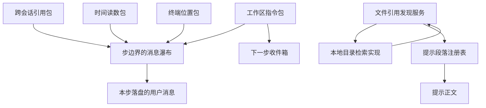

# `packages/context/` 上下文插件走查

> 分析对象:[deepseek-ai/deepseek-harness](https://github.com/deepseek-ai/deepseek-harness) @ `dbbaa4a37`

---

`packages/context/` 下六个包是"往窗口里放东西"的实际实现者。它们分成两族:四个走 `agent/pre-step`,把内容作为本步的用户消息塞进请求;两个构成文件引用发现这条能力缝——一个只有抽象服务,一个提供本地实现,并向提示段落注册表登记一段指引。

这一篇按"贡献什么、以什么形态注入、开关与配置、失败时怎么降级"四问逐个走查。降级那一问最值得细看:六个包对失败的容忍度差别极大,原因都能从"这条信息到底有多重要"推出来。

## 六个包按注入形态分流


<details><summary>Mermaid 源码</summary>



</details>

| 包 | 做了什么 | 关键调用(文件:行) |
|---|---|---|
| `session-reference` | 把用户消息里的规范化引用改写成"直接消息 + 紧随其后的跨会话快照" | `prepareDirectMessages()`(`session-reference/src/index.ts:153-177`) |
| 同上 | 记录本步解析出的路由,用于派生字节预算 | `system-prompt/assemble` 预置监听(`index.ts:127-134`) |
| `time-context` | 每个合格步追加一条时间读数与浏览器时区策略 | `apply()` 的 pre-step 监听(`time-context/src/index.ts:181-221`) |
| `tmux-context` | 只在首步、且渲染状态变化时,把终端位置插到批次头部 | `apply()` 的 pre-step 监听(`tmux-context/src/index.ts:236-264`) |
| `agent-instructions` | 首步注入工作区指令基线;文件工具触碰后增量重投影 | `compose()`(`agent-instructions/src/index.ts:108-225`)、`projectTouch()`(`:296-305`) |
| `file-reference` | 只声明可取消的文件引用发现能力 | `FileReferenceService`(`file-reference/src/index.ts:26-43`) |
| `file-reference-local` | 提供本地实现,并按 agent 登记一段提示段落 | `LocalFileReferenceService`(`file-reference-local/src/index.ts:44-125`) |

---

## 一、`session-reference`:跨会话引用

**贡献什么**。用户消息里出现规范化引用(形如会话 URI)时,把那条消息改写成"去掉引用的原文 + 紧随其后的一份跨会话快照"。快照是对方会话当前可见面的投影,只保留用户与助手的文本,排除工具、推理与注入的上下文。

**注入形态**。`agent/pre-step` 上以 `{ prepend: true }` 注册,先 `next()` 再改写:

```typescript
// packages/context/session-reference/src/index.ts:135-142
    ctx.on('agent/pre-step', async ({ agent, signal }, next): Promise<PreStepDecision> => {
      const decision = await next()
      if (decision.kind === 'reject') return decision
      return {
        ...decision,
        messages: await this.prepareDirectMessages(agent, decision.messages, signal),
      }
    }, { prepend: true })
```

放在 `next()` 之后,意味着它拿到的是所有下游监听器都已经改写过、真正会进入请求的那个批次。每条含引用的消息产出两条消息:改写后的直接消息,与一条带 `{ kind: 'session-reference', form: 'recall', version: 1, … }` 来源的快照(`index.ts:352-356`)。`form: 'recall'` 是 `ContextFormed` 词表里的一个值,语义是"从别处搬来、可能在途中被削减过的材料"(`packages/llm/llm/src/message.ts:61-62`)。

**开关与配置**。`static inject = ['sessionQuery']`;服务名 `sessionReferenceResolver`。四个配置项各有职责(`index.ts:87-92`):

| 配置 | 默认 | 作用 |
|---|---|---|
| `maxReferences` | `MAX_REFERENCES` = 3 | 一条消息最多引用几个会话,加载期拒绝超过硬上限的值 |
| `candidateLimit` | 50 | 宿主自动补全一次最多列几个候选 |
| `maxReferenceBytes` | 省略则按容量派生 | 单个引用渲染后的 UTF-8 字节上限 |
| `referenceContextFraction` | 0.2 | 派生预算时占窗口的比例 |

字节预算的派生链值得单独记一遍(`index.ts:359-376`):显式配置优先;否则用本步组装时记下的路由(`system-prompt/assemble` 监听器在 `next()` 之后读 `assembly.variables.provider/model`);拿不到路由就用 agent 选项;`resolveModelInfo()` 抛 `NO_ADAPTER` 时回退到 64 KiB 下限;有容量则按"每 token 四字节"折算并取 `max(64 KiB, contextWindow × 4 × fraction)`。

**失败时的降级**。这个包是六个里最严格的:

| 失败 | 行为 |
|---|---|
| 配置非法(非正整数、比例越界、超过硬上限) | 构造期抛 `SESSION_REFERENCE_INVALID_CONFIG` |
| 引用自己 | 抛 `SESSION_REFERENCE_SELF_REFERENCE` |
| 引用数量超上限 | 抛 `SESSION_REFERENCE_TOO_MANY` |
| 读取被引会话失败 | 抛 `SESSION_REFERENCE_READ_FAILED`,附原始原因 |
| 固定字段塞不进字节预算 | 抛 `SESSION_REFERENCE_BUDGET_EXCEEDED`,**不静默截断到无法解析的 JSON** |
| 取消 | 抛 `SESSION_REFERENCE_CANCELLED`;即使存储操作在取消后才完成,也不发布上下文 |
| 路由没有适配器 | 回退 64 KiB,功能继续可用 |

前六行都是 `SessionReferenceError`,带稳定的 `code` 供宿主协议映射(`config.ts:22-42`)。严格的理由是明确的:**引用的内容是不可信的他人材料**,截断到无法解析只会让模型看到一段语法坏掉的 JSON,比直接失败更糟。

截断本身是可用的,但必须留痕:预览里省掉的字节数与消息数会被记进 `ReferenceRetentionStats`,并在提示里另附一段 `## Reference omissions`,说明完整快照存在哪(溢写定位符)或为什么取不到(`status: 'unavailable'`,见 [03-runtime-context.md](./03-runtime-context.md) 第七节)。保留策略优先丢中间的消息、保留最新一条,再对最长的可见消息做头尾截断(`projection.ts:93-128`)。

---

## 二、`time-context`:时间读数与浏览器时区

**贡献什么**。一条三行读数:采样时刻(带时区)、本次请求的浏览器时区策略、距上一条可见消息或上一步上下文的耗时。

```typescript
// packages/context/time-context/src/index.ts:102-107
  const elapsed = previous === undefined ? 'unavailable' : formatDuration(now - previous)
  const baseline = step === 1 ? 'model-visible message' : 'step context'
  const browserText = renderBrowserTimeZoneContext(browserContext)
  return `Time sampled while preparing turn ${turn}, step ${step}: ${formatTimestamp(now, formatter, timeZone)}\n`
    + `${browserText}\n`
    + `Elapsed since the preceding ${baseline}: ${elapsed}.`
```

**注入形态**。`agent/pre-step` 上以 `{ prepend: true }` 注册,`next()` 之后把新消息**追加到尾部**(`index.ts:211-220`)。来源带 `form: 'snapshot'` 与单个具名贡献 `{ name, text }`——即使它走的是 pre-step 而不是注册表,也保留了归属性,UI 可以把它渲染成一条有来源的上下文行。

**开关与配置**。`static inject = ['agents', 'sessionProjections']`;两个配置项:

| 配置 | 默认 | 作用 |
|---|---|---|
| `timeZone` | 省略则用进程时区 | 打开回合没有唯一浏览器时区时的回退显示区 |
| `refreshIntervalMs` | 省略或 0 则每个合格步都注入 | 同一会话两次持久注入之间的最小毫秒间隔 |

时区优先级:先从上一步与已进入的用户消息里推导浏览器时区,唯一时才用它;冲突或缺失则用回退区(`index.ts:200-210`)。诊断入口是独立的投影:

```typescript
// packages/context/time-context/src/index.ts:33-40
const timeContextStateSchema = zod.object({
  /** Time of the latest model-visible event (user/assistant message, tool result), or null. */
  lastMessageTime: zod.number().nullable(),
  /** Time of this plugin's latest durable injection, or null. */
  lastInjectionTime: zod.number().nullable(),
  /** Latest injection time in the open turn, or null before that turn receives one. */
  lastTurnInjectionTime: zod.number().nullable(),
})
```

三个时间戳分别服务三件事:间隔节流、`step === 1` 的耗时基准、后续步的耗时基准。回合开始或结束会清掉 `lastTurnInjectionTime`,所以跨回合不会把上一次的读数当基准。

**失败时的降级**。分两类,界限很清晰:

- **装载期硬失败**:`refreshIntervalMs` 非负安全整数校验失败抛 `TypeError`;`timeZone` 解析不出抛错,错误信息区分"系统时区解析失败"与"提供的 IANA 时区非法"(`index.ts:132-141`)。配置错误必须让部署失败,而不是让每一步都渲染一个错的时间。
- **运行期不失败**:信号已中止、或决策被拒绝时原样返回;节流窗口内不注入。渲染用正则约束的固定格式,由包自带的不变式校验。

不变式做的事比"格式检查"多:`preparationPosition()` 重放历史算出本步应有的 `turn/step` 并比对读取里写的数字(`invariant.ts:28-105`);来源必须恰好带四个键、`form === 'snapshot'`、恰好一个具名贡献且文本与块文本相同(`invariant.ts:116-125`)——这条防的是"时间读数被当成请求权威来用"。浏览器时区文本要能与当前回合的用户消息重新推导一致(`invariant.ts:126-131`),渲染出的时间戳不能晚于它落盘的 `event.time`(`invariant.ts:139-143`)。

---

## 三、`tmux-context`:终端位置

**贡献什么**。本进程所在的 tmux 会话、窗口、窗格标识,加上窗口的窗格树布局。渲染成"稳定的状态块 + 易变的回合前导行"两段(`index.ts:164-175`),前者用于变化抑制比较,后者不进比较。

**注入形态**。`agent/pre-step` 上以 `{ prepend: true }` 注册,但只在乎首步,且把读数**插到批次头部**:

```typescript
// packages/context/tmux-context/src/index.ts:241-252
    if (decision.kind === 'reject' || signal.aborted || step !== 1) return decision
    const bash = ctx.get('shell')
    if (bash === undefined) return decision
    const previous = ctx.sessionProjections.stateOf(agent.session, 'tmuxContext') as TmuxContextState
    if (refreshIntervalMs !== undefined && refreshIntervalMs > 0 && previous !== null) {
      const now = Date.now()
      if (now >= previous.time && now - previous.time < refreshIntervalMs) return decision
    }
    const location = await queryTmuxLocation(bash, ctx.logger, process.pid, signal)
    if (location === undefined) return decision
    const state = renderState(location)
    if (previous !== null && previous.state === state) return decision
```

插到头部而不是尾部,是因为它是"环境位置"而不是"事件产物":位置信息应该先于具体内容被读到。

**"真的在 tmux 里吗"这一问有一处专门设计**。只看 `$TMUX_PANE` 不够——从 tmux 里启动的终端(例如 VS Code 集成终端、桌面启动器)会继承 `$TMUX` 与 `$TMUX_PANE`,但进程并不在那个窗格里。所以查询命令额外把窗格的 `#{pane_tty}` 与本进程的控制终端(`ps -o tty=`)比对,只在匹配时才输出字段(`index.ts:116-123`)。不匹配就读作"不在 tmux 里",什么都不注入。

**开关与配置**。`static inject = ['agents', 'sessionProjections']`;唯一配置项 `refreshIntervalMs`,语义与 `time-context` 相同,非法值同样是装载期 `TypeError`。

**失败时的降级**。这个包在运行期几乎不会失败,而且理由写得很清楚:

| 情况 | 行为 |
|---|---|
| 环境里没有 tmux,或只有继承来的变量 | 查询命令 `exit 1`,读数为 `undefined`,不注入 |
| `ctx.shell` 不存在 | 直接返回原决策 |
| 执行器拒绝(rejected) | 记一条 warning,本轮不注入位置 |
| 非零退出、超时、中止 | 读数为 `undefined`,不注入 |
| 位置与上次相同 | 不注入 |

注释把这条取舍写在了函数 JSDoc 里——"位置是可选的上下文,所以执行器拒绝是一次失败的查询,不是一次回合失败"(`index.ts:98-101`)。

---

## 四、`agent-instructions`:工作区指令

**贡献什么**。`AGENTS.md` 一类的指令文件链。基线在首次请求前进入,之后文件工具触碰会在下一步增量重投影:嵌套目录发现了新指令、指令被改写、或被删除。

**注入形态**。三处通道同时用:

1. **`agent/pre-step`** 折叠出本步该带的指令上下文,并**正好插在认领批次之后**(`index.ts:336-340`)——直接提示在前,指令上下文居中,驱动追加的运行时快照在后。
2. **收件箱**。文件触碰发生在回合之外时,投影结果先留在收件箱等真正的输入;`syncInbox()` 负责去重与替换(`index.ts:227-252`)。
3. **延迟到步结束**。回合进行中触碰的文件被暂存,到 `step/end` 才排入投影队列,保证提交点是稳定的(`index.ts:296-313`)。

```typescript
// packages/context/agent-instructions/src/index.ts:324-339
    // An empty first entry owns a no-step turn; keep context pending instead
    // of turning it into a standalone request. Later entries may be tool continuations.
    if (decision.kind === 'reject' || (step === 1 && decision.messages.length === 0)) {
      syncInbox(agent, messages, desired)
      return decision
    }
    // A proceeding step settles the pending context: it either enters below as
    // `desired`, or its payload is already covered by the batch, so nothing stays pending.
    for (const message of pending) agent.inbox.remove(message.id)
    if (desired === undefined || decision.messages.some(message => sameContextPayload(message, desired))) {
      return decision
    }
    // Fold the context right after the claimed batch, so the direct prompt
    // precedes it and the driver-appended runtime context follows it.
    const lastClaimedIndex = decision.messages.findLastIndex(message => messages.includes(message))
    const entered = decision.messages.toSpliced(lastClaimedIndex + 1, 0, desired)
```

来源标注是 `{ kind: 'agent-instructions', form: 'instructions', … }`,基线额外带 `baseline: true` 与 `baselineIdentity`。身份串由 `workspaceBaselineIdentity()` 从项目根、标记文件列表、预算与候选名列表算出来(`config.ts:69-82`),用于判断"可见的基线还是不是同一套语义"——恢复会话时同一份身份就不重复注入。

**开关与配置**。`static inject = ['sessionProjections']`,读取文件走可选的 `ctx.fs`:

| 配置 | 默认 | 作用 |
|---|---|---|
| `dshHome` | — | 用户级指令文件所在目录的判断依据 |
| `projectRootMarkers` | 内置列表 | 向上找项目根的标记 |
| `maxBytes` | **必填** | 整份基线渲染后的字节预算 |
| `maxSourceBytes` | 内置上限 | 单个源文件的读取上限 |
| `instructionFileCandidates` | 内置列表 | 项目级候选文件名 |
| `localInstructionFileCandidates` | 内置列表 | 本地覆盖候选文件名 |

`maxBytes` 必填是有意的:这条通道的输出会进每一次首步请求,没有默认值可以安全地猜。

**失败时的降级**。三处静默降级,都有明确条件:

- **没有 `ctx.fs`**:`compose()` 直接返回 `undefined`,整个包成为 no-op(`index.ts:119-120`)。这解释了为什么"无文件系统提供者的产品可以直接挂载它"。
- **`maxBytes <= 0` 或非有限值**:同样返回 `undefined`。用一个明确的数值关闭这条通道,而不是让它在无从预算的情况下乱跑。
- **投影失败**:`queueProjection()` 的 `catch` 记 warning,不影响回合(`index.ts:272-274`)。

一条容易忽略的正面规则也在降级之列:`compose()` 在"没有触碰路径、但收件箱里已有待发上下文"时直接返回 `pending[0]`,不重算(`index.ts:121`)。文件没有变化就不产生新事件。

---

## 五、`file-reference` 与 `file-reference-local`:文件引用发现

这两个包是**能力缝的三分之二**:`file-reference` 是 Service Definition,`file-reference-local` 是 Service Provider;Consumer 在宿主 UI 一侧(补全候选与提及格式化)。

**贡献什么**。`file-reference` 只有抽象方法 `list(agent, query, signal)`,以及一段模型可见的固定指引:

```typescript
// packages/context/file-reference/src/index.ts:16-17
/** Model guidance for path-only references selected by a user interface. */
export const FILE_REFERENCE_PROMPT = 'Tokens prefixed with @ are workspace paths the user explicitly referenced, relative to the workspace root. A trailing slash marks a directory: list it when its contents matter. Anything else is a file: use the read tool when its contents are needed, and do not claim to have inspected it before reading. @"..." quotes a path containing spaces.'
```

`file-reference-local` 提供本地实现,并**按 agent 登记一段提示段落**:

```typescript
// packages/context/file-reference-local/src/index.ts:66-76
    const installPrompt = (agent: Agent): void => {
      if (this.promptFibers.has(agent)) return
      const fiber = agent.ctx.inject(['systemPrompt', 'tools'], (scope) => {
        scope.systemPrompt.section({
          name: 'context:file-reference',
          order: scope.systemPrompt.getSectionOrder('FILE_REFERENCE'),
          text: () => agent.ctx.tools.get('read', agent) === undefined ? '' : FILE_REFERENCE_PROMPT,
        })
      })
      this.promptFibers.set(agent, fiber)
    }
```

三个细节:段落位置取自集中序表而不是硬编码数字;文本是函数,每步重新求值;没有 `read` 工具时返回空串——空段落会被渲染期丢弃,于是"这个 agent 用不上这段指引"不需要任何生命周期管理。

**检索实现**。`WorkspaceFileSearch` 按 agent 的会话工作目录建索引,配置 `maxResults`(默认 20)、`maxEntries`(默认 50 000)、`excludedDirectories`(内置列表,拒绝含路径分隔符的项)。工具结果落盘会触发索引失效:

```typescript
// packages/context/file-reference-local/src/index.ts:96-100
    ctx.on('session/event', (session, event) => {
      if (event.type !== 'tool/result') return
      const agent = ctx.agents.get(session.id)
      if (agent !== undefined) this.searches.get(agent)?.invalidate()
    })
```

**开关与配置**。`static inject = ['agents']`;服务名 `fileReferences`。注册动作全部走 `ctx.effect()` 与 agent 生命周期事件(`agent/created` / `agent/disposed`),因此 agent 消失时索引与段落一起撤销。

**失败时的降级**。这一族几乎没有运行期硬失败:段落文本按工具可见性退化;`findProjectRoot` 与检索走 `ctx.fs` 与工作目录;`list()` 接受取消信号。唯一的失败面是装载期的配置校验(非正整数、`excludedDirectories` 里出现空名或含路径分隔符的项都抛错)。

---

## 六、六个包的横向对照

| 包 | 贡献什么 | 注入形态 | 主要开关 | 失败时 |
|---|---|---|---|---|
| `session-reference` | 跨会话快照 + 引用改写 | `agent/pre-step` 后置改写,改写后的消息后紧跟快照 | `maxReferences`、`candidateLimit`、`maxReferenceBytes`、`referenceContextFraction` | 多数情况抛带稳定 code 的错误;`NO_ADAPTER` 回退 64 KiB |
| `time-context` | 时间读数 + 浏览器时区策略 | `agent/pre-step` 追加到尾部 | `timeZone`、`refreshIntervalMs` | 配置错误装载期抛错;运行期只是不注入 |
| `tmux-context` | 终端位置与窗格布局 | `agent/pre-step` 插到头部,仅首步 | `refreshIntervalMs` | 一律 no-op + warning,绝不阻断回合 |
| `agent-instructions` | 工作区指令基线与增量更新 | `agent/pre-step` 插在认领批次之后;回合外先入收件箱 | `maxBytes`(必填)、`maxSourceBytes`、`dshHome`、各类候选名 | 无 `ctx.fs` 或预算非正即 no-op;投影失败记 warning |
| `file-reference` | 发现能力的抽象契约与模型指引文本 | 提示段落(由 provider 登记) | 无 | — |
| `file-reference-local` | 本地目录检索 + 段落登记 | `systemPrompt.section()` | `maxResults`、`maxEntries`、`excludedDirectories` | 无 `read` 工具时段落渲染为空串 |

一个可以带走的判断标准:**内容是"环境事实"还是"用户/工具事件的结果"**。跨会话引用、时间读数、终端位置、工作区指令都属于后者——它们的值是被某次具体动作触发的,所以走 pre-step 或收件箱。文件引用的指引是前者——它是这个部署的稳定说明,所以走提示段落。

另一条判断标准是**信息缺失时模型会不会做错事**。时间读数缺失写成 `unavailable` 并附一句"请用户澄清";跨会话引用取不到完整快照写成 `status: 'unavailable'`;而 tmux 位置缺失就什么都不说——模型不需要知道"这里本来可以有一行位置信息"。

---

## 关键文件/符号索引

| 文件 | 符号 | 行 | 本模块用途 |
|---|---|---|---|
| `packages/context/session-reference/src/index.ts` | `SessionReferenceResolver` | 85-143 | 服务、配置校验、两个监听器 |
| 同上 | `prepareDirectMessages` | 153-177 | 引用改写与快照紧随 |
| 同上 | `prepare` | 298-357 | 读取、渲染、遗漏通知、来源构造 |
| 同上 | `referenceBudget` | 359-376 | 字节预算的派生与 `NO_ADAPTER` 回退 |
| 同上 | `renderSources` | 378-394 | 预算超限抛错 |
| `packages/context/session-reference/src/config.ts` | 常量与错误码 | 4-43 | `MAX_REFERENCES` = 3、64 KiB 下限、七个稳定 code |
| `packages/context/session-reference/src/projection.ts` | `retainReferencedSession` | 72-145 | 先丢消息、再头尾截断 |
| `packages/context/session-reference/src/spill.ts` | `prepareReferenceOmission` | 23-50 | 完整快照的 `saved` / `unavailable` |
| `packages/context/time-context/src/index.ts` | `apply` | 128-221 | 投影注册、pre-step 监听、节流 |
| 同上 | `renderText` | 93-108 | 三行读数与 `unavailable` 耗时 |
| 同上 | `requestMessages` | 80-91 | 收集本回合已进入与待发的用户消息 |
| `packages/context/time-context/src/request-zone.ts` | `deriveBrowserTimeZoneContext` | 48-59 | 唯一、冲突、缺失三态 |
| 同上 | `renderBrowserTimeZoneContext` | 66-81 | 三态对应的模型指令 |
| `packages/context/time-context/src/invariant.ts` | `READING` 正则与校验 | 14-20、100-159 | 位置、来源形状、时区文本一致性 |
| `packages/context/tmux-context/src/index.ts` | `queryTmuxLocation` | 109-157 | 命令构造、tty 比对、失败即 `undefined` |
| 同上 | `renderState` / `renderReading` | 164-175 | 稳定块与易变前导分离 |
| 同上 | `apply` | 215-264 | 投影注册与 pre-step 监听 |
| `packages/context/agent-instructions/src/index.ts` | `apply` | 84-360 | 生命周期、四个监听器 |
| 同上 | `compose` | 108-225 | 基线判定、加载、增量对账 |
| 同上 | `syncInbox` | 227-252 | 收件箱去重与替换 |
| 同上 | `projectTouch` / `queueProjection` | 266-313 | 触碰排队与步边界提交 |
| `packages/context/agent-instructions/src/config.ts` | `Config` / `workspaceBaselineIdentity` | 18-95 | 六个配置项与基线身份 |
| `packages/context/agent-instructions/src/render.ts` | `renderWorkspaceContext` | 356-361 | 按预算渲染基线 |
| `packages/context/agent-instructions/src/files.ts` | `findProjectRoot` / `loadBaselineInstructionSet` | 181 / 414 | 项目根发现与基线装载 |
| `packages/context/file-reference/src/index.ts` | `FILE_REFERENCE_PROMPT` | 17 | 模型可见的固定指引 |
| 同上 | `FileReferenceService` | 26-43 | 抽象能力与 `list` 契约 |
| `packages/context/file-reference-local/src/index.ts` | `LocalFileReferenceService` | 44-125 | 段落登记、索引缓存、失效与撤销 |
| 同上 | `list` | 113-124 | 按 agent 惰性建索引 |
| `packages/context/file-reference-local/src/search.ts` | `WorkspaceFileSearch` | 84-114 | 目录遍历与候选排序 |
