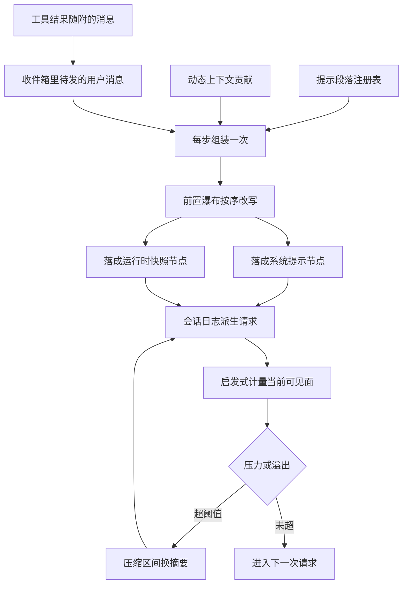

# Context 上下文模块 · 函数级深度展开

> 分析对象:[deepseek-ai/deepseek-harness](https://github.com/deepseek-ai/deepseek-harness) @ `dbbaa4a37`

---

## 篇目索引

| 文件 | 主题 | 核心源码 | 一句话 |
|---|---|---|---|
| [01-context-sources.md](./01-context-sources.md) | 窗口里到底放了哪几类东西 | [`packages/core/system-prompt/src/index.ts`](https://github.com/deepseek-ai/deepseek-harness/blob/dbbaa4a37fb9098aba814c97d2956f7b2f105f46/packages/core/system-prompt/src/index.ts)、[`packages/core/agent-loop/src/agent.ts`](https://github.com/deepseek-ai/deepseek-harness/blob/dbbaa4a37fb9098aba814c97d2956f7b2f105f46/packages/core/agent-loop/src/agent.ts) | 六条来源通道各有自己的产生者与生命周期:提示段落与动态上下文走注册表、会话历史走 surface 折叠、工具结果走 inbox、插件消息走 pre-step 瀑布、压缩检查点走区间替换 |
| [02-per-step-assembly.md](./02-per-step-assembly.md) | `preStep()` 的完整序列 | [`packages/core/agent-loop/src/agent.ts:240-259`](https://github.com/deepseek-ai/deepseek-harness/blob/dbbaa4a37fb9098aba814c97d2956f7b2f105f46/packages/core/agent-loop/src/agent.ts#L240-L259)、[`packages/core/agent/src/dispatch.ts:174-176`](https://github.com/deepseek-ai/deepseek-harness/blob/dbbaa4a37fb9098aba814c97d2956f7b2f105f46/packages/core/agent/src/dispatch.ts#L174-L176) | 每步固定四件事:认领收件箱、按 agent 作用域组装提示、投影运行时快照、过一遍可拒绝的瀑布;只有首个尝试会把这些落成日志 |
| [03-runtime-context.md](./03-runtime-context.md) | 动态快照的增量提交 | [`packages/core/agent-loop/src/runtime-context.ts:108-159`](https://github.com/deepseek-ai/deepseek-harness/blob/dbbaa4a37fb9098aba814c97d2956f7b2f105f46/packages/core/agent-loop/src/runtime-context.ts#L108-L159) | 快照不是每步重发,而是与上一次落盘文本比对;被压缩吃掉时置回"无保留",下次渲染重新追加 |
| [04-token-metering.md](./04-token-metering.md) | 计量:锚点加有符号增量 | `packages/llm/token-meter/src/` | `measure()` 用 provider 报的用量做锚点、用固定启发式算出其后的净变化;发布给 UI 的占用率把这一步再折一次 |
| [05-compaction-and-spill.md](./05-compaction-and-spill.md) | 超预算时先牺牲谁 | `packages/compaction/compaction-basic/src/`、[`packages/spill/spill-policy/src/index.ts`](https://github.com/deepseek-ai/deepseek-harness/blob/dbbaa4a37fb9098aba814c97d2956f7b2f105f46/packages/spill/spill-policy/src/index.ts) | 压力触发点先让步于无模型裁剪,再选一段尾部保留之外的区间换摘要;溢写处理单条结果过大,与窗口压力是两件事 |
| [06-context-plugins.md](./06-context-plugins.md) | `packages/context/` 逐个走查 | `packages/context/*/src/index.ts` | 六个包按"贡献什么、以什么形态注入、失败怎么降级"逐一看;三个走注册表、三个走 pre-step 消息 |

推荐阅读顺序:01 → 02 → 03 → 04 → 05,06 是六个插件的横切走查。

---

## 从来源到压缩决策的调用栈

上下文模块没有单一入口。模型每步看到的文本来自若干互不知情的生产者,它们在同一个 step 边界上被合流,再由计量服务给出价格,最后由压缩策略决定要不要牺牲中间那段。

下面这张图只画主干,不写函数名与行号:顺着箭头走一遍就知道每一层为什么存在。


<details><summary>Mermaid 源码</summary>



</details>

四个阶段各自的"谁决定"很不一样,这一点决定了改动应该落在哪里:

| 阶段 | 做了什么 | 谁决定 | 关键调用(文件:行) |
|---|---|---|---|
| 来源 | 提示段落与动态上下文写入注册表,注册动作本身即 effect | `ctx.systemPrompt.section()` / `context()` 的贡献者 | [`packages/core/system-prompt/src/index.ts:448-540`](https://github.com/deepseek-ai/deepseek-harness/blob/dbbaa4a37fb9098aba814c97d2956f7b2f105f46/packages/core/system-prompt/src/index.ts#L448-L540) |
| 合流 | 每个 step 取 scope 链上的层合并,求值变量与段落,聚合工具 schema | `assemble()` 的固定顺序 | [`packages/core/system-prompt/src/index.ts:552-627`](https://github.com/deepseek-ai/deepseek-harness/blob/dbbaa4a37fb9098aba814c97d2956f7b2f105f46/packages/core/system-prompt/src/index.ts#L552-L627) |
| 改写 | `agent/pre-step` 瀑布按注册顺序包住默认结果,最后一个决定者给出权威值 | 插件监听器 | [`packages/core/agent-loop/src/agent.ts:249-255`](https://github.com/deepseek-ai/deepseek-harness/blob/dbbaa4a37fb9098aba814c97d2956f7b2f105f46/packages/core/agent-loop/src/agent.ts#L249-L255)、[`packages/core/agent/src/runtime-types.ts:330`](https://github.com/deepseek-ai/deepseek-harness/blob/dbbaa4a37fb9098aba814c97d2956f7b2f105f46/packages/core/agent/src/runtime-types.ts#L330) |
| 落盘 | 系统提示走 `system/message`,动态快照与用户消息走 `user/message` | 循环的投影与追加 | [`packages/core/agent-loop/src/agent.ts:364-377`](https://github.com/deepseek-ai/deepseek-harness/blob/dbbaa4a37fb9098aba814c97d2956f7b2f105f46/packages/core/agent-loop/src/agent.ts#L364-L377) |
| 派生 | 请求的 `messages` 完全来自日志,提示作为 surface 节点 0 随行 | `deriveMessages()` | [`packages/core/agent-loop/src/agent.ts:603`](https://github.com/deepseek-ai/deepseek-harness/blob/dbbaa4a37fb9098aba814c97d2956f7b2f105f46/packages/core/agent-loop/src/agent.ts#L603)、[`packages/core/agent-loop/src/invariant.ts:40-51`](https://github.com/deepseek-ai/deepseek-harness/blob/dbbaa4a37fb9098aba814c97d2956f7b2f105f46/packages/core/agent-loop/src/invariant.ts#L40-L51) |
| 计量 | 用锚点加 surface 增量给出压力,发布占用率 | 无配置的计量服务 | [`packages/llm/token-meter/src/index.ts:145-190`](https://github.com/deepseek-ai/deepseek-harness/blob/dbbaa4a37fb9098aba814c97d2956f7b2f105f46/packages/llm/token-meter/src/index.ts#L145-L190) |
| 决策 | 压力触发点与溢出触发点各自决定是否把一段区间换成摘要 | 压缩策略配置 | [`packages/compaction/compaction-basic/src/index.ts:148-224`](https://github.com/deepseek-ai/deepseek-harness/blob/dbbaa4a37fb9098aba814c97d2956f7b2f105f46/packages/compaction/compaction-basic/src/index.ts#L148-L224) |

<details><summary>完整调用树</summary>

```text
ReactLoopAgent.turn()                                         agent.ts:269
└─ while (true)                                               agent.ts:286
   ├─ preStep(target, {turn, step})                           agent.ts:240
   │  ├─ inbox.claim(target, turn)                            inbox.ts:111
   │  ├─ systemPrompt.assemble(assembleContextFor(this, signal))  agent.ts:245
   │  │  └─ dispatch.ts:174 → { agent, scope: agent, signal }
   │  ├─ renderContextSections(assembly)                      index.ts:312
   │  ├─ runtimeContext.project(joinContextSections(sections), sections)  agent.ts:248
   │  ├─ dispatch.waterfall('agent/pre-step', …)              agent.ts:249
   │  │  ├─ compaction-basic 压力分支                          compaction-basic/index.ts:148
   │  │  ├─ session-reference 引用改写后置                      session-reference/index.ts:135
   │  │  ├─ time-context 读数追加到尾部                        time-context/index.ts:181
   │  │  ├─ tmux-context 读数插到头部                          tmux-context/index.ts:236
   │  │  └─ agent-instructions 插在 claimed 批次之后            agent-instructions/index.ts:315
   │  └─ return { ...decision, assembly }                     agent.ts:258
   ├─ session.append('step/start', {turn, step})              agent.ts:302
   └─ step(decision)                                          agent.ts:352
      ├─ renderPrompt(assembly)                               agent.ts:359
      └─ while (true)                                         agent.ts:361
         ├─ prepareRequest(turn, step, signal)                agent.ts:501
         ├─ systemPrompt.project(renderedPrompt, {…})         agent.ts:364
         ├─ session.append('system/message', …)               agent.ts:371
         ├─ firstAttempt → session.append('user/message', …)  agent.ts:373
         ├─ buildRequest(…) → request/header + request/context  agent.ts:552
         └─ llm.stream(request)                               agent.ts:390
```

</details>

---

## 与相邻模块的分工

| 问题 | 归属 |
|---|---|
| 这一段提示文字由谁写、什么时候生效 | 第九章:提示段落注册、`assemble()`、`SystemPromptProjection` 的重投决策 |
| 这一刻窗口里装了什么、按什么顺序、超了先牺牲谁 | 本模块 |
| 状态怎么存、怎么重放、怎么恢复 | 记忆与持久化章节:`session`、`session-projection`、持久化后端 |
| 一次工具调用怎么跑完 | 工具调用模块 |

---

## 关键文件总表

| 文件 | 行数 | 本模块用到的核心符号 |
|---|---|---|
| [`packages/core/agent-loop/src/agent.ts`](https://github.com/deepseek-ai/deepseek-harness/blob/dbbaa4a37fb9098aba814c97d2956f7b2f105f46/packages/core/agent-loop/src/agent.ts) | 619 | `preStep`([`:240`](https://github.com/deepseek-ai/deepseek-harness/blob/dbbaa4a37fb9098aba814c97d2956f7b2f105f46/packages/core/agent-loop/src/agent.ts#L240))、`toolsChanged`([`:262`](https://github.com/deepseek-ai/deepseek-harness/blob/dbbaa4a37fb9098aba814c97d2956f7b2f105f46/packages/core/agent-loop/src/agent.ts#L262))、`turn`([`:269`](https://github.com/deepseek-ai/deepseek-harness/blob/dbbaa4a37fb9098aba814c97d2956f7b2f105f46/packages/core/agent-loop/src/agent.ts#L269))、`step`([`:352`](https://github.com/deepseek-ai/deepseek-harness/blob/dbbaa4a37fb9098aba814c97d2956f7b2f105f46/packages/core/agent-loop/src/agent.ts#L352))、`prepareRequest`([`:501`](https://github.com/deepseek-ai/deepseek-harness/blob/dbbaa4a37fb9098aba814c97d2956f7b2f105f46/packages/core/agent-loop/src/agent.ts#L501))、`buildRequest`([`:553`](https://github.com/deepseek-ai/deepseek-harness/blob/dbbaa4a37fb9098aba814c97d2956f7b2f105f46/packages/core/agent-loop/src/agent.ts#L553)) |
| [`packages/core/agent-loop/src/runtime-context.ts`](https://github.com/deepseek-ai/deepseek-harness/blob/dbbaa4a37fb9098aba814c97d2956f7b2f105f46/packages/core/agent-loop/src/runtime-context.ts) | 159 | `SystemPromptProjection`([`:60`](https://github.com/deepseek-ai/deepseek-harness/blob/dbbaa4a37fb9098aba814c97d2956f7b2f105f46/packages/core/agent-loop/src/runtime-context.ts#L60))、`RuntimeContextProjection`([`:109`](https://github.com/deepseek-ai/deepseek-harness/blob/dbbaa4a37fb9098aba814c97d2956f7b2f105f46/packages/core/agent-loop/src/runtime-context.ts#L109))、`CLEARED`([`:15`](https://github.com/deepseek-ai/deepseek-harness/blob/dbbaa4a37fb9098aba814c97d2956f7b2f105f46/packages/core/agent-loop/src/runtime-context.ts#L15))、`SOURCE`([`:14`](https://github.com/deepseek-ai/deepseek-harness/blob/dbbaa4a37fb9098aba814c97d2956f7b2f105f46/packages/core/agent-loop/src/runtime-context.ts#L14)) |
| [`packages/core/agent-loop/src/inbox.ts`](https://github.com/deepseek-ai/deepseek-harness/blob/dbbaa4a37fb9098aba814c97d2956f7b2f105f46/packages/core/agent-loop/src/inbox.ts) | 247 | `inboxProjectionDefinition`([`:27`](https://github.com/deepseek-ai/deepseek-harness/blob/dbbaa4a37fb9098aba814c97d2956f7b2f105f46/packages/core/agent-loop/src/inbox.ts#L27))、`ReactLoopInbox`([`:74`](https://github.com/deepseek-ai/deepseek-harness/blob/dbbaa4a37fb9098aba814c97d2956f7b2f105f46/packages/core/agent-loop/src/inbox.ts#L74))、`claim`([`:111`](https://github.com/deepseek-ai/deepseek-harness/blob/dbbaa4a37fb9098aba814c97d2956f7b2f105f46/packages/core/agent-loop/src/inbox.ts#L111))、`splice`([`:169`](https://github.com/deepseek-ai/deepseek-harness/blob/dbbaa4a37fb9098aba814c97d2956f7b2f105f46/packages/core/agent-loop/src/inbox.ts#L169))、`mutate`([`:201`](https://github.com/deepseek-ai/deepseek-harness/blob/dbbaa4a37fb9098aba814c97d2956f7b2f105f46/packages/core/agent-loop/src/inbox.ts#L201)) |
| [`packages/core/agent-loop/src/tool-calls.ts`](https://github.com/deepseek-ai/deepseek-harness/blob/dbbaa4a37fb9098aba814c97d2956f7b2f105f46/packages/core/agent-loop/src/tool-calls.ts) | 290 | `executeToolCalls`([`:60`](https://github.com/deepseek-ai/deepseek-harness/blob/dbbaa4a37fb9098aba814c97d2956f7b2f105f46/packages/core/agent-loop/src/tool-calls.ts#L60))、`commitReady`([`:147`](https://github.com/deepseek-ai/deepseek-harness/blob/dbbaa4a37fb9098aba814c97d2956f7b2f105f46/packages/core/agent-loop/src/tool-calls.ts#L147))——`additionalContexts` 在此逐条交回调用方 |
| [`packages/core/agent-loop/src/invariant.ts`](https://github.com/deepseek-ai/deepseek-harness/blob/dbbaa4a37fb9098aba814c97d2956f7b2f105f46/packages/core/agent-loop/src/invariant.ts) | 65 | `install`([`:19`](https://github.com/deepseek-ai/deepseek-harness/blob/dbbaa4a37fb9098aba814c97d2956f7b2f105f46/packages/core/agent-loop/src/invariant.ts#L19))——请求必须由日志重建的运行时断言 |
| [`packages/core/system-prompt/src/index.ts`](https://github.com/deepseek-ai/deepseek-harness/blob/dbbaa4a37fb9098aba814c97d2956f7b2f105f46/packages/core/system-prompt/src/index.ts) | 630 | `CONTEXT_ORDERS`([`:159`](https://github.com/deepseek-ai/deepseek-harness/blob/dbbaa4a37fb9098aba814c97d2956f7b2f105f46/packages/core/system-prompt/src/index.ts#L159))、`renderContextSnapshot`([`:285`](https://github.com/deepseek-ai/deepseek-harness/blob/dbbaa4a37fb9098aba814c97d2956f7b2f105f46/packages/core/system-prompt/src/index.ts#L285))、`joinContextSections`([`:297`](https://github.com/deepseek-ai/deepseek-harness/blob/dbbaa4a37fb9098aba814c97d2956f7b2f105f46/packages/core/system-prompt/src/index.ts#L297))、`renderContextSections`([`:312`](https://github.com/deepseek-ai/deepseek-harness/blob/dbbaa4a37fb9098aba814c97d2956f7b2f105f46/packages/core/system-prompt/src/index.ts#L312))、`assemble`([`:552`](https://github.com/deepseek-ai/deepseek-harness/blob/dbbaa4a37fb9098aba814c97d2956f7b2f105f46/packages/core/system-prompt/src/index.ts#L552)) |
| [`packages/core/agent/src/dispatch.ts`](https://github.com/deepseek-ai/deepseek-harness/blob/dbbaa4a37fb9098aba814c97d2956f7b2f105f46/packages/core/agent/src/dispatch.ts) | 176 | `assembleContextFor`([`:174`](https://github.com/deepseek-ai/deepseek-harness/blob/dbbaa4a37fb9098aba814c97d2956f7b2f105f46/packages/core/agent/src/dispatch.ts#L174)) |
| [`packages/core/agent/src/runtime-types.ts`](https://github.com/deepseek-ai/deepseek-harness/blob/dbbaa4a37fb9098aba814c97d2956f7b2f105f46/packages/core/agent/src/runtime-types.ts) | 405 | `PreStepDecision`([`:112`](https://github.com/deepseek-ai/deepseek-harness/blob/dbbaa4a37fb9098aba814c97d2956f7b2f105f46/packages/core/agent/src/runtime-types.ts#L112))、`agent/pre-step`([`:330`](https://github.com/deepseek-ai/deepseek-harness/blob/dbbaa4a37fb9098aba814c97d2956f7b2f105f46/packages/core/agent/src/runtime-types.ts#L330)) |
| [`packages/llm/llm/src/message.ts`](https://github.com/deepseek-ai/deepseek-harness/blob/dbbaa4a37fb9098aba814c97d2956f7b2f105f46/packages/llm/llm/src/message.ts) | 268 | `ContextSnapshotSection`([`:65`](https://github.com/deepseek-ai/deepseek-harness/blob/dbbaa4a37fb9098aba814c97d2956f7b2f105f46/packages/llm/llm/src/message.ts#L65))、`ContextFormed`([`:81`](https://github.com/deepseek-ai/deepseek-harness/blob/dbbaa4a37fb9098aba814c97d2956f7b2f105f46/packages/llm/llm/src/message.ts#L81)) |
| [`packages/llm/token-meter/src/estimate.ts`](https://github.com/deepseek-ai/deepseek-harness/blob/dbbaa4a37fb9098aba814c97d2956f7b2f105f46/packages/llm/token-meter/src/estimate.ts) | 100 | `estimateStructuralBlock`([`:28`](https://github.com/deepseek-ai/deepseek-harness/blob/dbbaa4a37fb9098aba814c97d2956f7b2f105f46/packages/llm/token-meter/src/estimate.ts#L28))、`estimateContent`([`:37`](https://github.com/deepseek-ai/deepseek-harness/blob/dbbaa4a37fb9098aba814c97d2956f7b2f105f46/packages/llm/token-meter/src/estimate.ts#L37))、`estimateSystemMessage`([`:71`](https://github.com/deepseek-ai/deepseek-harness/blob/dbbaa4a37fb9098aba814c97d2956f7b2f105f46/packages/llm/token-meter/src/estimate.ts#L71))、`estimateMessage`([`:86`](https://github.com/deepseek-ai/deepseek-harness/blob/dbbaa4a37fb9098aba814c97d2956f7b2f105f46/packages/llm/token-meter/src/estimate.ts#L86))、`estimateToolsTokens`([`:97`](https://github.com/deepseek-ai/deepseek-harness/blob/dbbaa4a37fb9098aba814c97d2956f7b2f105f46/packages/llm/token-meter/src/estimate.ts#L97)) |
| [`packages/llm/token-meter/src/index.ts`](https://github.com/deepseek-ai/deepseek-harness/blob/dbbaa4a37fb9098aba814c97d2956f7b2f105f46/packages/llm/token-meter/src/index.ts) | 329 | `TokenMeter`([`:100`](https://github.com/deepseek-ai/deepseek-harness/blob/dbbaa4a37fb9098aba814c97d2956f7b2f105f46/packages/llm/token-meter/src/index.ts#L100))、`measure`([`:145`](https://github.com/deepseek-ai/deepseek-harness/blob/dbbaa4a37fb9098aba814c97d2956f7b2f105f46/packages/llm/token-meter/src/index.ts#L145))、`_sync`([`:218`](https://github.com/deepseek-ai/deepseek-harness/blob/dbbaa4a37fb9098aba814c97d2956f7b2f105f46/packages/llm/token-meter/src/index.ts#L218))、`_foldEvent`([`:246`](https://github.com/deepseek-ai/deepseek-harness/blob/dbbaa4a37fb9098aba814c97d2956f7b2f105f46/packages/llm/token-meter/src/index.ts#L246)) |
| [`packages/llm/token-meter/src/surface-fold.ts`](https://github.com/deepseek-ai/deepseek-harness/blob/dbbaa4a37fb9098aba814c97d2956f7b2f105f46/packages/llm/token-meter/src/surface-fold.ts) | 147 | `planSurfaceTokens`([`:112`](https://github.com/deepseek-ai/deepseek-harness/blob/dbbaa4a37fb9098aba814c97d2956f7b2f105f46/packages/llm/token-meter/src/surface-fold.ts#L112))、`commitSurfaceTokens`([`:141`](https://github.com/deepseek-ai/deepseek-harness/blob/dbbaa4a37fb9098aba814c97d2956f7b2f105f46/packages/llm/token-meter/src/surface-fold.ts#L141)) |
| [`packages/llm/token-meter/src/surface-projection.ts`](https://github.com/deepseek-ai/deepseek-harness/blob/dbbaa4a37fb9098aba814c97d2956f7b2f105f46/packages/llm/token-meter/src/surface-projection.ts) | 96 | `ShadowPriceClaim`([`:29`](https://github.com/deepseek-ai/deepseek-harness/blob/dbbaa4a37fb9098aba814c97d2956f7b2f105f46/packages/llm/token-meter/src/surface-projection.ts#L29))、`foldSurfaceProjection`([`:64`](https://github.com/deepseek-ai/deepseek-harness/blob/dbbaa4a37fb9098aba814c97d2956f7b2f105f46/packages/llm/token-meter/src/surface-projection.ts#L64)) |
| [`packages/llm/token-meter/src/usage-projection.ts`](https://github.com/deepseek-ai/deepseek-harness/blob/dbbaa4a37fb9098aba814c97d2956f7b2f105f46/packages/llm/token-meter/src/usage-projection.ts) | 218 | `tokenUsageProjectionDefinition`([`:117`](https://github.com/deepseek-ai/deepseek-harness/blob/dbbaa4a37fb9098aba814c97d2956f7b2f105f46/packages/llm/token-meter/src/usage-projection.ts#L117))、`contextPressureProjectionDefinition`([`:173`](https://github.com/deepseek-ai/deepseek-harness/blob/dbbaa4a37fb9098aba814c97d2956f7b2f105f46/packages/llm/token-meter/src/usage-projection.ts#L173)) |
| [`packages/llm/token-meter/src/route-pricing.ts`](https://github.com/deepseek-ai/deepseek-harness/blob/dbbaa4a37fb9098aba814c97d2956f7b2f105f46/packages/llm/token-meter/src/route-pricing.ts) | 76 | `priceSurface`([`:32`](https://github.com/deepseek-ai/deepseek-harness/blob/dbbaa4a37fb9098aba814c97d2956f7b2f105f46/packages/llm/token-meter/src/route-pricing.ts#L32)) |
| [`packages/llm/token-meter/src/breakdown-projection.ts`](https://github.com/deepseek-ai/deepseek-harness/blob/dbbaa4a37fb9098aba814c97d2956f7b2f105f46/packages/llm/token-meter/src/breakdown-projection.ts) | 81 | `contextBreakdownProjectionDefinition`([`:48`](https://github.com/deepseek-ai/deepseek-harness/blob/dbbaa4a37fb9098aba814c97d2956f7b2f105f46/packages/llm/token-meter/src/breakdown-projection.ts#L48)) |
| [`packages/compaction/compaction/src/index.ts`](https://github.com/deepseek-ai/deepseek-harness/blob/dbbaa4a37fb9098aba814c97d2956f7b2f105f46/packages/compaction/compaction/src/index.ts) | 172 | `CompactionEngine`([`:96`](https://github.com/deepseek-ai/deepseek-harness/blob/dbbaa4a37fb9098aba814c97d2956f7b2f105f46/packages/compaction/compaction/src/index.ts#L96))、`ManualCompactionError`([`:41`](https://github.com/deepseek-ai/deepseek-harness/blob/dbbaa4a37fb9098aba814c97d2956f7b2f105f46/packages/compaction/compaction/src/index.ts#L41))、`CompactionTrigger`([`:25`](https://github.com/deepseek-ai/deepseek-harness/blob/dbbaa4a37fb9098aba814c97d2956f7b2f105f46/packages/compaction/compaction/src/index.ts#L25)) |
| [`packages/compaction/compaction-basic/src/index.ts`](https://github.com/deepseek-ai/deepseek-harness/blob/dbbaa4a37fb9098aba814c97d2956f7b2f105f46/packages/compaction/compaction-basic/src/index.ts) | 432 | `BasicCompactionEngine`([`:104`](https://github.com/deepseek-ai/deepseek-harness/blob/dbbaa4a37fb9098aba814c97d2956f7b2f105f46/packages/compaction/compaction-basic/src/index.ts#L104))、`_registerAutomaticCompaction`([`:138`](https://github.com/deepseek-ai/deepseek-harness/blob/dbbaa4a37fb9098aba814c97d2956f7b2f105f46/packages/compaction/compaction-basic/src/index.ts#L138))、`compactIfNeeded`([`:259`](https://github.com/deepseek-ai/deepseek-harness/blob/dbbaa4a37fb9098aba814c97d2956f7b2f105f46/packages/compaction/compaction-basic/src/index.ts#L259))、`compactRegion`([`:344`](https://github.com/deepseek-ai/deepseek-harness/blob/dbbaa4a37fb9098aba814c97d2956f7b2f105f46/packages/compaction/compaction-basic/src/index.ts#L344)) |
| [`packages/compaction/compaction-basic/src/config.ts`](https://github.com/deepseek-ai/deepseek-harness/blob/dbbaa4a37fb9098aba814c97d2956f7b2f105f46/packages/compaction/compaction-basic/src/config.ts) | 310 | `resolveConfig`([`:67`](https://github.com/deepseek-ai/deepseek-harness/blob/dbbaa4a37fb9098aba814c97d2956f7b2f105f46/packages/compaction/compaction-basic/src/config.ts#L67))、`resolveTargetPolicy`([`:105`](https://github.com/deepseek-ai/deepseek-harness/blob/dbbaa4a37fb9098aba814c97d2956f7b2f105f46/packages/compaction/compaction-basic/src/config.ts#L105))、`resolveCompactSpec`([`:133`](https://github.com/deepseek-ai/deepseek-harness/blob/dbbaa4a37fb9098aba814c97d2956f7b2f105f46/packages/compaction/compaction-basic/src/config.ts#L133)) |
| [`packages/compaction/compaction-basic/src/region.ts`](https://github.com/deepseek-ai/deepseek-harness/blob/dbbaa4a37fb9098aba814c97d2956f7b2f105f46/packages/compaction/compaction-basic/src/region.ts) | 585 | `selectCompactableRange`([`:117`](https://github.com/deepseek-ai/deepseek-harness/blob/dbbaa4a37fb9098aba814c97d2956f7b2f105f46/packages/compaction/compaction-basic/src/region.ts#L117))、`compactSurfaceRegion`([`:173`](https://github.com/deepseek-ai/deepseek-harness/blob/dbbaa4a37fb9098aba814c97d2956f7b2f105f46/packages/compaction/compaction-basic/src/region.ts#L173))、`commitCompactionBody`([`:456`](https://github.com/deepseek-ai/deepseek-harness/blob/dbbaa4a37fb9098aba814c97d2956f7b2f105f46/packages/compaction/compaction-basic/src/region.ts#L456))、`buildSummarizationInput`([`:529`](https://github.com/deepseek-ai/deepseek-harness/blob/dbbaa4a37fb9098aba814c97d2956f7b2f105f46/packages/compaction/compaction-basic/src/region.ts#L529)) |
| [`packages/compaction/compaction-basic/src/summarizer.ts`](https://github.com/deepseek-ai/deepseek-harness/blob/dbbaa4a37fb9098aba814c97d2956f7b2f105f46/packages/compaction/compaction-basic/src/summarizer.ts) | 221 | `summarizeWithLlm`([`:119`](https://github.com/deepseek-ai/deepseek-harness/blob/dbbaa4a37fb9098aba814c97d2956f7b2f105f46/packages/compaction/compaction-basic/src/summarizer.ts#L119))、`frameSummary`([`:186`](https://github.com/deepseek-ai/deepseek-harness/blob/dbbaa4a37fb9098aba814c97d2956f7b2f105f46/packages/compaction/compaction-basic/src/summarizer.ts#L186))、`COMPACTION_INSTRUCTION`([`:31`](https://github.com/deepseek-ai/deepseek-harness/blob/dbbaa4a37fb9098aba814c97d2956f7b2f105f46/packages/compaction/compaction-basic/src/summarizer.ts#L31)) |
| [`packages/compaction/compaction-tool-result-pruner/src/index.ts`](https://github.com/deepseek-ai/deepseek-harness/blob/dbbaa4a37fb9098aba814c97d2956f7b2f105f46/packages/compaction/compaction-tool-result-pruner/src/index.ts) | 188 | `pruneContent`([`:83`](https://github.com/deepseek-ai/deepseek-harness/blob/dbbaa4a37fb9098aba814c97d2956f7b2f105f46/packages/compaction/compaction-tool-result-pruner/src/index.ts#L83))、`pruneSession`([`:136`](https://github.com/deepseek-ai/deepseek-harness/blob/dbbaa4a37fb9098aba814c97d2956f7b2f105f46/packages/compaction/compaction-tool-result-pruner/src/index.ts#L136)) |
| [`packages/spill/spill-policy/src/index.ts`](https://github.com/deepseek-ai/deepseek-harness/blob/dbbaa4a37fb9098aba814c97d2956f7b2f105f46/packages/spill/spill-policy/src/index.ts) | 227 | `apply`([`:105`](https://github.com/deepseek-ai/deepseek-harness/blob/dbbaa4a37fb9098aba814c97d2956f7b2f105f46/packages/spill/spill-policy/src/index.ts#L105))、`spillReplacement`([`:125`](https://github.com/deepseek-ai/deepseek-harness/blob/dbbaa4a37fb9098aba814c97d2956f7b2f105f46/packages/spill/spill-policy/src/index.ts#L125)) |
| [`packages/context/session-reference/src/index.ts`](https://github.com/deepseek-ai/deepseek-harness/blob/dbbaa4a37fb9098aba814c97d2956f7b2f105f46/packages/context/session-reference/src/index.ts) | 471 | `SessionReferenceResolver`([`:85`](https://github.com/deepseek-ai/deepseek-harness/blob/dbbaa4a37fb9098aba814c97d2956f7b2f105f46/packages/context/session-reference/src/index.ts#L85))、`prepare`([`:298`](https://github.com/deepseek-ai/deepseek-harness/blob/dbbaa4a37fb9098aba814c97d2956f7b2f105f46/packages/context/session-reference/src/index.ts#L298))、`referenceBudget`([`:359`](https://github.com/deepseek-ai/deepseek-harness/blob/dbbaa4a37fb9098aba814c97d2956f7b2f105f46/packages/context/session-reference/src/index.ts#L359)) |
| [`packages/context/time-context/src/index.ts`](https://github.com/deepseek-ai/deepseek-harness/blob/dbbaa4a37fb9098aba814c97d2956f7b2f105f46/packages/context/time-context/src/index.ts) | 222 | `apply`([`:128`](https://github.com/deepseek-ai/deepseek-harness/blob/dbbaa4a37fb9098aba814c97d2956f7b2f105f46/packages/context/time-context/src/index.ts#L128))、`requestMessages`([`:80`](https://github.com/deepseek-ai/deepseek-harness/blob/dbbaa4a37fb9098aba814c97d2956f7b2f105f46/packages/context/time-context/src/index.ts#L80))、`renderText`([`:93`](https://github.com/deepseek-ai/deepseek-harness/blob/dbbaa4a37fb9098aba814c97d2956f7b2f105f46/packages/context/time-context/src/index.ts#L93)) |
| [`packages/context/tmux-context/src/index.ts`](https://github.com/deepseek-ai/deepseek-harness/blob/dbbaa4a37fb9098aba814c97d2956f7b2f105f46/packages/context/tmux-context/src/index.ts) | 265 | `queryTmuxLocation`([`:109`](https://github.com/deepseek-ai/deepseek-harness/blob/dbbaa4a37fb9098aba814c97d2956f7b2f105f46/packages/context/tmux-context/src/index.ts#L109))、`renderState`([`:164`](https://github.com/deepseek-ai/deepseek-harness/blob/dbbaa4a37fb9098aba814c97d2956f7b2f105f46/packages/context/tmux-context/src/index.ts#L164))、`apply`([`:215`](https://github.com/deepseek-ai/deepseek-harness/blob/dbbaa4a37fb9098aba814c97d2956f7b2f105f46/packages/context/tmux-context/src/index.ts#L215)) |
| [`packages/context/agent-instructions/src/index.ts`](https://github.com/deepseek-ai/deepseek-harness/blob/dbbaa4a37fb9098aba814c97d2956f7b2f105f46/packages/context/agent-instructions/src/index.ts) | 360 | `apply`([`:84`](https://github.com/deepseek-ai/deepseek-harness/blob/dbbaa4a37fb9098aba814c97d2956f7b2f105f46/packages/context/agent-instructions/src/index.ts#L84))、`compose`([`:108`](https://github.com/deepseek-ai/deepseek-harness/blob/dbbaa4a37fb9098aba814c97d2956f7b2f105f46/packages/context/agent-instructions/src/index.ts#L108))、`syncInbox`([`:227`](https://github.com/deepseek-ai/deepseek-harness/blob/dbbaa4a37fb9098aba814c97d2956f7b2f105f46/packages/context/agent-instructions/src/index.ts#L227))、`projectTouch`([`:296`](https://github.com/deepseek-ai/deepseek-harness/blob/dbbaa4a37fb9098aba814c97d2956f7b2f105f46/packages/context/agent-instructions/src/index.ts#L296)) |
| [`packages/context/file-reference/src/index.ts`](https://github.com/deepseek-ai/deepseek-harness/blob/dbbaa4a37fb9098aba814c97d2956f7b2f105f46/packages/context/file-reference/src/index.ts) | 45 | `FileReferenceService`([`:26`](https://github.com/deepseek-ai/deepseek-harness/blob/dbbaa4a37fb9098aba814c97d2956f7b2f105f46/packages/context/file-reference/src/index.ts#L26))、`FILE_REFERENCE_PROMPT`([`:17`](https://github.com/deepseek-ai/deepseek-harness/blob/dbbaa4a37fb9098aba814c97d2956f7b2f105f46/packages/context/file-reference/src/index.ts#L17)) |
| [`packages/context/file-reference-local/src/index.ts`](https://github.com/deepseek-ai/deepseek-harness/blob/dbbaa4a37fb9098aba814c97d2956f7b2f105f46/packages/context/file-reference-local/src/index.ts) | 139 | `LocalFileReferenceService`([`:44`](https://github.com/deepseek-ai/deepseek-harness/blob/dbbaa4a37fb9098aba814c97d2956f7b2f105f46/packages/context/file-reference-local/src/index.ts#L44))、`list`([`:113`](https://github.com/deepseek-ai/deepseek-harness/blob/dbbaa4a37fb9098aba814c97d2956f7b2f105f46/packages/context/file-reference-local/src/index.ts#L113)) |
