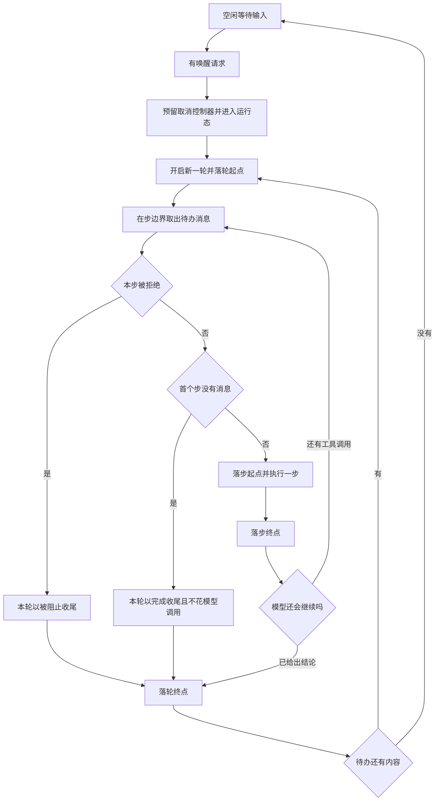
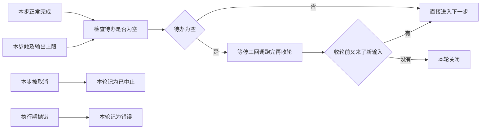

# 01 · 主循环骨架:相位机、轮与步的嵌套、驱动退出条件

> 核心源码:[`packages/core/agent-loop/src/agent.ts`](https://github.com/deepseek-ai/deepseek-harness/blob/dbbaa4a37fb9098aba814c97d2956f7b2f105f46/packages/core/agent-loop/src/agent.ts)(619 行)。
> [`agent.ts:41-49`](https://github.com/deepseek-ai/deepseek-harness/blob/dbbaa4a37fb9098aba814c97d2956f7b2f105f46/packages/core/agent-loop/src/agent.ts#L41-L49) 定义相位,[`:225-350`](https://github.com/deepseek-ai/deepseek-harness/blob/dbbaa4a37fb9098aba814c97d2956f7b2f105f46/packages/core/agent-loop/src/agent.ts#L225-L350) 是驱动体与轮循环,[`:352-498`](https://github.com/deepseek-ai/deepseek-harness/blob/dbbaa4a37fb9098aba814c97d2956f7b2f105f46/packages/core/agent-loop/src/agent.ts#L352-L498) 是一步的全部内容。

---

主循环是一台三态机器:空闲时等输入,运行时把输入切成轮与步,维护时占住这个 agent 干不驱动模型的活。把三种活动分开,是为了让"取消谁""等谁静默""能不能插队"各自只有一个答案;把轮与步分成两层,则是为了让一次用户往返能容纳任意多次模型调用,而日志仍能精确指出每件事发生在第几轮、第几步。这一篇从相位定义一路走到驱动退出,把三个层次的职责边界与事件落点铺开。

## 一、相位只有三个,而且它们是互斥的

`ReactLoopAgent` 不维护"当前在跑什么"这种模糊状态,它只维护一个判别式联合([`agent.ts:41`](https://github.com/deepseek-ai/deepseek-harness/blob/dbbaa4a37fb9098aba814c97d2956f7b2f105f46/packages/core/agent-loop/src/agent.ts#L41)):

```typescript
// packages/core/agent-loop/src/agent.ts:41-49
type Phase =
  | { kind: 'idle'; lastTurn: number }
  | {
    kind: 'maintenance'
    abort: AbortController
    lastTurn: number
    wakeRequested: boolean
  }
  | { kind: 'running'; abort: AbortController; turn: number; step: number; wakeRequested: boolean }
```

三态的划分依据是"**谁持有取消控制器**":空闲态没有活动,所以没有控制器;维护态和运行态各持有一个,`cancel()` 打的永远是当前那个;运行态还额外持有轮号与步号,因为这两个数在事件落点上是必填的。`lastTurn` 在三态里都存在,它的唯一来源是构造时从 `turnBoundary` 投影读出的上一次轮号([`agent.ts:108`](https://github.com/deepseek-ai/deepseek-harness/blob/dbbaa4a37fb9098aba814c97d2956f7b2f105f46/packages/core/agent-loop/src/agent.ts#L108)),这样 resume 之后第一轮的编号接着历史走。

对外只有两种状态。`maintenance` 与 `idle` 都映射成 `idle`([`agent.ts:114-116`](https://github.com/deepseek-ai/deepseek-harness/blob/dbbaa4a37fb9098aba814c97d2956f7b2f105f46/packages/core/agent-loop/src/agent.ts#L114-L116)),因为维护任务不驱动轮,模型没有任何可见的东西在发生:

```typescript
// packages/core/agent-loop/src/agent.ts:114-116
  get status(): AgentStatus {
    return this.phase.kind === 'idle' || this.phase.kind === 'maintenance' ? 'idle' : 'running'
  }
```

状态的对外发布由 `setPhase` 独占,并且在**值没变时不发事件**([`agent.ts:119-126`](https://github.com/deepseek-ai/deepseek-harness/blob/dbbaa4a37fb9098aba814c97d2956f7b2f105f46/packages/core/agent-loop/src/agent.ts#L119-L126))。这一条不是优化而是不变量:[`packages/core/agent/src/invariant.ts:17`](https://github.com/deepseek-ai/deepseek-harness/blob/dbbaa4a37fb9098aba814c97d2956f7b2f105f46/packages/core/agent/src/invariant.ts#L17) 会订阅 `agent/status` 并对"重复进入同一状态"直接判违规,所以任何绕过 `setPhase` 直接改相位的写法都会在诊断开启时当场炸掉。

```typescript
// packages/core/agent-loop/src/agent.ts:118-126
  /** Commit a phase and publish its externally visible status transition. */
  private setPhase(next: Phase): void {
    const previousStatus = this.status
    this.phase = next
    const status = this.status
    if (status !== previousStatus) {
      this.dispatch.emit('agent/status', { status })
    }
  }
```

## 二、层次关系:驱动体包着轮,轮包着步

三个名字容易混,职责其实是一条直线:

- **驱动体(`kick`)** —— 一次"这个 agent 被唤醒后要干完的活"。它唯一的工作就是反复要轮,直到某一轮说要停。
- **轮(`turn`)** —— 一次用户可感知的往返。`turn/start` 与 `turn/end` 之间可能夹着零个、一个或多个步;轮内循环的继续条件是"模型还没给出结论"。
- **步(`step`)** —— 一次模型请求加上它为请求触发的工具执行。`step/start` 与 `step/end` 严格成对,步内的任何抛错都会被 `finally` 兜住补上终点事件。

嵌套的判据只有一条:**步的返回值决定轮是否继续**。`step()` 在模型没给工具调用时返回 `{ kind: 'completed' }`,在工具结果声明"本轮到此为止"时同样返回完成,只有"还有工具调用要跑"才返回 `null`([`agent.ts:487-492`](https://github.com/deepseek-ai/deepseek-harness/blob/dbbaa4a37fb9098aba814c97d2956f7b2f105f46/packages/core/agent-loop/src/agent.ts#L487-L492))。返回 `null` 意味着轮内循环再转一圈,而不会关闭轮边界——这正是"一次提问、模型连续调十轮工具"能算作一轮的原因。


<details><summary>Mermaid 源码</summary>



</details>

| 阶段 | 做了什么 | 关键调用(文件:行) |
|---|---|---|
| 唤醒与相位切换 | 空闲态收到唤醒时同步预留取消控制器、把轮号接在 `lastTurn` 上、步号归零,然后进入运行态 | [`agent.ts:187`](https://github.com/deepseek-ai/deepseek-harness/blob/dbbaa4a37fb9098aba814c97d2956f7b2f105f46/packages/core/agent-loop/src/agent.ts#L187)、[`agent.ts:200`](https://github.com/deepseek-ai/deepseek-harness/blob/dbbaa4a37fb9098aba814c97d2956f7b2f105f46/packages/core/agent-loop/src/agent.ts#L200) |
| 驱动体入口 | 在属主作用域内跑 `kick`,驱动体内的异常被吞掉(失败已经在更近的位置上报过) | [`agent.ts:207`](https://github.com/deepseek-ai/deepseek-harness/blob/dbbaa4a37fb9098aba814c97d2956f7b2f105f46/packages/core/agent-loop/src/agent.ts#L207)、[`agent.ts:225`](https://github.com/deepseek-ai/deepseek-harness/blob/dbbaa4a37fb9098aba814c97d2956f7b2f105f46/packages/core/agent-loop/src/agent.ts#L225) |
| 轮循环 | `while (await this.turn()) {}` —— 只要轮说要继续,就再开一轮 | [`agent.ts:227`](https://github.com/deepseek-ai/deepseek-harness/blob/dbbaa4a37fb9098aba814c97d2956f7b2f105f46/packages/core/agent-loop/src/agent.ts#L227) |
| 轮边界进入检查 | 相位必须仍是运行态,信号未中止,否则走 `throwError` | [`agent.ts:270`](https://github.com/deepseek-ai/deepseek-harness/blob/dbbaa4a37fb9098aba814c97d2956f7b2f105f46/packages/core/agent-loop/src/agent.ts#L270)、[`agent.ts:275`](https://github.com/deepseek-ai/deepseek-harness/blob/dbbaa4a37fb9098aba814c97d2956f7b2f105f46/packages/core/agent-loop/src/agent.ts#L275) |
| 落轮起点 | `turn/start` 追加失败会让整轮以错误收尾(此时还没有 `turn/end` 的兜底需要) | [`agent.ts:278`](https://github.com/deepseek-ai/deepseek-harness/blob/dbbaa4a37fb9098aba814c97d2956f7b2f105f46/packages/core/agent-loop/src/agent.ts#L278) |
| 轮号推进与初值 | `turn = phase.turn + 1` 只在 `turn/start` 成功后写回相位 | [`agent.ts:276`](https://github.com/deepseek-ai/deepseek-harness/blob/dbbaa4a37fb9098aba814c97d2956f7b2f105f46/packages/core/agent-loop/src/agent.ts#L276)、[`agent.ts:282`](https://github.com/deepseek-ai/deepseek-harness/blob/dbbaa4a37fb9098aba814c97d2956f7b2f105f46/packages/core/agent-loop/src/agent.ts#L282) |
| 步前准备 | 取消息、拼提示、投影动态上下文、跑 `agent/pre-step` 瀑布 | [`agent.ts:240`](https://github.com/deepseek-ai/deepseek-harness/blob/dbbaa4a37fb9098aba814c97d2956f7b2f105f46/packages/core/agent-loop/src/agent.ts#L240) |
| 拒绝分支 | 决策为 `reject` 时本轮直接记为 `blocked`,不落 `step/start` | [`agent.ts:290`](https://github.com/deepseek-ai/deepseek-harness/blob/dbbaa4a37fb9098aba814c97d2956f7b2f105f46/packages/core/agent-loop/src/agent.ts#L290) |
| 空批分支 | 首个步的批次为空则记为 `completed` 并结束本轮,一个模型调用都不花 | [`agent.ts:297`](https://github.com/deepseek-ai/deepseek-harness/blob/dbbaa4a37fb9098aba814c97d2956f7b2f105f46/packages/core/agent-loop/src/agent.ts#L297) |
| 步边界 | 先落 `step/start` 再写步号,步体内无论成败都补 `step/end` | [`agent.ts:302`](https://github.com/deepseek-ai/deepseek-harness/blob/dbbaa4a37fb9098aba814c97d2956f7b2f105f46/packages/core/agent-loop/src/agent.ts#L302)、[`agent.ts:311`](https://github.com/deepseek-ai/deepseek-harness/blob/dbbaa4a37fb9098aba814c97d2956f7b2f105f46/packages/core/agent-loop/src/agent.ts#L311) |
| 步结果登记 | 只有 `max-tokens` 是黏性的:后续正常完成的步不能把它降级 | [`agent.ts:310`](https://github.com/deepseek-ai/deepseek-harness/blob/dbbaa4a37fb9098aba814c97d2956f7b2f105f46/packages/core/agent-loop/src/agent.ts#L310) |
| 收轮前检查 | 已有结束理由且 next-step 待办为空时,先跑 `agent/turn-stopping` 串行回调,回调里新塞的输入会让轮继续 | [`agent.ts:315`](https://github.com/deepseek-ai/deepseek-harness/blob/dbbaa4a37fb9098aba814c97d2956f7b2f105f46/packages/core/agent-loop/src/agent.ts#L315)、[`agent.ts:319`](https://github.com/deepseek-ai/deepseek-harness/blob/dbbaa4a37fb9098aba814c97d2956f7b2f105f46/packages/core/agent-loop/src/agent.ts#L319) |
| 落轮终点 | `turn/end` 携带本轮的结束理由,它自己抛错则走 `throwError` | [`agent.ts:339`](https://github.com/deepseek-ai/deepseek-harness/blob/dbbaa4a37fb9098aba814c97d2956f7b2f105f46/packages/core/agent-loop/src/agent.ts#L339) |
| 驱动收尾 | 相位回到空闲,若期间攒下了唤醒且待办非空,立刻再起一个驱动 | [`agent.ts:232`](https://github.com/deepseek-ai/deepseek-harness/blob/dbbaa4a37fb9098aba814c97d2956f7b2f105f46/packages/core/agent-loop/src/agent.ts#L232)、[`agent.ts:235`](https://github.com/deepseek-ai/deepseek-harness/blob/dbbaa4a37fb9098aba814c97d2956f7b2f105f46/packages/core/agent-loop/src/agent.ts#L235) |

<details><summary>轮循环原始代码</summary>

```typescript
// packages/core/agent-loop/src/agent.ts:285-350(节选)
    try {
      while (true) {
        signal.throwIfAborted()
        const step = phase.step + 1
        const decision = await this.preStep(target, { turn, step })
        if (decision.kind === 'reject') {
          turnEnds = { kind: 'blocked' }
          return false
        }
        if (turnEnds && decision.messages.length === 0) break
        // A removed waking message or an enter decision rewritten to empty
        // still owns the initial turn boundary, but it spends no model call.
        if (phase.step === 0 && decision.messages.length === 0) {
          turnEnds = { kind: 'completed' }
          return false
        }
        signal.throwIfAborted()
        this.session.append('step/start', { turn, step })
        phase.step = step
        try {
          // max-tokens is sticky: once any step hits the ceiling, later steps
          // that complete normally must not downgrade the turn outcome.
          const stepEnd = await this.step(decision)
          // max-tokens stays sticky: a later completed step must not
          // downgrade the turn outcome.
          if (turnEnds === null || turnEnds.kind !== 'max-tokens') turnEnds = stepEnd
        } finally {
          this.session.append('step/end', { turn, step })
        }
        signal.throwIfAborted()
        if (turnEnds && this.inbox.nextStep.length === 0) {
          await this.dispatch.serial('agent/turn-stopping', { turn, signal })
          signal.throwIfAborted()
        }
        if (turnEnds && this.inbox.nextStep.length === 0) break
        target = 'next-step'
      }
    } catch (error: unknown) {
      if (signal.aborted) {
        turnEnds = { kind: 'aborted', reason: signal.reason as AgentCancelCause }
        throw error
      }
      // Every failure is structured: an `LlmError` keeps its facts, anything
      // else flattens to `errorChain` text under the `UNKNOWN` code.
      turnEnds = {
        kind: 'error',
        error: error instanceof LlmError
          ? error.failure
          : { message: errorChain(error), code: 'UNKNOWN' },
      }
      this.throwError(error)
    } finally {
      try {
        // oxlint-disable-next-line typescript/no-non-null-assertion -- every exit assigns a turn ending
        this.session.append('turn/end', { turn, reason: turnEnds! })
      } catch (error: unknown) {
        this.throwError(error)
      }
    }
    if (!this.inbox.hasPending) return false
    phase.abort = new AbortController()
    // A fresh controller makes a latch set on the old one stale: the live driver claims the queue itself.
    phase.wakeRequested = false
    phase.step = 0
    return true
```

</details>

## 三、`turnEnds` 与 max-tokens 的黏性

`turnEnds` 是一个局部变量而不是相位字段,它的生命周期严格等于一轮。这个选择让它天然满足"一轮只有一个结束理由"的要求,但也带来一个必须显式处理的细节:**一轮里可能有一次以上"想结束"的信号**,需要定一个优先级。

优先级由两段代码决定。第一段是正常路径上的写入([`agent.ts:310`](https://github.com/deepseek-ai/deepseek-harness/blob/dbbaa4a37fb9098aba814c97d2956f7b2f105f46/packages/core/agent-loop/src/agent.ts#L310)):只要当前的 `turnEnds` 已经是 `max-tokens`,后续步的返回值一律不覆盖它。第二段是异常路径([`agent.ts:322-335`](https://github.com/deepseek-ai/deepseek-harness/blob/dbbaa4a37fb9098aba814c97d2956f7b2f105f46/packages/core/agent-loop/src/agent.ts#L322-L335)):信号已中止时记 `aborted` 并继续抛(让驱动体收容),否则把错误扁平化成结构化的 `error` 理由,再交给 `throwError` 上报一次。

`max-tokens` 之所以要黏,是因为它的语义是**模型没说完**。一轮里第一个步就顶到了输出上限,第二个步因为工具结果把话补完了并正常结束——如果后者把理由覆盖成 `completed`,回放者会认为这一轮内容完整,而实际上前一段是截断的。`step()` 内部也遵守同一个约定:它在 `finish.kind === 'max-tokens'` 时返回上限理由,且**早于**检查工具调用([`agent.ts:484-486`](https://github.com/deepseek-ai/deepseek-harness/blob/dbbaa4a37fb9098aba814c97d2956f7b2f105f46/packages/core/agent-loop/src/agent.ts#L484-L486))。

结束理由的全部取值来自 `TurnEndReasonMap`([`packages/core/session/src/types.ts:200`](https://github.com/deepseek-ai/deepseek-harness/blob/dbbaa4a37fb9098aba814c97d2956f7b2f105f46/packages/core/session/src/types.ts#L200)),`step()` 只可能产出其中两个([`agent.ts:51`](https://github.com/deepseek-ai/deepseek-harness/blob/dbbaa4a37fb9098aba814c97d2956f7b2f105f46/packages/core/agent-loop/src/agent.ts#L51)):

```typescript
// packages/core/agent-loop/src/agent.ts:51
type StepEndReason = Extract<TurnEndReason, { kind: 'completed' | 'max-tokens' }>
```

其余三种:`blocked` 只由步前拒绝产生([`agent.ts:291`](https://github.com/deepseek-ai/deepseek-harness/blob/dbbaa4a37fb9098aba814c97d2956f7b2f105f46/packages/core/agent-loop/src/agent.ts#L291))、`aborted` 只由信号中止产生([`agent.ts:324`](https://github.com/deepseek-ai/deepseek-harness/blob/dbbaa4a37fb9098aba814c97d2956f7b2f105f46/packages/core/agent-loop/src/agent.ts#L324))、`error` 只由异常产生([`agent.ts:329`](https://github.com/deepseek-ai/deepseek-harness/blob/dbbaa4a37fb9098aba814c97d2956f7b2f105f46/packages/core/agent-loop/src/agent.ts#L329))。`interrupted` 是 resume 修复崩溃日志时合成的,循环从不实时发出它([`packages/core/session/src/types.ts:214-220`](https://github.com/deepseek-ai/deepseek-harness/blob/dbbaa4a37fb9098aba814c97d2956f7b2f105f46/packages/core/session/src/types.ts#L214-L220))。

## 四、驱动什么时候真的退出

`turn()` 有两个出口:`return false` 表示"这一轮结束了,而且不必再开一轮";`return true` 表示"这一轮结束了,但待办里还有东西,请立刻再开一轮"。驱动体就是靠这个布尔值决定生死。穷举下来只有四条路径会让驱动停下:


<details><summary>Mermaid 源码</summary>



</details>

| 退出路径 | 触发条件 | 落点 |
|---|---|---|
| 步前被拒绝 | `agent/pre-step` 返回 `reject`,本轮记 `blocked` 直接返回假 | [`agent.ts:290-293`](https://github.com/deepseek-ai/deepseek-harness/blob/dbbaa4a37fb9098aba814c97d2956f7b2f105f46/packages/core/agent-loop/src/agent.ts#L290-L293) |
| 首个步空批 | 相位步号为 0 且预步决策给出的消息为空,记 `completed` 返回假 | [`agent.ts:297-300`](https://github.com/deepseek-ai/deepseek-harness/blob/dbbaa4a37fb9098aba814c97d2956f7b2f105f46/packages/core/agent-loop/src/agent.ts#L297-L300) |
| 待办耗尽 | 轮正常收尾后 `inbox.hasPending` 为假,返回假 | [`agent.ts:344`](https://github.com/deepseek-ai/deepseek-harness/blob/dbbaa4a37fb9098aba814c97d2956f7b2f105f46/packages/core/agent-loop/src/agent.ts#L344) |
| 还有排队轮 | 待办里存在 next-turn 消息,返回真并把步号清零、换新取消控制器 | [`agent.ts:345-349`](https://github.com/deepseek-ai/deepseek-harness/blob/dbbaa4a37fb9098aba814c97d2956f7b2f105f46/packages/core/agent-loop/src/agent.ts#L345-L349) |
| 失败与取消 | 异常路径统一走 `throwError` 抛出,由 `kick` 的 `catch` 吞掉,随后 `finally` 把相位收回空闲 | [`agent.ts:228`](https://github.com/deepseek-ai/deepseek-harness/blob/dbbaa4a37fb9098aba814c97d2956f7b2f105f46/packages/core/agent-loop/src/agent.ts#L228)、[`agent.ts:232`](https://github.com/deepseek-ai/deepseek-harness/blob/dbbaa4a37fb9098aba814c97d2956f7b2f105f46/packages/core/agent-loop/src/agent.ts#L232) |

最后一条有个容易忽略的收尾:驱动退出时,如果运行期间攒下了唤醒闩锁(`wakeRequested`)且待办确实非空,`kick` 的 `finally` 会**在相位已经变回空闲之后**重新调用 `wakeDriver`([`agent.ts:235`](https://github.com/deepseek-ai/deepseek-harness/blob/dbbaa4a37fb9098aba814c97d2956f7b2f105f46/packages/core/agent-loop/src/agent.ts#L235))。这就是"取消后立刻又发一条消息"能跑起来的原因,也是"维护结束后自动续上"的同一段代码。

`throwError` 是这个骨架里唯一的错误出口,它做两件事:按当前相位推出轮号与步号上报 `agent/error`,然后原样抛出([`agent.ts:218-223`](https://github.com/deepseek-ai/deepseek-harness/blob/dbbaa4a37fb9098aba814c97d2956f7b2f105f46/packages/core/agent-loop/src/agent.ts#L218-L223))。

```typescript
// packages/core/agent-loop/src/agent.ts:217-223
  /** Report one failure at its live boundary, then preserve it for driver containment. */
  private throwError(error: unknown): never {
    const turn = this.phase.kind === 'running' ? this.phase.turn : this.phase.lastTurn
    const step = this.phase.kind === 'running' ? this.phase.step : 0
    this.dispatch.emit('agent/error', { turn, step, error })
    throw error
  }
```

相位里没有轮号的时候(空闲或维护中被外部触发)它退化成 `lastTurn` 与步号 0,所以这条上报永远不会因为"拿不到位置"而丢失。

## 五、轮的边界事件落点

四个边界事件都是 `session.append` 直接写的,没有中间的抽象层:

- `turn/start` 在 `turn()` 的最前段,拿到轮号之后立刻写([`agent.ts:278`](https://github.com/deepseek-ai/deepseek-harness/blob/dbbaa4a37fb9098aba814c97d2956f7b2f105f46/packages/core/agent-loop/src/agent.ts#L278));
- `step/start` 在步前决策通过之后、真正执行之前写([`agent.ts:302`](https://github.com/deepseek-ai/deepseek-harness/blob/dbbaa4a37fb9098aba814c97d2956f7b2f105f46/packages/core/agent-loop/src/agent.ts#L302));
- `step/end` 在步体的 `finally` 里写,保证"抛错也有终点"([`agent.ts:312`](https://github.com/deepseek-ai/deepseek-harness/blob/dbbaa4a37fb9098aba814c97d2956f7b2f105f46/packages/core/agent-loop/src/agent.ts#L312));
- `turn/end` 在轮体的 `finally` 里写,理由变量由上面几个出口赋值([`agent.ts:339`](https://github.com/deepseek-ai/deepseek-harness/blob/dbbaa4a37fb9098aba814c97d2956f7b2f105f46/packages/core/agent-loop/src/agent.ts#L339))。

这四个事件同时被 `dsh-agent-loop` 自己注册的 `turnBoundary` 投影消费([`packages/core/agent-loop/src/index.ts:56-94`](https://github.com/deepseek-ai/deepseek-harness/blob/dbbaa4a37fb9098aba814c97d2956f7b2f105f46/packages/core/agent-loop/src/index.ts#L56-L94)),折叠出 `openTurnStartSeq`、`lastStepStartSeq`、`lastStepBoundary`、`lastTurn` 四个值。生产者与消费者在同一个包里,是本仓库"谁产生事实谁定义投影"这条惯例的一个例子;其他包(比如需要判断"当前是否有一轮未关闭"的步前决策)读的是投影而不是自己去扫日志。

`agent/turn-stopping` 虽然不是会话事件,但它落在轮的收尾线上:它是**串行**(serial)语义,即监听器按顺序依次 `await`,任何一个抛出都会打断后面的监听器并把异常带进轮的 `catch`([`agent.ts:316`](https://github.com/deepseek-ai/deepseek-harness/blob/dbbaa4a37fb9098aba814c97d2956f7b2f105f46/packages/core/agent-loop/src/agent.ts#L316))。它被调用两次判断之间夹着"重读待办"([`agent.ts:319`](https://github.com/deepseek-ai/deepseek-harness/blob/dbbaa4a37fb9098aba814c97d2956f7b2f105f46/packages/core/agent-loop/src/agent.ts#L319)),这就是"监听器想拦下停工,只要 steer 一条消息就够了"的实现方式——数据决定结果,监听器顺序不改变结论。

<details><summary>驱动体与相位收尾原始代码</summary>

```typescript
// packages/core/agent-loop/src/agent.ts:225-238
  private async kick(): Promise<void> {
    try {
      while (await this.turn()) {}
    } catch (_error) {
      // Reported failures and cancellation are contained at the driver boundary.
    } finally {
      /* v8 ignore next -- kick owns a running phase until this driver boundary */
      if (this.phase.kind === 'running') {
        const { turn, wakeRequested } = this.phase
        this.setPhase({ kind: 'idle', lastTurn: turn })
        if (wakeRequested && this.inbox.hasPending) this.wakeDriver()
      }
    }
  }
```

```typescript
// packages/core/agent-loop/src/agent.ts:187-208
  private wakeDriver(wakeAfterAbort = false): void {
    if (this.phase.kind !== 'idle') {
      // Maintenance and aborted drivers cannot deliver the wake: latch it for
      // replay at convergence. Live drivers claim queued work themselves;
      // disposal never latches, so teardown waits on no model turn.
      const reason = this.phase.abort.signal.reason as AgentCancelCause | undefined
      if (reason?.kind !== 'disposed' && (this.phase.kind === 'maintenance' || wakeAfterAbort)) {
        this.phase.wakeRequested = true
      }
      return
    }
    const driver = Promise.withResolvers<void>()
    this.activityDone = driver.promise
    this.setPhase({
      kind: 'running',
      abort: new AbortController(),
      turn: this.phase.lastTurn,
      step: 0,
      wakeRequested: false,
    })
    this.loopCtx.agents.withInitiator(this, () => this.kick()).then(driver.resolve, driver.reject)
  }
```

</details>

## 关键文件/符号索引

| 文件 | 行数 | 符号与行号 |
|---|---|---|
| [`packages/core/agent-loop/src/agent.ts`](https://github.com/deepseek-ai/deepseek-harness/blob/dbbaa4a37fb9098aba814c97d2956f7b2f105f46/packages/core/agent-loop/src/agent.ts) | 619 | `Phase`([`:41`](https://github.com/deepseek-ai/deepseek-harness/blob/dbbaa4a37fb9098aba814c97d2956f7b2f105f46/packages/core/agent-loop/src/agent.ts#L41))、`StepEndReason`([`:51`](https://github.com/deepseek-ai/deepseek-harness/blob/dbbaa4a37fb9098aba814c97d2956f7b2f105f46/packages/core/agent-loop/src/agent.ts#L51))、`ReactLoopAgent`([`:72`](https://github.com/deepseek-ai/deepseek-harness/blob/dbbaa4a37fb9098aba814c97d2956f7b2f105f46/packages/core/agent-loop/src/agent.ts#L72))、`phase`([`:74`](https://github.com/deepseek-ai/deepseek-harness/blob/dbbaa4a37fb9098aba814c97d2956f7b2f105f46/packages/core/agent-loop/src/agent.ts#L74))、`status`([`:114`](https://github.com/deepseek-ai/deepseek-harness/blob/dbbaa4a37fb9098aba814c97d2956f7b2f105f46/packages/core/agent-loop/src/agent.ts#L114))、`setPhase`([`:119`](https://github.com/deepseek-ai/deepseek-harness/blob/dbbaa4a37fb9098aba814c97d2956f7b2f105f46/packages/core/agent-loop/src/agent.ts#L119))、`wakeDriver`([`:187`](https://github.com/deepseek-ai/deepseek-harness/blob/dbbaa4a37fb9098aba814c97d2956f7b2f105f46/packages/core/agent-loop/src/agent.ts#L187))、`whenIdle`([`:210`](https://github.com/deepseek-ai/deepseek-harness/blob/dbbaa4a37fb9098aba814c97d2956f7b2f105f46/packages/core/agent-loop/src/agent.ts#L210))、`throwError`([`:218`](https://github.com/deepseek-ai/deepseek-harness/blob/dbbaa4a37fb9098aba814c97d2956f7b2f105f46/packages/core/agent-loop/src/agent.ts#L218))、`kick`([`:225`](https://github.com/deepseek-ai/deepseek-harness/blob/dbbaa4a37fb9098aba814c97d2956f7b2f105f46/packages/core/agent-loop/src/agent.ts#L225))、`preStep`([`:240`](https://github.com/deepseek-ai/deepseek-harness/blob/dbbaa4a37fb9098aba814c97d2956f7b2f105f46/packages/core/agent-loop/src/agent.ts#L240))、`toolsChanged`([`:262`](https://github.com/deepseek-ai/deepseek-harness/blob/dbbaa4a37fb9098aba814c97d2956f7b2f105f46/packages/core/agent-loop/src/agent.ts#L262))、`turn`([`:269`](https://github.com/deepseek-ai/deepseek-harness/blob/dbbaa4a37fb9098aba814c97d2956f7b2f105f46/packages/core/agent-loop/src/agent.ts#L269))、`step`([`:352`](https://github.com/deepseek-ai/deepseek-harness/blob/dbbaa4a37fb9098aba814c97d2956f7b2f105f46/packages/core/agent-loop/src/agent.ts#L352)) |
| [`packages/core/agent-loop/src/index.ts`](https://github.com/deepseek-ai/deepseek-harness/blob/dbbaa4a37fb9098aba814c97d2956f7b2f105f46/packages/core/agent-loop/src/index.ts) | 930 | `turnBoundaryProjectionDefinition`([`:56`](https://github.com/deepseek-ai/deepseek-harness/blob/dbbaa4a37fb9098aba814c97d2956f7b2f105f46/packages/core/agent-loop/src/index.ts#L56))、`apply`([`:66`](https://github.com/deepseek-ai/deepseek-harness/blob/dbbaa4a37fb9098aba814c97d2956f7b2f105f46/packages/core/agent-loop/src/index.ts#L66)) |
| [`packages/core/agent/src/runtime-types.ts`](https://github.com/deepseek-ai/deepseek-harness/blob/dbbaa4a37fb9098aba814c97d2956f7b2f105f46/packages/core/agent/src/runtime-types.ts) | 405 | `AgentStatus`([`:109`](https://github.com/deepseek-ai/deepseek-harness/blob/dbbaa4a37fb9098aba814c97d2956f7b2f105f46/packages/core/agent/src/runtime-types.ts#L109))、`PreStepDecision`([`:112`](https://github.com/deepseek-ai/deepseek-harness/blob/dbbaa4a37fb9098aba814c97d2956f7b2f105f46/packages/core/agent/src/runtime-types.ts#L112))、`agent/status`([`:277`](https://github.com/deepseek-ai/deepseek-harness/blob/dbbaa4a37fb9098aba814c97d2956f7b2f105f46/packages/core/agent/src/runtime-types.ts#L277))、`agent/turn-stopping`([`:391`](https://github.com/deepseek-ai/deepseek-harness/blob/dbbaa4a37fb9098aba814c97d2956f7b2f105f46/packages/core/agent/src/runtime-types.ts#L391))、`agent/error`([`:403`](https://github.com/deepseek-ai/deepseek-harness/blob/dbbaa4a37fb9098aba814c97d2956f7b2f105f46/packages/core/agent/src/runtime-types.ts#L403)) |
| [`packages/core/agent/src/invariant.ts`](https://github.com/deepseek-ai/deepseek-harness/blob/dbbaa4a37fb9098aba814c97d2956f7b2f105f46/packages/core/agent/src/invariant.ts) | 32 | `install`([`:15`](https://github.com/deepseek-ai/deepseek-harness/blob/dbbaa4a37fb9098aba814c97d2956f7b2f105f46/packages/core/agent/src/invariant.ts#L15)) |
| [`packages/core/session/src/types.ts`](https://github.com/deepseek-ai/deepseek-harness/blob/dbbaa4a37fb9098aba814c97d2956f7b2f105f46/packages/core/session/src/types.ts) | 495 | `TurnEndReasonMap`([`:200`](https://github.com/deepseek-ai/deepseek-harness/blob/dbbaa4a37fb9098aba814c97d2956f7b2f105f46/packages/core/session/src/types.ts#L200))、`aborted`([`:203`](https://github.com/deepseek-ai/deepseek-harness/blob/dbbaa4a37fb9098aba814c97d2956f7b2f105f46/packages/core/session/src/types.ts#L203))、`blocked`([`:205`](https://github.com/deepseek-ai/deepseek-harness/blob/dbbaa4a37fb9098aba814c97d2956f7b2f105f46/packages/core/session/src/types.ts#L205))、`error`([`:211`](https://github.com/deepseek-ai/deepseek-harness/blob/dbbaa4a37fb9098aba814c97d2956f7b2f105f46/packages/core/session/src/types.ts#L211))、`max-tokens`([`:213`](https://github.com/deepseek-ai/deepseek-harness/blob/dbbaa4a37fb9098aba814c97d2956f7b2f105f46/packages/core/session/src/types.ts#L213))、`interrupted`([`:220`](https://github.com/deepseek-ai/deepseek-harness/blob/dbbaa4a37fb9098aba814c97d2956f7b2f105f46/packages/core/session/src/types.ts#L220))、`turn/start`([`:276`](https://github.com/deepseek-ai/deepseek-harness/blob/dbbaa4a37fb9098aba814c97d2956f7b2f105f46/packages/core/session/src/types.ts#L276))、`turn/end`([`:285`](https://github.com/deepseek-ai/deepseek-harness/blob/dbbaa4a37fb9098aba814c97d2956f7b2f105f46/packages/core/session/src/types.ts#L285))、`step/start`([`:287`](https://github.com/deepseek-ai/deepseek-harness/blob/dbbaa4a37fb9098aba814c97d2956f7b2f105f46/packages/core/session/src/types.ts#L287))、`step/end`([`:289`](https://github.com/deepseek-ai/deepseek-harness/blob/dbbaa4a37fb9098aba814c97d2956f7b2f105f46/packages/core/session/src/types.ts#L289)) |
