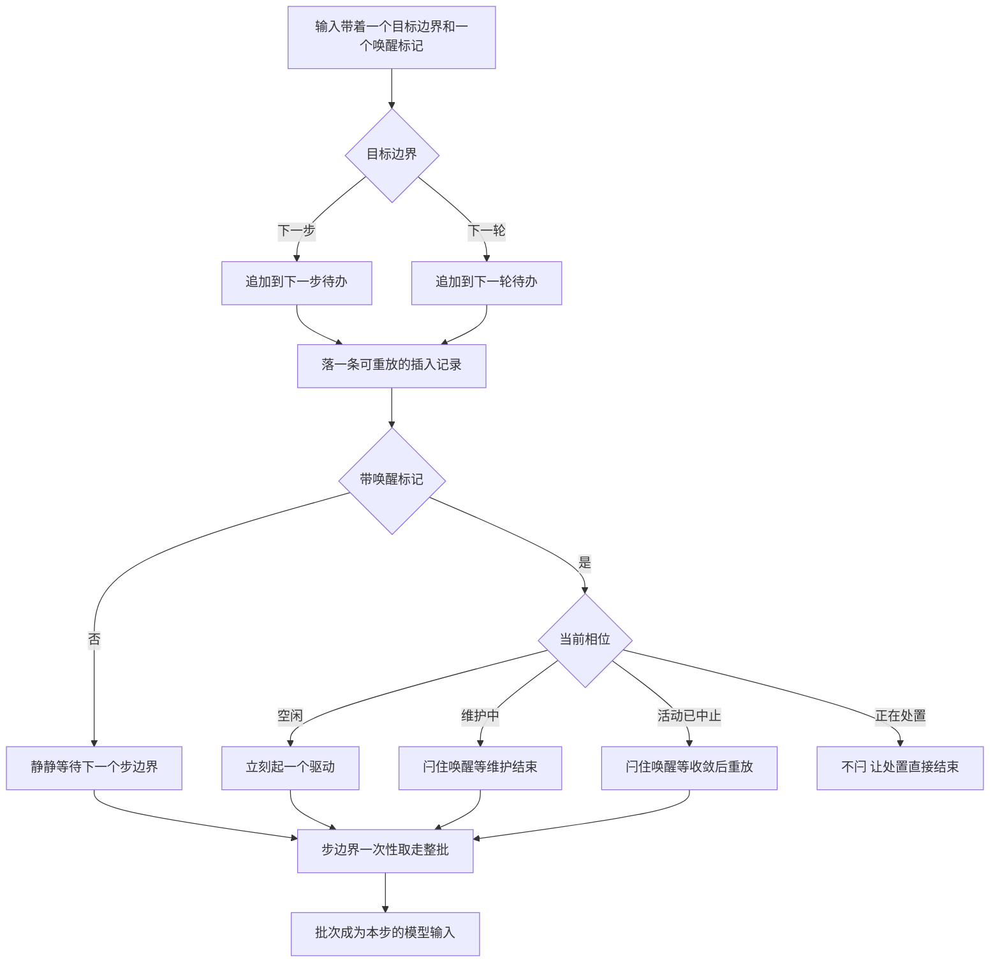

# 02 · 输入与步边界:inbox 的 claim、splice 与唤醒闩锁

> 核心源码:[`packages/core/agent-loop/src/inbox.ts`](https://github.com/deepseek-ai/deepseek-harness/blob/dbbaa4a37fb9098aba814c97d2956f7b2f105f46/packages/core/agent-loop/src/inbox.ts)(247 行)、[`packages/core/agent-loop/src/agent.ts:128-208`](https://github.com/deepseek-ai/deepseek-harness/blob/dbbaa4a37fb9098aba814c97d2956f7b2f105f46/packages/core/agent-loop/src/agent.ts#L128-L208)、[`packages/core/agent/src/types.ts:29-95`](https://github.com/deepseek-ai/deepseek-harness/blob/dbbaa4a37fb9098aba814c97d2956f7b2f105f46/packages/core/agent/src/types.ts#L29-L95)。

---

输入不是在内存里排队,而是每改一次就往会话日志里记一条可重放的插入记录。这样"被取消丢掉的输入""还没轮到跑的输入""正被取走执行的输入"在回放时是三种可区分的事实,而不是三次说不清的数组改动。唤醒另外用一根闩锁管着,因为"有人想干活"和"此刻能不能干活"是两件事。这一篇讲待办列表的折叠规则、四类输入怎么落到两条列表上,以及唤醒在什么条件下会被压住、又由谁兑现。

## 一、inbox 不是内存队列,是日志的一个投影

"inbox"指的是 agent 的待办输入列表,它只有两条:`next-turn` 是"等下一轮再说的用户提问",`next-step` 是"等下一个步边界就该喂给模型的东西"(steering 与各种注入上下文)。两条列表都是**有序**的,顺序即模型看到的顺序。

关键在于它不是 `Array` 字段而是**投影**(projection):日志里只存在一条条 `agent/inbox/spliced` 事件,当前列表由这些事件折叠而来。所以进程崩掉再 resume,未消费的输入会原样回来;而且"输入被取消"这件事也能被回放者与审计者看见,而不只是内部一个内存操作。

折叠逻辑写在 `inboxProjectionDefinition`(`inbox.ts:27-65`),它同时承担两件事:**重建**与**校验**。校验部分是整个模块里最值得读的一段——重放一段被篡改或损坏的日志时,它会把坐标不合法、`removedCount` 越界、以及"同一个消息 id 同时挂在两条列表上"这三种情况直接判为损坏:

```typescript
// packages/core/agent-loop/src/inbox.ts:31-56
  apply(state: InboxState, event) {
    if (event.type !== 'agent/inbox/spliced') return state
    const splice = event.data
    try {
      const inbox = state[splice.target]
      const removedCount = splice.removedCount ?? 0
      if (!Number.isSafeInteger(splice.start) || splice.start < 0 || splice.start > inbox.length
        || !Number.isSafeInteger(removedCount) || removedCount < 0
        || splice.start + removedCount > inbox.length) {
        throw new Error('invalid inbox splice')
      }
      const next = inbox.toSpliced(splice.start, removedCount, ...splice.inserted)
      const ids = new Set<string>()
      for (const message of splice.target === 'next-turn'
        ? [...next, ...state['next-step']]
        : [...state['next-turn'], ...next]) {
        if (ids.has(message.id)) throw new Error(`message "${message.id}" is already pending`)
        ids.add(message.id)
      }
      return splice.target === 'next-turn'
        ? { 'next-turn': next, 'next-step': state['next-step'] }
        : { 'next-turn': state['next-turn'], 'next-step': next }
    } catch (error: unknown) {
      throw new Error(`invalid persisted inbox splice at session seq ${event.seq}`, { cause: error })
    }
  },
```

同一套规则在写入侧由 `mutate` 再执行一次(`inbox.ts:222-228`)。两边都做看起来重复,但方向不同:写入侧保证"我们从不产生坏日志",折叠侧保证"坏日志不会被当成好日志读下去"。

## 二、四类输入其实只是两个维度

所有输入都收敛到同一个入口 `send(message, target, wakeup)`(`agent.ts:128`),区别只有两点:**落在哪条列表**、**要不要现在就叫醒驱动**。三个便捷方法(`agent.ts:137-147`)是这两点的固定组合:

```typescript
// packages/core/agent-loop/src/agent.ts:137-147
  followup(input: UserMessage): void {
    this.send(input, 'next-turn', true)
  }

  steer(input: UserMessage): void {
    this.send(input, 'next-step', true)
  }

  inject(input: UserMessage): void {
    this.send(input, 'next-step', false)
  }
```

| 输入 | 目标列表 | 唤醒 | 语义 |
|---|---|---|---|
| `followup` | `next-turn` | 是 | 普通追问,自成一整轮 |
| `steer` | `next-step` | 是 | 就近干预:空闲时开一轮,运行中在下一个步边界被取走 |
| `inject` | `next-step` | 否 | 只喂上下文,不改变调度;空闲时它会一直等着,直到有人用 followup 或 steer 唤醒 |
| 直接 `send` | 任意 | 调用方决定 | 上述三种之外的通用形态;工具结果带回的随附上下文走的就是 `'next-step'` 这条 |

工具执行完后把随附上下文塞回待办的路径就是一个直接 `splice`,不经过 `send`(`agent.ts:490`),因为它**不需要唤醒**:此刻驱动必然正在运行,而且它会在同一个步的收尾处立刻重读待办。


<details><summary>Mermaid 源码</summary>



</details>

| 阶段 | 做了什么 | 关键调用(文件:行) |
|---|---|---|
| 投影注册 | 每个 agent 作用域注册一份标准 inbox 投影,读取走投影状态而不是自己扫日志 | `inbox.ts:80`、`inbox.ts:189` |
| 分类与落列表 | 把消息按目标列表 splice 进去,坐标由当前长度推出 | `agent.ts:128`、`agent.ts:133`、`inbox.ts:169`、`inbox.ts:201` |
| 中止后改判 | 唤醒输入在"活动已经中止"时改投 `next-turn`:它不可能搭上那趟已经中止的班车 | `agent.ts:131-132` |
| 规范化坐标 | 下标截断、负下标从尾部数、删除数夹在剩余长度内;NaN 当 0 | `inbox.ts:210-219` |
| 空操作短路 | 既没删也没插就不落日志 | `inbox.ts:220` |
| 身份唯一性 | 新列表与另一条列表合并后逐个检查 id,重复即抛 | `inbox.ts:222-228` |
| 落 splice 事件 | 只记录"删了几个、插了什么",`removedCount` 为 0 时该字段整个省略 | `inbox.ts:230-238` |
| 通知 | 删除侧发 `agent/inbox/discarded`,插入侧发 `agent/inbox/inserted` | `inbox.ts:239-244` |
| 取走整批 | 一次 `claim` 取走全部 next-step;若目标边界是轮,再顺带取走队首的一条 next-turn | `inbox.ts:111-113` |
| 取走的通知 | 每条被取走的消息各发一次 `agent/inbox/claimed`,带上将要拥有它的轮号 | `inbox.ts:114` |
| 清空 | 主动取消时先清 next-step 再清 next-turn,顺序固定 | `inbox.ts:100-103` |
| 唤醒闩锁 | 维护中或活动已中止时把唤醒记在相位上,不重复起驱动 | `agent.ts:192-195` |
| 收敛重放 | 维护任务的 `finally` 与驱动体的 `finally` 各自检查闩锁与待办,成立则重放唤醒 | `agent.ts:173`、`agent.ts:235` |
| 判空 | `hasPending` 同时看两条列表,它是"这轮结束后还要不要再开一轮"的唯一判据 | `inbox.ts:94`、`agent.ts:344` |

<details><summary>mutate 的完整实现</summary>

```typescript
// packages/core/agent-loop/src/inbox.ts:200-246
  /** Commit one normalized mutation and publish its live events. */
  private mutate(
    target: InboxTarget,
    start: number,
    deleteCount: number,
    inserted: UserMessage[],
    discardRemoved: boolean,
  ): UserMessage[] {
    const state = this.current()
    const inbox = state[target]
    const truncatedStart = Math.trunc(start)
    const offset = Number.isNaN(truncatedStart) ? 0 : truncatedStart
    const actualStart = offset < 0
      ? Math.max(inbox.length + offset, 0)
      : Math.min(offset, inbox.length)
    const truncatedDeleteCount = Math.trunc(deleteCount)
    const actualDeleteCount = Math.min(
      Math.max(Number.isNaN(truncatedDeleteCount) ? 0 : truncatedDeleteCount, 0),
      inbox.length - actualStart,
    )
    if (actualDeleteCount === 0 && inserted.length === 0) return []
    const candidate = inbox.toSpliced(actualStart, actualDeleteCount, ...inserted)
    const ids = new Set<string>()
    for (const message of target === 'next-turn'
      ? [...candidate, ...state['next-step']]
      : [...state['next-turn'], ...candidate]) {
      if (ids.has(message.id)) throw new Error(`message "${message.id}" is already pending`)
      ids.add(message.id)
    }
    const outcome = discardRemoved && actualDeleteCount > 0 ? 'canceled' as const : undefined
    const splice: SessionEventMap['agent/inbox/spliced'] = {
      target,
      start: actualStart,
      ...(actualDeleteCount === 0 ? {} : { removedCount: actualDeleteCount }),
      inserted,
      ...(outcome === undefined ? {} : { outcome }),
    }
    const removed = inbox.slice(actualStart, actualStart + actualDeleteCount)
    const event = this.session.append('agent/inbox/spliced', splice)
    if (discardRemoved) {
      for (const message of removed) this.dispatch.emit('agent/inbox/discarded', { message })
    }
    for (const message of event.data.inserted) {
      this.dispatch.emit('agent/inbox/inserted', { message })
    }
    return removed
  }
```

</details>

## 三、claim 与 splice 的区别:一次删除是不是"取消"

`claim` 和 `splice` 最终都调 `mutate`,差别是第五个参数 `discardRemoved`:

- `claim` 传 `false`(`inbox.ts:112-113`)——取走是**正常消费**,不写 `outcome`,也不发 `discarded`;取而代之的是发 `agent/inbox/claimed`(`inbox.ts:114`)。
- 公开的 `splice` 传 `true`(`inbox.ts:175`)——删除是**丢弃**,只要真的删掉了东西就写 `outcome: 'canceled'`(`inbox.ts:229`),并逐条发 `discarded`。

这个区分在模块外有实际用处。[`packages/core/agent/src/consumed-work.ts:82-91`](https://github.com/deepseek-ai/deepseek-harness/blob/dbbaa4a37fb9098aba814c97d2956f7b2f105f46/packages/core/agent/src/consumed-work.ts#L82-L91) 折叠日志来判断"这次取消到底丢掉了没人跑的活没有":它只把 `outcome === 'canceled'` 且插入为空的那次删除算作"丢了活儿",而把不带 `outcome` 的删除读成"循环在步边界正常取走了输入"。如果 `claim` 也写 `canceled`,每次正常取消息都会被误判成一次丢弃。

`replace` 与 `remove` 是公开 splice 的两层薄包装,它们先在两列表中定位消息 id 再按坐标改(`inbox.ts:142-159`、`inbox.ts:179-186`);`locate` 找不到就返回假,不做任何写入。

## 四、唤醒闩锁:什么时候叫不动驱动

`wakeDriver` 表面上是"起一个驱动",实际有一半代码在处理"现在不能起,先记着"(`agent.ts:187-197`):

```typescript
// packages/core/agent-loop/src/agent.ts:188-197
    if (this.phase.kind !== 'idle') {
      // Maintenance and aborted drivers cannot deliver the wake: latch it for
      // replay at convergence. Live drivers claim queued work themselves;
      // disposal never latches, so teardown waits on no model turn.
      const reason = this.phase.abort.signal.reason as AgentCancelCause | undefined
      if (reason?.kind !== 'disposed' && (this.phase.kind === 'maintenance' || wakeAfterAbort)) {
        this.phase.wakeRequested = true
      }
      return
    }
```

三个非空闲相位只有两种会闩:

| 相位 | 会不会闩 | 为什么 |
|---|---|---|
| `maintenance`(维护任务独占中) | 会 | 维护任务从真正的空闲相位抢下了 agent,期间到的输入只能等它结束 |
| `running` 且信号未中止 | **不会** | 活着的驱动每一步都会重读待办,它自己会把新输入取走,再闩一次只会多起一个驱动 |
| `running` 且信号已中止 | 会(但仅当这条输入是唤醒输入) | 已经中止的驱动没有机会再取消息了,只能等它收敛到空闲后重放 |
| 任意相位的 `disposed` 原因 | **不会** | 处置过程中的唤醒直接丢弃:注册表马上要把这个 agent 摘掉,再起一轮模型调用会让停机没完没了 |

判断"信号已中止"的时机很讲究。`send` 在插入**之前**就把结论算好并传给 `wakeDriver`(`agent.ts:130-134`):

```typescript
// packages/core/agent-loop/src/agent.ts:129-134
    // Waking input cannot join an aborted activity, so it starts the next turn.
    // Captured before the insertion so a reentrant cancel from a splice observer cannot reclassify it.
    const wakingAfterAbort = wakeup && this.phase.kind !== 'idle' && this.phase.abort.signal.aborted
    const resolvedTarget = wakingAfterAbort ? 'next-turn' : target
    this.inbox.splice(resolvedTarget, Infinity, 0, [message])
    if (wakeup) this.wakeDriver(wakingAfterAbort)
```

`splice` 会同步派发 `agent/inbox/inserted` 通知,而监听器里完全可能有人当场调 `cancel()`。如果判定放在插入之后,这条输入就会在"插入时还活着、判定时已死"的缝里被误判成能搭上中止中的班车。先在插入前拍下结论,插入后的任何重入都改不了它。

闩锁最终由两个 `finally` 兑现:`runMaintenance` 结束时(`agent.ts:173`)与 `kick` 退出时(`agent.ts:235`)。两处都带同一个额外的判空条件——`inbox.hasPending`——因为闩锁只说明"有人想唤醒",不说明"还有东西可做";输入在闩住之后被别人 `remove` 掉是完全可能的,那种情况下重放唤醒只会白开一轮。

反过来,`wakeDriver` 在**空闲**相位上是无条件的(`agent.ts:198-207`):注释给出的规则是"空闲时发出的唤醒永远开启它的轮边界,即使它的消息在驱动取走之前已被清掉;只有被闩住之后的重放才会因为队列已空而被抑制"。这条不对称是刻意的——用户按下发送键这个动作本身就应该产生一次可观察的往返,哪怕内容随即被撤回了。

## 五、`hasPending` 与收敛

`hasPending` 的定义很窄(`inbox.ts:94-97`):两条列表里任意一条非空。它的全部使用者只有三处,且语义完全一致——"还有没有活要干":

- `turn()` 结尾(`agent.ts:344`):这一轮收完了,待办空了就返回假,驱动体随之结束;
- `kick` 的 `finally`(`agent.ts:235`):闩住的唤醒要不要兑现;
- `runMaintenance` 的 `finally`(`agent.ts:173`):维护结束要不要立刻接着跑。

这也是"收敛"(convergence)在这里的具体含义:**待办为空 + 没有正在运行的驱动 + 没有独占的维护任务**。`whenIdle()` 等的是第三种状态消失之后的那一瞬(`agent.ts:210-215`),而处置流程([`index.ts:592-594`](https://github.com/deepseek-ai/deepseek-harness/blob/dbbaa4a37fb9098aba814c97d2956f7b2f105f46/packages/core/agent/src/index.ts#L592-L594))等的正是它。反过来,只要待办里还压着东西而驱动已经退出(比如轮被拒绝、被取消),`hasPending` 就是真,下一轮一定会在某个唤醒到来时开起来——输入不会被静默吞掉,它要么被消费,要么留在日志里等下一个唤醒。

<details><summary>claim 与 clear 原始代码</summary>

```typescript
// packages/core/agent-loop/src/inbox.ts:105-116
  /**
   * Remove and return the complete batch proposed for one step.
   * @param target - whether this boundary also consumes one queued turn.
   * @param turn - turn that will own the claimed batch.
   * @returns next-step input followed by the queued turn, when requested.
   */
  claim(target: InboxTarget, turn: number): UserMessage[] {
    const claimed = this.mutate('next-step', 0, this.nextStep.length, [], false)
    if (target === 'next-turn') claimed.push(...this.mutate('next-turn', 0, 1, [], false))
    for (const message of claimed) this.dispatch.emit('agent/inbox/claimed', { message, turn })
    return claimed
  }
```

```typescript
// packages/core/agent-loop/src/inbox.ts:99-103
  /** Durably cancel all pending input, clearing next-step before next-turn. */
  clear(): void {
    this.splice('next-step', 0, this.nextStep.length, [])
    this.splice('next-turn', 0, this.nextTurn.length, [])
  }
```

</details>

## 关键文件/符号索引

| 文件 | 行数 | 符号与行号 |
|---|---|---|
| [`packages/core/agent-loop/src/inbox.ts`](https://github.com/deepseek-ai/deepseek-harness/blob/dbbaa4a37fb9098aba814c97d2956f7b2f105f46/packages/core/agent-loop/src/inbox.ts) | 247 | `inboxProjectionSchema`([`:21`](https://github.com/deepseek-ai/deepseek-harness/blob/dbbaa4a37fb9098aba814c97d2956f7b2f105f46/packages/core/agent-loop/src/inbox.ts#L21))、`inboxProjectionDefinition`([`:27`](https://github.com/deepseek-ai/deepseek-harness/blob/dbbaa4a37fb9098aba814c97d2956f7b2f105f46/packages/core/agent-loop/src/inbox.ts#L27))、`apply`([`:31`](https://github.com/deepseek-ai/deepseek-harness/blob/dbbaa4a37fb9098aba814c97d2956f7b2f105f46/packages/core/agent-loop/src/inbox.ts#L31))、`ReactLoopInbox`([`:74`](https://github.com/deepseek-ai/deepseek-harness/blob/dbbaa4a37fb9098aba814c97d2956f7b2f105f46/packages/core/agent-loop/src/inbox.ts#L74))、`nextTurn`([`:84`](https://github.com/deepseek-ai/deepseek-harness/blob/dbbaa4a37fb9098aba814c97d2956f7b2f105f46/packages/core/agent-loop/src/inbox.ts#L84))、`nextStep`([`:89`](https://github.com/deepseek-ai/deepseek-harness/blob/dbbaa4a37fb9098aba814c97d2956f7b2f105f46/packages/core/agent-loop/src/inbox.ts#L89))、`hasPending`([`:94`](https://github.com/deepseek-ai/deepseek-harness/blob/dbbaa4a37fb9098aba814c97d2956f7b2f105f46/packages/core/agent-loop/src/inbox.ts#L94))、`clear`([`:100`](https://github.com/deepseek-ai/deepseek-harness/blob/dbbaa4a37fb9098aba814c97d2956f7b2f105f46/packages/core/agent-loop/src/inbox.ts#L100))、`claim`([`:111`](https://github.com/deepseek-ai/deepseek-harness/blob/dbbaa4a37fb9098aba814c97d2956f7b2f105f46/packages/core/agent-loop/src/inbox.ts#L111))、`append`([`:123`](https://github.com/deepseek-ai/deepseek-harness/blob/dbbaa4a37fb9098aba814c97d2956f7b2f105f46/packages/core/agent-loop/src/inbox.ts#L123))、`prepend`([`:132`](https://github.com/deepseek-ai/deepseek-harness/blob/dbbaa4a37fb9098aba814c97d2956f7b2f105f46/packages/core/agent-loop/src/inbox.ts#L132))、`replace`([`:142`](https://github.com/deepseek-ai/deepseek-harness/blob/dbbaa4a37fb9098aba814c97d2956f7b2f105f46/packages/core/agent-loop/src/inbox.ts#L142))、`remove`([`:154`](https://github.com/deepseek-ai/deepseek-harness/blob/dbbaa4a37fb9098aba814c97d2956f7b2f105f46/packages/core/agent-loop/src/inbox.ts#L154))、`splice`([`:169`](https://github.com/deepseek-ai/deepseek-harness/blob/dbbaa4a37fb9098aba814c97d2956f7b2f105f46/packages/core/agent-loop/src/inbox.ts#L169))、`locate`([`:179`](https://github.com/deepseek-ai/deepseek-harness/blob/dbbaa4a37fb9098aba814c97d2956f7b2f105f46/packages/core/agent-loop/src/inbox.ts#L179))、`current`([`:189`](https://github.com/deepseek-ai/deepseek-harness/blob/dbbaa4a37fb9098aba814c97d2956f7b2f105f46/packages/core/agent-loop/src/inbox.ts#L189))、`mutate`([`:201`](https://github.com/deepseek-ai/deepseek-harness/blob/dbbaa4a37fb9098aba814c97d2956f7b2f105f46/packages/core/agent-loop/src/inbox.ts#L201)) |
| [`packages/core/agent-loop/src/agent.ts`](https://github.com/deepseek-ai/deepseek-harness/blob/dbbaa4a37fb9098aba814c97d2956f7b2f105f46/packages/core/agent-loop/src/agent.ts) | 619 | `send`([`:128`](https://github.com/deepseek-ai/deepseek-harness/blob/dbbaa4a37fb9098aba814c97d2956f7b2f105f46/packages/core/agent-loop/src/agent.ts#L128))、`followup`([`:137`](https://github.com/deepseek-ai/deepseek-harness/blob/dbbaa4a37fb9098aba814c97d2956f7b2f105f46/packages/core/agent-loop/src/agent.ts#L137))、`steer`([`:141`](https://github.com/deepseek-ai/deepseek-harness/blob/dbbaa4a37fb9098aba814c97d2956f7b2f105f46/packages/core/agent-loop/src/agent.ts#L141))、`inject`([`:145`](https://github.com/deepseek-ai/deepseek-harness/blob/dbbaa4a37fb9098aba814c97d2956f7b2f105f46/packages/core/agent-loop/src/agent.ts#L145))、`cancel`([`:149`](https://github.com/deepseek-ai/deepseek-harness/blob/dbbaa4a37fb9098aba814c97d2956f7b2f105f46/packages/core/agent-loop/src/agent.ts#L149))、`runMaintenance`([`:157`](https://github.com/deepseek-ai/deepseek-harness/blob/dbbaa4a37fb9098aba814c97d2956f7b2f105f46/packages/core/agent-loop/src/agent.ts#L157))、`wakeDriver`([`:187`](https://github.com/deepseek-ai/deepseek-harness/blob/dbbaa4a37fb9098aba814c97d2956f7b2f105f46/packages/core/agent-loop/src/agent.ts#L187))、`whenIdle`([`:210`](https://github.com/deepseek-ai/deepseek-harness/blob/dbbaa4a37fb9098aba814c97d2956f7b2f105f46/packages/core/agent-loop/src/agent.ts#L210))、`preStep`([`:244`](https://github.com/deepseek-ai/deepseek-harness/blob/dbbaa4a37fb9098aba814c97d2956f7b2f105f46/packages/core/agent-loop/src/agent.ts#L244))、`turn`([`:315`](https://github.com/deepseek-ai/deepseek-harness/blob/dbbaa4a37fb9098aba814c97d2956f7b2f105f46/packages/core/agent-loop/src/agent.ts#L315))、`step`([`:490`](https://github.com/deepseek-ai/deepseek-harness/blob/dbbaa4a37fb9098aba814c97d2956f7b2f105f46/packages/core/agent-loop/src/agent.ts#L490)) |
| [`packages/core/agent/src/types.ts`](https://github.com/deepseek-ai/deepseek-harness/blob/dbbaa4a37fb9098aba814c97d2956f7b2f105f46/packages/core/agent/src/types.ts) | 95 | `InboxTarget`([`:30`](https://github.com/deepseek-ai/deepseek-harness/blob/dbbaa4a37fb9098aba814c97d2956f7b2f105f46/packages/core/agent/src/types.ts#L30))、`InboxState`([`:33`](https://github.com/deepseek-ai/deepseek-harness/blob/dbbaa4a37fb9098aba814c97d2956f7b2f105f46/packages/core/agent/src/types.ts#L33))、`InboxWireState`([`:44`](https://github.com/deepseek-ai/deepseek-harness/blob/dbbaa4a37fb9098aba814c97d2956f7b2f105f46/packages/core/agent/src/types.ts#L44))、`agent/inbox/spliced`([`:87`](https://github.com/deepseek-ai/deepseek-harness/blob/dbbaa4a37fb9098aba814c97d2956f7b2f105f46/packages/core/agent/src/types.ts#L87)) |
| [`packages/core/agent/src/runtime-types.ts`](https://github.com/deepseek-ai/deepseek-harness/blob/dbbaa4a37fb9098aba814c97d2956f7b2f105f46/packages/core/agent/src/runtime-types.ts) | 405 | `Inbox`([`:48`](https://github.com/deepseek-ai/deepseek-harness/blob/dbbaa4a37fb9098aba814c97d2956f7b2f105f46/packages/core/agent/src/runtime-types.ts#L48))、`send`([`:215`](https://github.com/deepseek-ai/deepseek-harness/blob/dbbaa4a37fb9098aba814c97d2956f7b2f105f46/packages/core/agent/src/runtime-types.ts#L215))、`followup`([`:222`](https://github.com/deepseek-ai/deepseek-harness/blob/dbbaa4a37fb9098aba814c97d2956f7b2f105f46/packages/core/agent/src/runtime-types.ts#L222))、`steer`([`:231`](https://github.com/deepseek-ai/deepseek-harness/blob/dbbaa4a37fb9098aba814c97d2956f7b2f105f46/packages/core/agent/src/runtime-types.ts#L231))、`inject`([`:241`](https://github.com/deepseek-ai/deepseek-harness/blob/dbbaa4a37fb9098aba814c97d2956f7b2f105f46/packages/core/agent/src/runtime-types.ts#L241))、`agent/inbox/inserted`([`:285`](https://github.com/deepseek-ai/deepseek-harness/blob/dbbaa4a37fb9098aba814c97d2956f7b2f105f46/packages/core/agent/src/runtime-types.ts#L285))、`agent/inbox/claimed`([`:296`](https://github.com/deepseek-ai/deepseek-harness/blob/dbbaa4a37fb9098aba814c97d2956f7b2f105f46/packages/core/agent/src/runtime-types.ts#L296))、`agent/inbox/discarded`([`:304`](https://github.com/deepseek-ai/deepseek-harness/blob/dbbaa4a37fb9098aba814c97d2956f7b2f105f46/packages/core/agent/src/runtime-types.ts#L304)) |
| [`packages/core/agent/src/consumed-work.ts`](https://github.com/deepseek-ai/deepseek-harness/blob/dbbaa4a37fb9098aba814c97d2956f7b2f105f46/packages/core/agent/src/consumed-work.ts) | 108 | `ConsumedWork`([`:18`](https://github.com/deepseek-ai/deepseek-harness/blob/dbbaa4a37fb9098aba814c97d2956f7b2f105f46/packages/core/agent/src/consumed-work.ts#L18))、`accountsForClaim`([`:42`](https://github.com/deepseek-ai/deepseek-harness/blob/dbbaa4a37fb9098aba814c97d2956f7b2f105f46/packages/core/agent/src/consumed-work.ts#L42))、`foldConsumedWork`([`:68`](https://github.com/deepseek-ai/deepseek-harness/blob/dbbaa4a37fb9098aba814c97d2956f7b2f105f46/packages/core/agent/src/consumed-work.ts#L68)) |
