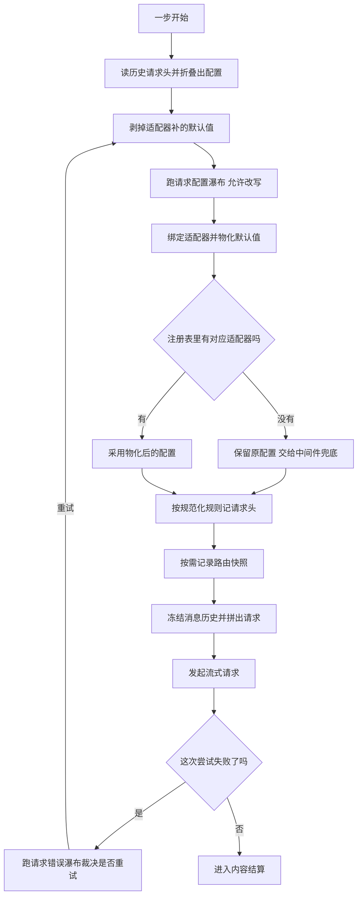

# 03 · 一次模型请求:prepareRequest → buildRequest → llm.stream

> 核心源码:`packages/core/agent-loop/src/agent.ts:500-618`(`prepareRequest` 与 `buildRequest` 两个方法),重试裁决在 `:441-464`。
> 请求头记账工具在 `packages/core/session/src/request-header.ts`(69 行)。

---

一次模型请求由三段拼成:先决定配置、再记账、最后冻结并发出。顺序不能调换——日志必须先看到确定下来的配置,请求体才有资格从日志推导出来;否则"模型到底看到了什么"就不再是可重建的事实。这一篇跟着这三段走一遍,并交代失败之后由谁裁决重试。

## 一、为什么发一次请求要拆成两个阶段

一次模型调用在这份代码里被切成"**决定发什么**"和"**记下发了什么**"两段,分别对应 `prepareRequest` 与 `buildRequest`。这个切分不是为了好看,而是为了一条硬约束:模型看到的东西必须能从会话日志原样重建。

于是顺序被迫变成这样:先把配置定下来(可能被插件改写)、拿去和适配器绑定并物化出真实生效的默认值,然后**才**把这份确定了的配置写成 `request/header` 日志,再用日志推导出的消息历史构造请求体。谁先谁后反了就会出现"日志里记的是 A、实际发出去的是 B"的窗口。第三段 `llm.stream` 只是把已经冻结的请求交给服务。

`prepareRequest` 的输入只有轮号、步号与取消信号,它刻意不接收任何消息——请求体的内容完全由 `buildRequest` 从 `session.deriveMessages()` 里取,调用方没有任何绕开日志塞私有内容的入口。

## 二、配置是怎么从"历史"和"声明"里长出来的

配置有两个来源,优先级写死在代码里:agent 自己声明的路由(构造时的 `AgentOptions`)与历史里最后一次记录下来的配置。规则按字段分别成立:

- **provider / model**:永远以 `AgentOptions` 为准(`agent.ts:512`)。一轮里换模型是插件通过 `agent/request` 瀑布做的,不是靠改 options。
- **reasoningEffort**:声明里有就用声明的;否则只在"历史配置的 provider 与 model 跟当前声明的路由完全一致,并且这个值是适配器物化的而不是调用方给的"时才沿用(`agent.ts:513-518`)。最后那个条件是关键——如果历史里的 effort 是适配器替我们补出来的,沿用它会把这层信息永久固化;正确的做法是让当前适配器重新决定一次。
- **maxTokens**:只来自声明(`agent.ts:519`),不从历史恢复。

接下来是"剥默认值"。`requestProposal`(`agent.ts:63-69`) 把 `adapterDefaults` 标记为真的字段删掉,于是插件在瀑布里看到的是一份**没有适配器痕迹**的提议:

```typescript
// packages/core/agent-loop/src/agent.ts:62-69
/** Remove adapter-derived values before plugins propose the next request config. */
function requestProposal(header: EpochHeader): LlmCallConfig {
  if (header.adapterDefaults === undefined) return header.config
  const proposal = { ...header.config }
  if (header.adapterDefaults.reasoningEffort === true) delete proposal.reasoningEffort
  if (header.adapterDefaults.maxTokens === true) delete proposal.maxTokens
  return proposal
}
```

第一份提议来自 `AgentOptions`;之后的每一份都来自历史(经上面这层剥离)。提议还要过一遍 `deepFreeze(structuredClone(...))`(`agent.ts:520-529`),这样瀑布的监听器拿到的是自己的副本,想改就必须返回一个新对象,不能就地改。这是"每一次配置变更都必须留下一条可比较的日志"能被验证的前提。


<details><summary>Mermaid 源码</summary>



</details>

| 阶段 | 做了什么 | 关键调用(文件:行) |
|---|---|---|
| 读历史头 | 取当前日志里生效的请求头快照(增量折叠,每次只算新事件) | `agent.ts:510`、`session/src/index.ts:776` |
| 决定路由 | provider 与 model 直接取声明值 | `agent.ts:512` |
| 恢复推理力度 | 只在历史配置属于同一路由且不是适配器补的时候沿用 | `agent.ts:513-517` |
| 组装提议 | 已记过头就用历史剥离版,否则用声明值;整体克隆并深冻结 | `agent.ts:520`、`agent.ts:63` |
| 配置瀑布 | `agent/request` 允许监听器整体替换配置;不调用 `next()` 即短路 | `agent.ts:530`、`runtime-types.ts:347` |
| 路由完整性校验 | 没有 provider 或 model 直接抛错,错误信息指明两条补救途径 | `agent.ts:535-537` |
| 绑定适配器 | 由 LLM 服务解析注册信息、物化默认值、冻结最终配置,并返回一个只能派发一次的调用句柄 | `agent.ts:541`、`llm/src/index.ts:916` |
| 无适配器回退 | 只吞 `NO_ADAPTER` 这一种错误,其余原样抛;回退后用的是未物化的配置,把兜底权留给中间件 | `agent.ts:543-547`、`llm/src/index.ts:966` |
| 取消检查 | 瀑布返回后与适配器绑定后各检查一次信号 | `agent.ts:534`、`agent.ts:548` |
| 规范化请求头 | 空工具列表折叠成"没有这个字段",避免同一份内容出现两种表示 | `agent.ts:562`、`request-header.ts:21` |
| 三种记账理由 | 首记(区分 initial 与 resume)、有变化(可附系列起点)、仅系列起点 | `agent.ts:570-581` |
| 路由快照 | 只有 provider、model、上下文窗口、系统提示更新模式之一变化时才写 | `agent.ts:586-598` |
| 冻结与取材 | 深冻结请求头,把新出现的派生消息逐个深冻结,冻结消息数组本身 | `agent.ts:602-609` |
| 拼请求 | 配置字段 + 消息 + 工具 + 会话 id + 取消信号,整体冻结并打上循环来源标记 | `agent.ts:610`、`call-config.ts:66` |
| 发起 | 优先用准备好的调用句柄派发,没有则退回服务级流式入口 | `agent.ts:390` |
| 失败裁决 | 跑 `agent/request-error` 瀑布,只有明确要求重试才重来一次 | `agent.ts:448-463` |

<details><summary>prepareRequest 与 buildRequest 原始代码</summary>

```typescript
// packages/core/agent-loop/src/agent.ts:500-550
  /** Resolve request config and bind its adapter before admitting model-visible input. */
  private async prepareRequest(
    turn: number,
    step: number,
    signal: AbortSignal,
  ): Promise<{ config: LlmCallConfig; preparedCall?: PreparedLlmCall }> {
    const { session } = this

    // A loop instance starts from its declared route, restoring only an explicit
    // effort owned by that exact model. Later steps re-resolve marked defaults.
    const persistedHeader = session.requestHeader()
    const persistedConfig = persistedHeader?.config
    const route = { provider: this.options.provider ?? '', model: this.options.model ?? '' }
    const persistedReasoningEffort = persistedConfig?.provider === route.provider
      && persistedConfig.model === route.model
      && persistedHeader?.adapterDefaults?.reasoningEffort !== true
      ? persistedConfig.reasoningEffort
      : undefined
    const reasoningEffort = this.options.reasoningEffort ?? persistedReasoningEffort
    const maxTokens = this.options.maxTokens
    const seedConfig = deepFreeze(structuredClone(
      this.requestHeaderLogged
        // oxlint-disable-next-line typescript/no-non-null-assertion -- the instance logged the header it now folds
        ? requestProposal(persistedHeader!)
        : {
          ...route,
          ...reasoningEffort === undefined ? {} : { reasoningEffort },
          ...maxTokens === undefined ? {} : { maxTokens },
        },
    ))
    const proposedConfig = await this.dispatch.waterfall(
      'agent/request', { turn, step, signal },
      () => Promise.resolve(seedConfig),
    )
    signal.throwIfAborted()
    if (!proposedConfig.provider || !proposedConfig.model) {
      throw new Error(`agent "${this.id}" has no provider/model: set AgentOptions.provider and AgentOptions.model or supply both via the agent/request waterfall`)
    }
    let config: LlmCallConfig
    let preparedCall: PreparedLlmCall | undefined
    try {
      preparedCall = await this.loopCtx.llm.prepareCall(proposedConfig, signal)
      config = preparedCall.config
    } catch (error: unknown) {
      // Middleware may serve an unregistered route; terminal dispatch still requires an adapter.
      if (!(error instanceof LlmError) || error.code !== 'NO_ADAPTER') throw error
      config = proposedConfig
    }
    signal.throwIfAborted()
    return { config, ...preparedCall === undefined ? {} : { preparedCall } }
  }
```

```typescript
// packages/core/agent-loop/src/agent.ts:552-618
  /** Log the resolved envelope and derive a frozen request from the admitted surface. */
  private buildRequest(
    config: LlmCallConfig,
    preparedCall: PreparedLlmCall | undefined,
    tools: GenerateOptions['tools'] & object,
    startsRequestSeries: boolean,
    signal: AbortSignal,
  ): GenerateOptions {
    const { session } = this
    const surfaceGeneration = session.surface.replaceGeneration
    const header = canonicalHeader({
      config,
      ...preparedCall === undefined ? {} : { adapterDefaults: preparedCall.adapterDefaults },
      ...tools.length > 0 ? { tools } : {},
    })
    const baseline = this.session.requestHeader()
    const startsSeries = startsRequestSeries
      || this.requestSurfaceGeneration !== surfaceGeneration
    if (!this.requestHeaderLogged) {
      this.session.append('request/header', { header, reason: baseline === undefined ? 'initial' : 'resume' })
      this.requestHeaderLogged = true
    } else if (baseline === undefined || !headerEquals(baseline, header)) {
      this.session.append('request/header', {
        header,
        reason: 'change',
        ...startsSeries ? { startsSeries: true } : {},
      })
    } else if (startsSeries) {
      this.session.append('request/header', { header, reason: 'series' })
    }
    this.requestSurfaceGeneration = surfaceGeneration

    const contextWindow = preparedCall?.context?.contextWindow
    const systemPromptUpdate = preparedCall?.systemPromptUpdate
    const requestContext: RequestContext = {
      provider: config.provider,
      model: config.model,
      ...contextWindow === undefined ? {} : { contextWindow },
      ...systemPromptUpdate === undefined ? {} : { systemPromptUpdate },
    }
    const previousContext = session.requestContext()
    if (previousContext?.provider !== requestContext.provider
      || previousContext.model !== requestContext.model
      || previousContext.contextWindow !== requestContext.contextWindow
      || previousContext.systemPromptUpdate !== requestContext.systemPromptUpdate) {
      session.append('request/context', requestContext)
    }
    signal.throwIfAborted()

    // canonicalHeader is shallow; append logs a detached snapshot, not these local values.
    deepFreeze(header)
    const boundaryMessages = session.deriveMessages()
    for (const message of boundaryMessages) {
      if (this.frozenMessages.has(message)) continue
      deepFreeze(message)
      this.frozenMessages.add(message)
    }
    Object.freeze(boundaryMessages)
    const request = markAgentLoopRequest(Object.freeze({
      ...header.config,
      messages: boundaryMessages,
      ...header.tools !== undefined ? { tools: header.tools } : {},
      sessionId: this.session.id,
      signal,
    }))
    return request
  }
```

</details>

## 三、`request/header` 的四种理由

请求头是"这个会话后来所有请求的配置基线",它只在**该记的时候**记一条,而不是每步一条。判据是三层嵌套(`agent.ts:570-581`):

| 条件 | 写的理由 | 含义 |
|---|---|---|
| 本实例还没记过 | `initial`(日志里没有任何头)或 `resume`(日志里已有头,说明这是恢复后的第一次请求) | 声明路由的第一次落地 |
| 已有头且内容不同 | `change`,并在需要时附 `startsSeries: true` | 配置或工具集真的变了 |
| 已有头、内容相同,但本步要开一个新系列 | `series` | 内容没变,但模型侧的消息系列要断开重点 |

"系列"(series)是这套机制里最容易被忽略的一维。它由三件事之一触发(`agent.ts:363-369`):`agent/pre-step` 决策显式声明、surface 的替换代数变了(压缩或整段替换)、或者本轮组装的工具 schema 与已记录的请求头不同。三者都意味着"模型之前看到的前缀已经不连续了",所以即便请求头字段一字未改,也要留下一条 `series` 记录——回放者靠它才知道缓存不该跨这条界线复用。

`toolsChanged` 用一个讨巧的写法判定工具变化(`agent.ts:262-266`):拿当前工具去覆盖基线头再规范化,如果规范化后与基线不等,说明工具集变了。这样不用单独维护一份工具快照。

`request/context` 是另一条独立的记录线(`agent.ts:586-598`),它承载 provider、model、上下文窗口与系统提示更新模式,只有这四个字段之一与上次不同才写。它不参与请求头比较、也不参与请求重建,纯粹是给下游(比如 token 计量与压缩策略)读的。

## 四、深冻结:为什么要在发出去之前做

冻结发生在三个层次(`agent.ts:602-609`):请求头对象、派生出来的消息对象、以及承载消息的数组。消息的冻结用了一个弱集合去重(`agent.ts:94`、`:605`)——同一份导出历史在后续步里会被反复取到,而其中的消息对象是**共享的**(`session.deriveMessages()` 返回新数组但复用已冻结的消息对象),所以只需要在第一次看到时冻结并把身份记下来。用 `WeakSet` 而不是 `Set` 是有意的:被压缩替换掉的历史消息不会因为这份记账而无法回收。

冻结之后才构造请求(`agent.ts:610-616`),并且用 `markAgentLoopRequest` 打上一个进程内的弱标记(`call-config.ts:66`)。这个标记的唯一消费者是 agent-loop 自己的不变量伴随插件——它订阅 `llm/stream`,只对带标记的请求做重建一致性检查(见 [06-invariants-and-guards.md](./06-invariants-and-guards.md))。

注意这里冻结的**不包括** `signal`。取消信号必须保持活的,整条链路靠它传递中止。

## 五、失败之后:谁来决定重试

模型请求的失败有两条完全不同的路。**同步抛出**的失败(适配器注册缺失、参数非法)直接冒出 `step()`,经轮的错误路径记成 `error` 理由。**流已经建立但以失败告终**的失败走另一条:它先有一个终态(`finish.kind` 是 `error` 或 `aborted`),循环先把这次尝试落成一条 `assistant/attempt`——失败也得留下痕迹——然后才把裁决权交出去(`agent.ts:441-464`):

```typescript
// packages/core/agent-loop/src/agent.ts:441-464(节选)
        const finish = live.finish
        if (finish.kind === 'error' || finish.kind === 'aborted') {
          live.settle(
            'assistant/attempt',
            () => this.session.append('assistant/attempt', { turn, step, stream: live.stream }).seq,
          )
          const action = await this.dispatch.waterfall(
            'agent/request-error', {
              turn,
              step,
              provider: request.provider,
              failure: finish.failure,
              retryPolicy: preparedCall?.retryPolicy,
              signal,
            },
            () => Promise.resolve<RequestErrorAction>(undefined),
          )
          signal.throwIfAborted()
          if (action?.kind !== 'retry') {
            throw new LlmError(finish.failure.message, finish.failure.code, finish.failure)
          }
          continue
        }
```

裁决只有三个结果:返回 `{ kind: 'retry' }`(接手恢复,通常不调用 `next()`)、调用 `next()` 把决定权交给后面的监听器、或者什么都不做(默认值 `undefined`,失败即为终局)。默认值是 `undefined` 而不是"重试",所以**没装任何重试插件时不会静默重试**。

`retryPolicy` 是随请求一起准备好的(`prepareCall` 从适配器注册信息里取,`llm/src/index.ts:166`),不是错误发生时才去查——这样即便期间发生了 HMR 换适配器,裁决用的也是失败那次调用真正生效的策略。

生产环境里的实现是 `packages/llm/llm-retry/src/index.ts:194` 的 `recover`:它按错误码筛选、算退避延迟、先落 `llm/retry` 再落 `llm/retry-started`,最后才返回重试动作(`llm-retry/src/index.ts:188-191`)。裁决与记账在同一处完成,所以"重试了几次"这件事也是可回放的。

`continue` 回到 `step()` 里那个 `while (true)`(`agent.ts:361`),于是**重试会重新走一遍 `prepareRequest` 与 `buildRequest`**:配置会被重新解析一次,请求头也可能因为工具集或系列状态变化而多记一条。但它不会重跑提示组装、不会重跑 `agent/pre-step`、也不会重复写用户消息——那些被 `firstAttempt` 挡住了(`agent.ts:363`、`:373-378`)。

## 关键文件/符号索引

| 文件 | 行数 | 符号与行号 |
|---|---|---|
| `packages/core/agent-loop/src/agent.ts` | 619 | `requestProposal`(`:63`)、`frozenMessages`(`:94`)、`requestHeaderLogged`(`:85`)、`requestSurfaceGeneration`(`:87`)、`toolsChanged`(`:262`)、`step`(`:352`)、`prepareRequest`(`:501`)、`buildRequest`(`:553`) |
| `packages/core/session/src/request-header.ts` | 69 | `canonicalHeader`(`:21`)、`sameSchema`(`:33`)、`headerEquals`(`:43`)、`foldRequestHeader`(`:63`) |
| `packages/core/session/src/index.ts` | 1284 | `requestHeader`(`:776`)、`requestContext`(`:797`)、`deriveMessages`(`:832`) |
| `packages/core/session/src/types.ts` | 495 | `RequestHeaderReason`(`:261`)、`EpochHeader`(`:232`)、`request/header`(`:365`)、`request/context`(`:377`) |
| `packages/llm/llm/src/index.ts` | 1147 | `PreparedLlmCall`(`:163`)、`prepareCall`(`:916`)、`registration`(`:964`)、`NO_ADAPTER` 抛出点(`:966`) |
| `packages/llm/llm/src/call-config.ts` | 78 | `LlmCallConfig`(`:23`)、`callConfigEquals`(`:49`)、`markAgentLoopRequest`(`:66`)、`isAgentLoopRequest`(`:76`) |
| `packages/llm/llm/src/types.ts` | 459 | `GenerateOptions`(`:419`) |
| `packages/llm/llm-retry/src/index.ts` | 259 | `recover`(`:194`)、`backoff`(`:149`)、`agent/request-error` 监听(`:243`) |
| `packages/core/agent/src/runtime-types.ts` | 405 | `agent/request`(`:347`)、`agent/request-error`(`:363`)、`RequestErrorAction`(`:122`) |
