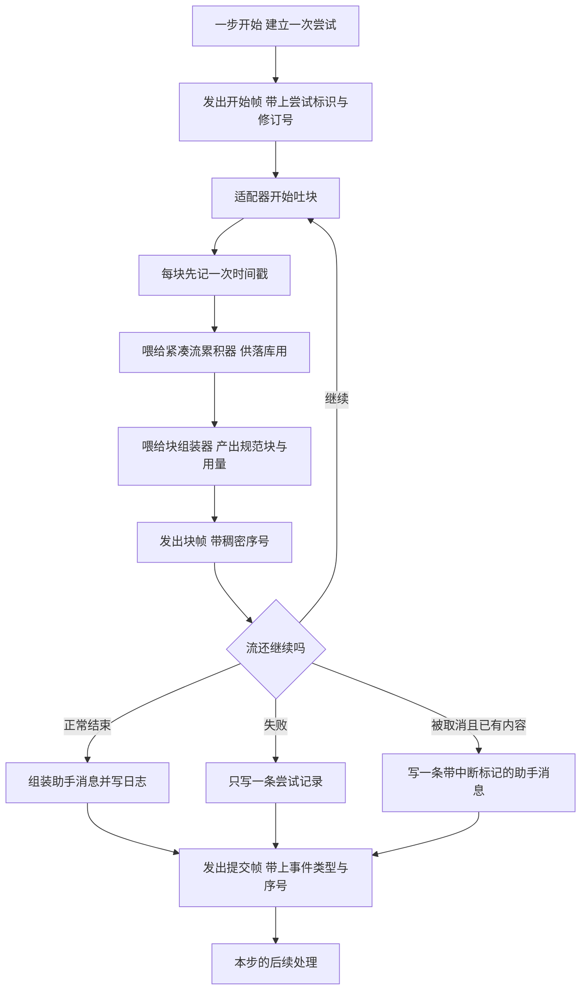

# 04 · 助手流与消息落库:一次尝试的三条出口

> 核心源码:`packages/core/agent-loop/src/assistant-stream.ts`(140 行)、`packages/core/agent-loop/src/agent.ts:379-497`。

---

模型流式吐回来的内容要同时满足三件事:原始字节要能落进日志、规范内容块要变成模型可见的助手消息、增量还要能立刻上屏。让三者各自攒一份会走出两条时间线,所以这里的做法是每一块到手就同时喂三个消费者,再把"这次尝试的结果"收敛成两种落库事件加一个只存在于进程内的帧。这一篇走一遍从开始帧到终止帧的全过程,包括失败与取消这两种非正常收尾。

## 一、一次"尝试"要同时喂三个消费者

"尝试"(attempt)指的是一次完整的模型流式调用:从开始帧到终止帧,中间可能失败、可能被取消、也可能正常结束但随后被重试。它需要同时满足三件互相拉扯的事:

1. **落库**:日志里要留下这次调用真实收到的字节流,而且不能因为后续步骤改动了消息就丢失原始信息;
2. **产消息**:模型可见的助手消息要从同一批块里组装出来,块边界、终止理由、token 用量都得跟流一致;
3. **上屏**:UI 需要在块到达的当下就看到增量,不能等整条流结束。

`AssistantStreamAttempt` 的解法不是"先攒着再分发",而是**每来一块就同一时刻喂三处**(`assistant-stream.ts:59-71`):

```typescript
// packages/core/agent-loop/src/assistant-stream.ts:59-71
  /** Snapshot one chunk once, then feed durable compaction, assembly, and live publication. */
  push(chunk: StreamChunk): void {
    const timed = this.accumulator.push({ time: Date.now(), chunk })
    this.assembler.push(timed.chunk)
    this.emit({
      type: 'chunk',
      attemptId: this.attemptId,
      revision: this.nextRevision(),
      index: this.index++,
      time: timed.time,
      chunk: timed.chunk,
    })
  }
```

这里有个不显眼但重要的顺序:`Date.now()` 只取一次,时间戳进入紧凑流后,**帧里带的 `time` 就是落库记录里的那个 `time`**(`assistant-stream.ts:61`、`:68`)。于是 UI 上看到的块与回放时读到的块带同一个时间,预览与历史不会出现两套时间线。

三条出口的数据形态各不相同,这是刻意的:

| 消费者 | 载体 | 是否进模型可见历史 | 特点 |
|---|---|---|---|
| 紧凑流累积器 | `accumulator.snapshot()` → `stream` | 进日志但不直接进历史;历史由 `assistant/message` 派生 | 合并相邻增量、按记录切分,保留原始时间 |
| 块组装器 | `assembler.blocks()` / `interruptedBlocks()` / `usage` / `finish` / `replayState` | 通过助手消息进入历史 | 产出规范内容块,是模型真正"说过"的东西 |
| 瞬时帧 | `agent/assistant-stream` 通知 | 不进日志 | 纯进程内通知,进程重启后无从恢复 |

瞬时帧这一列的"不进日志"是设计选择而不是遗漏:帧的作用是让 UI 在流式期间有东西可画,而真正的权威副本是那条随消息一起落库的 `stream` 字段(`packages/core/session/src/types.ts:326`)。UI 断线重连后从日志重读,拿到的是同一批数据。


<details><summary>Mermaid 源码</summary>



</details>

| 阶段 | 做了什么 | 关键调用(文件:行) |
|---|---|---|
| 建立尝试 | 尝试标识由会话 id 与实例内计数器拼出,计数器随实例重置 | `agent.ts:380-387`、`assistant-stream.ts:45` |
| 修订号分配 | 每次发帧都自增一个进程内修订号,用于让消费者丢掉过期的块 | `agent.ts:383`、`assistant-stream.ts:53` |
| 开始帧 | 在第一个块被交付**之前**发出,所以任何收到块的订阅者都已经见过开始帧 | `assistant-stream.ts:49`、`agent.ts:392` |
| 块累积 | 同一块喂三处:紧凑流、块组装器、瞬时帧 | `assistant-stream.ts:60` |
| 帧序号 | 帧内序号是稠密的从零开始计数,终止帧上带的是已发出的块数 | `assistant-stream.ts:67`、`assistant-stream.ts:94` |
| 取消检查 | 每个块交付前后都检查一次信号,取消在下一次循环迭代处生效 | `agent.ts:395`、`agent.ts:398` |
| 正常结算 | 用组装出的规范块造助手消息,连同用量与紧凑流一起落 `assistant/message` | `agent.ts:466`、`agent.ts:474`、`agent.ts:476-482` |
| 失败结算 | 落 `assistant/attempt`,把失败的流原样保留下来 | `agent.ts:443-447` |
| 取消结算 | 有可见内容时落带中断标记的助手消息,无内容时退化成尝试记录 | `agent.ts:402-431` |
| 结算成功帧 | 持久事件提交之后才发终止帧,帧里带着事件类型与提交序号 | `assistant-stream.ts:89-96` |
| 放弃帧 | 没有任何持久事件可以提交时发终止帧,结果标为已放弃 | `assistant-stream.ts:100` |
| 兜底放弃 | 结算之后的后处理阶段抛错时,只要尝试还没终止就补一个放弃帧 | `agent.ts:493-495` |

<details><summary>三条结算支路的完整代码</summary>

```typescript
// packages/core/agent-loop/src/agent.ts:388-440
      let started = false
      try {
        const stream = preparedCall?.stream(request) ?? this.loopCtx.llm.stream(request)
        signal.throwIfAborted()
        live.start()
        started = true
        for await (const chunk of stream) {
          signal.throwIfAborted()
          live.push(chunk)
        }
        signal.throwIfAborted()
      } catch (error: unknown) {
        if (!started) throw error
        try {
          if (signal.aborted) {
            const content = live.interruptedBlocks()
            if (content.length > 0) {
              live.settle('assistant/message', () => this.session.append('assistant/message', {
                turn,
                step,
                message: createAssistantMessage({
                  content,
                  source: {
                    provider: request.provider,
                    model: request.model,
                    ...live.replayState === undefined ? {} : { replayState: live.replayState },
                  },
                }),
                interrupted: true,
                ...live.usage === undefined ? {} : { usage: live.usage },
                stream: live.stream,
              }, { surfaceOp: 'append' }).seq)
            } else {
              live.settle(
                'assistant/attempt',
                () => this.session.append('assistant/attempt', { turn, step, stream: live.stream }).seq,
              )
            }
          } else {
            live.settle(
              'assistant/attempt',
              () => this.session.append('assistant/attempt', { turn, step, stream: live.stream }).seq,
            )
          }
        } catch (settlementError: unknown) {
          throw new AggregateError(
            [error, settlementError],
            'Assistant stream failed and its durable settlement was rejected',
            { cause: error },
          )
        }
        throw error
      }
```

```typescript
// packages/core/agent-loop/src/agent.ts:441-497(节选)
      try {
        const finish = live.finish
        if (finish.kind === 'error' || finish.kind === 'aborted') {
          live.settle(
            'assistant/attempt',
            () => this.session.append('assistant/attempt', { turn, step, stream: live.stream }).seq,
          )
          const action = await this.dispatch.waterfall(
            'agent/request-error', {
              turn,
              step,
              provider: request.provider,
              failure: finish.failure,
              retryPolicy: preparedCall?.retryPolicy,
              signal,
            },
            () => Promise.resolve<RequestErrorAction>(undefined),
          )
          signal.throwIfAborted()
          if (action?.kind !== 'retry') {
            throw new LlmError(finish.failure.message, finish.failure.code, finish.failure)
          }
          continue
        }

        const message = createAssistantMessage({
          content: live.blocks(),
          source: {
            provider: request.provider,
            model: request.model,
            ...live.replayState !== undefined ? { replayState: live.replayState } : {},
          },
        })
        live.settle(
          'assistant/message',
          () => this.session.append('assistant/message', {
            turn,
            step,
            message,
            ...live.usage === undefined ? {} : { usage: live.usage },
            stream: live.stream,
          }, { surfaceOp: 'append' }).seq,
        )
        if (finish.kind === 'max-tokens') return { kind: 'max-tokens' }

        const toolCalls = message.content.filter(block => block.type === 'tool-call')
        if (toolCalls.length === 0) return { kind: 'completed' }
        const { concluded } = await executeToolCalls(
          this.loopCtx, turn, step, toolCalls, signal,
          context => this.inbox.splice('next-step', this.inbox.nextStep.length, 0, [context]),
        )
        return concluded ? { kind: 'completed' } : null
      } catch (error: unknown) {
        if (!live.ended) live.abandon()
        throw error
      }
```

</details>

## 二、两种落库事件的分工

`assistant/message` 与 `assistant/attempt` 的差别只有一个:**它是不是一条模型可见的消息**。

`assistant/message` 带 `surfaceOp: 'append'`(`agent.ts:482`),所以它进入 surface,被 `deriveMessages()` 投影成历史里的一条助手消息,下一次请求会带上它。`assistant/attempt` 不带任何 surface 标记(它根本不在会话的四类 surface 事件里,`session/src/surface.ts:22-27`),所以它只是日志里的一段记录:下一次请求看不到它,但任何回放工具都能看到"这里有过一次尝试、它收到的流量是什么"。

两条事件都带 `stream`,即那份紧凑流。这意味着**每一次模型调用的原始输出都至少存了一份**,无论它有没有变成消息。省掉尝试记录会让"模型返回了空内容然后失败"这类现象在日志里完全不可观测。

取消路径的判定值得单独说。它不按"有没有收到过块"来选事件,而是按"组装器能不能产出一个**安全的可见前缀**"(`agent.ts:403`):

```typescript
// packages/core/agent-loop/src/assistant-stream.ts:121-124
  /** Safe visible prefix when cancellation interrupts the attempt. */
  interruptedBlocks(): ContentBlock[] {
    return this.assembler.interruptedBlocks()
  }
```

"安全"指的是块本身是完整的:一个已经被取消打断的 `tool-call` 块参数可能只写了一半,把它当消息发出去会污染历史。所以有可见前缀时写 `assistant/message` 并加 `interrupted: true`(`agent.ts:416`),没有时老老实实写尝试记录。这个标记的存在让回放者不必从轮边界去反推"这里是不是被打断了"。

## 三、`settle` 与 `abandon`:终止帧必须只发一次

`settle` 的契约是"**先落库,再宣告**"(`assistant-stream.ts:78-97`):

```typescript
// packages/core/agent-loop/src/assistant-stream.ts:73-97
  /**
   * Publish terminal settlement after the matching durable event commits.
   * @param eventType - durable settlement type.
   * @param append - synchronous durable append returning its committed seq.
   */
  settle(
    eventType: 'assistant/message' | 'assistant/attempt',
    append: () => SessionSeq,
  ): void {
    let seq: SessionSeq
    try {
      seq = append()
    } catch (error: unknown) {
      this.abandon()
      throw error
    }
    this.terminal = true
```

三个细节:

1. `append` 是一个**同步返回序号**的闭包,而不是一个 `Promise`。落库要么当场成功、要么当场失败,没有"提交中"的中间态,所以终止帧携带的 `seq` 一定是真实存在的日志位置。
2. 落库失败时先 `abandon()` 再抛出——终止帧无论如何都发得出去,只是结果标成"已放弃"。订阅者因此永远不会卡在"流开着但没人告诉它结束了"的状态。
3. `terminal` 标志(`assistant-stream.ts:89`)加上外层的 `if (!live.ended)`(`agent.ts:494`),保证终止帧严格一次。

`abandon` 存在的意义就是这个第二出口:当**没有任何持久事件可以对应**这次尝试时(比如 `settle` 自己失败了、或者之后的处理步骤抛错),它仍然要给订阅者一个终止信号,只是 outcome 变成 `{ kind: 'abandoned' }`(`assistant-stream.ts:107`)。UI 收到它会丢弃这一段的本地状态,而不会把它当成已提交内容显示。

## 四、失败与结算失败同时发生

取消或错误路径上有一个少见的叠加情形:流本身失败了,**尝试把失败记录下来这个动作也失败了**。这时吞掉任何一个都会丢信息,于是代码抛出一个聚合错误(`agent.ts:432-438`):

```typescript
// packages/core/agent-loop/src/agent.ts:432-439
        } catch (settlementError: unknown) {
          throw new AggregateError(
            [error, settlementError],
            'Assistant stream failed and its durable settlement was rejected',
            { cause: error },
          )
        }
        throw error
```

两个错误都留在 `AggregateError.errors` 里,而 `cause` 指向流失败——所以上层把它当"流失败"处理,同时仍然能读到结算失败的细节。这个错误随后走轮的异常路径,被扁平化成 `{ kind: 'error' }` 理由写进 `turn/end`(`agent.ts:329-334`)。注意它**不会被重试**:它发生在 `step()` 的 `catch` 里,根本没走到 `agent/request-error` 瀑布——重试一个连日志都写不进去的会话没有意义。

## 五、`usage` 与 `replayState` 来自哪里

两个字段都不是循环自己算的,而是从块组装器上读取适配器报告的信息:

```typescript
// packages/core/agent-loop/src/assistant-stream.ts:126-139
  /** Latest adapter-reported usage in the stream. */
  get usage(): TokenUsage | undefined {
    return this.assembler.usage
  }

  /** Terminal reason, defaulting to stop when the stream omitted one. */
  get finish(): FinishReason {
    return this.assembler.finish
  }

  /** Replay state carried by the terminal finish record. */
  get replayState(): ReplayEnvelope | undefined {
    return this.assembler.replayState
  }
```

`usage` 是"流里最后一次报告的用量",不是累加值——适配器可能分多次报告,组装器保留的是最新一份;它在三种落库路径里都可能出现,但**只在有值时**才写进事件,所以日志里不存在"用量为零"这种伪造记录(`agent.ts:417`、`:480`)。

`replayState` 跟着消息的 `source` 走,而不是跟着事件(`agent.ts:413`、`:471`)。它描述的是"这条消息在重放时该怎么被重新喂给模型",属于消息自身的属性,所以放在 `source.replayState` 里与 provider、model 并列。

`finish` 决定了本步的三种走向:终止理由是 `max-tokens` 时直接返回上限(早于任何工具调用检查,`agent.ts:484`);理由正常时按内容里有没有工具调用分流(`agent.ts:486-487`);理由是 `error` 或 `aborted` 时走失败结算与重试裁决(`agent.ts:443`)。

## 关键文件/符号索引

| 文件 | 行数 | 符号与行号 |
|---|---|---|
| `packages/core/agent-loop/src/assistant-stream.ts` | 140 | `AssistantStreamAttempt`(`:18`)、`attemptId`(`:24`)、`ended`(`:27`)、`start`(`:49`)、`push`(`:60`)、`settle`(`:78`)、`abandon`(`:100`)、`stream`(`:112`)、`blocks`(`:117`)、`interruptedBlocks`(`:122`)、`usage`(`:127`)、`finish`(`:132`)、`replayState`(`:137`) |
| `packages/core/agent-loop/src/agent.ts` | 619 | `assistantStreamRevision`(`:90`)、`assistantAttemptCounter`(`:91`)、`step`(`:352`)、正常结算(`:474`)、失败结算(`:443`)、取消结算(`:402`)、聚合错误(`:433`)、兜底放弃(`:494`) |
| `packages/core/agent/src/runtime-types.ts` | 405 | `AssistantStreamFrame`(`:128`)、`agent/assistant-stream`(`:373`) |
| `packages/core/session/src/types.ts` | 495 | `assistant/message`(`:321`)、`assistant/attempt`(`:335`)、`interrupted` 理由(`:220`) |
| `packages/core/session/src/surface.ts` | 566 | `SURFACE_EVENT_TYPES`(`:22`)、`isSurfaceEligibleType`(`:34`)、`isSurfaceEvent`(`:43`) |
| `packages/api/session-controller/src/history.ts` | 428 | `agent/assistant-stream` 消费方(`:54`、`:166`) |
| `packages/bundle/headless/src/index.ts` | 229 | `agent/assistant-stream` 消费方(`:113`) |
