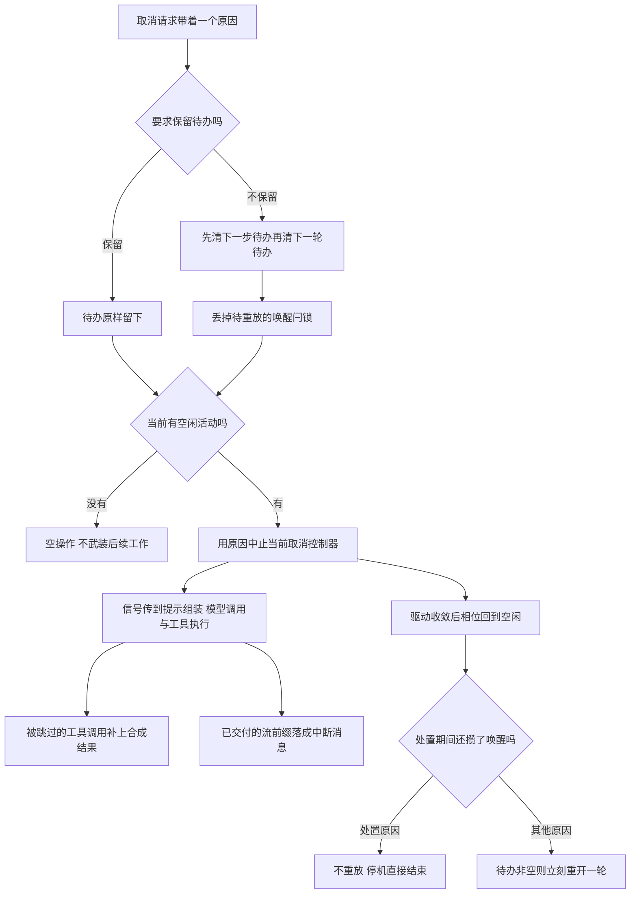

# 05 · 取消与处置:信号的贯穿、独占维护与收尾顺序

> 核心源码:`packages/core/agent-loop/src/agent.ts:149-238`(取消与等待)、`packages/core/agent-loop/src/index.ts:96-147`(工厂归属)与 `:530-687`(单 agent 生命周期)。

---

取消是协作式的:发起方给出一个原因并中止信号,所有可能挂起的地方自己检查它。处置是取消的一个特例——它带 `disposed` 原因、必须等到静默,还要按固定顺序清完写句柄、注册表与作用域;次序反了就会丢掉正在收尾的那批事件。这一篇讲信号的全程贯穿、维护任务的独占期、`whenIdle` 到底在等什么,以及停机时那条不靠显式 flush 的排空链。

## 一、取消是一个有原因的信号,不是一次状态重置

`cancel` 只有四行,但它同时管三件事:待办列表的去留、唤醒闩锁的作废、以及当前活动的信号中止(`agent.ts:149-155`):

```typescript
// packages/core/agent-loop/src/agent.ts:149-155
  cancel(cause: AgentCancelCause, options: CancelOptions = {}): void {
    if (!options.keepInbox) {
      this.inbox.clear()
      if (this.phase.kind !== 'idle') this.phase.wakeRequested = false
    }
    if (this.phase.kind !== 'idle') this.phase.abort.abort(cause)
  }
```

原因(cause)是四种之一(`packages/core/session/src/types.ts:188-192`):`user` 表示用户按下了停止、`parent` 表示被父 agent 打断、`hook` 带一段文本说明是哪个钩子干的、`disposed` 表示这是生命周期处置而不是"用户想换个话题"。这个字段全程随信号走到底,最后写进 `turn/end` 的 `aborted` 理由里(`agent.ts:324`),所以回放时能区分"谁停的这一轮"。

`AbortController` 的语义保证了**第一个原因获胜**:后续的 `abort()` 调用不会覆盖已中止的信号。这条语义在这里很重要——处置流程会在驱动已经因为用户取消而中止之后再加一次 `abort`(`index.ts:577`),如果原因会被覆盖,日志里就再也没法区分"这一轮是用户停的还是被处置停的"。

`keepInbox` 是唯一让取消"不留痕迹"的开关(`packages/core/agent/src/runtime-types.ts:38-45`):打开它之后待办一条不动,也不会落任何 `outcome: 'canceled'` 的 splice 事件。它服务于"我想让这一轮停下,但刚才排队的那几条别丢"这种场景——例如父 agent 想重排子 agent 的工作而不是放弃它。

一个容易被忽略的分支:**空闲时取消是空操作**。相位不是 `idle` 才有控制器可打,空闲态没有控制器,`cancel` 就只是清了待办。它不会留下一个"预置的中止信号"去毒害下一轮——下一轮的控制器是全新构造的(`agent.ts:345`)。同样的道理,`turn()` 每结束一轮就换一个新控制器,所以上一轮的中止不会渗进下一轮:

```typescript
// packages/core/agent-loop/src/agent.ts:344-349
    if (!this.inbox.hasPending) return false
    phase.abort = new AbortController()
    // A fresh controller makes a latch set on the old one stale: the live driver claims the queue itself.
    phase.wakeRequested = false
    phase.step = 0
    return true
```

## 二、信号怎样一路贯穿到工具与模型调用

从取消到"真正停下来"中间隔着若干个 `await` 点,信号的贯穿方式是**每一个都可能挂起的调用都拿到同一个信号**:

| 落点 | 拿到信号的方式 | 检查点 |
|---|---|---|
| 提示组装 | `assembleContextFor(this, signal)` | 组装返回后 `throwIfAborted`(`agent.ts:246`) |
| 步前瀑布 | 载荷里带 `signal` | 瀑布返回后 `throwIfAborted`(`agent.ts:256`) |
| 请求配置瀑布 | 载荷里带 `signal` | 瀑布返回后与适配器绑定后各一次(`agent.ts:534`、`:548`) |
| 适配器解析 | `llm.prepareCall(config, signal)` | 由 LLM 服务转交适配器(`agent.ts:541`) |
| 请求体 | `request.signal = signal` | 请求对象的 `signal` 字段(`agent.ts:615`) |
| 流式迭代 | 同上 | 每个块前后各一次(`agent.ts:395`、`:398`) |
| 工具执行 | `executeToolCalls(..., signal, ...)` | 调度器把它放进每份执行输入(`agent.ts:489`、`tool-calls.ts:79`) |
| 停工回调 | 载荷里带 `signal` | 回调返回后 `throwIfAborted`(`agent.ts:317`) |

工具这一路有个额外机制:执行输入上的 `signal` 是**可被改写的**。`tools/execute` 的包装器(比如超时策略插件)会在派发期间临时换上自己的派生信号再换回来(`packages/guard/timeout-policy/src/index.ts:61-79`),注册表内部用 `fuseToolSignals` 把调用者的信号与包装器的信号并成一路,所以无论哪边先中止,工具体收到的都是中止(`packages/core/tools/src/index.ts:1879`)。调用者侧的取消永远不会因为包装器换了信号而丢失。

取消到达时,调度器不是立刻放弃:已经在跑的工具调用会**跑完并提交**,尚未启动的调用则补上一条合成的 `tool/call` 加 `tool/result` 对,结果文本是固定的中止说明、错误码是 `ABORTED_BEFORE_DISPATCH`(`tool-calls.ts:238-242`、`tool-calls.ts:249-260`)。这么做是为了让"这一轮被打断"在日志里仍然是一个结构完整的步:每个模型提出的调用都有对应的结果,回放时不会出现悬空引用。


<details><summary>Mermaid 源码</summary>



</details>

| 阶段 | 做了什么 | 关键调用(文件:行) |
|---|---|---|
| 清待办 | 不保留时先清 next-step 再清 next-turn,两条都走公开 splice,所以每次丢弃都留下 `canceled` 记录 | `agent.ts:151`、`inbox.ts:100` |
| 作废闩锁 | 相位非空闲时把 `wakeRequested` 清零,免得刚取消又被旧闩锁唤起 | `agent.ts:152` |
| 中止信号 | 相位非空闲才 `abort`,空闲时取消是纯空操作 | `agent.ts:154` |
| 原因落库 | 轮的中止理由来自信号载荷,处置与用户取消因此可区分 | `agent.ts:324`、`session/src/types.ts:188` |
| 换新控制器 | 每轮结束换一个新控制器,上一轮的中止不渗到下一轮 | `agent.ts:345` |
| 独占维护 | 只有真正空闲的相位才能抢下维护;期间到的输入全部排队 | `agent.ts:157-166` |
| 维护信号 | 维护任务拿到自己的控制器信号,可被同一次 `cancel` 中止 | `agent.ts:159`、`agent.ts:170` |
| 维护收尾 | 无论成败都回到空闲,并兑现期间闩住的唤醒 | `agent.ts:172-174` |
| 空闲等待 | 反复 await 当前活动句柄,直到它不再变化 | `agent.ts:210-215` |
| 处置取消 | 生命周期处置就是"带 disposed 原因取消 + 等静默" | `index.ts:592`、`index.ts:593` |
| 拆作用域 | 静默之后才拆 agent 作用域,保证作用域内的注册在下游还在跑时不被提前回收 | `index.ts:594` |
| 关写句柄 | 循环把收尾事件同步写进会话之后,关闭句柄把缓冲排空并释放写所有权 | `index.ts:604` |
| 退注册表 | 按进入的反序退出:先摘 agent 再摘会话,且绑定的都是当初进入的那个对象 | `index.ts:609-610` |
| 工厂处置 | 拒绝新任务、中止开机工作、等待所有存活生命周期与启动任务落定 | `index.ts:138-146`、`index.ts:142-145` |
| 根纤程停机 | 根纤程释放时驱动整条链,缓冲的会话事件因此不需要显式 flush 也落盘 | `tests/shutdown-drain.spec.ts:52-67` |

<details><summary>取消与维护的原始代码</summary>

```typescript
// packages/core/agent-loop/src/agent.ts:149-177
  cancel(cause: AgentCancelCause, options: CancelOptions = {}): void {
    if (!options.keepInbox) {
      this.inbox.clear()
      if (this.phase.kind !== 'idle') this.phase.wakeRequested = false
    }
    if (this.phase.kind !== 'idle') {
      this.phase.abort.abort(cause)
    }
  }

  runMaintenance<T>(job: (signal: AbortSignal) => Promise<T>): Promise<T> {
    if (this.phase.kind !== 'idle') throw new Error(`agent "${this.id}" already has active work`)
    const done = Promise.withResolvers<void>()
    const maintenance: Phase = {
      kind: 'maintenance',
      abort: new AbortController(),
      lastTurn: this.phase.lastTurn,
      wakeRequested: false,
    }
    this.setPhase(maintenance)
    this.activityDone = done.promise
    return (async () => {
      try {
        return await job(maintenance.abort.signal)
      } finally {
        this.setPhase({ kind: 'idle', lastTurn: maintenance.lastTurn })
        if (maintenance.wakeRequested && this.inbox.hasPending) this.wakeDriver()
        done.resolve()
      }
    })()
  }
```

```typescript
// packages/core/agent-loop/src/agent.ts:210-215
  async whenIdle(): Promise<void> {
    let activity: Promise<void>
    do {
      await (activity = this.activityDone)
    } while (activity !== this.activityDone)
  }
```

</details>

## 三、独占维护:在没有轮的时候干别的事

"维护"(maintenance)指的是不驱动模型、但占住这个 agent 的任务:压缩历史、整理会话、生成标题之类。它的实现要点全部集中在一个前置检查上(`agent.ts:158`):

```typescript
// packages/core/agent-loop/src/agent.ts:157-158
  runMaintenance<T>(job: (signal: AbortSignal) => Promise<T>): Promise<T> {
    if (this.phase.kind !== 'idle') throw new Error(`agent "${this.id}" already has active work`)
```

必须是**真正的空闲相位**——不是"状态显示为 idle"。因为 `maintenance` 的对外状态也是 `idle`(`agent.ts:115`),所以维护进行中再调一次 `runMaintenance` 会走到这个检查并且抛错,不会被状态显示骗过去。这条"同步抛出"的契约写在公开接口上(`runtime-types.ts:199`),调用方不需要 await 就能知道自己有没有抢到。

抢到之后立刻同步切相位(`agent.ts:166`),任务体在**同一个微任务里**开始执行——这就是接口注释里"任务在声明相位之后同步开始"的意思(`runtime-types.ts:194-196`)。期间来的输入只能落进 inbox,`wakeDriver` 会因为相位是 `maintenance` 而把它们闩住(`agent.ts:193`)。维护结束时,`finally` 先切回空闲再兑现闩锁(`agent.ts:172-173`),顺序不能反:先兑现的话,`wakeDriver` 会因为相位仍是 `maintenance` 而把唤醒重新闩一遍,形成一个永远兑现不了的闩锁。

维护任务拿到的信号与轮共享同一个 `cancel` 入口,但**不是同一个控制器**:维护有自己的 `AbortController`(`agent.ts:161`)。所以"用户取消"能停掉维护,但维护的结束不会影响轮的信号。

## 四、`whenIdle()` 到底在等什么

```typescript
// packages/core/agent-loop/src/agent.ts:210-215
  async whenIdle(): Promise<void> {
    let activity: Promise<void>
    do {
      await (activity = this.activityDone)
    } while (activity !== this.activityDone)
  }
```

`activityDone` 是这个 agent "当前整段活动"的句柄,每次起驱动(`agent.ts:199`)或起维护(`agent.ts:167`)都会换成新的 promise。`whenIdle` 的写法是一个 do-while:**等完一个句柄之后再看一眼句柄有没有被换掉**,换了就接着等新的。

这个循环解决的是"等待期间又开工了"的问题:一个 driver 收敛时,`kick` 的 `finally` 可能立刻兑现闩锁再起一个驱动(`agent.ts:235`),此时原来的 promise 已经 resolve、新的活动已经开始。如果只 await 一次,调用方会以为整个 agent 静默了,实际上一轮新的模型调用刚刚起步。`whenIdle` 的契约因此被写得很小心:它等的是"**当前整段活动**达到静默",而不是"某一条特定消息被处理完"(`runtime-types.ts:186-190`)。

## 五、处置:一次带 `disposed` 原因的取消加一次静默

处置(dispose)在 `AgentLoop.prepare` 里由一段被记忆化的闭包实现(`index.ts:576`),无论多少个所有者同时调它,都只会跑一次:

```typescript
// packages/core/agent-loop/src/index.ts:576-619(节选)
    const dispose = (ownerTriggered = false): Promise<void> => (disposing ??= (async () => {
      abort.abort(new Error(`agent "${id}" lifecycle disposed`))
      callerSignal?.removeEventListener('abort', onCallerAbort)
      this.ownership.signal.removeEventListener('abort', onFactoryTeardown)
      // Teardown failures are collected, never swallowed: registry, scope,
      // and ownership cleanup always run to quiescence, then the memoized
      // disposal rejects with what failed so every racing owner observes it.
      const failures: unknown[] = []
      try {
        // Disposal IS a disposed-cause cancel followed by quiescence. New work
        // sent after this point is the sender's bug — the registries are about
        // to drop the agent, so nothing should still hold it.
        /* v8 ignore next -- Cordis effect teardown waits for synchronous setup before observing the machine slot. */
        if (machine === undefined) await machineReady.promise
        /* v8 ignore next -- setup failure untracks this disposer before resolving without a machine. */
        if (machine !== undefined) {
          machine.cancel({ kind: 'disposed' })
          await machine.whenIdle()
          await machine.scope.dispose()
        }
      } catch (error: unknown) {
        failures.push(error)
      }
```

顺序是有讲究的,三项缺一不可:

1. **先取消再等待**。处置的本质就是"带 `disposed` 原因取消,然后等静默"——注释把这一点写得很直白。等待是必须的:此刻会话可能还在被某个工具的异步回调追加事件,提前关掉写句柄会丢数据。
2. **静默之后才拆作用域**。作用域里挂着工具注册、事件监听、提示段等等;如果先拆,正在跑的一步会突然看不到自己的工具。
3. **最后关写句柄**。循环在收尾时是**同步**把 `turn/end` 这类事件追加进会话的(`agent.ts:339`),所以到这一步时关闭事件已经就位;`handle.close()` 负责把缓冲排空并释放写所有权,它也可能是整条链上**第一个**暴露持久化故障的地方,所以它的错误会被收集而不是吞掉(`index.ts:603-607`)。

失败处理是"全部跑完再报告":注册表、作用域、归属记账三件清理一定会执行到底,然后把收集到的失败按数量抛出——一个就抛它本身,多个就抛 `AggregateError`(`index.ts:615-618`)。这样并发的多个所有者都能看到同样的失败,而不会有人拿到"清理成功"的假象。

工厂层面的处置更简单(`index.ts:138-146`):先关掉接单开关,再中止开机信号,然后 `Promise.all` 等所有存活生命周期与所有启动任务落定。等的过程本身也可以被打断——`waitWhileActive` 用 `Promise.race` 让开机等待在工厂开始处置时立刻返回(`index.ts:134-136`),否则一个永不返回的持久化后端会把停机卡死。

## 六、停机时的排空为什么不需要显式 flush

根纤程释放会沿 Cordis 的 effect 树自内向外释放,agent 生命周期就在这棵树上(`index.ts:419`、`index.ts:623`)。于是"根纤程停机"自动等价于"逐个 agent 走一遍上面那段处置",会话句柄在各自的生命周期里被关闭,缓冲事件随之落盘。

`packages/core/agent-loop/tests/shutdown-drain.spec.ts:52-67` 把这条链当成契约来测:它建一个 agent、跑完一轮、**不做任何显式 flush 也不显式处置 agent**,直接释放根纤程,然后重新打开持久化后端读日志,断言最后一条事件正是 `turn/end` 且理由为 `completed`。两种挂载顺序(先装持久化后端再装循环、反过来)都被覆盖,因为依赖注入顺序不该改变停机行为。

`turn/end` 的事件注释里有一句相关的话:轮边界本身不等待 flush,按请求的持久化检查点由 `dsh-session-checkpoint-policy` 负责;需要在 `whenIdle()` 之后读存储的消费者自己负责 flush(`packages/core/session/src/types.ts:277-284`)。停机排空补上的正是"进程要走了,没人再来 flush"这一种情形。

## 关键文件/符号索引

| 文件 | 行数 | 符号与行号 |
|---|---|---|
| `packages/core/agent-loop/src/agent.ts` | 619 | `cancel`(`:149`)、`runMaintenance`(`:157`)、`wakeDriver`(`:187`)、`whenIdle`(`:210`)、`kick`(`:225`)、`turn` 中止理由(`:324`)、换新控制器(`:345`) |
| `packages/core/agent-loop/src/index.ts` | 930 | `FactoryOwnership`(`:97`)、`waitWhileActive`(`:134`)、`dispose`(`:138`)、`raceAbortCall`(`:166`)、`prepare`(`:530`)、记忆化处置(`:576`)、处置取消(`:592`)、静默等待(`:593`)、拆作用域(`:594`)、关写句柄(`:604`)、退注册表(`:609`)、失败聚合(`:615`) |
| `packages/core/agent-loop/src/tool-calls.ts` | 290 | `aborted` 判定(`:139`)、中止后的合成结果(`:238-242`)、`appendSkippedToolCall`(`:250`) |
| `packages/core/session/src/types.ts` | 495 | `AgentCancelCause`(`:188`)、`TurnEndCancelCause`(`:195`)、`aborted` 理由(`:203`)、`turn/end` 契约(`:277-285`) |
| `packages/core/agent/src/runtime-types.ts` | 405 | `CancelOptions`(`:38`)、`cancel`(`:183`)、`whenIdle`(`:191`)、`runMaintenance`(`:202`) |
| `packages/guard/timeout-policy/src/index.ts` | 81 | `apply`(`:55`)、信号替换与还原(`:61-79`) |
| `packages/core/tools/src/index.ts` | 1936 | `fuseToolSignals`(`:1879`) |
| `packages/core/agent-loop/tests/shutdown-drain.spec.ts` | 69 | 根纤程停机排空(`:52-67`) |
