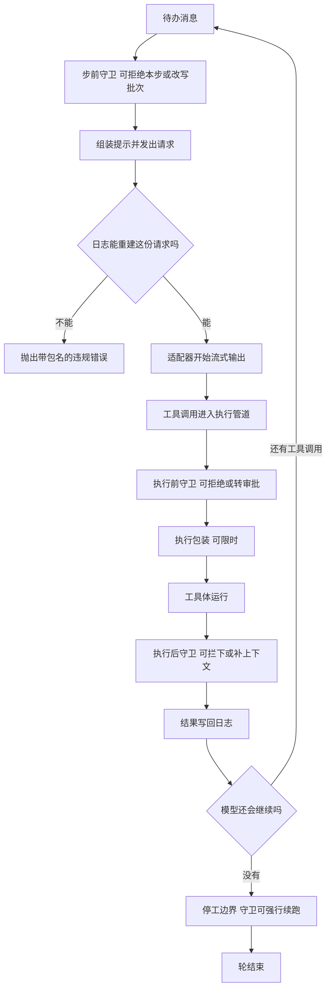

# 06 · 运行期不变量与守卫:日志重建一致性与守卫挂点

> 核心源码:`packages/core/agent-loop/src/invariant.ts`(65 行)、`packages/core/agent/src/invariant.ts`(32 行)、`packages/core/agent/src/consumed-work.ts`(108 行)、`packages/guard/repeat-tool-reminder/src/index.ts`(233 行)、`packages/guard/timeout-policy/src/index.ts`(81 行)。
> 注册表实现:`packages/runtime-diagnostics/invariants/src/index.ts`(200 行)。

---

这套内核用两条"两条互不知情的路径必须算出同一个结果"的检查来兜底:一条盯住发出去的请求能不能由日志重建,一条盯住状态机有没有空转。违规不是记一笔日志就算了,而是当场抛错终止当前轮。行为约束则由挂在接缝上的守卫插件承担,它们分别落在步边界、工具执行的三段管道,以及停工边界上。这一篇把这几处的检查内容、违规表现与挂点逐一列清。

## 一、什么叫"不变量",它和普通测试差在哪

这份代码里的"不变量"(invariant)指的是**两个独立的观察必须一致**。它不是断言某个函数返回了预期值,而是断言"同一件事用两条互不知情的路径算出来的结果相同"——只有两条路径真的会漂移时,这个检查才有存在价值,所以仓库的约定是"观察不会分叉就不要写伴随插件"。

agent-loop 的那条不变量就是标准的双路径:一边是**发出去的请求对象**,另一边是**会话日志重新推一遍得到的请求**。前者是循环刚刚构造的内存对象,后者是拿日志从头折出来的;两边本来就应该逐字节相同。任何让它们分叉的改动——比如某个插件在瀑布里就地改了消息、或者冻结漏掉了一层——都会被当场抓住。

第二条不变量属于 agent 包,检查的是状态机本身:`agent/status` 每一次派发都必须是一次真实的跃迁,重复进入同一状态即违规(`packages/core/agent/src/invariant.ts:16-23`)。它的意义是给"相位只能用 `setPhase` 改"这条规矩上一道锁。

## 二、日志重建一致性检查的四层

安装器只做一件事:订阅 `llm/stream` 瀑布,并且**用 `prepend` 抢在最前面**(`invariant.ts:56`):

```typescript
// packages/core/agent-loop/src/invariant.ts:19-57
const install: InvariantInstaller = Object.assign((ctx: Context, fail: InvariantFailure) => {
  // Prepend prevents a short-circuiting replay listener from silencing the check.
  ctx.on('llm/stream', (options: GenerateOptions, next) => {
    if (!isAgentLoopRequest(options)) return next()
    if (!Object.isFrozen(options)) fail('a loop-built request must be frozen')
    if (options.sessionId === undefined) fail('a loop-built request must carry a session id')
    const session = ctx.sessions.get(options.sessionId)
    if (!session) fail(`a loop-built request must carry a live session id, got "${String(options.sessionId)}"`)
    if (!Object.isFrozen(options.messages)) {
      fail('a loop-built request must carry a frozen messages array')
    }

    // oxlint-disable-next-line typescript/no-deprecated -- Existing Session history read; migration deferred.
    const events = session.snapshotEvents()
    if (!events.some(event => event.type === 'step/start')) {
      return fail('a loop-built request with no step/start in its session log')
    }
    const header = foldRequestHeader(events)
    if (header === undefined) {
      return fail('a loop-built request with no request/header event in its session log')
    }
    const expected = session.deriveMessages()
    if (JSON.stringify(options.messages) !== JSON.stringify(expected)) {
      fail(`llm request for session "${String(session.id)}" diverges from the dispatch-time durable derivation (log-reconstruction desync)`)
    }

    // The system prompt travels inside `messages` as surface node 0, never as `system`.
    const headerMatches = options.model === header.config.model
      && options.system === undefined
      && options.temperature === header.config.temperature
      && options.maxTokens === header.config.maxTokens
      && JSON.stringify(options.stop) === JSON.stringify(header.config.stop)
      && JSON.stringify(options.tools ?? []) === JSON.stringify(header.tools ?? [])
    if (!headerMatches) {
      fail(`llm request for session "${String(session.id)}" diverges from the folded request header`)
    }
    return next()
  }, { global: true, prepend: true })
}, { inject: ['sessions'] })
```

四层检查是递进的,每一层都以前一层成立为前提:

| 层 | 检查什么 | 为什么需要 |
|---|---|---|
| 身份层 | 只对带循环标记的请求生效 | 手工构造的一次性调用不受这份契约约束,不能误报 |
| 冻结层 | 请求对象与消息数组都已冻结 | 冻结是"发出后不会被偷改"的唯一证据;少了它就是给竞态留窗口 |
| 归属层 | 带会话 id,且该会话此刻仍在注册表里活着 | 请求发出去时对应的会话必须还在,否则它写的事件无处可去 |
| 日志层 | 日志里有 `step/start`、有可折叠的请求头、派生消息与请求体逐字节相同、请求头字段与折叠结果相同 | 这一层才是真正的一致性检查 |

第四层里那个"逐字节相同"用的是 `JSON.stringify` 比较。它看起来粗糙,但在这份数据上是正确的:消息与请求头都是无损 JSON,而且两边都经过同一套冻结,所以序列化结果稳定,不存在键序漂移的问题。

最后一条检查里有一句值得单独拎出来的约定:`options.system === undefined`。系统提示在这套体系里**不是**请求的 `system` 字段,而是消息数组的第 0 个节点(`packages/core/session/src/types.ts:298-310`)。这条检查就是在守住这个约定——谁要是图省事把提示塞进 `system`,日志里就永远看不到它,重建必然失败。

`prepend` 那个选项不是风格问题:瀑布的第一个监听器如果想短路整条链(不调 `next()` 直接返回自己的流),排在它后面的检查就永远不会执行。抢在最前面,意味着**任何替换了请求的插件都会被检查到它替换后的结果**,检查无法被绕过。


<details><summary>Mermaid 源码</summary>



</details>

| 阶段 | 做了什么 | 关键调用(文件:行) |
|---|---|---|
| 注册包名 | 把整包的不变量贡献登记到诊断服务,同一包名不能登记两次 | `invariant.ts:64`、`invariants/src/index.ts:136` |
| 过滤生效 | 全局开关与按包名正则的允许/阻止列表决定这条贡献要不要真的装上 | `invariants/src/index.ts:121-126` |
| 抢最前 | 以全局加前置的方式订阅流式入口,防止被短路的监听器保护掉 | `invariant.ts:21`、`invariant.ts:56` |
| 只查循环请求 | 用进程内弱标记区分"这次请求是不是主循环拼的" | `invariant.ts:22`、`call-config.ts:76` |
| 冻结检查 | 请求对象与消息数组必须是冻结的 | `invariant.ts:23`、`invariant.ts:27` |
| 归属检查 | 请求必须带会话 id,且该会话仍然活着 | `invariant.ts:24-26` |
| 边界存在性 | 日志里必须有 `step/start`,否则说明请求不在步内发出 | `invariant.ts:32-35` |
| 请求头可折叠 | 日志里必须有可折叠的 `request/header` | `invariant.ts:36-39` |
| 重建比对 | 现场派生消息与请求体逐字节比对,不等即报"日志重建失同步" | `invariant.ts:40-43` |
| 请求头比对 | 模型、温度、输出上限、停止串、工具集逐项比对,并强制 `system` 为空 | `invariant.ts:45-54` |
| 违规上报 | 失败即抛 `InvariantError`,错误码固定为 `INVARIANT`,消息里带责任包名 | `invariants/src/index.ts:161-163`、`invariants/src/index.ts:50-66` |
| 状态机不变量 | `agent/status` 重复进入同一状态即违规 | `agent/src/invariant.ts:17-23` |

## 三、违反时的表现

违规不是"记一条日志然后继续",而是**当场抛错**。`fail` 的实现只有一行(`invariants/src/index.ts:161-163`):

```typescript
// packages/runtime-diagnostics/invariants/src/index.ts:160-164
        const installInvariant = (childCtx: Context) => (
          installer(childCtx, (message): never => {
            throw new InvariantError(packageName, message)
          })
        )
```

抛出的 `InvariantError` 把包名写进消息前缀、并把 `code` 固定成 `'INVARIANT'`(`invariants/src/index.ts:49-66`)。因为检查点就在 `llm/stream` 里,这个异常会顺着流式调用冒到 `step()`,再走轮的异常路径变成 `{ kind: 'error' }` 的 `turn/end` 理由,同时派发一次 `agent/error`。也就是说:**一次日志重建失同步会终止当前轮,而不是悄悄发一个不一致的请求出去**。

装不上也算失败。诊断服务把每个包的安装器放在**子纤程**里跑,安装抛错时会释放子纤程并撤销包名占位(`invariants/src/index.ts:170-187`)。这条路径保证"检查没生效"和"检查通过了"在外部看来不是一回事。

## 四、`consumed-work`:另一条口径的记账

`packages/core/agent/src/consumed-work.ts` 不是断言,而是一个**折叠器**:给一段日志,回答"这段日志里的工作量被交代清楚了吗"。它解决的问题写成注释很清楚——光看轮与步的词汇答不出来:

```typescript
// packages/core/agent/src/consumed-work.ts:1-13(节选)
/**
 * How one agent log accounts for the work it consumed.
 *
 * The turn and step vocabulary alone cannot answer this. A turn that stops
 * before its first step leaves a `turn/end` shaped exactly like the balanced
 * no-op turns a rejection or an empty claim produces, so reading turns in
 * isolation either credits cut-short work as finished or convicts every no-op.
 * The missing fact is the inbox's own record: {@link Inbox} logs each mutation
 * with `removedCount` and marks a cancellation `outcome: 'canceled'`, which
 * separates a turn claiming its input from work being dropped unrun.
 *
 * @module @deepseek-ai/dsh-agent/consumed-work
 */
```

折叠器单趟扫日志,只认五种事件(`consumed-work.ts:74-106`):`turn/start` 记下当前开着的轮、`step/start` 把该轮标记为"进过步"、`agent/inbox/spliced` 区分"取走"(计入 claim)与"取消丢弃"(计入 `droppedUnrun`)、`turn/end` 结算一轮。结算规则是:进过步的轮永远算数;没进过步但取走过输入的轮,只有它的结束理由确实交代了这份输入时才算数。

```typescript
// packages/core/agent/src/consumed-work.ts:41-58
function accountsForClaim(reason: TurnEndReason): boolean {
  switch (reason.kind) {
    case 'completed':
      return false
    case 'blocked':
    case 'aborted':
    case 'interrupted':
    case 'error':
      return true
    /* v8 ignore next 4 -- unreachable: the one unnamed built-in, `max-tokens`, requires a step,
     * so its turn short-circuits as stepped before this call, and `TurnEndReasonMap` is
     * merge-extensible, so a backend-added variant cannot be listed; an unnameable ending over
     * consumed input must not read as success. */
    default:
      return true
  }
}
```

`completed` 之所以返回假,是因为一个"取走了输入但没进任何步就正常完成"的轮,意味着那份输入在步前被改写成了空批次(`agent.ts:297-300`)——它没有工作要交代。其余理由都意味着输入确实被吃掉了却没能跑完,必须被记成"有始无终"。这个折叠器把所有输入都当作日志本身,不需要调用方在取消之前先采样活状态,所以无论是谁发起的取消读到的都是同一个结论。

## 五、守卫插件挂在循环的哪些点上

"守卫"(guard)在本仓库是一个包组(`packages/guard/`),它们不是循环的一部分,而是挂在循环暴露的接缝上的普通插件。当前有两个,各自挂的点不同:

```typescript
// packages/guard/timeout-policy/src/index.ts:55-80
export function apply(ctx: Context): void {
  ctx.on('tools/execute', async (exec, next): Promise<ToolExecutionResult> => {
    const timeoutMs = ctx.tools.get(exec.name, exec.agent)?.timeoutMs
    // A tool that declares no budget: no deadline, delegate unchanged.
    if (timeoutMs === undefined) return next()

    using d = deadline(exec.signal, timeoutMs, TOOL_TIMEOUT)
    // Swap the derived deadline onto exec for dispatch, then restore the
    // caller's own signal so post-execute listeners never see this plugin's
    // (possibly already-aborted) timeout signal.
    const upstream = exec.signal
    exec.signal = d.signal
    try {
      const result = await next()
      // If OUR timer fired (scoped by code — a nested outer deadline reads as
      // undefined here), the tool/capability saw the abort and reached
      // quiescence; replace whatever it returned (its own abort result) with the
      // structured TOOL_TIMEOUT the model sees.
      if (timeoutOf(d.signal, TOOL_TIMEOUT) !== undefined) {
        return toolTimeoutResult(timeoutMs)
      }
      return result
    } finally {
      exec.signal = upstream
    }
  })
}
```

它挂在 `tools/execute` 上,做法是"换信号、委派、还原信号",并且**只在确认是自己的定时器先响**时才替换结果(`timeoutOf` 带上了自己的错误码作为作用域限定,`guard/timeout-policy/src/index.ts:18-24`)。这样嵌套的外层超时不会被误认成自己触发的。

`repeat-tool-reminder` 挂两个点:计数在 `tools/post-execute`,重置在 `agent/pre-step`。计数放在执行后而不是执行前,理由写在代码注释里(`guard/repeat-tool-reminder/src/index.ts:181-188`):被拒绝的调用也走同一条执行后瀑布,而"模型反复撞同一个被拒的调用"恰恰是最值得打断的死循环。

```typescript
// packages/guard/repeat-tool-reminder/src/index.ts:209-232
  // Observe-and-enrich, never veto: count first (state advances regardless of
  // the downstream outcome), DELEGATE so a later listener can still block or
  // replace, then fold the reminder onto whatever came back — additionalContexts
  // rides both decision variants, so a blocked call still gets the nudge.
  ctx.on('tools/post-execute', async (exec, _result, next): Promise<PostToolDecision> => {
    const reminder = observe(exec)
    const downstream = await next()
    if (!reminder) return downstream
    if (downstream.kind === 'block') {
      return { kind: 'block', feedback: downstream.feedback, additionalContexts: prependContext(reminder, downstream.additionalContexts) }
    }
    return {
      ...downstream,
      additionalContexts: prependContext(reminder, downstream.additionalContexts),
    }
  })

  // A user interjection changes the context; repetition across it is not a
  // loop. Pure reset hook: always delegates (attaching nothing, vetoing
  // nothing).
  ctx.on('agent/pre-step', ({ agent, messages }, next): Promise<PreStepDecision> => {
    if (messages.some(message => message.source.kind === 'user')) chains.delete(agent)
    return next()
  })
```

两个插件的共同写法值得记下来:**先观察、再委派、最后把追加信息折回到下游的决策上**(`next()` 一定要调)。这样它们的顺序不会抢走别人的否决权,也不会因为排在自己后面的那个守卫拦下了调用就丢掉自己的提醒。三个可挂的循环点分别是:

| 挂点 | 语义 | 能做什么 | 现有使用者 |
|---|---|---|---|
| `agent/pre-step` | 瀑布,步边界 | 拒绝本步、改写进入本步的消息、声明新系列 | `guard/repeat-tool-reminder`、各类上下文注入插件 |
| `tools/pre-execute` / `tools/execute` / `tools/post-execute` | 三段管道 | 执行前拒绝或转审批、包裹执行、执行后拦截或追加随附上下文 | `guard/timeout-policy`、`guard/repeat-tool-reminder`、审批与钩子桥 |
| `agent/turn-stopping` | 串行,停工边界 | 在轮即将关闭时插话——典型的做法是 steer 一条消息让循环再跑一步 | `hooks-claude-code`、`hooks-codex` |

停工边界这条有个必须注意的限度:它只能通过**数据**(往 inbox 里放东西)来改变结论,监听器的先后顺序不会改变结果——循环在回调之后重读待办,待办非空就继续,空就关轮(`agent.ts:315-319`)。所以"强行续跑"是可能的,但"无条件阻止收轮"不是;`hooks-claude-code` 里那个 Stop 钩子就是靠 `agent.steer(...)` 实现的(`hooks/hooks-claude-code/src/index.ts:269-276`),而它旁边那条 TODO 也点明了这个机制没有内建的次数上限。

<details><summary>agent 包的状态机不变量</summary>

```typescript
// packages/core/agent/src/invariant.ts:14-24
const install: InvariantInstaller = (ctx, fail) => {
  const lastStatus = new WeakMap<Agent, AgentStatus>()
  ctx.on('agent/status', ({ agent, status }) => {
    const previous = lastStatus.get(agent)
    if (previous === status) {
      fail(`agent/status repeated ${status} (no-op transition)`)
    }
    lastStatus.set(agent, status)
  }, { global: true })
}
```

</details>

<details><summary>consumed-work 的折叠主体</summary>

```typescript
// packages/core/agent/src/consumed-work.ts:68-107
export function foldConsumedWork(events: readonly SessionEvent[]): ConsumedWork {
  const stepped = new Set<number>()
  const claimed = new Set<number>()
  let open: number | undefined
  let end: SessionEvent<'turn/end'> | undefined
  let droppedUnrun = false
  for (const event of events) {
    switch (event.type) {
      case 'turn/start':
        open = event.data.turn
        break
      case 'step/start':
        stepped.add(event.data.turn)
        break
      case 'agent/inbox/spliced': {
        const { removedCount, outcome, inserted } = event.data
        if (removedCount === undefined) break
        // A replacement keeps the work pending under a new identity, so only a
        // cancellation that leaves nothing behind drops it.
        if (outcome === 'canceled') droppedUnrun ||= inserted.length === 0
        // Claims are the loop's own step-boundary reads, always inside a turn.
        else if (open !== undefined) claimed.add(open)
        break
      }
      case 'turn/end': {
        const { turn, reason } = event.data
        open = undefined
        if (stepped.delete(turn) || (claimed.delete(turn) && accountsForClaim(reason))) {
          end = event
          // Anything dropped before this turn closed is what its own ending
          // reports; only a later drop is still unaccounted for.
          droppedUnrun = false
        }
        break
      }
      default:
        break
    }
  }
  return { ...end === undefined ? {} : { end }, droppedUnrun }
}
```

</details>

## 关键文件/符号索引

| 文件 | 行数 | 符号与行号 |
|---|---|---|
| `packages/core/agent-loop/src/invariant.ts` | 65 | `name`(`:14`)、`inject`(`:16`)、`install`(`:19`)、`apply`(`:64`) |
| `packages/core/agent/src/invariant.ts` | 32 | `install`(`:15`)、`apply`(`:31`) |
| `packages/core/agent/src/consumed-work.ts` | 108 | `ConsumedWork`(`:18`)、`accountsForClaim`(`:42`)、`foldConsumedWork`(`:68`) |
| `packages/runtime-diagnostics/invariants/src/index.ts` | 200 | `InvariantFailure`(`:29`)、`InvariantInstaller`(`:32`)、`InvariantError`(`:50`)、`selected`(`:121`)、`register`(`:136`)、`fail` 构造(`:161`) |
| `packages/guard/repeat-tool-reminder/src/index.ts` | 233 | `apply`(`:162`)、`tracked`(`:176`)、`observe`(`:189`)、`tools/post-execute`(`:213`)、`agent/pre-step`(`:229`) |
| `packages/guard/timeout-policy/src/index.ts` | 81 | `TOOL_TIMEOUT`(`:25`)、`toolTimeoutResult`(`:41`)、`apply`(`:55`) |
| `packages/llm/llm/src/call-config.ts` | 78 | `markAgentLoopRequest`(`:66`)、`isAgentLoopRequest`(`:76`) |
| `packages/llm/llm/src/index.ts` | 1147 | `llm/stream` 事件声明(`:72`)、派发点(`:1116`) |
| `packages/hooks/hooks-claude-code/src/index.ts` | 359 | `agent/pre-step`(`:218`)、`agent/turn-stopping`(`:269`) |
