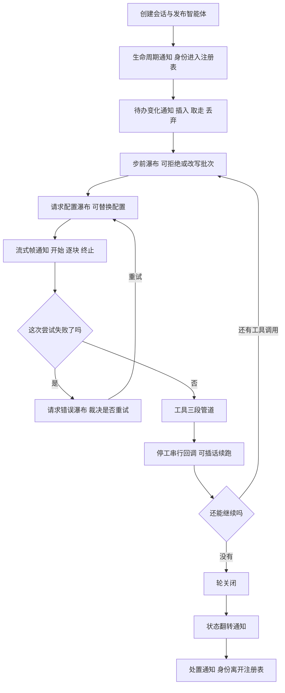

# 07 · 循环生命周期事件清单:声明、发起方、消费方与三种分发语义

> 核心源码:`packages/core/agent/src/runtime-types.ts:245-404`(事件声明)、`packages/core/agent/src/dispatch.ts`(176 行,派发器)、`packages/core/scope/src/scoped-events.generated.ts`(51 行,作用域路由表)。

---

循环对外只有十三个 `agent/*` 事件,它们分成通知、串行、瀑布三种语义:通知不等结果也不能否决,串行要被 `await` 且能用异常打断,瀑布则允许监听器整体替换返回值。这些事件的声明与派发都在 agent 包里而不是循环包里,所以 Hooks 桥、Host API、遥测与各类能力插件接的是同一套事件,换一个 Agent 实现也不用改它们。这一篇按阶段列出每个事件的声明处、发起方与消费方,并说明三种语义各自适合什么场合。

## 一、作用域键与载荷里的 `agent` 是同一个值

`agent/*` 一共 13 个事件,它们有一条共同的形状:载荷里带 `agent`,而且类型上标注 `this: Scoped<Agent>`。这两处不是重复——前者是给监听器读的主体,后者是 Cordis 用来路由的载体。`agentEvents` 把两者焊在一起(`dispatch.ts:107-118`):

```typescript
// packages/core/agent/src/dispatch.ts:107-118
export function agentEvents(ctx: Context, agent: Agent, carrier: Scoped<Agent> = agentCarrier(agent)): AgentEventDispatch {
  // The ordinary dispatch methods forward through Cordis' variadic mixins. The
  // fused (carrier, name, payload, ...rest) tuple is provably a valid argument
  // list for the matching thisArg overload, but TypeScript cannot relate the
  // generic Tail<K> spread back to that overload's conditional parameter
  // tuple — hence one contained, shape-preserving cast per method.
  const fused = <K extends AgentSubjectEvent>(payload: PayloadRest<K>): PayloadOf<K> =>
    // The dispatcher owns the subject injection; callers pass PayloadRest, so
    // the fused record is exactly the declared payload. The spread comes
    // first, so a structurally acceptable payload that happens to carry an
    // `agent` field can never override the injected subject.
    ({ ...payload, agent } as PayloadOf<K>)
```

调用方传的是**去掉 agent 的载荷**(`PayloadRest`),派发器再把主体注入进去。所以"作用域键"与"载荷里的 agent"在构造上不可能分叉——不存在"事件发给 A 但载荷说是 B"这种状态。注册在某个 agent 作用域上的监听器只会收到那个 agent 的事件,而注册在外层上下文(不指定作用域)的监听器收到全部。

事件集本身是**推导出来的**,不是手工维护的清单(`dispatch.ts:28-34`):凡是"处理器 `this` 是 `Scoped<Agent>` 且首个参数是带 `agent` 的对象"的事件自动进入这个集合。少了 `this` 检查,任何"载荷里恰好有个 agent 字段"的事件都会被误纳进来。作用域路由表另有一份生成文件(`scoped-events.generated.ts:10-39`),它声明每个作用域事件该从载荷的哪个字段取路由键,是诊断插件用来验证"派发时载体与载荷一致"的依据。

`ReactLoopAgent` 在构造时只建一次派发器并复用(`agent.ts:82`、`:103`),注释写明这是为了让热路径上的派发不产生额外分配。

## 二、三种分发语义,一条判断标准

同样叫"事件",在这套体系里有三种完全不同的交互契约。选哪一种,取决于"发起方要不要等结果"以及"监听器能不能改变结果":

| 语义 | 方法 | 发起方是否等待 | 监听器能否改变结果 | 失败如何传播 |
|---|---|---|---|---|
| 通知 | `emit` | 不等 | 不能 | 同步抛出与 promise 拒绝都被逐个捕获并记日志,单个监听器失败不影响其他监听器,也不影响发起方 |
| 串行 | `serial` | 等 | 能——但只能通过抛错打断,或者改写循环接下来会读的数据 | 抛出即向上传播,后续监听器不再执行 |
| 瀑布 | `waterfall` | 等 | 能——返回一个替换值即可整体接管 | 抛出即向上传播;不调用 `next()` 即短路,后面的监听器看不到 |

`emit` 的实现刻意绕开了 Cordis 的原生 emit(`dispatch.ts:120-137`),原因是原生的实现走 `Array.map`,一个同步抛出会饿死后面的监听器,而返回值里的 promise 会被直接丢弃:

```typescript
// packages/core/agent/src/dispatch.ts:120-137
    emit(name, payload) {
      // Cordis emit invokes callbacks through Array.map: one synchronous throw
      // starves later listeners, and returned promises are discarded. Agent
      // notifications are non-vetoing, so resolve the same filtered callback
      // set ourselves and contain both failure modes independently.
      const args: unknown[] = [carrier, name, fused(payload)]
      const callbacks = ctx.events.dispatch('emit', args)
      for (const callback of callbacks) {
        try {
          const returned: unknown = callback(...args)
          void Promise.resolve(returned).catch((error: unknown) => {
            ctx.logger.warn(`agent event "${name}" listener rejected: ${String(error)}`)
          })
        } catch (error: unknown) {
          ctx.logger.warn(`agent event "${name}" listener threw: ${String(error)}`)
        }
      }
    },
```

`serial` 直接转发给上下文上的实现(`dispatch.ts:138-142`),`waterfall` 同理并把尾部参数(也就是 `next`)一起传下去(`dispatch.ts:143-147`)。瀑布监听器有一条硬性约定:**想放行就必须调用 `next()`**;直接返回等于短路整条链。

`emitAgentEvent`(`dispatch.ts:158-165`)是给"只发一次、不需要留下派发器"的场景准备的薄包装,`AgentLoop` 发布时用的就是它(`index.ts:675`)。

## 三、按阶段看这 13 个事件


<details><summary>Mermaid 源码</summary>



</details>

| 事件 | 语义 | 声明处 | 发起方 | 主要消费方 |
|---|---|---|---|---|
| `agent/created` | 通知 | `runtime-types.ts:258` | 注册表发布(`agent/src/index.ts:545`) | 上下文引用插件(`context/file-reference-local/src/index.ts:90`)、预设(`preset/agent-presets/src/index.ts:218`)、子 agent 工具(`subagent/tool-subagent/src/index.ts:699`)、调度(`schedule/schedule/src/index.ts:52`) |
| `agent/disposed` | 通知 | `runtime-types.ts:267` | 注册表退场(`agent/src/index.ts:513`) | 会话历史(`api/session-controller/src/history.ts:62`)、子 agent 工具(`subagent/tool-subagent/src/index.ts:702`)、工厂等待(`agent-loop/src/index.ts:513`) |
| `agent/status` | 通知 | `runtime-types.ts:277` | 相位提交(`agent.ts:124`) | 会话控制器转成对外状态(`api/session-controller/src/index.ts:152`)、SDK 服务端(`sdk/server/src/server.ts:99`)、压缩(`compaction/compaction-basic/src/index.ts:168`)、目标轮驱动(`goal/goal-round-driver/src/index.ts:259`) |
| `agent/inbox/inserted` | 通知 | `runtime-types.ts:285` | 待办投影写入(`inbox.ts:243`) | 作业工具(`jobs/tool-jobs/src/index.ts`)、目标轮驱动(`goal-round-driver/src/index.ts:296`)、子 agent 续存(`subagent/subagent/src/continuation-activation.ts` 系列) |
| `agent/inbox/claimed` | 通知 | `runtime-types.ts:296` | 步边界取消息(`inbox.ts:114`) | ACP 桥(`acp/acp/src/index.ts:140`)、作业工具(`jobs/tool-jobs/src/index.ts:224`)、取走即唤醒的续存逻辑(`subagent/subagent/src/continuation-activation.ts:626`) |
| `agent/inbox/discarded` | 通知 | `runtime-types.ts:304` | 待办取消丢弃(`inbox.ts:240`) | 目标轮驱动(`goal-round-driver/src/index.ts:311`)、续存逻辑(`continuation-activation.ts:627`) |
| `agent/session-start` | 通知 | `runtime-types.ts:316` | 发布收尾(`agent-loop/src/index.ts:675`) | Hooks 桥(`hooks/hooks-claude-code/src/index.ts:205`、`hooks/hooks-codex/src/index.ts:187`)、目标(`goal/goal/src/index.ts:255`)、团队实验(`experimental/agent-team/src/index.ts:111`) |
| `agent/pre-step` | 瀑布 | `runtime-types.ts:330` | 步边界(`agent.ts:249`) | 时间与终端上下文、会话引用、指令注入、计划模式、技能工具、压缩、检查点策略、Hooks 桥、重复调用守卫、目标轮驱动 |
| `agent/request` | 瀑布 | `runtime-types.ts:347` | 备请求(`agent.ts:530`) | 模型选择(`core/agent/src/model-selection.ts:91`)、Webhook 会话(`webhook/webhook/src/session.ts:93`)、重试插件(`llm/llm-retry/src/index.ts`) |
| `agent/request-error` | 瀑布 | `runtime-types.ts:363` | 失败尝试结算后(`agent.ts:448`) | 重试插件(`llm/llm-retry/src/index.ts:243`)、压缩(`compaction/compaction-basic/src/index.ts:180`)、计划模式(`plan/plan-mode/src/index.ts:184`) |
| `agent/assistant-stream` | 通知 | `runtime-types.ts:373` | 每次尝试的帧(`agent.ts:386`) | 会话历史转写(`api/session-controller/src/history.ts:54`、`:166`)、无头输出(`bundle/headless/src/index.ts:113`) |
| `agent/turn-stopping` | 串行 | `runtime-types.ts:391` | 轮收尾(`agent.ts:316`) | Hooks 桥(`hooks/hooks-claude-code/src/index.ts:269`、`hooks/hooks-codex/src/index.ts:259`) |
| `agent/error` | 通知 | `runtime-types.ts:403` | 统一错误出口(`agent.ts:221`) | 会话控制器(`api/session-controller/src/index.ts:155`)、ACP(`acp/acp/src/index.ts:144`)、遥测(`session/session-telemetry/src/coordinator.ts:116`)、目标轮驱动(`goal/goal-round-driver/src/index.ts:246`) |

## 四、五个关键事件在循环里的确切落点

**`agent/status`** 只在状态值真的变化时发出(`agent.ts:119-126`)。发出时机是**同步**的:唤醒路径上,相位先进运行态再起驱动,所以监听器在 `followup()` 返回之前就已经收到 `running`。这也是 `agent` 包的诊断不变量能成立的前提——它假设每一次派发都是一次真实跃迁。

**`agent/pre-step`** 是步边界上唯一的可改写点。它的载荷里带着**已经从待办里取走**的消息(`agent.ts:244`),所以监听器想拦下这些消息只能返回 `reject`,把它们"还回去"不在契约里——文档把这一点写得很明确:被拒绝的步里,那条消息就在这里结束,既不会被丢弃也不会重新发一遍(`runtime-types.ts:286-291`)。

**`agent/request`** 的默认实现返回循环本来会用的配置:首个请求是 agent 选项,之后是日志里折叠出来的请求头(`agent.ts:520-532`)。它**不能改消息**,载荷里也没有消息——想影响模型看到的内容必须走日志通道(`runtime-types.ts:336-339`)。模型选择插件就是在这里换 provider 与 model 的(`core/agent/src/model-selection.ts:91-107`)。

**`agent/request-error`** 的默认值是 `undefined`,也就是"失败即终局"。它是唯一一个"返回值决定控件流向"的瀑布:返回 `{ kind: 'retry' }` 会让 `step()` 里的循环再跑一轮(`agent.ts:463`)。

**`agent/turn-stopping`** 是串行语义,循环 `await` 它;但监听器**改不了结论**,只能通过往待办里放东西让循环重读后决定继续(`agent.ts:315-319`)。这条设计的好处写在事件注释里:结论由数据决定,所以监听器的注册顺序不会改变结果(`runtime-types.ts:378-384`)。

## 五、外部世界怎么接上这些事件

四类消费方各自代表一种接法:

- **Hooks 桥**(`packages/hooks/`)把 Claude Code 与 Codex 的钩子点映射到循环事件上:`UserPromptSubmit` 接 `agent/pre-step` 并在拒绝时返回 `reject`(`hooks/hooks-claude-code/src/index.ts:218-234`),`Stop` 接 `agent/turn-stopping` 并在拒绝时 `steer` 一条消息强行续跑(`hooks/hooks-claude-code/src/index.ts:269-276`)。
- **UI 与 Host API**:`api/session-controller` 把 `agent/status` 翻译成对外状态、把 `agent/error` 翻译成对外错误(`api/session-controller/src/index.ts:152-157`),历史模块再把 `agent/assistant-stream` 的瞬时帧拼成前端可见的流式输出(`api/session-controller/src/history.ts:54`)。
- **遥测**:`session-telemetry` 把 `agent/error` 收进操作指标(`session/session-telemetry/src/coordinator.ts:116`);ACP 桥把它转成协议层的失败通知(`acp/acp/src/index.ts:144`)。
- **能力插件**:上下文插件几乎全部挂在 `agent/pre-step` 上,把各自的贡献折进本步的消息批次;工具类插件挂在 `tools/*` 上;两者共享同一套"先委派、再把追加内容折回下游决策"的写法。

这四类接法有一个共同点:它们都不需要 import `agent-loop`。事件的声明在 `agent` 包,派发器在 `agent` 包,循环只是众多发起方之一——所以换一个 `Agent` 实现,这些消费方不需要改。

<details><summary>串行与瀑布的实现</summary>

```typescript
// packages/core/agent/src/dispatch.ts:138-147
    async serial(name, payload) {
      // oxlint-disable-next-line typescript/unbound-method -- the events mixin accessor returns a pre-bound function
      const serial = ctx.serial as (thisArg: Scoped<Agent>, name: string, ...args: unknown[]) => Promise<never>
      return await serial(carrier, name, fused(payload))
    },
    waterfall(name, payload, ...rest) {
      // oxlint-disable-next-line typescript/unbound-method -- the events mixin accessor returns a pre-bound function
      const waterfall = ctx.waterfall as (thisArg: Scoped<Agent>, name: string, ...args: unknown[]) => never
      return waterfall(carrier, name, fused(payload), ...rest)
    },
```

</details>

<details><summary>派发器的类型面</summary>

```typescript
// packages/core/agent/src/dispatch.ts:54-82
export interface AgentEventDispatch {
  /**
   * Fire-and-forget notification in the agent's scope. Every listener is
   * invoked; synchronous throws and returned-promise rejections are logged and
   * contained per listener, so a notification cannot veto lifecycle progress
   * or starve a later observer.
   * @param name - the agent-subject event to emit.
   * @param payload - the event's payload fields; `agent` is injected.
   */
  emit<K extends AgentSubjectEvent>(name: K, payload: PayloadRest<K>): void
  /**
   * Awaited in-order dispatch (Cordis `serial`) in the agent's scope.
   * @param name - the agent-subject event to dispatch.
   * @param payload - the event's payload fields; `agent` is injected.
   * @returns the serial chain's result (the first bail value, if any).
   */
  serial<K extends AgentSubjectEvent>(name: K, payload: PayloadRest<K>): Promise<Awaited<Return<Events[K]>>>
  /**
   * Around-middleware dispatch (Cordis `waterfall`) in the agent's scope. The
   * declared event parameters already end with the `next` callback, so `rest`
   * is exactly the event's arguments after the payload — the final element
   * being the innermost `next` (the default the listener chain wraps).
   * @param name - the agent-subject event to dispatch.
   * @param payload - the event's payload fields; `agent` is injected.
   * @param rest - the event's arguments after the payload (the `next` callback).
   * @returns the waterfall's composed result.
   */
  waterfall<K extends AgentSubjectEvent>(name: K, payload: PayloadRest<K>, ...rest: Tail<K>): Return<Events[K]>
}
```

</details>

## 六、新增一个作用域事件要同时动三处

这套机制的代价是"同一个事实写在三个地方",加一个事件时必须一起改:

1. **声明**:在 `packages/core/agent/src/runtime-types.ts` 的 `declare module` 块里加成员,并写出 `@mode`(emit / serial / waterfall)与每个载荷字段的 `@param`。`@mode` 不是装饰,它决定了调用方该用派发器的哪个方法。
2. **作用域路由表**:`packages/core/scope/src/scoped-events.generated.ts` 里那一行是生成出来的(`pnpm run gen-scoped-events`),不能手改。它声明这个事件该从载荷的哪个字段取路由键,null 表示"载荷暴露不出主体,只检查载体存在"。
3. **可自省目录**:`packages/extensions/tool-cordis/src/api-catalog.ts` 里的条目(`:3038` 起是这批 agent 事件)让 agent 能在运行时查到事件签名,漏掉它不会报错,但自省结果会与实现脱节。

三处里真正有强制力的是第二处,因为它被作用域不变量消费:

```typescript
// packages/core/scope/src/invariant.ts:16-32
const install: InvariantInstaller = (ctx, fail) => {
  ctx.on('internal/dispatch', (_mode, eventName, args, thisArg) => {
    const subjectOf = scopedSubjectResolverFor(eventName)
    if (subjectOf === undefined) return
    if (!isScopeCarrier(thisArg)) {
      fail(
        `"${eventName}" is a scope-filtered event but was dispatched without a scope carrier — `
        + 'pass scopeTarget(base, subject) as the dispatch thisArg (agent events: use agentEvents(ctx, agent))',
      )
    }
    if (subjectOf !== null && carrierKeyOf(thisArg) !== subjectOf(args)) {
      fail(
        `"${eventName}" was dispatched with a scope carrier keyed to a DIFFERENT subject than its arguments name — `
        + 'the carrier key and the event\'s subject must be the same object (use agentEvents(ctx, agent))',
      )
    }
  }, { global: true })
}
```

它挂在 Cordis 内部派发钩子上,对每一个作用域事件做两项断言:派发时必须带了作用域载体;载体的键必须与载荷里指名的那个主体是**同一个对象**。手写 `ctx.emit('agent/status', { agent })` 会因为没带载体直接违规——报错信息里那句"用 `agentEvents(ctx, agent)`"就是这条约束给出的唯一正解。

## 关键文件/符号索引

| 文件 | 行数 | 符号与行号 |
|---|---|---|
| `packages/core/agent/src/runtime-types.ts` | 405 | `AgentStatus`(`:109`)、`PreStepDecision`(`:112`)、`RequestErrorAction`(`:122`)、`SessionStartSource`(`:125`)、`AssistantStreamFrame`(`:128`)、十三个事件声明(`:258`、`:267`、`:277`、`:285`、`:296`、`:304`、`:316`、`:330`、`:347`、`:363`、`:373`、`:391`、`:403`) |
| `packages/core/agent/src/dispatch.ts` | 176 | `AgentSubjectEvent`(`:28`)、`AgentEventDispatch`(`:54`)、`agentCarrier`(`:94`)、`agentEvents`(`:107`)、`emit`(`:120`)、`serial`(`:138`)、`waterfall`(`:143`)、`emitAgentEvent`(`:158`)、`assembleContextFor`(`:174`) |
| `packages/core/agent/src/index.ts` | 690 | `register`(`:434`)、`enter`(`:458`)、`emitDisposed`(`:512`)、`announce`(`:533`)、`agent/created` 派发(`:545`) |
| `packages/core/scope/src/scoped-events.generated.ts` | 51 | `scopedSubjectResolvers`(`:10`)、`scopedSubjectResolverFor`(`:49`) |
| `packages/core/scope/src/invariant.ts` | 41 | `install`(`:16`)、作用域派发断言(`:17`)、`apply`(`:40`) |
| `packages/extensions/tool-cordis/src/api-catalog.ts` | 6620 | agent 事件自省条目(`:3038` 起) |
| `packages/core/agent-loop/src/agent.ts` | 619 | `dispatch` 构造(`:103`)、`agent/status`(`:124`)、`agent/error`(`:221`)、`agent/pre-step`(`:249`)、`agent/turn-stopping`(`:316`)、`agent/assistant-stream`(`:386`)、`agent/request-error`(`:448`)、`agent/request`(`:530`) |
| `packages/core/agent-loop/src/index.ts` | 930 | `agent/session-start`(`:675`)、`agent/disposed` 等待(`:513`) |
| `packages/core/agent-loop/src/inbox.ts` | 247 | `agent/inbox/claimed`(`:114`)、`agent/inbox/discarded`(`:240`)、`agent/inbox/inserted`(`:243`) |
| `packages/core/agent/src/model-selection.ts` | 127 | `installModelSelection`(`:76`)、`agent/request` 监听(`:91`)、`agent/pre-step` 监听(`:108`) |
