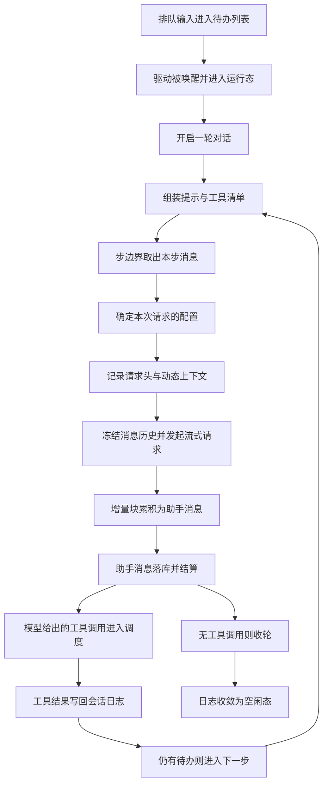

# Harness 运行时内核 · 函数级深度展开

> 分析对象:[deepseek-ai/deepseek-harness](https://github.com/deepseek-ai/deepseek-harness) @ `dbbaa4a37`

---

## 这一层在解决什么问题

`ReactLoopAgent` 是"一次 agent 运行"的全部内核:输入从外面进来落进一条可重放的待办列表,主循环把它切成一轮轮对话与一步步模型调用,每步把会话日志推导成一次请求发出去,把流式回来的内容边收边落库,再决定是继续、收轮还是被取消。它不解释工具怎么执行、不解释提示怎么拼、不解释子 agent 怎么派生——那些各有自己的接缝;这里跟到的是"调用它们的那一跳"以及这一跳两侧的状态归属。

把这几件事放在同一层读,是因为它们共享一组硬约束:模型可见的东西必须能从会话日志重建,取消必须能穿透到正在跑的 LLM 与工具调用,处置必须等到最后一个写日志的人停下。下面所有篇目都是这三条约束在不同代码路径上的落点。

## 一次 turn 的函数级调用栈

一条 followup 输入从进来到日志收敛,中间只经过"驱动被唤醒 → 开启一轮 → 若干步 → 收轮 → 回到空闲"这几件事;每一步内部再做"取消息 → 备请求 → 流式收内容 → 落助手消息 → 交给工具调度"。


<details><summary>Mermaid 源码</summary>



</details>

| 阶段 | 做了什么 | 关键调用(文件:行) |
|---|---|---|
| 排队与唤醒 | 输入按边界落进待办列表并落一条 splice 事件;唤醒时把驱动相位从空闲切成运行态并预留取消控制器 | `agent.ts:128`、`agent.ts:133`、`agent.ts:187`、`agent.ts:200` |
| 启动驱动 | 驱动体在属主作用域内运行,失败与取消都在这一层被收容 | `agent.ts:207`、`agent.ts:225` |
| 开启一轮 | 先落 `turn/start` 再进入步循环,轮号在相位上累加 | `agent.ts:269`、`agent.ts:278` |
| 步边界取消息 | 一次取走全部 next-step 输入,首个步边界再取一条排队轮;随后组装提示、投影动态上下文、跑 `agent/pre-step` 瀑布 | `agent.ts:240`、`agent.ts:244`、`agent.ts:245`、`agent.ts:249` |
| 开启一步 | 落 `step/start`,记下步号,步内的任何失败都保证走到 `step/end` | `agent.ts:302`、`agent.ts:312` |
| 备请求 | 折叠持久化配置、跑 `agent/request` 瀑布、绑定适配器 | `agent.ts:501`、`agent.ts:530`、`agent.ts:541` |
| 提示与用户消息落库 | 把渲染后的提示与本次步接受的用户消息按顺序写进日志 | `agent.ts:364`、`agent.ts:375` |
| 冻结请求 | 记录 `request/header` 与 `request/context`,深冻结消息并拼出请求 | `agent.ts:553`、`agent.ts:571`、`agent.ts:603` |
| 流式与结算 | 起一次尝试、逐块累积、按终态分别结算成助手消息或尝试记录 | `agent.ts:380`、`agent.ts:392`、`agent.ts:396`、`agent.ts:474` |
| 交给工具调度 | 从助手消息里筛出工具调用,按并发模式分组执行,结果按模型序写回 | `agent.ts:486`、`agent.ts:488`、[`tool-calls.ts:60`](https://github.com/deepseek-ai/deepseek-harness/blob/dbbaa4a37fb9098aba814c97d2956f7b2f105f46/packages/core/agent-loop/src/tool-calls.ts#L60) |
| 收轮 | 待办列表空了就跑 `agent/turn-stopping`,再落 `turn/end` | [`agent.ts:316`](https://github.com/deepseek-ai/deepseek-harness/blob/dbbaa4a37fb9098aba814c97d2956f7b2f105f46/packages/core/agent-loop/src/agent.ts#L316)、[`agent.ts:339`](https://github.com/deepseek-ai/deepseek-harness/blob/dbbaa4a37fb9098aba814c97d2956f7b2f105f46/packages/core/agent-loop/src/agent.ts#L339) |
| 回归空闲 | 相位切回空闲,若期间有新唤醒且待办非空则立刻再起一个驱动 | [`agent.ts:234`](https://github.com/deepseek-ai/deepseek-harness/blob/dbbaa4a37fb9098aba814c97d2956f7b2f105f46/packages/core/agent-loop/src/agent.ts#L234)、[`agent.ts:235`](https://github.com/deepseek-ai/deepseek-harness/blob/dbbaa4a37fb9098aba814c97d2956f7b2f105f46/packages/core/agent-loop/src/agent.ts#L235) |

<details><summary>完整调用树</summary>

```text
ctx.agents.create() / resume()                             index.ts:765 / :844
└─ AgentLoop.prepare() → publish('startup')                index.ts:530 / :662
   └─ emitAgentEvent('agent/session-start')                index.ts:675
      └─ agent.followup(msg)                               agent.ts:137
         └─ send(msg, 'next-turn', true)                   agent.ts:128
            ├─ inbox.splice('next-turn', …, [msg])         agent.ts:133 → inbox.ts:169
            └─ wakeDriver()                                agent.ts:187
               ├─ setPhase({kind:'running', …})            agent.ts:200
               └─ agents.withInitiator(this, kick())       agent.ts:207
                  └─ kick()                                agent.ts:225
                     └─ while (await this.turn()) {}       agent.ts:227
                        └─ turn()                          agent.ts:269
                           ├─ session.append('turn/start') agent.ts:278
                           └─ while(true)                  agent.ts:286
                              ├─ preStep(target, pos)      agent.ts:240
                              │  ├─ inbox.claim()          agent.ts:244 → inbox.ts:111
                              │  ├─ systemPrompt.assemble()agent.ts:245
                              │  ├─ runtimeContext.project()agent.ts:248
                              │  └─ waterfall 'agent/pre-step' agent.ts:249
                              ├─ session.append('step/start') agent.ts:302
                              ├─ step(decision)            agent.ts:352
                              │  ├─ prepareRequest()       agent.ts:501
                              │  ├─ systemPrompt.project() agent.ts:364
                              │  ├─ append 'user/message'  agent.ts:375
                              │  ├─ buildRequest()         agent.ts:553
                              │  ├─ llm.stream(request)    agent.ts:390
                              │  ├─ live.push(chunk)       agent.ts:396
                              │  ├─ live.settle('assistant/message') agent.ts:474
                              │  └─ executeToolCalls()     agent.ts:488 → tool-calls.ts:60
                              ├─ session.append('step/end')agent.ts:312
                              ├─ serial 'agent/turn-stopping' agent.ts:316
                              └─ session.append('turn/end', {reason}) agent.ts:339
```

</details>

---

## 篇目导读

| 文件 | 主题 | 核心源码 | 一句话 |
|---|---|---|---|
| [01-loop-skeleton.md](./01-loop-skeleton.md) | 主循环骨架:相位机、轮与步的嵌套、驱动退出 | [`packages/core/agent-loop/src/agent.ts:41-350`](https://github.com/deepseek-ai/deepseek-harness/blob/dbbaa4a37fb9098aba814c97d2956f7b2f105f46/packages/core/agent-loop/src/agent.ts#L41-L350) | 相位只有空闲/运行/维护三态,`kick` 是驱动体、`turn` 是轮、`step` 是步;轮内循环由"本步结束后待办是否为空"决定是否再来一步 |
| [02-inbox-and-input.md](./02-inbox-and-input.md) | 输入与步边界:claim/splice/唤醒闩锁 | [`packages/core/agent-loop/src/inbox.ts`](https://github.com/deepseek-ai/deepseek-harness/blob/dbbaa4a37fb9098aba814c97d2956f7b2f105f46/packages/core/agent-loop/src/inbox.ts)、[`agent.ts:128-208`](https://github.com/deepseek-ai/deepseek-harness/blob/dbbaa4a37fb9098aba814c97d2956f7b2f105f46/packages/core/agent-loop/src/agent.ts#L128-L208) | 待办列表不是内存队列而是日志投影,每次改动落一条 splice 事件;唤醒在维护中或活动已中止时被闩住,等收敛后重放 |
| [03-one-model-request.md](./03-one-model-request.md) | 一次模型请求:备配置、记请求头、冻结消息 | [`packages/core/agent-loop/src/agent.ts:501-618`](https://github.com/deepseek-ai/deepseek-harness/blob/dbbaa4a37fb9098aba814c97d2956f7b2f105f46/packages/core/agent-loop/src/agent.ts#L501-L618) | 配置先在 `agent/request` 里被改写再交给适配器绑定,请求头按 initial/resume/change/series 四种理由记账,消息深冻结后与取消信号一起发出去 |
| [04-assistant-stream.md](./04-assistant-stream.md) | 助手流累积与两种结算 | [`packages/core/agent-loop/src/assistant-stream.ts`](https://github.com/deepseek-ai/deepseek-harness/blob/dbbaa4a37fb9098aba814c97d2956f7b2f105f46/packages/core/agent-loop/src/assistant-stream.ts)、[`agent.ts:380-497`](https://github.com/deepseek-ai/deepseek-harness/blob/dbbaa4a37fb9098aba814c97d2956f7b2f105f46/packages/core/agent-loop/src/agent.ts#L380-L497) | 一次尝试同时喂三处:紧凑流用于落库、组装器用于产消息与用量、瞬时帧用于 UI;成功落 `assistant/message`,失败或被取消落 `assistant/attempt` |
| [05-cancel-and-teardown.md](./05-cancel-and-teardown.md) | 取消、独占维护、空闲等待与处置顺序 | [`agent.ts:149-238`](https://github.com/deepseek-ai/deepseek-harness/blob/dbbaa4a37fb9098aba814c97d2956f7b2f105f46/packages/core/agent-loop/src/agent.ts#L149-L238)、[`index.ts:576-687`](https://github.com/deepseek-ai/deepseek-harness/blob/dbbaa4a37fb9098aba814c97d2956f7b2f105f46/packages/core/agent-loop/src/index.ts#L576-L687) | 取消清空待办并中止当前活动,处置则是一次带 disposed 原因的取消加一次静默等待,再依次关会话写句柄、退注册表、拆作用域 |
| [06-invariants-and-guards.md](./06-invariants-and-guards.md) | 运行期不变量与守卫挂点 | [`packages/core/agent-loop/src/invariant.ts`](https://github.com/deepseek-ai/deepseek-harness/blob/dbbaa4a37fb9098aba814c97d2956f7b2f105f46/packages/core/agent-loop/src/invariant.ts)、`packages/guard/*` | 每次发给模型的请求都要能由会话日志重建,重建不一致就抛 `INVARIANT`;守卫插件挂在步边界、执行前后与停工边界上做提醒、限时与强制续跑 |
| [07-events-and-lifecycle-hooks.md](./07-events-and-lifecycle-hooks.md) | `agent/*` 事件清单与消费方 | [`packages/core/agent/src/runtime-types.ts:245-404`](https://github.com/deepseek-ai/deepseek-harness/blob/dbbaa4a37fb9098aba814c97d2956f7b2f105f46/packages/core/agent/src/runtime-types.ts#L245-L404)、[`dispatch.ts`](https://github.com/deepseek-ai/deepseek-harness/blob/dbbaa4a37fb9098aba814c97d2956f7b2f105f46/packages/core/agent/src/dispatch.ts) | 事件按"通知 / 串行 / 瀑布"三种语义分发,派发器把作用域载体与载荷里的 agent 绑成同一个值,所以监听器不会串到别的 agent 上 |

推荐阅读顺序:01 → 02 → 03 → 04 → 05(主线),06、07 为两条横切支线。

---

## 与相邻模块和章节的关系

工具怎么被审批、怎么并发、怎么超时,由 [`tool-call/`](../tool-call/README.md) 展开;主循环在这里的职责只有两处:把筛选出的调用交给 `executeToolCalls`,以及把执行结果带回的随附上下文塞进下一步的待办列表([`agent.ts:490`](https://github.com/deepseek-ai/deepseek-harness/blob/dbbaa4a37fb9098aba814c97d2956f7b2f105f46/packages/core/agent-loop/src/agent.ts#L490))。

Agent 的注册、派生、父子归属与预设组合由 [`multi-agent/`](../multi-agent/README.md) 展开;本目录里出现的只是 `AgentLoop` 如何把一个构造好的 agent 交给注册表并对外发布([`index.ts:662-677`](https://github.com/deepseek-ai/deepseek-harness/blob/dbbaa4a37fb9098aba814c97d2956f7b2f105f46/packages/core/agent-loop/src/index.ts#L662-L677))。

提示的拼装瀑布与工具排序在[第九章](../09-prompt.md);主循环在这里调用 `systemPrompt.assemble()` 一次、把结果渲染后交给 `SystemPromptProjection.project()` 决定它落在哪个 surface 节点上([`agent.ts:245`](https://github.com/deepseek-ai/deepseek-harness/blob/dbbaa4a37fb9098aba814c97d2956f7b2f105f46/packages/core/agent-loop/src/agent.ts#L245)、[`agent.ts:364`](https://github.com/deepseek-ai/deepseek-harness/blob/dbbaa4a37fb9098aba814c97d2956f7b2f105f46/packages/core/agent-loop/src/agent.ts#L364)、[`runtime-context.ts:83`](https://github.com/deepseek-ai/deepseek-harness/blob/dbbaa4a37fb9098aba814c97d2956f7b2f105f46/packages/core/agent-loop/src/runtime-context.ts#L83))。动态上下文的四层来源与 token 计量在[第八章](../08-context.md),循环侧只负责按步投影出快照([`runtime-context.ts:147`](https://github.com/deepseek-ai/deepseek-harness/blob/dbbaa4a37fb9098aba814c97d2956f7b2f105f46/packages/core/agent-loop/src/runtime-context.ts#L147))。

会话日志的物理格式、世代文件与恢复链在[第三章](../03-session-memory.md)与[第十一章](../11-persistence.md);这一层关心的是日志的**写入口**:`turn/start`、`step/start`、`user/message`、`request/header`、`assistant/message`、`tool/result`、`turn/end` 各自由谁在什么时机追加,以及处置时写句柄的关闭顺序([`index.ts:604`](https://github.com/deepseek-ai/deepseek-harness/blob/dbbaa4a37fb9098aba814c97d2956f7b2f105f46/packages/core/agent-loop/src/index.ts#L604))。

Hooks、ACP、Web/Desktop 与双 SDK 如何消费 `agent/*` 事件,见[第十三章](../13-extensions-ecosystem.md);第七篇给出这些事件在循环里的确切触发点。

---

## 关键文件

| 文件 | 行数 | 本目录用到的核心符号 |
|---|---|---|
| [`packages/core/agent-loop/src/agent.ts`](https://github.com/deepseek-ai/deepseek-harness/blob/dbbaa4a37fb9098aba814c97d2956f7b2f105f46/packages/core/agent-loop/src/agent.ts) | 619 | `Phase`([`:41`](https://github.com/deepseek-ai/deepseek-harness/blob/dbbaa4a37fb9098aba814c97d2956f7b2f105f46/packages/core/agent-loop/src/agent.ts#L41))、`ReactLoopAgent`([`:72`](https://github.com/deepseek-ai/deepseek-harness/blob/dbbaa4a37fb9098aba814c97d2956f7b2f105f46/packages/core/agent-loop/src/agent.ts#L72))、`setPhase`([`:119`](https://github.com/deepseek-ai/deepseek-harness/blob/dbbaa4a37fb9098aba814c97d2956f7b2f105f46/packages/core/agent-loop/src/agent.ts#L119))、`send`([`:128`](https://github.com/deepseek-ai/deepseek-harness/blob/dbbaa4a37fb9098aba814c97d2956f7b2f105f46/packages/core/agent-loop/src/agent.ts#L128))、`cancel`([`:149`](https://github.com/deepseek-ai/deepseek-harness/blob/dbbaa4a37fb9098aba814c97d2956f7b2f105f46/packages/core/agent-loop/src/agent.ts#L149))、`runMaintenance`([`:157`](https://github.com/deepseek-ai/deepseek-harness/blob/dbbaa4a37fb9098aba814c97d2956f7b2f105f46/packages/core/agent-loop/src/agent.ts#L157))、`wakeDriver`([`:187`](https://github.com/deepseek-ai/deepseek-harness/blob/dbbaa4a37fb9098aba814c97d2956f7b2f105f46/packages/core/agent-loop/src/agent.ts#L187))、`whenIdle`([`:210`](https://github.com/deepseek-ai/deepseek-harness/blob/dbbaa4a37fb9098aba814c97d2956f7b2f105f46/packages/core/agent-loop/src/agent.ts#L210))、`kick`([`:225`](https://github.com/deepseek-ai/deepseek-harness/blob/dbbaa4a37fb9098aba814c97d2956f7b2f105f46/packages/core/agent-loop/src/agent.ts#L225))、`preStep`([`:240`](https://github.com/deepseek-ai/deepseek-harness/blob/dbbaa4a37fb9098aba814c97d2956f7b2f105f46/packages/core/agent-loop/src/agent.ts#L240))、`turn`([`:269`](https://github.com/deepseek-ai/deepseek-harness/blob/dbbaa4a37fb9098aba814c97d2956f7b2f105f46/packages/core/agent-loop/src/agent.ts#L269))、`step`([`:352`](https://github.com/deepseek-ai/deepseek-harness/blob/dbbaa4a37fb9098aba814c97d2956f7b2f105f46/packages/core/agent-loop/src/agent.ts#L352))、`prepareRequest`([`:501`](https://github.com/deepseek-ai/deepseek-harness/blob/dbbaa4a37fb9098aba814c97d2956f7b2f105f46/packages/core/agent-loop/src/agent.ts#L501))、`buildRequest`([`:553`](https://github.com/deepseek-ai/deepseek-harness/blob/dbbaa4a37fb9098aba814c97d2956f7b2f105f46/packages/core/agent-loop/src/agent.ts#L553)) |
| [`packages/core/agent-loop/src/inbox.ts`](https://github.com/deepseek-ai/deepseek-harness/blob/dbbaa4a37fb9098aba814c97d2956f7b2f105f46/packages/core/agent-loop/src/inbox.ts) | 247 | `inboxProjectionDefinition`([`:27`](https://github.com/deepseek-ai/deepseek-harness/blob/dbbaa4a37fb9098aba814c97d2956f7b2f105f46/packages/core/agent-loop/src/inbox.ts#L27))、`ReactLoopInbox`([`:74`](https://github.com/deepseek-ai/deepseek-harness/blob/dbbaa4a37fb9098aba814c97d2956f7b2f105f46/packages/core/agent-loop/src/inbox.ts#L74))、`hasPending`([`:94`](https://github.com/deepseek-ai/deepseek-harness/blob/dbbaa4a37fb9098aba814c97d2956f7b2f105f46/packages/core/agent-loop/src/inbox.ts#L94))、`claim`([`:111`](https://github.com/deepseek-ai/deepseek-harness/blob/dbbaa4a37fb9098aba814c97d2956f7b2f105f46/packages/core/agent-loop/src/inbox.ts#L111))、`splice`([`:169`](https://github.com/deepseek-ai/deepseek-harness/blob/dbbaa4a37fb9098aba814c97d2956f7b2f105f46/packages/core/agent-loop/src/inbox.ts#L169))、`mutate`([`:201`](https://github.com/deepseek-ai/deepseek-harness/blob/dbbaa4a37fb9098aba814c97d2956f7b2f105f46/packages/core/agent-loop/src/inbox.ts#L201)) |
| [`packages/core/agent-loop/src/assistant-stream.ts`](https://github.com/deepseek-ai/deepseek-harness/blob/dbbaa4a37fb9098aba814c97d2956f7b2f105f46/packages/core/agent-loop/src/assistant-stream.ts) | 140 | `AssistantStreamAttempt`([`:18`](https://github.com/deepseek-ai/deepseek-harness/blob/dbbaa4a37fb9098aba814c97d2956f7b2f105f46/packages/core/agent-loop/src/assistant-stream.ts#L18))、`start`([`:49`](https://github.com/deepseek-ai/deepseek-harness/blob/dbbaa4a37fb9098aba814c97d2956f7b2f105f46/packages/core/agent-loop/src/assistant-stream.ts#L49))、`push`([`:60`](https://github.com/deepseek-ai/deepseek-harness/blob/dbbaa4a37fb9098aba814c97d2956f7b2f105f46/packages/core/agent-loop/src/assistant-stream.ts#L60))、`settle`([`:78`](https://github.com/deepseek-ai/deepseek-harness/blob/dbbaa4a37fb9098aba814c97d2956f7b2f105f46/packages/core/agent-loop/src/assistant-stream.ts#L78))、`abandon`([`:100`](https://github.com/deepseek-ai/deepseek-harness/blob/dbbaa4a37fb9098aba814c97d2956f7b2f105f46/packages/core/agent-loop/src/assistant-stream.ts#L100))、`interruptedBlocks`([`:122`](https://github.com/deepseek-ai/deepseek-harness/blob/dbbaa4a37fb9098aba814c97d2956f7b2f105f46/packages/core/agent-loop/src/assistant-stream.ts#L122))、`finish`([`:132`](https://github.com/deepseek-ai/deepseek-harness/blob/dbbaa4a37fb9098aba814c97d2956f7b2f105f46/packages/core/agent-loop/src/assistant-stream.ts#L132)) |
| [`packages/core/agent-loop/src/runtime-context.ts`](https://github.com/deepseek-ai/deepseek-harness/blob/dbbaa4a37fb9098aba814c97d2956f7b2f105f46/packages/core/agent-loop/src/runtime-context.ts) | 159 | `SystemPromptProjection`([`:60`](https://github.com/deepseek-ai/deepseek-harness/blob/dbbaa4a37fb9098aba814c97d2956f7b2f105f46/packages/core/agent-loop/src/runtime-context.ts#L60))、`project`([`:83`](https://github.com/deepseek-ai/deepseek-harness/blob/dbbaa4a37fb9098aba814c97d2956f7b2f105f46/packages/core/agent-loop/src/runtime-context.ts#L83))、`RuntimeContextProjection`([`:109`](https://github.com/deepseek-ai/deepseek-harness/blob/dbbaa4a37fb9098aba814c97d2956f7b2f105f46/packages/core/agent-loop/src/runtime-context.ts#L109))、`project`([`:147`](https://github.com/deepseek-ai/deepseek-harness/blob/dbbaa4a37fb9098aba814c97d2956f7b2f105f46/packages/core/agent-loop/src/runtime-context.ts#L147)) |
| [`packages/core/agent-loop/src/tool-calls.ts`](https://github.com/deepseek-ai/deepseek-harness/blob/dbbaa4a37fb9098aba814c97d2956f7b2f105f46/packages/core/agent-loop/src/tool-calls.ts) | 290 | `executeToolCalls`([`:60`](https://github.com/deepseek-ai/deepseek-harness/blob/dbbaa4a37fb9098aba814c97d2956f7b2f105f46/packages/core/agent-loop/src/tool-calls.ts#L60))、`runGroup`([`:122`](https://github.com/deepseek-ai/deepseek-harness/blob/dbbaa4a37fb9098aba814c97d2956f7b2f105f46/packages/core/agent-loop/src/tool-calls.ts#L122))、`commitReady`([`:147`](https://github.com/deepseek-ai/deepseek-harness/blob/dbbaa4a37fb9098aba814c97d2956f7b2f105f46/packages/core/agent-loop/src/tool-calls.ts#L147))、`fillPool`([`:199`](https://github.com/deepseek-ai/deepseek-harness/blob/dbbaa4a37fb9098aba814c97d2956f7b2f105f46/packages/core/agent-loop/src/tool-calls.ts#L199)) |
| [`packages/core/agent-loop/src/invariant.ts`](https://github.com/deepseek-ai/deepseek-harness/blob/dbbaa4a37fb9098aba814c97d2956f7b2f105f46/packages/core/agent-loop/src/invariant.ts) | 65 | `install`([`:19`](https://github.com/deepseek-ai/deepseek-harness/blob/dbbaa4a37fb9098aba814c97d2956f7b2f105f46/packages/core/agent-loop/src/invariant.ts#L19))、`apply`([`:64`](https://github.com/deepseek-ai/deepseek-harness/blob/dbbaa4a37fb9098aba814c97d2956f7b2f105f46/packages/core/agent-loop/src/invariant.ts#L64)) |
| [`packages/core/agent-loop/src/index.ts`](https://github.com/deepseek-ai/deepseek-harness/blob/dbbaa4a37fb9098aba814c97d2956f7b2f105f46/packages/core/agent-loop/src/index.ts) | 930 | `AgentLoop`([`:359`](https://github.com/deepseek-ai/deepseek-harness/blob/dbbaa4a37fb9098aba814c97d2956f7b2f105f46/packages/core/agent-loop/src/index.ts#L359))、`prepare`([`:530`](https://github.com/deepseek-ai/deepseek-harness/blob/dbbaa4a37fb9098aba814c97d2956f7b2f105f46/packages/core/agent-loop/src/index.ts#L530))、`publish`([`:662`](https://github.com/deepseek-ai/deepseek-harness/blob/dbbaa4a37fb9098aba814c97d2956f7b2f105f46/packages/core/agent-loop/src/index.ts#L662))、`create`([`:699`](https://github.com/deepseek-ai/deepseek-harness/blob/dbbaa4a37fb9098aba814c97d2956f7b2f105f46/packages/core/agent-loop/src/index.ts#L699))、`createAgent`([`:765`](https://github.com/deepseek-ai/deepseek-harness/blob/dbbaa4a37fb9098aba814c97d2956f7b2f105f46/packages/core/agent-loop/src/index.ts#L765))、`resumeWith`([`:853`](https://github.com/deepseek-ai/deepseek-harness/blob/dbbaa4a37fb9098aba814c97d2956f7b2f105f46/packages/core/agent-loop/src/index.ts#L853)) |
| [`packages/core/agent/src/runtime-types.ts`](https://github.com/deepseek-ai/deepseek-harness/blob/dbbaa4a37fb9098aba814c97d2956f7b2f105f46/packages/core/agent/src/runtime-types.ts) | 405 | `AgentOptions`([`:26`](https://github.com/deepseek-ai/deepseek-harness/blob/dbbaa4a37fb9098aba814c97d2956f7b2f105f46/packages/core/agent/src/runtime-types.ts#L26))、`CancelOptions`([`:38`](https://github.com/deepseek-ai/deepseek-harness/blob/dbbaa4a37fb9098aba814c97d2956f7b2f105f46/packages/core/agent/src/runtime-types.ts#L38))、`Inbox`([`:48`](https://github.com/deepseek-ai/deepseek-harness/blob/dbbaa4a37fb9098aba814c97d2956f7b2f105f46/packages/core/agent/src/runtime-types.ts#L48))、`AgentStatus`([`:109`](https://github.com/deepseek-ai/deepseek-harness/blob/dbbaa4a37fb9098aba814c97d2956f7b2f105f46/packages/core/agent/src/runtime-types.ts#L109))、`PreStepDecision`([`:112`](https://github.com/deepseek-ai/deepseek-harness/blob/dbbaa4a37fb9098aba814c97d2956f7b2f105f46/packages/core/agent/src/runtime-types.ts#L112))、`AssistantStreamFrame`([`:128`](https://github.com/deepseek-ai/deepseek-harness/blob/dbbaa4a37fb9098aba814c97d2956f7b2f105f46/packages/core/agent/src/runtime-types.ts#L128))、`agent/pre-step`([`:330`](https://github.com/deepseek-ai/deepseek-harness/blob/dbbaa4a37fb9098aba814c97d2956f7b2f105f46/packages/core/agent/src/runtime-types.ts#L330))、`agent/turn-stopping`([`:391`](https://github.com/deepseek-ai/deepseek-harness/blob/dbbaa4a37fb9098aba814c97d2956f7b2f105f46/packages/core/agent/src/runtime-types.ts#L391)) |
| [`packages/core/agent/src/dispatch.ts`](https://github.com/deepseek-ai/deepseek-harness/blob/dbbaa4a37fb9098aba814c97d2956f7b2f105f46/packages/core/agent/src/dispatch.ts) | 176 | `AgentEventDispatch`([`:54`](https://github.com/deepseek-ai/deepseek-harness/blob/dbbaa4a37fb9098aba814c97d2956f7b2f105f46/packages/core/agent/src/dispatch.ts#L54))、`agentCarrier`([`:94`](https://github.com/deepseek-ai/deepseek-harness/blob/dbbaa4a37fb9098aba814c97d2956f7b2f105f46/packages/core/agent/src/dispatch.ts#L94))、`agentEvents`([`:107`](https://github.com/deepseek-ai/deepseek-harness/blob/dbbaa4a37fb9098aba814c97d2956f7b2f105f46/packages/core/agent/src/dispatch.ts#L107))、`emitAgentEvent`([`:158`](https://github.com/deepseek-ai/deepseek-harness/blob/dbbaa4a37fb9098aba814c97d2956f7b2f105f46/packages/core/agent/src/dispatch.ts#L158)) |
| [`packages/core/agent/src/consumed-work.ts`](https://github.com/deepseek-ai/deepseek-harness/blob/dbbaa4a37fb9098aba814c97d2956f7b2f105f46/packages/core/agent/src/consumed-work.ts) | 108 | `ConsumedWork`([`:18`](https://github.com/deepseek-ai/deepseek-harness/blob/dbbaa4a37fb9098aba814c97d2956f7b2f105f46/packages/core/agent/src/consumed-work.ts#L18))、`accountsForClaim`([`:42`](https://github.com/deepseek-ai/deepseek-harness/blob/dbbaa4a37fb9098aba814c97d2956f7b2f105f46/packages/core/agent/src/consumed-work.ts#L42))、`foldConsumedWork`([`:68`](https://github.com/deepseek-ai/deepseek-harness/blob/dbbaa4a37fb9098aba814c97d2956f7b2f105f46/packages/core/agent/src/consumed-work.ts#L68)) |
| [`packages/core/session/src/request-header.ts`](https://github.com/deepseek-ai/deepseek-harness/blob/dbbaa4a37fb9098aba814c97d2956f7b2f105f46/packages/core/session/src/request-header.ts) | 69 | `canonicalHeader`([`:21`](https://github.com/deepseek-ai/deepseek-harness/blob/dbbaa4a37fb9098aba814c97d2956f7b2f105f46/packages/core/session/src/request-header.ts#L21))、`headerEquals`([`:43`](https://github.com/deepseek-ai/deepseek-harness/blob/dbbaa4a37fb9098aba814c97d2956f7b2f105f46/packages/core/session/src/request-header.ts#L43))、`foldRequestHeader`([`:63`](https://github.com/deepseek-ai/deepseek-harness/blob/dbbaa4a37fb9098aba814c97d2956f7b2f105f46/packages/core/session/src/request-header.ts#L63)) |
| [`packages/core/session/src/types.ts`](https://github.com/deepseek-ai/deepseek-harness/blob/dbbaa4a37fb9098aba814c97d2956f7b2f105f46/packages/core/session/src/types.ts) | 495 | `AgentCancelCause`([`:188`](https://github.com/deepseek-ai/deepseek-harness/blob/dbbaa4a37fb9098aba814c97d2956f7b2f105f46/packages/core/session/src/types.ts#L188))、`TurnEndReasonMap`([`:200`](https://github.com/deepseek-ai/deepseek-harness/blob/dbbaa4a37fb9098aba814c97d2956f7b2f105f46/packages/core/session/src/types.ts#L200))、`assistant/message`([`:321`](https://github.com/deepseek-ai/deepseek-harness/blob/dbbaa4a37fb9098aba814c97d2956f7b2f105f46/packages/core/session/src/types.ts#L321))、`assistant/attempt`([`:335`](https://github.com/deepseek-ai/deepseek-harness/blob/dbbaa4a37fb9098aba814c97d2956f7b2f105f46/packages/core/session/src/types.ts#L335)) |
| [`packages/guard/repeat-tool-reminder/src/index.ts`](https://github.com/deepseek-ai/deepseek-harness/blob/dbbaa4a37fb9098aba814c97d2956f7b2f105f46/packages/guard/repeat-tool-reminder/src/index.ts) | 233 | `apply`([`:162`](https://github.com/deepseek-ai/deepseek-harness/blob/dbbaa4a37fb9098aba814c97d2956f7b2f105f46/packages/guard/repeat-tool-reminder/src/index.ts#L162))、`observe`([`:189`](https://github.com/deepseek-ai/deepseek-harness/blob/dbbaa4a37fb9098aba814c97d2956f7b2f105f46/packages/guard/repeat-tool-reminder/src/index.ts#L189))、`tools/post-execute`([`:213`](https://github.com/deepseek-ai/deepseek-harness/blob/dbbaa4a37fb9098aba814c97d2956f7b2f105f46/packages/guard/repeat-tool-reminder/src/index.ts#L213))、`agent/pre-step`([`:229`](https://github.com/deepseek-ai/deepseek-harness/blob/dbbaa4a37fb9098aba814c97d2956f7b2f105f46/packages/guard/repeat-tool-reminder/src/index.ts#L229)) |
| [`packages/guard/timeout-policy/src/index.ts`](https://github.com/deepseek-ai/deepseek-harness/blob/dbbaa4a37fb9098aba814c97d2956f7b2f105f46/packages/guard/timeout-policy/src/index.ts) | 81 | `TOOL_TIMEOUT`([`:25`](https://github.com/deepseek-ai/deepseek-harness/blob/dbbaa4a37fb9098aba814c97d2956f7b2f105f46/packages/guard/timeout-policy/src/index.ts#L25))、`toolTimeoutResult`([`:41`](https://github.com/deepseek-ai/deepseek-harness/blob/dbbaa4a37fb9098aba814c97d2956f7b2f105f46/packages/guard/timeout-policy/src/index.ts#L41))、`apply`([`:55`](https://github.com/deepseek-ai/deepseek-harness/blob/dbbaa4a37fb9098aba814c97d2956f7b2f105f46/packages/guard/timeout-policy/src/index.ts#L55)) |
