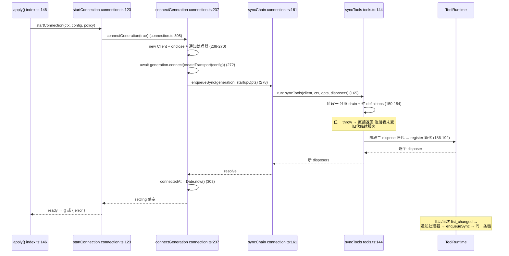

# 01 · 发现与同步:`syncTools()` 逐行走查

> 源码:`packages/mcp/mcp-client/src/tools.ts:144-203`(主体)、`connection.ts:155-270`(串行化与通知)
> 上游契约:第六章 [§1.4](../06-mcp.md) 只给了伪代码骨架,本文落到每一行

---

## 一、函数契约

`syncTools` 是**唯一的工具定义产出点**,签名与返回语义如下(`tools.ts:136-149`):

```typescript
export async function syncTools(
  client: Client,
  ctx: Context,
  opts: ToolBridgeOptions,
  previous: ToolDisposers,
): Promise<ToolDisposers>
```

| 参数 | 类型 | 语义 |
|---|---|---|
| `client` | `Client` | **当前代际**已连接的 MCP 客户端;executor 闭包持有它 |
| `ctx` | `Context` | 提供 `ctx.tools.register()` 与 `ctx.logger` |
| `opts` | `ToolBridgeOptions` | `{ registrationFailure, serverName, toolCallTimeoutMs }`(`tools.ts:30-35`) |
| `previous` | `Map<string, () => void>` | 上一代的注销器表;**只在阶段一成功后才被 dispose** |
| 返回值 | 新的注销器表 | "本次同步拥有的全部活动注册",失败回滚时返回空 Map |

`ToolBridgeOptions.registrationFailure` 的注释就是这条契约的原文(`tools.ts:31`):

```typescript
/** Whether a registry conflict is contained or rejects this synchronization. */
registrationFailure: 'contain' | 'throw'
```

---

## 二、阶段一:fetch(不触碰注册表)

### 2.1 分页 drain:`listToolsUncached`

`tools.ts:72-78`:

```typescript
/** List without mutating the SDK's per-page output-validator cache. */
function listToolsUncached(client: Client, cursor?: string) {
  return client.request(
    { method: 'tools/list', ...cursor === undefined ? {} : { params: { cursor } } },
    ListToolsResultSchema,
  )
}
```

三个不复用 SDK 便捷方法的理由,逐一落地:

1. **`cursor === undefined` 时整个 `params` 键都不出现**——不是 `params: { cursor: undefined }`。SDK 的 `listTools()` 会替调用方决定 `params` 的构造方式,桥选择自己掌握首屏请求的 JSON 形态。
2. **输出校验权自有**:走 `client.request(..., ListToolsResultSchema)` 而不是 `client.listTools()`;`callToolUncached`(`tools.ts:81-96`)对应地使用 `RawCallToolResultSchema = z.record(z.string(), z.unknown())`(`tools.ts:59`),注释写明理由是"SDK 可能用桥不支持的模式预校验"。
3. **不写 SDK 的按页校验器缓存**:SDK 的便捷方法会在 `tools/list` 后登记按页 output-schema,桥侧的同步可能因此继承一个与自身契约无关的缓存状态。

### 2.2 循环结构与两类非法列表检测

`tools.ts:150-184` 完整走查:

```typescript
// Phase 1: fetch and build the next generation without touching the registry.
const definitions = new Map<string, ToolDefinition>()
const seenCursors = new Set<string>()
let cursor: string | undefined
do {
  const response = await listToolsUncached(client, cursor)
  for (const tool of response.tools) {
    const publicName = publicToolName(opts.serverName, tool.name)
    if (definitions.has(publicName)) {
      throw new Error(
        `mcp-client(${opts.serverName}): server listed tool "${tool.name}" more than once — invalid tool list`,
      )
    }
    definitions.set(publicName, createDefinition(
      client,
      ctx,
      publicName,
      tool.name,
      tool.description ?? '',
      tool.inputSchema,
      supportedOutputSchema(tool.outputSchema),
      tool.execution?.taskSupport === 'required',
      opts,
    ))
  }
  cursor = response.nextCursor
  if (cursor) {
    if (seenCursors.has(cursor)) {
      throw new Error(
        `mcp-client(${opts.serverName}): server repeated a tools/list continuation cursor — invalid tool list`,
      )
    }
    seenCursors.add(cursor)
  }
} while (cursor)
```

逐点说明:

| 行 | 行为 | 为什么这样写 |
|---|---|---|
| `151-152` | `definitions` 与 `seenCursors` 都是**本次同步的局部变量** | 代际之间零共享;`seenCursors` 的作用域恰是一次同步,所以"后续一次同步可以复用相同 cursor"不会被误伤 |
| `154` | `do { … } while (cursor)` 而非 `while` | 首屏请求不带 `cursor`,必须无条件发一次;`tools` 为空数组也是合法页 |
| `156-157` | 逐工具算 `publicName` 再判重 | **判重键是公开名而非 rawName**:判重与"注册表里会不会撞"用的是同一个键,不存在"rawName 不同但公开名相同"的漏网(该情形由 `publicToolName` 的哈希分支结构化地排除,见 [02](./02-naming-algorithm.md)) |
| `159-161` | 报错消息回传 `tool.name`(**原始名**)| 这是给排障人看的服务器侧事实;公开名是本地派生量,报它反而不好定位服务器 bug |
| `175-183` | `cursor` 非空才登记进 `seenCursors` | 空/未定义 cursor 表示分页结束,无需也无意义登记 |
| `176-182` | 发现已在历史中的 cursor 立即 throw | 空页无法靠工具名唯一性证明"有进展",必须显式记录 cursor 历史才能发现**跨页**的环(含 `cursor1 → cursor2 → cursor1` 这种多页环) |

> 官方注记对这一点的表述见 `.agents/notes/implemented/feature/2026-07-07-mcp-client-plugin.md:105`:该检测"能发现重复 cursor,但不约束一个持续返回**不同** cursor 的服务器"——这是显式写出的能力边界,不是遗漏。

### 2.3 `createDefinition()` 组装的字段

`tools.ts:254-282` 是唯一构造 `ToolDefinition` 的地方,9 个入参各有来源:

```typescript
function createDefinition(
  client: Client,
  ctx: Context,
  publicName: string,
  rawName: string,
  description: string,
  parameters: Record<string, unknown>,
  structuredSchema: JsonSchemaNode | undefined,
  taskRequired: boolean,
  opts: ToolBridgeOptions,
): ToolDefinition {
  const projections = new WeakMap<ToolExecution, PreparedProjection>()
  return {
    name: publicName,
    description,
    parameters,
    output: createOutput(rawName, structuredSchema),
    execute: createExecutor(client, ctx, rawName, taskRequired, opts, projections),
    finalizeContent(exec, result) { /* tools.ts:272-280 */ },
  }
}
```

| 字段 | 值来源 | 管线中的去向 |
|---|---|---|
| `name` | `publicToolName(serverName, tool.name)` `tools.ts:157` | `ToolRuntime` 注册键、`wireSchemas()` 送往模型的名字 |
| `description` | `tool.description ?? ''` `tools.ts:168` | 原样进模型请求;缺描述退化为空串(`mcp-client.spec.ts:1154-1162` 钉死) |
| `parameters` | `tool.inputSchema` **原文** | 不做 DSL 转换;"MCP JSON Schema 原样透传"是显式设计 |
| `output.schema` | `createOutput()` `tools.ts:285-301` | `structuredContent` 槽位用 `structuredSchema ?? {}` |
| `output.render` | 同上的纯同步函数 | 返回**单个** text 块,text = `extractText(content, rawName)` |
| `execute` | `createExecutor()` `tools.ts:313` | 闭包持有 `rawName`/`projections`/`opts` |
| `finalizeContent` | 内联闭包 `tools.ts:272` | 见 [03 §6](./03-execution-and-result-mapping.md) |

两处容易被忽略的字段细节:

1. **`output.required` 是条件式的**(`tools.ts:293`):

   ```typescript
   required: structuredSchema === undefined ? ['content'] : ['content', 'structuredContent'],
   ```

   服务器声明了**受支持**的 `outputSchema` 时,`structuredContent` 变成必填——这正是 `mcp-client.spec.ts:411-416` 里"missing structured content"被判 `INVALID_TOOL_OUTPUT` 的原因。服务器**没声明**或声明了不受支持的模式时,该字段不参与校验(`mcp-client.spec.ts:863-876`)。
2. **`additionalProperties: false`**(`tools.ts:294`)同时约束两个方向:多余的顶层键会被拒,`structuredContent` 缺失也会被拒。

### 2.4 `supportedOutputSchema()`:不支持的词汇降级

`tools.ts:230-239`:

```typescript
function supportedOutputSchema(candidate: unknown): JsonSchemaNode | undefined {
  if (candidate === undefined) return undefined
  try {
    assertSupportedJsonSchema(candidate)
    return candidate
  } catch {
    return undefined
  }
}
```

语义是"**能证明支持才保留,否则退回宽松**",而不是"不支持就拒绝工具"。降级后 `output.schema.properties.structuredContent` 变成 `{}`(任意 `JsonValue`),`required` 只剩 `['content']`。`mcp-client.spec.ts:863-876` 与 `:391-398` 分别用 `patternProperties` 词汇覆盖了单元与真实传输两条路径。

---

## 三、阶段二:swap(代际替换)

`tools.ts:186-202`:

```typescript
// Phase 2: swap generations.
for (const dispose of previous.values()) dispose()
const disposers: ToolDisposers = new Map()
try {
  for (const [publicName, definition] of definitions) {
    disposers.set(publicName, ctx.tools.register(definition))
  }
} catch (error) {
  // A conflict on an `mcp__<serverName>__`-qualified name means a foreign
  // registration occupies this server's namespace. Roll back so the model
  // sees either the full generation or none of it — never a partial set.
  for (const dispose of disposers.values()) dispose()
  ctx.logger.error(`mcp-client(${opts.serverName}): tool registration failed, no tools registered: ${String(error)}`)
  if (opts.registrationFailure === 'throw') throw error
  return new Map()
}
return disposers
```

顺序上有三件事必须按这个次序发生:

1. **先 dispose 旧代**(`187`)。放在 try 之外的用意是:阶段一已证明新代可取,此时释放旧代是安全的;而**若阶段一 throw,这一行根本不会执行**——这就是"fetch 失败保留旧代"的实现方式,不需要任何补偿代码。
2. **再逐个注册新代**(`190-192`),把返回的 disposer 存进新的 `disposers`。`ctx.tools.register()` 返回注销器(`core/tools/src/index.ts:1027`),符合仓库"注册即 effect"的约定。
3. **冲突时回滚整个半代**(`197`),然后按 `registrationFailure` 决定是吞下还是上抛。

冲突的来源被注释钉死为唯一可能(`tools.ts:194-196`):名字带 `mcp__<serverName>__` 前缀却注册失败,只可能是**外部注册抢占了本服务器的命名空间**。因此回滚后模型看到的工具数是 0 而不是"部分",这与"全有或全无"的名字契约一致。

`mcp-client.spec.ts:260-281` 是这个分支的直接证据:

```typescript
const disposers = await syncTools(client as never, ctx, defaultOpts, new Map())
// All-or-nothing: the non-conflicting tool is rolled back too.
expect(disposers.size).toBe(0)
expect(ctx.tools.get('mcp__srv__free')).toBeUndefined()
// The squatter is untouched.
expect(ctx.tools.get('mcp__srv__taken')).toBeDefined()
```

---

## 四、`registrationFailure: 'contain' | 'throw'` 的两个真实使用点

这个开关**不是给用户配的**,而是由 `startConnection` 在启动期构造两份 `ToolBridgeOptions`(`connection.ts:124-135`):

```typescript
const label = `mcp-client(${config.serverName})`
const opts: ToolBridgeOptions = {
  registrationFailure: 'contain',
  serverName: config.serverName,
  toolCallTimeoutMs: config.toolCallTimeoutMs,
}
// The initial sync uses 'throw' when failOnStartupError is configured, so
// a registration conflict propagates to the startup-await path. Re-syncs
// and reconnect syncs always contain conflicts.
const startupOpts: ToolBridgeOptions = config.failOnStartupError
  ? { ...opts, registrationFailure: 'throw' }
  : opts
```

唯一的选择点在首次同步那一行(`connection.ts:278`):

```typescript
await enqueueSync(generation, startup ? startupOpts : opts)
```

汇总:

| 触发路径 | 传入的 opts | 冲突表现 | 谁会看到 |
|---|---|---|---|
| 激活期首次同步 + `failOnStartupError: true` | `startupOpts`(`'throw'`) | 同步 reject → `connectGeneration` catch → `firstAttemptError` → `apply` 抛错 → Cordis 回滚 fiber | 部署者(加载期硬失败) |
| 激活期首次同步 + `failOnStartupError: false`(默认) | `opts`(`'contain'`) | 记一条 `logger.error`,返回空 Map,连接继续存活 | 运维日志 |
| `list_changed` 触发的重同步 | `opts`(`'contain'`) | 同上,旧代仍在注册表继续服务 | 运维日志 |
| 重连后的代际同步 | `opts`(`'contain'`) | 同上 | 运维日志 |

**为什么后续同步一律 contain**:外部注册抢占是**持久性**状态,不是瞬态故障。若重同步也 throw,`syncChain` 上每一次失败都会向上冒泡,而调用方(通知处理器)只能记日志——语义上等价于 contain,但会多一次无谓的异常穿越。反过来,激活期必须 throw,因为这是唯一的"部署者可纠正"的时机:`failOnStartupError` 的语义是"启动失败就让这个 fiber 别激活"。

`apply.spec.ts:284-304` 覆盖了 throw 路径,并在断言里额外证明了"冲突方仍在,本插件零注册":

```typescript
await expect(apply(ctx, { ...stdioConfig, failOnStartupError: true }))
  .rejects.toThrow('initial connection or tool synchronization failed')
expect(ctx.tools.get('mcp__srv__remote')).toBeDefined()   // 抢占者未被破坏
```

### 4.1 严格语义属于"尝试",不属于"同步队列"

`connection.ts:227-232` 的注释解释了为什么 `startupOpts` 是按调用点传参,而不是做成分代际的可变状态:

```typescript
* One connection attempt: fresh transport + client (the MCP SDK binds a
* Protocol to one transport for life), connect, then queue the initial tool
* sync. The startup flag belongs to the attempt rather than the shared sync
* queue, so an early notification cannot consume strict startup semantics.
```

`apply.spec.ts:328-352` 用一个"`list_changed` 在 `connect()` resolve 之前到达"的构造验证了这一点:通知走的是 `enqueueSync(generation)`(默认 `opts`,`contain`),首次同步仍走 `startupOpts`(`throw`),因此最终依然 reject,且 `mockListTools` 被调用两次:

```typescript
mockConnect.mockImplementation(async () => {
  const handler = mockSetNotificationHandler.mock.calls[0]![1] as () => Promise<void>
  await handler()
})
await expect(apply(ctx, { ...stdioConfig, failOnStartupError: true }))
  .rejects.toThrow('initial connection or tool synchronization failed')
expect(mockListTools).toHaveBeenCalledTimes(2)
```

---

## 五、`syncChain`:把**所有代际的所有同步**串成一条链

`connection.ts:155-170`:

```typescript
/**
 * Serializes every syncTools call — initial syncs and notification re-syncs
 * across all generations — so two syncs can never interleave their
 * dispose-previous/register-next swap (which would double-dispose one
 * generation and leak another).
 */
let syncChain: Promise<void> = Promise.resolve()
function enqueueSync(generation: Client, syncOpts: ToolBridgeOptions = opts): Promise<void> {
  const run = syncChain.then(async () => {
    if (!isCurrent(generation)) return
    disposers = await syncTools(generation, ctx, syncOpts, disposers)
  })
  // The chain tail must survive a failed sync; the enqueuing caller owns reporting.
  syncChain = run.catch(() => {})
  return run
}
```

四个要点:

1. **链尾与返回值分离**。`enqueueSync` 返回的 `run` 会 reject(`apply` 靠它完成启动期判定),而 `syncChain` 存的是 `run.catch(() => {})`。如果不这样,一次失败会让 `syncChain` 变成 rejected promise,后续所有 `.then()` 都跳过执行体——同步能力被一次失败永久毒化。
2. **`isCurrent(generation)` 在队列内部再判一次**(`164`)。入队时刻的代际可能在排队等待期间被替换或 dispose,所以检查必须在真正执行的那一刻做。`reconnect.spec.ts:462-474` 用"旧代的通知处理器"直接证明了这一点。
3. **`disposers` 的读写在链上是串行的**(`165`)。这是 `disposers` 唯一的写入点(另一个是 dispose 的收尾,`connection.ts:347-348`),因此不存在两个 sync 交织各自 `dispose-previous/register-next` 导致双重释放或泄漏。
4. **预算耗尽的注销也排在同一条链上**(`connection.ts:209-212`),理由见注释 `207-208`:"so it cannot race an in-flight sync's phase-2 swap (which checks isCurrent inside the queue)"。`reconnect.spec.ts:199-223` 专门构造了"give-up 与 in-flight re-sync 同时发生"的场景,断言迟到的 sync 结果也不会留下工具。

---

## 六、`notifications/tools/list_changed` 处理器逐行

`connection.ts:255-270`:

```typescript
// Registered before connect so a list change during the initial sync is
// queued behind it rather than dropped.
generation.setNotificationHandler(
  ToolListChangedNotificationSchema,
  async () => {
    if (!isCurrent(generation)) return
    ctx.logger.info(`${label}: tool list changed, re-syncing`)
    try {
      await enqueueSync(generation)
    } catch (error) {
      // Fetch-phase failure: the previous generation is still registered
      // and `disposers` still owns it — keep serving the last good list.
      if (!disposed) ctx.logger.error(`${label}: tool re-sync failed: ${String(error)}`)
    }
  },
)
```

逐行含义:

| 行 | 行为 | 测试证据 |
|---|---|---|
| `257` | 处理器在 `generation.connect()`(`connection.ts:272`)之前注册 | `apply.spec.ts:328-352` 的早到通知场景 |
| `260` | 过期代直接返回,不做任何事 | `reconnect.spec.ts:462-474` 断言 `listTools` 调用次数不增长 |
| `263` | 排队而非直接调用 `syncTools`,自动继承串行化 | — |
| `264-268` | 捕获并记录:**不重新抛出** | `apply.spec.ts:371-381` 断言 handler resolve 且旧代仍在 |
| `267` | `!disposed` 才记日志 | `reconnect.spec.ts:442-460` 断言 dispose 引发的 `Connection closed` 不产生 `tool re-sync failed` 噪音 |

注意 `catch` 的注释精确描述了"为什么可以吞":失败只可能发生在阶段一,而阶段一不触碰注册表,所以 `disposers` 仍完整地拥有上一代。注册冲突(阶段二)已被 `syncTools` 内部按 `contain` 处理,不会到达这里。

`apply.spec.ts:383-406` 还覆盖了一个更刁钻的组合:通知引发的同步先因 cursor 环失败(保留旧代),**下一次**通知依然能成功换到新代——`seenCursors` 是每次同步的局部变量,不会跨同步污染。

---

## 七、两条同步路径的完整时序



---

## 八、关键文件 / 符号索引表

| 符号 | 位置 | 职责 |
|---|---|---|
| `syncTools()` | `tools.ts:144` | 两阶段同步总入口 |
| `ToolBridgeOptions` | `tools.ts:30` | 桥选项:`registrationFailure` / `serverName` / `toolCallTimeoutMs` |
| `ToolDisposers` | `tools.ts:38` | `Map<公开名, 注销器>`,一次同步的所有权凭据 |
| `listToolsUncached()` | `tools.ts:73` | 分页 `tools/list`,不写 SDK 校验缓存 |
| `RawCallToolResultSchema` | `tools.ts:59` | 传输后 JSON 校验的桥自有宽松模式 |
| `createDefinition()` | `tools.ts:254` | 唯一构造 `ToolDefinition` 的地方 |
| `createOutput()` | `tools.ts:285` | 规范值 schema + 同步纯文本投影 |
| `supportedOutputSchema()` | `tools.ts:231` | 不支持的 `outputSchema` 词汇降级 |
| `startupOpts` | `connection.ts:133` | 启动期严格选项(`'throw'`) |
| `enqueueSync()` / `syncChain` | `connection.ts:161-170` | 全部同步的串行化闸门 |
| `setNotificationHandler(ToolListChangedNotificationSchema, …)` | `connection.ts:257` | 动态重发现入口 |

### 测试锚点

| 断言 | 位置 |
|---|---|
| 公开名注册、rawName 不注册 | `mcp-client.spec.ts:191-205` |
| 跨服务器同名共存 / 与原生工具共存 | `mcp-client.spec.ts:207-234` |
| 同服务器重复工具名 → 整表拒绝 | `mcp-client.spec.ts:236-246` |
| fetch 失败保留旧代 | `mcp-client.spec.ts:248-258` |
| 命名空间被抢占 → 半代回滚 | `mcp-client.spec.ts:260-281` |
| 分页 drain 与跨页 cursor 环 | `mcp-client.spec.ts:299-354` |
| 严格启动下的 cursor 环 | `apply.spec.ts:306-326` |
| 冲突的 contain/throw 两条路径 | `apply.spec.ts:284-304`、`mcp-client.spec.ts:260-281` |
| 早到通知不消费严格语义 | `apply.spec.ts:328-352` |
| 失败重同步保留旧代 / 环后可恢复 | `apply.spec.ts:371-406` |
| 放弃与在途同步的竞态 | `reconnect.spec.ts:199-223` |
