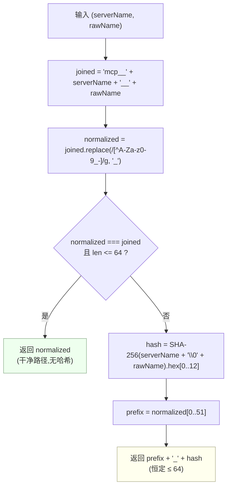

# 02 · 命名算法:`publicToolName()` 完整推演

> 源码:`packages/mcp/mcp-client/src/tools.ts:98-118`(函数)、`tools.ts:46-56`(常量)
> 上游:第六章 [§1.5](../06-mcp.md) 已给出函数体与三条结论;本文补齐**逐步推演、实测示例、边界用例与不可反解的落地位置**

---

## 一、模块契约原文

`tools.ts:6-10` 把命名契约写在模块头:

```typescript
 * Naming contract (see the mcp-client Agent Note "Naming invariants"): every MCP tool
 * has the stable identity `(serverName, rawName)`; the model-facing public name
 * is `mcp__<serverName>__<rawName>`, normalized to the DeepSeek function-name
 * constraints. The raw name is only ever sent on the wire (`tools/call`); the
 * public name is never parsed to recover it.
```

三个可检验的命题:身份是二元组、公开名是该二元组的函数、rawName 单向流动。

---

## 二、算法逐步推演

### 2.1 常量

`tools.ts:46-56`:

```typescript
/**
 * DeepSeek function-name contract: at most 64 characters. Wire-protocol
 * constant, not configuration.
 */
const MAX_PUBLIC_NAME_LENGTH = 64

/** DeepSeek function-name contract: only `[A-Za-z0-9_-]` is allowed. */
const INVALID_NAME_CHARS = /[^A-Za-z0-9_-]/g

/** Hex chars of the SHA-256 identity hash appended on lossy normalization. */
const HASH_LENGTH = 12
```

"Wire-protocol constant, not configuration":这三个值来自 DeepSeek function-name 契约,不是部署可调参数——与仓库"No hardcoded tunables in plugins"规则的区别正在于此(协议常量保持固定)。

### 2.2 四个步骤

`tools.ts:112-118`:

```typescript
export function publicToolName(serverName: string, rawName: string): string {
  const joined = `mcp__${serverName}__${rawName}`
  const normalized = joined.replace(INVALID_NAME_CHARS, '_')
  if (normalized === joined && normalized.length <= MAX_PUBLIC_NAME_LENGTH) return normalized
  const hash = createHash('sha256').update(`${serverName}\0${rawName}`).digest('hex').slice(0, HASH_LENGTH)
  return `${normalized.slice(0, MAX_PUBLIC_NAME_LENGTH - HASH_LENGTH - 1)}_${hash}`
}
```

| 步 | 表达式 | 精确语义 |
|---|---|---|
| ① 拼接 | `` `mcp__${serverName}__${rawName}` `` | 单一模板串;`mcp__` 是 5 字符标记,`__` 是 2 字符分隔 |
| ② 归一 | `.replace(/[^A-Za-z0-9_-]/g, '_')` | **全局**正则,`.`/`/`/空格/非 ASCII 等同字符逐位替换为 `_`;**不是删除** |
| ③ 快路径 | `normalized === joined && normalized.length <= 64` | 两个条件同时成立才原样返回。`normalized === joined` 等价于"②没有替换任何字符" |
| ④ 哈希路径 | `${normalized.slice(0, 51)}_${hash}` | `64 - 12 - 1 = 51` 是硬算出来的预算:51(前缀)+ 1(下划线)+ 12(哈希)= **恰好 64** |

### 2.3 四个设计细节的理由

1. **为什么哈希输入是 `${serverName}\0${rawName}` 而不是 `joined`**:`\0` 是**不可出现在两者中的分隔符**。若改用拼接后的字符串,`('a', 'b__c')` 与 `('a__b', 'c')` 都会得到 `mcp__a__b__c` 前缀的同一输入,哈希失去区分力。用 NUL 分隔后两个输入分别是 `a\0b__c` 与 `a__b\0c`,必然不同。
2. **为什么哈希输入不含归一化结果**:哈希承诺的是**身份**区分,不是**字符串**区分。即使两个 rawName 归一后完全一样,只要原身份不同,哈希就不同——这正是 `('srv','admin.reset')` 与 `('srv','admin_reset')` 不坍缩的原因(见 §4.3 实测)。
3. **为什么快路径要求"零替换且不超长"两个条件**:任一条件不满足都意味着公开名与"`mcp__<server>__<raw>` 原文"不再一一对应。此时若不追加哈希,`('srv','admin.reset')` 与 `('srv','admin_reset')` 会得到同一公开名——一个静默的工具覆盖。
4. **为什么截断是 `slice(0, 51)` 而不是 `slice(0, 51)` 之后再判断**:因为 `normalized` 可能本身就短于 51(如 `mcp__srv__admin_reset` 只有 21 字符),`slice` 自动退化为取全长;无需分支。

### 2.4 决策流程图



---

## 三、输入 → 输出示例表(全部实测)

下表的哈希值由 `SHA-256(serverName + "\0" + rawName)` 的十六进制前 12 位实算得到,可与 `tools.ts:116` 的表达式逐位核对。

| # | `serverName` | `rawName` | 路径 | 公开名 | 长度 |
|---|---|---|---|---|---|
| 1 | `github` | `create_issue` | 干净 | `mcp__github__create_issue` | 25 |
| 2 | `everything` | `get-sum` | 干净 | `mcp__everything__get-sum` | 24 |
| 3 | `srv` | `admin_reset` | 干净(下划线合法) | `mcp__srv__admin_reset` | 21 |
| 4 | `srv` | `admin.reset` | 归一 + 哈希 | `mcp__srv__admin_reset_3b185f786768` | 34 |
| 5 | `fixture` | `admin.reset` | 归一 + 哈希 | `mcp__fixture__admin_reset_2d9bb2dfe9aa` | 38 |
| 6 | `srv` | `a.b` | 归一 + 哈希 | `mcp__srv__a_b_df0974cd1f1e` | 26 |
| 7 | `srv` | `a_b` | 干净 | `mcp__srv__a_b` | 13 |
| 8 | `my-server_1` | `do.thing` | 归一 + 哈希 | `mcp__my-server_1__do_thing_397b2b776196` | 39 |
| 9 | `github` | `search` | 干净 | `mcp__github__search` | 19 |
| 10 | `web` | `search` | 干净 | `mcp__web__search` | 16 |
| 11 | `srv` | `'a' × 80` | 截断 + 哈希 | `mcp__srv__` + 41×`a` + `_3b75b5cc78d8` | 64 |
| 12 | `srv` | `'z' × 128` | 截断 + 哈希 | `mcp__srv__` + 41×`z` + `_b641b4350810` | 64 |
| 13 | `abcdefghijklmnopqrstuvwxyz123456`(32) | `tool` | 干净 | `mcp__abcdefghijklmnopqrstuvwxyz123456__tool` | 43 |
| 14 | `'x' × 32` | `'a' × 25` | 干净(恰好 64) | `mcp__` + 32×`x` + `__` + 25×`a` | **64** |
| 15 | `'x' × 32` | `'a' × 26` | 归一?否→**超长**,哈希 | `mcp__xxxxxxxxxxxxxxxxxxxxxxxxxxxxxxxx__aaaaaaaaaaaa_2cedf2cc0ea4` | 64 |

第 4、5 行是同一 rawName 在两个 serverName 下的结果:`3b185f786768` 与 `2d9bb2dfe9aa` 不同,因为身份不同。第 11、12 行展示了"前缀被截到 51 后哈希仍然来自完整身份"。

第 14/15 行是**唯一的分界点**:`5 + len(serverName) + 2 + len(rawName) = 64` 是快路径的上界。

---

## 四、边界用例

### 4.1 128 字符的 MCP 名

MCP 允许最长 128 字符、允许 `.`;DeepSeek function-name 契约只允许 64 且 `[A-Za-z0-9_-]`。`srv` + 128 个 `z`:

```text
joined     = 'mcp__srv__' + 'z'×128               长度 138
normalized = 同 joined(全为合法字符,零替换)        长度 138 > 64 → 条件不成立
hash       = sha256('srv\0' + 'z'×128)[0..12] = 'b641b4350810'
返回值     = normalized.slice(0,51) + '_' + hash
           = 'mcp__srv__' + 'z'×41 + '_b641b4350810'   长度 64 ✓
```

注意路径判定:这个用例走哈希路径的原因是**超长**,不是"含非法字符"——`normalized === joined` 成立但长度条件不成立。

一个含点的 128 字符名(64×`w` + `'.d'`×32):

```text
rawName    = 'w'×64 + '.d'×32                     长度 128
joined     = 'mcp__srv__' + 上述                   长度 138
normalized = 'mcp__srv__' + 'w'×64 + '_d'×32       长度 138,内容被改写
返回值     = 'mcp__srv__' + 'w'×41 + '_86944011ec2f'  长度 64
```

两种失败原因(改写、超长)在实现里不需要分别处理,哈希路径一条覆盖。E2E 的 `fixture-server.ts:67-73` 注册的 `admin.reset` 就是这条路径在**真实协议**上的验证(`mcp-client.e2e.ts:134-147`)。

### 4.2 跨服务器同名

`mcp-client.spec.ts:207-216` 与 `mcp-client.e2e.ts` 的 `mcp__web__ping` / `mcp__fixture__add` 都是同一事实的证据:两台服务器各自发布 `search`,得到 `mcp__github__search` 与 `mcp__web__search`(上表 #9/#10)。这是 `mcp__<serverName>__` 前缀的**唯一**目的之一——官方注记引用的 Microsoft Research 调查发现 1,470 台服务器中有 775 个重名工具名(`search` 一个词出现在 32 台服务器上),因此前缀是常态化解法而不是兜底。

### 4.3 归一化坍缩风险与哈希的解法

最容易想到的攻击是"两个不同 rawName 归一后相同"。下表说明哈希如何拆开它们:

| `rawName` | 归一后主体 | 附加哈希 | 结果 |
|---|---|---|---|
| `admin.reset` | `mcp__srv__admin_reset` | `3b185f786768` | `mcp__srv__admin_reset_3b185f786768` |
| `admin_reset` | — (干净路径) | 无 | `mcp__srv__admin_reset` |

`mcp-client.spec.ts:175-181` 把这条不变式钉成测试:

```typescript
const a = publicToolName('srv', 'admin.reset')
const b = publicToolName('srv', 'admin_reset')
expect(a).toBe(publicToolName('srv', 'admin.reset'))   // 确定性
expect(a).not.toBe(b)                                   // 不坍缩
```

### 4.4 "合法字符串撞上哈希结果"这一构造性情形

哈希路径的产物形如 `<归一前缀>_<12 位十六进制>`,而这个形态**本身也是合法的 rawName**。一个服务器只要发布名为 `admin_reset_3b185f786768` 的工具,就能算出一个与上表 #4 **完全相同**的公开名:

```text
publicToolName('srv', 'admin_reset_3b185f786768')
  joined = 'mcp__srv__admin_reset_3b185f786768'   34 字符,零替换,≤ 64
  → 干净路径,原样返回 'mcp__srv__admin_reset_3b185f786768'
```

这不是算法缺陷,而是"公开名 ∈ 合法名字集合"的必然结果;重要的是**它不会静默出错**:

| 冲突范围 | 检测点 | 后果 |
|---|---|---|
| 同一服务器内 | `syncTools` 的 `definitions.has(publicName)`(`tools.ts:158`) | 整表 reject:`server listed tool "…" more than once — invalid tool list`,旧代保留 |
| 同一进程内的两台服务器 | `ctx.tools.register()` 的重名拒绝(`core/tools/src/index.ts:1022-1023`:"duplicates within one layer … fail")| 半代回滚,`registrationFailure` 决定吞下还是上抛(见 [01 §4](./01-discovery-and-sync.md)) |

因此哈希提供的不是"数学上不可能碰撞"的保证(12 位十六进制 = 48 bit,碰撞概率非零),而是**"任何碰撞都会被注册表的唯一性检查变成一次响亮的拒绝"**。这与仓库"Misconfiguration fails loud"的约定一致。

### 4.5 `serverName` 长度上限的来历

`serverName` 由 Schema 强制为 `^[A-Za-z0-9_-]{1,32}$`(`index.ts:38`,注释:"Valid `serverName`, kept below the public tool-name budget"):

```typescript
const SERVER_NAME_PATTERN = /^[A-Za-z0-9_-]{1,32}$/
```

32 这个数字的作用是**保证每个服务器至少有一段干净名字预算**:`mcp__`(5)+ 32 + `__`(2)= 39 字符固定开销,剩余 25 字符供 rawName 走快路径(上表 #14),超过 25 就走哈希路径。约束同时被 Schema(`index.ts:116,127`)和 ACP 的 `VALID_SERVER_NAME`(`packages/acp/acp/src/mcp.ts:10`)两处独立强制——ACP 侧还会对不合规的名字做归一化并加 8 位摘要(见 [05 §5](./05-transport-and-security.md))。

`apply.spec.ts:105-118` 验证了越界即拒:

```typescript
expect(() => ConfigSchema({ transport: 'stdio', serverName: 'bad name!', command: 'echo' } as never)).toThrow()
expect(() => ConfigSchema({ transport: 'stdio', serverName: 'x'.repeat(33), command: 'echo' } as never)).toThrow()
```

---

## 五、"rawName 只上 wire、公开名永不反解"的实现

### 5.1 反解的缺席是可 grep 验证的

在整个 `packages/` 下检索 `split('__')`、`startsWith('mcp__')`、以及任何"从公开名解析"的模式,**没有任何匹配**(仅存在测试与文档中的字面量 `mcp__…`)。公开名在仓库里的出现位置只有三类:桥自己构造它(`tools.ts:113`)、测试断言它、注释描述它。**没有任何消费者从它推导 rawName。**

### 5.2 executor 闭包直接持有 rawName

`createExecutor`(`tools.ts:313-320`)的签名把 `rawName` 作为独立参数接收,`createDefinition` 调用它时传入的是 `tool.name` 原文(`tools.ts:271`):

```typescript
execute: createExecutor(client, ctx, rawName, taskRequired, opts, projections),
```

真正上线的那一行是 `callToolUncached`(`tools.ts:88-90`):

```typescript
return client.request(
  { method: 'tools/call', params: { name: rawName, arguments: args } },
  RawCallToolResultSchema,
  { signal: exec.signal, timeout: opts.toolCallTimeoutMs },
)
```

`params.name` 取的是闭包变量 `rawName`,**不是** `args`/`exec` 里的任何字段,也不是任何从公开名派生的量。`mcp-client.spec.ts:461-477` 用含点的名字直接验证:

```typescript
const publicName = publicToolName('srv', 'admin.reset')   // mcp__srv__admin_reset_3b185f786768
await ctx.tools.execute({ …, name: publicName, arguments: {} })
expect(client.callTool).toHaveBeenCalledWith(
  { name: 'admin.reset', arguments: {} },   // 线上是原文,不是公开名
  undefined, expect.anything(),
)
```

### 5.3 rawName 的另外两处使用点

| 位置 | 用途 | 是否上线 |
|---|---|---|
| `createOutput(rawName, …)` `tools.ts:270,285` | 供 `extractText(content, rawName)` 生成"无可见内容"的诊断文本 | 否,只进模型可见文本 |
| `createExecutor(... rawName ...)` `tools.ts:271,323` | taskSupport 拒绝消息里点名是哪个工具 | 否 |
| `callToolUncached(... rawName ...)` `tools.ts:330` | `tools/call` 的 `params.name` | **是** |

三处都没有"反向解析"的痕迹:`rawName` 自始至终以变量形式流动。

---

## 六、稳定性结论与其推论

1. **纯函数 ⇒ HMR 安全**。公开名只依赖 `(serverName, rawName)`,与连接代际、注册顺序、其他服务器是否存在全都无关。HMR 热替换若保持 `serverName` 不变,重建出**逐字节相同**的公开名,因此会话历史里的 `tool/call` 名称、权限规则里的 `mcp__github__*` 前缀、遥测聚合全部继续有效。
2. **注册顺序无关 ⇒ 无静默覆盖**。"先注册者胜"或"后注册者覆盖"这类策略被结构性排除:冲突只会走 `createDefinition` 之后的注册失败分支。
3. **命名算法是 v1 契约**。`mcp-client/README.md:206` 明确写着"changing it after release would break session history and permission rules";`mcp-client.spec.ts:155-182` 是它的钉子。

---

## 七、关键文件 / 符号索引表

| 符号 / 常量 | 位置 | 说明 |
|---|---|---|
| `publicToolName()` | `tools.ts:112` | 算法本体,15 行 |
| `MAX_PUBLIC_NAME_LENGTH = 64` | `tools.ts:50` | 协议常量,非配置 |
| `INVALID_NAME_CHARS` | `tools.ts:53` | `/[^A-Za-z0-9_-]/g` 全局替换 |
| `HASH_LENGTH = 12` | `tools.ts:56` | 身份摘要长度(48 bit) |
| `SERVER_NAME_PATTERN` | `index.ts:38` | `^[A-Za-z0-9_-]{1,32}$` |
| `callToolUncached()` 的 `params.name` | `tools.ts:89` | rawName 唯一上线点 |
| `createOutput()` 的 `render` | `tools.ts:296-299` | 用 rawName 生成占位诊断 |
| `VALID_SERVER_NAME` / `normalizeServerName()` | `packages/acp/acp/src/mcp.ts:10,111` | ACP 侧另一套 serverName 归一化 |

### 测试锚点

| 断言 | 位置 |
|---|---|
| 干净名原样、含点加哈希、超长截断到 64、确定性与不坍缩 | `mcp-client.spec.ts:155-182` |
| 公开名上线、rawName 上线 | `mcp-client.spec.ts:440-477` |
| 跨服务器同名共存 | `mcp-client.spec.ts:207-216` |
| 与原生同名工具共存 | `mcp-client.spec.ts:218-234` |
| 真实协议上的含点名归一 | `mcp-client.e2e.ts:134-147` |
| serverName 模式越界即拒 | `apply.spec.ts:98-127` |
