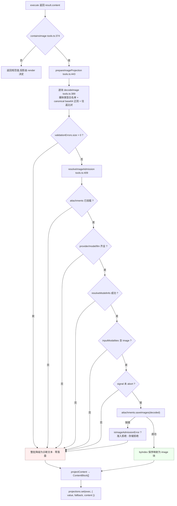

# 03 · 执行与结果映射:`createExecutor()` 与投影交接

> 源码:`packages/mcp/mcp-client/src/tools.ts:205-569`
> 上游:第六章 [§2.2–2.3](../06-mcp.md)

---

## 一、为什么是三个回调而不是一个

一个 MCP 工具在注册表里由**三个**函数组成(`tools.ts:266-281`)。硬约束是:`output.render` 必须**同步纯函数**且可重放,而图片要落盘、模型能力要异步查询——两者不可能塞进同一个函数。

| 回调 | 同步性 | 输入 → 输出 | 能否 I/O |
|---|---|---|---|
| `execute` | 异步 | `(args, exec)` → 规范值 `McpResult` | **可以**(唯一允许 I/O 的地方) |
| `output.render` | **同步纯** | `(args, value)` → `ContentBlock[]`(单 text 块) | 不可以 |
| `finalizeContent` | 同步纯 | `(exec, result)` → `ContentBlock[] \| undefined` | 不可以(只查表与相等判断) |

两者的交接靠一个**以本次执行为键的 WeakMap**(`tools.ts:265`),见 §5。

---

## 二、`createExecutor()` 逐分支走查

`tools.ts:313-371`。签名先固定下来:`createExecutor(client, ctx, rawName, taskRequired, opts, projections)`(`tools.ts:313-320`),其中 `rawName`/`projections`/`opts` 都是**闭包捕获**,不经过任何调用参数。

### 2.1 分支一:taskSupport 拒绝(`tools.ts:322-324`)

```typescript
if (taskRequired) {
  throw new Error(`Tool "${rawName}" requires task-based execution, which this bridge does not support`)
}
```

- **判定在发现期完成**:`syncTools` 传入 `tool.execution?.taskSupport === 'required'`(`tools.ts:171`),只有 `'required'` 为真;`'optional'` 与 `'forbidden'` 都按普通工具桥接。
- **拒绝方式是 throw**,注册表把它变成模型可见的 `isError` 结果;`mcp-client.spec.ts:892-906` 断言 `result.error?.message` 含 `requires task-based execution`,且 **`client.callTool` 从未被调用**——拒绝先于任何网络动作。
- **不在发现期拒绝**:任务声明是服务器行为,拦在发现期会把整台服务器的工具全部下线;代价是"工具可见但调用必失败",这是显式取舍。

### 2.2 分支二:参数容错(`tools.ts:325-329`)

```typescript
// The agent loop passes `JSON.parse(model_arguments)` which is usually an
// object, but can be any JSON value if the model misbehaves (outputs a bare
// string/number/null). Fallback to {} lets the MCP server produce a
// specific "missing required param" error the model can learn from.
const argsObj = (typeof args === 'object' && args !== null ? args : {}) as Record<string, unknown>
```

| 模型产出 | `typeof` | 结果 |
|---|---|---|
| `{ a: 1 }` | `'object'` | 原样透传 |
| `null` | `'object'` 且 `=== null` | `{}` |
| `[1,2]` | `'object'` | **原样透传**(数组也是 object;服务器自己会拒) |
| `"bad"` / `42` / `undefined` | 非 object | `{}` |

**桥不做参数校验**:MCP 服务器才是 `inputSchema` 的作者,它产出的"缺少必填参数"比桥伪造的错误更有信息量。测试:`mcp-client.spec.ts:1269-1299`。

### 2.3 分支三:上线与 signal/timeout 透传(`tools.ts:330` → `tools.ts:81-96`)

```typescript
const result = await callToolUncached(client, rawName, argsObj, exec, opts)
```

```typescript
return client.request(
  { method: 'tools/call', params: { name: rawName, arguments: args } },
  RawCallToolResultSchema,
  {
    signal: exec.signal,
    timeout: opts.toolCallTimeoutMs,
  },
)
```

| 透传项 | 来源 | 作用 | 测试 |
|---|---|---|---|
| `signal: exec.signal` | agent-loop 的调用取消 | 用户中断 → MCP SDK 中止在途请求 | `mcp-client.spec.ts:908-923` |
| `timeout: opts.toolCallTimeoutMs` | `Config.toolCallTimeoutMs`,默认 `60_000`(`index.ts:35,121,130`) | MCP SDK 的**请求级**超时 | `mcp-client.spec.ts:454-458` |
| 输出校验模式 | `RawCallToolResultSchema = z.record(z.string(), z.unknown())`(`tools.ts:59`) | 桥只要求"顶层是对象",字段逐个自行兜底 | — |

`signal` 有第二次使用:图片入库前的闸门 `if (exec.signal.aborted) throw`(`tools.ts:428`),确保取消不会中途被一张图片"追上"。

### 2.4 分支四:legacy `toolResult` 归一(`tools.ts:332-345`)

判据是 `Array.isArray(result.content)` 为假(MCP SDK 历史上返回过 `CallToolResult | CompatibilityCallToolResult` 联合):

```typescript
if (!Array.isArray(result.content)) {
  const rendered: unknown = 'toolResult' in result
    ? JSON.stringify(result.toolResult)
    : '(no output)'
  const text = typeof rendered === 'string' ? rendered : '(no output)'
  if (result.isError === true) throw new Error(text)
  return {
    content: [{ type: 'text', text }],
    ...result.structuredContent !== undefined
      ? { structuredContent: result.structuredContent as JsonValue }
      : {},
  }
}
```

| 服务器返回 | 归一结果 | 测试 |
|---|---|---|
| `{ toolResult: { key: 'value' } }` | `[{type:'text', text:'{"key":"value"}'}]` | `mcp-client.spec.ts:925-936` |
| `{ toolResult: 'legacy', structuredContent: {answer:42} }` | text 为 `'"legacy"'`(带引号)+ 保留 `structuredContent` | `mcp-client.spec.ts:938-956` |
| `{ toolResult: undefined }` / `{}` | text 为 `'(no output)'` | `mcp-client.spec.ts:1103-1125` |
| `{ toolResult: {reason:'nope'}, isError: true }` | throw,消息 `{"reason":"nope"}` | `mcp-client.spec.ts:958-970` |

第 2 行的引号是**有意保留的可逆性**:字符串类结果不会与"文本恰好是 legacy"混淆。归一**只改 content 的表示,不改规范值语义**——这也是 `structuredContent` 被保留的原因。

### 2.5 分支五:`isError` → throw(`tools.ts:347-356`)

```typescript
// Trust boundary: the SDK's return type erases to `any[]` due to the
// union of CallToolResult | CompatibilityCallToolResult; extractText
// validates each element.
const content = result.content as unknown as JsonValue[]
const text = extractText(content, rawName)

// MCP isError → throw so ToolRuntime produces an isError result for the model.
if (result.isError === true) {
  throw new Error(text)
}
```

**为什么必须 throw 而不是返回 `isError: true`**:注册表只认 throw 这一条失败通路。`toolErrorResult(error)`(`core/tools/src/index.ts:1860-1864`)是唯一构造失败结果的地方:

```typescript
content: [{ type: 'text', text: `Error: ${message}` }],
```

返回值会被当作**成功**物化(`isError: false`、`value` 存在、`tools/result` 观察者收到成功事件),模型就看到一个"成功但内容写着错误"的结果。另外两条理由:

- `McpResult`(`tools.ts:41-44`)描述的是**成功**的协议完整值;失败没有"完整协议块",硬塞进 `value` 会污染 PTC 模式调用者的读取逻辑。
- `throw` 位于 `containsImage(content)` 分支(`tools.ts:364`)**之前**,所以 `isError: true` 的结果永远不会先存一张图片再报错(`mcp-client/README.md:130`:"throws before any image persistence")。

模型最终看到的文本是 `Error: something went wrong`——前 7 个字符是 harness 的统一前缀,后面是服务器原文。测试:`mcp-client.spec.ts:878-890`、真实协议 `mcp-client.e2e.ts:167-174`。

### 2.6 分支六:规范值与图片暂存(`tools.ts:358-369`)

```typescript
const value: McpResult = {
  content,
  ...result.structuredContent !== undefined
    ? { structuredContent: result.structuredContent as JsonValue }
    : {},
}
if (containsImage(content)) {
  const fallback: ContentBlock[] = [{ type: 'text', text: extractText(content, rawName) }]
  const projected = await prepareImageProjection(ctx, exec, content, rawName)
  projections.set(exec, { value, fallback, content: projected })
}
return value
```

三点:

1. `value` **始终**返回,无图片时也有,所以所有路径形状一致。
2. `containsImage()`(`tools.ts:374-376`)只查 `value.type === 'image'`,**不解码**;解码失败的降级发生在 `prepareImageProjection` 内部,而不是"发现图片就跳过"。
3. `fallback` 与 `output.render` 的构造**逐字相同**(对比 `tools.ts:298` 与 `tools.ts:365`)——不是重复代码,而是相等判断的前提:§5 要比对"注册表事后给我的 content 是不是我自己 render 的那一份",必须有一个逐字节相同的参照物。

---

## 三、块级映射:`extractText()` 与 `projectContent()`

`extractText`(`tools.ts:507-512`)是 `projectContent` 的薄包装,把投影出的 text 块用 `'\n'` 连成一个字符串。`projectContent`(`tools.ts:519-569`)用文本缓冲区 + `flushText()` 实现"连续文本段合并、图片原地切断":

```typescript
const projected: ContentBlock[] = []
const text: string[] = []
const flushText = (): void => {
  if (text.length === 0) return
  projected.push({ type: 'text', text: text.splice(0).join('\n') })
}
```

遇到 `text`/`resource_link`/`audio`/`resource`/未知类型 → **只推入缓冲区不 flush**;遇到 `image` → **先 flush 再放图片**,因此图片在序列中的位置被保留(`mcp-client.spec.ts:491-530` 断言类型序列恰为 `['text','image','text','image','text']`)。

| MCP 块 | 条件 | 投影 | 测试 |
|---|---|---|---|
| `text` | `text !== undefined` | 原文进缓冲区 | `:479-489`(两块以 `\n` 合并) |
| `text` | `text` 缺失 | **不推任何东西**;全空则走兜底 | `:1078-1088` |
| `image`(准入) | 三重解码通过 | `{ type:'image', attachment: ref }` 原地插入 | `:491-530` |
| `image`(被拒) | 任一步失败 | `[image unavailable: <mt>; <原因>; raw image data remains available to programmatic callers]` | §4 |
| `resource_link` | `name` 与 `uri` 齐全 | `Resource link: <name> (<uri>)` | `:1010-1020` |
| `resource_link` | 缺任一 | `[resource link unavailable: the MCP block is missing its name or URI]` | `:1022-1034` |
| `audio` | 任意 | `[audio result unsupported: <mimeType 或 unknown media type>; raw audio data remains available to programmatic callers]` | `:980-993,1063-1076` |
| `resource` | 任意 | `[embedded resource unsupported; raw resource data remains available to programmatic callers]` | `:995-1008` |
| 其它 `type` | 任意 | `[unsupported MCP content type: <type>]` | `:1036-1046` |
| 非对象(`42`/`null`/数组) | `!isRecord(value)` | `[unsupported MCP content block: expected an object]` | `:814-833` |
| 全表为空或无可见内容 | `projected.length === 0` | `(<toolName> returned no model-visible content)` | `:1090-1100` |

三条贯穿全表的原则:

1. **永不静默丢弃**。每种不支持都产出显式诊断,且文案点明"原始数据仍对程序化调用者可用"——规范值里那份原始块确实还在(`mcp-client.spec.ts:548-553` 同时断言诊断文本与 `result.value.content` 保留原块)。
2. **不做二级解释**。不转写 audio、不展开嵌入资源;只报告"是什么、为什么不支持、原数据在哪"。
3. **多文本块合并成单块是刻意的**:DeepSeek 序列化器的 `flattenText()` 用 `join('')` 拼接,多块会**静默丢失块边界**(官方注记的 "Preserve multiple TextBlocks" 备选方案即因此被拒)。

---

## 四、图片准入链

### 4.1 严格解码:`decodeImage()`(`tools.ts:388-401`)

```typescript
if (block.mimeType === undefined || !isImageMediaType(block.mimeType)) {
  throw new Error('the declared media type is not PNG, JPEG, WebP, or GIF')
}
if (block.data === undefined || !CANONICAL_BASE64.test(block.data)) {
  throw new Error('the image data is not canonical base64')
}
const data = Buffer.from(block.data, 'base64')
if (data.toString('base64') !== block.data) {
  throw new Error('the image data is not canonical base64')
}
return { data, mediaType: block.mimeType }
```

| 检查 | 拒绝对象 | 为什么需要 |
|---|---|---|
| mediaType 白名单(`IMAGE_MEDIA_TYPES`,`tools.ts:62-67`) | `image/tiff`、缺 `mimeType` | 与持久化附件词汇表对齐 |
| `CANONICAL_BASE64` 正则(`tools.ts:70`) | URL-safe 别名(`-`/`_`)、含空白、长度非 4 倍数 | `^(?:[A-Za-z0-9+/]{4})*(?:[A-Za-z0-9+/]{2}==\|[A-Za-z0-9+/]{3}=)?$` |
| `Buffer → base64` **往返比对** | `AB==`(padding 位非零)、`AQ` | 正则无法发现"解码后再编码会变形"的输入;往返比对是唯一的 canonical 判据 |

测试:`mcp-client.spec.ts:582-607` 断言 `'AB=='` 被拒、`'AQ=='` 通过。

### 4.2 批级原子性:`prepareImageProjection()` 前半段(`tools.ts:443-470`)

```typescript
const decoded: SaveImageAttachment[] = []
const validationErrors = new Map<number, string>()
const imageIndexes: number[] = []
for (const [index, value] of content.entries()) {
  if (!isRecord(value) || value.type !== 'image') continue
  imageIndexes.push(index)
  try {
    decoded.push(decodeImage(value as unknown as McpContentBlock))
  } catch (error: unknown) {
    validationErrors.set(index, (error as Error).message)
  }
}
if (validationErrors.size > 0) {
  return projectContent(content, toolName, (block, index) => ({
    type: 'text',
    text: imageDiagnostic(block, validationErrors.get(index) ?? 'another image in the same result was invalid'),
  }))
}
```

`validationErrors.size > 0` 即**整批降级**:失败图片报自身原因,解码成功的图片报 `another image in the same result was invalid`,**一张都不落盘**。`mcp-client.spec.ts:556-580` 的断言:

```typescript
expect(rich.attachments.saved).toEqual([])                                  // 零落盘
expect(textAt(result.content, 0)).toContain('another image in the same result was invalid')
expect(textAt(result.content, 1)).toContain('not canonical base64')
```

**为什么整批而不是逐张**:结果里的图片是**同源的一批**,部分采纳会掩盖"服务器这一批本身有问题"的事实,并让调用方看到"部分引用 + 部分诊断"的混合态。

### 4.3 能力准入:`resolveImageAdmission()`(`tools.ts:409-430`)

六步串联,任一步失败即抛:

| 步 | 条件 | 失败消息 | 测试 |
|---|---|---|---|
| 1 | `ctx.get('attachments') !== undefined` | `no attachment store is mounted` | `:532-554` |
| 2 | 解析出 `provider` 且 `model` | `the current model route could not be resolved` | `:637-653` |
| 3 | `ctx.get('llm') !== undefined` | 同上 | `:655-665` |
| 4 | `llm.resolveModelInfo()` 不抛 | `the current model route could not be verified` | `:667-675` |
| 5 | `inputModalities` 含 `'image'` | `model "<model>" does not declare image input` | `:609-627,677-687` |
| 6 | `exec.signal` 未 abort | `the tool call was canceled before image storage` | `:689-704` |

路由解析的原文(`tools.ts:412-414`):

```typescript
const routed = exec.agent?.session.requestHeader()?.config
const provider = routed?.provider ?? exec.agent?.options.provider
const model = routed?.model ?? exec.agent?.options.model
```

三处设计细节:

1. **路由取自本次执行所属的 Agent**,先读会话最新 `requestHeader()?.config` 再退回 `exec.agent.options`——模型可在会话中途切换,"当前能力"必须以这次调用实际路由为准。
2. **用 `ctx.get()` 而非 `ctx.<name>`**(`410`、`415`):`packages/AGENTS.md` 规定可选服务用 `ctx.get(name)`,属性代理对拓扑敏感。附件库与 llm 都是**可选**挂载,两种缺失都必须在运行期显式判定。
3. **要正面能力证明**(`425`):`inputModalities === undefined` 也视为不支持。信息缺失 ≠ 支持。

### 4.4 落盘、保序与失败分类(`tools.ts:481-496`)

```typescript
const refs = await attachments.saveImages(decoded)
const byIndex = new Map(imageIndexes.map((index, offset) => [index, refs[offset] as ImageAttachmentRef] as const))
return projectContent(content, toolName, (_block, index) => ({
  type: 'image',
  attachment: byIndex.get(index) as ImageAttachmentRef,
}))
```

`decoded` 与 `imageIndexes` 同序压入,所以 `refs[offset]` 与内容下标一一对应,`byIndex` 完成"内容下标 → 附件引用"的映射并保持原位序。`saveImages` 自身契约是**批量校验后按序提交**(`packages/attachment/attachment/src/index.ts:97-104`):`validateImageBatch` → 逐个 `validateImage` → 逐个 `saveImage`,批量拒绝时**不产生任何引用**。

失败分类按**稳定错误码**而非原型链(`isImageAdmissionError`,`packages/attachment/attachment/src/error.ts:79-86`):

```typescript
const reason = isImageAdmissionError(error)
  ? `image admission rejected the result: ${error.message}`
  : 'durable image storage rejected the result'
```

于是部署策略拒绝(`TOO_MANY_IMAGES`/`IMAGES_TOO_LARGE`/`UNSUPPORTED_IMAGE_TYPE`)与真实存储故障(`ATTACHMENT_WRITE_FAILED`)文案可区分:`mcp-client.spec.ts:706-747` 分别用 `new Error('disk full')` 与 `new AttachmentError('too many images','TOO_MANY_IMAGES')` 断言两条文案。

诊断文案由 `imageDiagnostic()`(`tools.ts:433-436`)统一生成:

```typescript
return `[image unavailable: ${mediaType}; ${reason}; raw image data remains available to programmatic callers]`
```

`projectContent` 的**默认**图片投影器(`tools.ts:522-525`)用同一函数、固定原因 `this result was not admitted to durable model context`——这是 `extractText` 走的那条路,即 `output.render` 与 fallback 的形态(`mcp-client.spec.ts:1127-1141` 触发它)。

### 4.5 准入链全貌


<details><summary>Mermaid 源码</summary>



</details>

---

## 五、WeakMap 投影与 `finalizeContent()` 的双守卫

### 5.1 暂存结构(`tools.ts:220-228`)

```typescript
interface PreparedProjection {
  value: McpResult          // execute 返回的规范值
  fallback: ContentBlock[]  // 与 output.render 逐字相同的参照物
  content: ContentBlock[]   // 富投影或显式拒绝的投影
}
```
`projections` 是 `createDefinition` 函数体内的局部 `WeakMap<ToolExecution, PreparedProjection>`(`tools.ts:265`),被 `createExecutor` 与 `finalizeContent` 共同闭包捕获。**它是代际局部的**:一次 `syncTools` 换代即整体不可达,旧代不可能消费新执行的状态。

### 5.2 五个步骤(`tools.ts:272-280`)

```typescript
finalizeContent(exec: Readonly<ToolExecution>, result: Readonly<ToolExecutionResult>) {
  const projection = projections.get(exec)
  if (projection === undefined) return undefined
  projections.delete(exec)
  if (result.isError) return undefined
  if (!isDeepStrictEqual(result.value, projection.value)) return undefined
  if (!isDeepStrictEqual(result.content, projection.fallback)) return undefined
  return projection.content
}
```

| 步 | 判断 | 含义 |
|---|---|---|
| 1 | 无暂存 → `undefined` | 本次执行无图片,保持 `render` 结果 |
| 2 | `projections.delete(exec)` | **无论后续判断如何都先释放**,守卫失败也不残留 |
| 3 | `result.isError` → `undefined` | 失败结果不允许携带图片 |
| 4 | `value` 不 deep-equal → `undefined` | 有人替换了规范值 → 富投影作废 |
| 5 | `content` 不 deep-equal fallback → `undefined` | 有人替换了模型可见内容 → 富投影作废 |

### 5.3 注册表侧的调用时机

`tools.ts` 的 `finalizeContent` 由 `core/tools/src/index.ts:1639-1644` 调用:

```typescript
private applyFinalContent(exec: ToolRunContext, result: ToolExecutionResult): ToolExecutionResult {
  const finalizeContent = this.contentFinalizers.get(exec)
  if (finalizeContent === undefined) return result
  const content = finalizeContent(exec, result)
  return content === undefined ? result : { ...result, content }
}
```

它在 `finishScheduledExecution`(`core/tools/src/index.ts:1621-1636`)里位于 `materializeFinalResult` **之后**,也就是 `tools/pre-execute`、审批、guard、`tools/post-execute` 全部落地之后。因此双守卫比较的不是"我自己刚返回的东西",而是"**外部管线是否动过它**"。

### 5.4 三个守卫场景的测试证据(`mcp-client.spec.ts:749-812`)

| 场景 | `tools/post-execute` 决定 | 模型看到 | 附件落盘 |
|---|---|---|---|
| 替换 content | `{ kind:'accept', content:[{type:'text',text:'policy replacement'}] }` | 策略文本,**不是**图片 | 1 张 |
| 替换 value | `{ kind:'accept', value:{ content:[{type:'text',text:'value replacement'}] } }` | 替换值 | 已落盘 |
| 拦截 | `{ kind:'block', feedback:[…] }` | `isError: true` + 反馈文本 | 已落盘 |

第一行的两条断言(`mcp-client.spec.ts:769-770`)暴露了这个设计的权重排序:

```typescript
expect(rich.attachments.saved).toHaveLength(1)
expect(result.content).toEqual([{ type: 'text', text: 'policy replacement' }])
```

即**图片已经持久化,但没有进入模型上下文**。持久化是执行期的既成事实(内容寻址、可被程序化调用者按 `value` 引用),而"进不进上下文"由策略管线最终裁定;`delete` 保证被丢弃的投影不会滞留。

---

## 六、关键文件 / 符号索引表

| 符号 | 位置 | 职责 |
|---|---|---|
| `McpResult` / `McpContentBlock` | `tools.ts:41,211` | 规范值 `{ content, structuredContent? }` 与更松的运行时读取形状 |
| `PreparedProjection` | `tools.ts:221` | `{ value, fallback, content }` |
| `createDefinition()` | `tools.ts:254` | 三回调组装点与 WeakMap 所有者 |
| `createExecutor()` | `tools.ts:313` | 六分支执行器 |
| `callToolUncached()` | `tools.ts:81` | signal/timeout 透传的唯一上线点 |
| `createOutput()` | `tools.ts:285` | 规范值 schema + 同步纯投影 |
| `containsImage()` | `tools.ts:374` | 只查 `type === 'image'` |
| `decodeImage()` | `tools.ts:389` | 三重严格解码 |
| `resolveImageAdmission()` | `tools.ts:409` | 六步准入 |
| `imageDiagnostic()` | `tools.ts:433` | 统一诊断文案 |
| `prepareImageProjection()` | `tools.ts:443` | 批级原子降级 + 落盘 + 保序映射 |
| `extractText()` / `projectContent()` | `tools.ts:507,519` | 块级映射与文本段合并 |
| `finalizeContent()` | `tools.ts:272` | 双 `isDeepStrictEqual` 守卫 |
| `applyFinalContent()` | `core/tools/src/index.ts:1639` | 注册表侧调用点 |
| `AttachmentStore.saveImages()` | `packages/attachment/attachment/src/index.ts:97` | 批量校验 + 按序提交 |
| `isImageAdmissionError()` | `packages/attachment/attachment/src/error.ts:79` | 准入拒绝 vs 存储故障 |

### 测试锚点(按行为分组)

| 行为组 | 位置 |
|---|---|
| rawName 上线 / 公开名不上线 / 多文本合并 / 图片保序与 base64 隔离 | `mcp-client.spec.ts:440-530` |
| 图片:无附件库、批级原子、六步准入、存储 vs 准入文案、策略改写优先 | `mcp-client.spec.ts:532-812` |
| 块映射:原始块、`structuredContent` 校验与降级、`isError`、taskSupport、signal、legacy | `mcp-client.spec.ts:814-970` |
| 边界块:audio / resource / link / 未知 / 缺字段 / 空表 / 非文本错误;参数兜底 | `mcp-client.spec.ts:973-1163,1262-1300` |
| 真实协议端到端(含图片落盘与读回) | `mcp-client.e2e.ts:176-193` |
