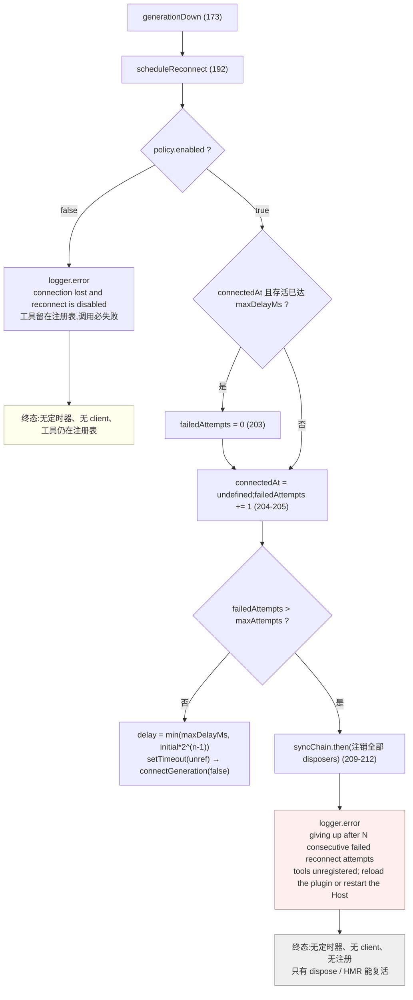

# 04 · 连接监管器:`connection.ts` 函数级走查

> 源码:`packages/mcp/mcp-client/src/connection.ts`(351 行)
> 上游:第六章 [§三](../06-mcp.md) 给了监管器的状态机与三条工程决策;本文逐分支落到代码,并给出三种情形的重连时序

---

## 一、状态模型:一个闭包里的九个变量

`startConnection()`(`connection.ts:123`)整个生命周期只有**一份闭包状态**:

| 变量 | 声明 | 写入点 | 不变量 |
|---|---|---|---|
| `disposed` | `137` | `dispose()` `328` | 一旦为真,`isCurrent()` 恒假,一切代际回调幂等失效 |
| `client` / `clientClosed` | `139,141` | 建代 `246-247`、失败收尾 `289-290`、`generationDown` `175-176`、`dispose` `335-336` | 两者**同生同灭**;`dispose` 先清空再关闭,保证关闭期间没有回调认为自己是当前代 |
| `disposers` | `143` | `enqueueSync` 内 `165`、耗尽 `210-211`、`dispose` `347-348` | 只在 `syncChain` 上或 dispose 收尾时改写,不与在途同步竞争 |
| `reconnectTimer` | `144` | `scheduleReconnect` `219-222`、`dispose` `329-332` | 始终 `unref`,不单独吊住进程 |
| `failedAttempts` | `146` | `scheduleReconnect` `203`(重置)、`205`(递增) | 预算语义集中在一处 |
| `connectedAt` | `148` | 成功 `303`、清空 `204` | "完成 connect **且**首次同步"才写;`connect()` 返回但同步未跑完不算 |
| `firstAttemptError` | `150` | 失败 catch `280` | 只记**第一个**,不被后续重试覆盖 |
| `settling` | `308` | 初始、重连定时器 `221` | `dispose()` 靠 `await settling` 等待在途尝试 |

---

## 二、`resolveReconnectPolicy()`:默认值与边界的唯一裁决点

`connection.ts:55-90`。JSDoc 第一段就点明存在理由:

```typescript
 * The one explicit resolve step from raw reconnect config to the policy the
 * supervisor runs. Programmatic construction may bypass Schemastery
 * normalization, so every default and bound is re-judged here — misconfiguration
 * fails the plugin instance at load.
```

默认值在 `RECONNECT_DEFAULTS`(`connection.ts:40-45`),已 `Object.freeze`:`enabled: true`、`initialDelayMs: 500`、`maxDelayMs: 30_000`、`maxAttempts: 10`。

| # | 检查(`connection.ts:66-88`) | 拒绝消息 | 测试 |
|---|---|---|---|
| 1 | 未知键:`!Object.hasOwn(RECONNECT_DEFAULTS, key)` | `<path>.<key> is not a reconnect option` | `reconnect.spec.ts:495-498` |
| 2 | `initialDelayMs` 有限、`>0`、`<= MAX_TIMER_DELAY_MS` | `<path>.initialDelayMs must be a positive finite number no greater than 2147483647` | `:500-504` |
| 3 | `maxDelayMs` 同上 | `<path>.maxDelayMs must be …` | `:503` |
| 4 | `initialDelayMs <= maxDelayMs` | `<path>.initialDelayMs must be less than or equal to maxDelayMs` | `:506-509` |
| 5 | `maxAttempts` 为整数且 `>= 1` | `<path>.maxAttempts must be a positive integer` | `:511-514` |
| 6 | 返回 `Object.freeze({...})` | — | `:482-486` |

三点:

1. **第 1 条拒绝未知键而非忽略**——打错的 `jitterRatio` 不会被静默当成"没配"。
2. **上界来自共享常量** `MAX_TIMER_DELAY_MS = 2_147_483_647`(`packages/util/timeout/src/index.ts:25`),即 Node 定时器的 32 位有符号上限;超过它的 `setTimeout` 会被截断成 1ms,变成忙循环。
3. 校验段被 `jscpd:ignore-start/end` 包裹(`connection.ts:75,88`),注释说明它与 llm 的 retry-policy 校验"parallels … not extractable"——领域不同,不强抽公共函数。

`apply` 的调用点把路径前缀拼好(`index.ts:150`),因此用户看到 `mcp-client(srv): reconnect.initialDelayMs must be less than or equal to maxDelayMs`;`reconnect.spec.ts:516-520` 验证它在**加载期**抛出。

---

## 三、代际与幂等闸门:`isCurrent()`

`connection.ts:152-153`:

```typescript
/** A generation may act only while it is the current one on a live plugin. */
const isCurrent = (generation: Client): boolean => !disposed && client === generation
```

一个表达式同时表达两个条件,是全部幂等性的来源。八个检查点:

| 位置 | 挡住什么 |
|---|---|
| `generationDown` `174` | 被替换的旧代 `onclose` 迟到 → 不重复调度 |
| 通知处理器 `260` | 旧代的 `list_changed` → 不触发同步 |
| `enqueueSync` 队列体内 `164` | 排队期间代际失效 → 不执行 swap |
| `connectGeneration` 的 `onclose` `253` | 失败尝试已自行处理关闭 → 不重复 `generationDown` |
| 失败分支日志 `283` | dispose 主动关闭引发的 reject → 不报 "attempt failed" |
| 失败分支收尾 `287` | dispose 已接管 → 不再调度重连 |
| 成功分支 `275,299,302` | 同步期间代际被替换/关闭 → 不写 `connectedAt` |
| 预算耗尽注销 `209-212` | 与在途 swap 竞争(队列内再判一次) |

最直接的证据是 `reconnect.spec.ts:261-275`:dispose 期间 connect 才 reject,日志里**不能**出现 `connection attempt failed`,且代际数保持 1。

---

## 四、`connectGeneration()`:一次尝试的每条失败分支

JSDoc(`connection.ts:227-236`)先交代四条契约:每次尝试都是**全新** transport + client、startup 标志属于**尝试**而非共享队列、每条失败都汇入 `generationDown`、**永不 reject**。

### 4.1 建代与两个信号钩子(`238-270`)

```typescript
const generation = new Client({ name: 'dsh-mcp-client', version: '0.0.1' }, { capabilities: {} })
const closed: PromiseWithResolvers<void> = Promise.withResolvers()
let attemptSettled = false
let closeObserved = false
const hasClosed = (): boolean => closeObserved
client = generation
clientClosed = closed.promise
generation.onclose = () => {
  closeObserved = true
  closed.resolve()
  // A failed connect owns its close barrier in the catch path below. An
  // established generation can transition down directly from this signal.
  if (attemptSettled) generationDown(generation)
}
generation.setNotificationHandler(ToolListChangedNotificationSchema, async () => { … })
```

- **每次尝试都 `new Client`**:MCP SDK 把一个 Protocol 终身绑定到一个 transport,重连无法复用。
- **`capabilities: {}`**:桥不声明任何客户端能力,只用 `tools/list` 与 `tools/call`。
- **`attemptSettled` 是"谁负责关闭屏障"的开关**。`connect()` 进行中关闭 → `onclose` 只置位不调度;等 catch 分支走完屏障再统一 `generationDown`。这是 `reconnect.spec.ts:384-404` 断言"每次尝试恰好一次重试"的实现基础(`expect(instances).toHaveLength(4)`)。
- **通知处理器先于 `connect()` 注册**,理由见 [01 §6](./01-discovery-and-sync.md)。

### 4.2 主 try 与失败 catch(`271-296`)

```typescript
try {
  await generation.connect(createTransport(config))
  if (hasClosed()) { attemptSettled = true; generationDown(generation); return }
  await enqueueSync(generation, startup ? startupOpts : opts)
} catch (error) {
  if (firstAttemptError === undefined) firstAttemptError = error
  // Disposal clears current ownership before it closes the generation, so
  // only a live supervisor reports an attempt failure.
  if (isCurrent(generation)) ctx.logger.warn(`${label}: connection attempt failed: ${String(error)}`)
  try { await generation.close() } catch { /* transport already gone */ }
  const quiesced = hasClosed() || await waitForClose(closed.promise)
  attemptSettled = true
  if (!isCurrent(generation)) return
  if (!quiesced) {
    client = undefined
    clientClosed = undefined
    ctx.logger.error(`${label}: failed generation did not close within ${GENERATION_CLOSE_TIMEOUT_MS}ms — reconnect stopped to avoid overlapping server processes; reload the plugin or restart the Host to retry`)
    return
  }
  generationDown(generation)
  return
}
```

| 行 | 行为 | 为什么 |
|---|---|---|
| `273-277` | connect 成功但已观测到关闭 → 直接 down,不进同步 | `reconnect.spec.ts:406-419` 断言这类死代际**从不发起 `tools/list`** |
| `280` | 只记第一个错误 | `ready` 报告"首次尝试"的真实原因 |
| `283` | `isCurrent` 才 warn | dispose 期间的 reject 是预期路径,不刷日志 |
| `284` | close 吞异常,`try` 只有一句 | 空 catch 有注释点名吞掉什么 |
| `285` | `hasClosed() \|\| await waitForClose(...)` | 关闭可能已发生,此时不必再等 |
| `288-293` | **5 秒内未关闭 → 停止重连** | "宁可不恢复也不重叠子进程":旧 stdio 子进程可能还在跑,起新的会变成两个进程争同一份资源 |
| `294` | 统一出口 `generationDown` | 所有失败路径收敛到一处 |

`reconnect.spec.ts:243-259` 用假定时器精确复现"永不关闭":`mockClose.mockResolvedValue(undefined)` 后 `advanceTimersByTimeAsync(5_000)`,断言 `instances` 仍为 1 且日志含 `reconnect stopped to avoid overlapping server processes`。反向场景在 `:225-241`:`mockClose` 解析但未 `onclose` 时,`instances` 仍是 1,直到手动触发 `onclose` 才变成 2——**新代际必须等旧代确认关闭**。

### 4.3 成功收尾(`297-304`)

```typescript
attemptSettled = true
if (hasClosed()) { generationDown(generation); return }
if (!isCurrent(generation)) return
connectedAt = Date.now()
if (failedAttempts > 0) ctx.logger.info(`${label}: reconnected and re-synced tools (attempt ${failedAttempts}/${policy.maxAttempts})`)
```

`connectedAt` 只在四条同时成立时写入:connect 成功、首次同步完成、代际仍是当前、未观测到关闭。它随后被 `scheduleReconnect` 用来判定稳定窗口。

---

## 五、`generationDown()` 与 `scheduleReconnect()`:预算与稳定窗口

### 5.1 `generationDown()`(`connection.ts:172-178`)

```typescript
/** One disconnect decision per generation: the isCurrent guard makes racing close/error signals idempotent. */
function generationDown(generation: Client): void {
  if (!isCurrent(generation)) return
  client = undefined
  clientClosed = undefined
  scheduleReconnect()
}
```

先清空代际所有权,再调度重连;此后到达的该代任何回调都变成 no-op。

### 5.2 `scheduleReconnect()` 逐行(`connection.ts:192-225`)

| 行 | 行为 | 说明 |
|---|---|---|
| `193` | `lostEstablishedConnection = connectedAt !== undefined` | 区分"连上后掉线"与"从未连上",两条路径日志与语义都不同 |
| `194-200` | `enabled: false` → 只记日志直接返回 | **工具留在注册表**;文案分两种:`connection lost and reconnect is disabled — registered tools will fail until an HMR reload or Host restart` / `connection failed and reconnect is disabled — no tools were registered; …` |
| `203` | 存活 `>= maxDelayMs` 时 `failedAttempts = 0` | **稳定窗口**。取 `maxDelayMs` 而非任意常数,因为它等于"最长退避间隔":一次 outage 内相邻尝试的间隔不可能超过它 |
| `204` | 立刻清空 `connectedAt` | 此后"曾连上"不再参与判定 |
| `205-215` | 先递增再判上限 | `1..maxAttempts` 都会真的重试一次;第 `maxAttempts + 1` 次失败才放弃 |
| `209-212` | 注销动作排到 `syncChain` 之后 | 注释原文:"so it cannot race an in-flight sync's phase-2 swap (which checks isCurrent inside the queue)" |
| `216` | `Math.min(maxDelayMs, initialDelayMs * 2 ** (failedAttempts - 1))` | 首次 = `initialDelayMs`,逐次翻倍,封顶 `maxDelayMs` |
| `217-218` | 两条日志动词:`connection lost; reconnecting` / `connection failed; retrying` | 用户可区分"掉线重连"与"从未连上" |
| `224` | `reconnectTimer.unref()` | 退避等待不能单独吊住 Node 进程;`reconnect.spec.ts:299-309` 验证 dispose 不必等完 60 秒退避 |

预算算式:设 `d = initialDelayMs`、`M = maxDelayMs`、`N = maxAttempts`,则第 k 次重试延迟 `min(M, d × 2^(k-1))`(`k = 1..N`),总尝试次数 `1 + N`(含初始)。默认值下延迟序列为 `500, 1000, 2000, 4000, 8000, 16000, 30000, 30000, 30000, 30000`,合计约 151.5 秒。

---

## 六、`waitForClose()`:有界关闭屏障

`connection.ts:180-190`:

```typescript
/** Wait for the transport-owned close signal without letting a broken transport wedge teardown forever. */
function waitForClose(closed: Promise<void>): Promise<boolean> {
  return new Promise((resolve) => {
    const timeout = setTimeout(() => { resolve(false) }, GENERATION_CLOSE_TIMEOUT_MS)
    timeout.unref()
    void closed.then(() => {
      clearTimeout(timeout)
      resolve(true)
    })
  })
}
```

`GENERATION_CLOSE_TIMEOUT_MS = 5_000`(`connection.ts:50`),来历写在注释里(`47-49`):

```typescript
// The SDK's stdio transport owns two two-second termination grace periods.
// Keep one additional second for the process-close event that proves the old
// generation is gone; timing out fails closed instead of overlapping children.
```

即 `2s(grace) + 2s(grace) + 1s(进程退出事件)`。返回布尔值而非 reject/pending,是"调用方必须显式决定超时怎么办"的写法:

| 调用点 | 超时后果 | 测试 |
|---|---|---|
| 失败尝试 `285` | `false` → **停止重连**并报错,防重叠子进程 | `reconnect.spec.ts:243-259` |
| `dispose()` `339` | `false` → **只记 error**,dispose 继续走完(否则拆卸永久卡住) | `reconnect.spec.ts:277-297` |

---

## 七、`dispose()`:平息(quiesce)而不是请求

`connection.ts:325-350`,七步顺序与每步的理由:

| 序 | 动作(`行`) | 为什么必须在这一步 |
|---|---|---|
| 1 | `disposed = true`(`328`) | 最先,让所有在途回调立刻失去"当前代"资格 |
| 2 | 清 `reconnectTimer`(`329-332`) | 否则退避到点会起新代际 |
| 3 | 捕获并**清空** `client`/`clientClosed`(`333-336`) | 防重入双重关闭,并让关闭期间的 `onclose` 彻底无害 |
| 4 | `await current.close()`(`338`) | 主动关闭当前代(stdio 子进程收到终止) |
| 5 | `await waitForClose(currentClosed)`(`339-341`) | 等"真的关了";超时只记 `server shutdown may be incomplete`,不阻断拆卸 |
| 6 | `await settling`(`345`) | 在途连接尝试结束时**会把同步排进队列**,必须先等它 |
| 7 | `await syncChain`(`346`) → 注销 `disposers`(`347-348`) | 队列排空后 `disposers` 才是终态,一次性注销不会漏代 |

第 6、7 步的联合语义就是"平息":不是"请求停止",而是"等到确实没有在跑的东西"。注释原文(`343-344`):

```typescript
// Quiesce, don't just request it: the in-flight attempt enqueues its
// sync before settling, so awaiting both leaves `disposers` final.
```

`reconnect.spec.ts:421-440` 覆盖最难的一种:dispose 期间一次在途同步才落定并完成 swap,断言它的结果**也**被注销(`mcp__srv__remote` 与 `mcp__srv__late` 均为 `undefined`)。

### 7.1 `ready` 的语义与一个微任务细节

`connection.ts:310-323`:

```typescript
const ready: Promise<ConnectionOutcome> = settling.then(() => {
  // Note: settling.then() is a microtask; stdio onclose is a macrotask — so
  // a server that crashes AFTER a successful initial sync cannot flip client
  // to undefined before this continuation runs.
  if (client !== undefined) return {}
  /* v8 ignore next -- defensive: firstAttemptError is always set when connect/sync fails */
  return { error: firstAttemptError ?? new Error(`${label}: initial connection failed`) }
})
```

`settling` 永不 reject(所有路径都在 try/catch 内),所以 `ready` 也永不 reject——它用 `{ error }` 报告失败,由 `apply` 决定是否致命(`index.ts:184-187`)。上述注释解释了一个真实竞态:若 `onclose` 是同步回调,`client` 可能在 `.then` 之前被清空,导致"明明连上了却报初始连接失败"。

---

## 八、三种情形的重连时序

### 8.1 正常重连(连上过 → 掉线 → 恢复)

```mermaid
sequenceDiagram
  participant Srv as MCP 服务器进程
  participant Gen as 当前代际 Client
  participant Conn as supervisor
  participant Chain as syncChain
  Srv-->>Gen: 进程退出 / 连接断开
  Gen->>Conn: onclose (connection.ts:248)
  Note over Conn: attemptSettled=true → 直接 generationDown
  Conn->>Conn: generationDown (173): client=undefined
  Conn->>Conn: scheduleReconnect (192)
  Note over Conn: connectedAt 存在 → lostEstablishedConnection<br/>存活未达 maxDelayMs → 预算不重置<br/>failedAttempts 1 → delay = initialDelayMs
  Conn->>Conn: logger.warn "connection lost; reconnecting in 500ms (attempt 1/10)"
  Conn->>Conn: setTimeout(...).unref() (219-224)
  Conn->>Gen: connectGeneration(false) (237)
  Gen->>Gen: new Client + onclose + 通知处理器
  Gen->>Srv: connect(createTransport(config))
  Gen->>Chain: enqueueSync(generation, opts) (278)
  Chain->>Chain: syncTools → dispose 旧代 → 注册新代
  Gen->>Conn: connectedAt = Date.now() (303)
  Conn->>Conn: logger.info "reconnected and re-synced tools (attempt 1/10)"
  Note over Conn: failedAttempts 保留到下次断连;<br/>新代存活 ≥ maxDelayMs 才重置为 0
```

### 8.2 崩溃循环(短暂连上又崩,仍在稳定窗口内)

对应 `reconnect.spec.ts:365-382`(`maxDelayMs: 10_000`、`maxAttempts: 1`):

```text
t0  启动:connectedAt = t0,failedAttempts = 0
t1  第一次崩溃(t1 - t0 < 10s)
      → scheduleReconnect:connectedAt 存在但未达稳定窗口 → 预算不重置
      → failedAttempts = 1 ≤ 1 → delay = initialDelayMs → 重试
t2  重试成功:connectedAt = t2
t3  再次崩溃(t3 - t2 < 10s)
      → 存活未达稳定窗口 → 预算不重置
      → failedAttempts = 2 > 1 → 放弃
      → syncChain.then(注销全部工具)
      → logger.error "giving up after 1 consecutive failed reconnect attempts"

结果:instances 停在 2,mcp__srv__remote 从注册表消失
```

**一次短暂成功的连接不能"洗白"预算**。若每次崩溃都重置计数,一台 10 秒崩一次的服务器就能无限重启。稳定窗口取 `maxDelayMs` 的深意正在于:只有"比最长退避还活得久"才算真正脱离上一次 outage。反方向由 `reconnect.spec.ts:347-363` 覆盖:存活超过 `maxDelayMs` 后再崩,`errors` 长度为 0,即预算已重置。

### 8.3 预算耗尽与 `enabled:false` 的两种终态



| 终态 | 工具是否在注册表 | 调用行为 | 恢复路径 |
|---|---|---|---|
| `reconnect.enabled: false` | **在** | 调用失败(transport 已断) | HMR / 重启 Host |
| 预算耗尽 | **不在** | 模型看不到这些工具 | HMR / 重启 Host |

耗尽早必须注销,是因为"工具已注册但调用必失败"是一个**部分可用态**,会长期误导模型反复尝试。而 `enabled: false` 是用户显式选择的手动模式,保留注册是"pre-reconnect contract"的既定行为(`reconnect.spec.ts:333` 的注释原文)。

---

## 九、关键文件 / 符号索引表

| 符号 | 位置 | 职责 |
|---|---|---|
| `ReconnectConfig` | `connection.ts:28` | 四个字段的公开配置面 |
| `RECONNECT_DEFAULTS` | `connection.ts:40` | `enabled/500/30000/10`,已冻结 |
| `GENERATION_CLOSE_TIMEOUT_MS` | `connection.ts:50` | 5 秒关闭屏障(SDK 2+2 秒宽限 + 1 秒) |
| `resolveReconnectPolicy()` | `connection.ts:65` | 唯一解析与校验入口 |
| `ConnectionOutcome` / `ConnectionHandle` | `connection.ts:93,99` | `{ error? }` 与 `{ ready, dispose }` |
| `startConnection()` | `connection.ts:123` | 监管器全部状态的创建点 |
| `isCurrent()` | `connection.ts:153` | 幂等闸门 |
| `enqueueSync()` / `syncChain` | `connection.ts:161-170` | 同步串行化 |
| `generationDown()` | `connection.ts:173` | 单次断连决策 |
| `waitForClose()` | `connection.ts:181` | 有界关闭屏障 |
| `scheduleReconnect()` | `connection.ts:192` | 预算、稳定窗口、退避、give-up |
| `connectGeneration()` | `connection.ts:237` | 一次尝试的全部失败分支 |
| `ready` | `connection.ts:313` | 启动期结果(永不 reject) |
| `dispose()` | `connection.ts:327` | 七步平息顺序 |

### 测试锚点(按主题分组)

| 主题 | 位置 |
|---|---|
| 重连换代与旧代不泄漏、可继续调用、迟到 close 被忽略 | `reconnect.spec.ts:140-171` |
| 触顶注销 / 放弃与在途同步竞态 / 每次尝试恰好一次重试 | `reconnect.spec.ts:173-223,384-404` |
| 关闭屏障的三种走向(必等、永不关、dispose 有界) | `reconnect.spec.ts:225-297` |
| dispose:取消退避、后置 onclose 无操作、平息在途同步、失败静默 | `reconnect.spec.ts:299-323,421-460` |
| `enabled:false` 的两种终态 / 稳定窗口 / 崩溃循环 | `reconnect.spec.ts:325-382` |
| 死代际不发起同步 / 过期通知被忽略 | `reconnect.spec.ts:406-419,462-474` |
| 策略解析的全部拒绝路径 + 加载期硬失败 | `reconnect.spec.ts:479-520` |
| 真实 stdio 崩溃后自动恢复 / 卸载不等退避 | `mcp-client.e2e.ts:257-291,293-320` |
