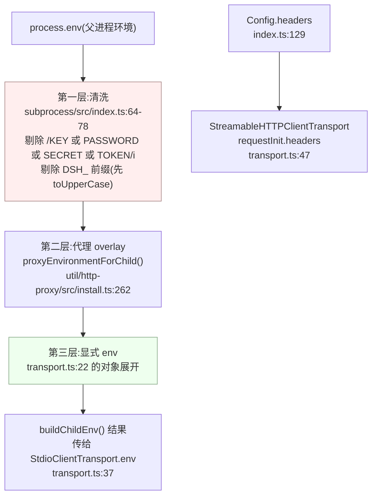

# 05 · 传输与安全:`createTransport()`、环境清洗与 ACP 挂载

> 源码:`packages/mcp/mcp-client/src/transport.ts`(50 行)、`packages/acp/acp/src/mcp.ts`(143 行)
> 依赖:`packages/subprocess/subprocess/src/index.ts`(环境清洗)、`packages/util/http-proxy/src/install.ts`(代理出口)
> 上游:第六章 [§1.3](../06-mcp.md) 与 [§四 安全边界表](../06-mcp.md)

---

## 一、`createTransport()`:判别式工厂

`transport.ts:25-50` 全函数:

```typescript
export function createTransport(config: Config): Transport {
  switch (config.transport) {
    case 'stdio':
      return new StdioClientTransport({
        command: config.command,
        args: config.args,
        env: buildChildEnv(config.env),
        cwd: config.cwd,
      })
    case 'streamable-http':
      // The MCP SDK's StreamableHTTPClientTransport has optional callback
      // properties typed without `| undefined` (exactOptionalPropertyTypes
      // mismatch with the Transport interface); the SDK constructed the
      // object, so the cast records only that widening.
      return new StreamableHTTPClientTransport(
        new URL(config.url),
        { requestInit: { headers: config.headers } },
      ) as Transport
  }
}
```

| 观察 | 说明 |
|---|---|
| `switch (config.transport)` 无 `default` 分支 | `Config` 是以 `transport` 为判别式的**封闭联合**(`index.ts:98,113`),两个 case 穷尽;新增传输方式会在这里产生类型错误而不是运行期静默 |
| 只在 http 分支有 `as Transport` 断言 | 注释交代原因:SDK 的可选回调属性类型与 `Transport` 接口在 `exactOptionalPropertyTypes` 下不兼容;断言只记录"对象由 SDK 构造"这一事实 |
| `new URL(config.url)` 在工厂里解析 | URL 语法错误在**连接尝试时**抛出,被 `connectGeneration` 的 catch 当作普通连接失败处理;ACP 路径则更早——在配置解析阶段就用 `assertHttpUrl` 拒绝(见 §7) |
| 每次调用都 `new` 一个 transport | 与"一代际一 transport"的模型对齐(`connection.ts:272` 每次尝试都调用 `createTransport`) |

`cwd` 在 stdio 配置里默认是空串(`index.ts:120` 的 `z.string().default('')`),`StdioClientTransport` 对空串的处理是"继承父进程工作目录";ACP 路径则强制注入 `sessionCwd`(`packages/acp/acp/src/mcp.ts:55`)。

---

## 二、`buildChildEnv()`:子进程环境的三层叠加

`transport.ts:15-23`:

```typescript
/**
 * The subprocess seam's scrubbed parent env (credential-shaped and stale
 * `DSH_*` names dropped), plus the spec's explicit env. The MCP SDK owns the
 * actual spawn, so this transport shares the scrub definition rather than the
 * spawn path.
 */
function buildChildEnv(extra: Record<string, string>): Record<string, string> {
  return { ...scrubbedParentEnv(), ...extra }
}
```

一行对象展开,语义却是三层:清洗后的父环境 → 代理叠加 → 显式 `env`。

### 2.1 第一层:`scrubbedParentEnv()` 的剔除与保留

`packages/subprocess/subprocess/src/index.ts:64-78`:

```typescript
export function scrubbedParentEnv(): Record<string, string> {
  const env: Record<string, string> = {}
  for (const [key, value] of Object.entries(process.env)) {
    if (value !== undefined && !SENSITIVE_ENV_PATTERN.test(key) && !key.toUpperCase().startsWith(DSH_ENV_PREFIX)) env[key] = value
  }
  // A child Node ignores the inherited proxy variables unless the flag this adds is set, so an MCP
  // stdio server or subagent CLI would connect directly while its parent proxies. The same overlay
  // restores each proxy name to what the user exported, undoing this process's own normalization —
  // `undefined` removes a name the user never set.
  for (const [name, value] of Object.entries(proxyEnvironmentForChild())) {
    if (value === undefined) Reflect.deleteProperty(env, name)
    else env[name] = value
  }
  return env
}
```

剔除规则来自两个常量:

| 规则 | 常量 | 位置 | 例 |
|---|---|---|---|
| 名字匹配 `/KEY\|PASSWORD\|SECRET\|TOKEN/i` | `SENSITIVE_ENV_PATTERN` | `subprocess/src/index.ts:45` | `DEEPSEEK_API_KEY`、`MY_SECRET`、`AUTH_TOKEN`、`GITHUB_TOKEN`、`DB_PASSWORD`、`APIKEY` |
| 名字以 `DSH_` 开头(**先 `toUpperCase()` 再判**) | `DSH_ENV_PREFIX = 'DSH_'` | `subprocess/src/types.ts:13` | `DSH_HOME`、`dsh_foo`(Windows 环境名大小写不敏感) |

三段 JSDoc(`subprocess/src/index.ts:38-63`)把理由写得很直白:

```typescript
 * Credential-shaped environment names are NOT forwarded to children (the
 * harness's own `DEEPSEEK_API_KEY`/secrets must not leak into a spawned
 * process implicitly). One heuristic for every in-repo spawner; a
 * deliberately supplied entry survives because explicit env layers merge
 * after the scrub.
```

以及为什么是"大小写不敏感"而不是精确匹配:

```typescript
 * Both scrubs match case-insensitively:
 * Windows environment names are case-insensitive, so a parent `dsh_*` entry
 * would otherwise survive and read back as `$env:DSH_*` in the child;
 * deliberate lowercase `dsh_*` names on POSIX are implausible.
```

**保留**的是正常运行所需的一切:`PATH`、`HOME`、locale、`TMPDIR`、代理变量等。判断依据是"黑名单式剔除",不是白名单式放行——子 CLI(如 `npx` 拉起的 node 服务器)依赖的环境名无法穷举。

### 2.2 第二层:代理叠加

`scrubbedParentEnv` 的第二个循环把 `proxyEnvironmentForChild()` 的结果叠加进去。注意代理名**不匹配**敏感模式(`HTTP_PROXY` 里没有 KEY/PASSWORD/SECRET/TOKEN),所以它们本来就在第一层被保留;第二层做的是**改写与删除**:

| 叠加动作 | 条件 | 结果 |
|---|---|---|
| 值为字符串 | 该名字被采用 | 覆盖第一层的值 |
| 值为 `undefined` | 该名字不该存在 | `Reflect.deleteProperty` 删掉 |
| 空对象 | 无活动代理 | 什么都不做 |

---

### 2.3 三层叠加总览



<details><summary>Mermaid 源码</summary>



</details>

---

## 三、显式 `env` 为什么能覆盖清洗
合并顺序是唯一的原因:`{ ...scrubbedParentEnv(), ...extra }`——后面展开的键赢。而 `extra` 就是配置里的 `env`(`index.ts:64` 声明为 "Extra env vars merged on top of scrubbed ambient env")。

配置文件里最常见的写法恰恰是**把被剔除的名字显式放回来**(`mcp-client/README.md:42-43`):

```yaml
    env:
      GITHUB_TOKEN: !!js process.env.GITHUB_TOKEN
```

`GITHUB_TOKEN` 命中 `TOKEN`,在环境清洗时被剔除;但 `!!js` 在**加载期求值**,把父进程里的真实值作为字符串写进配置对象,于是它以"显式声明"的身份重新进入子环境。**安全边界因此是"默认不外泄 + 显式放行",而不是"禁止外泄"**——桥无法也不该阻止部署者把凭据交给它自己配置的服务器进程。

一个必要的诚实说明:单元测试**没有**能直接断言传进 `StdioClientTransport` 的 env 内容。`mcp-client.spec.ts:1231-1232` 的注释写明了原因:

```typescript
// StdioClientTransport keeps its env private; the observable contract is
// that createTransport(config) returns a transport without throwing.
```

因此该文件的 `createTransport` 段(`mcp-client.spec.ts:1165-1260`)只覆盖"三种配置不抛异常"这一层;清洗规则本身的正确性由 `scrubbedParentEnv` 自己的测试与 `buildChildEnv` 的纯函数语义保证。

---

## 四、streamable-http:请求头与出口

### 4.1 头部

`headers` 直接作为 `requestInit.headers` 传给 SDK(`transport.ts:47`),配置形态是 `z.dict(String).default({})`(`index.ts:129`)。E2E 用一个记录每个请求 `authorization` 头的本地 HTTP 服务器验证"**每一次**请求都带"(不是只有 initialize):

```typescript
// mcp-client.e2e.ts:559-562
it('sends configured headers on every HTTP request', () => {
  expect(seenAuth.length).toBeGreaterThan(0)
  for (const auth of seenAuth) expect(auth).toBe('Bearer e2e-test-token')
})
```

`seenAuth` 的采集点在 `mcp-client.e2e.ts:473`(`seenAuth.push(req.headers.authorization)`),即服务端视角,而不是客户端调用参数——证据强度更高。

### 4.2 出口:进程内的全局 dispatcher

进程内发起 HTTP 的是 `StreamableHTTPClientTransport`,底层是 undici 的 fetch。Node 的 fetch **不会**自己读代理环境变量,所以出口由启动器在**第一个插件挂载之前**安装(`apps/cli/src/profile-boot.ts:287`):

```typescript
// Before the first plugin mounts and before anything can issue a request: Node's fetch ignores the
// proxy environment on its own, so every profile would otherwise connect directly. Resolving from
// the launcher's snapshot — not `process.env` — is what lets a proxy declared in a `.env` layer
// work, which the NODE_USE_ENV_PROXY flag cannot do because Node samples the environment at start.
const disposeProxy = await installProxyFromEnvironment(
  options.environment,
  (message) => { process.stderr.write(`${NAME}: ${message}\n`) },
)
```

`installProxyFromEnvironment` 做三件事(`packages/util/http-proxy/src/install.ts:208-223`):写回代理环境变量、`setGlobalDispatcher(agent)`、返回恢复函数。**因此 MCP 的 HTTP 传输不需要任何自己的代理代码**——它落在进程级配置之下,是"能力缝之外的免费继承"。

### 4.3 出口测试:`egress.spec.ts`

`packages/mcp/mcp-client/tests/egress.spec.ts:35-41` 用一个真实的假代理服务器(收到任何请求都回 502 并记录 URL)证明流量确实经过代理:

```typescript
it('goes through the proxy', async () => {
  const t = new StreamableHTTPClientTransport(new URL('http://mcp-probe.invalid/mcp'))
  const observed = await observe(() => t.send({ jsonrpc: '2.0', id: 1, method: 'ping' }))
  expect(observed.join('|')).toContain('mcp-probe.invalid')
})
```

`observe()`(`egress.spec.ts:28-33`)的构造值得注意:

```typescript
async function observe(run: () => Promise<unknown>): Promise<string[]> {
  seen = []
  const dispose = await installProxyFromEnvironment(proxyEnv(), () => undefined)
  try { await run().catch(() => undefined) } finally { await dispose() }
  return seen
}
```

它**断言的是"代理看见了目标主机名",而不是"请求成功了"**。目标 `mcp-probe.invalid` 是不可解析的域名、代理固定回 502、`run()` 的异常被吞掉——这个测试只关心路由,不关心结果。这是 egress 类测试的正确姿势:把"是否走代理"与"服务器是否可用"解耦,测试因此**无需网络**也能跑。

同名的 `egress.spec.ts` 在多个子系统里重复出现(`web-search-*`、`llm-*`、`e2b`、`session-telemetry-otel`、`subprocess`、`workflow-worker-thread`),说明"每个出网点都要有自己的出口测试"是本仓库的一条质量约定。

### 4.4 子进程的代理:NODE_USE_ENV_PROXY

对 stdio MCP 服务器,代理通过**环境变量**传递,规则在 `proxyEnvironmentForChild()`(`packages/util/http-proxy/src/install.ts:262-279`):

| 规则 | 实现 | 理由(install.ts 的 JSDoc) |
|---|---|---|
| 无活动代理 → 返回 `{}` | `if (policy === undefined \|\| policy.source === 'none') return {}` | 不改动任何名字 |
| 总带 `NODE_USE_ENV_PROXY: '1'` | `const overlay = { NODE_USE_ENV_PROXY: '1' }` | 子 Node 默认忽略继承来的代理变量,必须显式开启 |
| 用户写过的名字 → 还原用户原值 | `named ? inherited[name] : resolved` | 用户为 `curl` 配的 SOCKS 不该被换成 http 代理 |
| 用户没写的方案 → 给 resolved 值 | 同上 | 否则子进程会直连而父进程走代理,路由静默分叉 |
| bypass 列表 → 总是 resolved | `names.some(...)` 对 `noProxy` 恒为假 | resolved 只会在用户值上**追加**回环条目,不会丢信息 |
| 代理值不被支持 → **撤掉 flag** | `delete overlay.NODE_USE_ENV_PROXY`(276) | Node 22.21+/24 在启动前解析 `HTTP_PROXY`/`HTTPS_PROXY`,遇到非 http(s) 方案会直接退出;宁可让子进程直连也不能让它起不来 |

最后一条是这套设计里最微妙的地方:同一份 overlay 要同时服务 Node 子进程与 `curl`/`git`/`pnpm`,而后者的能力集合不同。代码选择"优先保证所有子进程都能启动"。

> **一条与安全相关的边界判断**:代理 URL 可能内嵌凭据,因此 worker thread **刻意**不给代理环境(`install.ts:256-257`:"A worker thread is deliberately NOT served here — see the workflow engine, which runs model-authored scripts and must not receive a proxy URL that may carry credentials")。而 MCP stdio 子进程**会**拿到——因为它是部署者在 `cordis.yml` 里显式声明的受信可执行文件,与"模型编写的脚本"不是一个信任级别。

---

## 五、stdio 的沙箱定位

MCP stdio 服务器是**由 `StdioClientTransport` 直接 spawn 的子进程,既不经过 `ctx.subprocess` 能力缝,也不经过沙箱**。桥只共享了清洗定义,没有共享 spawn 路径——`transport.ts:18-19` 写得很清楚:

```typescript
 * The MCP SDK owns the actual spawn, so this transport shares the scrub
 * definition rather than the spawn path.
```

因此 README 的定位陈述必须被当作配置前提来读(`mcp-client/README.md:12`):**默认不启用任何服务器**;每启用一台,就等于给 agent 增加一条"沙箱之外受信代码"的执行路径。桥能做的三件事只有:默认清洗凭据、强制命名空间、把发现与执行的输入都当作不可信数据处理。

---

## 六、ACP 挂载路径:`mountAcpMcpServers()`

ACP(Agent Client Protocol)是唯一一条**非 `cordis.yml`** 的 MCP 装载路径:外部客户端在 `session/new` 里声明标准 `mcpServers`,由 harness 侧翻译成 `McpClient.Config` 后按 Agent 作用域逐个挂载。

### 6.1 入口

`packages/acp/acp/src/mcp.ts:20-33`:

```typescript
export async function mountAcpMcpServers(
  agentCtx: Context,
  servers: readonly McpServer[],
  sessionCwd: string,
): Promise<void> {
  const configs = resolveMcpConfigs(servers, sessionCwd)
  for (const config of configs) await agentCtx.plugin(McpClient, config)
}
```

两个语义要点:

1. **先全部解析,再逐个挂载**。`resolveMcpConfigs` 是一个 `servers.map(...)`,任何一项校验失败都会在**挂载第一个之前**抛出 `AcpMcpConfigError`。因此"列表里第三项非法"不会留下前两个已挂载的客户端。
2. **`agentCtx.plugin(McpClient, config)` 是 Agent 作用域**。结合 `serverName` 预订按 scope 隔离的实现(`index.ts:154-168`),同一台服务可以在不同 Agent 里复用同名命名空间,而同一 Agent 内重复挂载会失败。

### 6.2 `resolveMcpConfigs()` 的校验清单

`packages/acp/acp/src/mcp.ts:36-74`。每一项及其失败消息:

| # | 校验 | 位置 | 失败消息 |
|---|---|---|---|
| 1 | 归一化后的 `serverName` 在**本次列表内**唯一 | `39-43` | `mcpServers contains duplicate normalized name: <name>` |
| 2 | stdio:`command` 必须是**绝对路径** | `45-47` | `mcpServers[<i>].command must be an absolute path` |
| 3 | stdio:`env` 条目合法且不重名 | `48` → `entriesToRecord` | `mcpServers[<i>].env contains an invalid environment entry` / `… duplicate name: <n>` |
| 4 | http:`url` 必须是绝对 HTTP(S) URL | `61` → `assertHttpUrl` | `mcpServers[<i>].url must be an absolute HTTP(S) URL` |
| 5 | http:header 名/值合法且不重名 | `62` → `entriesToRecord` | `mcpServers[<i>].headers contains an invalid header entry` / `… duplicate name: <n>` |
| 6 | 传输类型只允许 stdio 或缺省 / `'http'` | `72` | `mcpServers[<i>] transport <type> is not supported` |
| 7 | Schemastery schema 校验通过(如 `serverName` 模式) | `49,63` → `validateClientConfig` | `mcpServers[<i>] is invalid: <detail>` |

两个与安全直接相关的选择:

- **第 2 项要求绝对路径**:ACP 客户端通常是 IDE/宿主,spawn 发生在 harness 侧的进程里;相对路径会让"执行哪个可执行文件"取决于不确定的 cwd。
- **第 7 项把 schema 错误二次包装**:`validateClientConfig`(`135-143`)把 Schemastery 抛出的错误转成 `AcpMcpConfigError`,以便上层映射为 ACP 的 invalid-params 响应,而不是内部错误。

### 6.3 `entriesToRecord()`:环境与头部的转换细节

`packages/acp/acp/src/mcp.ts:76-108`:

```typescript
const result = Object.create(null) as Record<string, string>
const names = new Set<string>()
for (const entry of entries) {
  if (kind === 'header') {
    try {
      validateHeaderName(entry.name)
      validateHeaderValue(entry.name, entry.value)
    } catch (_invalidHeader) {
      throw new AcpMcpConfigError(`${field} contains an invalid header entry`)
    }
  } else if (entry.name.length === 0 || entry.name.includes('=') || entry.name.includes('\0') || entry.value.includes('\0')) {
    throw new AcpMcpConfigError(`${field} contains an invalid environment entry`)
  }
  const identity = kind === 'header' ? entry.name.toLowerCase() : entry.name
  if (names.has(identity)) throw new AcpMcpConfigError(`${field} contains duplicate name: ${entry.name}`)
  names.add(identity)
  result[entry.name] = entry.value
}
```

| 细节 | 理由(来自代码注释与 HTTP 语义) |
|---|---|
| `Object.create(null)` | 注释原文:"Valid environment and header names include `__proto__`; a null prototype keeps that entry as data instead of invoking `Object.prototype`'s setter"。**这是一个真实的原型污染防护** |
| header 用 Node 的 `validateHeaderName`/`validateHeaderValue` | 直接复用 http 模块的权威校验,不自己实现 CRLF 注入过滤 |
| env 名的拒绝集 | 空名、含 `=`(会被 spawn 解析成赋值)、含 NUL(截断);值含 NUL 同样拒绝 |
| 重复检测键不同 | header 名**大小写不敏感**(HTTP 语义),env 名大小写敏感(POSIX 语义) |
| 空 `catch` 有名字 | `catch (_invalidHeader)`,符合仓库"空 catch 必须点名吞掉什么"的规则 |

### 6.4 `normalizeServerName()`:ACP 侧的第二套命名归一

`packages/acp/acp/src/mcp.ts:110-122`:

```typescript
function normalizeServerName(name: string): string {
  if (name.trim().length === 0 || /[\u0000-\u001f\u007f]/.test(name)) {
    throw new AcpMcpConfigError('mcpServers contains an invalid server name')
  }
  if (VALID_SERVER_NAME.test(name)) return name
  const slug = name.normalize('NFKD')
    .replace(/[^A-Za-z0-9_-]+/g, '_')
    .replace(/^_+|_+$/g, '')
    .slice(0, 20) || 'server'
  const digest = createHash('sha256').update(name).digest('hex').slice(0, 8)
  return `${slug}_${digest}`.slice(0, 32)
}
```

与 `publicToolName` 同源思想("有损即加哈希"),但参数不同:

| 维度 | `publicToolName`(客户端) | `normalizeServerName`(ACP) |
|---|---|---|
| 输入 | `(serverName, rawName)` | ACP 的人可读服务器名 |
| 字符替换 | `[^A-Za-z0-9_-]` → `_`(**逐字符**) | `[^A-Za-z0-9_-]+` → `_`(**连续段折叠为单个**) |
| Unicode 处理 | 无 | 先做 **NFKD** 归一 |
| 边界修剪 | 无 | 去掉首尾下划线 |
| 截断 | 51(`64-12-1`) | 20 |
| 哈希 | SHA-256 前 **12** 位十六进制 | SHA-256 前 **8** 位十六进制 |
| 最终长度 | ≤ 64 | ≤ 32(`slice(0,32)` 兜底) |
| 输出约束 | DeepSeek function-name 契约 | `Config.serverName` 的 `^[A-Za-z0-9_-]{1,32}$` |

实测示例:

| ACP 名 | 归一结果 | 长度 |
|---|---|---|
| `github` | `github`(合法,原样) | 6 |
| `my github server` | `my_github_server_4cc2083a` | 25 |
| `My GitHub Server!` | `My_GitHub_Server_6a65e3df` | 25 |
| `claude code desktop client v2 (beta)` | `claude_code_desktop__15623030` | 29 |

注意第四行:`slug` 被截到 20 字符后恰好以 `_` 结尾,与分隔下划线连成 `__`。这是有损路径的正常外观,哈希保证它仍然唯一。

拒绝条件两条(`112-114`):全空白(`name.trim().length === 0`)与含 C0 控制字符或 DEL(`/[\u0000-\u001f\u007f]/`)。

---

## 七、`AcpMcpConfigError`:可纠正的失败分类

`packages/acp/acp/src/mcp.ts:12-18`:

```typescript
/** Caller-correctable MCP declaration failure. */
export class AcpMcpConfigError extends Error {
  constructor(message: string) {
    super(message)
    this.name = 'AcpMcpConfigError'
  }
}
```

这个类存在的唯一目的是**分类**:ACP 侧的所有校验失败都是"调用方可纠正"的(改请求里的 `mcpServers` 就行),因此可以与"服务器连不上"这类运行期失败区分开,映射到不同的协议错误码。桥本身的错误(`syncTools` 抛出的非法工具列表、`resolveReconnectPolicy` 抛出的配置错误)则保持普通 `Error`。

---

## 八、关键文件 / 符号索引表

| 符号 | 位置 | 职责 |
|---|---|---|
| `createTransport()` | `transport.ts:31` | 判别式传输工厂 |
| `buildChildEnv()` | `transport.ts:21` | 清洗环境 + 显式 env |
| `scrubbedParentEnv()` | `subprocess/subprocess/src/index.ts:64` | 全仓共享的环境清洗 |
| `SENSITIVE_ENV_PATTERN` | `subprocess/subprocess/src/index.ts:45` | `/KEY\|PASSWORD\|SECRET\|TOKEN/i` |
| `DSH_ENV_PREFIX` | `subprocess/subprocess/src/types.ts:13` | `'DSH_'`,大小写不敏感剔除 |
| `proxyEnvironmentForChild()` | `util/http-proxy/src/install.ts:262` | 子进程代理 overlay 规则 |
| `installProxyFromEnvironment()` | `util/http-proxy/src/install.ts:296` | 进程级代理安装 |
| `runProfile()` 的代理安装点 | `apps/cli/src/profile-boot.ts:287` | 唯一的生产调用点 |
| `mountAcpMcpServers()` | `acp/acp/src/mcp.ts:26` | ACP → Agent 作用域 MCP 客户端 |
| `resolveMcpConfigs()` | `acp/acp/src/mcp.ts:36` | 七项校验 |
| `entriesToRecord()` | `acp/acp/src/mcp.ts:77` | env/header 转换与原型污染防护 |
| `normalizeServerName()` | `acp/acp/src/mcp.ts:111` | ACP 服务器名归一 |
| `assertHttpUrl()` | `acp/acp/src/mcp.ts:125` | 绝对 HTTP(S) URL 校验 |
| `validateClientConfig()` | `acp/acp/src/mcp.ts:135` | schema 错误 → `AcpMcpConfigError` |
| `AcpMcpConfigError` | `acp/acp/src/mcp.ts:13` | 可纠正失败分类 |

### 测试锚点

| 断言 | 位置 |
|---|---|
| 两种传输都能构造 | `mcp-client.spec.ts:1165-1211` |
| 清洗与显式 env 不抛异常(私有 env,无法直接断言) | `mcp-client.spec.ts:1213-1259` |
| 每次 HTTP 请求都带配置的 header | `mcp-client.e2e.ts:559-562` |
| HTTP 传输的真实往返 | `mcp-client.e2e.ts:535-557` |
| streamable-http 走代理 | `tests/egress.spec.ts:35-41` |
| 代理 overlay 的用户值还原与 flag 撤销 | `util/http-proxy/tests/install.spec.ts:247-410` |
| ACP 挂载后的模型可见工具名 | `acp/acp/tests/bridge.spec.ts:747,768,826` |
