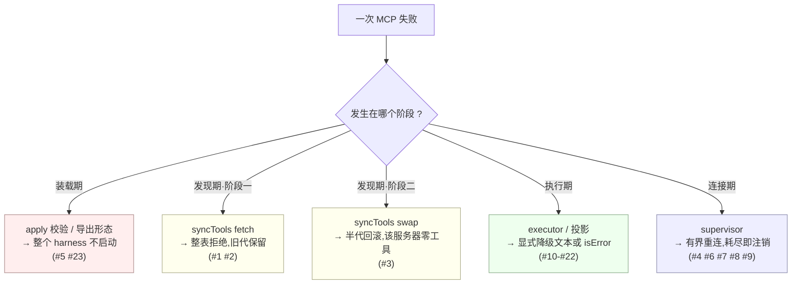

# 06 · 测试体系与失败模式

> 源码:`packages/mcp/mcp-client/tests/`(7 个文件)+ `apps/cli/tests/profiles/headless/tests/mcp-pagination.expected.e2e.ts`
> 上游:第六章无对应小节;官方注记的 Testing 段见 `.agents/notes/implemented/feature/2026-07-07-mcp-client-plugin.md:206-212`

---

## 一、测试分层总览

MCP 桥接的测试按"能表达该行为的最便宜层级"分布,共五个层级:

| 层级 | 文件 | 行数 | 是否 mock SDK | 是否 spawn 进程 | 覆盖什么 |
|---|---|---|---|---|---|
| 单元(MCP 桥) | `tests/mcp-client.spec.ts` | 1300 | 手写替身 / `InMemoryTransport` | 否 | 命名、同步、执行、投影、图片准入、传输构造 |
| 单元(生命周期) | `tests/apply.spec.ts` | 461 | `vi.mock` SDK | 否 | `apply` 的装载语义与通知路径 |
| 单元(监管器) | `tests/reconnect.spec.ts` | 521 | `vi.mock` SDK | 否 | 监管器的每条失败分支与策略校验 |
| 装载路径守卫 | `tests/load-path.spec.ts` | 29 | 否(真实 Loader 原型) | 否 | 命名空间插件导出形态 |
| E2E(协议) | `tests/mcp-client.e2e.ts` | 563 | 否(真实协议) | **是** | stdio / HTTP 真实往返、自治崩溃恢复 |
| E2E(出口) | `tests/egress.spec.ts` | 41 | 否 | 否(本地假代理) | streamable-http 的代理路由 |
| Profile 级 | `apps/cli/tests/profiles/headless/tests/mcp-pagination.expected.e2e.ts` | 30 | 否 | **是**(真实 CLI) | 启动诊断文案与退出码 |

夹具与补丁:

| 文件 | 用途 |
|---|---|
| `tests/fixture-server.ts`(76) | stdio 夹具服务器:6 个受控工具(含 `.` 名、崩溃工具、图片工具) |
| `tests/http-fixture.ts`(52) | 无密钥的 stateless Streamable HTTP 端点 |
| `tests/fixtures/repeated-cursor-server.ts`(18) | 线上重复 cursor 的服务器 |
| `tests/fixtures/repeated-cursor.patch.yml`(17) | 把该服务器插入 headless profile 的 overlay |

覆盖率门槛是**每文件 100%**(仓库 CI 门 `pnpm run test:coverage`),这也解释了源码里两处 `/* v8 ignore */` 的存在:`connection.ts:321`(防御性的 `firstAttemptError` 兜底)与 `packages/acp/acp/src/mcp.ts:139`(Schemastery 一定抛 `Error` 的兜底)。两处都写了理由,不是无条件忽略。

---

## 二、各 spec 覆盖内容

### 2.1 `mcp-client.spec.ts`(6 个 describe)

| describe | 位置 | 覆盖 |
|---|---|---|
| `publicToolName` | `155-182` | 干净路径、替换+哈希、截断+哈希到 64、确定性、不同身份不坍缩 |
| `syncTools` | `184-431` | 命名注册与 rawName 不注册、跨服务器同名共存、与原生工具共存、重复工具名拒绝、fetch 失败保留旧代、命名空间抢占回滚、换代注销、分页 drain、两种 cursor 环、环后仍可继续并可恢复、**SDK 缓存无关性** |
| `tool execution` | `433-971` | rawName 上线、多文本合并、混合图片保序、六步图片准入、批级原子降级、策略改写优先、原始块、`structuredContent` 校验与降级、`isError`、taskSupport、signal、legacy 三形态 |
| `tool execution edge cases` | `973-1163` | audio / embedded resource / resource_link(完整与残缺)/ 未知类型 / 缺 `mimeType` / 缺 `text` / 空数组 / legacy 空值 / 非文本 isError / 有描述与无描述 |
| `createTransport` | `1165-1260` | 三种配置构造、清洗与显式 env 不抛异常 |
| `tool execution — non-object args fallback` | `1262-1300` | `null` 与裸字符串参数兜底为 `{}` |

其中"SDK 缓存无关性"(`356-430`)是全套里构造最讲究的一个:它用 `InMemoryTransport.createLinkedPair()`(`mcp-client.spec.ts:357`)手工应答 JSON-RPC,让第一页返回**合法**的 `outputSchema`、第二页返回**含 `patternProperties` 的未知词汇**,从而证明"桥的校验权独立于 SDK 的按页缓存":

```typescript
const [clientTransport, serverTransport] = InMemoryTransport.createLinkedPair()
serverTransport.onmessage = (message) => { … }
…
expect(missing.error).toMatchObject({ info: { code: 'INVALID_TOOL_OUTPUT' } })
const fallback = await ctx.tools.execute({ …, name: 'mcp__srv__future-schema', … })
expect(fallback.value).toEqual({ content: [42, null], structuredContent: ['kept', { nested: true }] })
```

### 2.2 `apply.spec.ts`(2 个 describe)

| describe | 位置 | 覆盖 |
|---|---|---|
| `mcp-client plugin module exports` | `91-155` | `name`/`inject`/`Config` 导出、`serverName` 缺失与非法、reconnect 默认值与部分覆盖、非法 reconnect 拒绝 |
| `apply (plugin lifecycle)` | `157-461` | 连接+同步+通知处理器注册、激活阻塞语义、重复 `serverName` 拒绝且首个实例完好、跨 scope 复用命名空间、dispose 释放预订、跨 app root 隔离、连接失败不注册工具、严格启动拒绝、启动期注册冲突、cursor 环导致启动失败、早到通知不消费严格语义、通知重同步、失败重同步保留旧代、环后可继续、**effect disposer 注销"当前"代**、close 抛错不阻断 dispose、HTTP 配置路径 |

"激活阻塞语义"的测试手法值得单独看(`apply.spec.ts:185-202`):它把 `connect` 挂在一个可控 gate 上,然后断言在 gate 打开**之前** fiber 未激活、工具未注册:

```typescript
const fiber = ctx.plugin({ name: 'mcp-client-lifecycle', inject, apply }, stdioConfig)
await vi.waitFor(() => { expect(mockConnect).toHaveBeenCalled() })
expect(activated).toBe(false)
expect(ctx.tools.get('mcp__srv__remote')).toBeUndefined()
connection.resolve()
await activation
expect(ctx.tools.get('mcp__srv__remote')).toBeDefined()
```

### 2.3 `reconnect.spec.ts`(2 个 describe)

| describe | 位置 | 覆盖 |
|---|---|---|
| `reconnect supervisor` | `124-475` | 崩溃后重连并换代、触顶注销、放弃与在途同步竞态、未观测 close 不起新代、永不 close 即停重连、dispose 抑制日志、dispose 有界、dispose 取消退避、dispose 后 onclose 无操作、`enabled:false` 两种终态、稳定窗口重置预算、崩溃循环耗尽、每次尝试恰好一次重试、死代际不同步、dispose 平息在途同步、dispose 引发失败保持沉默、过期通知被忽略 |
| `resolveReconnectPolicy` | `479-521` | 默认值+冻结、显式值、未知键、越界延迟、上限关系、非正整数次数、`apply` 加载期硬失败 |

三个可复用的测试手法:

1. **代际计数**:`instances: MockClient[]`(`reconnect.spec.ts:43`)由 mock 构造函数压入,于是 `expect(instances).toHaveLength(2)` 直接就是"起了几个代际"的断言。
2. **分级日志捕获**(`reconnect.spec.ts:85-93`):覆写 `ctx.logger.warn/error/info` 把消息按级别收集,再用 `warns.some(line => line.includes('reconnecting in 5ms (attempt 1/5)'))` 断言**面向用户的可观测事实**,而不只是内部状态。
3. **假定时器精确复现 5 秒窗口**(`reconnect.spec.ts:243-259, 277-297`):`vi.useFakeTimers()` + `vi.advanceTimersByTimeAsync(5_000)` 让"关闭屏障超时"这条路径可确定地触发,而不必真的等 5 秒。

### 2.4 `mcp-client.e2e.ts`(7 个 describe)

| describe | 位置 | 服务器 | 覆盖 |
|---|---|---|---|
| `fixture server — controlled scenarios` | `96-194` | 本地夹具(stdio) | 命名空间发现、含点名归一、执行 `admin.reset`/`add`/`greet`/`fail`/`image`、真实附件库落盘与读回 |
| `fixture server — duplicate serverName` | `196-216` | 同上 | 同 root 第二实例拒绝 |
| `fixture server — disposal` | `218-240` | 同上 | dispose 无异常 |
| `fixture server — crash recovery` | `242-321` | 同上 | `crash` 工具杀掉真实子进程 → 自动重连 → **用结果证明恢复**;卸载时不等完退避 |
| `server-everything — official test server` | `325-385` | `@modelcontextprotocol/server-everything` | 官方测试服务器的发现与执行、无附件库时的图片显式拒绝 |
| `server-filesystem — real filesystem operations` | `389-456` | `@modelcontextprotocol/server-filesystem` | 写盘后**独立读盘**校验、读回、列目录 |
| `streamable-http — in-process MCP server` | `460-563` | 进程内 `StreamableHTTPServerTransport` | HTTP 发现与执行、每次请求都带 header |

两处"证据强度"的设计值得记录:

- **恢复由世界证明,不由返回值证明**(`mcp-client.e2e.ts:274-283`):

  ```typescript
  // Recovery is proven by the world: a post-crash call round-trips through
  // the respawned server process.
  await vi.waitFor(async () => {
    const after = await ctx.tools.execute({ …, name: 'mcp__crashy__add', arguments: { a: 20, b: 22 } })
    expect(textOf(after.content[0])).toBe('42')
  }, { timeout: 15_000, interval: 250 })
  ```

- **副作用独立校验**(`mcp-client.e2e.ts:434-436`):`write_file` 之后不信工具结果,直接 `readFile(filePath, 'utf8')` 断言磁盘:

  ```typescript
  // Assert the filesystem effect independently of the tool result.
  const onDisk = await readFile(filePath, 'utf8')
  expect(onDisk).toBe(content)
  ```

- **图片的双重隔离断言**(`mcp-client.e2e.ts:190-192`):`value` 里有 base64,`content` 里没有:

  ```typescript
  expect(JSON.stringify(result.value)).toContain('iVBORw0KGgo')
  expect(JSON.stringify(result.content)).not.toContain('iVBORw0KGgo')
  ```

### 2.5 `load-path.spec.ts`:导出形态守卫

`tests/load-path.spec.ts:17-29` 是一个**针对性防御**测试,文件头注释交代了它防的历史事故:

```typescript
/**
 * `mcp-client` is a NAMESPACE plugin with `inject` — so a stray
 * `export default apply` would make the cordis Loader's `unwrapExports`
 * (`exports.default ?? exports`) collapse the module to the bare `apply`
 * function, DROPPING `inject`. The plugin would then read `ctx.tools` without
 * having injected it and throw `cannot get property … without inject` the
 * moment it loads (postmortem 0001).
 */
```

断言直接走**真实的** `Loader.prototype.unwrapExports`,而不是复刻它的行为:

```typescript
const loader = Object.create(Loader.prototype) as Loader
const unwrapped = loader.unwrapExports(mcpClient) as Record<string, unknown>
expect(unwrapped).toBe(mcpClient)
expect(unwrapped.name).toBe('mcp-client')
expect(unwrapped.inject).toEqual(['tools'])
```

### 2.6 `egress.spec.ts`:出口最小复现

见 [05 §4.3](./05-transport-and-security.md)。

### 2.7 Profile 级:`mcp-pagination.expected.e2e.ts`

`apps/cli/tests/profiles/headless/tests/mcp-pagination.expected.e2e.ts:11-30` 把故障推进到**真实 CLI 进程**:

```typescript
it('reports a repeated MCP discovery cursor and exits before starting a turn', async () => {
  const { stdout, stderr } = await runLoaderSmoke({
    label: 'MCP discovery pagination cycle',
    binScript: fileURLToPath(new URL('../../../../src/bin.ts', import.meta.url)),
    libBinScript: fileURLToPath(new URL('../../../../lib/bin.js', import.meta.url)),
    configPath,
    binArgs: ['--profile', 'headless', '--patch', configPath, 'unreachable task'],
    expectedExitCode: 1,
    env: { DSH_MCP_PAGINATION_FIXTURE: fileURLToPath(new URL('repeated-cursor-server.ts', fixtureRoot)), DSH_TELEMETRY_DISABLED: '1' },
  })
  expect(stdout).toBe('')
  expect(stderr).toContain('initial connection or tool synchronization failed')
  const cause = stderr.split('\n').find(line => line.startsWith('Error: mcp-client(pagination-cycle):'))
  await expect(`${cause}\n`).toMatchFileSnapshot(expectedPath)
}, LOADER_SMOKE_TEST_TIMEOUT_MS)
```

它一次性钉住四件事:

| 断言 | 证明 |
|---|---|
| `expectedExitCode: 1` | `failOnStartupError: true` 让整台 harness 拒绝启动 |
| `stdout` 为空 | 一个 turn 都没开始 |
| `stderr` 含 `initial connection or tool synchronization failed` | `apply` 的**外层**消息到达用户 |
| `stderr-cause.txt` 快照 | **内层 cause 的逐字文本**被冻结 |

快照内容(`apps/cli/tests/profiles/headless/tests/expected/mcp-pagination/stderr-cause.txt`):

```text
Error: mcp-client(pagination-cycle): server repeated a tools/list continuation cursor — invalid tool list
```

这条测试同时是"`{ cause: outcome.error }` 会被打印出来"的证据——`apply` 用 `new Error(msg, { cause })`(`index.ts:186`),运维看到的不只是一句笼统的失败。

---

## 三、失败模式清单

失败发生在哪个阶段,决定了它的语义与可恢复性。下图的分类是后面那张 23 行清单的索引:



<details><summary>Mermaid 源码</summary>



</details>

下表是 MCP 桥接的全部分支终态。**"显式语义"一列描述的是调用方/用户可依赖的行为**,不是实现细节。

| # | 失败模式 | 触发 | 显式语义 | 模型是否可见 | 代码位置 | 测试 |
|---|---|---|---|---|---|---|
| 1 | 同一服务器列出同名工具两次 | 服务器返回重复 `rawName`(或归一后撞名) | 整表 reject:`server listed tool "<raw>" more than once — invalid tool list`;**旧代保留**、注册表未动 | 否(旧工具表继续服务) | `tools.ts:158-162` | `mcp-client.spec.ts:236-246` |
| 2 | 分页 cursor 重复 | 服务器返回已见过的非空 `nextCursor`(含跨空页的环) | 整表 reject:`server repeated a tools/list continuation cursor — invalid tool list`;旧代保留;**下次同步仍可成功** | 否 | `tools.ts:175-183` | `mcp-client.spec.ts:312-354`、`apply.spec.ts:306-326` |
| 3 | 注册冲突(命名空间被抢占) | 外部注册占用 `mcp__<serverName>__*` | 半代回滚(本服务器**零工具**)+ `logger.error`;`contain` 模式吞下,`throw` 模式向启动路径上抛 | 否(该服务器工具全部消失) | `tools.ts:193-201` | `mcp-client.spec.ts:260-281`、`apply.spec.ts:284-304` |
| 4 | 首次连接失败 · `failOnStartupError:false` | `connect()` reject | 记 warn、工具零注册、进入重连循环;harness 照常启动 | 该服务器工具不出现 | `connection.ts:279-296`、`index.ts:184-187` | `apply.spec.ts:252-265` |
| 5 | 首次连接失败 · `failOnStartupError:true` | 同上 | `apply` throw `mcp-client(<n>): initial connection or tool synchronization failed`(带 cause);Cordis 回滚 fiber、已开客户端被关闭 | 整个 harness 不启动 | `index.ts:184-187` | `apply.spec.ts:267-282`、`mcp-pagination.expected.e2e.ts` |
| 6 | 重连尝试耗尽预算 | `failedAttempts > maxAttempts` | **注销该服务器全部工具** + `giving up after N consecutive failed reconnect attempts`;恢复只能靠 HMR/重启 | 工具从工具表消失 | `connection.ts:206-214` | `reconnect.spec.ts:173-197,365-382` |
| 7 | `reconnect.enabled:false` 且掉线 | 断连 | 只记 error(`connection lost and reconnect is disabled`);**工具保留在注册表**,调用必失败 | 工具仍在,调用失败 | `connection.ts:194-200` | `reconnect.spec.ts:325-336` |
| 8 | 失败代际在 5 秒内不报告关闭 | transport 卡死 | **停止重连**(不注销工具)以防子进程重叠;`reconnect stopped to avoid overlapping server processes` | 视情形(未连上则无工具) | `connection.ts:288-293` | `reconnect.spec.ts:243-259` |
| 9 | dispose 期间代际不关闭 | 同上 | 只记 `server shutdown may be incomplete`,dispose 继续走完 | 无 | `connection.ts:339-341` | `reconnect.spec.ts:277-297` |
| 10 | 工具要求任务式执行 | `execution.taskSupport === 'required'` | **调用期** throw;不发起任何网络请求;工具仍注册 | 是:`isError` 结果,消息含 `requires task-based execution` | `tools.ts:322-324` | `mcp-client.spec.ts:892-906` |
| 11 | 服务器返回 `isError:true` | 任意形态(text / 非文本 / legacy) | throw → 注册表产出 `isError` 结果,文本为 `Error: <服务器文本>`;**先于任何图片落盘** | 是 | `tools.ts:338,354-356` | `mcp-client.spec.ts:878-890,958-970,1127-1141` |
| 12 | 图片解码失败(媒体类型 / base64) | 任一块非法 | **整批**降级为诊断文本,零落盘;失败块报自身原因,其余报 `another image in the same result was invalid` | 是(诊断文本) | `tools.ts:389-401,462-470` | `mcp-client.spec.ts:556-607` |
| 13 | 未挂载附件库 | 无 `ctx.attachments` | 整批降级,原因 `no attachment store is mounted`;规范值仍保留原图 | 是(诊断文本) | `tools.ts:410-411` | `mcp-client.spec.ts:532-554` |
| 14 | 模型路由不可解析 / 不可验证 | 缺 provider/model/llm,或 `resolveModelInfo` 抛错 | 整批降级,原因分别为 `the current model route could not be resolved` / `… could not be verified` | 是 | `tools.ts:412-424` | `mcp-client.spec.ts:637-687` |
| 15 | 模型未声明图像输入 | `inputModalities` 缺 `image` 或字段缺失 | 整批降级,原因 `model "<m>" does not declare image input` | 是 | `tools.ts:425-427` | `mcp-client.spec.ts:609-627,677-687` |
| 16 | 取消发生在入库前 | `exec.signal.aborted` | 桥侧拒绝落盘;注册表的取消契约产出 `Error: tool call aborted` | 是 | `tools.ts:428` | `mcp-client.spec.ts:689-704` |
| 17 | 附件库拒绝批次 | `AttachmentError` 且码属准入集合 | 降级,原因 `image admission rejected the result: <msg>` | 是 | `tools.ts:489-491` | `mcp-client.spec.ts:726-747` |
| 18 | 附件库存储故障 | 非准入码的异常 | 降级,原因 `durable image storage rejected the result`(与 #17 文案可区分) | 是 | `tools.ts:490-491` | `mcp-client.spec.ts:706-724` |
| 19 | 服务器发布了不受支持的 `outputSchema` | 含 harness 子集外的词汇 | **不拒绝工具**;`structuredContent` 降级为 `JsonValue`,不参与校验 | 否 | `tools.ts:231-239` | `mcp-client.spec.ts:863-876` |
| 20 | 服务器声明了受支持 schema 但内容不符 | `structuredContent` 缺字段/类型错 | 注册表判 `INVALID_TOOL_OUTPUT`,`isError` 结果带字段路径 | 是 | `tools.ts:285-295` | `mcp-client.spec.ts:835-861` |
| 21 | 服务器返回非对象/未知内容块 | `42` / `video` / 缺字段 | 逐个映射为显式诊断文本,规范值保留原块 | 是(诊断文本) | `tools.ts:534-563` | `mcp-client.spec.ts:814-833,1036-1076` |
| 22 | 模型参数非对象 | `arguments` 为 `null`/字符串/数字 | 兜底为 `{}`,交给服务器产出"缺少必填参数" | 视服务器 | `tools.ts:329` | `mcp-client.spec.ts:1262-1300` |
| 23 | 插件导出形态被破坏 | 误加 `export default` | 装载期即失败(`inject` 丢失) | 整个 harness 不启动 | `load-path.spec.ts` 守卫的契约 | `load-path.spec.ts:17-29` |

### 3.1 三条横向规律

1. **"发现期"的失败都是全有或全无**,从不产生部分工具表(#1、#2、#3)。因此模型永远不会看到一个"看起来正常但缺了一半"的服务器。
2. **"执行期"的失败都是显式降级**,从不静默(#10–#22)。诊断文本的固定句式是 `[<什么不可用>: <为什么>; <原始数据在哪>]`,让模型能判断"是服务器没给"还是"harness 不让"。
3. **失败的消息文本是被测试冻结的产品面**,不是实现细节。它们出现在 `logger.*` 调用、`Error` 消息与快照文件里,`reconnect.spec.ts` 用 `line.includes(...)` 逐条断言、`stderr-cause.txt` 逐字快照。

---

## 四、测试没有覆盖什么(诚实清单)

| 未覆盖项 | 原因 / 出处 |
|---|---|
| `StdioClientTransport` 实际收到的 env 内容 | `mcp-client.spec.ts:1231-1232` 注释:`StdioClientTransport` 把 env 设为私有;测试只能断言构造不抛异常 |
| 桥侧的连接/发现超时 | 不存在该配置;README "Known Limitations" 明确说超时继承自 SDK 的 60 秒请求默认值 |
| Streamable HTTP 的**连接级**重连 | README 说明 HTTP 失败按请求由 SDK 自身恢复,监管器只响应 transport close |
| 持续返回**不同** cursor 的服务器 | 官方注记:`2026-07-07-mcp-client-plugin.md:105`——"this detects repeated cursors; it does not bound a server that continually returns distinct cursors" |
| MCP Resources / Prompts | 未桥接,非缺陷 |
| 第三方服务器包在快照测试里 | 官方注记:快照必须保持无密钥与确定性,第三方 server 包只在包级 e2e 里启动 |

---

## 五、关键文件 / 符号索引表

| 文件 | 行数 | 定位 |
|---|---|---|
| `tests/mcp-client.spec.ts` | 1300 | 桥的全部单元行为 |
| `tests/reconnect.spec.ts` | 521 | 监管器的全部失败分支 |
| `tests/apply.spec.ts` | 461 | 插件生命周期与激活语义 |
| `tests/mcp-client.e2e.ts` | 563 | 真实协议的键路径 e2e |
| `tests/load-path.spec.ts` | 29 | 导出形态守卫(真实 Loader) |
| `tests/egress.spec.ts` | 41 | 代理出口 |
| `tests/fixture-server.ts` | 76 | stdio 夹具(6 个受控工具) |
| `tests/http-fixture.ts` | 52 | stateless HTTP 夹具 |
| `tests/fixtures/repeated-cursor-server.ts` | 18 | 重复 cursor 的线上服务器 |
| `tests/fixtures/repeated-cursor.patch.yml` | 17 | headless profile overlay |
| `apps/cli/tests/profiles/headless/tests/mcp-pagination.expected.e2e.ts` | 30 | 真实 CLI 的启动诊断 |
| `apps/cli/tests/profiles/headless/tests/expected/mcp-pagination/stderr-cause.txt` | 1 | 内层 cause 的逐字快照 |

### 夹具服务器暴露的工具(`tests/fixture-server.ts`)

| 工具 | 位置 | 用途 |
|---|---|---|
| `add` | `17-23` | 正常执行与崩溃后重连的探针(`2+3 → "5"`、`20+22 → "42"`) |
| `greet` | `25-31` | 参数透传(`"World" → "Hello, World!"`) |
| `fail` | `33-40` | `isError: true` 的真实协议路径 |
| `image` | `42-52` | 文本-图片-文本 三段顺序 + 真实附件库 |
| `crash` | `54-63` | 应答后 `process.exit(7)`,驱动崩溃恢复 |
| `admin.reset` | `65-73` | 含点名字的归一 + 哈希端到端 |

`crash` 的写法特意对齐真实崩溃时序(`fixture-server.ts:59-61`):

```typescript
// Exit AFTER the response flushes so the caller observes a clean result
// followed by a transport close, like a real post-reply crash.
setTimeout(() => process.exit(7), 25)
```
