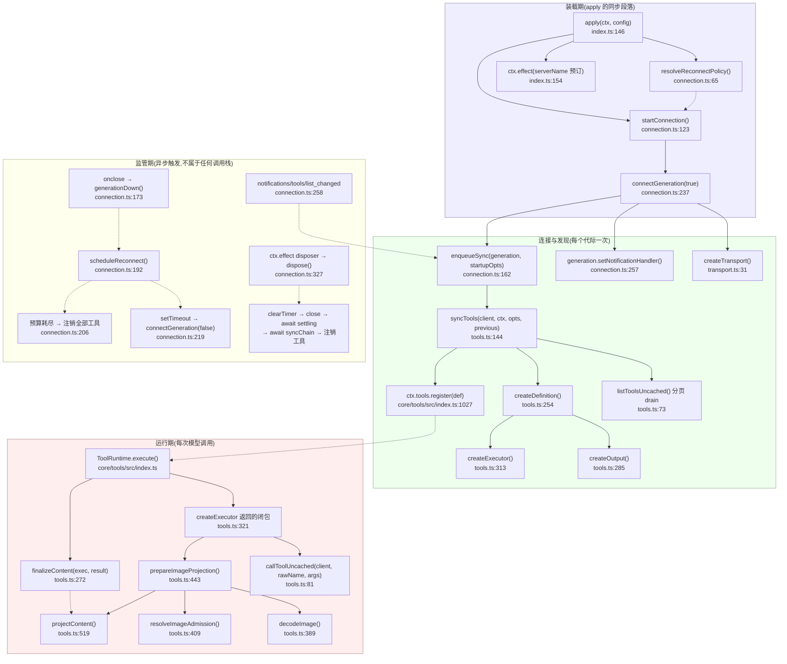

# MCP 模块 · 函数级深化分析

> 分析对象:[innokria/deepseek-harness](https://github.com/innokria/deepseek-harness) @ `dbbaa4a37`
> 范围:`packages/mcp/mcp-client/src/`(4 个源文件,共 1018 行)+ `packages/acp/acp/src/mcp.ts` + 相关测试与上游契约

---

## 一、怎么读

| 想知道 | 读 |
|---|---|
| MCP 在 DSH 里是什么、为什么这么设计、与 Claude Code 的差异 | [第六章](../06-mcp.md) |
| `syncTools()` 的每一行在防什么、`registrationFailure` 两个值分别谁在用 | [`01`](./01-discovery-and-sync.md) |
| 输入 `('srv', 'admin.reset')` 到底算出什么字符串、哈希是多少 | [`02`](./02-naming-algorithm.md) |
| `isError` 为什么必须 throw、图片准入链每一步拒了会怎样 | [`03`](./03-execution-and-result-mapping.md) |
| 崩溃循环第几次放弃、`dispose()` 等谁先等谁 | [`04`](./04-connection-supervisor.md) |
| 哪些环境变量被剔除、HTTP 出口走不走代理 | [`05`](./05-transport-and-security.md) |
| 每个 spec 文件覆盖了什么行为 | [`06`](./06-testing-and-failure-modes.md) |

---

## 二、MCP 桥接的函数级调用栈

下图是本章的骨架:从 Cordis 装载到一次 `tools/call` 上线的**全部函数跨度**,标注真实定义位置。实线是同步调用链,虚线是跨代际的解耦点(通知、定时器、注册表回调)。

Mermaid 源码

读图要点:

1. **只有一个入口产出工具定义**:`syncTools()` → `createDefinition()`。executor 的 `rawName`、`projections` WeakMap 都是在这一步闭包捕获的,此后永不改变。
2. **`execute` 与 `finalizeContent` 是同一代际的一对**:`projections` 是 `createDefinition` 函数体内的局部变量(`tools.ts:265`),代际替换即整体丢弃,旧代不可能消费新执行的状态。
3. **监管期不在任何调用栈上**:重连、通知、dispose 都由事件/定时器驱动,通过 `isCurrent()`(`connection.ts:153`)与 `syncChain`(`connection.ts:161`)两个闸门回到主线。

---

## 三、分册索引

| 文件 | 覆盖符号(真实位置) | 一句话 |
|---|---|---|
| [`01-discovery-and-sync.md`](./01-discovery-and-sync.md) | `syncTools` `tools.ts:144`、`listToolsUncached` `tools.ts:73`、`createDefinition` `tools.ts:254`、`supportedOutputSchema` `tools.ts:231`、`enqueueSync`/`syncChain` `connection.ts:161`、通知处理器 `connection.ts:257` | 两阶段同步的逐行走查:分页 drain、两类非法列表检测、代际 swap 与冲突回滚、`registrationFailure` 两种模式的真实使用点 |
| [`02-naming-algorithm.md`](./02-naming-algorithm.md) | `publicToolName` `tools.ts:112`、常量 `tools.ts:46-56`、`serverName` 模式 `index.ts:38` | 完整算法推演 + 真实输入→输出示例表(含实测哈希)、128 字符/含点/跨服务器同名/serverName 上限四类边界、rawName 只上线的实现位置 |
| [`03-execution-and-result-mapping.md`](./03-execution-and-result-mapping.md) | `createExecutor` `tools.ts:313`、`callToolUncached` `tools.ts:81`、`extractText` `tools.ts:507`、`projectContent` `tools.ts:519`、`decodeImage` `tools.ts:389`、`resolveImageAdmission` `tools.ts:409`、`prepareImageProjection` `tools.ts:443`、`finalizeContent` `tools.ts:272` | taskSupport 拒绝、参数容错、legacy 归一、`isError`→throw 的理由、块级映射规则、图片严格解码与双 `isDeepStrictEqual` 守卫 |
| [`04-connection-supervisor.md`](./04-connection-supervisor.md) | `resolveReconnectPolicy` `connection.ts:65`、`RECONNECT_DEFAULTS` `connection.ts:40`、`isCurrent` `connection.ts:153`、`connectGeneration` `connection.ts:237`、`generationDown` `connection.ts:173`、`scheduleReconnect` `connection.ts:192`、`waitForClose` `connection.ts:181`、`dispose` `connection.ts:327` | 每条失败分支、预算与稳定窗口、5 秒关闭屏障、平息顺序,以及正常重连/崩溃循环/预算耗尽三张时序图 |
| [`05-transport-and-security.md`](./05-transport-and-security.md) | `createTransport` `transport.ts:31`、`buildChildEnv` `transport.ts:21`、`scrubbedParentEnv` `packages/subprocess/subprocess/src/index.ts:64`、`mountAcpMcpServers` `packages/acp/acp/src/mcp.ts:26`、`normalizeServerName` `packages/acp/acp/src/mcp.ts:111` | 两条传输路径的字段落点、环境清洗规则与显式 env 覆盖原理、streamable-http 头部与代理出口、ACP 挂载的六项校验 |
| [`06-testing-and-failure-modes.md`](./06-testing-and-failure-modes.md) | `tests/` 下 7 个 spec/fixture 文件 | 每个 spec 覆盖的行为矩阵 + 十类失败模式与其显式语义对照表 |

建议阅读顺序:`01 → 02 → 03`(发现与执行主干),再看 `04`(可靠性),最后 `05`/`06`(边界与证据)。

---

## 四、源文件与测试清单

| 文件 | 行数 | 职责 |
|---|---|---|
| `packages/mcp/mcp-client/src/index.ts` | 188 | 插件入口:`Config` 判别联合、`serverName` 作用域预订、激活阻塞 |
| `packages/mcp/mcp-client/src/connection.ts` | 351 | 连接监管:代际、重连预算、关闭屏障、平息式 dispose |
| `packages/mcp/mcp-client/src/tools.ts` | 569 | 工具桥:同步、命名、执行器、结果投影、图片准入 |
| `packages/mcp/mcp-client/src/transport.ts` | 50 | 传输工厂:stdio(环境清洗)/ streamable-http |
| `packages/mcp/mcp-client/tests/mcp-client.spec.ts` | 1300 | 单元:命名、同步、执行、投影、图片、传输 |
| `packages/mcp/mcp-client/tests/apply.spec.ts` | 461 | 单元:插件生命周期与激活语义(mock SDK) |
| `packages/mcp/mcp-client/tests/reconnect.spec.ts` | 521 | 单元:监管器全部失败分支与策略校验 |
| `packages/mcp/mcp-client/tests/mcp-client.e2e.ts` | 563 | 无密钥 e2e:真实 MCP 协议 + 官方服务器 + HTTP |
| `packages/mcp/mcp-client/tests/load-path.spec.ts` | 29 | 真实装载路径守卫(命名空间插件无 default export) |
| `packages/mcp/mcp-client/tests/egress.spec.ts` | 41 | streamable-http 代理出口 |
| `packages/mcp/mcp-client/tests/fixture-server.ts` / `http-fixture.ts` | 76 / 52 | stdio 与 HTTP 测试夹具服务器 |
| `packages/mcp/mcp-client/tests/fixtures/repeated-cursor-server.ts` | 18 | 重复 cursor 的线上夹具 + 快照 overlay |

---

## 五、术语约定

| 术语 | 含义 | 首次定义位置 |
|---|---|---|
| 代际(generation) | 一个 `Client` + 一个 transport 的组合;重连必须整体换新 | `connection.ts:237` |
| 公开名(publicName) | 模型可见、注册表唯一的 `mcp__<server>__<raw>` 形态 | `tools.ts:112` |
| 原始名(rawName) | MCP `Tool.name` 原文,只出现在 `tools/call` 的线上载荷 | `tools.ts:8-10` |
| 平息(quiesce) | dispose 不只发信号,而是等待进行中工作真正停下 | `connection.ts:343-346` |
| 稳定窗口 | 连接存活 ≥ `maxDelayMs` 即判定上一次 outage 结束、重开预算 | `connection.ts:203` |
| 规范值(canonical value) | `{ content: JsonValue[], structuredContent? }`,PTC 模式看到的完整协议块 | `tools.ts:41-44` |
| 投影(projection) | 规范值 → 核心 `ContentBlock[]` 的有序映射,模型上下文看到的形态 | `tools.ts:519` |

---

## 声明

DeepSeek Harness 的所有权利归其原权利人所有,任何错漏以仓库源码与官方文档为准。
