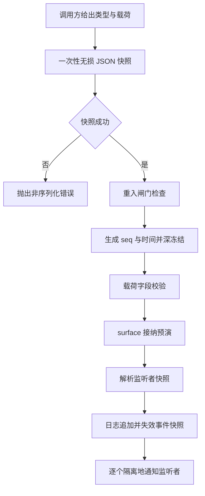

# 01 · 事件日志

一次会话的全部内容最终都压缩成一条条 JSON 事件:`SessionEventMap` 声明词汇,`append()` 是唯一写入入口,`seq` 是唯一位置。这篇讲三件事:词汇怎么被插件扩展、信封每个字段在拒绝什么、以及 `append()` 从入参到广播之间究竟按什么顺序做了哪些检查。最后回答一个看起来像口号、实际是工程约束的问题——为什么"模型可见 ⟺ 已落日志"必须成立。

---

## 一、词汇表是声明合并出来的

`SessionEventMap` 是一个空壳 `interface`,核心只声明十三个成员,其余全部由插件在自己的包里补齐:

```typescript
// packages/core/session/src/types.ts:263-310(节选)
/**
 * The merge-extensible, append-only source of truth for an agent interaction.
 * Message history is derived from this log. Every event is lossless JSON and
 * sequence numbers stay contiguous. Assistant attempt events embed their exact
 * compact raw streams so persistence stores one durable settlement per attempt.
 */
export interface SessionEventMap {
  // ...(略):270-289 行是 turn/start、turn/end、step/start、step/end 四个边界事件
  /**
   * A user-role message on the model-visible surface: a direct human prompt
   * (the queued message claimed for this turn), a synthetic `agent.inject()`
   * context (file-change notices, subdir AGENTS.md, skill content, cron
   * notifications, …), or an entered goal continuation round. All three
   * project their `content` verbatim; `source` tells them apart.
   */
  'user/message': UserMessage
  // ...(略):298-309 行是 system/message 的完整读者契约注释
  'system/message': { turn: number; step: number; message: SystemMessage }
}
```

十三个核心成员是:`turn/start` `turn/end` `step/start` `step/end` 四个边界,`user/message` `system/message` `assistant/message` `tool/result` 四个 surface 事件,`assistant/attempt` `tool/call` 两条执行记录,`request/header` `request/context` 两个请求锚,以及 `session/end-seed` 一条 seed 边界投影。

扩展方在自己的包里写 `declare module`,不需要改核心包一行代码。压缩模块给出的例子最完整——它在同一个块里补了四个事件,还顺带说明了为什么这些事件**不进** surface:

```typescript
// packages/compaction/compaction/src/types.ts:17-24
declare module '@deepseek-ai/dsh-session/types' {
  interface SessionEventMap {
    /**
     * Marks the start of a compaction — log-only, holds the lock until
     * `compaction/end`. A numbered owner is strictly enclosed by that open turn;
     * `null` identifies a standalone manual transaction between turns.
     */
    'compaction/start': { compactionId: CompactionId; sourceCommandId?: CommandId; turn: number | null }
```

同类扩展还出现在:`session/title`(`session-title/src/index.ts`)、`todo/write`(`tool-todo/src/types.ts`)、`goal/change`(`goal/src/domain.ts`)、`sandbox/mode`(`sandbox-policy/src/session-mode.ts`)、`plan/mode`、`schedule/change` 等等。**新增一个普通事件类型不 bump 格式版本**——`SESSION_FORMAT_VERSION` 只在结构性变化(header 形状、事件信封、核心事件语义、surface 机制)时递增,词汇增长由信封上的 `ignorable` 标记兜底:

```typescript
// packages/core/session/src/types.ts:66-88
/**
 * Current logical Session format version, stamped into every newly written
 * {@link SessionHeader}. Current Session and persistence code accept only this
 * value; header-only readers classify supported historical formats, while an
 * event-body read composes the build-static adjacent chain and publishes only
 * this final generation before constructing a Session.
 *
 * The version is a single monotonic integer with no major/minor split. Whether
 * a bump is needed is decided by what the WRITER emits, never by what a newer
 * reader can accept: bump exactly when an older runtime could no longer handle
 * a new log with full semantic correctness ("parses without error" is not
 * correctness — silently skipping content that shapes reconstruction is a
 * wrong read). Only structural changes reach that bar: the header shape, the
 * {@link SessionEvent} envelope, core event semantics, or the surface
 * mechanism (the {@link SurfaceEventType} set and {@link SurfaceOp} variants).
 * Adding an ordinary event type does not bump — the per-event
 * {@link SessionEvent.ignorable} guard covers vocabulary growth instead. When
 * in doubt, bump: a near-identity upgrade step is almost free, a missed bump
 * makes older runtimes read new logs wrong silently. The released migration,
 * immutable prior-generation, and current fast-path rules are recorded in
 * `.agents/notes/implemented/architecture/2026-08-31-released-session-format-migrations.md`.
 */
export const SESSION_FORMAT_VERSION = 3
```

本构建认识的词汇被固化成一个生成文件,共 56 个类型名,由 `pnpm run verify-persistence-catalog` 保证与源码同步:

```typescript
// packages/core/session/src/known-event-types.ts:22-27
export const KNOWN_SESSION_EVENT_TYPES: ReadonlySet<string> = new Set([
  'agent-preset/selected',
  'agent/inbox/spliced',
  'approval/asked',
  'approval/decided',
  'approval/policy',
```

---

## 二、信封:七个字段各自的职责

| 字段 | 类型 | 谁写 | 拒绝规则 |
|---|---|---|---|
| `type` | `SessionEventType` | 调用方 | 必须在 `SessionEventMap` 里;运行期还要过 `KNOWN_SESSION_EVENT_TYPES` 门 |
| `seq` | `SessionSeq` | 日志 | 由 `SessionSeq(log.length)` 生成,所以等于日志长度;读侧要求从 0 连续 |
| `time` | `number` | 日志 | `Date.now()`;seed 边界要求非负安全整数 |
| `data` | `SessionEventMap[K]` | 调用方 | 必须无损 JSON;`append` 里一次性快照 |
| `ignorable` | `true?` | 调用方 | 只允许 `true` 或缺失;缺省表示"读者不认识就必须拒绝" |
| `surfaceOp` | `SurfaceOp?` | 调用方 | 仅 `SurfaceEventType` 可携带,其余类型编译期即被 `never` 挡掉 |
| `sourceEventSeqs` | `SessionSeq[]?` | 调用方 | 仅前三类 surface 事件可携带;`assistant/message` 编译期禁止 |

`ignorable` 的读者契约写得非常直白——它的默认值是"拒绝重建",而不是"跳过":

```typescript
// packages/core/session/src/types.ts:465-488(节选)
export type SessionEvent<T extends SessionEventType = SessionEventType> = {
  [K in SessionEventType]: {
    type: K
    /** Monotonic sequence number within the session. */
    seq: SessionSeq
    /** Unix epoch milliseconds. */
    time: number
    data: SessionEventMap[K]
    /**
     * Marks an event a reader may safely skip when it does not recognize
     * `type`. Absent means required: a reader meeting an unrecognized type
     * without this marker MUST refuse to reconstruct the session instead of
     * silently dropping the event, because an unrecognized required event may
     * change how the rest of the log is interpreted. A writer sets `true` only
     * on purely informational records whose loss cannot affect reconstruction;
     * defaulting to required means a forgotten marker over-refuses (an
     * inconvenience) rather than silently resuming a gutted session.
     */
    ignorable?: true
  } & (K extends SurfaceEventType ? SurfaceIntent<K> : {
    surfaceOp?: never
    sourceEventSeqs?: never
  })
}[T]
```

surface 元数据用条件类型钉在信封上,四个 message 事件必须带标记、其余事件编译期不许带:

```typescript
// packages/core/session/src/types.ts:406-450(节选)
export type SurfaceEventType =
  | 'system/message'
  | 'user/message'
  | 'assistant/message'
  | 'tool/result'
// ...(略)
export type SurfaceOp =
  | 'append'
  | { op: 'replace'; startSeq: SessionSeq; endSeq: SessionSeq }
// ...(略)
export type SurfaceIntent<T extends SurfaceEventType = SurfaceEventType> = {
  surfaceOp: SurfaceOp
} & (T extends 'assistant/message' ? {
  /** Assistant messages embed their provider stream instead of citing source events. */
  sourceEventSeqs?: never
} : {
  /** Complete non-empty set of known earlier source-event seqs. */
  sourceEventSeqs?: SessionSeq[]
})
```

---

## 三、`append()` 的提交路径

`Session.append()` 用一次遍历完成"读取 + 校验 + 拷贝",然后在**日志 push 之前**把所有能拒绝的都拒绝掉。顺序不可交换:深冻结在快照之后(冻结必须冻的是日志里那份),验证在 push 之前(失败不能留下半个 surface 状态),广播在 push 之后(`session/event` 的监听者看到的事件一定已经在日志里)。


<details><summary>Mermaid 源码</summary>



</details>

| 阶段 | 做了什么 | 关键调用(文件:行) |
|---|---|---|
| 载荷快照 | 一次迭代完成"读+校验+拷贝",带状态的 getter 无法对校验和存储给出两个值 | `snapshotJsonValue` `index.ts:720` |
| surface 元数据快照 | 同样一次性处理,失败时单独报"非 JSON 的 surface 元数据" | `index.ts:724` |
| 重入闸门 | 若同一 `Session` 正在发布上一次追加,直接拒绝,避免 seq 与实际顺序错位 | `index.ts:728-731` |
| 信封构造 | 深冻结一个含 `type`/`seq`/`time`/`data` 与已快照 surface 字段的新对象 | `index.ts:732-738` |
| 载荷语义校验 | 只查事件本地的矛盾:`request/header` 的空字段、`tool/result` 的 `error` 与 `isError` 一致性 | `validateSessionEventData` `index.ts:739` |
| surface 接纳预演 | 在不改动已提交 surface 的前提下验证这次转移合法(区间存在、来源完整、节点 0 保护) | `surfaceManager.validateNext` `index.ts:740` |
| 监听者解析 | 在 push **之前**解析出监听者快照,这样"监听者集合"与"事件已提交"是两个明确分离的时刻 | `collectSessionCallbacks` `index.ts:747` |
| 提交 | 唯一的 `log.push`,随后失效 `eventsSnapshot` 缓存 | `index.ts:749-750` |
| 通知 | 逐监听者 try/catch,同步抛出与 Promise 拒绝都被记录,绝不影响已提交的追加 | `invokeContainedSessionObservers` `index.ts:752` |
| 收尾 | finally 里清 `appending` 闸门;若期间有人请求 detach,此刻才真正执行 | `index.ts:755-760` |

```typescript
// packages/core/session/src/index.ts:710-753(节选)
  append<T extends SessionEventType>(
    type: T,
    data: SessionEventMap[T],
    ...opts: T extends SurfaceEventType ? [opts: SurfaceIntent<T>] : []
  ): SessionEvent<T> {
    const surfaceOpts: SurfaceIntent | undefined = opts[0]
    const surfaceMetadata = {
      ...surfaceOpts?.sourceEventSeqs === undefined ? {} : { sourceEventSeqs: surfaceOpts.sourceEventSeqs },
      ...surfaceOpts?.surfaceOp === undefined ? {} : { surfaceOp: surfaceOpts.surfaceOp },
    }
    const dataSnapshot = snapshotJsonValue(data)
    if (dataSnapshot === undefined) {
      throw new Error(`session event "${type}" carries non-JSON-serializable data`)
    }
    const surfaceMetadataSnapshot = snapshotJsonValue(surfaceMetadata)
    if (surfaceMetadataSnapshot === undefined) {
      throw new Error(`session event "${type}" carries non-JSON-serializable surface metadata`)
    }
    const entry = attachments.get(this)
    if (entry?.appending) {
      throw new Error('session append cannot reenter while another append is being published')
    }
    // ...(略):深冻结信封、validateSessionEventData、surfaceManager.validateNext
    if (entry !== undefined) entry.appending = true
    try {
      let callbacks: SessionCallback[] | undefined
      const callbackArgs: unknown[] = [this, event]
      if (entry !== undefined) {
        callbacks = collectSessionCallbacks(entry.emitCtx, [entry.carrier, 'session/event', ...callbackArgs])
      }
      this.log.push(event as SessionEvent)
      this.eventsSnapshot = undefined
      if (callbacks !== undefined && entry !== undefined) {
        invokeContainedSessionObservers(entry.emitCtx, 'session/event', entry.id, callbackArgs, callbacks)
      }
      return event
    } finally {
      if (entry !== undefined) {
        entry.appending = false
        if (entry.detachRequested && !entry.announcing) entry.detach()
      }
    }
  }
```

`append()` 的可抛清单里,有一类是"日志之外的世界还不认识这个事件":非 JSON 载荷、非 JSON surface 元数据、重入、`request/header` 的空字段、`tool/result` 的失败元数据矛盾、以及 surface 接纳的整套契约。全部发生在 `log.push` 之前,所以**一次坏的追加不会让内存日志与磁盘产生分歧**——它压根没有进入日志。

<details><summary>信封的编译期约束:surface 元数据为什么只能挂在四类事件上</summary>

```typescript
// packages/core/session/src/types.ts:484-488
  } & (K extends SurfaceEventType ? SurfaceIntent<K> : {
    surfaceOp?: never
    sourceEventSeqs?: never
  })
}[T]
```

条件类型只在 `K` 是四个 surface 类型之一时展开成 `SurfaceIntent<K>`;其余分支把两个字段钉成 `never`,所以在 `append('turn/start', ...)` 上传第三个参数会直接编译失败,不需要任何运行期检查。

```text
SessionEvent<K>
├─ type: K                      判别式,switch 时收窄 data
├─ seq : SessionSeq             由 SessionSeq(log.length) 生成
├─ time: number                 Date.now()
├─ data: SessionEventMap[K]     载荷,必须无损 JSON
├─ ignorable?: true             缺省 = 读者不认识就必须拒绝重建
└─ (K 是 surface 类型时)
   ├─ surfaceOp: 'append' | { op: 'replace'; startSeq; endSeq }
   └─ sourceEventSeqs?: SessionSeq[]   仅 system/user/tool 三类可带
```

</details>

返回值是日志里那份冻结事件,不是调用方传进来的对象:

```typescript
// packages/core/session/src/index.ts:692-694(节选)
   * @returns the logged event — its assigned `seq`/`time` plus the SNAPSHOT of
   *   `data` that entered the log, so reading `event.data` back sees the logged
   *   value, never the caller's still-mutable input.
```

---

## 四、未知词汇的两侧拒绝

**读侧**(从磁盘或查询边界拿回事件)与**写侧**(直接构造事件)各有一道词表闸门,拒绝理由不同。

读侧的拒绝发生在后端共享校验里,失败信息直接面向用户,并且明确指向"这是更新版本的 harness 写的":

```typescript
// packages/session/session-persistence/src/storage-contract.ts:69-104(节选)
export function validateStoredEvents(
  meta: SessionHeader,
  events: SessionEvent[],
  location?: SessionLocation,
): SessionEvent[] {
  for (const event of events) {
    if (!KNOWN_SESSION_EVENT_TYPES.has(event.type) && event.ignorable !== true) {
      throw unsupported(
        `session "${meta.id}" contains event type "${event.type}" (seq ${event.seq}) unknown to this harness and not marked ignorable; refusing to interpret the log — it was likely written by a newer harness`,
        location,
      )
    }
    // The one retired shape hiding under a known type: the removed delta codec's
    // full-header "fallback" reason. Everything else retired was a whole type.
    if (event.type === 'request/header') {
      const data: unknown = event.data
      if (typeof data === 'object' && data !== null
        && (data as Record<string, unknown>)['reason'] === 'fallback') {
        throw unsupported(
          `session "${meta.id}" contains a request/header event (seq ${event.seq}) with the unsupported legacy reason "fallback"; refusing to interpret the log — it was written by a retired pre-release harness`,
          location,
        )
      }
    }
  }
```

写侧的拒绝在 surface 元数据校验里,并且对未知词汇开了一个**极小**的口子:只有"不认识 + `ignorable: true`"的事件才可以携带不透明的 surface 元数据并原样保留,否则任何带 surface 字段的非 surface 事件都会被拒:

```typescript
// packages/core/session/src/surface.ts:240-266(节选)
/** Validate event-local surface eligibility and return its operation. */
function surfaceOpOf(event: SessionEvent): SurfaceOp | undefined {
  const raw: { surfaceOp?: unknown; sourceEventSeqs?: unknown } = event
  if (!isSurfaceEligibleType(event.type)) {
    // Unknown ignorable records retain opaque metadata without affecting history.
    if (!KNOWN_SESSION_EVENT_TYPES.has(event.type) && event.ignorable === true) return
    if (raw.surfaceOp !== undefined) {
      throw new Error(`session event "${event.type}" is not surface-eligible and cannot carry surfaceOp`)
    }
    if (raw.sourceEventSeqs !== undefined) {
      throw new Error(`session event "${event.type}" is not surface-eligible and cannot carry sourceEventSeqs`)
    }
    return
  }
  const op = raw.surfaceOp
  if (op === undefined) {
    throw new Error(`session event "${event.type}" is surface-eligible and requires a surfaceOp marker`)
  }
```

---

## 五、为什么"模型可见 ⟺ 已落日志"

这条不变式在两个方向上都可执行:

**正向(模型可见 → 已落日志)**。请求体里的 `messages` 只从一条路径产生——`deriveMessages()` 遍历 surface 节点,而 surface 节点是日志 seq 的列表。没有第二条路径能往请求里塞内容,因为 `Session.append()` 是唯一修改 `log` 的方法,而 `log` 是 `private`。这条链的可执行证据是 `surfaceOp` 的编译期强制:任何 message 事件缺标记都会在 `append` 调用点编译失败(`types.ts:713`),因此不可能存在"进了模型上下文但没进日志"的消息。

**反向(已落日志 → 可重建)**。事件必须无损 JSON——`snapshotJsonValue` 拒绝 `BigInt`、函数、`undefined`、`-0`、非有限数、循环引用、稀疏数组以及 `Map`/`Set`/`Date`/类实例。这条约束的落点是 `append` 的第一行,所以"写进去了却读不回来"在写入侧就被排除。

两个方向合起来的效果是:磁盘上那份日志就是模型上下文的一个**完整可执行副本**。压缩之所以能"改写历史"而不破坏它,正是因为改写本身也是一次日志追加(surface 遮蔽),而不是对旧事件的删除(见 [`04-compaction.md`](./04-compaction.md))。

---

## 关键文件 / 符号索引

| 符号 | 位置 | 作用 |
|---|---|---|
| `SESSION_FORMAT_VERSION` | `packages/core/session/src/types.ts:88` | 当前逻辑格式版本,值为 `3` |
| `SessionEventMap` | `packages/core/session/src/types.ts:269` | 可合并扩展的事件词表 |
| `SessionEventType` | `packages/core/session/src/types.ts:404` | 词表的键联合 |
| `SurfaceEventType` | `packages/core/session/src/types.ts:412` | 四个可进 surface 的事件类型 |
| `SurfaceOp` | `packages/core/session/src/types.ts:434` | `'append'` 或区间 `replace` |
| `SurfaceIntent` | `packages/core/session/src/types.ts:442` | surface 元数据的条件类型 |
| `SessionEvent` | `packages/core/session/src/types.ts:465` | 判别式联合信封 |
| `KNOWN_SESSION_EVENT_TYPES` | `packages/core/session/src/known-event-types.ts:22` | 生成的本构建词汇表(56 项) |
| `Session.append` | `packages/core/session/src/index.ts:710` | 唯一写入入口 |
| `collectSessionCallbacks` | `packages/core/session/src/index.ts:398` | 提交前解析监听者快照 |
| `invokeContainedSessionObservers` | `packages/core/session/src/index.ts:403` | 逐监听者隔离通知 |
| `adoptSessionEvent` | `packages/core/session/src/index.ts:166` | 独占所有权下的就地校验与冻结 |
| `snapshotSessionEvent` | `packages/core/session/src/index.ts:194` | 跨边界事件的克隆后校验 |
| `assertSessionEventEnvelope` | `packages/core/session/src/index.ts:199` | seed/加载边界的信封校验 |
| `surfaceOpOf` | `packages/core/session/src/surface.ts:241` | surface 元数据的写侧词表闸门 |
| `validateStoredEvents` | `packages/session/session-persistence/src/storage-contract.ts:69` | 读侧 fail-closed 词表闸门 |
| `assertContiguous` | `packages/session/session-persistence/src/storage-contract.ts:145` | 批次 seq 连续性 |
| `assertVersion` | `packages/session/session-persistence/src/storage-contract.ts:46` | header 版本门 |
| `materializeAppendBatch` | `packages/session/session-persistence/src/storage-contract.ts:131` | 追加批次的单次遍历物化 |
| `'session/event'` 事件声明 | `packages/core/session/src/index.ts:72` | 提交后 fire-and-forget 广播 |
