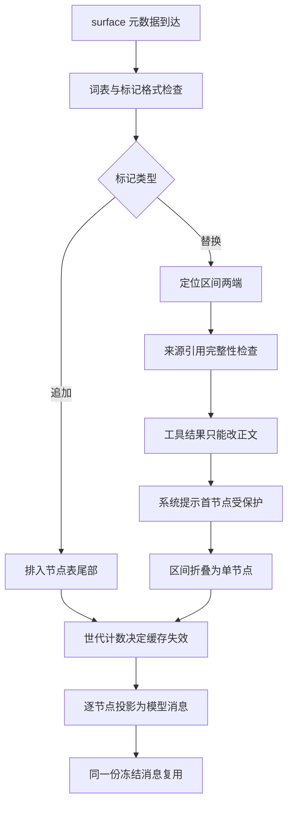

# 02 · surface 与可见性

日志回答"发生过什么",surface 回答"模型现在能看到什么"。它是日志之上的一层有序视图:只保存"哪些事件是可见节点、按什么顺序排列",不保存任何消息内容。这篇逐层拆开这层视图——节点表的真实数据结构、一次 `replace` 要过几道检查、为什么系统提示所在的节点 0 被单独保护、以及 `deriveMessages()` 如何在改写后仍然只做增量折叠。

---

## 一、surface 的真实形状:一个 seq 列表

`SessionSurface` 只有两个字段,没有任何消息对象:

```typescript
// packages/core/session/src/surface.ts:189-195
/** Readonly live projection of the message-producing session events. */
export interface SessionSurface {
  /** Current surface event sequences in model-visible order. */
  readonly nodes: readonly SessionSeq[]
  /** Monotonic count of committed positional replacements. */
  readonly replaceGeneration: number
}
```

`nodes` 里存的每个数字都是**日志下标**(因为 `seq === log.length` 的连续性契约,seq 就是数组下标)。所以 surface 是一个极轻的投影:折 1000 条事件只是往一个数组里 push 1000 个数字。真正的消息体始终是日志事件里那份冻结对象,`deriveMessages()` 只是把它们按 `nodes` 的顺序收集起来。

`replaceGeneration` 是一个**只增不减的计数器**,每次成功的区间替换加一。它存在的原因在第五节:派生消息缓存必须知道"surface 被改写过",而节点表本身可能看起来没变化(比如把一个节点换成另一个节点,长度不变)。

---

## 二、一次 surface 转移要过几道检查

所有 surface 元数据的校验都收敛到 `planSurfaceEvent()`,它**不修改任何状态**,只返回一个待提交的计划;真正的提交在 `applySurfacePlan()` 里。这个拆分是多处复用的关键:seed 导入、实时追加、纯折叠走的是同一套检查。


<details><summary>Mermaid 源码</summary>



</details>

| 阶段 | 做了什么 | 关键调用(文件:行) |
|---|---|---|
| 连续性前置 | 候选事件的 seq 必须正好是"已提交末尾 + 1",否则连节点表都不看 | `planSurfaceEvent` `surface.ts:428` |
| 词表与标记 | 非 surface 类型禁止携带任何 surface 字段;surface 类型必须带标记;替换标记必须是恰好三个键的对象 | `surfaceOpOf` `surface.ts:241`、`isReplaceOp` `:229` |
| 区间存在性 | `startSeq`/`endSeq` 必须都在**当前**节点表里,且 start 的位置不晚于 end | `replacementRange` `surface.ts:324` |
| 来源完整性 | `sourceEventSeqs` 必须非空、无重复、全部早于本事件,并且**包含每一个被遮蔽的节点** | `assertProvenance` `surface.ts:269` |
| 工具结果改写 | `tool/result` 的区间替换只能覆盖恰好一个当前节点,且新旧事件除 `content` 外必须完全相等 | `assertToolResultRewrite` `surface.ts:365` |
| 系统提示保护 | 区间起点为 0 且节点 0 是 `system/message` 时,替换者必须是覆盖恰好该节点的 `system/message` | `assertSystemHeadRewrite` `surface.ts:404` |
| 提交 | 追加:push 一个 seq;替换:splice 区间为一个 seq 并把世代 +1 | `applySurfacePlan` `surface.ts:462` |

来源完整性那条约束是**双向**的:替换者必须列出全部被遮蔽节点(否则重建者不知道它替换了谁),同时不允许列出尚未发生的事件:

```typescript
// packages/core/session/src/surface.ts:268-303(节选)
/** Validate cited source-event seqs against prior log entries and the replacement range. */
function assertProvenance(
  event: SessionEvent,
  shadowedSeqs: readonly SessionSeq[],
): void {
  const raw: unknown = event.sourceEventSeqs
  if (event.type === 'assistant/message' && raw !== undefined) {
    throw new Error('assistant/message embeds its source stream and cannot carry sourceEventSeqs')
  }
  // ...(略):非数组、空数组、元素非安全整数、重复值四类拒绝
  const missing = shadowedSeqs.filter(seq => !sources.has(seq))
  if (missing.length > 0) {
    throw new Error(`surface replace: sourceEventSeqs must include every shadowed surface node; missing ${missing.join(', ')}`)
  }
}
```

区间定位报错会带上**位置索引**,因为"找到了但顺序反了"和"没找到"是两类不同的问题:

```typescript
// packages/core/session/src/surface.ts:323-344(节选)
/** Locate one replacement range without mutating the current fold state. */
function replacementRange(
  state: SurfaceFoldState,
  op: Extract<SurfaceOp, { op: 'replace' }>,
): Pick<SurfaceReplacePlan, 'startIdx' | 'endIdx' | 'shadowedSeqs'> {
  const startIdx = state.nodes.indexOf(op.startSeq)
  if (startIdx === -1) {
    throw new Error(`surface replace: start seq ${op.startSeq} not found in surface`)
  }
  // ...(略):endSeq 同样必须存在
  if (startIdx > endIdx) {
    throw new Error(`surface replace: start seq ${op.startSeq} (index ${startIdx}) is after end seq ${op.endSeq} (index ${endIdx})`)
  }
  return {
    startIdx,
    endIdx,
    shadowedSeqs: state.nodes.slice(startIdx, endIdx + 1),
  }
}
```

<details><summary>计划的类型与提交的实现</summary>

```typescript
// packages/core/session/src/surface.ts:203-213
/** A validated replacement transition that has not mutated fold state yet. */
interface SurfaceReplacePlan extends SurfaceFoldReplacement {
  kind: 'replace'
  startIdx: number
  endIdx: number
}

/** One validated surface transition that has not mutated fold state yet. */
type SurfacePlan =
  | { kind: 'append'; seq: SessionSeq }
  | SurfaceReplacePlan
```

```typescript
// packages/core/session/src/surface.ts:461-471(节选)
/** Commit one previously validated surface transition. */
function applySurfacePlan(
  state: SurfaceFoldState,
  plan: SurfacePlan | undefined,
): SurfaceFoldReplacement | undefined {
  if (plan?.kind === 'append') {
    state.nodes.push(plan.seq)
  } else if (plan?.kind === 'replace') {
    state.nodes.splice(plan.startIdx, plan.endIdx - plan.startIdx + 1, plan.seq)
    state.replaceGeneration += 1
  }
```

</details>

---

## 三、`replace` 的语义:遮蔽,不是删除

`SurfaceOp` 的两个变体语义写得很明确:替换的区间是 surface 上的**位置区间**,不是数值 seq 区间。

```typescript
// packages/core/session/src/types.ts:421-436(节选)
/**
 * How a session event entered the ordered surface. Only valid on
 * {@link SurfaceEventType} events.
 *
 * - `'append'`: added to the tail — normal path for user/assistant/tool
 *   messages.
 * - `{ op: 'replace', startSeq, endSeq }`: replaces surface nodes from `startSeq`
 *   (inclusive) through `endSeq` (inclusive) with this node. Both must exist as
 *   surface nodes in the current surface. `startSeq === endSeq` replaces a single
 *   node. The node's {@link SessionEvent.sourceEventSeqs} must include every
 *   shadowed surface node. Used by compaction; any surface-replacing producer
 *   may use it.
 */
export type SurfaceOp =
  | 'append'
  | { op: 'replace'; startSeq: SessionSeq; endSeq: SessionSeq }
```

"位置区间而非数值区间"这句话有真实后果:一次替换会把一个**序号更大**的新节点放到一个**序号更小**的旧位置上(`splice` 保持位置不变)。所以第二次压缩如果再次覆盖同一段,它的 `startSeq` 可能大于 `endSeq`。压缩结果类型里专门记录了这条——**任何消费方都不能把 `start`/`end` 当作 seq 区间的两个端点去做数值遍历**,`shadowedSeqs` 才是权威集合([`compaction/src/types.ts:107-117`](https://github.com/deepseek-ai/deepseek-harness/blob/dbbaa4a37fb9098aba814c97d2956f7b2f105f46/packages/compaction/compaction/src/types.ts#L107-L117))。这一点在 `replacementRange()` 里是直接体现的:它拿到的 `shadowedSeqs` 来自 `state.nodes.slice()`,即真实被摘掉的节点。

### 两个消费者,两份素材

同一个日志有两种 reader,它们需要的东西恰好相反:

| reader | 用什么 | 理由 |
|---|---|---|
| 模型请求 | 当前 surface(含替换节点) | 模型应该看到摘要而不是被摘要掉的长内容 |
| 人工 transcript | `surfaceOp === 'append'` 的事件 | 替换节点是机器产物,把用户已经看过的对话删掉是不可接受的 |

这两个判定被导出成两个谓词,分辨它们不需要重新折叠:

```typescript
// packages/core/session/src/surface.ts:49-64(节选)
/**
 * Narrow an event to an append-origin surface event: one that entered the
 * surface at its own log position and was never itself a replacement copy.
 *
 * The model-visible surface deliberately shadows replaced ranges, so it is the
 * wrong source for a human transcript — a landed replacement would erase
 * conversation the user already saw. Append-origin events are that transcript's
 * durable source material; replacement copies stay model-only.
 * @param event - event to test.
 * @returns true when the event appended to the surface tail.
 */
export function isAppendSurfaceEvent(
  event: SessionEvent,
): event is SurfaceEvent & { surfaceOp: 'append' } {
  return isSurfaceEvent(event) && event.surfaceOp === 'append'
}
```

---

## 四、节点 0 的保护规则

系统提示是一个 `system/message` 事件,由 loop 在第一步的第一个 `user/message` 之前追加,因此它通常是 surface 的**第 0 个节点**。压缩会挑"第一个非系统节点"往后的一块来替换,所以正常情况下它不会碰到节点 0。但这是选择策略,不是强制力——真正拦住它的是 `assertSystemHeadRewrite()`:

```typescript
// packages/core/session/src/surface.ts:398-418
/**
 * Protect the system prompt at surface node 0. A replacement covering node 0
 * while that node is a `system/message` must itself be a `system/message` over
 * exactly that node; later system nodes carry no protection and a compaction
 * range may shadow them.
 */
function assertSystemHeadRewrite(
  event: SessionEvent,
  state: SurfaceFoldState,
  startIdx: number,
  shadowedSeqs: readonly SessionSeq[],
  events: readonly SessionEvent[],
  baseSeq: SessionLogOffset,
): void {
  if (startIdx !== 0) return
  const head = events[state.nodes[0] as number - baseSeq]
  if (head?.type !== 'system/message') return
  if (event.type !== 'system/message' || shadowedSeqs.length !== 1) {
    throw new Error('surface replace: node 0 holds the system prompt and may be rewritten only by a system/message over exactly that node')
  }
}
```

三个条件缺一不可:**区间从索引 0 开始**、**该节点确实是 `system/message`**、**替换者本身是覆盖恰好一个节点的 `system/message`**。所以模型永远带着系统提示跑,即使某个第三方插件想拿 `user/message` 覆盖整个历史。

这条规则只看节点**位置**,不看节点**序号**:如果历史上发生过替换,今天的节点 0 可能不再是日志里的第一个 `system/message`。而 `system/message` 自身允许"空渲染"——一个内容为空的头节点表示"没有系统提示",而不是"回退到更早的提示"([`core/session/src/types.ts:298-309`](https://github.com/deepseek-ai/deepseek-harness/blob/dbbaa4a37fb9098aba814c97d2956f7b2f105f46/packages/core/session/src/types.ts#L298-L309))。

`tool/result` 的改写限制走的是同一条思路的"窄化"版本:允许压缩裁剪工具结果的内容,但不允许借此换掉工具名、参数、错误元数据或调用 id。

```typescript
// packages/core/session/src/surface.ts:364-396(节选)
/** Restrict a tool-result replacement to one current result's content. */
function assertToolResultRewrite(
  event: SessionEvent,
  shadowedSeqs: readonly SessionSeq[],
  events: readonly SessionEvent[],
  baseSeq: SessionLogOffset,
): void {
  if (event.type !== 'tool/result') return
  if (shadowedSeqs.length !== 1) {
    throw new Error('tool/result surface replacement must rewrite exactly one current node')
  }
  for (const originalSeq of shadowedSeqs) {
    const original = events[originalSeq - baseSeq]
    if (original?.type !== 'tool/result') {
      throw new Error('tool/result surface replacement must target a current tool/result')
    }
    // ...(略):把两侧的 content 置空后做深度相等比较
    if (!isDeepEqualJson(originalRest, replacementRest)) {
      throw new Error('tool/result surface replacement may change only content')
    }
  }
}
```

比较用的是自带的 `isDeepEqualJson()`([`surface.ts:351`](https://github.com/deepseek-ai/deepseek-harness/blob/dbbaa4a37fb9098aba814c97d2956f7b2f105f46/packages/core/session/src/surface.ts#L351))而不是 `node:util` 的 `isDeepStrictEqual`,原因是这个模块要向浏览器导出——文件头明确写了"web clients consume this subpath export, so it must stay free of `node:` imports"([`surface.ts:4`](https://github.com/deepseek-ai/deepseek-harness/blob/dbbaa4a37fb9098aba814c97d2956f7b2f105f46/packages/core/session/src/surface.ts#L4))。

---

## 五、增量折叠:`SurfaceManager`

`SurfaceManager` 就是 `Session` 内部那份"当前 surface"。它持有一个指向日志数组的引用,靠一个已处理水位线做增量:

```typescript
// packages/core/session/src/surface.ts:503-521(节选)
/** Incremental ordered surface view and append-boundary validator. */
export class SurfaceManager implements SessionSurface {
  /** Shared transition state; replacement history is not retained. */
  private _state = createFoldState()
  /** Last processed absolute seq. */
  private _lastProcessedSeq: SessionSeqCursor
  /** Candidate already validated by `validateNext`, pending exact log admission. */
  private _pendingPlan: { event: SessionEvent; expectedSeq: SessionSeq; plan: SurfacePlan | undefined } | undefined

  constructor(
    private log: readonly SessionEvent[],
    private readonly baseSeq: SessionLogOffset = SessionLogOffset(0),
  ) {
    this._lastProcessedSeq = baseSeq === 0 ? -1 : SessionSeq(baseSeq - 1)
  }
```

**`_pendingPlan` 是这套设计里最巧的一处**。`append()` 需要在事件进入日志**之前**知道它是否合法,但节点表的状态要等事件真的进了日志才能推进。于是分两步:校验阶段把"已验证但未提交"的计划存进 `_pendingPlan`,提交后第一次读 `nodes` 或 `replaceGeneration` 时,`_processDelta()` 发现日志尾部多了一条,直接把存好的计划提交掉——**不重新校验**:

```typescript
// packages/core/session/src/surface.ts:549-565
  /** Fold events appended since the previous access. */
  private _processDelta(): void {
    const tailSeq = this.baseSeq + this.log.length - 1
    for (let seq = this._lastProcessedSeq + 1; seq <= tailSeq; seq++) {
      const index = seq - this.baseSeq
      // oxlint-disable-next-line typescript/no-non-null-assertion -- bounded by the loop condition
      const event = this.log[index]!
      const pending = this._pendingPlan
      if (pending?.event === event && pending.expectedSeq === seq) {
        applySurfacePlan(this._state, pending.plan)
      } else {
        applySurfaceEvent(this._state, event, SessionSeq(seq), this.log, this.baseSeq)
      }
      if (pending !== undefined && pending.expectedSeq <= seq) this._pendingPlan = undefined
      this._lastProcessedSeq = SessionSeq(seq)
    }
  }
```

判据是**对象身份** `pending.event === event`,而不是 seq 相等——如果中间发生过一次失败的追加,日志尾部可能又换回别的对象了。身份比对让"计划属于哪条事件"这件事没有歧义。

seed 导入走的是同一套 `validateNext`,所以一个 replay/fork 出来的日志不可能构造出"实时路径拒绝、seed 路径接受"的 surface:

```typescript
// packages/core/session/src/index.ts:562-582(节选)
      for (const [index, source] of seed.entries()) {
        // The seed is a persistence/replay boundary: validate and detach the
        // complete event in one lossless-JSON pass.
        const snapshot = mode === 'snapshot' ? snapshotJsonValue(source) : source
        // ...(略):信封校验与 seq 必须等于下标
        // A seed is accepted incrementally through the same transition as a
        // live append and a full-log fold. The candidate is planned before it
        // enters `log`, so a failure cannot partially mutate the surface.
        try {
          this.surfaceManager.validateNext(snapshot)
        } catch (error: unknown) {
          throw new Error(`invalid seed event at index ${index}: ${error instanceof Error ? error.message : 'invalid surface metadata'}`)
        }
        this.log.push(mode === 'snapshot' ? deepFreeze(snapshot) : snapshot)
      }
```

同一个折叠还有第三个入口——`foldSurface()`([`surface.ts:487`](https://github.com/deepseek-ai/deepseek-harness/blob/dbbaa4a37fb9098aba814c97d2956f7b2f105f46/packages/core/session/src/surface.ts#L487)),给外部重建者用:拿一段日志前缀,重新算出那时的 surface 与替换历史。三个入口共用 `planSurfaceEvent()` / `applySurfacePlan()`,所以"同一份日志在任何入口折出来的 surface 都一致"是结构性的,不是巧合。

---

## 六、`deriveMessages()` 的折叠与缓存

派生是把节点列表变成 `Message[]`。缓存的三个字段分别是历史结果、已投影的节点数、以及构建它时的 surface 世代:

```typescript
// packages/core/session/src/index.ts:807-853(节选)
  /** The derived-message cache: frozen projections, extended per unseen node. */
  private derived: Message[] = []
  /** Surface position (nodes projected) the cache has reached. */
  private derivedNodes = 0
  /** {@link SurfaceManager.replaceGeneration} the cache was built under. */
  private derivedGeneration = 0
  // ...(略):814-831 行是 deriveMessages 的完整契约注释
  deriveMessages(): Message[] {
    const surface = this.surface
    const nodes = surface.nodes
    const generation = surface.replaceGeneration
    if (generation !== this.derivedGeneration) {
      this.derived = []
      this.derivedNodes = 0
      this.derivedGeneration = generation
    }
    for (const seq of nodes.slice(this.derivedNodes)) {
      // Surface sequences are built from this.log — seq is always a valid
      // index by construction. The non-null assertion expresses that invariant.
      // oxlint-disable-next-line typescript/no-non-null-assertion
      const msg = this.deriveEventMessage(this.log[seq]!)
      // A surface node is one of the five message-producing types, but an
      // empty-content assistant/message (a max-tokens step that hosts only
      // usage) derives to null and must not enter the transcript.
      if (msg) this.derived.push(msg)
    }
    this.derivedNodes = nodes.length
    return [...this.derived]
  }
```

三条缓存语义:

1. **世代变化即整体重建**。替换可能删掉中间节点、也可能在中间插入,`derivedNodes` 这个"已处理前缀长度"就失去意义,所以直接清空重来。这是 `replaceGeneration` 存在的唯一理由。
2. **世代不变则只追加新增节点**。`nodes.slice(this.derivedNodes)` 取的是本次新增的尾部,一次调用成本 O(新增节点)。
3. **返回值是浅拷贝,元素是共享的冻结对象**。返回新数组保证调用方拿到的数组不会被后续追加撑大;`Message` 本身直接复用日志里那份深冻结对象,不需要第二次克隆。

单节点投影规则刻意不穷尽——非 surface 事件返回 `null`,空的 `system/message` 与 `assistant/message` 也返回 `null`:

```typescript
// packages/core/session/src/surface.ts:92-126(节选)
export function deriveEventMessage(event: SessionEvent): Message | null {
  // Intentionally non-exhaustive: only message-producing events derive
  // history; turn/step boundaries, failed attempts, and errors are trace/replay
  // data.
  switch (event.type) {
    // Ordinary prompts and injected context project in user role: the event's
    // model-facing content stays verbatim.
    case 'user/message': {
      return event.data
    }
    // An empty-content message projects to no wire message. For
    // system/message the node records "no system prompt" while keeping its
    // surface position; for assistant/message the event exists only to host a
    // max-tokens step's usage and must not inject a content-less assistant
    // turn into the provider transcript.
    case 'system/message':
    case 'assistant/message': {
      if (event.data.message.content.length === 0) return null
      return event.data.message
    }
    case 'tool/result': {
      return event.data.message
    }
    default:
      // A non-surface event (boundary, attempt, log-only record) projects to
      // no message. Merge-extensible union: no assertNever here.
      return null
  }
}
```

"空内容投影为 `null`"这一条不是优化,而是语义:**一个 `assistant/message` 可能整条都是空的**,它存在的目的只是携带这一步的 `usage`(命中输出上限的步骤)。如果它投影出去,请求里就会出现一条没有内容的 assistant 消息,多数 provider 会直接拒绝。

最后要区分的是三个同名的"surface 事件"谓词:

| 谓词 | 问题 | 位置 |
|---|---|---|
| `isSurfaceEligibleType` | 这个**类型**允许进 surface 吗 | [`surface.ts:34`](https://github.com/deepseek-ai/deepseek-harness/blob/dbbaa4a37fb9098aba814c97d2956f7b2f105f46/packages/core/session/src/surface.ts#L34) |
| `isSurfaceEvent` | 这个事件**带了标记**吗 | [`surface.ts:43`](https://github.com/deepseek-ai/deepseek-harness/blob/dbbaa4a37fb9098aba814c97d2956f7b2f105f46/packages/core/session/src/surface.ts#L43) |
| `isAppendSurfaceEvent` | 它是**原生追加**的,还是替换产物 | [`surface.ts:60`](https://github.com/deepseek-ai/deepseek-harness/blob/dbbaa4a37fb9098aba814c97d2956f7b2f105f46/packages/core/session/src/surface.ts#L60) |

前两个校验用,第三个是 transcript 与模型可见性的分界。

---

## 关键文件 / 符号索引

| 符号 | 位置 | 作用 |
|---|---|---|
| `SURFACE_EVENT_TYPES` | [`packages/core/session/src/surface.ts:22`](https://github.com/deepseek-ai/deepseek-harness/blob/dbbaa4a37fb9098aba814c97d2956f7b2f105f46/packages/core/session/src/surface.ts#L22) | 四个 message 类型的运行期集合 |
| `isSurfaceEligibleType` / `isSurfaceEvent` | [`packages/core/session/src/surface.ts:34`](https://github.com/deepseek-ai/deepseek-harness/blob/dbbaa4a37fb9098aba814c97d2956f7b2f105f46/packages/core/session/src/surface.ts#L34) / [`:43`](https://github.com/deepseek-ai/deepseek-harness/blob/dbbaa4a37fb9098aba814c97d2956f7b2f105f46/packages/core/session/src/surface.ts#L43) | 类型级与标记级判定 |
| `isAppendSurfaceEvent` / `isReplacementSurfaceEvent` | [`packages/core/session/src/surface.ts:60`](https://github.com/deepseek-ai/deepseek-harness/blob/dbbaa4a37fb9098aba814c97d2956f7b2f105f46/packages/core/session/src/surface.ts#L60) / [`:73`](https://github.com/deepseek-ai/deepseek-harness/blob/dbbaa4a37fb9098aba814c97d2956f7b2f105f46/packages/core/session/src/surface.ts#L73) | transcript 素材与替换产物 |
| `deriveEventMessage` | [`packages/core/session/src/surface.ts:92`](https://github.com/deepseek-ai/deepseek-harness/blob/dbbaa4a37fb9098aba814c97d2956f7b2f105f46/packages/core/session/src/surface.ts#L92) | 唯一的单节点投影规则 |
| `validateSessionEventData` | [`packages/core/session/src/surface.ts:140`](https://github.com/deepseek-ai/deepseek-harness/blob/dbbaa4a37fb9098aba814c97d2956f7b2f105f46/packages/core/session/src/surface.ts#L140) | 头字段与工具失败元数据的本地校验 |
| `SurfaceFoldReplacement` | [`packages/core/session/src/surface.ts:170`](https://github.com/deepseek-ai/deepseek-harness/blob/dbbaa4a37fb9098aba814c97d2956f7b2f105f46/packages/core/session/src/surface.ts#L170) | 一次替换的完整记录 |
| `SessionSurface` | [`packages/core/session/src/surface.ts:190`](https://github.com/deepseek-ai/deepseek-harness/blob/dbbaa4a37fb9098aba814c97d2956f7b2f105f46/packages/core/session/src/surface.ts#L190) | `nodes` + `replaceGeneration` |
| `isReplaceOp` / `surfaceOpOf` | [`packages/core/session/src/surface.ts:229`](https://github.com/deepseek-ai/deepseek-harness/blob/dbbaa4a37fb9098aba814c97d2956f7b2f105f46/packages/core/session/src/surface.ts#L229) / [`:241`](https://github.com/deepseek-ai/deepseek-harness/blob/dbbaa4a37fb9098aba814c97d2956f7b2f105f46/packages/core/session/src/surface.ts#L241) | 替换标记形状与词表闸门 |
| `assertProvenance` | [`packages/core/session/src/surface.ts:269`](https://github.com/deepseek-ai/deepseek-harness/blob/dbbaa4a37fb9098aba814c97d2956f7b2f105f46/packages/core/session/src/surface.ts#L269) | 来源引用完整性 |
| `validateSurfaceMetadata` | [`packages/core/session/src/surface.ts:313`](https://github.com/deepseek-ai/deepseek-harness/blob/dbbaa4a37fb9098aba814c97d2956f7b2f105f46/packages/core/session/src/surface.ts#L313) | 事件本地 surface 校验入口 |
| `replacementRange` | [`packages/core/session/src/surface.ts:324`](https://github.com/deepseek-ai/deepseek-harness/blob/dbbaa4a37fb9098aba814c97d2956f7b2f105f46/packages/core/session/src/surface.ts#L324) | 区间定位与遮蔽集合 |
| `assertToolResultRewrite` | [`packages/core/session/src/surface.ts:365`](https://github.com/deepseek-ai/deepseek-harness/blob/dbbaa4a37fb9098aba814c97d2956f7b2f105f46/packages/core/session/src/surface.ts#L365) | 工具结果只能改正文 |
| `assertSystemHeadRewrite` | [`packages/core/session/src/surface.ts:404`](https://github.com/deepseek-ai/deepseek-harness/blob/dbbaa4a37fb9098aba814c97d2956f7b2f105f46/packages/core/session/src/surface.ts#L404) | 节点 0 保护 |
| `planSurfaceEvent` / `applySurfacePlan` | [`packages/core/session/src/surface.ts:421`](https://github.com/deepseek-ai/deepseek-harness/blob/dbbaa4a37fb9098aba814c97d2956f7b2f105f46/packages/core/session/src/surface.ts#L421) / [`:462`](https://github.com/deepseek-ai/deepseek-harness/blob/dbbaa4a37fb9098aba814c97d2956f7b2f105f46/packages/core/session/src/surface.ts#L462) | 转移预演与唯一提交点 |
| `foldSurface` | [`packages/core/session/src/surface.ts:487`](https://github.com/deepseek-ai/deepseek-harness/blob/dbbaa4a37fb9098aba814c97d2956f7b2f105f46/packages/core/session/src/surface.ts#L487) | 纯函数式全日志折叠 |
| `SurfaceManager` / `_processDelta` | [`packages/core/session/src/surface.ts:504`](https://github.com/deepseek-ai/deepseek-harness/blob/dbbaa4a37fb9098aba814c97d2956f7b2f105f46/packages/core/session/src/surface.ts#L504) / [`:550`](https://github.com/deepseek-ai/deepseek-harness/blob/dbbaa4a37fb9098aba814c97d2956f7b2f105f46/packages/core/session/src/surface.ts#L550) | 增量 surface 视图 |
| `Session.deriveMessages` / `Session.surface` | [`packages/core/session/src/index.ts:832`](https://github.com/deepseek-ai/deepseek-harness/blob/dbbaa4a37fb9098aba814c97d2956f7b2f105f46/packages/core/session/src/index.ts#L832) / [`:452`](https://github.com/deepseek-ai/deepseek-harness/blob/dbbaa4a37fb9098aba814c97d2956f7b2f105f46/packages/core/session/src/index.ts#L452) | 派生消息与三元组缓存;只读 surface 面 |
