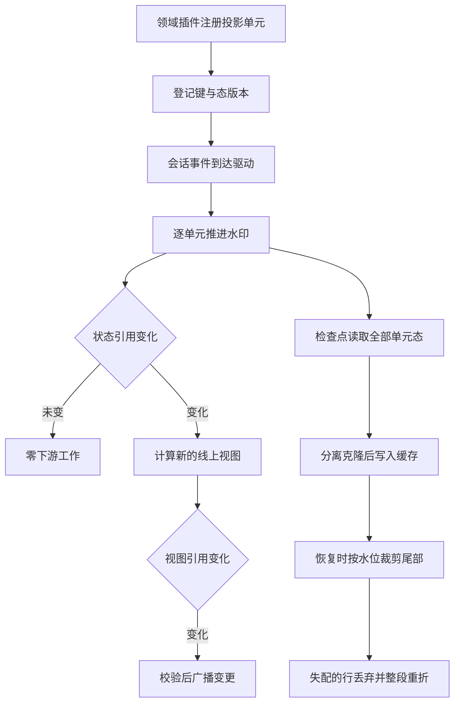

# 03 · 派生投影

surface 只回答"模型能看到什么",它管不了 goal 现在处于哪个阶段、todo 清单还剩几项、这个会话该叫什么名字。这些东西同样**没有独立存储**——它们是日志的另一种折叠结果。`ctx.sessionProjections` 就是承载这类折叠的注册表:领域插件贡献一个纯函数,框架负责订阅、增量驱动、水印、变更通知和检查点持久化。这篇讲清这条链的每一环,以及请求头这个"特殊的投影"为什么单独实现。

---

## 一、一个投影单元的契约

`ProjectionDefinition` 只有五个成员,但它把"领域计算"和"框架驱动"的分界钉得很死:

```typescript
// packages/session/session-projection/src/index.ts:40-51(节选)
/**
 * One domain's state-driven computation unit: a pure synchronous fold plus
 * declarations and an optional client view — never an opaque getter. The framework drives
 * `apply` on every committed session event; the domain holds no
 * subscriptions and owns only the computation. All functions MUST be
 * synchronous (an async unit would tear the carriers' consistency cut), and
 * `state` MUST be plain JSON (the persisted-cache precondition).
 */
export interface ProjectionDefinition<
  K extends keyof SessionProjectionStateMap,
  S extends SessionProjectionStateMap[K] = SessionProjectionStateMap[K],
> {
  /** The projection key this unit owns (its `SessionProjectionStateMap` entry). */
  key: K
  /** Validates persisted state before it seeds a fold. */
  stateSchema: ZodType<S>
  // ...(略):62-85 行是 init / apply / 可选 wire 三个成员的完整契约
  /**
   * Persisted-cache invalidation version: bump whenever the serialized state fields or the
   * fold semantics change, so persisted `(sessionId, key, ver, seq, val)`
   * rows from an older unit are discarded instead of being forward-applied
   * into garbage. Non-negative integer.
   */
  stateVersion: number
}
```

两处硬约束值得单独记住:

- **同一个事件无关时必须返回同一个引用**。这不是风格建议:框架用 `Object.is` 判定"是否变化",返回新对象等于声称状态变了,会白白计算视图、白白比较、白白持久化。
- **`state` 必须是纯 JSON**。检查点会把状态原样序列化进存储域,一个含 `Map`/`Date`/类实例的状态在写入时才炸,而那时已经远离产生它的代码。`stateVersion` 是这条约束的补救条款:改了字段含义就直接丢掉旧行重折,而不是尝试迁移。

两项类型表本身是空的,由领域包合并([`session-projection/src/types.ts:11-24`](https://github.com/deepseek-ai/deepseek-harness/blob/dbbaa4a37fb9098aba814c97d2956f7b2f105f46/packages/session/session-projection/src/types.ts#L11-L24)):一个键可以只出现在 `SessionProjectionStateMap` 里,那就是"仅宿主可见"的单元——它照常折、照常落检查点,只是不出现在客户端快照里。

---

## 二、注册、驱动、变更通知


<details><summary>Mermaid 源码</summary>



</details>
| 阶段 | 做了什么 | 关键调用(文件:行) |
|---|---|---|
| 注册 | 键的 `stateVersion` 必须是非负整数;同键复注册要求版本一致,并累加引用计数 | `register` `session-projection/index.ts:253`、`:270`、`:279` |
| 单元擦除 | 把带类型的定义包成类型无关的 `ErasedDefinition`,框架此后只认 `unknown` | `register` `:260` |
| 注销 | 引用计数减到 0 才删键——同一个工具包被 N 个 agent 预设挂载时,N 次注册共享一个单元 | `:284-290` |
| 驱动 | 每次 `session/event` 把事件喂给每个已注册单元 | `drive` `:657`、订阅点 `:220` |
| 迟到单元 | 单元注册得比事件晚时,先按 seq 前缀折一遍历史再吃当前事件 | `drive` `:661-671` |
| 水印推进 | 状态变了才推进视图双槽:旧当前值降为前值,当前值置空 | `advanceCell` `:646-650` |
| 视图比较 | 只有存在监听者时才计算新视图,并与上一次结果按 `Object.is` 比较 | `drive` `:685-699` |
| 通知 | 视图变了才过 `viewSchema` 校验并逐个通知监听者,带上水印 seq | `drive` `:692-695` |

**引用计数与 `WeakMap` 的组合**是这套设计的实际骨架:单元定义全局唯一(`Map<key, Registration>`),状态按 `Session` 存放(`WeakMap<Session, UnitCell>`)。这样一个定义天然服务所有会话,而会话被回收时它那份状态自动消失。计数存在的原因是注册方是**按会话**的:

```typescript
// packages/session/session-projection/src/index.ts:165-174(节选)
/**
 * `refs` exists because one unit definition already serves every session — the
 * cells are keyed by `Session` — while registrants are per-session:
 * an agent preset mounts the same tool package once per agent, so N sessions
 * on one preset register the same key N times. Without a count the first
 * registrant would own the disposer, and its session ending would strip the
 * projection from every other live session.
 */
interface Registration {
  readonly def: ErasedDefinition
  readonly cells: WeakMap<Session, UnitCell>
  /** Live registrants sharing this unit; the last one out removes the key. */
  refs: number
}
```

### 水印与"两次比较"

每个单元在每个会话上有一个 `UnitCell`,它有三个字段:`state`(折叠出的状态)、`observedSeq`(**水印**,最后一个经过 `apply` 的事件 seq,与状态是否变化无关)、以及 `views`(`[previousView, currentView]` 双槽,`undefined` 表示没有可比较的缓存值)。水印表示"输入消耗到哪里",变更通知表示"输出是否不同",两者不是一回事。

`views` 是固定长度的双槽数组而不是两个字段,原因是可以整体左移:

```typescript
// packages/session/session-projection/src/index.ts:686-694(节选)
      if (changed && wire !== undefined) {
        const views = cell.views
        views[0] = views[1]
        if (this.listeners.size > 0) {
          views[1] = wire.view(next)
          if (!Object.is(views[0], views[1])) {
            const value = wire.viewSchema.parse(views[1])
            for (const listener of this.listeners) {
              listener(session, registration.def.key as Extract<keyof SessionProjectionMap, string>, value, event.seq)
            }
          }
        }
        // ...(略):无监听者时不计算视图,把 views[1] 置空
      }
```

三层短路依次是:**没有监听者就不算视图**、**视图引用没变就不校验不广播**、**状态引用没变则整个分支都不进**。状态不变时也不能顺手清空 `views[1]`,那个值正是下一次状态变化时要比较的基准。监听者订阅同样走 effect,卸载即退订(`onChanged` `:301`)。

---

## 三、检查点:写侧、读侧与水位

一次检查点读取会把**所有**已注册单元的状态取出来,不管它是否客户端可见——持久化的目的是缩短下次冷读的尾巴,而不是服务 UI。取出的值必须是与活单元脱离的克隆:

```typescript
// packages/session/session-projection/src/index.ts:396-407(节选)
  /**
   * State-level checkpoint of every persisted unit for one session, read
   * from the watermark cache (missing cells fold lazily over the in-memory
   * log). This is the write side of the persisted projection cache. Every
   * `val` is a DETACHED structured clone — never the live cell reference:
   * the watermark cache is this registry's authoritative mutable state, and a
   * caller reaching the live reference could corrupt every subsequent
   * snapshot and frame through it (plain JSON by the unit contract, so the
   * clone is total).
   */
  checkpoint(session: Session): ProjectionCheckpoint {
    const rows: ProjectionCheckpoint = {}
    for (const registration of this.registrations.values()) {
      const cell = this.cellFor(registration, session)
      rows[registration.def.key] = {
        ver: registration.def.stateVersion,
        seq: cell.observedSeq,
        val: structuredClone(cell.state),
      }
    }
    return rows
  }
```

读侧是"从缓存行 + 日志尾巴重建",核心是**行可用性判定**。`restoreFloor()` 计算要读回多少日志:

```typescript
// packages/session/session-projection/src/index.ts:409-434(节选)
  /**
   * The stored seq a {@link restore} tail read over `checkpoint` must start
   * at: one event BELOW the lowest usable watermark (a row is usable when
   * its `ver` matches the live unit's `stateVersion`; an absent or mismatched row
   * pulls the floor to `0` — that key must refold the full log). The
   * one-below anchor is load-bearing: the tail then proves how far the
   * stored log still extends, so {@link restore} can detect a log that
   * shrank below a row's watermark (crash-repair truncation) instead of
   * serving the stale row as current.
   */
  restoreFloor(checkpoint: ProjectionCheckpoint): SessionLogOffset | undefined {
    let floor: number | undefined
    for (const registration of this.registrations.values()) {
      const row = checkpoint[registration.def.key]
      const need = row !== undefined && row.ver === registration.def.stateVersion
        ? Math.max(row.seq + 1, 0)
        : 0
      floor = floor === undefined ? need : Math.min(floor, need)
    }
    return floor === undefined ? undefined : SessionLogOffset(Math.max(floor - 1, 0))
  }
```

"取最小值再减一"这一步值得说明:每个单元的水印可能不同,必须从**最落后的那个再往前一条**开始读,才能保证读回的尾巴能补齐所有单元。"减一"这个锚点则是为了让读回结果能自证长度——如果日志因为崩溃修复被截短了,从锚点读回的尾巴会短于预期,`restore()` 就能发现并拒绝,而不是把一个过期行当成当前值。

`restore()` 的行可用性判据是三条同时成立:`ver` 匹配当前单元的 `stateVersion`、行不早于 `baseSeq`(`seq >= baseSeq - 1`)、行不声称拥有超出读回末端的事件(`seq <= endSeq`)。不可用的行被丢弃并从 `init` 重折,而"从 `init` 重折"只在完整日志上成立,所以 `baseSeq > 0` 时丢掉行会直接抛错,要求调用方从 seq 0 重读(`session-projection/index.ts:495-540`)。

四层读取阶梯的取舍写在各自的契约里。`cachedSnapshot` 返回的 `asOfSeq` 取的是**所有被服务单元里最低的水印**——宁可少报也不能多报,因为消费方按"水位更高的值胜出"合并,多报会让一个过期值压过新推送。

---

## 四、持久化投影缓存

`SessionProjectionCache` 把检查点落到存储域的一表里,一个会话一条记录,写入路径的顺序是关键——**先取检查点切面,再 flush 日志,最后落行**:

```typescript
// packages/session/session-projection-cache/src/index.ts:246-261(节选)
  async write(session: Session): Promise<void> {
    const rows = this.ctx.sessionProjections.checkpoint(session)
    this.markClean(session)
    // Durability barrier: the checkpoint cut was taken above, so flushing
    // AFTER it guarantees every event inside the cut is durably logged
    // before the cache row lands — a crash can leave the cache behind the
    // log (longer tail replay) but never ahead of it (phantom values folded
    // from events no stored log contains).
    if (this.ctx.sessions.get(session.id) === session) await this.ctx.sessions.flush(session)
    await this.put(
      session.id,
      identityOf(session.header, session.inheritedEventCount),
      rows,
    )
  }
```

"缓存落后于日志可接受,领先于日志不可接受"这条取舍的代价被明确量化了:落后只是下次冷读要重放的尾巴更长,领先则会让冷读看到一个**存储日志里根本不存在的事件**折出来的值。

**身份绑定**是第二个防线。会话 id 只是一个槽位,不是生命周期:同一个 id 被重新创建、或者存储根被换掉,旧记录都还在那个槽里:

```typescript
// packages/session/session-projection-cache/src/index.ts:412-443(节选)
/**
 * Whether a stored record's bound identity names the caller's lifecycle.
 * An absent format generation cannot prove the fold semantics and never
 * matches. Once the format matches, absent lineage fields (records admitted
 * via `compatibleVersions` predate them) read as the unseeded lineage: exact
 * for an unseeded caller, while a seeded caller fails the match.
 */
function identityMatches(stored: CheckpointIdentity, expected: CurrentCheckpointIdentity): boolean {
  return stored.formatVersion === expected.formatVersion
    && lifecycleIdentityMatches(stored, expected)
}
// ...(略):424-432 行是允许"前一代"记录匹配的 predecessorIdentityMatches
/** Match the format-independent fields that distinguish one Session lifecycle. */
function lifecycleIdentityMatches(
  stored: CheckpointIdentity,
  expected: CurrentCheckpointIdentity,
): boolean {
  return stored.createdAt === expected.createdAt
    && stored.cwd === expected.cwd
    && (stored.isSeeded ?? false) === expected.isSeeded
    && (stored.inheritedEventCount ?? 0) === expected.inheritedEventCount
}
```
写入节流由两个部署选择加三个强制点组成:

| 触发 | 语义 | 位置 |
|---|---|---|
| 每 N 个提交事件 | `writeEveryEvents`,回合内的流式写入不会每个事件都落盘 | `session-projection-cache/index.ts:313` |
| 最长静默时间 | `writeIntervalMs`,第一次变脏时起表,后续事件不重置 | `:317` |
| 会话创建 | 强制点:一个从不说话的会话(种子继承标题的 fork 子会话)也必须有行 | `:327` |
| `turn/end` | 强制点:大多数读取想要的正是"回合终局"那个值 | `:305-308` |
| 会话销毁 | 强制点:活转冷的那一刻 | `:335` |

冷读一侧的写回是 fail-soft 且不 await 的:失败只让缓存继续过期,不会有任何事实依赖它的成功(`coldSnapshot` `:277-296`)。

---

## 五、请求头:一个自己实现的投影

请求头没有走注册表,理由是它的读取频率远高于其他投影——每一步组装请求都要读一次。`Session` 直接内置了一次增量折叠:

```typescript
// packages/core/session/src/index.ts:763-776(节选)
  /** Cached fold of the request-header events — see {@link requestHeader}. */
  private headerFold: EpochHeader | undefined
  /** Log position (events consumed) the header fold has reached. */
  private headerFoldSeq = 0

  /**
   * The {@link EpochHeader} in force after the log's last header event — the
   * header the NEXT request will be compared against — or undefined before
   * the first `request/header` snapshot. The live, incrementally-maintained
   * form of `foldRequestHeader(session.snapshotEvents())`: each header event is folded
   * once, when first seen, so a per-step read costs O(new events).
   */
  requestHeader(): EpochHeader | undefined {
    if (this.headerFoldSeq < this.log.length) {
      // Frozen on update: the fold is session state exposed by reference — a
      // consumer mutating it in place (instead of building a replacement)
      // would desync every later comparison against the log, so mutation
      // throws instead.
      this.headerFold = deepFreeze(foldRequestHeader(this.log.slice(this.headerFoldSeq), this.headerFold))
      this.headerFoldSeq = this.log.length
    }
    return this.headerFold
  }
```

纯折叠函数本身只有五行([`request-header.ts:63-69`](https://github.com/deepseek-ai/deepseek-harness/blob/dbbaa4a37fb9098aba814c97d2956f7b2f105f46/packages/core/session/src/request-header.ts#L63-L69)),`request/context` 用的是同一套写法([`index.ts:797`](https://github.com/deepseek-ai/deepseek-harness/blob/dbbaa4a37fb9098aba814c97d2956f7b2f105f46/packages/core/session/src/index.ts#L797))。快照的语义是"最新一份即重建值"——中间的历史快照对重建无用,只对审计有用:

```typescript
// packages/core/session/src/types.ts:253-261
/**
 * Why a `request/header` snapshot was appended: `'initial'` — the log's first
 * header (a new conversation); `'resume'` — a loop instance's first request
 * over a log that already has header events (process restart, fork seed);
 * `'change'` — a later request used a different header, with `startsSeries`
 * preserving a coincident series boundary; `'series'` — an unchanged header
 * began an explicitly distinct message series or followed a surface replacement.
 */
export type RequestHeaderReason = 'initial' | 'resume' | 'change' | 'series'
```

四个值各自对应 loop 里一个明确的分支,用"是否本实例第一次写"和"与本实例折叠出的基线是否相等"两个布尔量就能完全决定:

```typescript
// packages/core/agent-loop/src/agent.ts:570-581
    if (!this.requestHeaderLogged) {
      this.session.append('request/header', { header, reason: baseline === undefined ? 'initial' : 'resume' })
      this.requestHeaderLogged = true
    } else if (baseline === undefined || !headerEquals(baseline, header)) {
      this.session.append('request/header', {
        header,
        reason: 'change',
        ...startsSeries ? { startsSeries: true } : {},
      })
    } else if (startsSeries) {
      this.session.append('request/header', { header, reason: 'series' })
    }
```

| `reason` | 判定条件 | 为什么需要它 |
|---|---|---|
| `initial` | 本实例第一次写,且日志里根本没有头 | 新会话的起点 |
| `resume` | 本实例第一次写,但日志里已有头 | 进程重启或 fork 种子——**同一个 loop 实例里的第一次追加**才是判据,与磁盘无关 |
| `change` | 与折叠出的基线不等 | 换了模型、改了工具集,header 真的变了 |
| `series` | 头没变,但开始了明确的新消息序列 | `startsRequestSeries` 或 surface 世代变了 |

普通读取路径下,**头没变就什么都不写**。这是"日志即真源"反过来带来的设计:既然重建只认最后一份快照,重复写同样的快照纯属噪音。`canonicalHeader()` 负责把"空工具列表"这类等价表示归一,否则同一份逻辑头会因为 `[]` 与 `undefined` 的差别被判成"变了"([`request-header.ts:21-30`](https://github.com/deepseek-ai/deepseek-harness/blob/dbbaa4a37fb9098aba814c97d2956f7b2f105f46/packages/core/session/src/request-header.ts#L21-L30))。

---

## 六、三个投影的实现差异

同样是折叠,三种状态的形态差别很大,正好说明为什么这个契约要留出 `apply` 自由发挥的空间。

### 统计:纯计数器,把 `step/end` 当作权威

`sessionStats` 折的是耗时与计数,没有领域对象。它关心的只有八个事件类型,其余事件返回原引用;而"步数"的会计锚点选的是 `step/end` 而不是 `assistant/message`:

```typescript
// packages/session/session-stats/src/projection.ts:182-194
      case 'step/end':
        return {
          ...state,
          turns: state.lastTurn === event.data.turn ? state.turns : state.turns + 1,
          steps: state.steps + 1,
          lastTurn: event.data.turn,
          openStep: null,
        }
      case 'turn/end':
        // A call whose result never landed belongs to a cancelled or failed
        // turn; results always land within their turn, so drop the leftovers
        // instead of growing persisted state forever.
        return Object.keys(state.pendingCalls).length === 0 ? state : { ...state, pendingCalls: {} }
```
`turns` 靠 `lastTurn === event.data.turn` 去重——同一回合的多个步骤只算一次。`turn/end` 分支则体现了"状态必须能被有界表示为纯 JSON"的直接后果:未落地的工具调用在回合结束时被清掉,否则一个被取消的回合会永久留下一条悬挂记录。定义在 [`session-stats/src/projection.ts:113`](https://github.com/deepseek-ai/deepseek-harness/blob/dbbaa4a37fb9098aba814c97d2956f7b2f105f46/packages/session/session-stats/src/projection.ts#L113)(key `sessionStats`,`stateVersion: 1`)。

### 标题:一个投影单元不够,要两个

标题有两个关注点,被拆成两个单元。第一个是**结果**——最新的 `session/title` 事件,last-write-wins:

```typescript
// packages/session/session-title/src/index.ts:263-270
export const titleProjectionDefinition = {
  key: 'title',
  stateVersion: 1,
  stateSchema: titleViewSchema,
  init: () => null,
  apply: (state, event) => (event.type === 'session/title'
    ? event.data.title
    : state),
  // ...(略):wire 视图与 satisfies ProjectionDefinition<'title', string | null>
```

第二个是**自动标题的判定输入**——第一条用户消息是什么、一共有几条、最后一条的 seq。它必须是独立单元,因为它折的是 `user/message`,水印要能独立于标题结果推进([`session-title/src/index.ts:340`](https://github.com/deepseek-ai/deepseek-harness/blob/dbbaa4a37fb9098aba814c97d2956f7b2f105f46/packages/session/session-title/src/index.ts#L340),`stateVersion: 3`)。标题事件是 log-only 的——它进日志、进投影,但**永不进 surface**:

```typescript
// packages/session/session-title/src/index.ts:71-79
declare module '@deepseek-ai/dsh-session/types' {
  interface SessionEventMap {
    /**
     * Latest-wins session title snapshot. Log-only: it never enters the model
     * surface or derived history.
     */
    'session/title': SessionTitleEventData
  }
}
```

事件写入点共四处,分别对应三种来源:`rename()`(`:412`,来源 `user`)、provider 结果落地(`:607`,来源 `provider` + 模型溯源)、以及两条兜底路径(`:790`、`:819`,来源 `fallback`)。读回走的是纯折叠而不是投影缓存,所以"重启后标题还在"这件事不依赖缓存是否写入成功(`foldSessionTitle` `:282`)。

### todo:整表替换 + 一个正交的清空规则

`todos` 只有十五行,是这套契约的最小可用样本。它有一个别的投影没有的行为:`turn/start` 会把清单清空——回合结束时清单保留(用户还能看到刚做完的事),下一回合开始才消失:

```typescript
// packages/todo/tool-todo/src/index.ts:130-142(节选)
  // Standing-plan fold: latest whole todo/write list, cleared by the next
  // turn/start (turn/end keeps the finished checklist visible); null before the
  // first write or after a later turn begins; every other event returns the
  // same state reference.
  ctx.sessionProjections.register<'todos', TodoItem[] | null>({
    key: 'todos',
    stateSchema: todosProjectionSchema,
    init: () => null,
    apply: (state, event) => {
      if (event.type === 'todo/write') return event.data.todos
      if (event.type === 'turn/start') return null
      return state
    },
    // ...(略):wire 视图与 stateVersion: 2
```

三种形态的对照:

| 投影 | key | `stateVersion` | 关注事件 | 状态形态 | 客户端可见 |
|---|---|---|---|---|---|
| 统计 | `sessionStats` | 1 | 八个生命周期与执行事件 | 计数器 + 一个进行中的步骤 | 是(子集) |
| 标题结果 | `title` | 1 | 仅 `session/title` | `string \| null` | 是 |
| 标题输入 | `titleInput` | 3 | 仅 `user/message` | 首条 + 计数 + 末条 seq | 否(仅宿主) |
| todo | `todos` | 2 | `todo/write` + `turn/start` | 整张清单或 `null` | 是 |
| goal | `goal` | 6 | `goal/change` + 带 goal 来源的 `user/message` | 严格折叠状态含失败原因 | 是 |

`stateVersion` 各不相同并非随意:它只在该单元的字段含义或折叠语义变化时递增,`goal` 的 6 与 `titleInput` 的 3 各自记录了若干轮演进,而 `title` 从定义起就没变过。

---

## 关键文件 / 符号索引

| 符号 | 位置 | 作用 |
|---|---|---|
| `ProjectionDefinition` | [`packages/session/session-projection/src/index.ts:48`](https://github.com/deepseek-ai/deepseek-harness/blob/dbbaa4a37fb9098aba814c97d2956f7b2f105f46/packages/session/session-projection/src/index.ts#L48) | 投影单元契约 |
| `ProjectionChangeListener` / `ProjectionSnapshot` | [`packages/session/session-projection/src/index.ts:100`](https://github.com/deepseek-ai/deepseek-harness/blob/dbbaa4a37fb9098aba814c97d2956f7b2f105f46/packages/session/session-projection/src/index.ts#L100) / [`:112`](https://github.com/deepseek-ai/deepseek-harness/blob/dbbaa4a37fb9098aba814c97d2956f7b2f105f46/packages/session/session-projection/src/index.ts#L112) | 变更回调与一致切面 |
| `ProjectionCheckpointRow` / `UnitCell` / `Registration` | [`packages/session/session-projection/src/index.ts:127`](https://github.com/deepseek-ai/deepseek-harness/blob/dbbaa4a37fb9098aba814c97d2956f7b2f105f46/packages/session/session-projection/src/index.ts#L127) / [`:150`](https://github.com/deepseek-ai/deepseek-harness/blob/dbbaa4a37fb9098aba814c97d2956f7b2f105f46/packages/session/session-projection/src/index.ts#L150) / [`:169`](https://github.com/deepseek-ai/deepseek-harness/blob/dbbaa4a37fb9098aba814c97d2956f7b2f105f46/packages/session/session-projection/src/index.ts#L169) | 检查点行、水印与视图双槽、单元定义与引用计数 |
| `SessionProjectionRegistry` / `register` | [`packages/session/session-projection/src/index.ts:199`](https://github.com/deepseek-ai/deepseek-harness/blob/dbbaa4a37fb9098aba814c97d2956f7b2f105f46/packages/session/session-projection/src/index.ts#L199) / [`:253`](https://github.com/deepseek-ai/deepseek-harness/blob/dbbaa4a37fb9098aba814c97d2956f7b2f105f46/packages/session/session-projection/src/index.ts#L253) | 注册表与驱动服务;注册与引用计数 |
| `stateOf` / `snapshot` / `cachedSnapshot` / `viewCheckpoint` | [`packages/session/session-projection/src/index.ts:319`](https://github.com/deepseek-ai/deepseek-harness/blob/dbbaa4a37fb9098aba814c97d2956f7b2f105f46/packages/session/session-projection/src/index.ts#L319) / [`:338`](https://github.com/deepseek-ai/deepseek-harness/blob/dbbaa4a37fb9098aba814c97d2956f7b2f105f46/packages/session/session-projection/src/index.ts#L338) / [`:362`](https://github.com/deepseek-ai/deepseek-harness/blob/dbbaa4a37fb9098aba814c97d2956f7b2f105f46/packages/session/session-projection/src/index.ts#L362) / [`:448`](https://github.com/deepseek-ai/deepseek-harness/blob/dbbaa4a37fb9098aba814c97d2956f7b2f105f46/packages/session/session-projection/src/index.ts#L448) | 四层读取阶梯 |
| `checkpoint` / `restoreFloor` | [`packages/session/session-projection/src/index.ts:396`](https://github.com/deepseek-ai/deepseek-harness/blob/dbbaa4a37fb9098aba814c97d2956f7b2f105f46/packages/session/session-projection/src/index.ts#L396) / [`:425`](https://github.com/deepseek-ai/deepseek-harness/blob/dbbaa4a37fb9098aba814c97d2956f7b2f105f46/packages/session/session-projection/src/index.ts#L425) | 检查点写侧;冷读起点(水位减一锚点) |
| `restore` / `hydrate` / `advanceCell` / `drive` | [`packages/session/session-projection/src/index.ts:495`](https://github.com/deepseek-ai/deepseek-harness/blob/dbbaa4a37fb9098aba814c97d2956f7b2f105f46/packages/session/session-projection/src/index.ts#L495) / [`:552`](https://github.com/deepseek-ai/deepseek-harness/blob/dbbaa4a37fb9098aba814c97d2956f7b2f105f46/packages/session/session-projection/src/index.ts#L552) / [`:633`](https://github.com/deepseek-ai/deepseek-harness/blob/dbbaa4a37fb9098aba814c97d2956f7b2f105f46/packages/session/session-projection/src/index.ts#L633) / [`:657`](https://github.com/deepseek-ai/deepseek-harness/blob/dbbaa4a37fb9098aba814c97d2956f7b2f105f46/packages/session/session-projection/src/index.ts#L657) | 冷读重建、切面装载、增量推进与变更广播 |
| `SessionProjectionCache.write` | [`packages/session/session-projection-cache/src/index.ts:246`](https://github.com/deepseek-ai/deepseek-harness/blob/dbbaa4a37fb9098aba814c97d2956f7b2f105f46/packages/session/session-projection-cache/src/index.ts#L246) | 检查点持久化(先 flush 后落行) |
| `coldSnapshot` / `cachedPredecessorTitle` | [`packages/session/session-projection-cache/src/index.ts:277`](https://github.com/deepseek-ai/deepseek-harness/blob/dbbaa4a37fb9098aba814c97d2956f7b2f105f46/packages/session/session-projection-cache/src/index.ts#L277) / [`:172`](https://github.com/deepseek-ai/deepseek-harness/blob/dbbaa4a37fb9098aba814c97d2956f7b2f105f46/packages/session/session-projection-cache/src/index.ts#L172) | 冷读写回;前一代记录只暴露标题 |
| `identityMatches` / `installWritePath` | [`packages/session/session-projection-cache/src/index.ts:419`](https://github.com/deepseek-ai/deepseek-harness/blob/dbbaa4a37fb9098aba814c97d2956f7b2f105f46/packages/session/session-projection-cache/src/index.ts#L419) / [`:301`](https://github.com/deepseek-ai/deepseek-harness/blob/dbbaa4a37fb9098aba814c97d2956f7b2f105f46/packages/session/session-projection-cache/src/index.ts#L301) | 生命周期绑定;节流与三个强制点 |
| `Session.requestHeader` / `requestContext` | [`packages/core/session/src/index.ts:776`](https://github.com/deepseek-ai/deepseek-harness/blob/dbbaa4a37fb9098aba814c97d2956f7b2f105f46/packages/core/session/src/index.ts#L776) / [`:797`](https://github.com/deepseek-ai/deepseek-harness/blob/dbbaa4a37fb9098aba814c97d2956f7b2f105f46/packages/core/session/src/index.ts#L797) | 请求头与路由元数据的增量折叠 |
| `foldRequestHeader` / `canonicalHeader` / `headerEquals` | [`packages/core/session/src/request-header.ts:63`](https://github.com/deepseek-ai/deepseek-harness/blob/dbbaa4a37fb9098aba814c97d2956f7b2f105f46/packages/core/session/src/request-header.ts#L63) / [`:21`](https://github.com/deepseek-ai/deepseek-harness/blob/dbbaa4a37fb9098aba814c97d2956f7b2f105f46/packages/core/session/src/request-header.ts#L21) / [`:43`](https://github.com/deepseek-ai/deepseek-harness/blob/dbbaa4a37fb9098aba814c97d2956f7b2f105f46/packages/core/session/src/request-header.ts#L43) | 纯离线重建、空字段归一、字段级相等 |
| `RequestHeaderReason` | [`packages/core/session/src/types.ts:261`](https://github.com/deepseek-ai/deepseek-harness/blob/dbbaa4a37fb9098aba814c97d2956f7b2f105f46/packages/core/session/src/types.ts#L261) | 四个 `reason` 的语义 |
| `sessionStatsProjectionDefinition` | [`packages/session/session-stats/src/projection.ts:113`](https://github.com/deepseek-ai/deepseek-harness/blob/dbbaa4a37fb9098aba814c97d2956f7b2f105f46/packages/session/session-stats/src/projection.ts#L113) | 统计单元 |
| `titleProjectionDefinition` / `titleInput` / `foldSessionTitle` | [`packages/session/session-title/src/index.ts:263`](https://github.com/deepseek-ai/deepseek-harness/blob/dbbaa4a37fb9098aba814c97d2956f7b2f105f46/packages/session/session-title/src/index.ts#L263) / [`:340`](https://github.com/deepseek-ai/deepseek-harness/blob/dbbaa4a37fb9098aba814c97d2956f7b2f105f46/packages/session/session-title/src/index.ts#L340) / [`:282`](https://github.com/deepseek-ai/deepseek-harness/blob/dbbaa4a37fb9098aba814c97d2956f7b2f105f46/packages/session/session-title/src/index.ts#L282) | 标题结果、自动标题输入、纯折叠读回 |
| `cleanTitleText` | [`packages/session/session-title/src/normalize.ts:22`](https://github.com/deepseek-ai/deepseek-harness/blob/dbbaa4a37fb9098aba814c97d2956f7b2f105f46/packages/session/session-title/src/normalize.ts#L22) | 标题文本的控制序列净化 |
| `todos` 注册 | [`packages/todo/tool-todo/src/index.ts:134`](https://github.com/deepseek-ai/deepseek-harness/blob/dbbaa4a37fb9098aba814c97d2956f7b2f105f46/packages/todo/tool-todo/src/index.ts#L134) | 最小投影单元样本 |
