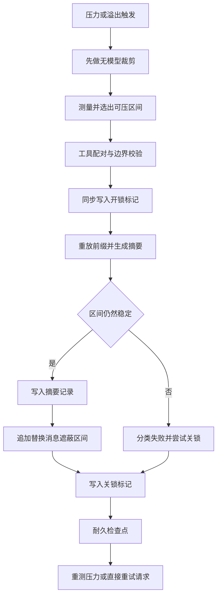
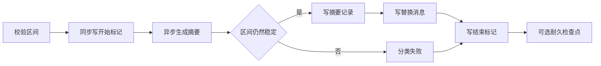

# 04 · 压缩与裁剪

上下文变长以后要变短,但事件日志只能追加。压缩就是在这个矛盾里工作的:**它从不删除任何日志事件,只在 surface 上把一段可见节点换成一个摘要节点**——改写的是"模型现在看到什么",改写的凭证本身也是一条新事件。这篇走一遍完整事务:什么时候触发、区间怎么选、锁怎么开合、失败怎么分类,以及一条与压缩并列的、不需要模型的裁剪路径。

---

## 一、两个触发点,一个入口

压缩能力缝只承诺三个方法,自动与手动分开:

```typescript
// packages/compaction/compaction/src/index.ts:87-117(节选)
export abstract class CompactionEngine extends Service {
  // ...(略):JSDoc 说明触发策略、保留与摘要由实现拥有,可另用独立计量服务;构造函数注册 'compaction'
  abstract compactIfNeeded(
    agent: CompactionAgentContext,
    trigger: CompactionTrigger,
    signal: AbortSignal,
  ): Promise<CompactionResult | null>
```

两个触发器的差别不只是阈值。`pressure` 是"还没爆但该收了",走完整阈值判定;`context-overflow` 是"provider 已经明确告诉你超了",此时**忽略阈值与保留尾巴策略**,只要能找到任何平衡区间就压一次:

```typescript
// packages/compaction/compaction/src/index.ts:24-25
/** Why automatic policy is asking a backend to consider compaction. */
export type CompactionTrigger = 'pressure' | 'context-overflow'
```

`compaction-basic` 把两者注册为两个事件监听者。压力检查挂在步进前的瀑布上,失败**只记录不阻断**——一个配置错误不该让整个回合挂掉:

```typescript
// packages/compaction/compaction-basic/src/index.ts:148-166(节选)
    ctx.on('agent/pre-step', async (
      { agent, signal },
      next,
    ): Promise<PreStepDecision> => {
      // ...(略):调用 compactIfNeeded(agent, 'pressure', signal) 并记录结果;配置错误每个 target 只警告一次,最后 return next()
```

溢出恢复挂在请求错误上,并且有一个显式的重试预算——它返回 `{ kind: 'retry' }` 让 loop 重发同一个请求:

```typescript
// packages/compaction/compaction-basic/src/index.ts:180-224(节选)
    ctx.on('agent/request-error', async (
      { agent, failure, signal },
      next,
    ) => {
      if (failure.code !== CONTEXT_WINDOW_EXCEEDED_CODE || signal.aborted) return next()
      // ...(略):登记 overflowAgents、解析路由策略,重试超过 maxOverflowRetries 即 return next()
      const generation = agent.session.surface.replaceGeneration
      // ...(略):compactIfNeeded(agent, 'context-overflow', signal);摘要抛错时不吞掉已落地的裁剪
      if (signal.aborted
        || agent.session.surface.replaceGeneration <= generation) return next()
      // ...(略):重试计数加一后返回 { kind: 'retry' } 让 loop 重发同一个请求
```

判据用的是 **surface 世代是否前进**,而不是"函数是否返回了结果"。这样即使摘要这一阶段抛错,只要之前的无模型裁剪已经真的改写了 surface,重试仍然算数——已落地的缩减不该因为后续步骤失败而被丢弃。重试预算还配了两个复位条件:`agent/status` 变为 `idle`(`index.ts:168-170`)与出现新的 `assistant/message`(`:174-178`)。后者的意义是"一次成功的响应就开启一段新的溢出恢复序列",即使工具调用把同一个回合延续到下一个请求。

---

## 二、选区算法

选区的目标很具体:**从第一个非系统节点开始,一直压到一个"保留足够尾部"的平衡切点**。


<details><summary>Mermaid 源码</summary>



</details>

| 阶段 | 做了什么 | 关键调用(文件:行) |
|---|---|---|
| 无模型裁剪先跑 | 溢出路径无条件先裁;压力路径在跨过阈值后才裁,裁完重新测量 | [`compaction-basic/src/index.ts:285-288`](https://github.com/deepseek-ai/deepseek-harness/blob/dbbaa4a37fb9098aba814c97d2956f7b2f105f46/packages/compaction/compaction-basic/src/index.ts#L285-L288)、[`:309-313`](https://github.com/deepseek-ai/deepseek-harness/blob/dbbaa4a37fb9098aba814c97d2956f7b2f105f46/packages/compaction/compaction-basic/src/index.ts#L309-L313) |
| 容量与阈值 | 从适配器取真实上下文窗口,按比例算出阈值与保留预算;`retainTokens >= thresholdTokens` 直接报配置错误 | `resolveCompactSpec` [`config.ts:133`](https://github.com/deepseek-ai/deepseek-harness/blob/dbbaa4a37fb9098aba814c97d2956f7b2f105f46/packages/compaction/compaction-basic/src/config.ts#L133)、[`:144-154`](https://github.com/deepseek-ai/deepseek-harness/blob/dbbaa4a37fb9098aba814c97d2956f7b2f105f46/packages/compaction/compaction-basic/src/config.ts#L144-L154) |
| 表面一致性 | 计量器的节点必须与当前 surface 逐位相同,否则说明两个折叠已经分叉 | `selectCompactableRange` [`region.ts:125-129`](https://github.com/deepseek-ai/deepseek-harness/blob/dbbaa4a37fb9098aba814c97d2956f7b2f105f46/packages/compaction/compaction-basic/src/region.ts#L125-L129) |
| 起点 | 节点 0 是 `system/message` 时从索引 1 起,否则从 0 起 | [`region.ts:131`](https://github.com/deepseek-ai/deepseek-harness/blob/dbbaa4a37fb9098aba814c97d2956f7b2f105f46/packages/compaction/compaction-basic/src/region.ts#L131) |
| 尾部预算 | 从末尾向前累加,累计达到保留预算就停下,得到保留起点 | [`region.ts:133-140`](https://github.com/deepseek-ai/deepseek-harness/blob/dbbaa4a37fb9098aba814c97d2956f7b2f105f46/packages/compaction/compaction-basic/src/region.ts#L133-L140) |
| 配对回退 | 保留起点不是配对平衡切点时**向前逐格回退**,直到平衡或退到起点 | [`region.ts:143-148`](https://github.com/deepseek-ai/deepseek-harness/blob/dbbaa4a37fb9098aba814c97d2956f7b2f105f46/packages/compaction/compaction-basic/src/region.ts#L143-L148) |
| 多轮 | 一次压缩后重新测量;仍高于阈值就再压,直到 `compactionRetries` 用尽 | [`index.ts:316-332`](https://github.com/deepseek-ai/deepseek-harness/blob/dbbaa4a37fb9098aba814c97d2956f7b2f105f46/packages/compaction/compaction-basic/src/index.ts#L316-L332) |

```typescript
// packages/compaction/compaction-basic/src/region.ts:107-155
export function selectCompactableRange(
  session: Session,
  measurement: TokenMeasurement,
  retainTokens: number,
): { start: SessionSeq; end: SessionSeq } | null {
  const pricedNodes = measurement.nodes
  if (pricedNodes.length === 0) return null
  // ...(略):计量节点与当前 surface 逐位不符即抛 mismatch;尾部预算得到 keepFromIdx,不足或配对回退到起点都返回 null
  return { start: first, end: cutoff }
}
```

三个 `return null` 是三种"这一轮不压"的结论:没有可测量的节点、尾部预算已经吃掉全部可压区间、以及配对回退退到了起点——**宁可什么都不做,也不制造一个会让 provider 拒绝的转录**。阈值本身的来源是显式的适配器容量,取不到就抛配置错误而不是猜一个默认值:

```typescript
// packages/compaction/compaction-basic/src/config.ts:127-167(节选)
/** Scale one routed policy into concrete token budgets for its model capacity. */
export function resolveCompactSpec(
  policy: ResolvedTargetPolicy,
  contextWindow: number,
): ResolvedCompactSpec {
  // ...(略):137-166 行是容量正整数校验、阈值与保留预算的换算,以及深冻结的返回值
}
```

### 工具配对平衡

`toolPairingBalancedBefore/After` 是选区的核心判据。它不依赖 step 标记,而是直接数"当前 surface 上还有几个未回答的工具调用":

```typescript
// packages/compaction/compaction/src/tool-pairing.ts:11-38(节选)
/** Incremental balance state for one session surface generation. */
interface BalanceCache {
  generation: number
  // ...(略):cutBalanced 是每条边界的平衡位图,surface 的 N 个序列有 N+1 个切点;另有 indexBySeq 与 inProgressToolCalls
}
// ...(略):26 行是模块级 WeakMap,把平衡状态挂在 Session 上
/** Return how one surface event changes the in-progress tool-call count. */
function eventDelta(event: SessionEvent): number {
  switch (event.type) {
    case 'assistant/message':
      return event.data.message.content.filter(block => block.type === 'tool-call').length
    case 'tool/result':
      return -1
    default:
      return 0
  }
}
```

一条 `assistant/message` 里可能有零到多个 `tool-call` 块,所以增量是**块的数量**而不是 1。`cutBalanced` 是"每条边界的平衡位图",长度恰好是节点数加一——这就是为什么它的索引可以直接回答"某条边界是不是安全切点"。缓存用 `generation` 与长度双判据失效,并且**在改动活缓存之前先校验要追加的尾部**,这样一条损坏的 surface 不会留下半个推进过的新状态(`extendCache` [`tool-pairing.ts:41-69`](https://github.com/deepseek-ai/deepseek-harness/blob/dbbaa4a37fb9098aba814c97d2956f7b2f105f46/packages/compaction/compaction/src/tool-pairing.ts#L41-L69),校验循环在 [`:52-63`](https://github.com/deepseek-ai/deepseek-harness/blob/dbbaa4a37fb9098aba814c97d2956f7b2f105f46/packages/compaction/compaction/src/tool-pairing.ts#L52-L63))。

两个错误分支都指向"surface 坏了":引用了不存在的日志事件,或者出现了没有对应调用的结果。这类情况不该被"当成不平衡"静默处理,因为那会把一个更严重的状态损坏伪装成一次普通的选不到区间。

---

## 三、一次压缩事务

事务的形状是**同步开锁 → 异步摘要 → 同步提交 → 同步关锁**。开锁与后面的异步工作之间没有任何 await,这是刻意的:durable 的 `compaction/start` 标记就是锁本身。


<details><summary>Mermaid 源码</summary>



</details>

```typescript
// packages/compaction/compaction-basic/src/region.ts:157-250(节选)
export async function compactSurfaceRegion(
  dependencies: RegionDependencies,
  session: Session,
  start: SessionSeq,
  end: SessionSeq,
  // ...(略):agent、options、signal
): Promise<CompactionResult> {
  // ...(略):选区只读;空闲/日志校验与 compaction/start 同步相邻,durable 开始标记即锁;失败只做一次关锁尝试
  // ...(略):inspectCompactionEntryState + assertCompactionInactive 校验 durable 锁,再按 options.stability 选定 assertStable
```

锁的存活判据不是"有没有待处理的 promise",而是日志里有没有**未配对的开始标记**:

```typescript
// packages/compaction/compaction-basic/src/region.ts:300-319
/**
 * Reject a durable unmatched compaction marker unless a later constructor-seed
 * boundary proves that its owner belongs to an earlier session lifecycle.
 */
function assertCompactionInactive(
  unmatchedCompactionStart: SessionEvent<'compaction/start'> | undefined,
  latestEndSeedSeq: SessionSeq | undefined,
  stage: string,
): void {
  if (unmatchedCompactionStart === undefined
    || (latestEndSeedSeq !== undefined
      && latestEndSeedSeq > unmatchedCompactionStart.seq)) return
```

那条 seed 边界豁免解决了一个真实问题:一个崩溃在压缩中途的会话被 resume 以后,日志里会留下一个永远配不上对的开始标记。`session/end-seed` 事件([`core/session/src/types.ts:400`](https://github.com/deepseek-ai/deepseek-harness/blob/dbbaa4a37fb9098aba814c97d2956f7b2f105f46/packages/core/session/src/types.ts#L400))在这里被当作"上一个生命周期到此为止"的凭证——**在它之前的未配对标记属于已经结束的生命周期,不构成活锁**。这也是 `session/end-seed` 文档里"独立开合括号的持有者要读它"那句话的落点。区间校验除了存在性与顺序,还就地检查两条边界是否配对平衡:

```typescript
// packages/compaction/compaction-basic/src/region.ts:335-357(节选)
/** Validate one requested surface-position span before asynchronous work begins. */
function validateSurfaceRegion(session: Session, start: SessionSeq, end: SessionSeq): SurfaceSelection {
  const nodes = session.surface.nodes
  const startIdx = nodes.indexOf(start)
  const endIdx = nodes.indexOf(end)
  // ...(略):任一端点不在 surface 上或起点晚于终点,都抛 compactRegion 错误
  // ...(略):起点用 toolPairingBalancedBefore、终点用 toolPairingBalancedAfter 就地校验平衡
```

### 摘要必须比被压内容更小

摘要生成完成后有两道闸门:一道问"区间还在不在",一道问"摘要是不是真的更小"。

```typescript
// packages/compaction/compaction-basic/src/region.ts:385-413(节选)
/** Run the summarizer and frame its replacement checkpoint. */
async function summarizeCompaction(
  dependencies: RegionDependencies,
  prepared: PreparedCompaction,
  // ...(略):agent、compactionId、sourceCommandId、signal
): Promise<SummarizedCompaction> {
  const summaryResult = await dependencies.summarize(prepared.input, agent, signal)
  // ...(略):用 frameSummary 包装摘要文本,source 取 compactCheckpointSource(compactionId, sourceCommandId)
  const framedSummaryTokenCount = dependencies.meter.estimateMessage(checkpointMessage)
  if (framedSummaryTokenCount >= prepared.shadowedRouteTokenCount) {
    // ...(略):抛"摘要不比被遮蔽内容小",并给出两侧的估算值
  }
}
```

比较用的价格有两套:`shadowedTokenCount` 用固定启发式(供纯消费者做廉价减法),`shadowedRouteTokenCount` 用路由真实定价(供"是否真的变小"这个判断)。摘要必须严格小于被遮蔽内容的**路由价**,否则这次压缩毫无意义——不但没省,还把一次昂贵的模型调用花掉了;稳定性断言则分强弱:自动压缩要求整个 surface 没被别的地方改过,手动压缩只要求选中的那段没变,因为它在空闲期运行,期间允许注入的上下文插进来:

```typescript
// packages/compaction/compaction-basic/src/region.ts:415-453(节选)
/** Reject a summary prepared against any earlier surface generation. */
function assertWholeSurfaceUnchanged(
// ...(略):440-445 行把定位失败翻译成 SurfaceChangedError
  if (!isDeepStrictEqual([...current.shadowedSeqs], [...prepared.shadowedSeqs])) {
    throw new SurfaceChangedError('compaction: the selected span changed during summarization')
  }
  // ...(略):再把重新计量的节点与 prepared.selectedNodes 比对,变过就抛 selected span was rewritten
```

### 提交:三件事在同一个同步段里

```typescript
// packages/compaction/compaction-basic/src/region.ts:455-507(节选)
/** Append one completed summary record and replacement body without yielding. */
function commitCompactionBody(
  session: Session,
  startEvent: SessionEvent<'compaction/start'>,
  summarized: SummarizedCompaction,
): Omit<CompactionResult, 'endSeq'> {
  // ...(略):从 summarized 取出 start、end、checkpointMessage 等字段;callProvenance 区分 llmStreamCall 与裸 rawOutput
  const summaryEvent = session.append('compaction/summary', {
    compactionId: startEvent.data.compactionId,
  })
  session.append('user/message', checkpointMessage, {
    surfaceOp: { op: 'replace', startSeq: start, endSeq: end },
    sourceEventSeqs: [startEvent.seq, summaryEvent.seq, ...shadowedSeqs],
  })
```

`sourceEventSeqs` 这一行是整个压缩的关键:**它同时列出了开锁标记、摘要记录和每一个被遮蔽的节点**。前两个是"这次替换的元数据来源",后一组是 surface 折叠要求的完整性(见 [`02-surface-and-visibility.md`](./02-surface-and-visibility.md))。摘要记录本身是 log-only 的,它不携带 `surfaceOp`,真正进 surface 的是紧跟其后的那条 `user/message`——两者必须**同步紧邻**,因为一个纯消费者要把摘要的定价与被遮蔽区间配对,靠的就是这条邻接关系:

```typescript
// packages/compaction/compaction/src/types.ts:68-89(节选)
    /**
     * Marks the end of a compaction — log-only, releases the lock. Its owner
     * matches `compaction/start`; `error` records an unsuccessful attempt.
     */
    'compaction/end': { compactionId: CompactionId; sourceCommandId?: CommandId; turn: number | null; error?: string }
    /**
     * Shadow price of one model-free prune replacement — log-only, no surfaceOp.
     * // ...(略):surface replace 的定价取紧邻其前的计量事件;替换事件必须紧随其后同步追加
     */
    'compaction/prune': {
```

替换消息的溯源标记是后端无关的:`compactCheckpointSource()` 固定写 `{ kind: 'plugin', plugin: 'compact' }`,再加本次事务的 id。这只是一个标记构造函数,不引入任何 host 依赖,所以客户端程序也能识别它:

```typescript
// packages/compaction/compaction/src/checkpoint.ts:19-42(节选)
const COMPACT_CHECKPOINT_MARKER = Object.freeze({ kind: 'plugin', plugin: 'compact' } as const)
// ...(略):CompactionCheckpointSource = 该标记 & { compactionId; sourceCommandId? }
export function compactCheckpointSource(
  compactionId: CompactionId,
  sourceCommandId?: CommandId,
): CompactionCheckpointSource {
```

### 摘要请求复用会话前缀

摘要不是让模型"读一遍对话再总结",而是**把被压区间本身当作对话前缀重放**,只在末尾追加一条压缩指令。这样 provider 的 KV 缓存前半段可以直接复用:

```typescript
// packages/compaction/compaction-basic/src/region.ts:517-539(节选)
/**
 * Reconstruct the last routed request's cacheable prefix for the shadowed
 * region: the system prompt held by the `system/message` at surface node 0,
 * // ...(略):再取 header 的工具 schema 与区间自身的派生消息;摘要器只在其后追加压缩指令,所以这次调用是真正的对话前缀并复用 KV 缓存
 */
function buildSummarizationInput(
  session: Session,
  shadowedSeqs: readonly SessionSeq[],
): SummarizationInput {
```

---

## 四、失败与重试

`ManualCompactionError.code` 是一个六值封闭联合,把"哪一阶段坏了"变成可路由的分类:

```typescript
// packages/compaction/compaction/src/index.ts:27-57(节选)
/** Expected failure classes for an explicit idle-session compaction request. */
export type ManualCompactionErrorCode =
  | 'busy'
  | 'cancelled'
  | 'changed'
  | 'summary'
  | 'commit'
  | 'persistence'
// ...(略):ManualCompactionError extends Error,面向直接的人类命令结果
```

| 分类 | 触发条件 | 位置 |
|---|---|---|
| `busy` | 已有未配对的 `compaction/start`,或空闲会话上还有开着回合,或 agent 不空闲 | [`region.ts:315`](https://github.com/deepseek-ai/deepseek-harness/blob/dbbaa4a37fb9098aba814c97d2956f7b2f105f46/packages/compaction/compaction-basic/src/region.ts#L315)、[`:194`](https://github.com/deepseek-ai/deepseek-harness/blob/dbbaa4a37fb9098aba814c97d2956f7b2f105f46/packages/compaction/compaction-basic/src/region.ts#L194)、[`index.ts:416`](https://github.com/deepseek-ai/deepseek-harness/blob/dbbaa4a37fb9098aba814c97d2956f7b2f105f46/packages/compaction/compaction-basic/src/index.ts#L416) |
| `cancelled` | 取消信号来自 agent 自身的空闲任务,而不是调用方信号 | [`index.ts:403-408`](https://github.com/deepseek-ai/deepseek-harness/blob/dbbaa4a37fb9098aba814c97d2956f7b2f105f46/packages/compaction/compaction-basic/src/index.ts#L403-L408) |
| `changed` | 摘要完成后区间已被改写(`SurfaceChangedError`) | [`region.ts:286-292`](https://github.com/deepseek-ai/deepseek-harness/blob/dbbaa4a37fb9098aba814c97d2956f7b2f105f46/packages/compaction/compaction-basic/src/region.ts#L286-L292) |
| `summary` | 摘要生成本身失败 | [`region.ts:293-297`](https://github.com/deepseek-ai/deepseek-harness/blob/dbbaa4a37fb9098aba814c97d2956f7b2f105f46/packages/compaction/compaction-basic/src/region.ts#L293-L297) |
| `commit` | 提交段或关锁追加失败 | [`region.ts:279-285`](https://github.com/deepseek-ai/deepseek-harness/blob/dbbaa4a37fb9098aba814c97d2956f7b2f105f46/packages/compaction/compaction-basic/src/region.ts#L279-L285) |
| `persistence` | 关锁后的耐久检查点失败 | [`region.ts:265-271`](https://github.com/deepseek-ai/deepseek-harness/blob/dbbaa4a37fb9098aba814c97d2956f7b2f105f46/packages/compaction/compaction-basic/src/region.ts#L265-L271) |

手动压缩先占用 agent 的空闲窗口,把"忙"从异步路径里挤到同步门口:

```typescript
// packages/compaction/compaction-basic/src/index.ts:361-421(节选)
  override compactNow(
    agent: Agent,
    signal: AbortSignal,
    sourceCommandId?: CommandId,
  ): Promise<CompactionResult | null> {
    try {
      return agent.runMaintenance(async (agentSignal) => {
        // ...(略):AbortSignal.any 合并两个信号,选区后以 owner 为 null 调用 compactSurfaceRegion,成功后 flush
        // ...(略):两者同因时重抛为 cancelled,否则原样抛出
      })
    } catch (error: unknown) {
      // ...(略):runMaintenance 同步抛出的任何失败都归为 busy
```

注意外层的 `catch` 会把**任何**从 `runMaintenance` 同步抛出的失败归为 `busy`——因为那正是"agent 已经活跃"的报错通道。而内层的 `cancelled` 判定用了一个精确的比较:`operationSignal.reason === agentSignal.reason`,即"取消来自 agent 窗口关闭,而不是调用方撤销"。这两种取消对用户是不同的事实。失败路径的形状也值得留意:关锁只尝试**一次**。如果连 `compaction/end` 都写不进去,代码刻意不去掩盖——未配对的开始标记留在日志里,下次会用 `busy` 报出来。这比"悄悄清除锁状态"要诚实:

```typescript
// packages/compaction/compaction-basic/src/region.ts:239-264(节选)
  } catch (error: unknown) {
    failure = { error, stage: closing ? 'commit' : stage }
    if (!closing) {
      closing = true
      try {
        session.append('compaction/end', { ...lifecycle, error: errorChain(error) })
        closed = true
      } catch (closeError: unknown) {
        failure = { error: closeError, stage: 'commit' }
      }
    }
  }
  // ...(略):只有关锁成功后才会执行 options.flush,其失败记入 flushFailure
```

---

## 五、独立裁剪路径:无模型的工具结果裁剪

`compaction-tool-result-pruner` 做的是另一件事:**不调用模型,只把超预算的工具结果正文掐头去尾**。它与压缩共享 `replace` 机制与影子定价协议,但是一个独立的 Service,压缩后端通过 `ctx.get('toolResultPruner')` 可选地使用它——`compaction-basic` 不因它缺席而不能工作。

```typescript
// packages/compaction/compaction-tool-result-pruner/src/index.ts:124-136(节选)
  // ...(略):JSDoc 说明替换只改 content、其余事件数据原样保留并引用被遮蔽节点,替换前必有 compaction/prune 定价事件
  pruneSession(session: Session): PruneResult {
// packages/compaction/compaction-tool-result-pruner/src/index.ts:145-181(节选)
    for (const { seq, event } of candidates) {
      // ...(略):取出候选工具结果,pruneContent 返回 null 就跳过
      session.append('compaction/prune', {
        shadowedRange: { start: seq, end: seq },
        shadowedTokenCount: this.ctx.tokenMeter.estimateMessage(event.data.message),
      })
      const replacement = session.append('tool/result', {
        ...event.data,
        message,
      }, {
        surfaceOp: { op: 'replace', startSeq: seq, endSeq: seq },
        sourceEventSeqs: [seq],
      })
```

这条路径之所以能改写工具结果,前提是 surface 层对 `tool/result` 的窄化规则:替换事件除 `content` 外必须与原件深度相等(见 [`02-surface-and-visibility.md`](./02-surface-and-visibility.md) 第三节)。裁剪只改正文,工具名、参数、错误元数据、调用 id 全部原样带过去,所以一次裁剪不可能伪造出一个"没发生过的工具调用"。裁剪按 **Unicode 码点**切分而不是 UTF-16 码元,并且替换后必须自证更小:

```typescript
// packages/compaction/compaction-tool-result-pruner/src/index.ts:76-122(节选)
  /**
   * Replace an over-budget text middle while retaining rich-block order.
   * Text slicing is by Unicode code point, not UTF-16 code unit, so a retained
   * boundary cannot split a surrogate pair. Grapheme clusters may still split.
   */
  pruneContent(blocks: readonly ContentBlock[]): ContentBlock[] | null {
    const totalChars = this.measureContent(blocks)
    if (totalChars <= this.config.thresholdChars) return null
    // ...(略):按 headChars / tailChars 切分并在断口插入 PRUNE_MARKER;仍超阈值或不小于原长即抛错
```

**与 spill 的分工**是互补而非重叠:溢写把超长结果搬到日志之外的文件系统,日志里只留一段有界摘要(见 [`06-stateful-memory.md`](./06-stateful-memory.md));裁剪则在日志内部把已经落地的大结果正文缩小。两者都减少模型看到的字节数,但溢写发生在结果首次进入日志之前,裁剪发生在之后。`packages/spill` 里唯一的压缩相关文字只有一句 README 说明——"替换文本留在历史里直到被压缩处理"——**两个包之间没有任何代码耦合**,方向相反也不互调。

---

## 关键文件 / 符号索引

| 符号 | 位置 | 作用 |
|---|---|---|
| `CompactionTrigger` / `ManualCompactionErrorCode` / `ManualCompactionError` | [`packages/compaction/compaction/src/index.ts:25`](https://github.com/deepseek-ai/deepseek-harness/blob/dbbaa4a37fb9098aba814c97d2956f7b2f105f46/packages/compaction/compaction/src/index.ts#L25)、[`:28`](https://github.com/deepseek-ai/deepseek-harness/blob/dbbaa4a37fb9098aba814c97d2956f7b2f105f46/packages/compaction/compaction/src/index.ts#L28)、[`:41`](https://github.com/deepseek-ai/deepseek-harness/blob/dbbaa4a37fb9098aba814c97d2956f7b2f105f46/packages/compaction/compaction/src/index.ts#L41) | 两个触发值、六种失败分类与带分类的失败 |
| `CompactionEngine.compactIfNeeded` / `compactNow` / `compactRegion` | [`packages/compaction/compaction/src/index.ts:113`](https://github.com/deepseek-ai/deepseek-harness/blob/dbbaa4a37fb9098aba814c97d2956f7b2f105f46/packages/compaction/compaction/src/index.ts#L113)、[`:139`](https://github.com/deepseek-ai/deepseek-harness/blob/dbbaa4a37fb9098aba814c97d2956f7b2f105f46/packages/compaction/compaction/src/index.ts#L139)、[`:164`](https://github.com/deepseek-ai/deepseek-harness/blob/dbbaa4a37fb9098aba814c97d2956f7b2f105f46/packages/compaction/compaction/src/index.ts#L164) | 自动、手动与指定区间三个入口 |
| `compaction/*` 事件声明 / `CompactionResult` | [`packages/compaction/compaction/src/types.ts:17`](https://github.com/deepseek-ai/deepseek-harness/blob/dbbaa4a37fb9098aba814c97d2956f7b2f105f46/packages/compaction/compaction/src/types.ts#L17)、[`:94`](https://github.com/deepseek-ai/deepseek-harness/blob/dbbaa4a37fb9098aba814c97d2956f7b2f105f46/packages/compaction/compaction/src/types.ts#L94) | 四个 log-only 词汇与结果(含位置区间语义) |
| `compactCheckpointSource` / `isCompactCheckpointSource` | [`packages/compaction/compaction/src/checkpoint.ts:33`](https://github.com/deepseek-ai/deepseek-harness/blob/dbbaa4a37fb9098aba814c97d2956f7b2f105f46/packages/compaction/compaction/src/checkpoint.ts#L33)、[`:49`](https://github.com/deepseek-ai/deepseek-harness/blob/dbbaa4a37fb9098aba814c97d2956f7b2f105f46/packages/compaction/compaction/src/checkpoint.ts#L49) | 后端无关的替换消息溯源与持久化检查点识别 |
| `toolPairingBalancedBefore` / `toolPairingBalancedAfter` / `BalanceCache` | [`packages/compaction/compaction/src/tool-pairing.ts:112`](https://github.com/deepseek-ai/deepseek-harness/blob/dbbaa4a37fb9098aba814c97d2956f7b2f105f46/packages/compaction/compaction/src/tool-pairing.ts#L112)、[`:124`](https://github.com/deepseek-ai/deepseek-harness/blob/dbbaa4a37fb9098aba814c97d2956f7b2f105f46/packages/compaction/compaction/src/tool-pairing.ts#L124)、[`:11`](https://github.com/deepseek-ai/deepseek-harness/blob/dbbaa4a37fb9098aba814c97d2956f7b2f105f46/packages/compaction/compaction/src/tool-pairing.ts#L11) | 前后边界平衡判定与平衡位图增量状态 |
| `BasicCompactionEngine` / `_registerAutomaticCompaction` | [`packages/compaction/compaction-basic/src/index.ts:104`](https://github.com/deepseek-ai/deepseek-harness/blob/dbbaa4a37fb9098aba814c97d2956f7b2f105f46/packages/compaction/compaction-basic/src/index.ts#L104)、[`:138`](https://github.com/deepseek-ai/deepseek-harness/blob/dbbaa4a37fb9098aba814c97d2956f7b2f105f46/packages/compaction/compaction-basic/src/index.ts#L138) | 基础后端与两个触发监听 |
| `compactIfNeeded` / `compactNow` | [`packages/compaction/compaction-basic/src/index.ts:259`](https://github.com/deepseek-ai/deepseek-harness/blob/dbbaa4a37fb9098aba814c97d2956f7b2f105f46/packages/compaction/compaction-basic/src/index.ts#L259)、[`:369`](https://github.com/deepseek-ai/deepseek-harness/blob/dbbaa4a37fb9098aba814c97d2956f7b2f105f46/packages/compaction/compaction-basic/src/index.ts#L369) | 阈值判定与多轮压缩 / 空闲窗口与失败分类 |
| `resolveCompactSpec` / `selectCompactableRange` / `compactSurfaceRegion` | [`packages/compaction/compaction-basic/src/config.ts:133`](https://github.com/deepseek-ai/deepseek-harness/blob/dbbaa4a37fb9098aba814c97d2956f7b2f105f46/packages/compaction/compaction-basic/src/config.ts#L133)、[`region.ts:117`](https://github.com/deepseek-ai/deepseek-harness/blob/dbbaa4a37fb9098aba814c97d2956f7b2f105f46/packages/compaction/compaction-basic/src/region.ts#L117)、[`:173`](https://github.com/deepseek-ai/deepseek-harness/blob/dbbaa4a37fb9098aba814c97d2956f7b2f105f46/packages/compaction/compaction-basic/src/region.ts#L173) | 容量换算为预算 / 选区算法 / 事务主干 |
| `assertCompactionInactive` / `assertNoActiveCompaction` | [`packages/compaction/compaction-basic/src/region.ts:307`](https://github.com/deepseek-ai/deepseek-harness/blob/dbbaa4a37fb9098aba814c97d2956f7b2f105f46/packages/compaction/compaction-basic/src/region.ts#L307)、[`:326`](https://github.com/deepseek-ai/deepseek-harness/blob/dbbaa4a37fb9098aba814c97d2956f7b2f105f46/packages/compaction/compaction-basic/src/region.ts#L326) | durable 锁判定与异步决策后的复查 |
| `validateSurfaceRegion` / `prepareCompaction` | [`packages/compaction/compaction-basic/src/region.ts:336`](https://github.com/deepseek-ai/deepseek-harness/blob/dbbaa4a37fb9098aba814c97d2956f7b2f105f46/packages/compaction/compaction-basic/src/region.ts#L336)、[`:360`](https://github.com/deepseek-ai/deepseek-harness/blob/dbbaa4a37fb9098aba814c97d2956f7b2f105f46/packages/compaction/compaction-basic/src/region.ts#L360) | 区间与边界校验 / 两种定价的快照 |
| `summarizeCompaction` / `assertWholeSurfaceUnchanged` / `assertSelectedSpanStable` | [`packages/compaction/compaction-basic/src/region.ts:386`](https://github.com/deepseek-ai/deepseek-harness/blob/dbbaa4a37fb9098aba814c97d2956f7b2f105f46/packages/compaction/compaction-basic/src/region.ts#L386)、[`:416`](https://github.com/deepseek-ai/deepseek-harness/blob/dbbaa4a37fb9098aba814c97d2956f7b2f105f46/packages/compaction/compaction-basic/src/region.ts#L416)、[`:432`](https://github.com/deepseek-ai/deepseek-harness/blob/dbbaa4a37fb9098aba814c97d2956f7b2f105f46/packages/compaction/compaction-basic/src/region.ts#L432) | 摘要与"必须更小"闸门 / 自动与手动的稳定性断言 |
| `commitCompactionBody` / `buildSummarizationInput` | [`packages/compaction/compaction-basic/src/region.ts:456`](https://github.com/deepseek-ai/deepseek-harness/blob/dbbaa4a37fb9098aba814c97d2956f7b2f105f46/packages/compaction/compaction-basic/src/region.ts#L456)、[`:529`](https://github.com/deepseek-ai/deepseek-harness/blob/dbbaa4a37fb9098aba814c97d2956f7b2f105f46/packages/compaction/compaction-basic/src/region.ts#L529) | 摘要记录 + 替换消息 / 复用会话前缀 |
| `summarizeWithLlm` / `frameSummary` | [`packages/compaction/compaction-basic/src/summarizer.ts:119`](https://github.com/deepseek-ai/deepseek-harness/blob/dbbaa4a37fb9098aba814c97d2956f7b2f105f46/packages/compaction/compaction-basic/src/summarizer.ts#L119)、[`:186`](https://github.com/deepseek-ai/deepseek-harness/blob/dbbaa4a37fb9098aba814c97d2956f7b2f105f46/packages/compaction/compaction-basic/src/summarizer.ts#L186) | 单次流式摘要调用与摘要文本框架 |
| `ToolResultPruner.pruneSession` / `pruneContent` | [`packages/compaction/compaction-tool-result-pruner/src/index.ts:136`](https://github.com/deepseek-ai/deepseek-harness/blob/dbbaa4a37fb9098aba814c97d2956f7b2f105f46/packages/compaction/compaction-tool-result-pruner/src/index.ts#L136)、[`:83`](https://github.com/deepseek-ai/deepseek-harness/blob/dbbaa4a37fb9098aba814c97d2956f7b2f105f46/packages/compaction/compaction-tool-result-pruner/src/index.ts#L83) | 无模型裁剪与码点级掐头去尾 |
