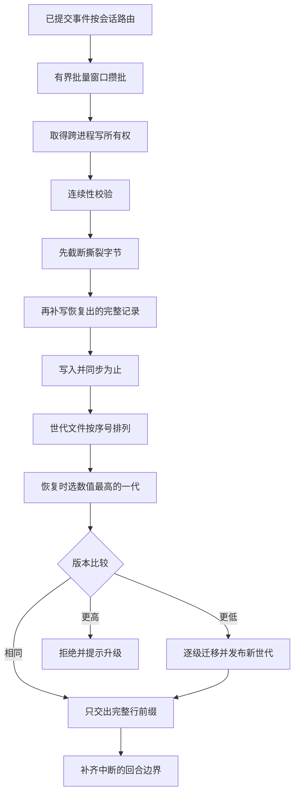

# 05 · 落盘与恢复

内存里的日志是权威,但它活不过进程退出。持久化要解决的是一个不对称的问题:**写入侧可以攒够再落盘,读回侧却必须假设文件尾巴可能是半截的**。这篇把两侧放在一起看——物理格式、世代文件的命名与选取、200 毫秒批量窗口、跨进程写所有权、撕裂尾巴的读侧过滤与写侧修复、格式迁移链的完整性,以及 resume 的五个步骤。

---

## 一、物理格式:首行 header + 每事件一行

一个会话落成一个目录,目录里每个格式世代一个文件。公共形状是"首行是 `type: 'session'` 的 header 记录,正文严格一事件一行、行尾带换行":

```typescript
// packages/session/session-persistence-jsonl/src/format.ts:306-314(节选)
/**
 * Serialize a current event batch as JSONL lines (no trailing newline). Compact
 * Assistant streams are nested event data; every event occupies one row.
 */
export function eventLines(events: readonly SessionEvent[]): string {
  return events.map(eventLine).join('\n')
}
// ...(略):eventLine 把单条事件编码为一行 JSON,不带行尾换行
```

header 行不属于可重放事件日志,字段与白名单单独钉死,且**不允许任何其他键**:

```typescript
// packages/session/session-persistence-jsonl/src/format.ts:78-97(节选)
/**
 * The current physical header stored as the first JSONL record. The exact
 * inherited cut lives on the last tagged `session/end-seed` event.
 */
interface HeaderLine {
  type: 'session'
  version: number
  id: SessionId
  createdAt: number
  cwd?: string
  // ...(略):parentSession / isSeeded / origin / delegationDepth / agentPreset
}
// ...(略):HEADER_REQUIRED_KEYS / HEADER_OPTIONAL_KEYS / HEADER_KEYS 三张白名单
```

继承切点 `inheritedEventCount` **不进** header 字段,由生成器编码进日志里最后一条带 `{ inherited: true }` 的 `session/end-seed` 事件。所以 header 行与事件行校验口径不同:header 走 `isHeaderLine`(`format.ts:158`),事件行走 `validateStoredEvents` 的词汇门与 `adoptSessionEvent` 的载荷校验。

zstd 模式下**帧边界刻意对齐记录边界**——首行独占一帧,后续每批事件一帧:

```typescript
// packages/session/session-persistence-jsonl/src/index.ts:1206-1221
  /** Encode the header and first batch without combining their frame boundaries. */
  private async encodeMaterialization(
    meta: SessionHeader,
    inheritedEventCount: SessionLogOffsetType,
    events: readonly SessionEvent[],
  ): Promise<Buffer | string> {
    const header = JSON.stringify(toHeaderLine(meta, meta.isSeeded ? inheritedEventCount : undefined)) + '\n'
    if (events.length === 0) {
      return this.compression === 'none' ? header : compressZstdFrame(header)
    }
    const body = eventLines(events) + '\n'
    if (this.compression === 'none') return header + body
    const headerFrame = await compressZstdFrame(header)
    const eventFrame = await compressZstdFrame(body)
    return Buffer.concat([headerFrame, eventFrame])
  }
```

分帧的收益在恢复时才体现:**最后一个可能不完整的帧里,已经 flush 出来的完整记录仍然能被解出来**,不必整帧丢弃。这是读侧能"从撕裂尾巴里捞回记录"而不是简单砍掉的前提。

---

## 二、世代文件:命名与选取

命名只有两条规则:版本 0 保留原名,之后带小写数字分量。

```typescript
// packages/session/session-format/src/filename.ts:5-17(节选)
const CANONICAL_LOG_FILENAME = /^session(?:\.v([1-9][0-9]*))?\.jsonl$/u

/**
 * Name the raw JSONL log of one immutable Session format generation. Version
 * zero keeps the original `session.jsonl`; every later generation carries a
 * lowercase numeric `.vN` component before the `.jsonl` suffix.
 */
export function sessionFormatLogFilename(version: number): string {
  const generation = sessionFormatVersion(version, 'Session format version')
  return generation === 0 ? 'session.jsonl' : `session.v${generation}.jsonl`
}
```

JSONL 后端再叠一层压缩后缀。选代是"目录里数值最大的 canonical 代";压缩后缀与当前配置不符时**报错而不是挑一个能读的**——静默选明文会让后续的世代判断建立在错误假设上:

```typescript
// packages/session/session-persistence-jsonl/src/index.ts:1384-1395(节选)
    for (const entry of entries) {
      const version = parseGenerationLogFilename(entry.name, this.compression)
      if (version !== undefined) {
        generations.push({ path: join(dir, entry.name), version })
        continue
      }
      if (parseGenerationLogFilename(entry.name, this.oppositeCompression()) !== undefined) {
        opposite.push(join(dir, entry.name))
      }
    }
    if (opposite.length > 0) throw this.encodingMismatch(opposite[0] as string)
    const latest = generations.sort((left, right) => right.version - left.version)[0]
```

会话 id 是未校验的字符串,进文件系统前必须编码。`encodeSegment()` 是**单射**的,把 `~` 与所有非 `[A-Za-z0-9._-]` 码元转成 `~XXXX`,并特判 `.` 与 `..`,消灭 `../`、绝对路径、NUL 与分隔符(`format.ts:198`)。同一个 id 出现在两个项目目录下会被判为重复并报错,而不是随便挑一个(`findLog` `jsonl/index.ts:1408`,冲突检查在 `:1418-1420`)。

---

## 三、写入路径


<details><summary>Mermaid 源码</summary>



</details>

| 阶段 | 做了什么 | 关键调用(文件:行) |
|---|---|---|
| 路由 | 订阅 `session/event`,按会话 id 找写句柄;没有写句柄的会话一个字节都不落 | `install` `jsonl/storage.ts:534` |
| 入队 | 活事件先深拷贝一份持久化自有的副本,再追加进缓冲 | `enqueueLive` `jsonl/storage.ts:274` |
| 批量窗口 | 窗口空闲时才起 200 毫秒定时器;已暂停时不再起表 | `jsonl/storage.ts:36`、`:276` |
| 排空 | 并发调用者合并成一次 drain;失败则把整批按序塞回并置为暂停 | `drainLive` `:288`、`drainBuffered` `:294` |
| 连续性 | 要求本批首个 seq 正好接上已存游标,不连续就拒绝整批 | `persistContiguous` `:323` |
| 撕裂修复 | 首次新追加前先截断撕裂字节,再把捞回的完整记录落盘 | `jsonl/storage.ts:328-337` |
| 落盘 | 追加并 fsync;写或同步失败则截断回原长度再抛错 | `appendLines` `jsonl/index.ts:1246` |
| 状态推进 | 全部成功后游标前进、标记已物化、清掉 primed 读缓存 | `jsonl/storage.ts:338` |

```typescript
// packages/session/session-persistence-jsonl/src/storage.ts:318-343(节选)
  /** The shared durable-append body: contiguity, ownership, torn-tail repair, storage write, state advance. */
  private async persistContiguous(batch: readonly SessionEvent[]): Promise<void> {
    if (this.access !== 'write') throw new SessionReadOnlyError(this.id, 'append')
    if (batch.length === 0) return
    await this.ensureLease()
    assertContiguous(this.id, batch, this.state.cursor)
    // Commit any pending torn-tail repair first, clearing each step's state
    // only once it lands so a failed step retries on the next mutation:
    // truncate the torn bytes, then durably rewrite the complete events
    // recovered from them (already counted in the primed cursor).
    if (this.state.tornTruncateTo !== undefined) {
      await this.storage.truncateTornTail(this.header, this.state.tornTruncateTo)
      this.state.tornTruncateTo = undefined
    }
    // ...(略):把 recoveredTail 里的完整记录先落盘
    await this.storage.persistBatch(this.header, batch, this.state.materialized, this.state.inheritedEventCount)
    this.state.materialized = true
    this.state.cursor += batch.length
    this.state.primed = undefined
    this.observedLength = this.state.cursor
  }
```

**修复顺序不可交换**:先截断撕裂字节,再把捞回的完整记录写回去,最后写本批。颠倒过来会把已经从文件里捞出来的记录又写一遍,产生序号重复。每一步的状态只在成功后才清空,所以中间失败会在下一次变更里重试而不是被跳过。

失败回滚针对的正是同一个风险:写了一半再抛出时游标没有前进,下次会把同一批重写,于是文件里出现两段相同序号。所以回滚是把文件截回写入前长度再抛(`appendLines` `jsonl/index.ts:1246-1274`,`rollbackAppend` `:1276`):

```typescript
// packages/session/session-persistence-jsonl/src/index.ts:1257-1270(节选)
      const { size: before } = await handle.stat()
      try {
        await handle.writeFile(content)
        await handle.sync()
      } catch (error) {
        try {
          await closeAppendHandle()
          await this.rollbackAppend(path, before)
        } catch (rollbackError) {
          throw new AggregateError([error, rollbackError], `failed to roll back append to "${path}"`)
        }
        throw error
      }
```

**惰性物化**:`create()` 只在内存里登记一个待物化条目,不产生任何文件,也**不取锁**——没有文件就没有别人能争的东西,锁在首个持久写入前才由 `ensureLease()` 取(`jsonl/storage.ts:352`)。`list()` 的顺序细节值得留意:先快照待物化条目再扫磁盘,这样"create 之后立刻 list"必然能看到,扫描过程中刚好完成物化的会话也不会漏(`jsonl/index.ts:465-468`)。

---

## 四、`flush` 屏障与检查点策略

`append` 是 best-effort,`flush` 才是崩溃存活保证,这个分界写在 seam 契约上:事件从 seq 0 连续、永不重写、撕裂的物理尾巴永不返回给读者、未知词汇 fail-closed 拒绝(`session-persistence/src/index.ts:115-134`)。

谁来调 `flush`?一个专门的策略插件在**三个语义边界**上发起,而不是每个事件都调:

```typescript
// packages/session/session-checkpoint-policy/src/index.ts:63-82(节选)
export function apply(ctx: Context): void {
  ctx.on('llm/stream', (options, next): AsyncIterable<StreamChunk> => {
    if (options.sessionId === undefined) return next()
    const session = ctx.sessions.get(options.sessionId)
    return session === undefined ? next() : afterCheckpoint(ctx, session, next)
  })

  ctx.on('tools/execute', async (exec, next): Promise<ToolExecutionResult> => {
    if (exec.agent === undefined || exec.parent !== undefined) return next()
    await ctx.sessions.flush(exec.agent.session)
    if (exec.signal.aborted) return abortedBeforeDispatchResult()
    return next()
  })

  // Before each request, persist everything committed by the preceding step;
  // the first step's call is an intentional no-op beyond any prompt intake.
  ctx.on('agent/pre-step', async ({ agent }, next): Promise<PreStepDecision> => {
    await ctx.sessions.flush(agent.session)
    return next()
  })
}
```

模型侧那条是**延迟构造流**而不是先请求再检查——`afterCheckpoint` 返回一个异步生成器,`next()` 在被迭代时才调用,所以检查点失败时 adapter 请求根本没有发出(`session-checkpoint-policy/src/index.ts:29-38`)。工具侧的顺序是"先 flush,再查取消,再执行":工具体可能有副作用,所以取消检查必须在 flush 之后、`next()` 之前,且取消时仍然产出一个**规范的错误结果**而不是抛异常——让这次未发生的调用在日志里也是一个合法结果。服务级 `flush()` 是一次并行屏障,失败的会话被收集起来最后一次性抛出;扫描中途被关闭的句柄算已 flush,因为 close 本身已经排空(`jsonl/storage.ts:508-523`)。

---

## 五、跨进程写所有权

一个会话目录同一时刻只能有一个写者,仲裁者是**内核**而不是文件里的标记位:POSIX 用 `flock(2)` 锁日志旁的 `session.lock`,Windows 用由该路径派生的内核信号量——从不锁文件或句柄,所以读者、搜索与目录删除照常进行。持有者进程死亡时内核自动释放;而一个活着但卡住的持有者**故意没有超时**,因为抢占一个只是慢的写者会让它的恢复追加撕裂日志(`lease.ts:1-19`)。

"锁的是 inode 而不是路径"这条差异在代码里就是一个有界重试:取到锁后再 stat 一次路径,确认还是同一个 inode,否则重开重试。

```typescript
// packages/session/session-persistence-jsonl/src/lease.ts:88-114(节选)
    // Bounded retry: locking an inode a releasing creator just unlinked (or a
    // recreated path) re-opens the fresh file; steady state needs one pass.
    for (let attempt = 0; attempt < 3; attempt += 1) {
      const handle = await open(path, 'w')
      try {
        try {
          await tryLockExclusive(handle.fd)
        } catch (error: unknown) {
          if (isLockContention(error)) throw new SessionAlreadyOwnedError(id)
          throw error
        }
        const held = await handle.stat({ bigint: true })
        // ...(略):stat 路径并比对 ino/dev,一致则返回持有的锁
      } catch (error: unknown) {
        await handle.close()
        throw error
      }
      await handle.close()
    }
```

释放只是关闭描述符——**锁文件永不删除**,因为它承载着后续加锁者要校验的那个稳定 inode(`lease.ts:118-134`)。进程内还有一层独立声明(`storage.ts:429`),它比内核锁更早挡住同进程的第二次写打开;打开失败时两层都要回滚,且内核锁释放失败不掩盖原始诊断(`jsonl/index.ts:388-406`)。

---

## 六、撕裂尾巴:读侧过滤,写侧修复

读侧的核心是增量扫描器。"只交出完整行构成的前缀"的实现细节是:换行搜索与字节偏移全在原始 buffer 上做,**只有完整记录才解码成 UTF-8**;跨写入断开的片段会被复制,因为解码器可能在 `write()` 返回后复用输出缓冲(`format.ts:379-442`)。`committedBytes` 是"最后一个完整行之后的偏移",也就是**安全的截断点**,只在完整行被接受后才前进(`format.ts:460-473`)。

坏行有两类——JSON 解析失败、以及能解析但过不了结构校验——两者都不许"静默跳过"。`strict` 模式立即抛出;可恢复模式下被记下来,并且**后续一旦出现 `turn/end` 就立刻把被压下的错误重新抛出**:

```typescript
// packages/session/session-persistence-jsonl/src/format.ts:476-515(节选)
  /** Decode one complete event row and update the contiguous prefix. */
  private consumeEventLine(line: Buffer, endByte: number): void {
    this.eventLine += 1
    let decoded: unknown
    try {
      decoded = JSON.parse(line.toString('utf8')) as unknown
    } catch {
      const issue = new Error(`corrupt session log: unparsable committed event at line ${this.eventLine}`)
      if (this.recovery === 'strict') throw issue
      this.issue ??= issue
      return
    }
    // ...(略):当前世代的结构性拒绝先于可恢复尾巴的抑制
    if (this.issue !== undefined) {
      if (typeof decoded === 'object' && decoded !== null
        && (decoded as { type?: unknown }).type === 'turn/end') throw this.issue
      return
    }
    // ...(略):结构校验失败同样置 issue,并在 turn/end 时抛出
```

"遇到 `turn/end` 就重新抛出"的理由是:坏行可能落在回合中间,而一个回合如果只丢了中间记录却保留了结束标记,读出来的 transcript 会是一条**自洽但错误**的历史。用回合边界当止损点,宁可整段不恢复。写侧的修复只做一件事——截到安全偏移并 fsync(`repair` `jsonl/index.ts:1287`,调用点在 `persistContiguous`)。

---

## 七、格式迁移链:编译期完整性

相邻迁移的形状是严格校验的,`fromVersion → toVersion` 必须**恰好差一**:

```typescript
// packages/session/session-format/src/chain.ts:24-34(节选)
export function defineSessionFormatMigration(migration: SessionFormatMigration): SessionFormatMigration {
  if (typeof migration.name !== 'string' || migration.name.length === 0) {
    throw new SessionFormatError('Session migration name must be a non-empty string')
  }
  const from = sessionFormatVersion(migration.fromVersion, `${migration.name} fromVersion`)
  const to = sessionFormatVersion(migration.toVersion, `${migration.name} toVersion`)
  if (to !== from + 1) {
    throw new SessionFormatError(`${migration.name} must declare adjacent v${from}->v${from + 1}`)
  }
  return Object.freeze({ ...migration })
}
```

链条在**构造时**就检查完整性:每个中间版本都必须有一步、不能重复、不能有通向未来的多余声明。这三条把"运行到一半才发现缺一步"变成"装配时就起不来"(`chain.ts:50-77`)。计划函数只判一个方向:比当前版本更高就拒绝读,而不是尝试兼容。

```typescript
// packages/session/session-format/src/chain.ts:79-87
  private plan(fromVersion: number): readonly SessionFormatMigration[] {
    const from = sessionFormatVersion(fromVersion, 'stored Session format version')
    if (from > this.currentVersion) {
      throw new SessionFormatUnsupportedMigrationError(
        `stored Session uses newer format v${from}; this build writes v${this.currentVersion}`,
      )
    }
    return Object.freeze(this.migrations.slice(from))
  }
```

拒绝文案是**方向相关**的——"更新的 harness 写的"与"没有升级路径"对用户意味着完全不同的事:

```typescript
// packages/session/session-persistence/src/errors.ts:133-137
export function sessionFormatVersionRefusal(id: string, version: number): string {
  return version > SESSION_FORMAT_VERSION
    ? `session "${id}" uses log format v${version}, but this harness reads only v${SESSION_FORMAT_VERSION}: the log was written by a newer harness — upgrade the harness to open it`
    : `session "${id}" uses log format v${version}, older than the supported v${SESSION_FORMAT_VERSION}, and this build ships no upgrade path for it`
}
```

版本检查必须在**解码结构之前**发生,否则未来格式会先撞上本构建的结构校验,用户看到的是"损坏"而不是"请升级"(`format.ts:332-345`)。读回旧世代走"准备 / 发布"两段:先在无写所有权的情况下把旧文件解出并校验,拿到写所有权后再**发布**新世代——发布产生的是 `session.v3.jsonl`,旧文件原地不动(`publishStoredMigration` `jsonl/index.ts:643`)。多个调用者同时遇到同一个旧世代时不会各迁移一遍:准备阶段按 id 共享,且最后一个等待者离开才中止它(`waitForPreparation` `jsonl/index.ts:578`)。

---

## 八、resume 的五步

恢复入口是 `AgentLoop.resumeWith()`,它把"取所有权 → 冷读 → 补边界 → 造 seed → 发布"串成一条不会中途换主人的链:

| 步骤 | 做什么 | 位置 |
|---|---|---|
| ① 取写所有权 | `open(id, 'write')` 排除并发 resume;打开与读取都参与取消竞速,不让不收敛的后端钉住身份 | `index.ts:879` |
| ② 冷读 | 从 seq 0 读完整日志;后端返回的已经是物理上合法的连续前缀 | `index.ts:889` |
| ③ 补边界 | 语义修复是 agent 层的职责:为中断的尾部回合合成闭合事件,并当作普通批次追加 | `index.ts:892` |
| ④ 造 seed | 把"持久事件 + 合成闭合事件"一起作为构造种子,连同 header 与继承切点交给 `prepare` | `index.ts:894` |
| ⑤ 发布 | 交给 `setupAndPublish(..., 'resume', owned)`,写所有权随句柄转移 | `index.ts:909` |

```typescript
// packages/core/agent-loop/src/index.ts:877-896(节选)
          // Taking write ownership FIRST excludes a concurrent resume of the
          // same id (in this process, a live agent's handle holds the claim).
          handle = await raceAbortCall(
            () => persistence.open(id, 'write', { signal: fused }),
            fused,
            id,
            (abandoned) => { void abandoned.close() },
          )
          // Semantic crash repair is the agent layer's job: persistence hands
          // back the physically valid log; an interrupted final turn receives
          // synthetic closers (missing tool errors, step/end, turn/end) that
          // are appended through the same handle as an ordinary batch.
          const coldRead = await handle.read(0, undefined, { signal: fused })
          fused.throwIfAborted()
          const persisted = coldRead.events
          const closers = interruptedTurnClosers(persisted)
          if (closers.length > 0) await handle.append(closers)
```

第③步的产物是 `interruptedTurnClosers()` 合成的三段事件——**先补齐未落地的工具结果,再补 `step/end`,最后补一个 `interrupted` 的 `turn/end`**:

```typescript
// packages/core/session/src/repair.ts:84-134(节选)
  // The last real event supplies the seq base and the timestamp for the
  // synthetic closers (reusing the last timestamp keeps them deterministic and
  // never invents a "future" time).
  let seq = last.seq + 1
  const time = last.time
  const closers: SessionEvent[] = []

  // Close calls before their step: providers reject dangling assistant calls,
  // and Map insertion order preserves their transcript order.
  for (const [callId, { step, callSeq }] of pendingCalls) {
    // ...(略):构造 isError 的 tool-result,错误码区分是否记录过开始
  }

  // Close an open step next — a turn/end while a step is open is an invariant
  // violation, so the step's boundary must be synthesized before the turn's.
  if (openStep !== null) {
    closers.push({ type: 'step/end', seq: SessionSeq(seq++), time, data: { turn: openTurn, step: openStep } })
  }
  closers.push({ type: 'turn/end', seq: SessionSeq(seq++), time, data: { turn: openTurn, reason: { kind: 'interrupted' } } })
  return closers
```

两个错误码区分"记录过但结果没落盘"与"连开始都没记录",因为模型对这两件事的正确反应不同——前者可能已经有副作用,后者可以放心重试:

```typescript
// packages/core/session/src/repair.ts:14-18
/** Recovery code for an assistant tool request that never reached a recorded call start. */
export const TOOL_NOT_STARTED = 'TOOL_NOT_STARTED'

/** Recovery code for a recorded tool call whose completed outcome was not durably recorded. */
export const TOOL_OUTCOME_UNKNOWN = 'TOOL_OUTCOME_UNKNOWN'
```

时间戳复用最后一条真实事件的 `time`,序号从 `last.seq + 1` 连续往下——合成事件因此是**确定性的**:同样的日志无论在哪台机器恢复,补出来的都是同一串事件。最后一步的"恢复锚点"是 loop 实例自己的第一次请求,判据是实例内的布尔量 `requestHeaderLogged` 而不是日志里有没有头,所以从磁盘恢复的会话必然拿到 `resume`(`core/agent-loop/src/agent.ts:570-571`)。

---

## 关键文件 / 符号索引

| 符号 | 位置 | 作用 |
|---|---|---|
| `SessionPersistence` | `packages/session/session-persistence/src/index.ts:135` | 存储能力缝(五个抽象方法) |
| `validateStoredEvents` | `packages/session/session-persistence/src/storage-contract.ts:69` | 词汇门与载荷校验 |
| `assertContiguous` | `packages/session/session-persistence/src/storage-contract.ts:145` | 批次连续性 |
| `sessionFormatVersionRefusal` | `packages/session/session-persistence/src/errors.ts:133` | 方向相关的版本拒绝文案 |
| `SessionAlreadyOwnedError` | `packages/session/session-persistence/src/errors.ts:31` | 写所有权冲突 |
| `sessionFormatLogFilename` | `packages/session/session-format/src/filename.ts:14` | 世代文件名与解析 |
| `parseSessionFormatLogFilename` | `packages/session/session-format/src/filename.ts:26` | 世代名解析 |
| `defineSessionFormatMigration` | `packages/session/session-format/src/chain.ts:24` | 相邻迁移声明校验 |
| `plan` | `packages/session/session-format/src/chain.ts:79` | 更高版本拒绝 |
| `eventLines` / `eventLine` | `packages/session/session-persistence-jsonl/src/format.ts:312` / `:321` | 一事件一行 |
| `toHeaderLine` | `packages/session/session-persistence-jsonl/src/format.ts:118` | header 行构造 |
| `encodeSegment` | `packages/session/session-persistence-jsonl/src/format.ts:198` | 单射路径段编码 |
| `refuseForeignFormatVersion` | `packages/session/session-persistence-jsonl/src/format.ts:339` | 解码前的版本拒绝 |
| `SessionLogScanner` / `consumeEventLine` | `packages/session/session-persistence-jsonl/src/format.ts:385` / `:476` | 完整行前缀与坏行止损 |
| `JsonlSessionHandle` | `packages/session/session-persistence-jsonl/src/storage.ts:85` | 写句柄 |
| `LIVE_WRITE_BATCH_MAX_DELAY_MS` | `packages/session/session-persistence-jsonl/src/storage.ts:36` | 200 毫秒批量窗口 |
| `enqueueLive` / `drainBuffered` | `packages/session/session-persistence-jsonl/src/storage.ts:274` / `:294` | 入队与排空 |
| `persistContiguous` | `packages/session/session-persistence-jsonl/src/storage.ts:319` | 修复顺序与状态推进 |
| `ensureLease` / `flushAll` / `install` | `packages/session/session-persistence-jsonl/src/storage.ts:352` / `:508` / `:534` | 取锁、耐久屏障、事件路由 |
| `encodeMaterialization` | `packages/session/session-persistence-jsonl/src/index.ts:1207` | 首行独立帧 |
| `appendLines` / `repair` | `packages/session/session-persistence-jsonl/src/index.ts:1246` / `:1287` | 追加回滚与截断修复 |
| `resolveGenerationInDirectory` / `findLog` | `packages/session/session-persistence-jsonl/src/index.ts:1369` / `:1408` | 选代与唯一性 |
| `prepareStoredMigration` / `publishStoredMigration` | `packages/session/session-persistence-jsonl/src/index.ts:599` / `:643` | 旧世代解码与发布 |
| `waitForPreparation` | `packages/session/session-persistence-jsonl/src/index.ts:578` | 迁移准备共享与中止 |
| `SessionWriteLease.acquire` | `packages/session/session-persistence-jsonl/src/lease.ts:70` | 内核写锁与 inode 校验 |
| `afterCheckpoint` | `packages/session/session-checkpoint-policy/src/index.ts:29` | 延迟构造模型流 |
| `interruptedTurnClosers` | `packages/core/session/src/repair.ts:29` | 崩溃尾巴的三段闭合 |
| `AgentLoop.resumeWith` | `packages/core/agent-loop/src/index.ts:853` | resume 五步 |
