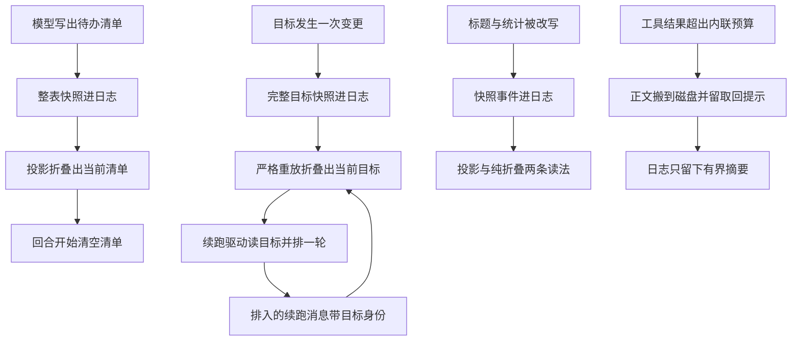

# 06 · 状态型记忆

有一类状态既不是"模型这一轮说了什么",也不是"文件系统上有什么",而是**跨回合、跨进程都要保持的领域事实**:这个会话正在追哪个目标、待办清单还剩几项、这个会话叫什么名字、跑掉了多少 token。它们全部遵守同一条规则——**存进事件日志,靠折叠重建**——但持久化形态、重建严格程度和跨 resume 的保持方式各不相同。这篇把它们逐个拆开,并说明唯一一个例外(spill)为什么必须在日志之外。

---

## 一、五类状态一览

| 状态 | 事件 | 存在哪里 | 怎么重建 | 跨 resume | 客户端可见 |
|---|---|---|---|---|---|
| goal | `goal/change`(完整快照或墓碑) | 会话日志 | 严格重放折叠,违反即失败 | 日志重放,`activation` 重置为 `disarmed` | 是 |
| todo | `todo/write`(整表) | 会话日志 | last-write-wins 折叠 | 日志重放 | 是 |
| 标题 | `session/title`(快照 + 来源) | 会话日志 | 投影 + `findLast` 纯折叠两条读法 | 日志重放 | 是 |
| 统计 | 无(纯派生) | 不落盘 | 由生命周期与执行事件折叠 | 重放同一批事件得到同一个值 | 是(子集) |
| spill 正文 | 无事件 | 宿主机文件系统 | 不重建,靠取回提示按路径读 | 目录扫掠清理,不随会话恢复 | 否 |


<details><summary>Mermaid 源码</summary>



</details>

---

## 二、goal:一个"必须严格"的重放

目标状态的持久化形态是**完整快照**,不是增量。这条规则在投影注册表里是全局的,但对 goal 尤其重要:每次变更都写完整目标状态,所以任何一条变更事件单独拿出来都是自描述的。

```typescript
// packages/goal/goal/src/domain.ts:55-68
declare module '@deepseek-ai/dsh-llm' {
  // ...(略):MessageSourceMap 里声明 goal 这一消息来源
}
declare module '@deepseek-ai/dsh-session/types' {
  // ...(略):SessionEventMap 里声明完整快照或清空墓碑
  'goal/change': GoalChangeMeta
}
```

### 状态存在哪里

不变量里没有"goal 表",只有一条日志事件流。服务的私有字段只有配置和一份**进程内**的激活状态表:

```typescript
// packages/goal/goal/src/index.ts:239-268(节选)
export class GoalService extends TypertRemoteService {
  static inject = ['agents', 'sessionProjections']
  // ...(略):Config 的 defaultMaxGoalRounds 默认 256、resolved 与构造器
  private readonly runtimeStates = new WeakMap<Session, GoalRuntimeState>()
  ctx.on('agent/session-start', ({ agent }) => {
    this.setActivation(agent.session, 'disarmed')
  })
  ctx.sessionProjections.register(goalProjectionDefinition)
```

那行 `agent/session-start` 就是"跨 resume 重置"的落点:进程内激活状态永远从 `disarmed` 起步,必须有一次人类授权的 `resume` 才能重新武装——**丢失的只是"这个进程有没有资格自动续跑"**,持久化的阶段(`active`/`paused`/`blocked`/`complete`)不会因此改变。

读取路径就是读投影:

```typescript
// packages/goal/goal/src/index.ts:475-493(节选)
  private state(session: Session): GoalProjection | null {
    const state = this.ctx.sessionProjections.stateOf(session, 'goal')
    if (state.failure !== null) throw new Error(state.failure)
    // ...(略):state 未注册时抛错,否则返回 state.current
  }
```

### 怎么重建:失败要被留住,而不是抛出

goal 的折叠是**严格**的:一个不合法的变更序列会让后续所有状态都不可信。但投影注册表的事件驱动不允许抛异常(那会破坏其他单元),于是失败被折进状态本身:

```typescript
// packages/goal/goal/src/index.ts:137-159
// ...(略):JSDoc 说明首个非法 owned 事件留在 failure
export function applyGoalProjection(state: GoalProjectionState, event: SessionEvent): GoalProjectionState {
  if (state.failure !== null) return state
  // ...(略):只处理 goal/change 与带 goal 来源的 user/message,其余原样返回
  const folded = goalFoldState(state)
  try {
    applyGoalEvent(folded, event)
    return goalProjectionState(folded)
  } catch (error: unknown) {
    const message = error instanceof Error ? error.message : String(error)
    return { ...state, failure: `goal replay failed at session event ${event.seq}: ${message}` }
  }
}
```

这个设计同时解决两个需求:**客户端仍然能看到最后一个合法目标**,**宿主侧的读写直接拒绝**(不会基于一个已知损坏的状态做变更)——投影的 `state()` 读到 `failure` 就 `throw new Error(state.failure)`。

### 严格体现在哪些规则上

`applyGoalChange()` 逐条检查变更的合法性。这些规则不是为了防御恶意输入,而是为了保证"日志流本身可被独立验证"——一个不遵守转移规则的日志流意味着有代码绕过了服务:

```typescript
// packages/goal/goal/src/fold.ts:266-306(节选)
export function applyGoalChange(state: GoalFoldState, change: GoalChangeMeta): void {
  // ...(略):clear 分支要求存在当前目标、版本恰好 +1、时间戳不早于上次更新,随后清空并写回 lastRef
  if (change.operation === 'create') {
    if (change.goal.revision !== 1 || change.goal.phase !== 'active' || change.roundsStarted !== 0
      || (state.goal !== undefined && state.goal.phase !== 'complete')
      || state.seenGoalIds.has(change.goal.id)) {
      throw new Error('goal create requires a fresh active revision-one goal with zero rounds')
    }
    state.seenGoalIds.add(change.goal.id)
  } else {
    const current = state.goal
    if (current === undefined) throw new Error(`goal ${change.operation} requires a current goal`)
    validateSnapshotTransition(state, change, current)
  }
  // ...(略):写回 state.goal / roundsStarted / 时间戳 / lastRef
}
```

三条规则值得单独说:

- **版本必须恰好 +1**。`requireNextRevision()` 要求 `next.revision === current.revision + 1`,是 compare-and-set 的持久化版本:每个变更都指名它要改的是哪一版,过期的一版直接被判非法。
- **目标身份不能复用**。`seenGoalIds` 是状态里唯一一个**只增不减**的集合,它把"曾经用过这个 GoalId"变成一条可验证事实,防止被清空的目标 id 重新创建后与旧日志混淆。
- **`create` 只允许在空位或已完成之后**:一个 `active` 或 `paused` 的目标不能被新目标直接覆盖,必须先 `clear` 或 `resume`。这就是服务层那句错误的来源:

```typescript
// packages/goal/goal/src/index.ts:303-309(节选)
  create(agent: Agent, request: CreateGoalRequest): GoalView {
    const [state, runtime] = this.prepareMutation(agent)
    const current = state?.goal
    if (current !== undefined && current.phase !== 'complete') {
      throw new GoalError(`goal "${current.id}" already exists with phase "${current.phase}"`, 'GOAL_ALREADY_EXISTS')
    }
```

### 提交:一次追加 + 一次进程内激活边

写入是一个短小的同步段:先记下"这次追加将占用的 seq 以及它要设置的激活状态",追加,再比对实际 seq 是否如预期——**只有落在同一个位置**才更新激活状态,否则说明中间有别的追加插了进来:

```typescript
// packages/goal/goal/src/index.ts:608-626
  private commit(agent: Agent, runtime: GoalRuntimeState, change: GoalChangeMeta, activation: GoalActivation): void {
    const ref = goalChangeRef(change)
    runtime.pendingActivation = { offset: agent.session.seq, activation }
    try {
      const event = agent.session.append('goal/change', change)
      if (SessionSeq(runtime.pendingActivation.offset) === event.seq) runtime.activation = activation
    } finally {
      runtime.pendingActivation = undefined
    }
    // ...(略):由 ref 与最新 view 组装 GoalChanged 并 emit('goal/changed')
  }
```

注意事件监听者处理这个激活边的逻辑(`index.ts:259-267`):只有 seq 匹配的那条 `goal/change` 才应用挂起的激活值,其他 `goal/change` 一律视为 `disarmed`,这样即使一条外来事件插在中间,激活状态也不会被错误地挂到别人头上。

---

## 三、goal-round-driver:把持久目标变成一个回合

目标不会自己推进。驱动插件订阅的是**进程内的** `goal/changed` 事件(不是日志事件 `goal/change`),在 agent 空闲时把下一轮排进去:

```typescript
// packages/goal/goal-round-driver/src/index.ts:283-294
    ctx.on('goal/changed', ({ agent, change }) => {
      const state = stateFor(agent)
      state.needsCheckpoint = true
      // ...(略):宿主发起的暂停中止当前回合,模型自己的暂停正常结束
      if (change.operation === 'pause' && agent.status === 'running'
        && ctx.agents.currentInitiator() !== agent) {
        agent.cancel({ kind: 'user' }, { keepInbox: true })
      }
      requestDrive(state)
    })
```

"人类发起的暂停"与"模型自己发起的暂停"在这里被区别对待:前者要立刻中止当前回合,否则模型还能继续动手;后者是模型在回合内自己判断该停,让它正常结束。判据是 `ctx.agents.currentInitiator() !== agent`——当前发起者不是这个 agent,说明暂停来自外部。

排一轮之前有两道门:先做耐久检查点,再做静默判定。

```typescript
// packages/goal/goal-round-driver/src/index.ts:142-154
    if (state.needsCheckpoint) {
      try {
        await ctx.sessions.flush(agent.session)
      } catch (error: unknown) {
        // ...(略):记一条 warn 后 disarm(state),放弃这一轮
        return
      }
      // ...(略):检查点期间可能来了变更或普通提示,先让它自己走一个回合
      if (!readyAfterCheckpoint(state)) return
    }
```

先落盘再续跑的理由很直接:续跑消息一旦排进去、模型一旦开始工作,就会产生新的日志;如果磁盘上还没有"目标已经变成 active"这条事实,一次崩溃会让恢复后的进程看到一个从未被授权的目标却已经产生了工作。因此检查点失败时**解除激活并放弃**这一轮,是 fail-closed 的选择。

静默判定的四个条件缺一不可:

```typescript
// packages/goal/goal-round-driver/src/index.ts:102-109
  /** Whether this exact lifecycle is quiescent with no competing prompt. */
  function readyToDrive(state: DriverState): boolean {
    return ctx.fiber.state === FiberState.ACTIVE
      && !state.stopping
      && ctx.agents.get(state.agent.id) === state.agent
      // ...(略):agent 空闲且没有排队中的竞争输入
  }
```

插件纤维还活着、这个生命周期没在收尾、注册表里的 agent 仍然是这**一个**对象(而不是同 id 的新实例)、agent 空闲、且没有排队中的竞争输入。

排一轮就是构造一条带目标身份的 `user/message`,然后交给 agent 的跟进队列:

```typescript
// packages/goal/goal-round-driver/src/index.ts:174-192(节选)
    const round = goal.roundsStarted + 1
    const content = renderGoalRoundPrompt(goal, round)
    // ...(略):createUserMessage({ content, source: { kind: 'goal', goalId, revision, round } })
    const reservation: RoundAttempt = {
      // ...(略):goalId / revision / round 与 messageId / content / phase、cancelled、stale
    }
    // ...(略):state.attempt = reservation,再 try { agent.followup(message) }
```

**真正的准入闸门在步进前**,而不是在这里。因为在排队与真正进入回合之间,目标可能被改写、被暂停、被清空:

```typescript
// packages/goal/goal-round-driver/src/index.ts:345-359
    /** Fail closed unless the queued prompt still owns the exact live revision. */
    function validReservation(
      state: DriverState,
      content: ContentBlock[],
      source: GoalMessageSource,
    ): boolean {
      const attempt = state.attempt
      const goal = currentGoal(state)
      return ctx.fiber.state === FiberState.ACTIVE
        && !state.stopping && attempt !== undefined && attempt.phase === 'claimed'
      && !attempt.stale && sameQueued(content, source, attempt)
      && goal !== undefined && goal.id === source.goalId && goal.revision === source.revision
      && goal.phase === 'active' && goal.activation === 'armed'
      && source.round === goal.roundsStarted + 1
    }
```

逐项对应一种"这一轮已经不该跑"的情形:插件在收尾、这条消息不是当前的预约、内容被改过、目标换了 id、目标换了版本、目标不再 active、激活被解除、轮次号不再接得上。全部通过以后,预步骤返回一个**开始新的消息序列**的决定(`startsRequestSeries: true`),让续跑轮在请求日志里成为一条清晰可辨的序列边界。

续跑消息的正文由纯函数渲染,并且被不变量逐字校验——这样"模型看到的续跑提示"就是可重现的,而不是某次运行时的字符串拼接:

```typescript
// packages/goal/goal-round-driver/src/prompt.ts:12-25
export function renderGoalRoundPrompt(goal: GoalView, round: number): ContentBlock[] {
  return [{
    // ...(略):一段固定英文正文,要求以工作区与耐久状态为准、验证后再标记完成
    text: '<goal_round>\n'
      + `Objective: ${JSON.stringify(goal.objective)}\n`
      + `Round: ${round}/${goal.maxGoalRounds}\n\n`
      + '</goal_round>',
  }]
}
```

---

## 四、todo:整表替换 + 正交的清空

待办清单的持久化策略是"每次写完整张表",没有增量操作。这对模型也更简单:描述里直接写明"每次发整份列表,它替换前一份"。

```typescript
// packages/todo/tool-todo/src/index.ts:203-219(节选)
    execute(args, exec) {
      const todos = toTodoList(args.todos, allowParallel)
      if (!exec.agent) {
        // ...(略):非 agent 调用者没有归属会话,拒绝而不是静默 no-op
        throw new Error('todo_write requires an owning agent session')
      }
      exec.agent.session.append('todo/write', { todos })
      // ...(略):统计 pending / inProgress / completed 计数并与整表一起返回
    },
```

校验在工具里做一次(拒绝即时反馈给模型),在不变量里再做一次(拒绝任何其他写入路径)。两边检查的是同一组"持久形状"规则:

```typescript
// packages/todo/tool-todo/src/invariant.ts:24-38
function validateTodos(value: unknown, fail: InvariantFailure): void {
  if (!Array.isArray(value)) fail('todo/write todos must be an array')
  for (const item of value) {
    // ...(略):条目必须是对象;content 非空、已 trim 且不重复(seen 去重);status 属于 TODO_STATUSES
  }
}
```

注意不变量**刻意不检查"同时有几个 `in_progress`"**——那是部署策略(`Config.allowParallelInProgress`)而非持久形状,所以同一个日志在两种部署下都应该合法。另有两条结构规则:必须在开着的回合内追加,且条目内容必须已 trim。

清空规则是投影的职责,不是事件的职责:清单在 `turn/start` 时变为 `null`,而在 `turn/end` 时保留——这样用户在整个回合结束后仍能看到刚做完的清单,下一回合开始才消失(见 [`03-projections.md`](./03-projections.md))。**这条规则完全不在日志里**,它是投影代码的一部分;因此日志仍然完整记录了"模型当初写了什么",只是当前可见值不同。

---

## 五、标题与统计

标题的持久化有一个容易被忽略的细节:**它是 log-only 的**——进日志、进投影,但永不进 surface,所以模型永远看不到"这个会话叫什么",而这个事实在恢复后依然完整。四种写入来源各自带不同的 `source`,让"这个名字是谁起的"成为可查询事实:`user`(显式重命名)、`provider`(模型生成,附带 provider 与模型溯源)、`fallback`(取首条用户消息的截断)。读取有两条路径——投影缓存(快路径)与 `foldSessionTitle()` 的纯折叠(权威路径):

```typescript
// packages/session/session-title/src/index.ts:282-292
export function foldSessionTitle(events: readonly SessionEvent[]): SessionTitleSnapshot | undefined {
  const event = events.findLast(item => item.type === 'session/title')
  // ...(略):由 title / messageSeqs / source 与 event.seq、event.time 组装快照
}
```

统计与前四者的区别最大:**它没有任何事件**。`turns`、`steps`、`llmMs`、`toolMs` 全部是由生命周期与执行事件算出来的,所以"跨 resume 保持"这个问题对它不成立——重放同一批事件必然得到同一个值,不需要存储;它也是唯一一个"`stateVersion` 变了只影响缓存、不影响事实"的单元。统计里有一条值得学的口径:`step/end` 而不是 `assistant/message` 是步数的会计锚点,因为 `step/end` 才是步骤生命周期的权威事件:

```typescript
// packages/session/session-stats/src/projection.ts:182-189(节选)
      case 'step/end':
        return {
          turns: state.lastTurn === event.data.turn ? state.turns : state.turns + 1,
          // ...(略):steps + 1、更新 lastTurn 并清空 openStep
        }
```

---

## 六、spill:唯一一个"不在日志里"的记忆

溢写把超大的工具结果正文写到宿主机文件系统,日志里只留下有界的替换文本与一个取回提示。它是这套体系里唯一**刻意不进日志**的机制,而这个选择有明确的边界条件。

```typescript
// packages/spill/spill-local/src/index.ts:149-161
  async saveText(input: SaveTextSpill): Promise<SpillRef> {
    const saved = await saveTextFile({
      // ...(略):root、sessionId 与 suggestedName、content 一并透传
    })
    return {
      locator: SpillLocator(saved.path),
      // ...(略):bytes 与固定取回提示
      retrievalHint: 'Use read with offset/limit, or grep this path to search within it.',
    }
  }
```

三个事实需要强调:

**第一,spill 完全不写会话事件。** 整个 `packages/spill` 里没有任何 `session.append(...)` 调用,[`package.json`](https://github.com/deepseek-ai/deepseek-harness/blob/dbbaa4a37fb9098aba814c97d2956f7b2f105f46/package.json) 与类型层也**没有**对应的 `SessionEventMap` 声明;[`known-event-types.ts`](https://github.com/deepseek-ai/deepseek-harness/blob/dbbaa4a37fb9098aba814c97d2956f7b2f105f46/packages/core/session/src/known-event-types.ts) 的词表里没有 spill 条目。溢出发生的时刻,日志里被写入的是**工具结果本身的内容被替换成了一段有界文本**,由正常的 `tools/post-execute` 结果路径落盘。

**第二,替换是有界的,而且预算被显式守住。** 策略在决定替换以后会再检查一次替换文本是否超预算,超了就放弃替换而保留原文——宁可让模型看到长内容,也不产生一个违反预算的替代品:

```typescript
// packages/spill/spill-policy/src/index.ts:190-204(节选)
    if (decision.kind !== 'accept' || Object.hasOwn(decision, 'value')
      || exec.parent !== undefined || exec.name === 'read') return decision
    const content = decision.content ?? result.content
    const text = flattenPlainText(content)
    const totalBytes = Buffer.byteLength(text, 'utf8')
    if (totalBytes <= maxInlineBytes) return decision
    // ...(略):调用 spillReplacement 换出正文,拿不到替换文本就保留原文
```

`read` 工具被排除是为了避免"读文件 → 溢写 → 再读"的自激循环。而没有会话归属或没有溢写后端时,策略选择**保留内联内容并记一条警告**,而不是让工具失败:

```typescript
// packages/spill/spill-policy/src/index.ts:133-141
    // ...(略):无会话归属时 warn 并保留内联内容
    const spillStore = ctx.get('spillStore')
    if (!spillStore) {
      // ...(略):没有 ctx.spillStore 后端时同样 warn 并保留内联内容
      return undefined
    }
```

**第三,溢写目录与会话生命周期解耦,靠时间清理而不是靠会话关闭。** 它落在 `tmpdir()` 下按进程惰性创建的私有目录里。这直接决定了它在 resume 之后的行为:一个恢复的会话不会去重建溢写目录,溢出的正文也不会"跟着会话回来"——它只是一份带路径的文件,模型要用普通文件工具按路径去读。

```typescript
// packages/spill/spill-local/src/store.ts:29-39
let defaultRoot: string | undefined
// ...(略):privateRoot() 的 JSDoc
export function privateRoot(): string {
  defaultRoot ??= mkdtempSync(join(tmpdir(), DEFAULT_ROOT_PREFIX))
  return defaultRoot
}
```

| 维度 | 溢写(spill) | 压缩(compaction) |
|---|---|---|
| 发生在何时 | 结果**首次进入上下文之前** | 结果已经在历史里之后 |
| 日志里留下什么 | 有界的替换文本(由正常结果路径写入) | `compaction/summary` + `replace` 事件 |
| 全文去哪了 | 宿主机文件系统,会话之外 | 不存在了(只在原始事件与遮蔽集合里) |
| 谁能拿回全文 | 模型用文件工具按路径读 | 只能靠日志里仍保留的原始事件重建 |
| 是否写自己的事件 | 否 | 是,四个 log-only 事件 |

两者的交集只有一件事:`spill-policy` 的 README 明确写了"替换文本留在历史里直到被压缩处理"。也就是说,溢写减少了单次工具结果的体积,而**如果一大批复写内容累积起来仍然撑爆上下文,压缩才是那道收口的防线**——两道防线没有调用关系,只是恰好互补。

---

## 七、与 surface 记忆的对照

同样是"记忆",两类状态的差别在**谁需要它**:

| | surface(模型可见历史) | 状态型记忆(本节) |
|---|---|---|
| 消费者 | 模型请求 | UI、命令、驱动、运维 |
| 是否进请求 | 是 | 否(标题、goal、todo 全都 log-only,从不进 surface) |
| 能否被压缩改写 | 能,`replace` 就是为它设计的 | 不能,没有 surfaceOp |
| 读取路径 | `deriveMessages()` 折叠节点 | 投影注册表 / 纯折叠函数 |
| 丢失的后果 | 模型失去上下文 | UI 失去显示,驱动失去判据,但日志完整 |

关键推论是:**压缩永远不会动到状态型记忆**。系统的 `assertSystemHeadRewrite` 只保护 surface 节点 0,而 goal / todo / 标题 / 统计这些事件根本没有 surface 标记,连进 surface 的资格都没有(`surfaceOpOf()` 会直接拒绝)。所以一次把整段历史压成一条摘要的压缩,不会顺手清掉待办清单或目标阶段。

---

## 关键文件 / 符号索引

| 符号 | 位置 | 作用 |
|---|---|---|
| `GoalOperation`、`GoalChangeMeta`、`GoalMessageSource` | [`packages/goal/goal/src/domain.ts:14`](https://github.com/deepseek-ai/deepseek-harness/blob/dbbaa4a37fb9098aba814c97d2956f7b2f105f46/packages/goal/goal/src/domain.ts#L14)、[`packages/goal/goal/src/domain.ts:44`](https://github.com/deepseek-ai/deepseek-harness/blob/dbbaa4a37fb9098aba814c97d2956f7b2f105f46/packages/goal/goal/src/domain.ts#L44)、[`packages/goal/goal/src/domain.ts:47`](https://github.com/deepseek-ai/deepseek-harness/blob/dbbaa4a37fb9098aba814c97d2956f7b2f105f46/packages/goal/goal/src/domain.ts#L47) | 七个状态变更动词、完整快照或清空墓碑、续跑消息的目标身份归属 |
| `'goal/change'`、`'goal/changed'` 事件声明 | [`packages/goal/goal/src/domain.ts:61`](https://github.com/deepseek-ai/deepseek-harness/blob/dbbaa4a37fb9098aba814c97d2956f7b2f105f46/packages/goal/goal/src/domain.ts#L61)、[`packages/goal/goal/src/domain.ts:104`](https://github.com/deepseek-ai/deepseek-harness/blob/dbbaa4a37fb9098aba814c97d2956f7b2f105f46/packages/goal/goal/src/domain.ts#L104) | 声明合并进 `SessionEventMap`、进程内的 scoped 通知 |
| `FoldState` / `emptyGoalFoldState` | [`packages/goal/goal/src/fold.ts:27`](https://github.com/deepseek-ai/deepseek-harness/blob/dbbaa4a37fb9098aba814c97d2956f7b2f105f46/packages/goal/goal/src/fold.ts#L27) / [`:40`](https://github.com/deepseek-ai/deepseek-harness/blob/dbbaa4a37fb9098aba814c97d2956f7b2f105f46/packages/goal/goal/src/fold.ts#L40) | 严格重放的累加器 |
| `decodeGoalChange`、`validateSnapshotTransition` | [`packages/goal/goal/src/fold.ts:134`](https://github.com/deepseek-ai/deepseek-harness/blob/dbbaa4a37fb9098aba814c97d2956f7b2f105f46/packages/goal/goal/src/fold.ts#L134)、[`packages/goal/goal/src/fold.ts:200`](https://github.com/deepseek-ai/deepseek-harness/blob/dbbaa4a37fb9098aba814c97d2956f7b2f105f46/packages/goal/goal/src/fold.ts#L200) | 变更载荷的严格解码、五个转移各自的前置条件 |
| `applyGoalChange`、`applyGoalEvent`、`foldGoal` | [`packages/goal/goal/src/fold.ts:271`](https://github.com/deepseek-ai/deepseek-harness/blob/dbbaa4a37fb9098aba814c97d2956f7b2f105f46/packages/goal/goal/src/fold.ts#L271)、[`packages/goal/goal/src/fold.ts:313`](https://github.com/deepseek-ai/deepseek-harness/blob/dbbaa4a37fb9098aba814c97d2956f7b2f105f46/packages/goal/goal/src/fold.ts#L313)、[`packages/goal/goal/src/fold.ts:339`](https://github.com/deepseek-ai/deepseek-harness/blob/dbbaa4a37fb9098aba814c97d2956f7b2f105f46/packages/goal/goal/src/fold.ts#L339) | 变更的校验与应用、轮次准入的日志侧校验、从完整日志折叠 |
| `applyGoalProjection`、`goalProjectionDefinition` | [`packages/goal/goal/src/index.ts:146`](https://github.com/deepseek-ai/deepseek-harness/blob/dbbaa4a37fb9098aba814c97d2956f7b2f105f46/packages/goal/goal/src/index.ts#L146)、[`packages/goal/goal/src/index.ts:162`](https://github.com/deepseek-ai/deepseek-harness/blob/dbbaa4a37fb9098aba814c97d2956f7b2f105f46/packages/goal/goal/src/index.ts#L162) | 把严格失败折进状态、key `goal` 且 `stateVersion` 6 |
| `GoalService` | [`packages/goal/goal/src/index.ts:240`](https://github.com/deepseek-ai/deepseek-harness/blob/dbbaa4a37fb9098aba814c97d2956f7b2f105f46/packages/goal/goal/src/index.ts#L240) | 目标服务 |
| `expectCurrent`、`commitSnapshot`、`commit` | [`packages/goal/goal/src/index.ts:456`](https://github.com/deepseek-ai/deepseek-harness/blob/dbbaa4a37fb9098aba814c97d2956f7b2f105f46/packages/goal/goal/src/index.ts#L456)、[`packages/goal/goal/src/index.ts:579`](https://github.com/deepseek-ai/deepseek-harness/blob/dbbaa4a37fb9098aba814c97d2956f7b2f105f46/packages/goal/goal/src/index.ts#L579)、[`packages/goal/goal/src/index.ts:609`](https://github.com/deepseek-ai/deepseek-harness/blob/dbbaa4a37fb9098aba814c97d2956f7b2f105f46/packages/goal/goal/src/index.ts#L609) | CAS 版本校验、完整快照变更构造、追加 + 激活边 |
| `readyToDrive`、`drive` | [`packages/goal/goal-round-driver/src/index.ts:103`](https://github.com/deepseek-ai/deepseek-harness/blob/dbbaa4a37fb9098aba814c97d2956f7b2f105f46/packages/goal/goal-round-driver/src/index.ts#L103)、[`packages/goal/goal-round-driver/src/index.ts:138`](https://github.com/deepseek-ai/deepseek-harness/blob/dbbaa4a37fb9098aba814c97d2956f7b2f105f46/packages/goal/goal-round-driver/src/index.ts#L138) | 静默判定、检查点与轮次预约 |
| `validReservation` | [`packages/goal/goal-round-driver/src/index.ts:346`](https://github.com/deepseek-ai/deepseek-harness/blob/dbbaa4a37fb9098aba814c97d2956f7b2f105f46/packages/goal/goal-round-driver/src/index.ts#L346) | 步进前的准入闸门 |
| `renderGoalRoundPrompt`、`'goal/changed'` 监听 | [`packages/goal/goal-round-driver/src/prompt.ts:12`](https://github.com/deepseek-ai/deepseek-harness/blob/dbbaa4a37fb9098aba814c97d2956f7b2f105f46/packages/goal/goal-round-driver/src/prompt.ts#L12)、[`packages/goal/goal-round-driver/src/index.ts:283`](https://github.com/deepseek-ai/deepseek-harness/blob/dbbaa4a37fb9098aba814c97d2956f7b2f105f46/packages/goal/goal-round-driver/src/index.ts#L283) | 续跑提示的纯渲染、驱动入口 |
| `toTodoList` | [`packages/todo/tool-todo/src/index.ts:91`](https://github.com/deepseek-ai/deepseek-harness/blob/dbbaa4a37fb9098aba814c97d2956f7b2f105f46/packages/todo/tool-todo/src/index.ts#L91) | 工具侧的清单校验 |
| `todos` 投影注册、`todo/write` 追加 | [`packages/todo/tool-todo/src/index.ts:134`](https://github.com/deepseek-ai/deepseek-harness/blob/dbbaa4a37fb9098aba814c97d2956f7b2f105f46/packages/todo/tool-todo/src/index.ts#L134)、[`packages/todo/tool-todo/src/index.ts:210`](https://github.com/deepseek-ai/deepseek-harness/blob/dbbaa4a37fb9098aba814c97d2956f7b2f105f46/packages/todo/tool-todo/src/index.ts#L210) | 整表折叠与回合清空、唯一写入点 |
| `validateTodos` | [`packages/todo/tool-todo/src/invariant.ts:24`](https://github.com/deepseek-ai/deepseek-harness/blob/dbbaa4a37fb9098aba814c97d2956f7b2f105f46/packages/todo/tool-todo/src/invariant.ts#L24) | 持久形状不变量 |
| `'session/title'` 事件声明、`titleProjectionDefinition`、`foldSessionTitle` | [`packages/session/session-title/src/index.ts:71`](https://github.com/deepseek-ai/deepseek-harness/blob/dbbaa4a37fb9098aba814c97d2956f7b2f105f46/packages/session/session-title/src/index.ts#L71)、[`packages/session/session-title/src/index.ts:263`](https://github.com/deepseek-ai/deepseek-harness/blob/dbbaa4a37fb9098aba814c97d2956f7b2f105f46/packages/session/session-title/src/index.ts#L263)、[`packages/session/session-title/src/index.ts:282`](https://github.com/deepseek-ai/deepseek-harness/blob/dbbaa4a37fb9098aba814c97d2956f7b2f105f46/packages/session/session-title/src/index.ts#L282) | log-only 标题快照、key `title`、权威读回路径 |
| `sessionStatsProjectionDefinition` | [`packages/session/session-stats/src/projection.ts:113`](https://github.com/deepseek-ai/deepseek-harness/blob/dbbaa4a37fb9098aba814c97d2956f7b2f105f46/packages/session/session-stats/src/projection.ts#L113) | 纯派生统计 |
| `SpillStore.saveText`、`SaveTextSpill` | [`packages/spill/spill/src/index.ts:55`](https://github.com/deepseek-ai/deepseek-harness/blob/dbbaa4a37fb9098aba814c97d2956f7b2f105f46/packages/spill/spill/src/index.ts#L55)、[`packages/spill/spill/src/types.ts:63`](https://github.com/deepseek-ai/deepseek-harness/blob/dbbaa4a37fb9098aba814c97d2956f7b2f105f46/packages/spill/spill/src/types.ts#L63) | 溢写能力缝、归属、来源、建议名、正文 |
| `LocalSpillStore.saveText`、`spillReplacement`、`tools/post-execute` 监听 | [`packages/spill/spill-local/src/index.ts:149`](https://github.com/deepseek-ai/deepseek-harness/blob/dbbaa4a37fb9098aba814c97d2956f7b2f105f46/packages/spill/spill-local/src/index.ts#L149)、[`packages/spill/spill-policy/src/index.ts:125`](https://github.com/deepseek-ai/deepseek-harness/blob/dbbaa4a37fb9098aba814c97d2956f7b2f105f46/packages/spill/spill-policy/src/index.ts#L125)、[`packages/spill/spill-policy/src/index.ts:185`](https://github.com/deepseek-ai/deepseek-harness/blob/dbbaa4a37fb9098aba814c97d2956f7b2f105f46/packages/spill/spill-policy/src/index.ts#L185) | 落盘实现与取回提示、替换文本构造与预算守住、溢写触发点 |
