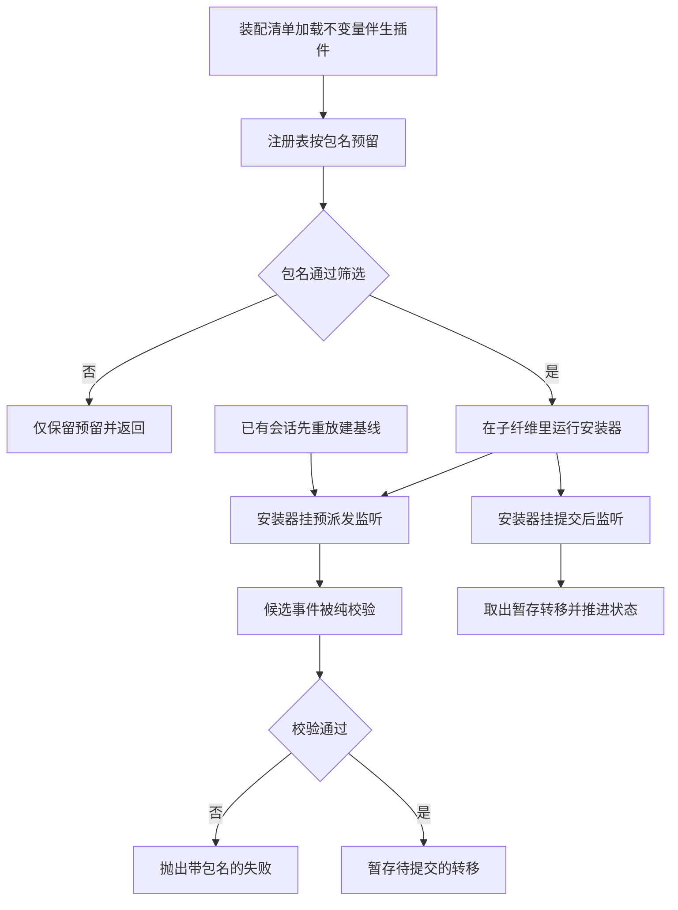
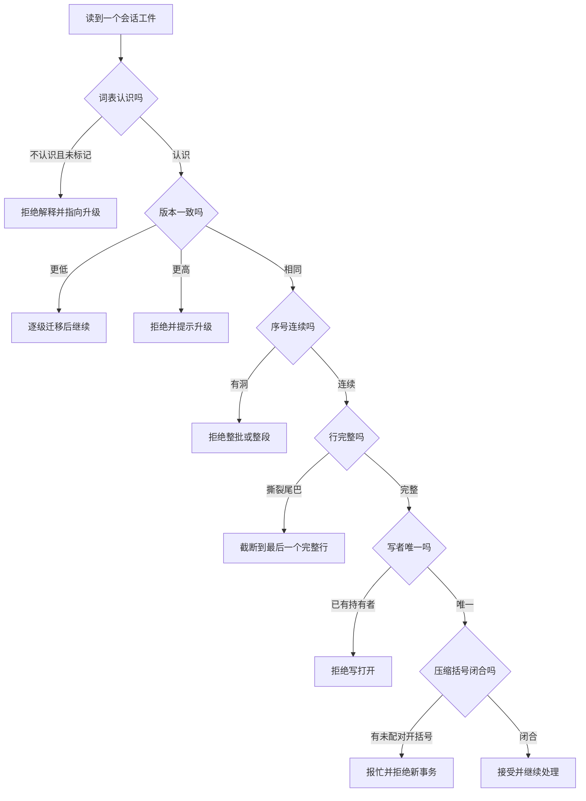

# 07 · 不变量与失败模式

前面几篇描述的都是"正常路径"。这一篇讲两件互补的事:第一,**当代码走偏时谁来喊**——一套按包归属的运行时不变量插件机制;第二,把日志与持久化会遇到的六类失败逐个列清楚,每一条给出它的显式语义和源码位置。失败在这里不是异常处理的细节,而是被设计过的:大多数情况下系统选择的不是"尽力而为",而是**明确拒绝**。

---

## 一、不变量插件:三个部件拼起来

一个包要发布不变量检查,需要三件东西同时到位:

| 部件 | 内容 | 位置 |
|---|---|---|
| 产物出口 | `package.json` 的 `"./invariant"` 子路径导出 | `packages/core/session/package.json:21` |
| 编译依赖 | tsconfig 对 `runtime-diagnostics/invariants` 的项目引用 | `packages/core/session/tsconfig.json:30` |
| 装配入口 | composition 里加载 `@deepseek-ai/dsh-session/invariant` | `packages/bundle/sdk-minimal/cordis.patch.yml:106-107` |

仓库里 39 个包发布了 `"./invariant"`,也恰好有 39 个 `src/invariant.ts`,两个集合一一对应——**没有只发布不实现、也没有只实现不发布**。

宿主侧只有一个服务和一个方法:

```typescript
// packages/runtime-diagnostics/invariants/src/index.ts:24-42
/**
 * Throw a package-attributed invariant failure.
 * @param message - violated package contract without the standard prefix.
 * @returns never because reporting a violation throws.
 */
export type InvariantFailure = (message: string) => never

/** Install one package's checks into the registration's child context. */
export interface InvariantInstaller {
  /**
   * Install the package contribution.
   * @param ctx - child context owned by this invariant registration.
   * @param fail - reporter bound to the registering package name.
   * @returns nothing, or a promise settling after asynchronous checks finish.
   */
  (ctx: Context, fail: InvariantFailure): void | Promise<void>
  /** Services the child installer fiber may access. */
  readonly inject?: Inject
}
```

`InvariantFailure` 的返回类型是 `never`,这不是风格问题:它把"报告失败"定义成一个**必然抛出**的操作,所以任何调用它的代码路径在类型上就已经终止了,不需要再写 `return`。失败对象是 `InvariantError`(`invariants/src/index.ts:50-66`),它带稳定的 `code = 'INVARIANT'` 与 `packageName` 字段,消息形如 `invariant violated by "<包名>": <违反的契约>`,使一条失败信息本身就足以定位责任方。

### 注册:预留与子纤维

注册方法的契约把几件事一起定死了——包名校验、重复注册拒绝、**筛选关闭时仍然预留包名**、以及安装器跑在一个独立子纤维里:

```typescript
// packages/runtime-diagnostics/invariants/src/index.ts:128-142(节选)
  /**
   * Register one package's invariant installer. The package name is reserved
   * even when filtering disables its checks. Enabled installers run in a child
   * fiber; failure disposes that fiber and releases the reservation.
   */
  register(packageName: string, installer: InvariantInstaller): () => void {
    if (packageName.length === 0 || packageName.trim() !== packageName || /\s/.test(packageName)) {
      throw new Error('invariants: packageName must be non-blank and contain no whitespace')
    }
    // ...(略):重复包名在此处被拒绝
```

子纤维的建立与失败回收在同一个 `ctx.effect` 里:安装器抛错就 dispose 这个子纤维,不留半个已安装状态。`inject` 是**安装器自身的属性**而不是函数参数,它被复制到那个临时插件函数上,让 Cordis 的注入机制在子纤维里生效——这就是为什么每个伴生插件的 `install` 都写作 `Object.assign((ctx, fail) => {...}, { inject: ['sessions'] })`(`invariants/src/index.ts:153-175`)。

### 伴生插件的统一形状

与内存状态相关的伴生插件结构完全一致,差别只在 `install` 里检查什么。每个文件导出三个东西:`PACKAGE_NAME`(归属包名,如 `@deepseek-ai/dsh-session`,`core/session/src/invariant.ts:15`)、`name`(Cordis 伴生插件名 `session-invariant`,`:18`)、`inject = ['invariants']`(`:20`,先预留服务再注册),以及入口:

```typescript
// packages/core/session/src/invariant.ts:248-254
/**
 * Register the session invariant companion.
 * @param ctx - Cordis context carrying the invariant service.
 * @returns the installed registration's disposer after setup succeeds.
 */
export const apply = (ctx: Context): Promise<() => void> =>
  Promise.resolve(ctx.invariants.register(PACKAGE_NAME, install))
```

`name` 与 `apply` 是**具名导出**且没有默认导出——这是函数型插件的装载契约,混用两种形式会让 Loader 丢掉整个命名空间。

---

## 二、两种挂法:预校验与提交后推进

不变量不能只在事件提交后检查,因为很多违反是"这条事件根本不该进日志",而日志一旦接受就再也擦不掉。于是有了一个**两阶段的暂存转移**模式:


<details><summary>Mermaid 源码</summary>



</details>

| 阶段 | 做了什么 | 关键调用(文件:行) |
|---|---|---|
| 建基线 | 安装时对 `ctx.sessions.list()` 里每个会话重放一遍日志,得到当前轨迹 | `install` `core/session/invariant.ts:223`、`seedSession` `:210` |
| 监听新会话 | `session/created` 时给新会话建基线 | `:225` |
| 预派发 | `internal/dispatch` 拦截 `session/event`,**纯校验**并把转移暂存起来 | `:237-245` |
| 提交后 | `session/event` 到达时取出暂存转移并推进轨迹;取不到就判失败 | `:227-235` |
| 失败归属 | 报告器绑定包名抛 `InvariantError` | `runtime-diagnostics/invariants/src/index.ts:160-164` |

```typescript
// packages/core/session/src/invariant.ts:237-245
  ctx.on('internal/dispatch', (_mode, eventName, args) => {
    if (eventName !== 'session/event') return
    const [session, event] = args as [Session, SessionEvent]
    const trace = traceFor(session)
    const transition = validateEvent(trace, event, fail)
    // A later dispatch listener may veto. Validation is pure, so abandoning
    // this weakly keyed transition does not advance or retain the session.
    stagedTransitions.set(event, { session, trace, transition })
  }, { global: true })
```

```typescript
// packages/core/session/src/invariant.ts:227-235
  ctx.on('session/event', (session, event) => {
    const staged = stagedTransitions.get(event)
    /* v8 ignore next 2 -- internal/dispatch stages the exact callback arguments */
    if (staged === undefined || staged.session !== session) {
      return fail('session/event reached publication without matching pre-commit validation')
    }
    stagedTransitions.delete(event)
    applyTransition(staged.trace, staged.transition)
  }, { global: true })
```

这个模式有两个精妙之处:

- **校验是纯函数**。`validateEvent()` 返回一个描述"提交后状态该怎么变"的转移对象,自己不碰 `trace`。所以后续监听者如果否决了这次派发,那个被暂存的转移只是被丢弃,不会留下推进过的状态。
- **暂存表本身是第二个判据**。`session/event` 分支里"暂存里没有这条事件"本身就是一种不变量违反——它意味着有人绕过了派发路径直接广播了事件。这条检查能抓到"旁路写日志"这种最难排查的问题。

另有两种挂法:只用预校验的(`session-title` 只在 `internal/dispatch` 里校验,因为标题事件一旦落盘就已经错了),以及两种都用的(`compaction`、`goal`、`todo`)。`session-title` 的注释把理由写得很直白:"the session/event listener would only observe the already-committed log"(`session-title/src/invariant.ts:66-72`)。

---

## 三、每个包检查什么

### session:日志的关系结构

这是最基础的一组检查,维护一条**日志轨迹**:seq 水位、开着的回合、开着的步骤、下一个期望的编号、以及未配对的工具调用集合。seq 严格递增是第一条:

```typescript
// packages/core/session/src/invariant.ts:54-62(节选)
/** Validate one candidate event without mutating the committed trace. */
function validateEvent(
  trace: SessionTrace,
  event: SessionEvent,
  fail: InvariantFailure,
): SessionTraceTransition {
  if (event.seq <= trace.lastSeq) {
    fail(`seq must strictly increase: saw ${event.seq} after ${trace.lastSeq}`)
  }
```

工具结果必须能配上一条未回答的调用——**唯一的例外是合成闭合事件**。崩溃修复产生的 `TOOL_NOT_STARTED` 结果天然没有对应的 `tool/call`,所以它被显式豁免,而不是被迫放宽整条规则:

```typescript
// packages/core/session/src/invariant.ts:132-142(节选)
      if (event.surfaceOp !== 'append') {
        if (trace.openTurn === null) {
          fail('tool/result surface replacement appended outside any open turn')
        }
        break
      }
      requireOpenStep(trace, 'tool/result', event.data.turn, event.data.step, fail)
      const callId = event.data.message.source.callId
      const syntheticNotStarted = event.data.message.content[0].isError === true && event.data.error?.code === TOOL_NOT_STARTED
      if (!trace.pendingCalls.has(callId) && !syntheticNotStarted) {
        fail(`tool/result for ${callId} with no prior tool/call in this step`)
      }
      pendingCalls = { kind: 'delete', callId }
```

注意 `surfaceOp !== 'append'` 那一支:一次**替换**型工具结果不算"第二次执行",所以只要求有一个开着的回合,不要求配对上调用——但仍然要求它在回合里。

### compaction:括号与回合边界

压缩的括号有两条结构规则:开括号时不能已有开着的括号,关括号必须配上并携带一个摘要。成功后没有摘要的关括号是明确违规:

```typescript
// packages/compaction/compaction/src/invariant.ts:246-257(节选)
  if (open === undefined) fail('compaction/end has no matching compaction/start')
  if (event.data.compactionId !== open.compactionId) {
    fail(`compaction/end id ${event.data.compactionId} does not match compaction/start id ${open.compactionId}`)
  }
  validateSourceCommandId('compaction/end', event.data.sourceCommandId, open.sourceCommandId, fail)
  if (event.data.turn !== open.turn) {
    fail(`compaction/end owner ${String(event.data.turn)} does not match compaction/start owner ${String(open.turn)}`)
  }
  validateOwner(open.turn, trace.openTurn, event.type, fail)
  if (event.data.error === undefined && !open.summarized) {
    fail('successful compaction/end requires one compaction/summary')
  }
```

回合边界也不能穿过一个开着的压缩括号——这正是 `compaction-basic` 在事务里"校验与开锁同步相邻"的运行时对照:

```typescript
// packages/compaction/compaction/src/invariant.ts:135-149
/** Keep every live compaction bracket on one side of each turn boundary. */
function validateTurnBoundary(
  trace: SessionTrace,
  event: SessionEvent,
  fail: InvariantFailure,
): void {
  if (
    (event.type !== 'turn/start' && event.type !== 'turn/end')
    || trace.compaction === undefined
  ) return
  const owner = trace.compaction.turn === null
    ? 'standalone compaction'
    : `compaction for turn ${trace.compaction.turn}`
  fail(`${event.type} cannot cross an open ${owner}`)
}
```
`compaction/start` 的唯一性检查在 `:205-208`(`compaction/start while ${owner} is still compacting`)。

### goal:复用严格解码器做归因

goal 的不变量不需要重新实现一套规则,它直接在**日志副本**上跑生产环境用的严格折叠,把抛出的错误翻译成带序号的失败:

```typescript
// packages/goal/goal/src/invariant.ts:29-37
/** Apply one event through the strict goal decoder and attribute failures. */
function applyChecked(state: GoalFoldState, event: SessionEvent, fail: InvariantFailure): void {
  try {
    applyGoalEvent(state, event)
  } catch (error) {
    /* v8 ignore next -- the strict goal decoder throws Error instances */
    const message = error instanceof Error ? error.message : String(error)
    fail(`session event ${event.seq} violates the durable goal stream: ${message}`)
  }
}
```

### goal-round-driver:续跑提示必须逐字重现

这是全仓库最严格的一条不变量:**每一条带目标身份的续跑消息,其内容必须与当前目标状态重新渲染出来的结果逐字相同**。也就是说,续跑提示不是"某次运行时的产物",而是目标状态的确定函数:

```typescript
// packages/goal/goal-round-driver/src/invariant.ts:45-58
/** Validate one package-owned continuation message against its durable prefix. */
function validateEvent(
  prior: readonly SessionEvent[],
  event: SessionEvent,
  fail: InvariantFailure,
): void {
  if (event.type !== 'user/message') return
  const source = event.data.source
  if (source.kind !== 'goal' || source.round <= 0) return
  const expected = renderGoalRoundPrompt(goalView(foldChecked(prior, fail), source, fail), source.round)
  if (!isDeepStrictEqual(event.data.content, expected)) {
    fail(`goal round ${source.round} content does not match the package-owned continuation prompt`)
  }
}
```

它同时校验"这条消息能不能从它**之前**的日志重建出来"——`goalView()` 检查目标存在、时间戳齐全、处于 `active`、id 与版本一致、轮次正好是下一个且不超预算,任何一条不满足就报"cannot be reconstructed from the preceding durable goal state"(`goal-round-driver/src/invariant.ts:29-43`)。

### todo 与 session-title:持久形状与引用完整性

todo 检查的是"落进日志的那张表长什么样",以及它必须在开着的回合内追加:

```typescript
// packages/todo/tool-todo/src/invariant.ts:53-58
/** Validate one package-owned event against the preceding committed trace. */
function validateEvent(event: SessionEvent, trace: TurnTrace, fail: InvariantFailure): void {
  if (event.type !== 'todo/write') return
  validateTodos(event.data.todos, fail)
  if (!trace.open) fail('todo/write appended outside any open turn')
}
```

`validateTodos()`(`:24-38`)另外要求内容非空、已 trim、不重复、状态在给定集合里。它**刻意不检查"同时有几个 `in_progress`"**——那是工具自己的部署策略而非持久形状。

标题检查的是一条**引用规则**:来源是 `user` 的标题不得引用任何消息序号,其它来源必须至少引用一条——而且被引用的必须是**更早的、人类发出的** `user/message`:

```typescript
// packages/session/session-title/src/invariant.ts:37-54(节选)
  const seen = new Set<ReturnType<typeof SessionSeq>>()
  for (const seq of messageSeqs) {
    let checked: ReturnType<typeof SessionSeq>
    try {
      checked = SessionSeq(seq)
    } catch {
      fail(`session/title event ${String(event.seq)} has an invalid message seq ${String(seq)}`)
    }
    if (seen.has(checked)) {
      fail(`session/title event ${String(event.seq)} repeats message seq ${checked}`)
    }
    seen.add(checked)
    const cited = checked < event.seq ? session.eventAt(checked) : undefined
    if (cited?.type !== 'user/message' || cited.data.source.kind !== 'user') {
      fail(`session/title event ${String(event.seq)} message seq ${checked} must name an earlier human user/message`)
    }
  }
```

`checked < event.seq` 同时排除了自引用与前向引用;`source.kind !== 'user'` 则排除了"用一个注入的上下文当标题依据"。两条合起来保证:标题的来源声明是可审计的。

---

## 四、六类失败模式


<details><summary>Mermaid 源码</summary>



</details>

### 1. 未知事件词汇

**语义:整份日志拒绝解释,不静默跳过。** 判据是"类型不在本构建词表里,且没有 `ignorable: true` 标记":

```typescript
// packages/session/session-persistence/src/storage-contract.ts:75-80(节选)
    if (!KNOWN_SESSION_EVENT_TYPES.has(event.type) && event.ignorable !== true) {
      throw unsupported(
        `session "${meta.id}" contains event type "${event.type}" (seq ${event.seq}) unknown to this harness and not marked ignorable; refusing to interpret the log — it was likely written by a newer harness`,
        location,
      )
    }
```

词汇表本身是生成文件(`core/session/src/known-event-types.ts:22`),信封一侧的契约在 `core/session/src/types.ts:473-483`。同一条通道还拦一个"藏在一个已知类型下的已退役形状":`request/header` 的 `reason === 'fallback'`(`storage-contract.ts:83-91`)。写侧另有一道:`surface.ts:244-245` 只允许"不认识 + `ignorable: true`"的事件携带不透明的 surface 元数据。

### 2. seq 空洞

**语义:空洞在写入侧被拒绝整批,在读回侧被拒绝整段。** 四个检查点覆盖内存、surface 折叠、seed 构造与磁盘追加四条路径:

```typescript
// packages/session/session-persistence/src/storage-contract.ts:139-151
/**
 * Refuse a batch that does not contiguously continue the stored log.
 * @param id - the session the batch belongs to.
 * @param events - the batch, in seq order.
 * @param cursor - the stored next-seq.
 */
export function assertContiguous(id: SessionId, events: readonly SessionEvent[], cursor: number): void {
  for (const [index, event] of events.entries()) {
    if (event.seq !== cursor + index) {
      throw new Error(`append seq mismatch for "${id}": expected ${cursor + index} at index ${index}, got ${event.seq}`)
    }
  }
}
```

其余三处是不变量 `core/session/src/invariant.ts:60-61`(严格递增)、`surface.ts:428-430`(surface 折叠要求"正好是期望值")、`core/session/src/index.ts:570-572`(seed 必须从 0 连续)。磁盘侧那条由 `persistContiguous` 在每次持久写入前调用(`jsonl/storage.ts:323`)。

### 3. 坏行

**语义:坏行不被跳过;可恢复模式下要等到一个回合边界才止损。** 两类坏行——JSON 解析失败与结构校验失败——都可能被"压下",而一旦后续出现 `turn/end`,被压下的错误立刻重新抛出:

```typescript
// packages/session/session-persistence-jsonl/src/format.ts:502-514(节选)
      const issue = new Error(`corrupt session log: invalid committed event at line ${this.eventLine}: ${detail}`, {
        cause: error,
      })
      if (this.recovery === 'strict') throw issue
      this.issue = issue
      if (typeof decoded === 'object' && decoded !== null
        && (decoded as { type?: unknown }).type === 'turn/end') throw issue
      return
```

"损坏"与"不支持"是两种不同的错误类型,前者指向数据有问题,后者指向"这份日志是别的构建写的、本身完好"(`session-persistence/src/errors.ts:104-110`)。

### 4. 版本不匹配

**语义:方向决定动作。** 更低版本走相邻迁移链升级并发布新世代;更高版本直接拒绝并提示升级 harness。检查必须发生在**解码任何版本相关结构之前**,否则未来格式会先撞上本构建的结构校验,用户看到的是"损坏"而不是"请升级"(`jsonl/format.ts:332-345`)。拒绝文案本身是方向相关的(`session-persistence/src/errors.ts:133-137`),并且被装配侧的版本门复用(`storage-contract.ts:50-52`),保证从装配到读回所有路径给出同一句话。

### 5. 并发写

**语义:同一会话同一时刻只有一个写者;其余写打开直接失败,而不是排队或重试。** 两层:`open(..., 'write')` 先做进程内声明(`jsonl/storage.ts:430`),再取内核锁。内核锁的理由是崩溃安全——持有者进程死亡时内核自动释放;反过来,一个活着但卡住的持有者**故意没有超时**,因为抢占一个只是慢的写者会让它的恢复追加撕裂日志(`lease.ts:1-19`)。

```typescript
// packages/session/session-persistence/src/errors.ts:51-58(节选)
/**
 * A write handle's ownership is permanently gone: its lease expired, a renewal
 * failed, or the durable ownership record no longer names this handle. The
 * handle never re-acquires ownership — close it and reopen for write.
 *
 * Declared for the cross-process lease layer; the shipped in-process backends
 * never throw it yet.
 */
export class SessionOwnershipLostError extends Error {
```

最后那句是一处罕见的坦白:这个类型**目前没有任何实现会抛出**。它被声明出来是因为跨进程租约层的契约要求一个"所有权永久丢失"的类型,而当前随发布的后端都在进程内。

### 6. 压缩与工具执行的竞争

**语义:任何时刻只允许一个压缩事务;区间边界不得切开工具调用与结果的配对。** 三层防护各管一件事——durable 标记管"跨生命周期",回合所有者管"与回合互斥",配对平衡管"区间本身合法"。

一个具体的竞态是:自动压缩需要先 `await` 一次"取模型容量"的调用,而这次 await 期间可能已有别的压缩开了括号。所以 `assertNoActiveCompaction()` 必须在 await **之后**再查一次——只在入口查是不够的(`compaction-basic/src/index.ts:294-295`)。同一类竞态在摘要阶段之后还有一次:摘要是一次长耗时的模型调用,期间 surface 可能被改写,这时靠世代与逐节点比较来发现(`region.ts:440-452`)。

| 失败模式 | 显式语义 | 关键位置 |
|---|---|---|
| 未知事件词汇 | 拒绝解释整份日志,除非事件带 `ignorable: true` | `storage-contract.ts:75`、`types.ts:473` |
| seq 空洞 | 写入侧拒绝整批,读回侧拒绝整段,seed 侧拒绝构造 | `invariant.ts:60`、`surface.ts:428`、`index.ts:570`、`storage-contract.ts:145` |
| 坏行 | 不跳过;可恢复模式下遇到回合边界立刻止损 | `format.ts:482`、`format.ts:508` |
| 版本不匹配 | 更低则迁移,更高则拒绝并提示升级;检查先于解码 | `errors.ts:133`、`format.ts:339`、`storage-contract.ts:50` |
| 并发写 | 进程内声明 + 内核锁;无超时,崩溃即释放 | `lease.ts:70`、`storage.ts:430`、`errors.ts:31` |
| 压缩与工具执行竞争 | 单一括号、回合互斥、配对平衡、异步后再复查 | `compaction/invariant.ts:205`、`region.ts:307`、`index.ts:295`、`region.ts:348` |

---

## 关键文件 / 符号索引

| 符号 | 位置 | 作用 |
|---|---|---|
| `InvariantFailure` / `InvariantInstaller` / `InvariantError` | `packages/runtime-diagnostics/invariants/src/index.ts:29` / `:32` / `:50` | 报告器、安装器契约、带包名归属的失败 |
| `InvariantRegistry.register` | `packages/runtime-diagnostics/invariants/src/index.ts:136` | 注册与包名预留 |
| 子纤维与报告器绑定 | `packages/runtime-diagnostics/invariants/src/index.ts:153` | effect + `ctx.plugin` |
| `PACKAGE_NAME` / `name` / `inject` / `apply` | `packages/core/session/src/invariant.ts:15` / `:18` / `:20` / `:253` | session 伴生插件的归属、装载面与入口 |
| `SessionTrace` / `validateEvent` / `applyTransition` / `install` | `packages/core/session/src/invariant.ts:23` / `:55` / `:172` / `:193` | 日志关系轨迹、纯校验、提交后推进、两阶段挂法 |
| `validateTurnBoundary` / `validateCompactionEvent` / 关括号校验 | `packages/compaction/compaction/src/invariant.ts:136` / `:180` / `:246` | 括号不得穿越回合;开括号唯一性;配对与摘要要求 |
| `cloneState` / `applyChecked` | `packages/goal/goal/src/invariant.ts:17` / `:29` | 校验前的独立副本;复用严格解码器归因 |
| `validateEvent` / `goalView`(driver) | `packages/goal/goal-round-driver/src/invariant.ts:46` / `:29` | 续跑提示逐字校验;目标可重建性校验 |
| `validateTodos` / `validateEvent`(todo) | `packages/todo/tool-todo/src/invariant.ts:24` / `:54` | 持久形状;回合内约束 |
| `validate`(title) / `validateDeliveryAccepted` | `packages/session/session-title/src/invariant.ts:27` / `session-log-deepseek/src/invariant.ts:17` | 标题来源与引用完整性;投递水位不得前向引用 |
| `SessionFormatUnsupportedError` / `SessionOwnershipLostError` | `packages/session/session-persistence/src/errors.ts:111` / `:59` | "完好但不能解释";为跨进程租约预留的类型 |
| `SessionWriteLease.acquire` | `packages/session/session-persistence-jsonl/src/lease.ts:70` | 内核写锁 |
| `claimWrite` / `SessionLogScanner.consumeEventLine` | `packages/session/session-persistence-jsonl/src/storage.ts:429` / `format.ts:476` | 进程内写声明;坏行的两类处理 |
| `assertCompactionInactive` / `assertNoActiveCompaction` | `packages/compaction/compaction-basic/src/region.ts:307` / `:326` | durable 压缩锁;异步决策后的复查 |
