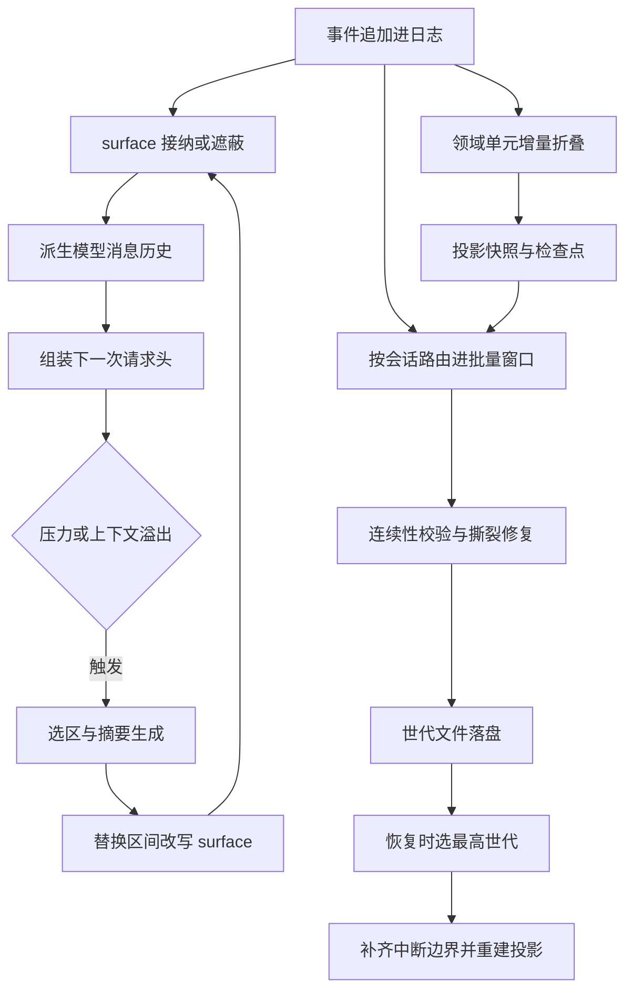

# Memory 模块 · 函数级深化分析

> 分析对象:[deepseek-ai/deepseek-harness](https://github.com/deepseek-ai/deepseek-harness) @ `dbbaa4a37`
> 范围:`packages/core/session`、`packages/session/*`、`packages/compaction/*`、`packages/goal/*`、`packages/todo/*`、`packages/spill/*`、`packages/runtime-diagnostics/invariants`

---

## 一、怎么读

| 想知道 | 读 |
|---|---|
| 事件溯源是什么、四层机制怎么分工 | [第三章](../03-session-memory.md) |
| 物理格式、世代文件、resume 全流程 | [第十一章](../11-persistence.md) |
| `SessionEventMap` 怎么被插件扩展、`append()` 每一步在拒绝什么 | [`01-event-log.md`](./01-event-log.md) |
| surface 节点表长什么样、`replace` 为什么能改写历史、系统提示节点 0 为什么特殊 | [`02-surface-and-visibility.md`](./02-surface-and-visibility.md) |
| 水印是什么、投影怎么增量折叠、请求头 `reason` 四个值谁在用 | [`03-projections.md`](./03-projections.md) |
| 压缩选区怎么算、工具配对怎么平衡、`compaction/*` 锁怎么开合 | [`04-compaction.md`](./04-compaction.md) |
| JSONL 一行是什么、世代怎么选、撕裂尾巴怎么修、迁移链怎么搭 | [`05-persistence-and-recovery.md`](./05-persistence-and-recovery.md) |
| goal / todo / 标题 / 统计 / 溢写各自存在哪里、跨 resume 怎么保持 | [`06-stateful-memory.md`](./06-stateful-memory.md) |
| 不变量插件怎么挂、六类失败模式各自的显式语义 | [`07-invariants-and-failure-modes.md`](./07-invariants-and-failure-modes.md) |

---

## 二、写入 → 派生 → 改写 → 落盘 → 恢复:函数级调用栈

下图是整章的骨架。左侧一列是**一次 `append()` 之后同时发生的三件事**——surface 接纳、投影驱动、持久化入队;中间是派生与请求组装;右侧是压缩改写回路和落盘 / 恢复回路。实线为同步调用,箭头回到 `surface` 表示 `replace` 是一次新的日志追加,而不是就地修改。

Mermaid 源码

读图要点:

1. **只有一条写入路径**:所有模型可见内容的源头都是 `Session.append()`(`core/session/src/index.ts:710`)。surface 接纳、投影驱动、持久化入队全部是它的下游,没有旁路。
2. **`replace` 不是修改,是追加**:压缩与裁剪都通过新增一条携带 `surfaceOp: { op: 'replace' }` 的 `user/message` 事件实现(`core/session/src/types.ts:434`),旧节点仍在日志里,只是被 surface 遮蔽。所以图上 `J → B` 回到同一个接纳节点。
3. **投影与 surface 是两条独立折叠**:surface 只折叠出"哪些节点可见、顺序如何",`ctx.sessionProjections` 折叠的是任意领域状态(goal、todos、标题、统计)。两者都靠 `session/event` 驱动,互不知道对方。
4. **检查点与日志的先后不可交换**:投影缓存写入前会先 `flush` 日志(`session-projection-cache/src/index.ts:256`),保证缓存落后于日志可以接受、领先于日志绝不允许。
5. **恢复是重新折叠,不是读回状态**:`resumeWith()`(`core/agent-loop/src/index.ts:853`)只从磁盘读事件,所有领域状态——包括 goal 阶段、todo 清单、会话标题——都由事件重新折叠出来。

---

## 三、分册索引

| 文件 | 覆盖符号(真实位置) | 一句话 |
|---|---|---|
| [`01-event-log.md`](./01-event-log.md) | `SessionEventMap` `types.ts:269`、`SessionEvent` `types.ts:465`、`SurfaceIntent` `types.ts:442`、`SESSION_FORMAT_VERSION` `types.ts:88`、`KNOWN_SESSION_EVENT_TYPES` `known-event-types.ts:22`、`append` `index.ts:710`、`validateStoredEvents` `storage-contract.ts:69` | 声明合并如何扩词汇、信封七个字段各自防什么、`append` 的提交顺序为什么是"快照→验证→提交→通知"、未知词汇的两侧拒绝规则 |
| [`02-surface-and-visibility.md`](./02-surface-and-visibility.md) | `SurfaceManager` `surface.ts:504`、`planSurfaceEvent` `surface.ts:421`、`validateSurfaceMetadata` `surface.ts:313`、`assertProvenance` `surface.ts:269`、`assertToolResultRewrite` `surface.ts:365`、`assertSystemHeadRewrite` `surface.ts:404`、`deriveMessages` `index.ts:832`、`deriveEventMessage` `surface.ts:92` | 节点表就是一个 `SessionSeq[]`、`replace` 的五道检查逐条走查、provenance 的完整性要求、节点 0 的保护规则、派生缓存的三元组失效 |
| [`03-projections.md`](./03-projections.md) | `SessionProjectionRegistry` `session-projection/index.ts:199`、`ProjectionDefinition` `:48`、`drive` `:657`、`checkpoint` `:396`、`restore` `:495`、`restoreFloor` `:425`、`SessionProjectionCache` `session-projection-cache/index.ts:92`、`write` `:246`、`requestHeader` `core/session/index.ts:776`、`foldRequestHeader` `request-header.ts:63` | 注册表契约、水印与 `Object.is` 变更通知、检查点行的可用性判定、请求头四个 `reason` 的语义、统计与标题作为投影的实现差异 |
| [`04-compaction.md`](./04-compaction.md) | `CompactionEngine` `compaction/src/index.ts:96`、`compaction/*` 事件 `compaction/src/types.ts:17`、`selectCompactableRange` `compaction-basic/src/region.ts:117`、`compactSurfaceRegion` `region.ts:173`、`commitCompactionBody` `region.ts:456`、`toolPairingBalancedBefore/After` `tool-pairing.ts:112`/`:124`、`ToolResultPruner.pruneSession` `tool-result-pruner/src/index.ts:136` | 触发点两条、选区算法的两段收敛、锁的开合与失败分类、`replace` 的改写语义、独立裁剪路径的定价协议 |
| [`05-persistence-and-recovery.md`](./05-persistence-and-recovery.md) | `SessionPersistence` `session-persistence/src/index.ts:135`、`validateStoredEvents` `storage-contract.ts:69`、`SessionLogScanner` `jsonl/format.ts:385`、`persistContiguous` `jsonl/storage.ts:319`、`appendLines` `jsonl/index.ts:1246`、`SessionWriteLease` `jsonl/lease.ts:58`、`resolveGenerationInDirectory` `jsonl/index.ts:1369`、`createSessionFormatChain` `session-format/src/chain.ts:41`、`interruptedTurnClosers` `core/session/repair.ts:29`、`resumeWith` `agent-loop/src/index.ts:853` | 一事件一行的物理格式、zstd 分帧、世代命名与选取、200 毫秒批量窗口、跨进程租约、撕裂尾巴的读侧过滤与写侧修复、迁移链的编译期完整性、resume 五步 |
| [`06-stateful-memory.md`](./06-stateful-memory.md) | `GoalService` `goal/src/index.ts:240`、`goalProjectionDefinition` `:162`、`applyGoalChange` `goal/src/fold.ts:271`、`applyGoalEvent` `fold.ts:313`、`tool-todo` 投影 `todo/src/index.ts:134`、`session/title`、`session-stats`、spill | 五类状态型记忆各自"存在哪里、怎么重建、跨 resume 如何保持";状态型记忆与 surface 记忆的分工 |
| [`07-invariants-and-failure-modes.md`](./07-invariants-and-failure-modes.md) | `InvariantRegistry.register` `invariants/src/index.ts:136`、`InvariantInstaller` `:32`、`InvariantError` `:50`、`install` `core/session/invariant.ts:193`、`validateEvent` `:55`、各包 invariant 插件 | 不变量插件怎么挂、每个包检查什么关系、六类失败模式的显式语义与位置 |

建议阅读顺序:`01 → 02`(日志与可见性主干),再看 `03`(派生),然后 `04`(改写),最后 `05 → 06 → 07`(落盘、状态型记忆、边界)。

---

## 四、源文件清单

| 包 / 文件 | 行数 | 角色 |
|---|---|---|
| `packages/core/session/src/types.ts` | 495 | 事件信封、事件词表、surface 意图、格式版本常量 |
| `packages/core/session/src/index.ts` | 1284 | `Session` / `SessionStore`:追加、派生、请求头折叠、fork |
| `packages/core/session/src/surface.ts` | 566 | surface 折叠与增量管理器、单节点投影规则 |
| `packages/core/session/src/known-event-types.ts` | 79 | 生成的本构建词汇表(persistence catalog) |
| `packages/core/session/src/repair.ts` | 135 | 崩溃尾巴的三段合成闭合事件 |
| `packages/core/session/src/invariant.ts` | 254 | 日志关系不变量(turn/step 嵌套、工具配对、seq 严格递增) |
| `packages/core/session/src/request-header.ts` | 69 | 请求头规范化、相等比较、纯折叠 |
| `packages/core/session/src/preparation.ts` | 49 | 未发布 `Session` 的一次性所有权 |
| `packages/session/session-projection/src/index.ts` | 714 | 投影注册表、驱动、检查点、冷读恢复 |
| `packages/session/session-projection-cache/src/index.ts` | 445 | 投影检查点的持久化写侧与零 I/O 读侧 |
| `packages/session/session-persistence/src/storage-contract.ts` | 151 | 后端共享校验:版本门、词汇门、批次物化、连续性 |
| `packages/session/session-persistence-jsonl/src/index.ts` | 1647 | JSONL 后端:物化、世代解析、迁移准备与发布、追加 |
| `packages/session/session-persistence-jsonl/src/storage.ts` | 567 | 句柄:批量窗口、串行链、撕裂修复、live 路由安装 |
| `packages/session/session-persistence-jsonl/src/format.ts` | 536 | 物理行编解码、路径编码、增量扫描器 |
| `packages/session/session-persistence-jsonl/src/lease.ts` | 135 | 跨进程写租约(POSIX flock / Win32 信号量) |
| `packages/session/session-format/src/chain.ts` | 255 | 相邻迁移链的编译与流式执行 |
| `packages/session/session-checkpoint-policy/src/index.ts` | 83 | 三个语义检查点:请求前、工具分发前、步进前 |
| `packages/compaction/compaction/src/index.ts` | 172 | 压缩能力缝与三个入口方法 |
| `packages/compaction/compaction/src/tool-pairing.ts` | 126 | surface 上的工具配对平衡与增量缓存 |
| `packages/compaction/compaction-basic/src/region.ts` | 585 | 选区算法与压缩事务 |
| `packages/compaction/compaction-tool-result-pruner/src/index.ts` | 188 | 无模型裁剪与影子定价协议 |
| `packages/goal/goal/src/{index,fold,types}.ts` | 653 / 349 / 152 | goal 领域:投影单元、严格重放折叠、CAS 变更 |
| `packages/todo/tool-todo/src/index.ts` | 223 | `todo_write` 工具与 `todos` 投影单元 |
| `packages/runtime-diagnostics/invariants/src/index.ts` | 200 | 不变量注册表与失败归属 |

---

## 五、术语约定

| 术语 | 含义 | 首次定义位置 |
|---|---|---|
| 事件信封(envelope) | 每个事件的固定外壳:`type`/`seq`/`time`/`data` 加可选 `ignorable` 与 surface 元数据 | `core/session/src/types.ts:465` |
| 声明合并(declaration merging) | 插件在自己的包里向 `SessionEventMap` 补类型成员来扩词汇,不改核心版本号 | `compaction/src/types.ts:17` |
| surface | 日志之上的"模型可见节点有序表",只记 seq 与顺序 | `core/session/src/surface.ts:190` |
| 遮蔽(shadow) | 一次 `replace` 把区间内节点从 surface 上摘掉,日志不变 | `core/session/src/surface.ts:469` |
| provenance(来源引用) | 事件通过 `sourceEventSeqs` 声明它派生自哪些更早的事件 | `core/session/src/surface.ts:269` |
| 水印(watermark) | 某个投影值已经折叠到的最后一个事件 seq,`-1` 表示空日志 | `session-projection/src/index.ts:131` |
| 检查点(checkpoint) | `(sessionId, key, ver, seq, val)` 行,是折叠捷径而不是权威 | `session-projection/src/index.ts:127` |
| 世代文件(generation file) | 一个格式版本对应一个不可变日志文件,只新增不改写 | `session-format/src/filename.ts:14` |
| 撕裂尾巴(torn tail) | 崩溃时未写完的最后一段字节,读侧永不返回、写侧首次追加前截断 | `jsonl/format.ts:464` |
| 租约(lease) | 一个会话目录的跨进程写所有权,由内核在持有者死亡时释放 | `jsonl/lease.ts:58` |
| 影子定价(shadow price) | 遮蔽事件自带的启发式 token 价格,让纯消费者无需保留逐节点价格 | `compaction/src/types.ts:82` |
| 活跃度(activation) | goal 的进程内"可否自动续跑"标志,从不落盘 | `goal/src/types.ts:72` |

---

## 声明

DeepSeek Harness 的所有权利归其原权利人所有,任何错漏以仓库源码与官方文档为准。
