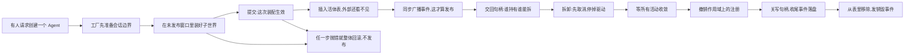
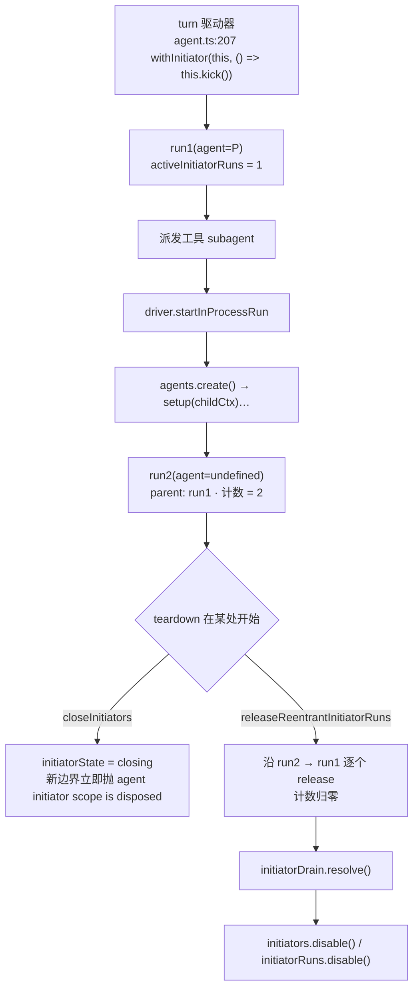

# 01 · Agent 注册表与生命周期(函数级走查)

> 源码:`packages/core/agent/src/index.ts`(690 行)、`packages/core/agent/src/runtime-types.ts`(405 行)
> 配套:`packages/core/agent-loop/src/index.ts`(930 行,创建事务的真实实现)、`packages/core/agent-loop/src/agent.ts`、`packages/core/session/src/index.ts`

---

## 第〇节 一句话结论

`AgentRegistry` 本身**不创建任何东西**:它只做四件事——持有工厂槽(`setFactory`)、把创建委派给工厂(`create`/`resume`)、维护活体表(`enter`/`announce`/`get`)、把"当前是谁在异步链上发起操作"存进两条 `AsyncLocalStorage`(`withInitiator`)。**"活"的定义是 `enter` + `announce` 都完成**:`enter` 之后已在表里但外部看不见,`announce` 同步派发 `agent/created` 之后才算发布。创建的全部风险落在"未发布窗口"内,回滚只需撤销一个 scope。

### 人话版:一个 Agent 怎么从无到有,又怎么被拆掉

这段讲的是 Agent(模型循环的运行实例,自带一份会话日志)从创建到销毁的全过程。注册表自己不造 Agent,它只当一本册子:存着工厂、把创建委托给工厂、维护活体表,并记录"当前是谁在异步链上发起操作";真正动手造 Agent 的是 agent-loop 里的工厂。工厂先准备会话边界,再在一次 `setup` 里把子世界(会话、作用域、工具面)装好——装好之前这个 Agent 对外完全不可见,这段就叫"未发布窗口",窗口里任何一步抛错都会整体回滚,不留半成品。发布之后,谁能拆掉它只看一件事:谁拿到了 `dispose` 句柄;拆卸严格反序——先取消并停掉驱动,等所有活动收敛,再撤销作用域上的注册,关掉写句柄让收尾事件落盘,最后才从表里移除并发销毁事件。


<details><summary>Mermaid 源码</summary>



</details>

| 阶段 | 做了什么 | 关键调用(文件:行) |
|---|---|---|
| 1 取出工厂 | 从工厂槽拿到目标;没有工厂就直接抛"请先加载 agent-loop 插件" | `core/agent/src/index.ts:374-377` |
| 2 所有权跟随调用者 | 用调用者的 fiber 与作用域当 owner,而不是工厂自己的注册上下文 | `core/agent/src/index.ts:388-398` |
| 3 会话边界校验 | seed 必须自 seq 0 连续、是纯无损 JSON、没有开放 turn 或悬空 tool call | `agent-loop/src/index.ts:730-738` |
| 4 建驱动与作用域 | 建 ReactLoopAgent、建 scope,并在任何资源之前登记反向 teardown | `agent-loop/src/index.ts:530-687` |
| 5 未发布窗口 | `await setup(...)` 被 raceAbort 包住,caller signal、owner 卸载、工厂 teardown 三路任一触发都会中断它 | `agent-loop/src/index.ts:826` |
| 6 提交点 | 所有 setup await 都已 settle、即将发布的那一瞬同步执行 commit | `agent-loop/src/index.ts:827` |
| 7 冲写未存后缀 | 把创建窗口里 append 的事件在活事件开始路由之前写进句柄 | `agent-loop/src/index.ts:749-757` |
| 8 enter | 插入活体表但不广播;Agent id 必须等于 session id,重复 id 直接抛错 | `core/agent/src/index.ts:458-493` |
| 9 announce | 同步派发 `agent/created`;同步抛错的监听者会否决发布并触发回滚 | `core/agent/src/index.ts:533-560` |
| 10 发布顺序 | 会话先可见、Agent 后可见,最后发 session-start 作为"可以开始注入上下文"的时机 | `agent-loop/src/index.ts:662-677` |
| 11 拆卸 | 取消 → 等闲 → 撤销作用域 → 关写句柄 → 离表,失败全部收集而不是吞掉 | `agent-loop/src/index.ts:576-619` |
| 12 解绑逆序 | 先摘 Agent 再摘会话;销毁事件发生在驱动收敛之后、会话解绑之前 | `agent-loop/src/index.ts:609-610` |
| 13 因果归属 | withInitiator 只做归属不授权;关闭时先把发起本次卸载的那条链从自己的 drain 里排除 | `core/agent/src/index.ts:672-678` |

<details><summary>原图</summary>

```text
AgentRegistry          只做册子:工厂槽 · 活体表 · initiator 归属        (agent/src/index.ts)
    │ create(options)                                                  :388
    ▼
AgentFactory (agent-loop)                                              :171
    │ createAgent(ownerCtx, options)                 agent-loop/index.ts:765
    ▼
PreparedAgent(prepare)  建 session 写句柄 → 建 ReactLoopAgent → 建 scope → 装反向 teardown
    │ setup(agentCtx, agent)     ← 未发布窗口:子世界在这里装好
    ▼
publish(source)  sessions.enter → agents.enter → sessions.announce → agents.announce → session-start
    │ handle = { agent, dispose }                    agent-loop/index.ts:659-680
    ▼
dispose()  cancel(disposed) → whenIdle → scope.dispose → handle.close → detach → untrack
```

</details>

---

## 第一节 三层职责:册子 / 工厂 / 驱动

`AgentRegistry` 的私有状态只有八项(`packages/core/agent/src/index.ts:246-253`):`store`(活体表)、`factory`(工厂槽)、`initiators` / `initiatorRuns`(两条 ALS)、`initiatorState` / `activeInitiatorRuns` / `initiatorDrain` / `initiatorDisposal`(关闭状态机)。

`store` 的每一项是 `AgentEntry`(`:211-220`):

```typescript
interface AgentEntry {
  readonly id: SessionId
  readonly agent: Agent
  /** Runtime creator-agent ownership; independent of durable session lineage. */
  readonly owner: Agent | undefined
  readonly carrier: Scoped<Agent>
  announced: boolean
  announcing: boolean
  detachRequested: boolean
}
```

- `owner` 是**运行期**所有权,只回答"这个 agent 是谁通过自己的 scope 造的",**独立于**会话日志里的 `parentSession` 谱系(`:579-581` 的 `isOwnedBy` 注释写明了)。这是必要的:一个被 resume 的 fork 会话仍有 `parentSession`,但运行期 owner 可以是 `undefined`(成为 root),见 `roots()`(`:597-601`)。
- `carrier` 是 `scopeTarget(agent, agent)`(`:463`)。`register` 的 JSDoc 解释了必须显式传 carrier 的原因:**调用 `register` 的 ctx 只影响 effect 作用域,分发作用域永远由 carrier 决定**(`:415-424`)。

工厂槽被包了一层普通持有器 `FactorySlot { readonly target: AgentFactory }`(`:229-231`),注释写明用途:*Plain holder prevents Cordis from tracing the factory field before the caller context is known*——避免 Cordis 在**还不知道调用者 ctx** 时就把 `factory` 字段跟踪成某个 ctx 的代理;`create()` 里再显式重新追踪(`:390-397`)。

---

## 第二节 `create()` 的完整序列

### 2.1 注册表侧:只有 10 行

```typescript
// packages/core/agent/src/index.ts:388-398
async create(options: CreateAgentOptions): Promise<AgentHandle> {
  const ownerCtx = this.ctx
  // Re-trace a Service-backed factory through the accessing context explicitly. This preserves
  // AgentLoop's dependency origin while binding its effects to ownerCtx; plain factories receive
  // ownerCtx as an explicit capability and need no Cordis tracker magic.
  const { target } = this.requireFactory()
  const receiver = getTraceable(ownerCtx, target)
  return Reflect.apply(target.createAgent, receiver, [ownerCtx, options])
}
```

三点:① `ownerCtx = this.ctx`(`:389`)——所有权跟着**调用者的 fiber/scope** 走;`AgentFactory.createAgent` 的 JSDoc 把它写成实现义务:*"it must not infer ownership from the factory object's registration context"*(`:182-185`)。② `requireFactory()`(`:374-377`)在无工厂时抛 `no agent factory registered (load an agent-loop plugin)`(`:206`)。③ `Reflect.apply` + `getTraceable` 是为了不叠两层 Cordis 影子代理:`setFactory` 在注册时已把 Service 规范化到 `symbols.original`(`:358-362`)。

`resume()` 是同一形态(`:407-413`),只把 `target.resume` 反射出去。

### 2.2 工厂槽:effect 独占,并返回精确 disposer

```typescript
// packages/core/agent/src/index.ts:355-371(节选)
setFactory(factory: AgentFactory): () => void {
  const dispose = this.ctx.effect(() => {
    if (this.factory !== undefined) throw new Error('an agent factory is already registered')
    const target = (factory as AgentFactory & { [symbols.original]?: AgentFactory })[symbols.original] ?? factory
    this.factory = { target }
    return () => { this.factory = undefined }
  }, 'agents.setFactory()')
  return dispose
}
```

返回的是**精确的 Cordis effect disposer**。注释(`:365-370`)强调"精确身份"是载荷性的:loop 的构造 effect 直接 yield 它,注销与那个 effect 的 teardown 同序嵌套;若返回包装函数,注销会变成并发兄弟,导致"最后一个 turn 还在 drain 时 agent 就被注销并发 `agent/disposed`"。

### 2.3 工厂侧:`createAgent`

```typescript
// packages/core/agent-loop/src/index.ts:765-802(节选)
async createAgent(ownerCtx: Context, options: CreateAgentOptions): Promise<AgentHandle> {
  const preparation = SessionPreparation.create(this.runtime.ctx.sessions.prepare(options.sessionId, {...}))
  const published = (async () => {
    let stored: StoredSession | undefined
    try {
      stored = options.signal === undefined
        ? await this.createStoredSession(preparation.session)
        : await raceAbortCall(
          () => this.createStoredSession(preparation.session, options.signal),
          options.signal, options.sessionId,
          (abandoned) => { void abandoned?.handle.close().catch(() => {}) },
        )
    } catch (error: unknown) { preparation[Symbol.dispose](); throw error }
    return this.setupAndPublish(ownerCtx, options.sessionId, preparation,
      options.agentOptions ?? {}, options.setup, options.signal, 'startup', stored, options.parentAgent)
  })()
  this.ownership.trackWrapper(published)
  return published
}
```

| 步 | 位置 | 作用 |
|---|---|---|
| 1 | `sessions.prepare(id, {seed, meta, inheritedEventCount})` | **耐久的**会话边界校验:seed 必须自 seq 0 连续、纯无损 JSON、无开放 turn/step、无悬空 tool call |
| 2 | `createStoredSession()`(`:730-738`) | 有持久化后端时**先拿写所有权**但**不 append**;失败则关掉未物化的句柄,同一 id 可重造 |
| 3 | `setupAndPublish()`(`:804-836`) | `prepare()` 建驱动 → `await setup(...)` → `commit()` → `appendUnstoredSuffix()` → `publish()` |
| 4 | `ownership.trackWrapper(published)`(`:800`) | 工厂 teardown 要等这个公开 create 收敛 |

`setupAndPublish` 的发布阶段只有 10 行,是未发布窗口的全部:

```typescript
// packages/core/agent-loop/src/index.ts:820-835(节选)
prepared = this.prepare(ownerCtx, id, agentOptions, session, signal, stored?.handle, parentAgent)
const setupCommit = await raceAbort(setup?.(prepared.agent.ctx, prepared.agent), prepared.signal, id)
setupCommit?.commit()
await this.appendUnstoredSuffix(stored, session)
return prepared.publish(source)
```

- `setup` 被 `raceAbort` 包住(`:826`):**caller signal、owner fiber 卸载、工厂 teardown 三路任一触发都会中断 setup 的 await**。
- `commit()` 在"所有 setup await 已 settle、即将发布"那一瞬同步执行(`:827`);`AgentSetupCommit` 的用途是 **mutable provisioning 在精确发布边界上复验**(`agent/src/index.ts:32-42,100-112`)。
- `appendUnstoredSuffix()`(`:749-757`)把创建窗口里 append 的事件(构造期 seed 标记、委派策略记录)冲进写句柄,**在活事件开始路由之前**;计数按"实际写入条数"推进而非 `session.seq`,以防 await 期间又有 append。

### 2.4 `prepare()`:反向 teardown 在任何资源之前注册

`prepare()`(`:530-687`)的注释点明最重要的性质:*The teardown is registered with the factory and the owner fiber BEFORE publication, so a mid-setup unload rolls everything back*。

```typescript
// packages/core/agent-loop/src/index.ts:558-566(节选)
const abort = new AbortController()                       // 三路取消 fuse 到一根
const onCallerAbort = (): void => { abort.abort(...) }
const onFactoryTeardown = (): void => { abort.abort(this.ownership.signal.reason) }
callerSignal?.addEventListener('abort', onCallerAbort, { once: true })
this.ownership.signal.addEventListener('abort', onFactoryTeardown, { once: true })
// ...
const untrack = this.ownership.track(dispose)                        // :620
unfollowOwner = ownerCtx.effect(function* () {                        // :623-634
  machine = new ReactLoopAgent(loopCtx, id, options, session)
  machineReady.resolve()
  yield machine.scope.rawDispose                                      // 结构性析构
  yield () => { if (disposing !== undefined) return; abort.abort(...); return dispose(true) }
}, `agentLoop.lifecycle(${id})`)
```

生成器 effect 的两个 `yield` 按 Cordis 规则**反序**转出:**先跑生命周期析构(dispose),再放 scope**——"停驱动/等收敛"必须发生在"scope 里的注册被撤销"之前。`continuation-activation.ts:184-198` 用的是同一条规则,那里把理由写成了明文。

---

## 第三节 `enter` / `announce`:未发布窗口的边界

```typescript
// packages/core/agent/src/index.ts:458-493(节选)
enter(agent: Agent, owner: Agent | undefined): () => void {
  const id = agent.id
  if (id !== agent.session.id) throw new Error(`agent id "${id}" does not match session id "${agent.session.id}"`)
  const carrier = scopeTarget(agent, agent)
  // This is the authoritative collision boundary. Concurrent create/resume
  // operations may both prepare, but only one exact entry can publish.
  if (this.store.has(id)) throw new Error(`agent "${id}" is already registered`)
  const entry: AgentEntry = { id, agent, owner, carrier, announced: false, announcing: false, detachRequested: false }
  this.store.set(id, entry)
  let entered = true
  const detach = (): void => {
    if (!entered) return
    entered = false
    if (entry.announcing) { entry.detachRequested = true; return }
    this.detachEntered(entry)
  }
  return detach
}
```

四个要点:

1. **agent id 必须等于 session id**(`:460-462`),这条断言就在"权威碰撞边界"上执行:并发 create/resume 都可以在各自未发布窗口里准备好,但只有一个能 `store.set` 成功(`:465-466`)。
2. `detach` **幂等**(`entered` 一次性闸),且是**单发能力**:`detachEntered` 再校验 `this.store.get(entry.id) !== entry` 就直接返回(`:499-501`),过期闭包永远删不掉后来同 id 的生命周期。
3. `announcing` 期间的 detach **不立即执行**,只置 `detachRequested`(`:486-489`)。理由(`:481-485`):本次创建派发能触达的每个回调都必须观察到同一个活体项,"可见"与"成对销毁"的顺序必须结构化,不能靠时序运气。
4. 尚未 `announce` 的条目被撤销时**不发 `agent/disposed`**(`:503-507`)——那会凭空造出一条不存在的生命周期边。

```typescript
// packages/core/agent/src/index.ts:543-559(announce 节选)
// Mark before dispatch so a listener cannot recursively create a second
// lifecycle edge; detach still pairs a partially delivered first edge.
entry.announcing = true
entry.announced = true
const args: unknown[] = [entry.carrier, 'agent/created', { agent: entry.agent }]
try {
  for (const callback of this.ctx.events.dispatch('emit', args)) {
    const returned: unknown = callback(...args)
    void Promise.resolve(returned).catch((error: unknown) => {
      this.ctx.logger.warn(`agent "${entry.id}": agent/created listener rejected: ${String(error)}`) })
  }
} finally {
  entry.announcing = false
  if (entry.detachRequested) this.detachEntered(entry)
}
```

**同步抛出的监听者否决发布并触发回滚;返回 Promise 的 reject 只被记录**(`:548-554`)。`announced = true` 在派发**之前**置位,所以"已发布"这个事实不会因为某个中间监听者抛错而丢失——`detachEntered` 会为这条"部分投递"的创建边补上成对销毁边。`emitDisposed`(`:512-524`)则**两侧都包含**:创建是"能不能发布"的关口,销毁是既成事实的通知。

标准调用者 `register()`(`:434-441`)把两步合起来:

```typescript
register(agent: Agent): () => void {
  const dispose = this.ctx.effect(function* (this: AgentRegistry) {
    yield this.enter(agent, undefined)
    this.announce(agent)
  }.bind(this), 'agents.register()')
  return dispose
}
```

它用于**自己构造好 agent** 的调用者;工厂路线用 `enter`+`announce` 分离。返回的同样是精确 effect disposer,JSDoc(`:425-432`)再次强调组合 effect 若要控制 teardown **顺序**必须 yield 这个函数本体。

---

## 第四节 `AgentHandle`:disposer 是能力,不是方法

`AgentHandle` 就是 `{ agent: Agent; dispose(): Promise<void> }`(`packages/core/agent/src/index.ts:160-163`)。契约在 `:146-159` 写全,三条要点:

1. **"among consumers, only the holder can tear this agent down"**——disposer 是能力。`ctx.agents.get(id)` 只返回裸 `Agent`(`:567-569`),拿不到 `dispose`。
2. **提供者是结构性 owner**:scoped agent 依赖该 provider 的服务 API,provider 卸载时会 stop + drain 它造的每一个活句柄(`:150-152`);实现是 `FactoryOwnership.track`(`agent-loop/src/index.ts:116-119`)与 `dispose()`(`:138-146`)。
3. **config 建的 agent 不需要 handle**:loop 自己启动的那些由 loop fiber 拥有,永不外发句柄(`:157-158`)。

`dispose` 的实现就是 `prepare()` 里那个 memoized 闭包(`agent-loop/src/index.ts:576-619`)——无论多少个 owner 同时触发,拿到的都是同一个 Promise。

---

## 第五节 `dispose` 与 unwind 的顺序

```typescript
// packages/core/agent-loop/src/index.ts:576-619(节选)
const dispose = (ownerTriggered = false): Promise<void> => (disposing ??= (async () => {
  abort.abort(new Error(`agent "${id}" lifecycle disposed`))
  callerSignal?.removeEventListener('abort', onCallerAbort)
  this.ownership.signal.removeEventListener('abort', onFactoryTeardown)
  // Teardown failures are collected, never swallowed: registry, scope, and ownership cleanup
  // always run to quiescence, then the memoized disposal rejects with what failed.
  const failures: unknown[] = []
  try {
    if (machine === undefined) await machineReady.promise
    if (machine !== undefined) {
      machine.cancel({ kind: 'disposed' })   // 1 取消(disposed 因)
      await machine.whenIdle()               // 2 等全 agent 活动收敛
      await machine.scope.dispose()          // 3 再拆 scope
    }
  } catch (error: unknown) { failures.push(error) }
  try { await handle?.close() } catch (error: unknown) { failures.push(error) }  // 4 关写句柄
  try { detachAgent?.(); detachSession?.() } finally {                            // 5/6 离表
    untrack()
    if (!ownerTriggered) await unfollowOwner()
  }
  if (failures.length === 1) throw failures[0]
  if (failures.length > 1) throw new AggregateError(failures, `agent "${id}" disposal failed`)
})())
```

这七步的顺序本身就是契约:先让循环停止接纳新工作,再等所有活动收敛,然后才拆作用域;写句柄要留到作用域拆完之后再关,因为它的错误往往是第一个暴露持久化失败的地方;最后才把 Agent 与会话从两张表里摘掉并发销毁事件。顺序颠倒会出真问题——作用域先拆会让"等收敛"失去意义,表先摘则会让监听者在半拆状态下看见还活着的 Agent。失败也不会中断这条链:每一步的错误都被收集起来,等整条链跑完再用同一个 Promise reject 出去。


<details><summary>Mermaid 源码</summary>


</details>

| 阶段 | 做了什么 | 关键调用(文件:行) |
|---|---|---|
| 1 取消 | 以 disposed 为因取消循环,并摘掉两个 abort 监听 | `agent-loop/src/index.ts:576-619` |
| 2 等收敛 | 等驱动与维护任务全部闲下来 | `agent-loop/src/index.ts:583-585` |
| 3 拆作用域 | 撤销 agentCtx 上的全部注册 | `agent-loop/src/index.ts:586` |
| 4 关写句柄 | 让收尾事件耐久落盘;这里常常是第一个暴露持久化失败的地方 | `agent-loop/src/index.ts:599-602` |
| 5 摘 Agent | 从 agents 表移除并同步发 `agent/disposed` | `agent-loop/src/index.ts:609-610` |
| 6 摘会话 | 从 sessions 表移除并同步发 `session/disposed` | `agent-loop/src/index.ts:609-610` |
| 7 解除跟踪 | untrack 解除工厂跟踪;owner 触发的拆卸会跳过 unfollowOwner | `agent-loop/src/index.ts:613` |
| 8 失败处理 | 收集所有失败:只有一个就抛它,多个合成 AggregateError | `agent-loop/src/index.ts:580-582` |
| 9 幂等 | dispose 是 memoized 闭包,多个 owner 同时触发拿到的是同一个 Promise | `agent-loop/src/index.ts:576-619` |

<details><summary>原图</summary>

```text
abort(所有取消源 fuse 到一根,reason 带 Error)
   ├─ 1  machine.cancel({kind:'disposed'})   循环停止接纳新工作
   ├─ 2  await machine.whenIdle()            等驱动 / 维护任务全部收敛
   ├─ 3  await machine.scope.dispose()       agentCtx 上的注册全部撤销
   ├─ 4  await handle.close()                写句柄 drain(收尾事件耐久落盘)
   ├─ 5  detachAgent()                       agents 表移除 → 发 agent/disposed
   ├─ 6  detachSession()                     sessions 表移除 → 发 session/disposed
   └─ 7  untrack() + unfollowOwner()         解除工厂与 owner effect 的跟踪
```

</details>

易踩的细节:

- **失败收集而非吞掉**(`:580-582`):registry / scope / ownership 清理必须跑到收敛,然后 memoized disposal 用收集到的失败 reject,让每个 racing owner 都看得见。
- **`handle.close()` 的错误被保留**(`:599-602`):它可能是**第一个**暴露持久化失败的操作——这解释了为什么在 `machine.scope.dispose()` 之后还要再关一次句柄。
- **`ownerTriggered` 开关**(`:613`):owner fiber 卸载触发的 dispose **跳过 `unfollowOwner()`**,避免在一个正在运行的 owner effect 内部把它自己注销掉(`:628-631`)。
- **回滚路径吞掉 dispose 失败**(`:683-684`):setup 失败是主错误,不能被次生错误替换。回滚时也 `machineReady.resolve()`(`:637,682`),不能让 `await machineReady.promise` 的等待者被"从未构造出 machine"的失败卡死。

### 5.1 与 Session 的绑定与解绑

绑定发生在 `publish()` 里,顺序固定:

```typescript
// packages/core/agent-loop/src/index.ts:662-677(节选)
publish: (source) => {
  assertLive()
  detachSession = agent.ctx.sessions.enter(session)       // A 插入但未广播
  detachAgent = loopCtx.agents.enter(agent, parentAgent)  // B 插入但未广播
  agent.ctx.sessions.announce(session)                    // C 广播 session/created
  assertLive()
  loopCtx.agents.announce(agent)                          // D 广播 agent/created
  assertLive()
  emitAgentEvent(loopCtx, agent, 'agent/session-start', { source })  // E 第一个"驱动"扩展点
  assertLive()
  return { agent, dispose }
}
```

- `SessionStore.enter`(`packages/core/session/src/index.ts:1035`)与 `announce`(`:1090`)是同一套两段式:`enter` 提供 disposer 但**不发** `session/created`,注释(`:1016-1018`)说明原因——让一个抛错的 `session/created` 监听器能回滚这次 attach。
- **顺序不可交换**:session 必须先于 agent 可见(否则 `agent/created` 的监听者看到的 agent 没有已发布的 session);`agent/session-start` 必须在两者之后,它是"可以开始 `inject` 上下文"的时机(`runtime-types.ts:306-316`)。
- 每一步之间都插了 `assertLive()`(`:663,669,671,674,676`):同步的 publish 监听器可能已经启动 teardown,而机器此时**已经可用**(投递从 session-start 起就工作),所以只差一次活性复检。
- 解绑在 dispose 里**逆序**:`detachAgent()` 再 `detachSession()`(`:609-610`)。`agent/disposed` 的语义被限定为 *after driver quiescence and scoped-registration unwind, but before session detachment*(`packages/core/agent/src/runtime-types.ts:259-267`)。

---

## 第六节 `withInitiator`:实现与 why

| 方法 | 位置 | 语义 |
|---|---|---|
| `currentInitiator()` | `agent/src/index.ts:292-295` | 可选读取;边界外或显式清除边界内为 `undefined`;服务 disposed 后抛 |
| `requireInitiator()` | `:305-309` | 缺失即抛 `no initiating agent is active`(`:207`) |
| `withInitiator(agent, op)` | `:324-326` | 建立归属边界,**原样保留返回值(含 Promise)** |
| `withoutInitiator(op)` | `:339-341` | 清除继承的 initiator(定时器 / 队列泵 / 导出器) |

定性依据是 `withInitiator` JSDoc 那句:*presence is neither liveness proof nor authorization*(`:319`)。另有实现义务:*this method does neither*——队列或 wire 接收方只有在**显式校验身份并解析出活的 Agent 之后**才允许建立这个边界(`:316-318`)。

```typescript
// packages/core/agent/src/index.ts:624-654(节选)
private runWithInitiator<T>(agent: Agent | undefined, operation: () => T): T {
  if (this.initiatorState !== 'active') throw new Error(DISPOSED_INITIATOR_MESSAGE)
  const run: InitiatorRun = { active: true, parent: this.initiatorRuns.getStore() }
  this.activeInitiatorRuns += 1
  let result: T
  try { result = this.initiatorRuns.run(run, () => this.initiators.run(agent, operation)) }
  catch (error: unknown) { this.releaseInitiatorRun(run); throw error }
  if (isPromise(result)) {
    try {
      void Promise.prototype.then.call(result,
        () => { this.releaseInitiatorRun(run) }, () => { this.releaseInitiatorRun(run) })
    } catch {
      // A branded Promise may expose a failing @@species. Observer setup did not attach,
      // so preserve the exact return without leaking the run.
      this.releaseInitiatorRun(run)
    }
  } else { this.releaseInitiatorRun(run) }
  return result
}
```

- **两条 ALS 各司其职**:`initiators` 存"当前发起者是谁"(可被覆盖为 `undefined`,这就是 `withoutInitiator`),`initiatorRuns` 存"嵌套链"(每个边界一个带 `parent` 指针的对象)。分开是必要的——要能把"本次 teardown 由哪条链发起"整条排除掉。
- **用 `Promise.prototype.then.call` 而非 `.then()`**(`:640-644`):保留 Promise 身份不被改写,同时满足"返回精确的那个 Promise"与"必须有 rejection consumer"两个约束。
- **`@@species` 兜底**(`:645-649`):品牌化 Promise 可能暴露会抛的 `@@species`;那时观察者没装上,必须立刻释放计数,否则 drain 永不结束。

```typescript
// packages/core/agent/src/index.ts:603-621
private closeInitiators(): void { if (this.initiatorState === 'active') this.initiatorState = 'closing' }

private disposeInitiators(): Promise<void> {
  return (this.initiatorDisposal ??= (async () => {
    this.closeInitiators()
    this.releaseReentrantInitiatorRuns()
    if (this.activeInitiatorRuns !== 0) {
      this.initiatorDrain ??= Promise.withResolvers<void>()
      await this.initiatorDrain.promise
    }
    this.initiatorState = 'disposed'
    this.initiators.disable()
    this.initiatorRuns.disable()
  })())
}

// :672-678 Exclude the boundary chain that initiated this teardown from its own drain.
private releaseReentrantInitiatorRuns(): void {
  let run = this.initiatorRuns.getStore()
  while (run !== undefined) { this.releaseInitiatorRun(run); run = run.parent }
}
```

`releaseReentrantInitiatorRuns` 是整个设计的落点:**当前正在执行的这条链就是"发起本次卸载"的那条链**,必须从自己的 drain 里排除,否则自等死锁。因为每个 `InitiatorRun` 带 `parent` 指针,一次遍历就能释放整条链——这正是需要第二条 ALS 的原因。`releaseInitiatorRun`(`:680-687`)用 `run.active` 做幂等,计数归零时 resolve drain。

触发时机两处(`:271-279`):`internal/status` 里当卸载的 fiber 是本服务的祖先时关边界(`hasLifecycleAncestor`,`:657-665` 沿 `fiber.parent.fiber` 上行直到自父);effect 里两个 yield 按反序转出,先 `closeInitiators()` 再 `disposeInitiators()`。


<details><summary>Mermaid 源码</summary>



</details>

**why**:这条归属链不是授权,而是**日志 / 追踪 / 指标归属**。真正跨边界的主体一律显式传:

| 显式主体 | 位置 |
|---|---|
| `SubagentStartRequest.parent` | `packages/subagent/subagent/src/types.ts:150-155` |
| `WorkflowStartRequest.parent` | `packages/workflow/workflow/src/runtime-types.ts:30-31` |
| `JobStart.owner` | `packages/jobs/jobs/src/types.ts:56-62` |
| `SubagentInterruptAuthority` | `packages/subagent/subagent/src/types.ts:60-67` |

工具层据此硬校验:`exec.agent` 缺失即抛,不猜(`tool-subagent/src/index.ts:472-476`、`tool-subagent-control/src/index.ts:61-64,106-110`)。

---

## 第七节 `resume`:差别只在加载屏障

`resume()`(`agent-loop/src/index.ts:844-850`)先要求持久化服务存在,否则抛 `cannot resume: session persistence is not configured (load a dsh-session-persistence backend)`。`resumeWith`(`:853-925`)与 `createAgent` 的差别是**先拿写所有权**——注释原文(`:877-879`):*Taking write ownership FIRST excludes a concurrent resume of the same id (in this process, a live agent's handle holds the claim)*。

以及一条三路 fuse 的取消信号(`:863-871`):`AbortSignal.any([options.signal?, ownerAbort.signal, this.ownership.signal])`。`ownerAbort` 由一个 owner effect 驱动(`:864-866`):owner 在加载期间被销毁时 open/read 也要被取消,否则一个永不 settle 的后端会把 id 永久钉住。加载完成后 `handle = undefined`(`:908`,注释 *ownership passes to setupAndPublish/prepare*),所有权随即转交给新建的 `PreparedAgent`。

`waitForDrainingConfiguredIdentity`(`:502-522`)处理另一类竞态:**同 id 的上一条生命周期正在 registry 里 drain**。它只在这种情况下等;健康的占用者会由 create/resume 自己以碰撞错误暴露。

---

## 第八节 关键文件/符号索引表

| 符号 | 位置 | 职责 |
|---|---|---|
| `AgentHandle` | `packages/core/agent/src/index.ts:160-163` | `{agent, dispose}`,disposer 即能力 |
| `AgentFactory` | `agent/src/index.ts:171-203` | 工厂契约:`createAgent` / `resume` |
| `CreateAgentOptions` / `ResumeAgentOptions` | `agent/src/index.ts:62-119` / `125-144` | 身份、`meta`、`seed`、`setup`、`signal` |
| `AgentSetup` / `AgentSetupCommit` | `agent/src/index.ts:32-53` | 组合式 setup 与发布提交点 |
| `AgentEntry` / `InitiatorRun` / `FactorySlot` | `agent/src/index.ts:211-231` | 活体项 / 嵌套链 / 防过早追踪持有器 |
| `AgentRegistry.create` / `resume` | `agent/src/index.ts:388-398` / `407-413` | 委派给工厂,不自己造 agent |
| `AgentRegistry.setFactory` | `agent/src/index.ts:355-371` | effect 独占槽;返回精确 disposer |
| `AgentRegistry.enter` / `announce` | `agent/src/index.ts:458-493` / `533-560` | 插入不广播 / 同步抛否决发布 |
| `AgentRegistry.detachEntered` / `emitDisposed` | `agent/src/index.ts:496-509` / `512-524` | 身份校验;未发布不补销毁边 |
| `isOwnedBy` / `list` / `roots` | `agent/src/index.ts:579-601` | 运行期归属 ≠ 持久谱系 |
| `withInitiator` / `runWithInitiator` | `agent/src/index.ts:324-341` / `624-654` | 因果归属,非授权 |
| `closeInitiators` / `disposeInitiators` / `releaseReentrantInitiatorRuns` | `agent/src/index.ts:604-621` / `672-678` | 关门 → 排除发起链 → drain → disable |
| `FactoryOwnership` | `packages/core/agent-loop/src/index.ts:96-147` | 活句柄集合 + 启动任务集合 |
| `PreparedAgent` / `AgentLoop.prepare` | `agent-loop/src/index.ts:213-221` / `530-687` | 建机器 / scope / 反向 teardown |
| `publish()` / `dispose` 闭包 | `agent-loop/src/index.ts:662-677` / `576-619` | 发布五步 / memoized 反序 teardown |
| `setupAndPublish` | `agent-loop/src/index.ts:804-836` | setup → commit → 冲写 → publish |
| `createStoredSession` / `appendUnstoredSuffix` | `agent-loop/src/index.ts:730-738` / `749-757` | 先拿写所有权;发布前冲未存后缀 |
| `raceAbort` / `raceAbortCall` | `agent-loop/src/index.ts:150-163` / `166-180` | 把 await 与 signal 竞速 |
| `SessionStore.enter` / `announce` | `packages/core/session/src/index.ts:1035` / `1090` | 同一套两段式 session 发布 |
| `Agent` 运行面 / `agent/*` 事件 | `packages/core/agent/src/runtime-types.ts:163-243` / `245-404` | 驱动三件套与机器扩展点 |
