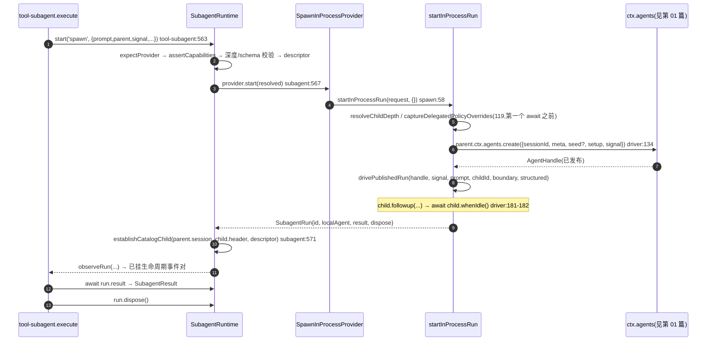

# 02 · 能力缝与 provider(函数级走查)

> 源码:[`packages/subagent/subagent/src/index.ts`](https://github.com/deepseek-ai/deepseek-harness/blob/dbbaa4a37fb9098aba814c97d2956f7b2f105f46/packages/subagent/subagent/src/index.ts)(660 行,Service Definition)、[`packages/subagent/subagent/src/types.ts`](https://github.com/deepseek-ai/deepseek-harness/blob/dbbaa4a37fb9098aba814c97d2956f7b2f105f46/packages/subagent/subagent/src/types.ts)(390 行,全部契约)
> 三个 in-process 后端:[`subagent-in-process-driver/src/index.ts`](https://github.com/deepseek-ai/deepseek-harness/blob/dbbaa4a37fb9098aba814c97d2956f7b2f105f46/packages/subagent/subagent-in-process-driver/src/index.ts)、[`subagent-spawn-in-process/src/index.ts`](https://github.com/deepseek-ai/deepseek-harness/blob/dbbaa4a37fb9098aba814c97d2956f7b2f105f46/packages/subagent/subagent-spawn-in-process/src/index.ts)、[`subagent-fork-in-process/src/index.ts`](https://github.com/deepseek-ai/deepseek-harness/blob/dbbaa4a37fb9098aba814c97d2956f7b2f105f46/packages/subagent/subagent-fork-in-process/src/index.ts)
> 子 agent 内部怎么被组装见 [03](./03-child-agent-composition.md),续存路线见 [04](./04-continuation-and-control.md)。

---

## 第〇节 先说一个命名纠正

任务描述里的"三个 provider(in-process-driver、spawn-in-process、fork-in-process)"**只有后两个是 provider**。`@deepseek-ai/dsh-subagent-in-process-driver` 不注册任何 provider 名,它是 spawn 与 fork **共用的驱动实现**:

```typescript
// packages/subagent/subagent-spawn-in-process/src/index.ts:54-59
start(request: ResolvedSubagentStartRequest) {
  // Fresh child: no seed. The shared driver mints ids, stamps cwd/lineage/depth,
  // drives the one-shot (including the structured capture when the request carries
  // an outputSchema), and maps the result.
  return startInProcessRun(request, {})
}

// packages/subagent/subagent-fork-in-process/src/index.ts:76-83
start(request: ResolvedSubagentStartRequest) {
  const seed = completedTurnPrefix(request.parent)
  return startInProcessRun(request, {
    // Only pass a seed when there's a completed turn to inherit; an empty seed
    // is equivalent to a fresh child, so omit it to keep the session unseeded.
    ...seed.length > 0 ? { seed } : {},
  })
}
```

所以这三者的真实关系是:**driver 是 `SubagentRun` 的唯一实现者,spawn/fork 是它的两个入口,差别只有一个 `seed` 字段**;其余"行为差异"全部由 driver 读 `request` 的字段决定。driver 的模块注释把边界写死了(*continuable children never come through here*,`driver/src/index.ts:6-9`):它只拥有**一轮、一个结果**。

---

## 第一节 seam 的三段式

```text
① 注册表       providers: Map<string, SubagentProvider>          index.ts:189
               registerProvider(provider)                        :509  → effect 独占 + 发 provider-added
               
② 校验         expectProvider(name)                              :609  → 未注册即 NO_PROVIDER
               assertCapabilities(provider, request)             :641  → 逐项 fail-loud
               assertSubagentMaxDepth(request.maxDepth)          :559
               assertObjectJsonSchema(request.outputSchema)      :560
               snapshotSubagentDescriptor({mode:'one-shot',...}) :561  → 快照描述符
               
③ 委派         await provider.start(resolved)                    :567  ← 唯一发布/所有权转移边界
               establishCatalogChild(parent.session, child.header, descriptor)  :571
               observeRun(emitLifecycle, name, parent, run)      :585  → 发 start/end 生命周期对
```

```typescript
// packages/subagent/subagent/src/index.ts:556-586(节选)
async start(name: string, request: SubagentStartRequest): Promise<SubagentRun> {
  const provider = this.expectProvider(name)
  this.assertCapabilities(provider, request)
  assertSubagentMaxDepth(request.maxDepth)
  if (request.outputSchema !== undefined) assertObjectJsonSchema(request.outputSchema)
  const descriptor = snapshotSubagentDescriptor({
    mode: 'one-shot', provider: name,
    ...request.label !== undefined ? { label: request.label } : {},
  })
  const resolved: ResolvedSubagentStartRequest = { ...request, descriptor }
  const run = await provider.start(resolved)          // ← 唯一发布/所有权转移边界
  const child = run.localAgent?.session
  if (child !== undefined) {
    try { establishCatalogChild(request.parent.session, child.header, descriptor) }
    catch (error: unknown) {
      // No caller receives this run; the catalog error owns the failed start.
      void run.result.catch(() => undefined)
      try { await run.dispose() } catch (cleanupError: unknown) {
        this.ctx.logger.warn(`subagent: disposal after catalog append failure also failed: ${String(cleanupError)}`) }
      throw error
    }
  }
  return observeRun(this.emitLifecycle, name, request.parent, run)
}
```

顺序上有三处刻意的设计:

1. **先校验、再快照、后委派**。校验失败时 provider 从未被调用,调用者手上没有 run,也不需要清理任何东西(`:545-549` 的 JSDoc 明确写了这一点)。
2. **`provider.start()` 的 fulfillment 是唯一的发布边界**。JSDoc:*Provider ownership lasts until its promise fulfills; a rejection therefore has no run for the caller to dispose and emits no run lifecycle events*。反过来,`start()` 之后的一切失败都通过返回的 `run` 结算。
3. **目录写入失败时,回滚与"结果 rejection"两头都要管**(`:572-583`):先 `run.result.catch(() => undefined)` 消掉那个再也没人 await 的 Promise,再 `await run.dispose()`;dispose 失败只 warn,因为**目录错误才是调用者该看见的那个**。

### 1.1 能力校验逐项

```typescript
// packages/subagent/subagent/src/index.ts:641-657
private assertCapabilities(provider: SubagentProvider, request: SubagentStartRequest): void {
  const needs: { when: boolean; cap: keyof SubagentCapabilities }[] = [
    { when: request.agentOptions !== undefined, cap: 'agentOptions' },
    { when: request.outputSchema !== undefined, cap: 'outputSchema' },
    { when: request.maxDepth !== undefined, cap: 'depthLimit' },
    { when: request.toolFilter !== undefined, cap: 'toolFilter' },
    { when: request.persona !== undefined, cap: 'persona' },
  ]
  for (const { when, cap } of needs) {
    if (when && !provider.capabilities[cap]) {
      throw new SubagentError(
        `subagent provider "${provider.name}" does not support the "${cap}" capability`,
        'UNSUPPORTED_CAPABILITY',
      )
    }
  }
}
```

`SubagentCapabilities` 是**五元布尔组**(`types.ts:130-136`),契约里写明"each flag corresponds one-to-one to a `SubagentStartRequest` option"(注意对位关系:`depthLimit` ↔ `maxDepth`,其余同名)。这段代码是规则 *fail loud, no silent degradation* 的实现:缺能力时**拒绝**而不是"接受后忽略"。

注意 `tool-subagent` 在更早的地方就已做过一次同类检查(配置期),例如 `maxDepth` 是数字而 provider 没有 `depthLimit`:

```typescript
// packages/subagent/tool-subagent/src/index.ts:329-333
if (typeof config.maxDepth === 'number' && !subagentProvider.capabilities.depthLimit) {
  throw new Error(
    `tool-subagent: provider "${subagentProvider.name}" cannot enforce maxDepth (no depthLimit capability) — `
    + 'set maxDepth: \'provider-managed\' to leave the recursion budget to the provider',
  )
}
```

`subagent` 工具里那个 `maxDepth: 'provider-managed'` 枚举值就是给这件事留的出口([`tool-subagent/src/index.ts:129`](https://github.com/deepseek-ai/deepseek-harness/blob/dbbaa4a37fb9098aba814c97d2956f7b2f105f46/packages/subagent/tool-subagent/src/index.ts#L129))。

### 1.2 注册表与 provider 生命周期

`registerProvider`([`index.ts:509-525`](https://github.com/deepseek-ai/deepseek-harness/blob/dbbaa4a37fb9098aba814c97d2956f7b2f105f46/packages/subagent/tool-subagent/src/index.ts#L509-L525))用一个 effect 做三件事:**重名即抛 `DUPLICATE_PROVIDER`** → `providers.set(name, provider)` → `yield` 一段移除并 `emitLifecycle('subagent/provider-removed', name)` 的析构 → 最后 `this.ctx.emit('subagent/provider-added', provider)`。注释点明最后一步的特殊性:*A throwing added-listener unwinds the yielded rollback, matching the repository's fail-loud registration semantics*([`:521-522`](https://github.com/deepseek-ai/deepseek-harness/blob/dbbaa4a37fb9098aba814c97d2956f7b2f105f46/packages/subagent/tool-subagent/src/index.ts#L521-L522))。

- **重名即抛**正是出货 preset 里 `subagents` 注册表必须留在 HOST composition 的原因之一(provider 名只能注册一次,见 [07](./07-preset-composition.md))。
- 移除 provider **只阻断新 start**,已经交到调用者手上的 run 不受影响([`:503-506`](https://github.com/deepseek-ai/deepseek-harness/blob/dbbaa4a37fb9098aba814c97d2956f7b2f105f46/packages/subagent/tool-subagent/src/index.ts#L503-L506) 与 [`:146-150`](https://github.com/deepseek-ai/deepseek-harness/blob/dbbaa4a37fb9098aba814c97d2956f7b2f105f46/packages/subagent/tool-subagent/src/index.ts#L146-L150) 的事件注释)。

---

## 第二节 请求类型全字段

### 2.1 `SubagentStartRequest`(`types.ts:145-201`)

| 字段 | 类型 | 关键约束(源码位置) |
|---|---|---|
| `label?` | `string` | 可选显示标签,持久化到 session-backed 子会话 |
| `prompt` | `ContentBlock[]` | 作为子 agent 的 user 消息投递 |
| `parent` | `Agent` | **必需**;in-process provider 从它的持久会话状态派生 workspace / lineage / 深度 |
| `signal` | `AbortSignal` | **canonical 取消通道**,启动前后都走它(`:156-162`) |
| `agentOptions?` | `AgentOptions` | 需 `agentOptions` 能力;in-process 走"合并到父选项之上" |
| `outputSchema?` | `ObjectJsonSchema` | 需 `outputSchema` 能力;必须在 `assertObjectJsonSchema` 的子集内;必须是宿主 realm 的纯 JSON |
| `maxDepth?` | `number` | 需 `depthLimit` 能力;**绝对**深度上限,子深度须 `<= maxDepth` |
| `toolFilter?` | `ToolRestriction` | 需 `toolFilter` 能力;in-process 落成子创建窗口里的 `tools.restrict()` |
| `persona?` | `string` | 需 `persona` 能力;落成 `deployment:persona-prefix` 段,**遮蔽**部署 persona |

`signal` 的语义需要单独说清楚——它是**同一个通道贯穿两个阶段**:

```typescript
// packages/subagent/subagent/src/types.ts:156-162
/**
 * Cancellation signal from the spawning context (the tool's `exec.signal`).
 * This is the canonical cancellation channel both before and after startup:
 * a provider rejects `start()` after cleaning partial resources when it
 * fires before the run is published, and cancels the published run's
 * remaining turn work when it fires afterward.
 */
readonly signal: AbortSignal
```

driver 里对应的实现是 `onAbort` 在**发布之前**检查一次、发布之后挂监听(`driver/src/index.ts:168-176`)。

### 2.2 `ResolvedSubagentStartRequest`(`types.ts:207-210`)

```typescript
export interface ResolvedSubagentStartRequest extends SubagentStartRequest {
  /** Detached descriptor a session-backed provider persists in the child log. */
  readonly descriptor: SubagentDescriptorData
}
```

provider 拿到的**不是**原始请求,而是这个加了一个 `descriptor` 的版本。descriptor 由 service 快照([`index.ts:561-565`](https://github.com/deepseek-ai/deepseek-harness/blob/dbbaa4a37fb9098aba814c97d2956f7b2f105f46/packages/subagent/tool-subagent/src/index.ts#L561-L565)),provider 负责把它写进子日志——driver 的做法是在子的**初始 turn 内**、第一个请求之前追加:

```typescript
// packages/subagent/subagent-in-process-driver/src/index.ts:81-91
function attachDescriptorAppend(childCtx: Context, descriptor: SubagentDescriptorData): void {
  let appended = false
  childCtx.on('agent/pre-step', async ({ agent }, next) => {
    const decision = await next()
    if (!appended && decision.kind === 'enter') {
      appended = true
      agent.session.append('subagent/descriptor', descriptor)
    }
    return decision
  })
}
```

选择 `agent/pre-step` 而不是 setup 里直接 append 的原因:setup 阶段 session 已存在但 turn 尚未开始,描述符必须落在**一个真实 turn 内**才符合"模型可见 ⟺ 已落日志"的时序;而 `decision.kind === 'enter'` 保证一个被拒绝的 step 不会留下描述符。

### 2.3 续存路径的两种请求(`types.ts:219-244`)

`ContinuableCreateRequest` 只有三个字段:`sessionId`(已预留的耐久子 id,仅供 provider 诊断)、`parent`、`signal`。`ContinuableCreateSpec` 只有**一个可选字段** `seed`,注释把性质写死了:

> *This is DATA, never a capability: it carries no Agent, `AgentHandle`, prompt delivery, result, disposal, or resume operation*(`types.ts:231-236`)

这就是为什么 `prepareContinuable` 对 provider 来说"没有负担":它只回答一个问题——**这个 provider 的续存子是否以父历史为种子**。

---

## 第三节 结果类型全字段与停因映射

### 3.1 `SubagentRun` 与 `SubagentResult`

```typescript
// packages/subagent/subagent/src/types.ts:308-334(节选)
export interface SubagentRun {
  /** Parent-scoped run id. For a local run, this MUST equal the published child session id… */
  readonly id: SessionId
  /** The exact published in-process child, or `undefined` for a remote run. */
  readonly localAgent: Agent | undefined
  /**
   * Resolves with the child's terminal {@link SubagentResult} when the run
   * settles. Does NOT reject on a child-level failure — a model/transport
   * failure resolves with `stopReason: 'error'` so the consumer maps it to an
   * `isError` tool result. Rejects on an infrastructure fault the seam cannot
   * represent as a stop reason.
   */
  readonly result: Promise<SubagentResult>
  /** Cancel remaining work, reach child quiescence, and release resources. Idempotent. */
  dispose(): Promise<void>
}
```

`SubagentResult`(`types.ts:271-297`)四个字段:`output: ContentBlock[]`(最后一条**非空** assistant 消息的内容,空内容消息含 usage-only 跳过,没有则退化为累积文本流,再没有则 `[]`)、`structured?: unknown`(请求了 `outputSchema` 且成功满足时的值;**请求 schema 不保证存在**,provider 可以用 `stopReason:'error'` 结束)、`diagnostic?: string`(provider 自撰的**非 assistant** 失败详情;契约要求不含工具输入/文件内容/环境值/凭据/原始协议载荷,且**不超过 4096 UTF-8 字节**)、`stopReason`(非 `completed` 意味着 `output` 可能是部分结果)。

`SubagentRunInfo` / `SubagentRunEndInfo`(`types.ts:80-117`)是 observe-only 的生命周期载荷;`local` 字段是"start fulfill 时 `localAgent` 是否存在"的快照,端事件按 `runId` 与 start 配对。

### 3.2 停因联合是可合并扩展的

```typescript
// packages/subagent/subagent/src/types.ts:252-263(节选)
export interface SubagentStopReasonMap {
  completed: 'completed'      // 子 agent 正常结束其 turn
  aborted: 'aborted'          // 经请求 signal 或 dispose 取消
  error: 'error'              // 模型或传输失败
  'max-tokens': 'max-tokens'  // 触到 token 上限
  refusal: 'refusal'          // 子 agent 拒绝任务
}
```

注意注释:*Merge-extensible (a backend may add variants); consumers branch on the known cases and fall through `default`*。工具层据此把未知变体**当作失败**处理([`tool-subagent/src/index.ts:168-172`](https://github.com/deepseek-ai/deepseek-harness/blob/dbbaa4a37fb9098aba814c97d2956f7b2f105f46/packages/subagent/tool-subagent/src/index.ts#L168-L172))。

driver 侧的映射只有 10 行:

```typescript
// packages/subagent/subagent-in-process-driver/src/index.ts:50-67
function toStopReason(reason: TurnEndReason | undefined): SubagentStopReason {
  switch (reason?.kind) {
    case 'completed': return 'completed'
    case 'max-tokens': return 'max-tokens'
    case 'aborted': return 'aborted'
    // A pre-step rejection discarded the claimed prompt: the task was
    // declined, and the caller must not read the run as done.
    case 'blocked': return 'refusal'
    case 'error':
    case 'interrupted':
    default: return 'error'
  }
}
```

`blocked → refusal` 是这里唯一的语义转换:一个被 pre-step 拒绝的 step 把已认领的 prompt 丢掉了,任务等于被拒绝。

### 3.3 `readResult`:边界之后的读法

```typescript
// packages/subagent/subagent-in-process-driver/src/index.ts:212-238(节选)
function readResult(child, boundary, cancelled, structured?): SubagentResult {
  const own = child.session.snapshotEvents(boundary)     // 只看 activation boundary 之后
  const lastEnd = foldConsumedWork(own).end
  const output: ContentBlock[] = finalAssistantOutput(own) ?? []
  const recorded = toStopReason(lastEnd?.data.reason)
  // Disposal can tear the owner down before the loop records its ordinary
  // `aborted` end, yielding `disposed` instead.
  const stopReason: SubagentStopReason = cancelled && recorded !== 'completed' ? 'aborted' : recorded
  if (structured !== undefined) {
    if (structured.captured !== undefined) return { output, structured: structured.captured.value, stopReason }
    if (stopReason === 'completed') return { output, stopReason: cancelled ? 'aborted' : 'error' }
  }
  return { output, stopReason }
}
```

两条规则:

1. **`cancelled` 标志覆盖 `recorded`**(`:230`):dispose 可能在循环写下普通的 `aborted` 结束事件之前就把 owner 拆掉,实际记成 `disposed`;此时必须报 `aborted`。但 `recorded === 'completed'` 时**不覆盖**——真的跑完了就是跑完了。
2. **请求了 schema 却没有捕获值**(`:231-236`):若 `stopReason === 'completed'`,降级为 `error`(或取消时 `aborted`)。注释提醒:`droppedUnrun` 是**故意不读**的,`toStopReason(undefined)` 落到 `error`,从不夸大成功(`:220-223`)。

---

## 第四节 三个 in-process 后端的差异与适用场景

| 维度 | driver(共享实现) | spawn | fork |
|---|---|---|---|
| 注册的 provider 名 | 不注册 | `spawn`(`spawn/src/index.ts:31`) | `fork`(`fork/src/index.ts:37`) |
| 包 | `subagent-in-process-driver` | `subagent-spawn-in-process` | `subagent-fork-in-process` |
| `inject` | — | `['subagents']`(`:22`) | `['subagents']`(`:28`) |
| `capabilities` | 由调用方决定 | 五项全 `true`(`:42-48`) | 五项全 `true`(`:64-70`) |
| `inheritsParentContext` | — | `false`(`:50`) | `true`(`:72`) |
| `start()` 传给 driver 的 `options` | — | `{}`(`:58`) | `{seed}` 或 `{}`(`:78-82`) |
| `prepareContinuable` | — | `Promise.resolve({})`(`:61-65`) | 一次性切片(`:85-91`) |
| 成本 | 一次 Agent 创建事务 | 同上,零父上下文 | 同上 + 父日志拷贝 |

### 4.1 fork 的 seed 切片规则

```typescript
// packages/subagent/subagent-fork-in-process/src/index.ts:48-55
function completedTurnPrefix(parent: Agent): SessionEvent[] {
  const events = parent.session.snapshotEvents()
  const lastEnd = events.findLast(e => e.type === 'turn/end')
  if (lastEnd === undefined) return []
  // seq === array index (the append contract), so slice up to and including it.
  return events.slice(0, lastEnd.seq + 1)
}
```

**只截到最后一个 `turn/end`**。理由是当前这条 tool-call turn 不平衡(有 open step、有悬空 tool call),不能作为合法子会话重放;`seq === 数组下标`(append 契约)保证切片自 0 连续,满足 session 边界的 seed 校验。

### 4.2 为什么 fork 的 `prepareContinuable` 必须**在创建时**切片

```typescript
// packages/subagent/subagent-fork-in-process/src/index.ts:85-91
prepareContinuable(request: ContinuableCreateRequest): Promise<ContinuableCreateSpec> {
  // The fork prefix is captured ONCE, at creation: it becomes part of the
  // child's own durable transcript, so a later cold resume replays that
  // prefix instead of re-forking the parent's newer history.
  const seed = completedTurnPrefix(request.parent)
  return Promise.resolve(seed.length > 0 ? { seed } : {})
}
```

如果冷恢复时才重新切片,父在过去这段时间里新增的 turn 会混进子的历史——**同一个子会话在不同次 activation 里会有不同前缀**,这是不可接受的。所以 fork 的语义是"fork 的那一刻",而不是"fork 的 provider 名"。

### 4.3 spawn/fork 都不 `inject: ['tools']`

两个包顶部都有同一条注释:

> *`tools` is deliberately not injected: the child factory already provides it during setup, and adding it here would unnecessarily change this provider's apply timing.(`spawn/src/index.ts:20-21`)*

fork 里多一句:structured runtime 自己会把 capture 工具的注册按 `tools` 门控,所以这个后端的 apply 时机(以及委派工具在模型可见工具列表里的位置)**不因结构化输出而改变**(`fork/src/index.ts:24-27`)。

---

## 第五节 provider 失败时的错误语义

错误分成三类,分界线是"run 是否已经诞生"。

```text
① 委派之前失败                    调用者:抛出的 SubagentError / RangeError
   NO_PROVIDER(expectProvider:609) · UNSUPPORTED_CAPABILITY(assertCapabilities:641)
   SubagentDepthError · JsonSchemaError
   → provider.start() 从未被调用,无 run,无需清理

② provider.start() reject          调用者:同一份异常向上传播
   prePublicationAbort(driver:76,109) · 创建事务自身的失败(rollback 到收敛)
   → 无 run 返回;不发任何 subagent/start|end 事件

③ run 已发布之后的失败              调用者:永远先拿到 run
   模型/传输失败 → result 以 stopReason:'error' **resolve**
   基础设施故障  → result **reject**(seam 无法表达为停因)
   目录写入失败  → start() 抛目录错误,并且内部 dispose 了这个 run
   dispose 失败  → dispose() reject
```

三处具体代码:

**取消赢得太早**:`prePublicationAbort()` 返回 `new Error('subagent request was aborted before child publication')`(`driver/src/index.ts:76-78`),在 `startInProcessRun` 开头就以 `if (request.signal.aborted) throw prePublicationAbort()` 抛出(`:109`);随后 `agents.create({... signal: request.signal ...})`(`:141`)把同一个 signal 交给创建事务,`raceAbort` 会在 setup 的任何 await 上抛出同一 reason。

**发布的原子性:run 与 handle 同一刻诞生**:

```typescript
// packages/subagent/subagent-in-process-driver/src/index.ts:195-208
return {
  id: childId,
  localAgent: child,
  result,
  async dispose(): Promise<void> {
    signal.removeEventListener('abort', onAbort)
    flags.cancelled = true
    const settlements = await Promise.allSettled([handle.dispose(), result])
    const disposal = settlements[0]
    // The result channel owns run faults; disposal reports only failure to
    // release the published handle after both operations settle.
    if (disposal.status === 'rejected') throw disposal.reason
  },
}
```

`dispose()` 用 `Promise.allSettled` **同时等两个**:handle 的销毁与 result 的结算。**结果通道拥有 run 的故障**;dispose 只在"两个都收敛之后,句柄仍未能释放"时 reject。这避免了"dispose 报错把真正的子 agent 失败盖掉"。

**工具层如何把停因翻成工具错误**([`tool-subagent/src/index.ts:207-237`](https://github.com/deepseek-ai/deepseek-harness/blob/dbbaa4a37fb9098aba814c97d2956f7b2f105f46/packages/subagent/tool-subagent/src/index.ts#L207-L237)):非 `completed` → 抛错并携带诊断与部分输出,注册表把这次 throw 转成 `isError` 工具结果;`run.dispose()` 与 `run.result` 各自 `Promise.allSettled`,**结果失败优先于 dispose 失败,两者皆失败才 `AggregateError`**。

---

## 第六节 一张图:一次前台委派的控制流


<details><summary>Mermaid 源码</summary>



</details>

---

## 第七节 关键文件/符号索引表

| 符号 | 位置 | 职责 |
|---|---|---|
| `SubagentRuntime` | [`packages/subagent/subagent/src/index.ts:188-658`](https://github.com/deepseek-ai/deepseek-harness/blob/dbbaa4a37fb9098aba814c97d2956f7b2f105f46/packages/subagent/subagent/src/index.ts#L188-L658) | 命名 provider 注册表 + 校验型异步 start |
| `registerProvider` / `expectProvider` / `requireContinuations` | [`subagent/src/index.ts:509-525`](https://github.com/deepseek-ai/deepseek-harness/blob/dbbaa4a37fb9098aba814c97d2956f7b2f105f46/packages/subagent/subagent/src/index.ts#L509-L525) / `609-615` / `618-626` | 注册与三种查找失败(`DUPLICATE_PROVIDER` / `NO_PROVIDER` / `CONTINUATION_UNAVAILABLE`) |
| `start` / `assertCapabilities` | [`subagent/src/index.ts:556-586`](https://github.com/deepseek-ai/deepseek-harness/blob/dbbaa4a37fb9098aba814c97d2956f7b2f105f46/packages/subagent/subagent/src/index.ts#L556-L586) / `641-657` | 校验 → 快照描述符 → 委派 → 目录 → observeRun |
| `subagent/provider-*` 与 `subagent/start|end` 事件 | [`subagent/src/index.ts:138-171`](https://github.com/deepseek-ai/deepseek-harness/blob/dbbaa4a37fb9098aba814c97d2956f7b2f105f46/packages/subagent/subagent/src/index.ts#L138-L171) | 注册表变化与运行生命周期对 |
| `SubagentCapabilities` | [`types.ts:130-136`](https://github.com/deepseek-ai/deepseek-harness/blob/dbbaa4a37fb9098aba814c97d2956f7b2f105f46/packages/subagent/subagent/src/types.ts#L130-L136) | 五元布尔组,与请求字段一一对位 |
| `SubagentStartRequest` | [`types.ts:145-201`](https://github.com/deepseek-ai/deepseek-harness/blob/dbbaa4a37fb9098aba814c97d2956f7b2f105f46/packages/subagent/subagent/src/types.ts#L145-L201) | 九个字段;`signal` 是贯穿前后两阶段的取消通道 |
| `ResolvedSubagentStartRequest` | [`types.ts:207-210`](https://github.com/deepseek-ai/deepseek-harness/blob/dbbaa4a37fb9098aba814c97d2956f7b2f105f46/packages/subagent/subagent/src/types.ts#L207-L210) | 请求 + `descriptor` |
| `ContinuableCreateRequest` / `Spec` | [`types.ts:219-244`](https://github.com/deepseek-ai/deepseek-harness/blob/dbbaa4a37fb9098aba814c97d2956f7b2f105f46/packages/subagent/subagent/src/types.ts#L219-L244) | 续存创建:provider 只贡献 `seed` 数据 |
| `SubagentStopReasonMap` / `SubagentResult` | [`types.ts:252-266`](https://github.com/deepseek-ai/deepseek-harness/blob/dbbaa4a37fb9098aba814c97d2956f7b2f105f46/packages/subagent/subagent/src/types.ts#L252-L266) / `271-297` | 可合并扩展的停因联合;`output`/`structured?`/`diagnostic?`(≤4096B)/`stopReason` |
| `SubagentRun` / `SubagentProvider` | [`types.ts:308-334`](https://github.com/deepseek-ai/deepseek-harness/blob/dbbaa4a37fb9098aba814c97d2956f7b2f105f46/packages/subagent/subagent/src/types.ts#L308-L334) / `344-390` | run 四项;provider 六项(含可选 `prepareContinuable`) |
| `startInProcessRun` / `setup` 闭包 | [`subagent-in-process-driver/src/index.ts:104-152`](https://github.com/deepseek-ai/deepseek-harness/blob/dbbaa4a37fb9098aba814c97d2956f7b2f105f46/packages/subagent/subagent-in-process-driver/src/index.ts#L104-L152) / `122-132` | 深度 → 策略捕获 → setup → create → drive |
| `drivePublishedRun` / `readResult` / `toStopReason` | `driver/src/index.ts:158-209` / `212-238` / `50-67` | 一轮 followup→whenIdle→readResult + dispose;停因映射与 `cancelled` 覆盖规则 |
| `attachDescriptorAppend` / `attachStructuredRuntime` | `driver/src/index.ts:81-91` / [`structured.ts:49-141`](https://github.com/deepseek-ai/deepseek-harness/blob/dbbaa4a37fb9098aba814c97d2956f7b2f105f46/packages/subagent/subagent-in-process-driver/src/structured.ts#L49-L141) | 初始 turn 内追加描述符;`structured_output` 工具 + 守卫 + `captured()` |
| `SpawnInProcessProvider` | [`subagent-spawn-in-process/src/index.ts:41-66`](https://github.com/deepseek-ai/deepseek-harness/blob/dbbaa4a37fb9098aba814c97d2956f7b2f105f46/packages/subagent/subagent-spawn-in-process/src/index.ts#L41-L66) | `inheritsParentContext = false`,无 seed |
| `ForkInProcessProvider` / `completedTurnPrefix` | [`subagent-fork-in-process/src/index.ts:63-92`](https://github.com/deepseek-ai/deepseek-harness/blob/dbbaa4a37fb9098aba814c97d2956f7b2f105f46/packages/subagent/subagent-fork-in-process/src/index.ts#L63-L92) / `48-55` | `inheritsParentContext = true`,平衡 turn 前缀 |
