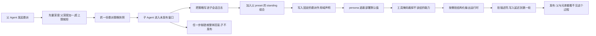
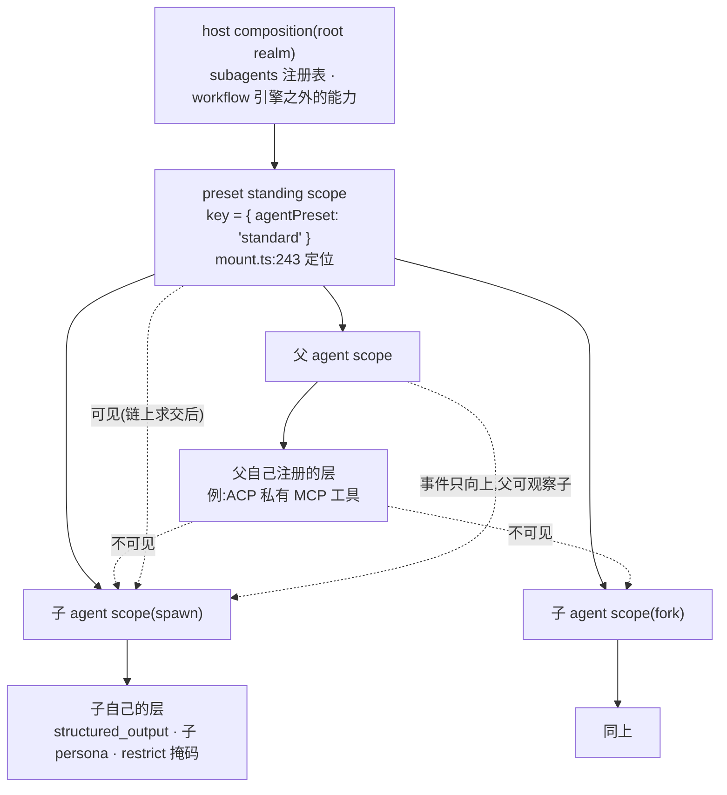

# 03 · 子 Agent 的"世界"如何被组装(函数级走查)

> 源码:`packages/subagent/subagent/src/child-agent.ts`(280 行)、`depth.ts`、`descriptor.ts`
> 装配点:`packages/subagent/subagent-in-process-driver/src/index.ts:122-132`(一次性)与 `packages/subagent/subagent/src/continuation-activation.ts`(续存,同一批函数)
> 对应[第十章第 2.3 节](../10-multi-agent.md);preset 侧的两道硬门见 [07](./07-preset-composition.md)。

---

## 第〇节 一句话结论

子 agent 的"世界"由**四步**装起来,顺序有语义:**(1) 委派策略写进子日志(先写后建,保证日志可自证)**→(2) `applyChildComposition`(join 父 preset → 固定委派作用域声明 → persona 遮蔽 → 工具掩码)→(3) 结构化输出运行时(可选)→(4) 描述符追加(延迟到初始 turn)**。四步全部发生在 `ctx.agents.create()` 的 **setup 未发布窗口**里,因此对父 agent 和兄弟 agent 完全不可见,失败即整体回滚。

其中影响最大的一条是第 (2) 步的第一步:**`composeFrom` 把子 agent 的 scope 父键指向 *预设 standing key*,而不是父 agent 的 scope 键**。

### 人话版:四步把子 Agent 的"世界"装起来

这段讲的是子 Agent 的"世界"是怎么装起来的:它能看见哪些工具、系统提示里多了哪几段、沙箱与审批策略又是什么。装配分四步,顺序本身带语义——先把委派策略写进子会话日志,再做组合(加入父 preset 的 standing 组合、写入固定的委派作用域声明、用 persona 遮蔽部署默认值、用 toolFilter 裁掉不该给的能力),然后按需挂上结构化输出运行时,最后挂上描述符但把真正的写入推迟到子 Agent 的第一轮。四步全部发生在创建子 Agent 的"未发布窗口"里,父 Agent 和兄弟 Agent 完全看不到这个过程,任何一步抛错就整体回滚。这里最容易记错的一条是:子 Agent 的 scope(作用域链)父键指向 **preset 的组合键**,而不是父 Agent 自己的 scope 键——preset 就是一份可挂载的组合配置,写明这个会话里装配哪些插件与工具行。


<details><summary>Mermaid 源码</summary>



</details>

| 阶段 | 做了什么 | 关键调用(文件:行) |
|---|---|---|
| 1 量深度 | 子深度等于父深度加一,超过 maxDepth 抛 SubagentDepthError,错误里带尝试深度与上限 | `subagent/subagent/src/child-agent.ts:49-58` |
| 2 抓策略快照 | 只取父会话的显式 sandbox 覆盖,审批一律钉死 never;必须在第一个 await 之前完成 | `subagent/subagent/src/child-agent.ts:242-247` |
| 3 策略落日志 | 以 source 为 delegation 写进子会话日志,位置在 fork seed 之后、发布之前 | `subagent/subagent/src/child-agent.ts:258-268` |
| 4 加入组合 | 把子 Agent 的 scope 父键绑到父 preset 的 standing 组合上 | `preset/agent-presets/src/index.ts:477-486` |
| 5 委派声明 | 写入"你的权限范围在启动时就固定了"这段运行时上下文,不改变 system prompt 的分段 | `subagent/subagent/src/child-agent.ts:171-175` |
| 6 persona 遮蔽 | 段名与部署 persona 完全相同,而子的作用域在链上更近,所以近者胜 | `subagent/subagent/src/child-agent.ts:199-218` |
| 7 工具掩码 | toolFilter 落成 tools.restrict;空过滤器、保留名、未知全局名都会被拒绝 | `core/tools/src/index.ts:1061-1088` |
| 8 结构化输出 | 把 structured_output 工具注册进子自己的层,因此不会被 toolFilter 裁掉 | `subagent-in-process-driver/src/index.ts:122-132` |
| 9 描述符 | 只挂一个 pre-step 监听,真正的 append 延迟到子的初始 turn | `subagent/subagent/src/child-agent.ts:199-218` |
| 10 会话元数据 | 六个持久字段:cwd、agentPreset、parentSession、isSeeded、origin、delegationDepth | `subagent/subagent/src/child-agent.ts:138-156` |
| 11 读取 preset | agentPreset 读父的 live scope 链而不是会话头,因为父可能在空会话期间换过 preset | `preset/agent-presets/src/index.ts:497-499` |
| 12 失败回滚 | setup 内任何一步抛错都落到创建事务的回滚上,子 Agent 不会被发布 | `agent-loop/src/index.ts:826` |

<details><summary>原图</summary>

```text
host composition (root realm)
  └─ preset standing scope  key = { agentPreset: 'standard' }        ← mount.ts:243 standingMountFor 找的就是它
       ├─ 子 agent A 的 scope key   (composeFrom/mount 都 bindScopeParent 到这里)
       │    └─ 注册:个人 persona / toolFilter / structured_output 工具 …
       ├─ 子 agent B 的 scope key
       └─ 子 agent C 的 scope key
```

</details>

---

## 第一节 装配入口:driver 的 setup 闭包

```typescript
// packages/subagent/subagent-in-process-driver/src/index.ts:111-143(节选)
const parent = request.parent
const childDepth = resolveChildDepth(parent, request.maxDepth)          // ① 深度

const childId = brandString<SessionId>(randomUUID())
const seed = options.seed
const activationBoundary = SessionLogOffset(seed?.length ?? 0)

// Capture before the first await: a later parent switch belongs to the
// parent's future.
const inherited = captureDelegatedPolicyOverrides(parent)                // ② 策略(必须在 await 之前!)

let structured: StructuredAttachment | undefined
const setup = (childCtx: Context, child: Agent): void => {              // ③ 未发布窗口
  appendDelegatedPolicyOverrides(child.session, inherited)
  applyChildComposition(childCtx, parent, { persona: request.persona, toolFilter: request.toolFilter })
  if (request.outputSchema !== undefined) structured = attachStructuredRuntime(childCtx, request.outputSchema)
  attachDescriptorAppend(childCtx, request.descriptor)
}

const handle = await parent.ctx.agents.create({
  sessionId: childId, parentAgent: parent,
  meta: childSessionMeta(parent, childDepth, seed !== undefined),
  ...seed !== undefined ? { seed } : {},
  ...seed === undefined ? {} : { inheritedEventCount: activationBoundary },
  agentOptions: resolveChildAgentOptions(parent, request.agentOptions, childDepth),
  signal: request.signal, setup,
})
```

四个"为什么在此时此地"的理由:

| 动作 | 位置 | 为什么必须在这里 |
|---|---|---|
| `captureDelegatedPolicyOverrides` | `:119`,在 `setup` 之外、**第一个 await 之前** | 注释原文:*a later parent switch belongs to the parent's future*。父 agent 在子创建期间改沙箱模式,不该影响这个子 |
| `appendDelegatedPolicyOverrides` | `setup` 内,第一件事 | 让策略事件落在 seed **之后**(新鲜的委派策略压过 fork seed 里的旧状态),同时仍在**发布之前**——日志可自证 |
| `applyChildComposition` | `setup` 内 | 需要 `childCtx`(scoped context)与父 Agent 两个参数;见第四节 |
| `attachDescriptorAppend` | `setup` 内 | 只挂一个 `agent/pre-step` 监听,真正的 append 延迟到初始 turn |

`setup` 的契约(它**只组合、不驱动**)在 `AgentSetup` 的 JSDoc 里:`packages/core/agent/src/index.ts:100-118`——"everything registered through `agentCtx` … exists before `session/created`, `agent/created`, `agent/session-start`, and the first prompt assembly";以及 *Setup composes, it never drives*。

---

## 第二节 深度:单调下界,不可回退

```typescript
// packages/subagent/subagent/src/depth.ts:28-36
export function delegationDepthOf(agent: Agent): number {
  const runtime = agent.options.subagentDepth
  if (runtime !== undefined && (!Number.isSafeInteger(runtime) || runtime < 0 || Object.is(runtime, -0))) {
    throw new TypeError('agent subagentDepth must be a non-negative safe integer')
  }
  // The header value was validated at the session boundary (creation and
  // persistence load both construct through the store).
  return Math.max(agent.session.header.delegationDepth ?? 0, runtime ?? 0)
}
```

关键在于 **`Math.max`**,注释给出的理由:*a resumed child arrives with fresh options, and counting it from zero would let it delegate as if it were top-level*。即**恢复出来的子 agent 不能装作顶层**。

```typescript
// packages/subagent/subagent/src/child-agent.ts:49-58
export function resolveChildDepth(parent: Agent, maxDepth: number | undefined): number {
  const childDepth = delegationDepthOf(parent) + 1
  if (!Number.isSafeInteger(childDepth)) throw new RangeError('subagent child depth exceeds the safe-integer range')
  if (maxDepth !== undefined && childDepth > maxDepth) throw new SubagentDepthError(childDepth, maxDepth)
  return childDepth
}
```

`maxDepth` 是**绝对值**而不是"还能再往下几层"。超限抛 `SubagentDepthError`(`child-agent.ts:32-37`),它携带 `attemptedDepth` 与 `maxDepth` 两个字段,便于工具层写成人类可读的诊断。`maxDepth` 的默认值来自工具配置 `tool-subagent` 的 `maxDepth`(默认 `3`,`tool-subagent/src/index.ts:129`)。

深度在三个地方冗余保存,互为校验:

1. **会话头的 `delegationDepth`** —— 耐久真源,作为单调下界(上文的 `Math.max`);
2. **`AgentOptions.subagentDepth`** —— 运行期值,只能**加深**;
3. **子会话 meta 的 `delegationDepth`** —— 由 `childSessionMeta` 写入(`child-agent.ts:153-154`,注释 *Durable: the recursion budget must survive persistence and resume*)。

---

## 第三节 持久元数据:`childSessionMeta`

```typescript
// packages/subagent/subagent/src/child-agent.ts:138-156
export function childSessionMeta(
  parent: Agent,
  childDepth: number,
  isSeeded: boolean,
): NonNullable<CreateAgentOptions['meta']> {
  const parentHeader = parent.session.header
  const agentPreset = parent.ctx.get('agentPresets')?.composedPreset(parent.ctx)
  return {
    ...parentHeader.cwd !== undefined ? { cwd: parentHeader.cwd } : {},
    ...agentPreset === undefined ? {} : { agentPreset },
    parentSession: parentHeader.id,
    isSeeded,
    // Navigation classification only; the descriptor remains the authority
    // for mode and continuation capability.
    origin: 'subagent',
    // Durable: the recursion budget must survive persistence and resume.
    delegationDepth: childDepth,
  }
}
```

六个字段各自的用途:

| 字段 | 来源 | 用途 |
|---|---|---|
| `cwd` | 父会话头 | 子继承父的工作目录(而不是进程 cwd) |
| `agentPreset` | **父的 live scope 链** | 让子会话的历史可重建 |
| `parentSession` | 父会话头 | 耐久直系谱系(不是运行期所有权) |
| `isSeeded` | `seed !== undefined` | fork 标记;**显式空 seed 也算 seeded** |
| `origin` | 常量 `'subagent'` | 粗粒度导航分类,不是能力判据 |
| `delegationDepth` | `childDepth` | 单调的递归预算 |

`agentPreset` 的读取方式有一段专门的 JSDoc(`:126-133`),值得整段引用:

> *The preset is read from the parent's LIVE scope chain rather than from its header, because a parent that switched preset while blank runs on the newer composition and its header still names the older one. Recording it is what makes a child's history reconstructable: without it a cold read of the child resolves the deployment default and rebuilds turns under a tool set the child never had.*

即:**父 agent 可能在空会话期间换过 preset**,此时它的 header 仍写着旧 id,但实际 scope 已经挂在新的 standing 组上。`composedPreset` 读的正是 scope 链(`packages/preset/agent-presets/src/index.ts:497-499`):

```typescript
composedPreset(agentCtx: Context): string | undefined {
  return standingMountFor(agentCtx)?.presetId
}
```

`origin: 'subagent'` 只用于 `listChildren` 的候选过滤(`list-children.ts:90-91` 判 `header.parentSession === parentSessionId && header.origin === 'subagent'`);模式(label、能否续存)的真源是描述符——注释在 `:150-151` 明确写了这条分工。

---

## 第四节 `applyChildComposition`:四步,顺序有语义

```typescript
// packages/subagent/subagent/src/child-agent.ts:199-218
export function applyChildComposition(
  childCtx: Context,
  parent: Agent,
  composition: ChildComposition,
): void {
  childCtx.get('agentPresets')?.composeFrom(childCtx, parent.ctx)
  childCtx.systemPrompt.context({
    name: 'subagent:delegation',
    order: childCtx.systemPrompt.getContextOrder('SUBAGENT_DELEGATION'),
    text: SUBAGENT_DELEGATION_CONTEXT,
  })
  if (composition.persona !== undefined) {
    childCtx.systemPrompt.section({
      name: 'deployment:persona-prefix',
      order: childCtx.systemPrompt.getSectionOrder('DEPLOYMENT_PERSONA_PREFIX'),
      text: composition.persona,
    })
  }
  if (composition.toolFilter !== undefined) childCtx.tools.restrict(composition.toolFilter)
}
```

### 4.1 用 `ctx.get` 而不是 `ctx.agentPresets`

`childCtx.get('agentPresets')?.` 是**可选**读取(documented `ctx.get` pattern,`child-agent.ts:23-28` 的注释):没有 preset roster 的部署里,模型可见的行本来就坐在 host 平面,子 agent 通过工具注册表的 global layer 已经看得到,所以**没有 join 也不是错误**。

这行代码有一个容易被忽略的性质:**`composeFrom` 是同步的**(`agent-presets/src/index.ts:477-486` 没有 `async`)。这正是 driver 能在同步 `setup` 里调它的前提——preset 的 JSDoc 写明了这一点(*Synchronous, and with no composition failure mode of its own*,`index.ts:463-467`)。

### 4.2 join 必须在子自己的注册之前

函数 JSDoc(`:177-198`)把理由写成了显式设计:

> *The join comes first and the child's own registrations second, which is the order the layering already implies — the nearest scope wins a name, and a per-child restriction intersects with everything its chain admits — but stating it here keeps the two steps from being read as independent.*

第二条理由更重:*The join and the per-child registrations live in ONE call because a child composed without the join is exactly the defect this function exists to prevent*——**把 `parent` 作为参数**是让"忘记 join"在调用点无法表达的手段。

### 4.3 委派作用域声明是 runtime context,不是 system-prompt section

```typescript
// packages/subagent/subagent/src/child-agent.ts:171-175
export const SUBAGENT_DELEGATION_CONTEXT
  = 'You are a delegated subagent: your permission scope was fixed when you were started and cannot be '
    + 'widened from inside this session — operations that require approval are rejected automatically. '
    + 'When the task needs access beyond that scope, do not retry the denied operation; state the '
    + 'limitation in your reply so the delegating agent can handle it.'
```

注释(`:166-170`)说明为什么用 `systemPrompt.context(...)` 而不是 `section(...)`:*A runtime-context contribution rather than a system-prompt section, so the deployment's system prompt stays uniform across parents and children*。也就是说,这段文字不改变 system prompt 的结构(不影响 KV cache 的分段),只作为运行时上下文注入。

### 4.4 persona 是"遮蔽",不是"追加"

`composition.persona` 注册的段名与部署 persona 的段名**完全相同**(`deployment:persona-prefix`),而子 agent 的 scope 在链上更近——**近者胜**。契约在 `types.ts:193-200` 写明了:*SHADOWING the deployment's persona for this child alone*。

### 4.5 `toolFilter` 落成 `tools.restrict()`

`restrict()` 的拒绝面非常严格(`packages/core/tools/src/index.ts:1061-1088`):

| 拒绝条件 | 错误文案要点 |
|---|---|
| ctx 无 scope | *a context-global restriction would mask every agent* |
| 空过滤器 `{}` | *an empty filter is almost always a materialized-empty-config bug* |
| 命名保留名 `run_code` | *cannot name reserved PTC mode presentation transport* |
| 命名未知全局工具 | 把**已知全局工具名单**打进错误 |

---

## 第五节 scope 父链指向 preset standing key:后果推演

### 5.1 事实

```typescript
// packages/preset/agent-presets/src/index.ts:477-486(节选)
composeFrom(agentCtx: Context, parentCtx: Context): string | undefined {
  const agentKey = scopeOf(agentCtx)
  if (agentKey === undefined) throw new Error('agent-presets: refusing to compose an unscoped context; …')
  const standing = standingMountFor(parentCtx)
  if (standing === undefined) return undefined
  this.bindings.set(agentKey, bindScopeParent(agentKey, standing.key))
  return standing.presetId
}
```

```typescript
// packages/preset/agent-presets/src/mount.ts:243-251
export function standingMountFor(agentCtx: Context): JoinedPresetMount | undefined {
  const agentKey = scopeOf(agentCtx)
  if (agentKey === undefined) return undefined
  const standingKey = scopeParentOf(agentKey)     // agent 的 scope 父 = preset 的 standing key
  if (standingKey === undefined) return undefined
  return livePresetMounts().find(
    (candidate): candidate is JoinedPresetMount => candidate.key === standingKey,
  )
}
```

`bindScopeParent` 是 dsh-scope 里**唯一的重连能力**(`packages/core/scope/src/index.ts:72`),而持有它的是 preset roster 私有 `bindings` WeakMap(`index.ts:415-421`)。**父 agent 的 scope 键在子 agent 的链上根本不出现**——它是兄弟关系,不是父子关系。

### 5.2 后果一:工具面来自"preset 层 + 自己的层"

工具可见面在 `view()` 里一次遍历算完(`packages/core/tools/src/index.ts:1142-1173`):

```typescript
// packages/core/tools/src/index.ts:1148-1166(节选)
const own = this.layers.peek(scope)                  // 本 scope 自己的层:不过滤
const inherited = new Map(global.tools.entries())
for (const layer of layers) {
  if (layer === own) continue
  for (const [n, d] of layer.tools.entries()) inherited.set(n, d)
}
for (const [name, definition] of inherited) {
  if (layers.every(layer => layer.admits(name))) visible.set(name, definition)   // 链上限制求交
}
```

- 遍历的是**子 agent 自己的 scope 链**:global layer → preset standing 层 → 子自己的层。父 agent 自己 scope 层里注册的工具**不在链上**。
- `peek()`(本 scope 自己的层,`store.ts:180`)与 `chainLayers()`(带继承,`store.ts:192`)刻意分开;JSDoc 提醒 *must not silently pick up an ancestor's — use chainLayers where*。
- **"own layer 例外"是子 agent 结构化输出工具能活下来的原因**:`attachStructuredRuntime` 把 `structured_output` 注册进**子自己的层**;而 `toolFilter` 只裁剪**继承来的**能力,不会把它裁掉(`tools/index.ts:1127-1132` 的注释就是为这条写的)。

由此得到三条可预测规则:

1. **父子差异 = 子自己的 `toolFilter` + 两侧 preset 的差异**。子 agent 的工具面来自"preset standing 层 + 自己的层",**不是"父 agent 层"**。
2. **链上限制求交**:preset 层若 `restrict` 掉某工具,该 preset 下所有 agent(含其子)都看不到。
3. **不可见与拒绝执行是同一条**:被裁掉的工具既不在提示里,也不在派发表里(`subagent/src/types.ts:185-192` 的 `toolFilter` 契约 + `tools/index.ts:1194-1196`)。

### 5.3 后果二:MCP 工具不继承

ACP 路径对每台服务器做 `agentCtx.plugin(McpClient, config)`(`packages/acp/acp/src/mcp.ts:26-33`),工具落在**该 agent 自己的 scope 层**;命名空间预订也按作用域隔离(`packages/mcp/mcp-client/src/index.ts:45,155-159`)。

结合 5.2:**agent 私有的 MCP 工具不会被它的子 agent 继承**。要让一批 agent 共享 MCP,正确位置是 host composition 或 preset 组合。"父 agent 装了 MCP,子 agent 就该看得见"这个直觉在这里是错的。

### 5.4 后果三:技能(也是同一套规则)

`SkillRegistry` 同样用 `ScopedLayers` 并按 scope 链合并(`packages/skill/skill/src/index.ts:362,441-470`);preset 里的 `skill-filesystem` 行把 skill 注册进该 preset 的层,于是同一 preset 下的父子共享同一份目录。

### 5.5 后果四:事件方向只向上

一句话:事件只能沿作用域链往上走——子 Agent 看不见祖先层上的监听器,而父级的组合能看见它下面每一个 Agent。机制是 `scopeTarget` 只允许事件沿链向上,排在 dispatch key 之下的监听器会被直接排除(`packages/core/scope/src/index.ts:158-180`)。
所以一份 preset standing composition **能观察它下面的每个 agent**,反之不行。委派生命周期事件正是靠这个性质分发的:carrier 由**委派父**决定,故父级监听器只看到自己的委派(`subagent/src/lifecycle.ts:86-90,134-163`;`subagent/src/index.ts:151-170` 的事件注释)。


<details><summary>Mermaid 源码</summary>



</details>

---

## 第六节 委派策略:捕获一次,写进子日志

```typescript
// packages/subagent/subagent/src/child-agent.ts:242-268
export function captureDelegatedPolicyOverrides(parent: Agent): DelegatedPolicyOverrides {
  return {
    sandboxMode: parent.ctx.get('sandboxPolicy')?.overrideOf(parent.session),
    approvalPolicy: parent.ctx.get('approval') === undefined ? undefined : 'never',
  }
}

export function appendDelegatedPolicyOverrides(
  childSession: Session,
  overrides: DelegatedPolicyOverrides,
): void {
  if (overrides.sandboxMode !== undefined) {
    childSession.append('sandbox/mode', { mode: overrides.sandboxMode, source: 'delegation' })
  }
  if (overrides.approvalPolicy !== undefined) {
    childSession.append('approval/policy', { policy: overrides.approvalPolicy, source: 'delegation' })
  }
}
```

两条规则:

1. **只捕获父会话的显式覆盖**(`overrideOf(parent.session)`),**绝不**捕获部署默认值,也绝不捕获一次性授权(`:232-241` 的 JSDoc)。
2. **审批一律钉死 `'never'`**,且仅在 approval 能力已被组合时(否则为 `undefined`,即整条事件都不写)。理由:*a delegated child acts only within the sandbox scope fixed at delegation, so its asks are rejected deterministically*。

落日志的三个时序性质(`:249-257` 的 JSDoc):

- 位置在**任何 fork seed 之后** → 新鲜策略压过 seed 里的旧状态;
- 位置在**发布之前** → 属于"发布前未存后缀",由 `appendUnstoredSuffix` 冲进写句柄(`agent-loop/src/index.ts:749-757`);
- **子之后的切换仍然胜过这些事件** → 这些是初始值,不是锁。

**这就是模型可见文案"your permission scope was fixed when you were started"的实现依据**:子会话单凭自己的日志就能重建有效策略,不需要父会话在场。注意 `ctx.get('sandboxPolicy')` / `ctx.get('approval')` 都是**可选**读取(`child-agent.ts:17-22` 的 type-only import 注释说明了这个刻意的 opportunistic 用法)。

---

## 第七节 descriptor:子会话自述的"我是什么"

描述符版本固定为 3(`descriptor.ts:48`),两种形状:

```typescript
// packages/subagent/subagent/src/descriptor.ts:61-86(节选)
export interface OneShotSubagentDescriptorData extends SubagentDescriptorBase {
  readonly mode: 'one-shot'
  /** …persisted as the child's creation label so enumeration can identify the conversation without … */
  readonly label?: string
}
export interface ContinuableSubagentDescriptorData extends SubagentDescriptorBase {
  readonly mode: 'continuable'
  readonly label: string
  readonly agentProvider?: string
  readonly agentModel?: string
  readonly agentReasoningEffort?: ReasoningEffortId
  /** Per-child persona that shadows the deployment persona on resume. */
  readonly persona?: string
  readonly toolFilter?: ToolRestriction
}
```

两个刻意的**不存**:

- **不存 `subagentDepth`**——深度以持久 header 为单调下界(第二节);
- **不存 `outputSchema`**——schema 只属于某一次 activation(`descriptor.ts:8-19`)。

续存分支之所以要存 `agentProvider` / `agentModel` / `agentReasoningEffort` / `persona` / `toolFilter`,是因为冷恢复时**不再派发任何 provider**(`continuation.ts:400-402` 的 JSDoc:*The descriptor supplies every reconstruction input; no subagent provider is dispatched*),这些值必须从日志里读回来。详见 [04](./04-continuation-and-control.md)。

读取侧是 `foldSubagentDescriptor`(`descriptor.ts:317`),版本不匹配时返回 `undefined`——即"这个子会话不可续存"。

---

## 第八节 关键文件/符号索引表

| 符号 | 位置 | 职责 |
|---|---|---|
| `SubagentDepthError` | `packages/subagent/subagent/src/child-agent.ts:32-37` | 携带 `attemptedDepth` / `maxDepth` |
| `resolveChildDepth` | `child-agent.ts:49-58` | 父深度 +1;可选绝对上限;安全整数校验 |
| `delegationDepthOf` | `depth.ts:28-36` | `Math.max(header, options)` 单调下界 |
| `assertSubagentMaxDepth` | `depth.ts`(导出) | 校验 `maxDepth` 本身可表示 |
| `parentAgentOptionsForDelegation` | `child-agent.ts:68-85` | 最新请求头拥有 provider/model/effort;创建选项只留 maxTokens |
| `resolveChildAgentOptions` | `child-agent.ts:98-119` | 合并父路由 + 请求覆盖 + 盖上 `subagentDepth`;换路由且未指 effort 时清掉 effort |
| `childSessionMeta` | `child-agent.ts:138-156` | 六个持久字段;`agentPreset` 读 **live scope 链** |
| `ChildComposition` | `child-agent.ts:159-164` | `{persona?, toolFilter?}` |
| `SUBAGENT_DELEGATION_CONTEXT` | `child-agent.ts:171-175` | 固定委派作用域声明(文案逐字固定) |
| `applyChildComposition` | `child-agent.ts:199-218` | join → 声明 → persona → restrict,顺序有语义 |
| `DelegatedPolicyOverrides` | `child-agent.ts:221-230` | `sandboxMode` + `approvalPolicy: 'never' \| undefined` |
| `captureDelegatedPolicyOverrides` | `child-agent.ts:242-247` | 只取父的**显式**覆盖;审批钉死 |
| `appendDelegatedPolicyOverrides` | `child-agent.ts:258-268` | 以 `source:'delegation'` 落子日志 |
| setup 闭包 | `subagent-in-process-driver/src/index.ts:122-132` | 四步装配的实际调用点 |
| `attachStructuredRuntime` | `driver/src/structured.ts:49-141` | 子自己层里的 `structured_output` 工具 + 守卫 |
| `SUBAGENT_DESCRIPTOR_VERSION` | `subagent/src/descriptor.ts:48` | = 3 |
| `ContinuableSubagentDescriptorData` | `descriptor.ts:72-85` | 冷恢复所需的全部重建输入 |
| `foldSubagentDescriptor` | `descriptor.ts:317` | 版本不匹配返回 `undefined` |
| `composeFrom` / `composedPreset` | `packages/preset/agent-presets/src/index.ts:477-486` / `497-499` | 同步 join;按 scope 读 preset |
| `standingMountFor` | `packages/preset/agent-presets/src/mount.ts:243-251` | 用 scope 父键找 standing 组合 |
| `bindScopeParent` / `scopeParentOf` / `scopeOf` | `packages/core/scope/src/index.ts:72` / `89` / `154` | 唯一的重连能力与两个读取 |
| `ScopedLayers.peek` / `chainLayers` / `merge` | `packages/core/scope/src/store.ts:180` / `192` / `208` | 本层 vs 带继承,刻意分开 |
| `ToolRegistry.view` / `restrict` | `packages/core/tools/src/index.ts:1142-1173` / `1061-1088` | 继承面过滤 + own layer 例外;严格拒绝面 |
