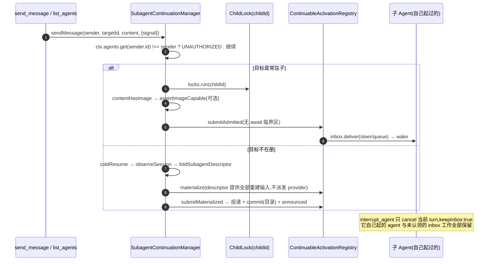

# 04 · 续存与管控(函数级走查)

> 源码:[`packages/subagent/subagent/src/continuation.ts`](https://github.com/deepseek-ai/deepseek-harness/blob/dbbaa4a37fb9098aba814c97d2956f7b2f105f46/packages/subagent/subagent/src/continuation.ts)(550 行)、[`continuation-activation.ts`](https://github.com/deepseek-ai/deepseek-harness/blob/dbbaa4a37fb9098aba814c97d2956f7b2f105f46/packages/subagent/subagent/src/continuation-activation.ts)(854 行)、[`control.ts`](https://github.com/deepseek-ai/deepseek-harness/blob/dbbaa4a37fb9098aba814c97d2956f7b2f105f46/packages/subagent/subagent/src/control.ts)、[`control-types.ts`](https://github.com/deepseek-ai/deepseek-harness/blob/dbbaa4a37fb9098aba814c97d2956f7b2f105f46/packages/subagent/subagent/src/control-types.ts)、[`list-children.ts`](https://github.com/deepseek-ai/deepseek-harness/blob/dbbaa4a37fb9098aba814c97d2956f7b2f105f46/packages/subagent/subagent/src/list-children.ts)(408 行)、[`assistant-output.ts`](https://github.com/deepseek-ai/deepseek-harness/blob/dbbaa4a37fb9098aba814c97d2956f7b2f105f46/packages/subagent/subagent/src/assistant-output.ts)(75 行)、[`continuation-messages.ts`](https://github.com/deepseek-ai/deepseek-harness/blob/dbbaa4a37fb9098aba814c97d2956f7b2f105f46/packages/subagent/subagent/src/continuation-messages.ts)、[`internal.ts`](https://github.com/deepseek-ai/deepseek-harness/blob/dbbaa4a37fb9098aba814c97d2956f7b2f105f46/packages/subagent/subagent/src/internal.ts)
> 模型侧:[`packages/subagent/tool-subagent-control/src/index.ts`](https://github.com/deepseek-ai/deepseek-harness/blob/dbbaa4a37fb9098aba814c97d2956f7b2f105f46/packages/subagent/tool-subagent-control/src/index.ts)(117 行)、[`src/list-agents.ts`](https://github.com/deepseek-ai/deepseek-harness/blob/dbbaa4a37fb9098aba814c97d2956f7b2f105f46/packages/subagent/tool-subagent-control/src/list-agents.ts)
> 对应[第十章第 2.3/2.4 与第四节](../10-multi-agent.md);一次性前台路线见 [02](./02-subagent-seam-and-providers.md)。

---

## 第〇节 一句话结论

可续存子 agent 与一次性子 agent 的**根本差别是"谁持有 `AgentHandle`"**:一次性路线把 handle 包成 `SubagentRun` 交给调用者,一次委托一个结果;可续存路线把 handle **留在 `SubagentContinuationManager` 里**,由它通过子 agent 自己的 inbox 排每一轮。所以 provider 在续存路径上**只贡献一个 `seed` 数据**,看不到 Agent、handle、turn 或 teardown([`subagent/src/types.ts:231-244`](https://github.com/deepseek-ai/deepseek-harness/blob/dbbaa4a37fb9098aba814c97d2956f7b2f105f46/packages/subagent/subagent/src/types.ts#L231-L244))。

日常三件事的实现落点:

| 动作 | 入口 | 内核 |
|---|---|---|
| 建续存子 | `startContinuable`([`continuation.ts:102`](https://github.com/deepseek-ai/deepseek-harness/blob/dbbaa4a37fb9098aba814c97d2956f7b2f105f46/packages/subagent/subagent/src/continuation.ts#L102)) | 预留 id → 描述符快照 → `prepareContinuable` → `materialize` → 投首条 prompt |
| 给子加话 | `sendMessage`([`continuation.ts:202`](https://github.com/deepseek-ai/deepseek-harness/blob/dbbaa4a37fb9098aba814c97d2956f7b2f105f46/packages/subagent/subagent/src/continuation.ts#L202)) | 常驻则 `steer`,否则 `coldResume` |
| 停子当前 turn | `interrupt`([`continuation.ts:332`](https://github.com/deepseek-ai/deepseek-harness/blob/dbbaa4a37fb9098aba814c97d2956f7b2f105f46/packages/subagent/subagent/src/continuation.ts#L332) → [`continuation-activation.ts:257`](https://github.com/deepseek-ai/deepseek-harness/blob/dbbaa4a37fb9098aba814c97d2956f7b2f105f46/packages/subagent/subagent/src/continuation-activation.ts#L257)) | 授权检查 → `cancel(cause, {keepInbox: true})` |

---

## 第一节 可续存判定:`startContinuable` 的六道前置

```typescript
// packages/subagent/subagent/src/continuation.ts:102-140(节选)
const parent = request.parent
this.activations.assertAdmitting(parent)                       // ① 未在 drain
const persistence = this.requirePersistence()                  // ② 必须有持久化
assertSubagentMaxDepth(request.maxDepth)                       // ③ 深度参数本身合法
const childId = spec.childId ?? brandString<SessionId>(randomUUID())
this.activations.assertChildIdAvailable(childId)               // ④ id 未被活 Agent/Session 占用
const childDepth = resolveChildDepth(parent, request.maxDepth)
const agentOptions = resolveChildAgentOptions(parent, request.agentOptions, childDepth)
const descriptor = snapshotSubagentDescriptor({ mode: 'continuable', provider: spec.provider, … })  // ⑤
const delegatedPolicies = captureDelegatedPolicyOverrides(parent)
const releaseHold = this.activations.holdOwnership(parent, childId)                                  // ⑥
const prepared = await this.host.prepareContinuable(spec.provider, { sessionId: childId, parent, signal: spec.signal })
```

六道前置的失败码:

| # | 检查 | 失败 |
|---|---|---|
| ① | `assertAdmitting` | `DRAINING` |
| ② | `requirePersistence`(`:526-535`) | `PERSISTENCE_UNAVAILABLE` |
| ③ | `assertSubagentMaxDepth` | `RangeError` |
| ④ | `assertChildIdAvailable`([`continuation-activation.ts:214-218`](https://github.com/deepseek-ai/deepseek-harness/blob/dbbaa4a37fb9098aba814c97d2956f7b2f105f46/packages/subagent/subagent/src/continuation-activation.ts#L214-L218)) | `DUPLICATE_CHILD` |
| ⑤ | `snapshotSubagentDescriptor` | 描述符 JSON 非法 → 在"还没有子 agent"时就拒绝 |
| ⑥ | `holdOwnership`([`:230-250`](https://github.com/deepseek-ai/deepseek-harness/blob/dbbaa4a37fb9098aba814c97d2956f7b2f105f46/packages/subagent/subagent/src/continuation-activation.ts#L230-L250)) | `ACTIVATION_CLOSING`,或返回一个失败路径的 releaser |

第 ⑥ 点的理由写在 [`:131-133`](https://github.com/deepseek-ai/deepseek-harness/blob/dbbaa4a37fb9098aba814c97d2956f7b2f105f46/packages/subagent/subagent/src/continuation-activation.ts#L131-L133):*An idle continuation-managed parent must not settle while a caller is still creating its child. A turn-scoped delegation does not need this, but the service is also callable outside a turn*。`holdOwnership` 返回的 releaser **只删掉本次调用加的那条边**;若期间已经有活的 Activation,所有权边归那个 Activation,releaser 保守保留([`:241-249`](https://github.com/deepseek-ai/deepseek-harness/blob/dbbaa4a37fb9098aba814c97d2956f7b2f105f46/packages/subagent/subagent/src/continuation-activation.ts#L241-L249))。

### 1.1 关键区里的三重复查

真正的创建发生在 `activations.locks.run(childId, ...)` 里([`:146-184`](https://github.com/deepseek-ai/deepseek-harness/blob/dbbaa4a37fb9098aba814c97d2956f7b2f105f46/packages/subagent/subagent/src/continuation-activation.ts#L146-L184)),并且**在锁内把 ①②④ 全部再查一遍**:

```typescript
// packages/subagent/subagent/src/continuation.ts:147-158(节选)
spec.signal.throwIfAborted()
this.activations.assertAdmitting(parent)
this.activations.assertChildIdAvailable(childId)
if (spec.childId !== undefined) {
  const persisted = await persistence.stat(childId, { signal: spec.signal })
  spec.signal.throwIfAborted()
  this.activations.assertAdmitting(parent)
  this.activations.assertChildIdAvailable(childId)
  if (persisted !== undefined) throw new SubagentError(`subagent "${childId}" already exists`, 'DUPLICATE_CHILD')
}
```

`spec.childId !== undefined` 分支是给"调用者自己预留了 id"的路线的:光查内存注册表不够,还要查**持久化里是否已经有这个会话**——否则会覆盖一份已存在的子会话历史。

`prepareContinuable` 本身也有能力门,由 service 层实现([`subagent/src/index.ts:593-606`](https://github.com/deepseek-ai/deepseek-harness/blob/dbbaa4a37fb9098aba814c97d2956f7b2f105f46/packages/subagent/subagent/src/index.ts#L593-L606)):

```typescript
if (provider.prepareContinuable === undefined) {
  throw new SubagentError(
    `subagent provider "${provider.name}" does not support continuable children (no prepareContinuable capability)`,
    'UNSUPPORTED_CAPABILITY')
}
```

**方法存在即能力**——没有 `prepareContinuable` 的 provider(例如 ACP/外部 CLI 后端)在**预留任何子资源之前**就被拒绝。

### 1.2 一条 prompt 的入队与"返回指引"

```typescript
// packages/subagent/subagent/src/continuation.ts:174-185(节选)
const childHeader = activation.handle.agent.session.header
return await this.submitMaterialized(
  activation,
  isAdjacentAgentSendMessageTool(this.ctx.get('tools')?.get('send_message', activation.handle.agent))
    ? withContinuableReturnGuidance(parent.id, request.prompt)
    : request.prompt,
  { source: { kind: 'user' }, signal: spec.signal, delivery: 'queue' },
  parent,
  () => { establishCatalogChild(parent.session, childHeader, descriptor) },
)
```

`isAdjacentAgentSendMessageTool`([`internal.ts:32`](https://github.com/deepseek-ai/deepseek-harness/blob/dbbaa4a37fb9098aba814c97d2956f7b2f105f46/packages/subagent/subagent/src/internal.ts#L32))判断子 agent 的工具面里**是否真的有 `send_message`**;有才注入"如何回报"的指引(`withContinuableReturnGuidance`,[`continuation-messages.ts:81`](https://github.com/deepseek-ai/deepseek-harness/blob/dbbaa4a37fb9098aba814c97d2956f7b2f105f46/packages/subagent/subagent/src/continuation-messages.ts#L81))。这是"不给它做不到的建议"的写法——`markAdjacentAgentSendMessageTool` 就是给这个判定打的标记(`internal.ts:15,22`)。

`submitMaterialized`(`:457-485`)把"承认 + 提交 + 失败释放"合成一个事务:图片能力校验 → `submitAdmitted` → `commit()`(目录写入)→ `announced = true`;任一失败则 `activations.dispose(activation)`,并且**dispose 的失败只 warn**——原件错误才是调用者要看的(`:475-483`)。

---

## 第二节 `send_message` 的完整路径

### 2.1 模型侧:117 行文件里只有 20 行逻辑

```typescript
// packages/subagent/tool-subagent-control/src/index.ts:60-73(节选)
async execute(args, exec) {
  const sender = exec.agent
  if (!sender) throw new Error('send_message requires a calling agent (exec.agent was undefined)')
  const message: ContentBlock[] = [{ type: 'text', text: args.message }]
  const messageId = await ctx.subagents.sendMessage(
    sender, brandString<SessionId>(args.agent_id), message, { signal: exec.signal })
  return { messageId }
}
```

工具自己的 JSDoc 就把语义界定死了:*They perform no lifecycle routing of their own — residency, cold resume, and interrupt authorization belong to the subagent service*([`index.ts:2-8`](https://github.com/deepseek-ai/deepseek-harness/blob/dbbaa4a37fb9098aba814c97d2956f7b2f105f46/packages/subagent/subagent/src/index.ts#L2-L8))。

### 2.2 service 侧的三岔口

```typescript
// packages/subagent/subagent/src/continuation.ts:208-231(节选)
if (this.ctx.agents.get(sender.id) !== sender) {                      // ① 发送者必须精确活体
  throw new SubagentError('message delivery requires the exact live sender agent', 'UNAUTHORIZED')
}
this.activations.assertAdmitting(sender)
const senderActivation = this.activations.get(sender.id)
if (senderActivation !== undefined && senderActivation.handle.agent === sender
  && senderActivation.parentSession === targetId) {
  options.signal.throwIfAborted()
  return this.sendToParent(senderActivation, sender, content)          // ② 发给直接父
}
if (sender.session.header.parentSession === targetId) {                // ③ 有父但不是常驻
  throw new SubagentError(
    `agent "${sender.id}" is not a resident continuable child and cannot send to parent "${targetId}"`, 'UNAUTHORIZED')
}
return this.deliverToChild(sender, targetId, content, { signal: options.signal, delivery: 'steer' })  // ④ 发给子
```

① 值得强调:用的是**对象身份比较**(`get(id) !== sender`),不是 id 比较。可复用的 id 可能已经解析到一个**替换实例**,所以"精确活体"是授权条件本身。这条规则在 `interrupt`([`continuation-activation.ts:265-270`](https://github.com/deepseek-ai/deepseek-harness/blob/dbbaa4a37fb9098aba814c97d2956f7b2f105f46/packages/subagent/subagent/src/continuation-activation.ts#L265-L270))和 job 所有权([`jobs-local/src/index.ts:454-456`](https://github.com/deepseek-ai/deepseek-harness/blob/dbbaa4a37fb9098aba814c97d2956f7b2f105f46/packages/jobs/jobs-local/src/index.ts#L454-L456))里重复出现。

③ 是一条容易被误读的分支:一个**非常驻**的、但 header 里 `parentSession === targetId` 的 agent 想给"父"发消息 → 拒绝。理由:只有常驻 Activation 才记录着 `parentSession`,而只有它知道"直接父"是哪一个活实例;一个不在册的 agent 没有这条信息,不能凭日志自称。

### 2.3 发给子:常驻 steer,不常驻 coldResume

```typescript
// packages/subagent/subagent/src/continuation.ts:296-316(节选)
while (true) {
  const live = await this.activations.locks.run(childId, async () => {
    const activation = this.activations.get(childId)
    if (activation === undefined) return this.coldResume(parent, childId, content, options)
    const disposal = activation.inbox.closing
    if (disposal !== undefined) return disposal.then(() => undefined, () => undefined)
    if (contentHasImage(content)) {
      await this.assertImageCapable(activation.handle.agent, options.signal)
      if (activation.inbox.closing !== undefined) {
        await Promise.allSettled([activation.inbox.closing]); return undefined
      }
    }
    const messageId = this.submitAdmitted(activation, content, options, parent)
    activation.announced = true
    return messageId
  })
  if (live !== undefined) return live          // 交付成功
  this.activations.assertAdmitting(parent)     // 丢失在关闭截止线上 → 重试一轮
  options.signal.throwIfAborted()
}
```

三处细节:① **整个交付在 `locks.run(childId, ...)` 里**——每个子 id 一把锁,交付与冷恢复互斥。② `activation.inbox.closing`(`:300-305`)是"正在被销毁"的事务:此时**等它结束再重试**,不报错——这就是 `while (true)` 重试的唯一理由(注释 `:317` 标明 *only a delivery that lost the disposal cutoff retries*)。③ 图片内容走 `assertImageCapable`(`:507-523`):解析 `agent.options` 的 provider/model,查 `llm.resolveModelInfo(...)`,不支持 image 输入就抛 `MODEL_DOES_NOT_SUPPORT_IMAGES`——**在投递之前查,不在投递之后补救**。

最终投递到 inbox 的动作在 registry 里([`continuation-activation.ts:482-503`](https://github.com/deepseek-ai/deepseek-harness/blob/dbbaa4a37fb9098aba814c97d2956f7b2f105f46/packages/subagent/subagent/src/continuation-activation.ts#L482-L503)),它把所有关卡压进一个**没有 await 的临界区**:

```typescript
submitAdmitted(activation, message, delivery, parent, signal): MessageId {
  signal.throwIfAborted()
  this.assertAdmitting(parent)
  this.authorizeLineage(parent, activation.childId, activation.handle.agent.session.header.parentSession)
  this.acquireOwnership(parent, activation.childId)
  try { activation.inbox.deliver(message, delivery) } finally { this.wake(activation) }
  return message.id
}
```

### 2.4 发给父:`sendToParent`

```typescript
// packages/subagent/subagent/src/continuation.ts:337-360(节选)
if (activation.inbox.closing !== undefined) {
  throw new SubagentError(`subagent "${sender.id}" activation is being disposed; the message was not delivered`,
    'ACTIVATION_CLOSING')
}
const parent = this.ctx.agents.get(activation.parentSession)
if (parent === undefined) {
  throw new SubagentError('direct parent is not live; the message was not delivered', 'PARENT_UNAVAILABLE')
}
const message = createAgentMessage(sender, content)
this.sendAgentMessage(parent, message)
return message.id
```

差别在于:**发给父永远是 `steer`**(`sendAgentMessage` 调 `activations.sendWaking(parent, message, 'steer')`,`:363-376`),而且父不在时就报 `PARENT_UNAVAILABLE`——**没有"冷恢复父"这种操作**。这与工具描述里的措辞一致:"If the target is still working, the message steers its nearest step; if it is idle, the message starts a turn"([`tool-subagent-control/src/index.ts:30-34`](https://github.com/deepseek-ai/deepseek-harness/blob/dbbaa4a37fb9098aba814c97d2956f7b2f105f46/packages/subagent/tool-subagent-control/src/index.ts#L30-L34))。`createAgentMessage`([`continuation-messages.ts:62`](https://github.com/deepseek-ai/deepseek-harness/blob/dbbaa4a37fb9098aba814c97d2956f7b2f105f46/packages/subagent/subagent/src/continuation-messages.ts#L62))构造模型侧可辨认的 `agent` 来源消息,与人类 prompt 的 `user` 来源区分开。

---

## 第三节 `interrupt_agent` 的边界

### 3.1 工具侧只有 10 行,授权全在 service

```typescript
// packages/subagent/tool-subagent-control/src/index.ts:105-115
execute(args, exec) {
  const caller = exec.agent
  if (!caller) {
    // Ancestor authority requires an exact live calling agent.
    throw new Error('interrupt_agent requires a calling agent (exec.agent was undefined)')
  }
  // The service authorizes the exact live caller against the target's
  // recorded lineage; the tool adds no authority of its own.
  ctx.subagents.interrupt(brandString<SessionId>(args.agent_id), { kind: 'ancestor', agent: caller })
  return Promise.resolve({ accepted: true })
}
```

### 3.2 授权阶梯

```typescript
// packages/subagent/subagent/src/continuation-activation.ts:263-299(节选)
if (authority.kind === 'ancestor') {
  const caller = authority.agent
  if (this.ctx.agents.get(caller.id) !== caller) {
    throw new SubagentError(`interrupting "${targetSessionId}" requires the exact live ancestor agent`, 'UNAUTHORIZED')
  }
  if (caller.id === targetSessionId) {
    throw new SubagentError(`agent "${caller.id}" cannot interrupt itself`, 'UNAUTHORIZED')
  }
}
const activation = this.resident.get(targetSessionId)
if (activation === undefined) return                     // 不在册 = 接受的 no-op
if (authority.kind === 'user') {
  if (activation.handle.agent.session.header.parentSession !== authority.parentSessionId) {
    throw new SubagentError(`subagent "${targetSessionId}" belongs to another parent session`, 'UNAUTHORIZED')
  }
} else if (!activation.ancestry.has(authority.agent)) {
  throw new SubagentError(
    `subagent "${targetSessionId}" is not a live descendant of agent "${authority.agent.id}"`, 'UNAUTHORIZED')
}
// Disposal already stopped the target with a whole-Activation teardown;
// a second cancel would be a redundant signal on a closing handle.
if (activation.inbox.closing !== undefined) return
activation.handle.agent.cancel(
  authority.kind === 'user' ? { kind: 'user' } : { kind: 'parent' }, { keepInbox: true })
```

- `ancestor` 授权走 **`activation.ancestry`**——运行期的活祖先后代集,而不是会话日志里的 `parentSession` 链。所以 `interrupt_agent` 能停"更深一层的、由你起的 agent"(工具描述:*The target may be your direct child or a deeper agent created under you*,[`index.ts:79-81`](https://github.com/deepseek-ai/deepseek-harness/blob/dbbaa4a37fb9098aba814c97d2956f7b2f105f46/packages/subagent/subagent/src/index.ts#L79-L81))。
- `{ keepInbox: true }` 是边界的核心。`CancelOptions.keepInbox` 的契约([`packages/core/agent/src/runtime-types.ts:38-45`](https://github.com/deepseek-ai/deepseek-harness/blob/dbbaa4a37fb9098aba814c97d2956f7b2f105f46/packages/core/agent/src/runtime-types.ts#L38-L45)):*The active turn is still aborted, but un-started and pending work survives for a later turn and no canceled inbox splice is logged*。
- **目标不存在 → 接受的 no-op**([`:279`](https://github.com/deepseek-ai/deepseek-harness/blob/dbbaa4a37fb9098aba814c97d2956f7b2f105f46/packages/core/agent/src/runtime-types.ts#L279))。工具描述把这条写进了模型可见文案:*interrupting an agent that already finished is an accepted no-op*。

### 3.3 边界清单

| 停 / 不停 | 行为 | 依据 |
|---|---|---|
| ✅ 停当前 turn | `agent.cancel(cause, {keepInbox:true})` | [`continuation-activation.ts:296-299`](https://github.com/deepseek-ai/deepseek-harness/blob/dbbaa4a37fb9098aba814c97d2956f7b2f105f46/packages/subagent/subagent/src/continuation-activation.ts#L296-L299) |
| ✅ 停"关闭截止线"之后不再补救 | `inbox.closing !== undefined` 直接 return | [`:295`](https://github.com/deepseek-ai/deepseek-harness/blob/dbbaa4a37fb9098aba814c97d2956f7b2f105f46/packages/subagent/subagent/src/continuation-activation.ts#L295) |
| ❌ 不清 inbox | `keepInbox: true` | [`:298`](https://github.com/deepseek-ai/deepseek-harness/blob/dbbaa4a37fb9098aba814c97d2956f7b2f105f46/packages/subagent/subagent/src/continuation-activation.ts#L298) |
| ❌ 不杀它自己起的 agent | Activation 与 `ownedChildren` 完全不动 | [`:293-295`](https://github.com/deepseek-ai/deepseek-harness/blob/dbbaa4a37fb9098aba814c97d2956f7b2f105f46/packages/subagent/subagent/src/continuation-activation.ts#L293-L295) 注释;`holdOwnership` 只在 drain 路径释放 |
| ❌ 不返回"已停止" | service 的 `interrupt()` 返回 `void`,工具恒返回 `{accepted:true}` | [`subagent/src/index.ts:295-297`](https://github.com/deepseek-ai/deepseek-harness/blob/dbbaa4a37fb9098aba814c97d2956f7b2f105f46/packages/subagent/subagent/src/index.ts#L295-L297);`tool-subagent-control:114` |
| ❌ 不保证立即生效 | 文档原文:*Fire-and-return: the cancel signal is issued before this returns, but the target may keep running until it observes the signal* | [`subagent/src/index.ts:282-284`](https://github.com/deepseek-ai/deepseek-harness/blob/dbbaa4a37fb9098aba814c97d2956f7b2f105f46/packages/subagent/subagent/src/index.ts#L282-L284) |

停完之后的行为也有定义:*Once the interrupted driver is idle, a waking send resumes the parked FIFO queue*([`subagent/src/index.ts:286-288`](https://github.com/deepseek-ai/deepseek-harness/blob/dbbaa4a37fb9098aba814c97d2956f7b2f105f46/packages/subagent/subagent/src/index.ts#L286-L288))——被保留的排队消息不会丢,下一条 `send_message` 会把它唤醒。

---

## 第四节 冷恢复 `coldResume`

```typescript
// packages/subagent/subagent/src/continuation.ts:410-425(节选)
const query = this.requireSessionQuery()
let observation: SessionObservation
try { observation = await query.observeSession(childId, { signal: options.signal }) }
catch (error: unknown) {
  options.signal.throwIfAborted()
  throw new SubagentError(`subagent "${childId}" is unavailable`, 'NOT_RESUMABLE', { cause: error })
}
using source = observation
this.activations.assertAdmitting(parent)
this.activations.authorizeLineage(parent, childId, source.header.parentSession)
const descriptor = foldSubagentDescriptor(source.events.slice(source.inheritedEventCount))
if (descriptor === undefined || descriptor.mode !== 'continuable') {
  throw new SubagentError(
    `subagent "${childId}" has no supported continuation state and cannot be resumed; choose a different target`,
    'NOT_RESUMABLE')
}
```

后续的 `materialize`(`:434-447`)把描述符拆成 `agentOptions`(`agentProvider`/`agentModel`/`agentReasoningEffort`)与 `composition`(`persona`/`toolFilter`)两组输入;非 `SubagentError` 的失败统一翻成 `NOT_RESUMABLE`(`:448-452`)。

流程五步:

1. **`observeSession(childId)`** 读冷会话(不加载 Agent);
2. **`authorizeLineage`**([`continuation-activation.ts:437-451`](https://github.com/deepseek-ai/deepseek-harness/blob/dbbaa4a37fb9098aba814c97d2956f7b2f105f46/packages/subagent/subagent/src/continuation-activation.ts#L437-L451)):父必须是**精确活体**,且 `source.header.parentSession === parent.id`;
3. **`foldSubagentDescriptor(events.slice(inheritedEventCount))`**:只看继承前缀之后的事件——**描述符必须由子自己写下**,不能被 fork seed 里的父描述符冒充;
4. descriptor 必须是 `mode === 'continuable'` 且版本匹配(fold 在版本不符时返回 `undefined`,[`descriptor.ts:210`](https://github.com/deepseek-ai/deepseek-harness/blob/dbbaa4a37fb9098aba814c97d2956f7b2f105f46/packages/subagent/subagent/src/descriptor.ts#L210));
5. **不派发任何 provider**:`materialize` 直接用描述符里的 `agentProvider`/`agentModel`/`agentReasoningEffort`/`persona`/`toolFilter` 重建子 agent。

`using source = observation` 是显式资源释放(`:420`):observation 持有的读句柄在函数退出时释放,无论成功失败。

这里也是"描述符三件套"存在的理由:如果描述符不存这些字段,冷恢复就只能回落到部署默认,而子 agent 的历史是在**另一套 provider/model/persona/工具面**下产生的。

---

## 第五节 `list_children` / `list_descendants` 与状态读取

### 5.1 读取不加载、不唤醒

```typescript
// packages/subagent/subagent/src/list-children.ts:88-94
const listing = await prepareListing(ctx, signal)
const candidates = [...listing.corpus.values()]
  .filter(record => record.header.parentSession === parentSessionId
    && record.header.origin === 'subagent')
  .sort(compareCorpusRecords)
const rows = await resolveCandidateRows(candidates, listing, signal)
return rows.filter((row): row is SubagentListEntry => row !== undefined)
```

模块 JSDoc(`:1-18`)把实现策略写清楚了:候选来自**一个 live-preferred 语料库**(`ctx.sessions` 与可选持久化的合并),每个子 agent 的 mode/label 由注册的 `subagent` projection unit 给出,按**三级阶梯**解析——活体走注册表的 watermark 缓存、冷而未 seeded 的走持久投影缓存、其余走**一次共享的 Session observation**。三级之外还刻了一条:*A seeded header deliberately lacks its exact inherited cut, so it takes the body-bearing observation path before classifying an identity*——**seeded 会话必须读正文**才能分类。冷读并发上限 `COLD_READ_CONCURRENCY = 4`(`:37`),注释说明理由:*Current Session persistence providers are local; a networked provider must promote this to a validated deployment setting*。模块无状态、不碰 Activation/Agent 注册表(`:14-15`)。

### 5.2 状态由**活注册表**补

`statusOf`([`tool-subagent-control/src/list-agents.ts:59-63`](https://github.com/deepseek-ai/deepseek-harness/blob/dbbaa4a37fb9098aba814c97d2956f7b2f105f46/packages/subagent/tool-subagent-control/src/list-agents.ts#L59-L63))只有三行逻辑:`agents.get(id)` 为 `undefined` → `'ready'`;否则 `agent.status === 'running' ? 'running' : 'idle'`。映射规则([`:53-56`](https://github.com/deepseek-ai/deepseek-harness/blob/dbbaa4a37fb9098aba814c97d2956f7b2f105f46/packages/subagent/tool-subagent-control/src/list-agents.ts#L53-L56)):`running` = 活体且正在工作;`idle` = 活体但在 turn 之间(可能正在等它自己起的 agent);`ready` = 没有活 Agent 了——**仅存在于存储中,可恢复,但不是"待收集的结果"**。

`ready` 的语义被刻意写成"resumable, not terminal"(工具描述原文 [`:98-99`](https://github.com/deepseek-ai/deepseek-harness/blob/dbbaa4a37fb9098aba814c97d2956f7b2f105f46/packages/subagent/tool-subagent-control/src/list-agents.ts#L98-L99)),因为一个 `ready` 的子 agent 仍然是合法的 `send_message` 目标——那会走 `coldResume`。所以 list 的输出是**观察**,不是**投递承诺**([`:100-101`](https://github.com/deepseek-ai/deepseek-harness/blob/dbbaa4a37fb9098aba814c97d2956f7b2f105f46/packages/subagent/tool-subagent-control/src/list-agents.ts#L100-L101) 明说 *The snapshot is not a delivery promise*)。

---

## 第六节 [`assistant-output.ts`](https://github.com/deepseek-ai/deepseek-harness/blob/dbbaa4a37fb9098aba814c97d2956f7b2f105f46/packages/subagent/subagent/src/assistant-output.ts):输出抽取规则

```typescript
// packages/subagent/subagent/src/assistant-output.ts:32-59(节选)
push(event: SessionEvent): void {
  if (event.type === 'assistant/message') {
    const content = event.data.message.content
    if (content.length > 0) this.message = content
  }
  if (event.type === 'assistant/message' || event.type === 'assistant/attempt') {
    this.pushText(joinAssistantStreamText(event.data.stream))
  }
}
collect(): ContentBlock[] | undefined {
  if (this.message !== undefined) return this.message
  const text = this.partial.join('')
  return text.length > 0 ? [{ type: 'text', text }] : undefined
}
```

规则三条:

1. **主选**:最后一条**非空** `assistant/message`。`content.length > 0` 是必需条件——空内容消息只记录了 usage,若用它覆盖,会把之前真正的输出抹掉。模块注释给出了它出现的场景:*An empty-content message records usage only when the loop appends it after a max-tokens step with no executable blocks*(`:3-6`)。
2. **备选**:若一条非空消息都没有,则取**累积的 assistant 文本流**(`assistant/message` 与 `assistant/attempt` 的内嵌 stream,以及 `pushText` 从非会话事件推入的文本,例如 ACP 的 content chunk)。
3. **与停因无关**:*Selection is independent of the run's stop reason*(`:7-8`)。所以被取消/被截断的子 agent **仍然带部分输出**,由调用者决定怎么呈现。

`finalAssistantOutput(events)`(`:67-75`)就是把整段后缀喂给 fold。这里留了一条 TODO(`:68-71`):每次结算都完整 fold 一遍;**若长续存 epoch 在此处变热**,再改成"反向扫描 + 仅在无消息时折叠文本增量"。

调用点:

| 调用方 | 位置 | 用途 |
|---|---|---|
| 一次性 driver | [`subagent-in-process-driver/src/index.ts:226`](https://github.com/deepseek-ai/deepseek-harness/blob/dbbaa4a37fb9098aba814c97d2956f7b2f105f46/packages/subagent/subagent-in-process-driver/src/index.ts#L226) | `readResult` 取 `output` |
| 生命周期事件 | [`subagent/src/lifecycle.ts`](https://github.com/deepseek-ai/deepseek-harness/blob/dbbaa4a37fb9098aba814c97d2956f7b2f105f46/packages/subagent/subagent/src/lifecycle.ts) | `subagent/end.lastAssistantMessage` |

两处**共用同一条规则**,这是把它抽成模块的全部理由。

---

## 第七节 何时释放常驻子:三条 drain 路径

service 面暴露两个方法([`packages/subagent/subagent/src/index.ts:299-330`](https://github.com/deepseek-ai/deepseek-harness/blob/dbbaa4a37fb9098aba814c97d2956f7b2f105f46/packages/subagent/subagent/src/index.ts#L299-L330)):**`drainContinuableDescendants(parents)`** 关闭这些父之下整片森林的续存准入 → **同步**停掉可见后代 Activation → 等已承认的 materialization → **child-first** 释放;**`drainContinuableChildren(parent, childIds)`** 只释放选中的常驻直接子,同父的其他子保持驻留。

登记顺序上有一处精心的安排([`continuation-activation.ts:184-198`](https://github.com/deepseek-ai/deepseek-harness/blob/dbbaa4a37fb9098aba814c97d2956f7b2f105f46/packages/subagent/subagent/src/continuation-activation.ts#L184-L198)):

> *Register the private scope's structural disposer FIRST and the drain SECOND, so reverse unwind invokes the drain before releasing the scope; a cleanup effect on the same scope as the Agent handles would let structural handle disposal bypass child-first ordering.*

即 **"child-first"必须靠转出顺序表达**,不能靠"挂一个 cleanup effect 到同一个 scope"——那会让句柄的结构性析构绕开父子顺序。


<details><summary>Mermaid 源码</summary>



</details>

---

## 第八节 关键文件/符号索引表

| 符号 | 位置 | 职责 |
|---|---|---|
| `SubagentContinuationManager` | [`packages/subagent/subagent/src/continuation.ts:82-548`](https://github.com/deepseek-ai/deepseek-harness/blob/dbbaa4a37fb9098aba814c97d2956f7b2f105f46/packages/subagent/subagent/src/continuation.ts#L82-L548) | 续存编排:身份、描述符、provider 准备、冷恢复、授权、路由 |
| `startContinuable` | [`continuation.ts:102-190`](https://github.com/deepseek-ai/deepseek-harness/blob/dbbaa4a37fb9098aba814c97d2956f7b2f105f46/packages/subagent/subagent/src/continuation.ts#L102-L190) | 六道前置 + 锁内三重复查 + materialize + 首条 prompt |
| `sendMessage` / `sendToParent` | [`continuation.ts:202-232`](https://github.com/deepseek-ai/deepseek-harness/blob/dbbaa4a37fb9098aba814c97d2956f7b2f105f46/packages/subagent/subagent/src/continuation.ts#L202-L232) / `337-360` | 三岔口;发给父恒 `steer`,父不在即 `PARENT_UNAVAILABLE` |
| `deliverToChild` / `deliverFollowup` | [`continuation.ts:273-287`](https://github.com/deepseek-ai/deepseek-harness/blob/dbbaa4a37fb9098aba814c97d2956f7b2f105f46/packages/subagent/subagent/src/continuation.ts#L273-L287) / `290-323` | 每 id 一把锁;丢在关闭截止线上则重试 |
| `coldResume` | [`continuation.ts:404-454`](https://github.com/deepseek-ai/deepseek-harness/blob/dbbaa4a37fb9098aba814c97d2956f7b2f105f46/packages/subagent/subagent/src/continuation.ts#L404-L454) | observeSession → authorizeLineage → fold → materialize(不派发 provider) |
| `submitMaterialized` / `submitAdmitted` / `assertImageCapable` | [`continuation.ts:457-485`](https://github.com/deepseek-ai/deepseek-harness/blob/dbbaa4a37fb9098aba814c97d2956f7b2f105f46/packages/subagent/subagent/src/continuation.ts#L457-L485) / `488-504` / `507-523` | 承认事务;消息构造;投递前查 `inputModalities` |
| `requirePersistence` / `requireSessionQuery` | [`continuation.ts:526-535`](https://github.com/deepseek-ai/deepseek-harness/blob/dbbaa4a37fb9098aba814c97d2956f7b2f105f46/packages/subagent/subagent/src/continuation.ts#L526-L535) / `538-547` | `PERSISTENCE_UNAVAILABLE` / `CONTINUATION_UNAVAILABLE` |
| `ContinuableActivationRegistry` | [`continuation-activation.ts:153-853`](https://github.com/deepseek-ai/deepseek-harness/blob/dbbaa4a37fb9098aba814c97d2956f7b2f105f46/packages/subagent/subagent/src/continuation-activation.ts#L153-L853) | 进程内 Activation 图:驻留、锁、授权、排空 |
| `assertChildIdAvailable` / `holdOwnership` | [`continuation-activation.ts:214-218`](https://github.com/deepseek-ai/deepseek-harness/blob/dbbaa4a37fb9098aba814c97d2956f7b2f105f46/packages/subagent/subagent/src/continuation-activation.ts#L214-L218) / `230-250` | `DUPLICATE_CHILD`;父不可 settle 的边 |
| `interrupt` | [`continuation-activation.ts:257-300`](https://github.com/deepseek-ai/deepseek-harness/blob/dbbaa4a37fb9098aba814c97d2956f7b2f105f46/packages/subagent/subagent/src/continuation-activation.ts#L257-L300) | 两条授权阶梯 + `keepInbox: true` |
| `assertAdmitting` / `authorizeLineage` | [`continuation-activation.ts:420-429`](https://github.com/deepseek-ai/deepseek-harness/blob/dbbaa4a37fb9098aba814c97d2956f7b2f105f46/packages/subagent/subagent/src/continuation-activation.ts#L420-L429) / `437-451` | `DRAINING`;精确活父 + 直系校验 |
| `materialize` / `submitAdmitted` / `dispose` | [`continuation-activation.ts:458-471`](https://github.com/deepseek-ai/deepseek-harness/blob/dbbaa4a37fb9098aba814c97d2956f7b2f105f46/packages/subagent/subagent/src/continuation-activation.ts#L458-L471) / `482-503` / `511-513` | 创建/恢复;无 await 临界区;memoized close |
| `markAdjacentAgentSendMessageTool` / `isAdjacentAgentSendMessageTool` | `subagent/src/internal.ts:15,22,32` | 判定子是否有 `send_message` 能力 |
| `createAgentMessage` / `withContinuableReturnGuidance` | [`continuation-messages.ts:62`](https://github.com/deepseek-ai/deepseek-harness/blob/dbbaa4a37fb9098aba814c97d2956f7b2f105f46/packages/subagent/subagent/src/continuation-messages.ts#L62) / `81` | 相邻 Agent 消息与回报指引 |
| `validateControlRequest` / `catalogView` / `rejectPrompt` | [`subagent/src/control.ts:40`](https://github.com/deepseek-ai/deepseek-harness/blob/dbbaa4a37fb9098aba814c97d2956f7b2f105f46/packages/subagent/subagent/src/control.ts#L40) / `60` / `107` | 远程面入参与错误翻译 |
| `listChildren` / `listDescendants` / `COLD_READ_CONCURRENCY` | [`subagent/src/list-children.ts:83-95`](https://github.com/deepseek-ai/deepseek-harness/blob/dbbaa4a37fb9098aba814c97d2956f7b2f105f46/packages/subagent/subagent/src/list-children.ts#L83-L95) / `110-120` / `37` | live-preferred 语料 + 三级阶梯分类 |
| `statusOf` | [`tool-subagent-control/src/list-agents.ts:59-63`](https://github.com/deepseek-ai/deepseek-harness/blob/dbbaa4a37fb9098aba814c97d2956f7b2f105f46/packages/subagent/tool-subagent-control/src/list-agents.ts#L59-L63) | `running` / `idle` / `ready` 三态 |
| `send_message` / `interrupt_agent` | [`tool-subagent-control/src/index.ts:28-74`](https://github.com/deepseek-ai/deepseek-harness/blob/dbbaa4a37fb9098aba814c97d2956f7b2f105f46/packages/subagent/tool-subagent-control/src/index.ts#L28-L74) / `76-116` | 薄适配:只取 `exec.agent` 与品牌化 id |
| `AssistantOutputFold` / `finalAssistantOutput` | [`subagent/src/assistant-output.ts:22-60`](https://github.com/deepseek-ai/deepseek-harness/blob/dbbaa4a37fb9098aba814c97d2956f7b2f105f46/packages/subagent/subagent/src/assistant-output.ts#L22-L60) / `67-75` | 最后一条非空 assistant 消息 → 累积文本流 |
| `SUBAGENT_DESCRIPTOR_VERSION` / `foldSubagentDescriptor` | [`subagent/src/descriptor.ts:48`](https://github.com/deepseek-ai/deepseek-harness/blob/dbbaa4a37fb9098aba814c97d2956f7b2f105f46/packages/subagent/subagent/src/descriptor.ts#L48) / `317` | 描述符 v3;版本不符即"不可续存" |
