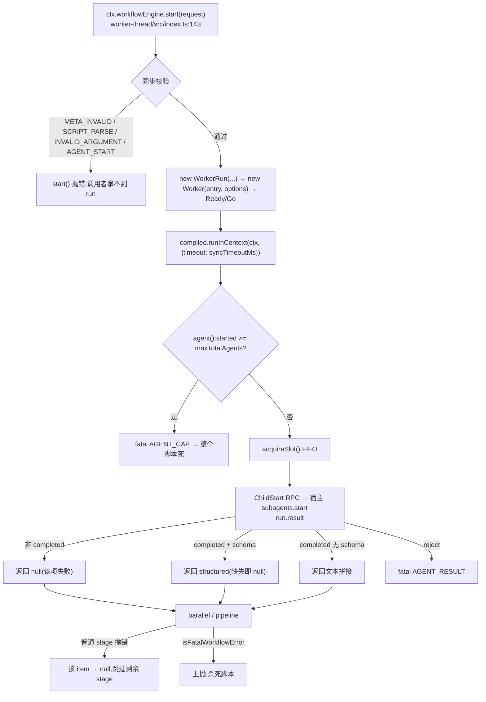

# 05 · workflow 引擎:worker 线程 + vm realm(函数级走查)

> 源码:`packages/workflow/workflow-worker-thread/src/`(index 205 / runtime 488 / host 625 / realm 151 / protocol 101 / meta 82 / session 201 / types 94 行)、`packages/workflow/workflow/src/index.ts`(203 行)
> 模型侧:`packages/workflow/tool-workflow/src/index.ts`(334 行)、`tool-ralph/src/index.ts`(477 行)
> 本章展开[第十章第 5.1–5.4 节](../10-multi-agent.md)的代码内部。

---

## 第〇节 一句话结论

workflow 引擎把**模型写的脚本**放进一个一次性 worker 线程里的 `vm` context 执行,脚本只能通过五个注入的 hook 与外界说话;每个 `agent()` 调用经线程间 RPC 反向打到**宿主**的 subagent seam,因此子 agent 始终活在宿主进程里,worker 只是"脚本的沙箱壳"。

**隔离不是安全边界**:`realm.ts:1-8` 的模块注释原文是 *the vm is not a security boundary*——worker 提供的是 **host-loop isolation and forced termination**,而不是对敌意值的容纳。真正的保护来自"值一律物化成纯 JSON"与"钩子参数严格校验"。

```text
宿主线程(Host)                                     worker 线程
WorkflowEngine.start(request)                       ┌─────────────────────────────┐
  validateMeta(:144) / assertBodyParses(:145)       │ runWorkerSession(session.ts)│
  resolveSubagentProvider(:146) / 限额解析(:150)     │  Ready ──────────────▶ Go   │
  new WorkerRun(...)  ────── workerData(结构化克隆)─▶│  WorkflowExecution(runtime) │
      ▲                                             │   vm.createContext(:99)     │
      │  ChildStart / ChildDispose / Result          │   agent/parallel/pipeline   │
      └──────────────────────────────────────────────┤   phase/log/args            │
      ▼                                             └─────────────────────────────┘
  ctx.subagents.start(provider, {... parent, signal: controller.signal})
```

---

## 第一节 脚本解析与 start() 的同步校验

### 1.1 meta 是数据,不是脚本

```typescript
// packages/workflow/workflow-worker-thread/src/meta.ts:1-6(模块注释)
/**
 * Meta validation checks caller-provided DATA against the {@link WorkflowMeta}
 * contract and rejects every violation by name. Meta arrives as schema-checked
 * JSON data, never evaluated script text; evaluating it on the host could run getters outside the
 * worker timeout that exists to isolate model-written code.
 */
```

这段注释给出了一个不显然的安全取舍:**meta 绝不用 `vm` 求值**。如果为了拿 `export const meta` 而在宿主 `runInContext` 一次,模型写的 getter 就会在**没有 worker 超时保护**的宿主线程里跑。所以 `validateMeta`(`meta.ts:76-82`)是纯数据结构校验:未知字段、缺失/类型错误的 `name`/`description`、畸形的 `phases` 逐条报名字,并且返回一份 **normalized 副本**,引擎从不别名调用者的对象(`meta.ts:68-73`)。

### 1.2 body 解析检查:刻意重复一次 parse

```typescript
// packages/workflow/workflow-worker-thread/src/index.ts:64-74
function assertBodyParses(body: string, name: string): void {
  if (META_STATEMENT.test(body)) {
    throw new WorkflowError('workflow meta rides the `meta` request field, not the script: remove the `export const meta = {...}` statement from the body', 'SCRIPT_PARSE')
  }
  try {
    // Parse only — the script object is discarded, nothing executes.
    void new vm.Script(`(async () => {\n${body}\n})()`, { filename: `workflow:${name}`, lineOffset: -1 })
  } catch (error: unknown) {
    throw new WorkflowError(`workflow script does not parse: ${String(error)}`, 'SCRIPT_PARSE', { cause: error })
  }
}
```

`META_STATEMENT = /^\s*export\s+const\s+meta\b/`(`:54`)。三点:

1. **同一条包装** `(async () => {\n${body}\n})()` 在宿主(`:70`)与 worker(`runtime.ts:91`)各编译一次。JSDoc 承认这是 *One redundant parse per run, bought deliberately for the contract*——为了让 `start()` **同步**抛出 `SCRIPT_PARSE`,而不是把一个语法错误推迟到"线程已经起来了"之后。
2. `lineOffset: -1` 补偿包装头部那一行,让栈里的行号回到脚本自己的行号。
3. 首行 `export const meta` 得到**专门的文案**,因为这是模型最可能犯的作者错误(`:60-62`)。

### 1.3 限额解析:请求值不得越过部署天花板

```typescript
// packages/workflow/workflow-worker-thread/src/index.ts:143-157(节选)
const meta = validateMeta(request.meta)
assertBodyParses(request.script, meta.name)
const subagentProvider = resolveSubagentProvider(this.ctx, this.config.provider, request.subagentProvider)
const maxTotalAgents = resolveMaxTotalAgents(request.maxTotalAgents, this.config.maxTotalAgents)
const id = WorkflowRunId(randomUUID())
const limits: WorkerLimits = {
  maxConcurrentAgents: this.config.maxConcurrentAgents === 0
    ? Math.min(16, Math.max(1, availableParallelism() - 2))
    : this.config.maxConcurrentAgents,
  maxTotalAgents, maxItemsPerCall: this.config.maxItemsPerCall, syncTimeoutMs: this.config.syncTimeoutMs,
}
```

`Config` 六个字段(`index.ts:115-122`):`provider`(默认 `'spawn'`)、`maxConcurrentAgents`(0 → `min(16, max(1, cores - 2))`)、`maxTotalAgents`(1000,runaway 循环兜底)、`maxItemsPerCall`(4096)、`syncTimeoutMs`(5000,脚本**首个同步切片**的 vm 超时)、`disposeGraceMs`(5000,取消后强制结算并 terminate 的宽限,也界定 `dispose()`)。`maxConcurrentAgents: 0` 的解析写成显式三元而非藏在默认值里,符合仓库的 *Explicit > implicit at package boundaries*。

`resolveSubagentProvider`(`:77-89`)在**发布任何工作之前**校验 provider 名非空、已 trim,且 `ctx.subagents.getProvider(provider) !== undefined`,否则抛 `AGENT_START`。`resolveMaxTotalAgents`(`:92-104`)只允许**调小**:`requested > ceiling` 抛 `INVALID_ARGUMENT`。

### 1.4 依赖在 start() 期间被捕获

`index.ts:164-171` 的注释解释了 `const runCtx = this.ctx; const subagents = runCtx.subagents`:**run 的寿命长于引擎插件**。Cordis 在返回 `SubagentRuntime` 句柄时会剥掉 engine-provider 影子,所以已交出的 run 在引擎 HMR 卸载、`ctx.workflowEngine` 消失之后,仍能起子 agent、仍能收尾;若等到 `WorkerRun` 内部再解析 `this.ctx.subagents`,就会走进已失活的 engine fiber。

---

## 第二节 worker 内的 realm 与五个 hook

```typescript
// packages/workflow/workflow-worker-thread/src/runtime.ts:91-114(节选)
this.compiled = new vm.Script(`(async () => {\n${body}\n})()`, {
  filename: `workflow:${meta.name}`, lineOffset: -1,
})
this.context = vm.createContext({}, { name: `workflow:${meta.name}` })

const globals: Record<string, unknown> = {
  agent: (prompt: unknown, opts?: unknown) => this.contain(this.agent(prompt, opts)),
  parallel: (thunks: unknown) => this.contain(this.parallel(thunks)),
  pipeline: (items: unknown, ...stages: unknown[]) => this.contain(this.pipeline(items, stages)),
  phase: (title: unknown) => { this.phase(title) },
  log: (message: unknown) => { this.log(message) },
  // workerData already performed the real cross-thread structured clone.
  args,
}
for (const [key, value] of Object.entries(globals)) {
  ;(this.context as Record<string, unknown>)[key] = typeof value === 'function' ? Object.freeze(value) : value
}
```

`contain()`(`:196-199`)给每个 hook 的 Promise 挂一个空 rejection consumer,**但不改变调用者收到的东西**:脚本丢掉 Promise 时不会变成 unhandled rejection(那会杀掉 worker 线程);脚本 await 它时仍能观察到 rejection。

### 2.1 `agent(prompt, opts)` 的九步

```typescript
// packages/workflow/workflow-worker-thread/src/runtime.ts:251-275(节选)
private async agent(rawPrompt: unknown, rawOpts: unknown): Promise<unknown> {
  this.throwIfCancelled()                                       // 1
  if (typeof rawPrompt !== 'string' || rawPrompt.length === 0) {
    throw new WorkflowError('agent() requires a non-empty prompt string', 'INVALID_ARGUMENT')
  }
  const opts = this.readAgentOptions(rawOpts)                   // 2 物化 + 白名单校验
  if (this.started >= this.limits.maxTotalAgents) {             // 3 总量闸门
    throw new WorkflowError(`this run reached its total agent cap (${this.limits.maxTotalAgents}) — a runaway-loop backstop; raise the applicable maxTotalAgents limit if the scale is intentional`, 'AGENT_CAP')
  }
  this.started += 1
  const seq = this.started
  const label = opts.label ?? defaultLabel(rawPrompt)
  const phase = opts.phase ?? this.currentPhase
  await this.acquireSlot()                                      // 4 FIFO 并发槽
  try {
    this.throwIfCancelled()                                     // 5 取得槽之后再查
    ...
```

第 5 步的理由写在源码注释里(`:270-274`):*the await yields at least one microtask tick even when a slot is free, and a queued waiter resumes a tick after its release — a cancel() landing in either window must not reach the host*。而且:**两个窗口都要查**,因为取消可能落在任意一个 tick 里。

接着是启动、生命周期、结果解释(`runtime.ts:276-345`):

- **启动失败** → 先查 `isCancelled()`:是则抛 `CANCELLED`(*a refusal that races our own cancel state must read as the cancellation it is*),否则抛致命 `AGENT_START`。
- **启动成功但随即发现已取消** → `await run.dispose()` 收掉这个刚起的子,再抛 `CANCELLED`(`:295-298`)。
- **`run.result` reject** → 致命 `AGENT_RESULT`。这是宿主中继的**基础设施**故障,注释明确:an ordinary throw would dissolve to a per-item null inside the combinators, and a broken provider must not read as a failed child(`:305-316`)。
- **`finally { await run.dispose() }`** 保证每个成功启动的子都被释放,包括所有抛出路径。

`agent()` 的返回值规则,四条:

| 情况 | 返回 |
|---|---|
| 有 `schema` 且 `completed` | `result.structured`;**缺失即该项失败 → `null`** |
| 无 `schema` 且 `completed` | `outputText(result.output)`(只拼 `text` 块,`runtime.ts:45-50`) |
| 非 `completed`(子自己失败) | `null`(注释:*scripts .filter(Boolean) per the CC contract*) |
| `run.result` **reject** | 致命 `AGENT_RESULT`——这是宿主中继的**基础设施**故障,不能被读成"子失败了" |

`finally { await run.dispose() }` 保证每个成功启动的子都被释放,包括三条抛出路径。

### 2.2 `opts` 的白名单校验

```typescript
// packages/workflow/workflow-worker-thread/src/runtime.ts:369-375
for (const key of Object.keys(record)) {
  if (SUPPORTED_AGENT_OPTIONS.has(key)) continue
  if (DEFERRED_AGENT_OPTIONS.has(key)) {
    throw new WorkflowError(`agent() option "${key}" is deferred and not supported by this engine (supported: label, phase, schema, provider, model)`, 'UNSUPPORTED_OPTION')
  }
  throw new WorkflowError(`agent() option "${key}" is not recognized (supported: label, phase, schema, provider, model)`, 'UNSUPPORTED_OPTION')
}
```

- `SUPPORTED_AGENT_OPTIONS = new Set(['label', 'phase', 'schema', 'provider', 'model'])`(`:40`);
- `DEFERRED_AGENT_OPTIONS = new Set(['effort', 'isolation', 'agentType'])`(`:42`)——**明确点名**的"暂不支持",文案里列出支持集合。这对应工具描述里那句 *Misused hooks … throw errors that ALWAYS kill the script*。
- `schema` 走 `assertObjectJsonSchema`,失败翻成 `UNSUPPORTED_SCHEMA`(`:382-391`)。

### 2.3 `parallel` / `pipeline`:同一条失败分级

```typescript
// packages/workflow/workflow-worker-thread/src/runtime.ts:414-425
return Promise.all(thunks.map(async (thunk) => {
  try {
    return await thunk()
  } catch (error: unknown) {
    // Hook failures are WorkflowErrors built OUTSIDE the script's realm;
    // fatality is recognized by `instanceof` against this realm's class —
    // a script-built object can never pass it, so fatality cannot be
    // forged (nor accidentally dissolved).
    if (isFatalWorkflowError(error)) throw error
    return null
  }
}))
```

`pipeline` 同规则但**无跨阶段屏障**(`:444-458`):每个 item 独立走完全部 stage,普通 stage 抛错则该项变 `null` 并**跳过剩余 stage**。

`isFatalWorkflowError`(`workflow/src/index.ts:146-148`):

```typescript
export function isFatalWorkflowError(error: unknown): boolean {
  return error instanceof WorkflowError && error.fatal
}
```

**fatality 由宿主 realm 的 class `instanceof` 判定**:脚本自己造的对象永远过不了这个检查,所以"伪造致命性"和"意外消解致命性"都不可能。`WorkflowError` 的 `fatal` 默认 `true`(`workflow/src/index.ts:130-139`),`WorkflowErrorCode` 共 11 个(`:108-119`,全部致命)——保留 `fatal` 字段的目的是让这个区分在**每个 catch 站点显式可见**,而不是隐含。

### 2.4 `phase` / `log` 与取消的钩子边界

```typescript
// packages/workflow/workflow-worker-thread/src/runtime.ts:127-136(注释原文)
/**
 * Shared hook entry guard: after {@link cancel}, EVERY hook throws
 * `CANCELLED` at its next call — cancellation is the next HOOK boundary,
 * not just the next `agent()`, so a script that caught one cancelled
 * rejection cannot keep emitting progress through `phase`/`log` or enter a
 * combinator.
 */
private throwIfCancelled(): void { if (this.isCancelled()) throw this.cancelledError() }
```

`phase(title)` 除了通知 observer,**还会设置 `this.currentPhase`**(`:476`),后续未显式给 `phase` 的 `agent()` 会继承它(`:266`)。

`isCancelled()` 被刻意写成**方法**而不是内联属性读取(`:117-125` 的注释):`cancel()` 会并发修改 `cancelReason`,而在 `await` 之后内联读取会被控制流窄化成恒假比较。

---

## 第三节 vm realm 的隔离边界:能挡什么,不能挡什么

### 3.1 权威定性

```typescript
// packages/workflow/workflow-worker-thread/src/realm.ts:1-8(模块注释节选)
/**
 * Materializes values leaving the script vm into plain JSON before they cross the worker
 * boundary, and renders thrown script values without rejecting the run. The walk rejects
 * values that JSON cannot preserve but trusts model-written workflow scripts: getters and proxy traps may
 * run, and the vm is not a security boundary. The worker provides host-loop isolation and
 * forced termination, not hostile-value containment.
 */
```

```typescript
// packages/workflow/workflow-worker-thread/src/index.ts:4-5(模块注释节选)
/**
 * …The thread prevents synchronous script work from blocking the host
 * and permits forced termination, but it is containment rather than a security boundary.
 */
```

所以这条边界的能力清单是:

| 能挡 | 机制 |
|---|---|
| 同步死循环阻塞宿主 | worker 线程 + `syncTimeoutMs` vm 超时 + `worker.terminate()` |
| worker 崩溃扩散到宿主 | worker 的 `error`/`messageerror`/`exit` 三条死亡信号各自走 `onWorkerDeath` |
| 脚本把非 JSON 值送出边界 | `materializeFromRealm` 的全量校验 |
| 未捕获 rejection 杀掉 worker | `contain()` 给每个 hook Promise 挂空 consumer |

| **挡不住**(明确声明) | 表现 |
|---|---|
| getter / proxy trap 在物化时执行 | `materialize` 的属性读取会跑脚本代码(`realm.ts:56-58`) |
| 属性读取抛错 | 被翻成 `MaterializeError`,`renderThrown` 兜底(`realm.ts:28-40`) |
| 敌意脚本本身 | 模型写的脚本被**信任**;边界不是为敌意值设计的 |

worker 环境也被清洗:只保留平台临时目录(Windows 必需)与未构建形态的 `TSX_TSCONFIG_PATH`,`execArgv` 清空(`host.ts:48-60,70-94`)。

### 3.2 物化规则:拒绝而不是降级

`materialize`(`realm.ts:78-108`)按 `typeof` 分派:`boolean`/`string` 直通;`number` 必须有限;`bigint`、`function`、`symbol`、`undefined` **一律拒绝并报出路径**;`object` 继续走数组/对象分支,并用 `seen` 集合拒循环引用。外加四条数组/对象规则:

- **稀疏数组拒绝**(`:113`)——`JSON.stringify` 会把它变成 `null`,是静默损失;
- **数组上的非索引自有属性拒绝**(`:118-123`,如 `arr.total = 3`)——同样会被 JSON 静默丢弃;
- **symbol 键拒绝**(`:124-126,134-136`);**异形原型拒绝**(`hasPlainPrototype`,`:48-52`:`Date`/`Map`/类实例都因原型链更长而被拒);
- **`__proto__` 用 `defineProperty` 写成自有属性**(`:141-148`),而不是原型赋值——注释:*a "__proto__" key must become an OWN data property of the copy, not a prototype mutation*。

每个错误都带**路径**(`path`),这是把"结果里有非法值"定位到具体字段的唯一手段。

---

## 第四节 宿主 RPC 协议与超时

### 4.1 双向闭合枚举(protocol.ts)

```typescript
// packages/workflow/workflow-worker-thread/src/protocol.ts:14-31(节选)
export enum WorkerToHostType {
  Ready = 'ready', Phase = 'phase', Log = 'log',
  AgentStart = 'agent-start', AgentEnd = 'agent-end',
  ChildStart = 'child-start', ChildDispose = 'child-dispose', Result = 'result',
}
export enum HostToWorkerType {
  Go = 'go', Cancel = 'cancel',
  ChildStarted = 'child-started', ChildStartError = 'child-start-error',
  ChildSettled = 'child-settled', ChildFailed = 'child-failed', ChildDisposed = 'child-disposed',
}
```

每个 tag 的参数由一张 `Payloads` 映射表给出(*the single source of truth*,`protocol.ts:2`),消息联合由映射表**推导**:

```typescript
// packages/workflow/workflow-worker-thread/src/protocol.ts:93-94
export type WorkerToHostMessage<T extends WorkerToHostType = WorkerToHostType> =
  { [K in T]: { type: K } & WorkerToHostPayloads[K] }[T]
```

两侧接收方都用 `assertNever` 收尾(`host.ts:312-314`),所以**新增一个消息类型就是一个编译错误**,不会变成被静默跳过的消息。

### 4.2 启动门:Ready → Go

worker 起来后先发 `Ready`,宿主回 `Go` 才真正执行脚本(`host.ts:278-280`)。这让"线程已就绪"与"开始跑"分成两件事:宿主可以在 `Go` 之前完成任何它需要的准备,而且**取消可以发生在 `Go` 之前**——`drive()` 的第一句就是 `if (this.isCancelled()) throw this.cancelledError()`,注释写明 *the script must not execute at all, let alone report `completed`*(`runtime.ts:165-168`)。

### 4.3 子 agent RPC 的四个往返

```text
worker                                   host(WorkerRun)                        subagent seam
ChildStart{callId, request} ───────────▶ childAdmissionFailure()?                (host.ts:319-330)
                                           ├─ 有 → ChildStartError{callId,rendered}  (:377-386)
                                           └─ 无 → startChild():subagents.start(     (:352-368)
                                                     provider, {prompt, parent, signal: controller.signal,
                                                                outputSchema?, agentOptions?}) ──▶ 发布
◀ ChildStarted{callId, childId} ───────── children.set(callId, {run})             (:388-389)
◀ ChildSettled{callId, result} ────────── run.result → snapshotJsonValue(...)     (:393-407)
◀ ChildFailed{callId, rendered} ───────── 不可 JSON 化 / result reject             (:404-411)
ChildDispose{callId} ───────────────────▶ disposeChild():按 callId 记忆化 dispose  (:441-450)
◀ ChildDisposed{callId} ───────────────── ack(记录已不在也照样回)                  (:417-427)
Result{result} ─────────────────────────▶ onResult():claim → reapChildren → settle (:489-519)
```

三处顺序上的讲究:

1. **`result` 转发先挂,句柄后公布**(`host.ts:390-414`):注释说明 *Because the callback itself runs in a later microtask, ChildStarted is still posted first even for an already-settled scripted provider*。即"先挂转发、后公布句柄"与"公布必须先到"两件事同时成立。
2. **结算结果必须能无损 JSON 化**:`snapshotJsonValue<ChildResult>({output, structured?, stopReason})` 返回 `undefined` 时抛 `TypeError('child result is not losslessly JSON-serializable')`,然后回 `ChildFailed`(`:396-406`)。**不可序列化被当作基础设施故障上报**,而不是塞一个残缺对象过去。
3. **`ChildDisposed` 的 ack 是欠的**:即使 host 侧已经 dispose 过(dispose 驱动或死亡 reap 抢先),也仍要回 ack——因为 worker 侧的包装在 await 它(`:419-423`)。

### 4.4 取消:双通道 + 宽限 + terminate

`cancel(reason?)`(`host.ts:183-207`)四步:**先查终局守卫**(`if (this.settled || this.terminalClaimed || this.cancelReason !== undefined) return`)→ `post(Cancel, {reason})` → `abortChildren(reason)` → `graceTimer = setTimeout(...)` 里 `terminalClaimed = true`、`endStrandedAgents()`、`settleResult(cancelledResult(hostStarted))`、`void this.worker.terminate()`,最后 `this.graceTimer.unref()`。

- **`settled` 守卫**(`:184-190`)防的是"普通消费路径(await result 后再 dispose → cancel)给一个已完成运行装上永不清理的 grace timer"——注释直说是 *a bounded leak per completed run*。
- **`unref()`**(`:206`):armed 的 grace timer 绝不能把进程吊住。
- `cancel` 幂等,**第一个 reason 胜出**;`dispose()`(`:224-255`)是"cancel + 有界结算 + 终止":**立即**驱动每个已注册子的销毁(注释:*a wedged worker can relay no dispose RPC*),`Promise.race([result → childQuiescence, sleep(grace)])` 之后**无条件** terminate——*the thread never outlives its run*。

### 4.5 worker 死亡:第一条死亡信号是逻辑投递屏障

`host.ts:271-276` 的注释给出时序事实:*Node may emit `error`, then deliver an already-queued `message`, then emit `exit`. The first death signal is the host's logical delivery barrier: nothing arriving afterward may create a child, narrate after workflow/end, or compete with the chosen outcome.*

`onWorkerDeath`(`:522-554`)先关消息准入,再读"终局是否已被认领",然后才碰子 agent 与 observer 回调——因为 reap 与合成回调都可能**同步重入 `cancel()`**,一个先到的死亡必须保持为 error,一个先被接受的取消必须保持为 cancelled(`:531-536`)。取消后 `phase`/`log` 在**宿主侧**被抑制(`:287,290`):worker 侧要等 Cancel 消息被处理才抛,而"已经在路上"的叙事不能落到 observer 上——*nothing is emitted after cancel() returns*。

### 4.6 `agent-start` / `agent-end` 恰好一对一

`endAgent`(`host.ts:563-567`)只有两行,靠 `liveAgents` 这个按 `seq` 记的**配对账本**:`if (!this.liveAgents.delete(end.seq)) return`,随后才转给 observer。worker 能说话就转发它自己的 end,不能说话(grace 强制结算 / worker 死亡 / 物理退出)则由 `endStrandedAgents()`(`:581-585`)合成一条 `outcome: 'cancelled'`。账本让"恰好一次"在**两种顺序下**都成立——注释:*already-known pairs precede workflow/end; after an earlier Result, exit cleanup may close a survivor afterward*。

---

## 第五节 并发、总量、背压与结果序列化

### 5.1 两个独立的闸门

| 闸门 | 位置 | 语义 |
|---|---|---|
| **并发槽(FIFO)** | `acquireSlot`/`releaseSlot`(`runtime.ts:228-248`) | 最多 `maxConcurrentAgents` 个 `agent()` 同时在跑;`if (this.activeSlots < limit)` 时直接 `+= 1` 返回已 resolve 的 Promise,否则推进 `slotWaiters` 队列;释放时 `shift()` 唤醒队首并 `+= 1` |
| **总量** | `agent()` 第 3 步(`runtime.ts:257-263`) | `started >= maxTotalAgents` 抛 `AGENT_CAP`,**在排队之前**判,所以排队不会绕过总量 |
| **每调用 item 上限** | `assertItemCap`(`runtime.ts:461-468`) | `parallel()`/`pipeline()` 的数组长度上限,抛 `ITEM_CAP` |

取消时**逐个 reject 排队中的 waiter**(`runtime.ts:151`):`for (const waiter of this.slotWaiters.splice(0)) waiter.reject(this.cancelledError())`。脚本不会在取消之后悄悄起子 agent。

### 5.2 背压:三层

1. **worker 侧并发槽**:FIFO,先到先服务,取消即清空队列。
2. **宿主侧 `pendingStarts` / `children`**:两者共同决定 quiescence(`host.ts:464-474`)——只有"没有未结算的启动、也没有已发布的子"时才算静默。
3. **结果封顶**:`WorkflowResult` 的值本身要过 `materializeResult`(worker 侧,`runtime.ts:209-221`,失败抛 `RESULT_UNSERIALIZABLE`),`ChildResult` 再过一次 `snapshotJsonValue`(宿主侧)。模型可见的渲染由工具层截断:`tool-workflow` 的 `maxResultChars` 默认 50 000(`tool-workflow/src/index.ts:41`)。

### 5.3 `result` 永不 reject

`drive()`(`runtime.ts:163-188`)只有两条出口:**成功**走 `raw === undefined ? null : this.materializeResult(raw)`,返回 `{value, stopReason:'completed', agentsStarted}`;**失败**统一走 catch。catch 里面又分两支:**若已取消** → `stopReason:'cancelled'`;**否则** → `stopReason:'error'` 且 `error: renderThrown(error)`。

两处"settle 之后再查一次取消"是同一件事的两面:**resolve 路径**(`:174`)与 **reject 路径**(`:180`)都要检查——*the holder asked for cancellation and `completed` would be a lie*。`renderThrown` 是**全函数**(任何 realm 的抛值都能渲染,连 `String()` 抛错也兜底),所以 catch 分支不可能再抛,`result` never rejects 的契约因此成立(`realm.ts:28-40`)。

---

## 第六节 工具侧:三件事

`tool-workflow` 只做三件事(`tool-workflow/src/index.ts`):

1. **把四个 `tool-workflow/*` 事件记进父会话**(`createWorkflowRecorder`,`:72-130`):`run-start`/`agent-start`/`agent-end`/`run-end`。注释明确 *recording failure must not affect tool execution*——append 失败就禁用该记录器并 warn(`:88-90`),并且 `agent-end` 的记录失败会把这条从 active 集合里摘掉(`:114`)。
2. **把 `exec.signal` 桥到 `run.cancel`**(`:298-299`),`finally` 里 `await run.dispose()`(`:320`)。
3. **渲染时按 `maxResultChars` 截断**(`:268`)。

另外 `recordsRun` 的判据是 `exec.parent === undefined`(`:290`)——只有顶层工具调用才记运行边界,嵌套调用不重复记。

`tool-ralph` 是**固定脚本形态**:模型只给 `objective`,脚本每轮用 `agent(prompt, {schema})` 起全新 spawn 子,轮间只传有界结构化 handoff(`tool-ralph/src/index.ts:88-175`;出货 preset 里 `maxRounds: 64`,见 [07](./07-preset-composition.md))。


<details><summary>Mermaid 源码</summary>



</details>

---

## 第七节 关键文件/符号索引表

| 符号 | 位置 | 职责 |
|---|---|---|
| `WorkflowEngine` / `WorkflowError` / `isFatalWorkflowError` | `packages/workflow/workflow/src/index.ts:157-187` / `130-139` / `146-148` | seam;11 个致命码;`instanceof` 判致命 |
| `workflow/*` 六个事件 | `workflow/src/index.ts:36-100` | start/phase/log/agent-start/agent-end/end |
| `validateMeta` | `workflow-worker-thread/src/meta.ts:76-82` | meta 是数据不是脚本;返回 normalized 副本 |
| `assertBodyParses` / `start` / `Config` | `workflow-worker-thread/src/index.ts:64-74` / `143-202` / `115-122` | 同包装重复 parse;校验 → 限额 → 捕获 `subagents` → `WorkerRun` |
| `resolveSubagentProvider` / `resolveMaxTotalAgents` | `index.ts:77-89` / `92-104` | provider 必须已注册;总量只能调小 |
| `WorkflowExecution` / `drive` / `contain` | `src/runtime.ts:65-488` / `163-188` / `196-199` | vm context + 五个 hook;永不 reject;空 rejection consumer |
| `acquireSlot` / `releaseSlot` / `assertItemCap` | `runtime.ts:228-248` / `461-468` | FIFO 并发槽;取消清空排队者;`ITEM_CAP` |
| `agent` / `readAgentOptions` | `runtime.ts:251-346` / `349-399` | 九步 + 两条取消检查 + 四条返回规则;白名单与 `DEFERRED_AGENT_OPTIONS` |
| `parallel` / `pipeline` / `phase` / `log` | `runtime.ts:402-426` / `429-459` / `471-478` / `481-487` | 普通错误 → item `null`;致命上抛;无跨阶段屏障 |
| `materializeFromRealm` / `renderThrown` / `MaterializeError` | `src/realm.ts:66-76` / `28-40` / `12-17` | 全量 JSON 物化(带路径)/ 全函数渲染 |
| `materializeArray` / `materializeObject` / `hasPlainPrototype` | `realm.ts:110-128` / `130-150` / `48-52` | 稀疏数组、非索引属性、symbol 键、异形原型拒绝;`__proto__` 走 defineProperty |
| `WorkerToHostType` / `HostToWorkerType` / `Payloads` | `src/protocol.ts:14-31` / `34-51,72-87` | 双向闭合协议,payload 单一事实源 |
| `workerSpawnEnv` / `resolveWorkerSpawn` | `src/host.ts:48-60` / `70-94` | worker 环境清洗与入口解析 |
| `WorkerRun.onMessage` / `childAdmissionFailure` | `host.ts:271-316` / `319-330` | 死亡屏障;调用后准入拒绝 |
| `WorkerRun.startChild` / `disposeChild` / `onChildDispose` | `host.ts:352-415` / `441-450` / `417-427` | RPC 往返;记忆化 dispose;ack 永远回 |
| `WorkerRun.cancel` / `dispose` | `host.ts:183-207` / `224-255` | 双通道取消 + grace + terminate;有界 dispose |
| `onWorkerDeath` / `onResult` / `endAgent` / `endStrandedAgents` | `host.ts:522-554` / `489-519` / `563-567` / `581-585` | 死亡屏障;first-wins 终局;配对账本 |
| `childQuiescence` / `notifyChildQuiescence` | `host.ts:471-474` / `465-468` | `pendingStarts` + `children` 双条件静默 |
| `tool-workflow` 记录器与桥接 | `packages/workflow/tool-workflow/src/index.ts:72-130` / `283-329` | 四个 `tool-workflow/*` 事件;signal→cancel;`maxResultChars` |
| `tool-ralph` | `packages/workflow/tool-ralph/src/index.ts:88-175` | 固定脚本的 fresh-agent 循环 |
