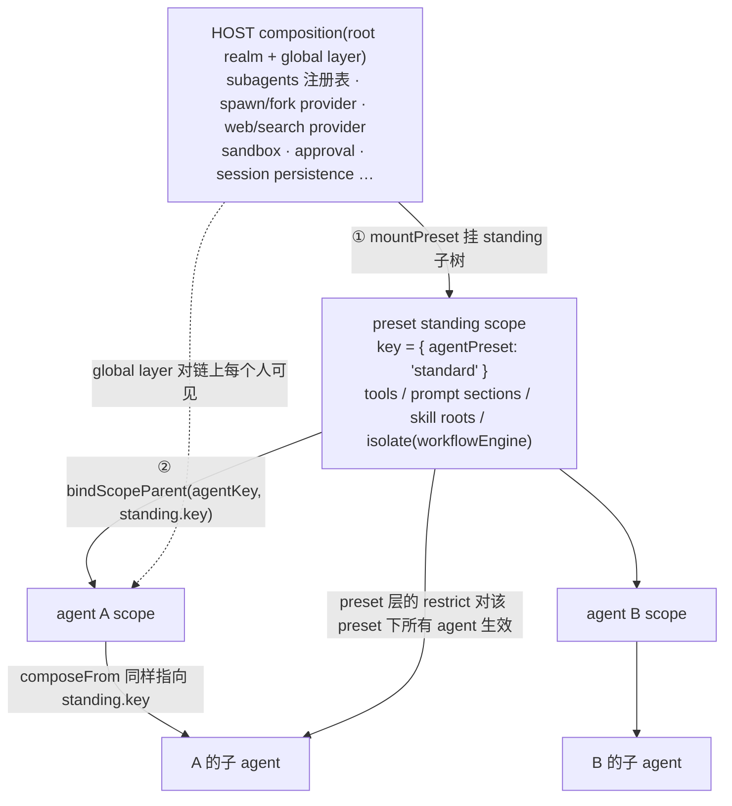

# 07 · preset 组合:roster → standing composition → agent join

> 源码:`packages/preset/agent-presets/src/preset.ts`(70 行)、`index.ts`(855 行)、`mount.ts`(433 行)、`discovery.ts`(343 行)
> 出货组合:`packages/preset/agent-presets/presets/standard/agent.cordis.yml`(255 行)
> 本章展开[第十章第七节](../10-multi-agent.md);preset 层与父链对子 agent 的后果见 [03](./03-child-agent-composition.md)。

---

## 第〇节 一句话结论

preset 是**每会话的 agent 组合**,不是"配置模板"。三段式:**① roster** 扫描若干 root,每个子目录一个 preset,id = 目录名(`discovery.ts` / `preset.ts:18`)→ **② standing composition** 把一个 preset 的 `cordis.yml` 挂成**一份进程内单例子树**,agent 靠"把自己的 scope 父键指向它"加入(`index.ts:769-817`)→ **③ agent join**:`mount`(新会话)或 `composeFrom`(子 agent 加入父正在跑的那一代)(`index.ts:436` / `477`)。

三段的统一判据是:**能力在 host 平面,授权在 preset 平面**——装了 provider 不给工具;preset 里少一行才是不给。

---

## 第一节 roster:根、id、信任

```typescript
// packages/preset/agent-presets/src/preset.ts:10-18
/**
 * Ids a preset directory may use.
 *
 * The id becomes a path segment, so this is a containment boundary rather than
 * a style rule: `..`, a separator, or an absolute-looking name would place the
 * composition outside the root the deployment authorised. Discovery shares it:
 * a directory whose name no copy could ever claim is not a preset slot.
 */
export const PRESET_ID = /^[a-z0-9][a-z0-9-]*$/
```

`PRESET_ID` 是**包含性约束**:因为 id 会成为路径段,`..`、分隔符或看起来像绝对路径的名字会把组合放到部署授权之外。discovery 共用同一个正则,所以"任何副本都声明不了的目录名"根本不是 preset 槽位。

信任只有两档(`preset.ts:3-8`):

| `PresetTrust` | 含义 |
|---|---|
| `system` | 随部署出货的 preset |
| `user` | 本地(人写的,或 agent 写的)preset——**因此携带与 shell 访问相同的信任** |

根的顺序在构造期一次性解析(`index.ts:181-185`):

```typescript
// packages/preset/agent-presets/src/index.ts:181-185
this.resolvedRoots = [
  ...config.includeShippedRoot ? [{ path: SHIPPED_PRESET_ROOT, trust: 'system' } satisfies PresetRoot] : [],
  ...config.roots,
  ...config.includeUserRoot ? [{ path: dshHomePath(USER_PRESET_DIR), trust: 'user' }] : [],
]
```

注释与 `Config` JSDoc(`preset.ts:57-69`)说明了两个开关的语义:`includeShippedRoot` 把随包出货的 preset **前置**为 `system` root(所以出货集合总能挂载,并在重名时胜出);`includeUserRoot` 把 harness home 的 `USER_PRESET_DIR` **后置**为 `user` root。

读取这两件事必须用 `get roots()`,**不是 `config.roots`**:

```typescript
// packages/preset/agent-presets/src/index.ts:501-510(节选)
/**
 * The roots this roster scans, which is not `config.roots`: the package's shipped root unless
 * `includeShippedRoot` is false, every configured root in order, then the harness-home user root
 * unless `includeUserRoot` is false. Read this — not the config field — to answer whether a roster
 * is composed at all, so one derivation decides it.
 */
get roots(): readonly PresetRoot[] { return this.resolvedRoots }
```

构造期还有一条 fail-loud:`ctx.baseUrl` 缺失直接抛(`index.ts:169-179`)。理由写在注释里:*without a base the roster can neither resolve a row nor tell a healthy preset from one naming a package that is gone, and the silent alternative is the exact failure this check exists to report*。

### 1.1 一个"坏 preset"仍在 roster 上

```typescript
// packages/preset/agent-presets/src/preset.ts:34-40
/**
 * Why this preset cannot compose a session, absent when it can. A broken
 * preset stays on the roster — hiding it would leave its directory blocking
 * the id with nothing to see or delete — but every mounting path refuses it
 * up front with this reason instead of failing deep inside the loader.
 */
readonly broken?: string
```

---

## 第二节 standing composition:一份进程内单例子树

```typescript
// packages/preset/agent-presets/src/index.ts:769-817(节选)
private async ensureStanding(preset: AgentPreset): Promise<StandingMount> {
  const pending = this.standing.get(preset.id)
  if (pending !== undefined) {
    const mounted = await pending
    // Files are the only composition editor (authoring is copy/delete), so
    // the stamp is what notices an edit: a changed file starts the next
    // generation here, for this and later sessions. An unreadable stamp
    // serves the current generation — a mount must survive its file
    // disappearing, and failing the session over a stat would not.
    const current = await compositionStamp(preset.path)
    if (current === undefined || sameStamp(mounted.stamp, current)) return mounted
    if (this.standing.get(preset.id) === pending) this.standing.delete(preset.id)
    return this.ensureStanding(preset)
  }
  const created = (async (): Promise<StandingMount> => {
    const key: ScopeKey = { agentPreset: preset.id }
    const scope = createScope(this.selfCtx, key)
    try {
      // Stamped before the file is read: an edit racing the mount makes the
      // stamp stale rather than silently current, so the next session
      // refreshes instead of trusting a composition older than its stamp.
      const stamp = await compositionStamp(preset.path)
      if (stamp === undefined) { throw new RemoteError('agent-preset/invalid', …) }
      await mountPreset(scope.ctx, preset)
      return { key, scope, stamp }
    } catch (error) {
      this.standing.delete(preset.id)
      await scope.dispose()
      throw error
    }
  })()
  this.standing.set(preset.id, created)
  return created
}
```

五个设计点:

1. **single-flight**(`standing: Map<string, Promise<StandingMount>>`,声明在 `:402-413`):两个 agent 同时首次使用同一 preset,共享同一份组合。
2. **失败可重试**:失败的 Promise 从 map 移除,文件被修好后下一次会话会重试。**已成功的世代一直服务到文件戳变化**。
3. **文件戳是唯一的编辑检测**(`compositionStamp` = `{mtimeMs, size}`,`:821-843`)。三条注释规则:**戳在文件读取之前打**(竞态中的编辑只会让戳变旧,不会静默变成当前);**戳不可读时继续服务当前世代**(挂载必须能挺过它的文件消失);**戳变化为之后创建的会话开下一代**。
4. **已加入旧世代的会话不回迁**:注释(`:406-411`)明确 *Sessions already joined keep the generation they run on; a superseded one is never disposed while the process lives (reclaimed only by whole-tree teardown)*。所以编辑文件的成本由**组合变更频率**上界,不由会话数上界。这里还有一条 TODO(`:780-788`):等最后一个加入该世代的 agent 消失后回收它——需要 `StandingMount` 上的 joined-agent 计数。
5. **`selfCtx` 而不是 `ctx`**(`:164-168`,`:190-191`):standing 子树必须挂在**未跟踪的原始 ctx** 上——否则 `ctx.effect` 会把 effect 记到 provider 影子 fiber 而不是每个 row 自己的 inject store,preset 行就会在它们自己声明的服务上失败。注释点名了 `jobs-local` 的 `selfCtx` 先例。

`StandingMount` 的形状(`:846-849`):`key`(agent 父链要指向的作用域键,**同时**是这个挂载的注册作用域)、`scope`(析构边界,整树 teardown 时才释放)、`stamp`。

---

## 第三节 挂载期两道硬门

```typescript
// packages/preset/agent-presets/src/mount.ts:378-433(节选)
export async function mountPreset(agentCtx: Context, preset: AgentPreset): Promise<void> {
  const scope = scopeOf(agentCtx)
  if (scope === undefined) {
    throw new Error(
      `agent-presets: refusing to mount preset "${preset.id}" into an unscoped context; `
      + 'its registrations would apply to every agent in the process')
  }
  const config: Include.Config = { path: pathToFileURL(preset.path).href }
  if (agentCtx.baseUrl !== undefined) harnessBase.set(config, agentCtx.baseUrl)
  pruneDisposedMounts()
  const handle = agentCtx.plugin(PresetTree, config)
  try {
    await handle.await()
    const subtree = mounted.get(config)
    const { tree, fiber } = subtree
    const unusable = inactiveRows(tree)
    if (unusable.length > 0) {
      throw new Error(`${String(unusable.length)} row(s) did not activate:\n${unusable.join('\n')}`)
    }
    const leaked = leakedServices(agentCtx, fiber)
    if (leaked.length > 0) {
      throw new Error(
        `row(s) published process-global service(s) [${leaked.join(', ')}]; `
        + 'a preset service must sit behind an `isolate` realm or move to the host composition')
    }
    mounts.add({ presetId: preset.id, fiber, tree, key: scopeOf(agentCtx) })
  } catch (error) {
    try { await handle.dispose() } catch { /* 只吞这棵子树的 teardown 失败;挂载错误才是可行动的那个 */ }
    const reason = `${mountDetail(error)} (${preset.path})`
    throw new RemoteError('agent-preset/invalid', `agent-presets: preset "${preset.id}" failed to mount: ${reason}`,
      { agentPreset: preset.id, reason }, { cause: error })
  }
}
```

### 3.1 门零:无 scope 即拒

`:379-385`。理由直接写在文案里:*its registrations would apply to every agent in the process*。

### 3.2 门一:`inactiveRows` —— 有行永远未激活则整树拒绝

```typescript
// packages/preset/agent-presets/src/mount.ts:304-322(节选)
export function inactiveRows(tree: EntryTree): string[] {
  const lines: string[] = []
  for (const entry of tree.entries()) {
    if (entry.disabled) continue
    const fiber = entry.fiber
    if (fiber === undefined) { lines.push(`${entry.options.id} (${entry.options.name}): never started`); continue }
    const missing = Object.keys(fiber.inject).filter(name => fiber.ctx.get(name) === undefined)
    if (missing.length > 0) {
      lines.push(`${entry.options.id} (${entry.options.name}): waiting for ${missing.join(', ')}`)
    }
  }
  return lines
}
```

JSDoc(`:295-303`)界定了它捕获的**唯一**残余类别:模块导入失败或插件抛错已经在 loader 层拒绝了挂载;这里剩下的是**仍在等一个这个组合永远不提供的服务的行**。`disabled: true` 的行被显式跳过——这正是出货 yml 里 `tool-subagent-codex` / `tool-subagent-claude-code` 那两行的用法(见第五节)。

### 3.3 门二:`leakedServices` —— 有行把服务发布到 root realm 则整树拒绝

```typescript
// packages/preset/agent-presets/src/mount.ts:210-224
export function leakedServices(ctx: Context, mount: Fiber): string[] {
  const store = ctx.reflect.store
  const rootIsolate = ctx.root[Context.isolate]
  const leaked: string[] = []
  for (const key of Object.getOwnPropertySymbols(store)) {
    const impl = store[key]
    if (impl === undefined) continue
    if (!withinFiber(impl.fiber, mount)) continue
    if (rootIsolate[impl.name] === key) leaked.push(impl.name)
  }
  return leaked.sort((left, right) => left.localeCompare(right))
}
```

判据是**符号身份**:一个 provider 若没有 `isolate` realm,就把实现存在 root realm 的符号下——那正是这里的比较(`:199-205` 的 JSDoc);一个在 `isolate` realm 里的 provider 存在 realm 私有符号下,因此正确地不在这里出现。

被拒绝的语义是:**那是进程全局,而不是每会话**。修复方式两条:放进 `isolate` realm,或搬到 host composition(`:408-412` 的文案原文)。

`withinFiber`(`:189-196`)用 **fiber 对象身份**做成员判断,`serviceForAgent`(`:277-293`)是这条关系的**反向读取**:给定 ctx 与 agent,找出这个子树发布过的、名字匹配的**那一个**实现——用于"请求是关于某会话、但从会话外到达"的场景(每个浏览器 RPC)。它的 JSDoc 明确限定:*This is READ addressing for a caller that already holds the agent. It is not a general host handle on a session's internals*(`:268-271`)。

### 3.4 失败的收敛方式

三件事按顺序:整树 `dispose`(失败只吞子树 teardown,因为挂载错误才是可行动的那个)→ 拼出带 preset 路径与逐行原因的 `reason` → 抛 `RemoteError('agent-preset/invalid')`(`:415-432`)。`mountDetail` 与 `detailBranches`(`:338-368`)专门处理"误差链上的分支名不齐"的问题,尤其是被 loader 包装过的 `AggregateError`——那种形状会让一个失败的 group 只报 *loader entries failed to apply* 而不点出任何失败的行。

---

## 第四节 两个加入点:`mount` 与 `composeFrom`

```typescript
// packages/preset/agent-presets/src/index.ts:436-449(节选)
async mount(agentCtx: Context, id?: string): Promise<AgentPreset> {
  const agentKey = scopeOf(agentCtx)
  if (agentKey === undefined) {
    throw new Error('agent-presets: refusing to compose an unscoped context; the scope key is what joins an agent to its preset')
  }
  const preset = await this.resolveMountable(id)
  const standing = await this.ensureStanding(preset)
  // The one bind of this agent's ancestry. The binding is the only re-link authority,
  // held privately so nothing outside this roster can move a composed agent to another preset.
  this.bindings.set(agentKey, bindScopeParent(agentKey, standing.key))
  return preset
}
```

```typescript
// packages/preset/agent-presets/src/index.ts:477-486(节选)
composeFrom(agentCtx: Context, parentCtx: Context): string | undefined {
  const agentKey = scopeOf(agentCtx)
  if (agentKey === undefined) { throw new Error('agent-presets: refusing to compose an unscoped context; …') }
  const standing = standingMountFor(parentCtx)
  if (standing === undefined) return undefined
  this.bindings.set(agentKey, bindScopeParent(agentKey, standing.key))
  return standing.presetId
}
```

| 维度 | `mount` | `composeFrom` |
|---|---|---|
| 谁调用 | 新会话的 setup(以及 `recompose`) | 子 agent 的创建窗口(`applyChildComposition`,`child-agent.ts:204`) |
| 是否读 roster | 读(`resolveMountable`) | **不读** |
| 是否可能挂载 | 可能(`ensureStanding`) | **不会** |
| 是否可能失败 | 会(未知 id / 组合不可用) | 只拒调用者错误(无 scope / 已加入过) |
| 是否 async | `async` | **同步** |
| 语义 | 按 id 解析**当前**世代 | 加入父**正在跑的那一代实例** |

`composeFrom` 的 JSDoc 把"按实例而非按 id"的理由写死了(`:451-471`):

> *Re-resolving the parent's preset by id instead would re-read the roster, and a composition file edited since the parent started would hand the child a DIFFERENT generation than the one its parent's history was produced under (and a preset deleted since would fail the child outright while its parent keeps running).*

而"同步、且自身没有组合失败模式"是它能被用于**同步 `setup`** 的原因。

### 4.1 `bindings` 是唯一的重连权威

```typescript
// packages/preset/agent-presets/src/index.ts:415-421
/**
 * Parent bindings of the agents this roster composed, keyed by the agent's
 * scope key. The binding is dsh-scope's only re-link capability; holding it
 * here makes this service the sole authority that can move an agent between
 * standing compositions. WeakMap: entries die with their agents.
 */
private readonly bindings = new WeakMap<ScopeKey, ScopeParentBinding>()
```

`bindScopeParent`(`packages/core/scope/src/index.ts:72`)在整仓里**唯一的调用方**就是这两个方法加上 `recompose`。所以"一个 agent 属于哪个 preset"这件事只有 roster 能改。

### 4.2 rosterless 部署:没有 join 也不是错误

`composeFrom` 在父没有 join 时**返回 `undefined` 而不报错**(`:483`)。JSDoc 解释:*A parent that joined no preset — a rosterless deployment — yields no join and no error: there, the model-facing rows sit in the host composition and the child already sees them through the global layer*(`:469-471`)。

对应的告警在构造期(不是硬门):

```typescript
// packages/preset/agent-presets/src/index.ts:218-226(节选)
ctx.on('agent/created', ({ agent }) => {
  if (this.resolvedRoots.length === 0) return
  if (this.composedPreset(agent.ctx) !== undefined) return
  ctx.logger.warn(
    `agent "${agent.id}" was published without joining an agent preset; `
    + 'its tools, prompt sections, and skill catalog resolve against the empty global layer …')
})
```

注释(`:206-217`)解释了为什么这里是 **warn 而不是 throw**:一个同步的 `agent/created` 监听器抛错会**否决发布**,而这个服务不该这么做——在 roster 之外组合 agent 是合法的(`recompose` 绑定的正是这种裸 agent,ACP、SDK-server、headless 入口也都创建它)。真正 fail-loud 的检查放在 invariant 伴生件里,在装配期执行。

---

## 第五节 delegation 段:真实出货配置

```yaml
# packages/preset/agent-presets/presets/standard/agent.cordis.yml:158-235(节选)
# The `subagents` registry and its spawn/fork backends live in the HOST
# composition: the registry is a process singleton whose cross-session queries
# the api-proxy serves to the browser, and a provider name may only be
# registered once. This preset contributes the delegation TOOLS, which resolve
# that host registry.
#
# `workflows` is different — nothing outside an agent reads it — so every row
# that reaches it shares one entry-local realm here, and a consumer left
# outside would resolve a host registry this preset does not populate.
- id: delegation
  name: cordis:group
  group: true
  isolate:
    workflowEngine: true                     # workflow 引擎只在 agent 平面内
  config:
    - id: tool-subagent-control
      name: '@deepseek-ai/dsh-tool-subagent-control'

    - id: tool-subagent-list-agents
      name: '@deepseek-ai/dsh-tool-subagent-control/list-agents'

    - id: tool-subagent
      name: '@deepseek-ai/dsh-tool-subagent'
      config:
        provider: spawn
        toolName: subagent
        modelSelectionSettings: true
        backgroundMode: continuable

    # Fork omits model selection so provider/model stay equal to the parent and
    # the inherited history remains eligible for KV Cache reuse. This preset
    # keeps fork continuable; parent and child inherit the same messaging tool,
    # while the parent id and return guidance follow the inherited history.
    - id: tool-subagent-fork
      name: '@deepseek-ai/dsh-tool-subagent'
      config:
        provider: fork
        toolName: subagent_fork
        backgroundMode: continuable

    # Production dsh does not install these optional providers. Install the
    # matching Bundle in this Profile and restart the Host, then copy this
    # preset and remove `disabled` from the matching tool row. Host availability
    # alone grants no tool.
    - id: tool-subagent-codex
      name: '@deepseek-ai/dsh-tool-subagent'
      disabled: true
      config: { provider: codex, toolName: subagent_codex, backgroundMode: one-shot, maxDepth: provider-managed }

    - id: tool-subagent-claude-code
      name: '@deepseek-ai/dsh-tool-subagent'
      disabled: true
      config: { provider: claude-code, toolName: subagent_claude_code, backgroundMode: one-shot, maxDepth: provider-managed }

    - id: workflow-worker-thread
      name: '@deepseek-ai/dsh-workflow-worker-thread'
      config: { provider: spawn }

    - id: tool-workflow
      name: '@deepseek-ai/dsh-tool-workflow'

    - id: tool-ralph
      name: '@deepseek-ai/dsh-tool-ralph'
      config: { subagentProvider: spawn, maxRounds: 64 }
```

要点逐条:

1. **`group: true` + `isolate: { workflowEngine: true }`** 把整段放进一个 entry-local realm。判据在注释里:`subagents` 注册表是进程单例、且 provider 名只能注册一次 → 留在 **HOST composition**;`workflowEngine` 无人跨会话读取 → 放进 entry-local realm。
2. **`tool-subagent` 的四行配置**决定模型看到几条工具:`toolName` 决定名字,`provider` 决定后端,`modelSelectionSettings` 决定是否暴露模型选择,`backgroundMode: continuable` 决定默认调度(见 [06 第七节](./06-jobs-and-notifications.md))。
3. **fork 刻意不开 `modelSelectionSettings`**:让 provider/model 与父一致,继承前缀才能命中 KV Cache。
4. **`disabled: true` 的两行是"可用但未授权"的样板**。文案写得很直白:*Install the matching Bundle in this Profile and restart the Host, then copy this preset and remove `disabled` from the matching tool row. **Host availability alone grants no tool.*** 这两行同时说明 `inactiveRows` 为什么必须跳过 `disabled` 的行——否则一个"故意禁用"的 preset 会被判为整树不可用。
5. **`tool-subagent-control` 与 `tool-subagent-control/list-agents` 是两行**:前者给 `send_message`/`interrupt_agent`,后者给 `list_agents`。分开成两个入口意味着**可以只给控制不给发现**(或反过来)。
6. `maxDepth: provider-managed` 出现在 codex / claude-code 两行:外部 CLI 后端不实现 `depthLimit` 能力,所以工具侧必须显式声明放弃这条校验(见 [02 第一节](./02-subagent-seam-and-providers.md))。

---

## 第六节 可见性规则:preset 层 vs 全局层



规则三条(推导见 [03 第五节](./03-child-agent-composition.md)):

1. **global 层对每个 agent 可见**——它是 `view()` 里那个起点(`packages/core/tools/src/index.ts:1149`)。所以"host 装了能力"是**所有**会话都能看到该工具的必要条件,但**不是充分条件**:preset 里还得有那一行 Consumer。这就是 yml 里 *Host availability alone grants no tool* 的含义。
2. **preset 层的注册对该 preset 下的每个 agent(含其子)可见**,并参与链上限制求交(`tools/index.ts:1164` 的 `layers.every(layer => layer.admits(name))`)。preset 层若 `restrict` 掉某工具,该 preset 下没有任何 agent 能看到它。
3. **agent 私有层的注册(ACP 的 MCP 客户端、子 agent 自己的 `structured_output` 工具、`toolFilter` 掩码)** 只属于那个 agent,不进 preset 层,**因此不被子 agent 继承**。

技能同规则:`SkillRegistry` 用同一套 `ScopedLayers` 按 scope 链合并(`packages/skill/skill/src/index.ts:362,441-470`);preset 里的文件系统 skill 行把 skill 注册进该 preset 的层,所以同 preset 下父子共享同一份目录。

### 6.1 recompose:换 preset 的重连

`recompose(agentCtx, id)`(`index.ts:672-716`)与 `select(agent, agentPreset)`(`:717-730`)/`swap`(`:731-762`)构成"空会话上换 preset"的路径,实际动作就是通过 `bindings` 把 agent 的 scope 父键**重连**到另一个 standing key。`standingsKeyFor(id?)`(`:763-766`)把"某个 preset 的 standing key"暴露给需要按 registry view scope 读取的调用者。

**换 preset 只对空会话合法**——`childSessionMeta` 读 `composedPreset(parent.ctx)` 而非 header,正是为了让子 agent 拿到父**实际**在跑的那一代(见 [03 第三节](./03-child-agent-composition.md))。

---

## 第七节 关键文件/符号索引表

（下表中的 `index.ts` / `mount.ts` / `preset.ts` 均指 `packages/preset/agent-presets/src/` 下的同名文件。）

| 符号 | 位置 | 职责 |
|---|---|---|
| `PRESET_ID` / `PresetTrust` | `packages/preset/agent-presets/src/preset.ts:18` / `8` | 路径包含边界;`system` / `user` 两档信任 |
| `AgentPreset` / `PresetRoot` / `Config` | `preset.ts:21-41` / `44-49` / `52-70` | `broken?`;根的信任;两个 include 开关 |
| `AgentPresets` 构造 | `agent-presets/src/index.ts:166-234` | `baseUrl` fail-loud;`resolvedRoots` 三段拼接;settings 注入;`agent/created` 告警 |
| `roots` / `authorable` / `defaultId` | `index.ts:508-515` / `243-248` | 读派生结果而非 config 字段;`selectionPolicy()` |
| `list` / `remoteExportList` / `compositionInventory` | `index.ts:265-267` / `278-...` / `315-...` | roster 与组合清单 |
| `resolve` / `resolveMountable` | `index.ts:365-...` / `390-400` | 解析与"可挂载性"前置拒绝 |
| `mount` / `composeFrom` / `composedPreset` | `index.ts:436-449` / `477-486` / `497-499` | 确保 standing → 一次 bind;按**实例**加入父世代(同步);读 scope 链 |
| `bindings` | `index.ts:415-421` | WeakMap;dsh-scope 唯一重连能力的私有持有者 |
| `recompose` / `select` / `swap` / `standingKeyFor` | `index.ts:672-716` / `717-730` / `731-762` / `763-766` | 空会话换 preset 的重连路径 |
| `ensureStanding` / `compositionStamp` / `sameStamp` / `StandingMount` | `index.ts:769-817` / `829-843` / `846-849` | single-flight;文件戳代际;失败可重试 |
| `mountPreset` | `mount.ts:378-433` | 门零无 scope 拒绝 + 两道硬门 + 整树 dispose + `agent-preset/invalid` |
| `inactiveRows` / `leakedServices` | `mount.ts:304-322` / `210-224` | 跳过 `disabled`;按符号身份判 root realm 泄漏 |
| `withinFiber` / `serviceForAgent` | `mount.ts:189-196` / `277-293` | fiber 身份成员判断;反向读地址 |
| `standingMountFor` / `livePresetMounts` / `pruneDisposedMounts` | `mount.ts:243-251` / `173-...` / `156-...` | 用 agent 的 **scope 父键**定位 standing 组合 |
| `mountDetail` / `detailBranches` | `mount.ts:355-368` / `338-341` | 渲染误差链分支(含被包装的 `AggregateError`) |
| `presets/standard/agent.cordis.yml` | 第 158-235 行 | delegation 组、`isolate` 边界、host/agent 平面分工、`disabled` 样板 |
| `ToolRegistry.view` | `packages/core/tools/src/index.ts:1142-1173` | global → 链上逐层 → own layer;链上限制求交 |
