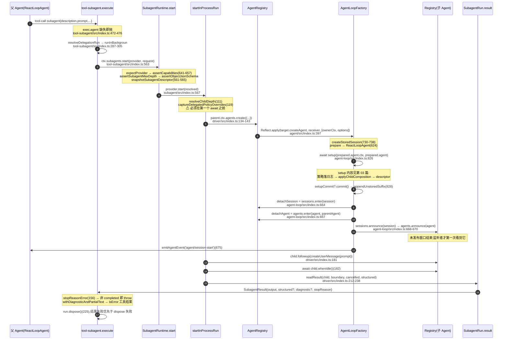

# Multi-Agent 模块 · 深度展开文档集

> 分析对象:[innokria/deepseek-harness](https://github.com/innokria/deepseek-harness) @ `dbbaa4a37`
> 本目录是[第十章 · Multi-Agent 机制与实现细节](../10-multi-agent.md)的**函数级展开**,不重复其结论,只补函数体、行号与失败语义。
> 所有引用均为 `仓库相对路径:行号`,未修改仓库任何文件。

---

## 一、本目录解决什么问题

第十章回答了"DSH 的多 agent 是什么、怎么分层";本目录回答**打开源码时仍会卡住的那些问题**:

| 卡点 | 去哪一篇 |
|---|---|
| `ctx.agents.create()` 到底在哪几行把 session / agent 变成"活"的?谁有权拆掉它? | [01](./01-agent-registry-and-lifecycle.md) |
| `withInitiator` 是授权吗?为什么到处都是显式 `parent` 字段? | [01](./01-agent-registry-and-lifecycle.md) |
| `ctx.subagents.start()` 在调 provider 之前做了几次校验?provider 抛错时调用者手上有什么? | [02](./02-subagent-seam-and-providers.md) |
| spawn 和 fork 只差一个 `seed`,那 `prepareContinuable` 为什么必须两个都实现? | [02](./02-subagent-seam-and-providers.md) |
| 子 agent 的"世界"(工具面、提示段、persona、沙箱策略)是按什么顺序装起来的? | [03](./03-child-agent-composition.md) |
| 为什么父 agent 自己注册的 MCP 工具,**不会**被它的子 agent 继承? | [03](./03-child-agent-composition.md) |
| `send_message` 给一个已经不在内存里的子 agent,会发生什么? | [04](./04-continuation-and-control.md) |
| `interrupt_agent` 到底停掉了什么、没停掉什么? | [04](./04-continuation-and-control.md) |
| workflow 的 `agent()` 失败为什么有时整脚本炸、有时只是那项变 `null`? | [05](./05-workflow-worker-thread.md) |
| worker 线程 + `vm` 是安全边界吗?能挡住什么? | [05](./05-workflow-worker-thread.md) |
| 后台 job 完成的通知为什么会"自己"开一个 turn?会不会无限自激? | [06](./06-jobs-and-notifications.md) |
| `job_kill` 返回 `requested` 之后,进程保证做了什么? | [06](./06-jobs-and-notifications.md) |
| 编辑 preset 的 `agent.cordis.yml`,对正在跑的会话和已经 spawn 的子 agent 各有什么影响? | [07](./07-preset-composition.md) |

---

## 二、模块索引

| 篇 | 主题 | 主要源码 |
|---|---|---|
| [01](./01-agent-registry-and-lifecycle.md) | Agent 注册表与生命周期 | `packages/core/agent/src/index.ts`、`runtime-types.ts`、`packages/core/agent-loop/src/index.ts` |
| [02](./02-subagent-seam-and-providers.md) | 能力缝与 provider | `packages/subagent/subagent/src/{index,types}.ts`、`subagent-in-process-driver/src/index.ts`、`subagent-spawn-in-process/src/index.ts`、`subagent-fork-in-process/src/index.ts` |
| [03](./03-child-agent-composition.md) | 子 Agent 的"世界"组装 | `packages/subagent/subagent/src/child-agent.ts`、`depth.ts`、`descriptor.ts` |
| [04](./04-continuation-and-control.md) | 续存与管控 | `packages/subagent/subagent/src/{continuation,continuation-activation,control,list-children,assistant-output}.ts`、`tool-subagent-control/src/{index,list-agents}.ts` |
| [05](./05-workflow-worker-thread.md) | workflow 引擎 | `packages/workflow/workflow-worker-thread/src/{index,runtime,host,realm,protocol}.ts`、`packages/workflow/workflow/src/index.ts` |
| [06](./06-jobs-and-notifications.md) | jobs 与完成通知 | `packages/jobs/jobs/src/index.ts`、`jobs-local/src/index.ts`、`tool-jobs/src/index.ts` |
| [07](./07-preset-composition.md) | preset 组合 | `packages/preset/agent-presets/src/{index,mount,preset}.ts`、`presets/standard/agent.cordis.yml` |

---

## 三、父 Agent → 派生子 Agent → 结果回流:函数级调用栈


<details><summary>Mermaid 源码</summary>



</details>

同一份调用栈在**后台/续存路线**上的分叉点(详见 [04](./04-continuation-and-control.md) 与 [06](./06-jobs-and-notifications.md)):

```text
tool-subagent.execute                                       (tool-subagent/src/index.ts:471)
 ├─ continuable → ctx.subagents.startContinuable       (:530)
 │                 └─ SubagentContinuationManager.startContinuable  (continuation.ts:102)
 │                      └─ ContinuableActivationRegistry.materialize (continuation-activation.ts:458)
 │                           └─ ctx.agents.create(...)  ← 与前台同一条创建事务
 ├─ one-shot 后台 → ctx.jobs.start({kind:'subagent', owner:parent, run})  (:544)
 │                 └─ LocalJobRegistry.start           (jobs-local/src/index.ts:131)
 │                      └─ run() 里仍调用 ctx.subagents.start(...)  (:550)
 └─ 前台       → ctx.subagents.start(provider, {...request, signal})      (:563)
```

**回流只有两条路**:前台是 `SubagentRun.result` → 工具结果;后台是 `JobHooks.done` → `onJobDone` → `owner.followup`/`owner.inject`(`tool-jobs/src/index.ts:278-299`)。两者不共享代码路径,共享的只是"造 Agent"这一步。

---

## 四、与第十章的分工

| 维度 | 第十章(`10-multi-agent.md`) | 本目录 |
|---|---|---|
| 粒度 | 分节综述 + 关键片段摘录 | 逐函数走查,细到错误码与失败分支 |
| 视角 | "为什么这样设计"(设计意图、取舍、对比) | "代码怎么走"(调用序、校验序、回滚序) |
| 图 | 1 张总览 ASCII 图 | 每篇 ≥1 张 mermaid/ASCII 图,共 7 张以上 |
| 重复处理 | — | 本章已有的结论**只引用不复述**;凡是第十章已给出的代码块,本目录只在需要展开其内部时重贴 |
| 新增覆盖 | — | `enter`/`announce` 的 reentrancy 规则、`agent/disposed` 配对、`detachRequested`;provider 能力位逐项;`scope 父链 → preset standing key` 的后果推演;`coldResume` 的授权阶梯;worker 的 slot/waiter/terminate 三态;`jobs` 的 `servesOwner` 与 layer 化监听;preset 的两道硬门逐行 |

读法建议:**先读第十章建立心智模型,再用本目录下钻到你要改/要调试的那个函数。**

---

## 五、全模块不变量速查

这七篇展开后反复出现的不变量,先列在这里:

1. **创建即事务**:`setup` 期间 agent/session 都未发布;`setup` 抛错、commit 抛错、owner 销毁三者任一发生,都回滚且不发布任何 id(`packages/core/agent/src/index.ts:100-118`)。
2. **所有权是能力**:`AgentHandle.dispose` 只交给创建者;`ctx.agents.get(id)` 只返回裸 `Agent`(`packages/core/agent/src/index.ts:146-163`)。
3. **存在 ≠ 授权**:`withInitiator` 只做进程内因果归属,跨边界一律显式传主体(`packages/core/agent/src/index.ts:319`)。
4. **能力先声明后校验**:provider 的 `capabilities` 五元组在 `start()` 里逐项 fail-loud,绝不"接受后忽略"(`packages/subagent/subagent/src/index.ts:641-657`)。
5. **子 agent 继承的是 preset standing 层,不是父 agent 自己的 scope 层**(`packages/preset/agent-presets/src/mount.ts:243-251`)。
6. **委派策略在第一个 await 之前捕获**,并以 `source:'delegation'` 写进子会话日志(`child-agent.ts:242-268`)。
7. **致命错误上抛,普通失败降级**:workflow 的 `parallel`/`pipeline` 只把普通异常降为 `null`(`runtime.ts:414-425,444-458`)。
8. **结算 first-wins,通知最后发**:`settle()` 先提交记录、释放 waiter,再通知监听者(`jobs-local/src/index.ts:416-440`)。
9. **preset 挂载两道硬门**:有行未激活整树拒绝;有行把服务发布到 root realm 整树拒绝(`mount.ts:403-413`)。

---

## 六、关键文件/符号索引表

| 文件 | 符号 | 本目录中的角色 |
|---|---|---|
| `packages/core/agent/src/index.ts` | `AgentRegistry.create/resume` `enter` `announce` `withInitiator` | 创建入口与所有权 |
| `packages/core/agent/src/runtime-types.ts` | `Agent`(运行面)、`Inbox`、`agent/*` 事件 | Agent 公开契约 |
| `packages/core/agent-loop/src/index.ts` | `createAgent` `resumeWith` `setupAndPublish` `prepare` | 发布事务 |
| `packages/core/agent-loop/src/agent.ts` | `ReactLoopAgent`(scope、followup/steer/inject) | 驱动实现 |
| `packages/subagent/subagent/src/index.ts` | `SubagentRuntime.start/startContinuable/sendMessage/interrupt` | 能力缝 Service Definition |
| `packages/subagent/subagent/src/types.ts` | `SubagentProvider` `SubagentStartRequest` `SubagentResult` `SubagentRun` | 全字段契约 |
| `packages/subagent/subagent-in-process-driver/src/index.ts` | `startInProcessRun` `drivePublishedRun` `readResult` | 一次性驱动 |
| `packages/subagent/subagent/src/child-agent.ts` | `applyChildComposition` `captureDelegatedPolicyOverrides` `childSessionMeta` | 子世界组装 |
| `packages/subagent/subagent/src/continuation.ts` | `startContinuable` `sendMessage` `coldResume` | 续存编排 |
| `packages/subagent/subagent/src/continuation-activation.ts` | `materialize` `interrupt` `submitAdmitted` | Activation 图 |
| `packages/subagent/tool-subagent-control/src/list-agents.ts` | `statusOf` | 状态读取 |
| `packages/workflow/workflow-worker-thread/src/runtime.ts` | `agent` `parallel` `pipeline` `acquireSlot` | 脚本钩子 |
| `packages/workflow/workflow-worker-thread/src/host.ts` | `WorkerRun.startChild/cancel/dispose/onResult` | 宿主侧 RPC |
| `packages/jobs/jobs-local/src/index.ts` | `start` `kill` `wait` `settle` `servesOwner` | 本地实现 |
| `packages/jobs/tool-jobs/src/index.ts` | `job_output` `job_kill` `onJobDone` 唤醒预算 | 模型侧消费 |
| `packages/preset/agent-presets/src/index.ts` | `mount` `composeFrom` `ensureStanding` | preset 组合 |
| `packages/preset/agent-presets/src/mount.ts` | `mountPreset` `inactiveRows` `leakedServices` `standingMountFor` | 两道硬门 |
